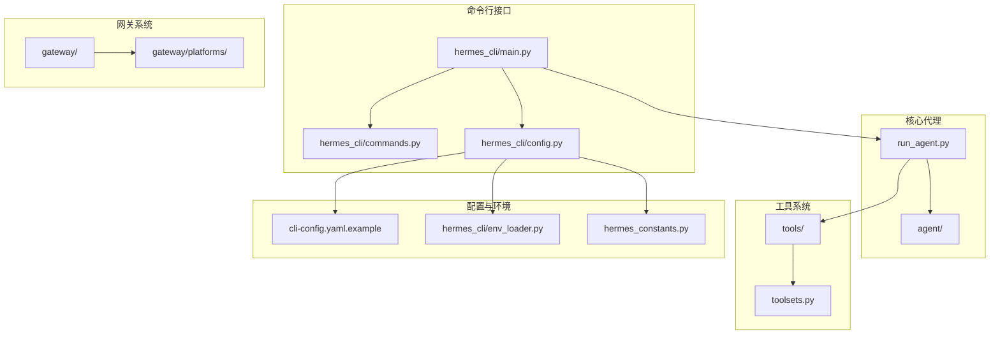
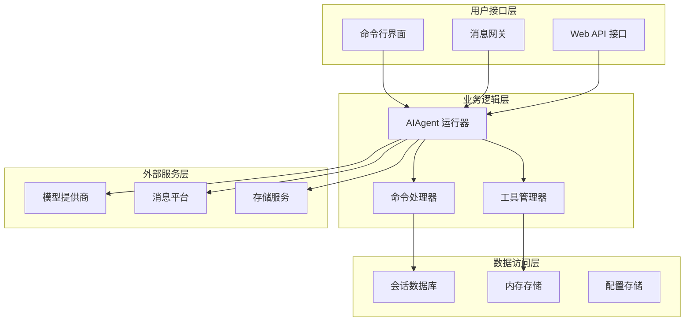
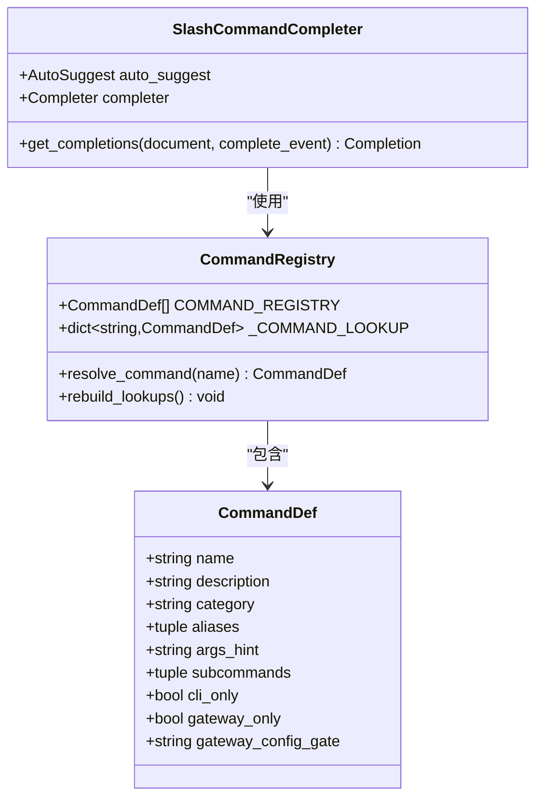
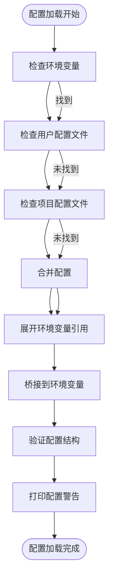
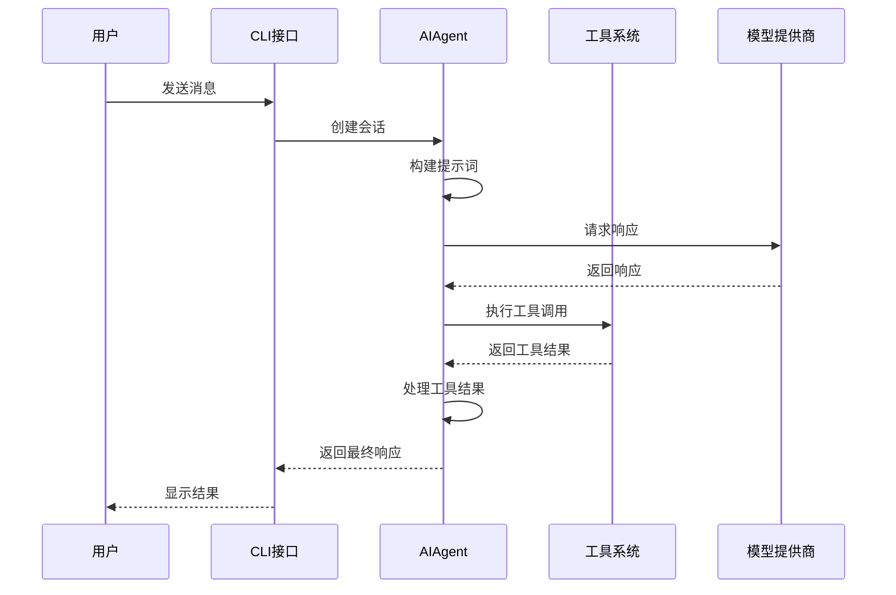

# API参考手册

<cite>
**本文档引用的文件**
- [README.md](file://README.md)
- [pyproject.toml](file://pyproject.toml)
- [hermes_cli/main.py](file://hermes_cli/main.py)
- [cli.py](file://cli.py)
- [hermes_cli/commands.py](file://hermes_cli/commands.py)
- [hermes_cli/config.py](file://hermes_cli/config.py)
- [cli-config.yaml.example](file://cli-config.yaml.example)
- [hermes_constants.py](file://hermes_constants.py)
- [hermes_cli/auth.py](file://hermes_cli/auth.py)
- [run_agent.py](file://run_agent.py)
- [.plans/openai-api-server.md](file://.plans/openai-api-server.md)
- [website/docs/reference/environment-variables.md](file://website/docs/reference/environment-variables.md)
- [website/docs/user-guide/configuration.md](file://website/docs/user-guide/configuration.md)
- [website/docs/user-guide/cli.md](file://website/docs/user-guide/cli.md)
- [website/docs/reference/toolsets-reference.md](file://website/docs/reference/toolsets-reference.md)
</cite>

## 目录
1. [简介](#简介)
2. [项目结构](#项目结构)
3. [核心组件](#核心组件)
4. [架构概览](#架构概览)
5. [详细组件分析](#详细组件分析)
6. [依赖分析](#依赖分析)
7. [性能考虑](#性能考虑)
8. [故障排除指南](#故障排除指南)
9. [结论](#结论)
10. [附录](#附录)

## 简介
Hermes Agent 是一个由 Nous Research 开发的自学习 AI 助手，具备内置的学习循环能力——它能从经验中创建技能、在使用过程中改进这些技能，并持续积累知识。该系统支持多种部署方式：可在 $5 的 VPS 上运行，也可在 GPU 集群或几乎闲置时成本极低的无服务器基础设施上运行。它不局限于笔记本电脑，可以在 Telegram、Discord、Slack、WhatsApp、Signal 等平台上与用户交流。

Hermes Agent 的主要特性包括：
- 实时终端界面：全功能 TUI，支持多行编辑、斜杠命令自动补全、对话历史、中断重定向以及工具输出流式传输
- 多平台存在：Telegram、Discord、Slack、WhatsApp、Signal 和 CLI，均由单一网关进程支持。支持语音备忘录转录、跨平台对话连续性
- 自闭合学习循环：代理式记忆与定期提醒；复杂任务后自主创建技能；技能在使用过程中自我改进；基于 FTS5 的会话搜索与 LLM 摘要实现跨会话回忆
- 计划自动化：内置调度器，可向任何平台投递定时任务。每日报告、夜间备份、每周审计等，全部以自然语言形式无人值守执行
- 委托与并行化：为并行工作流生成隔离的子代理；通过 RPC 调用工具编写 Python 脚本，将多步骤管道压缩为零上下文成本的回合
- 随处运行：支持六种终端后端（本地、Docker、SSH、Daytona、Singularity、Modal）。Daytona 和 Modal 提供无服务器持久性——代理环境在空闲时休眠，按需唤醒，会话间成本几乎为零
- 研究就绪：支持批量轨迹生成、Atropos RL 环境、轨迹压缩用于训练下一代工具调用模型

## 项目结构
该项目采用模块化设计，主要目录结构如下：
- hermes_cli：命令行接口入口点和相关命令实现
- agent：核心代理逻辑、工具系统、内存管理等
- tools：各种工具的实现，如终端工具、浏览器工具、文件操作工具等
- gateway：消息网关平台适配器，支持多种消息平台
- cron：计划任务调度系统
- acp_adapter：ACP（Agent 客户端协议）适配器
- optional-skills：可选技能集合
- plugins：插件系统
- skills：内置技能库
- tests：全面的测试套件



**图表来源**
- [hermes_cli/main.py:1-100](file://hermes_cli/main.py#L1-L100)
- [run_agent.py:1-100](file://run_agent.py#L1-L100)
- [hermes_cli/commands.py:1-100](file://hermes_cli/commands.py#L1-L100)

**章节来源**
- [README.md:1-179](file://README.md#L1-L179)
- [pyproject.toml:112-121](file://pyproject.toml#L112-L121)

## 核心组件

### CLI 命令系统
Hermes Agent 提供了丰富的命令行接口，支持交互式聊天、网关管理、配置设置等多种功能。

主要命令类别：
- **聊天相关**：`hermes` 启动交互式聊天，支持会话管理、模型切换、工具配置
- **网关管理**：`hermes gateway` 支持启动、停止、状态检查、安装服务等
- **配置管理**：`hermes config` 支持查看、编辑、设置配置项
- **工具管理**：`hermes tools` 支持启用/禁用工具，查看工具集
- **技能管理**：`hermes skills` 支持搜索、安装、管理技能
- **系统管理**：`hermes setup` 运行设置向导，`hermes doctor` 诊断问题

每个命令都支持详细的帮助信息和参数说明。

**章节来源**
- [hermes_cli/main.py:1-80](file://hermes_cli/main.py#L1-L80)
- [hermes_cli/commands.py:56-162](file://hermes_cli/commands.py#L56-L162)

### 配置管理系统
配置系统采用 YAML 文件格式，支持用户配置和环境变量两种方式：

核心配置文件：
- `~/.hermes/config.yaml`：主配置文件，存储所有设置
- `~/.hermes/.env`：环境变量文件，存储 API 密钥和敏感信息

配置优先级：
1. 环境变量（最高优先级）
2. 用户配置文件（~/.hermes/config.yaml）
3. 项目默认配置
4. 环境变量文件（最低优先级）

**章节来源**
- [hermes_cli/config.py:1-200](file://hermes_cli/config.py#L1-L200)
- [cli-config.yaml.example:1-800](file://cli-config.yaml.example#L1-L800)

### 工具系统
Hermes Agent 提供了丰富的工具集，支持文件操作、网络访问、终端执行、图像生成等多种功能：

主要工具类别：
- **Web 工具**：网页搜索、内容提取
- **文件工具**：文件读写、搜索、补丁
- **终端工具**：命令执行、进程管理
- **视觉工具**：图像分析、截图分析
- **通信工具**：消息发送、通知
- **媒体工具**：文本转语音、音频处理

工具集预设：
- `hermes-cli`：完整的工具集，适用于交互式 CLI 会话
- `hermes-telegram`：适用于 Telegram 平台的工具集
- `safe`：仅包含安全工具的受限集合

**章节来源**
- [website/docs/reference/toolsets-reference.md:85-111](file://website/docs/reference/toolsets-reference.md#L85-L111)
- [cli-config.yaml.example:578-631](file://cli-config.yaml.example#L578-L631)

## 架构概览

Hermes Agent 采用分层架构设计，各组件职责明确：



**图表来源**
- [run_agent.py:1-200](file://run_agent.py#L1-L200)
- [hermes_cli/main.py:676-784](file://hermes_cli/main.py#L676-L784)

系统的核心流程包括：
1. 用户输入通过 CLI 或网关进入系统
2. 命令处理器解析和验证用户指令
3. AIAgent 运行器协调模型调用和工具执行
4. 工具管理器执行具体的操作
5. 结果通过相应的接口返回给用户

**章节来源**
- [run_agent.py:1-200](file://run_agent.py#L1-L200)
- [hermes_cli/main.py:676-784](file://hermes_cli/main.py#L676-L784)

## 详细组件分析

### 命令系统架构



**图表来源**
- [hermes_cli/commands.py:37-50](file://hermes_cli/commands.py#L37-L50)
- [hermes_cli/commands.py:169-200](file://hermes_cli/commands.py#L169-L200)

命令系统的特性：
- **统一注册表**：所有斜杠命令都在中央注册表中定义
- **别名支持**：每个命令可以有多个别名
- **自动补全**：支持基于命令定义的智能补全
- **分类组织**：命令按功能分类，便于管理和查找

**章节来源**
- [hermes_cli/commands.py:1-200](file://hermes_cli/commands.py#L1-L200)

### 配置管理架构



**图表来源**
- [hermes_cli/config.py:196-200](file://hermes_cli/config.py#L196-L200)
- [cli.py:192-524](file://cli.py#L192-L524)

配置管理的关键特性：
- **多源配置**：支持环境变量、用户配置、项目配置的多源加载
- **优先级机制**：明确定义的优先级确保正确的配置覆盖
- **环境变量桥接**：自动将配置值转换为对应的环境变量
- **结构验证**：在使用前验证配置结构的有效性

**章节来源**
- [hermes_cli/config.py:1-200](file://hermes_cli/config.py#L1-L200)
- [cli.py:192-524](file://cli.py#L192-L524)

### 代理运行器架构



**图表来源**
- [run_agent.py:1-200](file://run_agent.py#L1-L200)
- [cli.py:576-577](file://cli.py#L576-L577)

代理运行器的核心功能：
- **会话管理**：维护对话历史和状态
- **工具调用**：协调工具执行和结果处理
- **错误处理**：提供健壮的错误恢复机制
- **资源清理**：确保系统资源的正确释放

**章节来源**
- [run_agent.py:1-200](file://run_agent.py#L1-L200)

## 依赖分析

### 核心依赖关系

```mermaid
graph TB
subgraph "应用层"
HermesCLI[hermes_cli]
AgentCore[agent]
ToolsSystem[tools]
GatewaySystem[gateway]
end
subgraph "第三方库"
OpenAI[openai>=2.21.0,<3]
Anthropic[anthropic>=0.39.0,<1]
PyYAML[pyyaml>=6.0.2,<7]
Fire[fire>=0.7.1,<1]
Rich[rich>=14.3.3,<15]
Httpx[httpx[socks]>=0.28.1,<1]
end
subgraph "可选依赖"
Modal[modal>=1.0.0,<2]
Messaging[python-telegram-bot>=22.6,<23]
Cron[croniter>=6.0.0,<7]
Voice[faster-whisper>=1.0.0,<2]
end
HermesCLI --> OpenAI
HermesCLI --> Anthropic
AgentCore --> PyYAML
ToolsSystem --> Fire
GatewaySystem --> Rich
HermesCLI --> Httpx
HermesCLI --> Modal
HermesCLI --> Messaging
HermesCLI --> Cron
HermesCLI --> Voice
```

**图表来源**
- [pyproject.toml:13-37](file://pyproject.toml#L13-L37)
- [pyproject.toml:39-110](file://pyproject.toml#L39-L110)

### 版本兼容性

项目使用严格的版本控制策略：
- **Python 版本要求**：>=3.11
- **核心库版本范围**：使用范围限定符确保兼容性
- **可选功能分离**：通过额外的可选依赖支持不同部署场景

**章节来源**
- [pyproject.toml:10-11](file://pyproject.toml#L10-L11)
- [pyproject.toml:13-37](file://pyproject.toml#L13-L37)

## 性能考虑

### 内存管理
- **会话存储**：使用 SQLite 数据库存储会话元数据和消息历史
- **内存限制**：支持可配置的记忆字符限制，防止内存过度增长
- **垃圾回收**：定期清理临时文件和缓存

### 网络优化
- **连接池**：复用 HTTP 连接减少延迟
- **超时控制**：合理的请求超时设置避免长时间阻塞
- **重试机制**：智能重试策略提高成功率

### 工具执行优化
- **并发控制**：限制同时执行的工具数量
- **资源隔离**：容器化执行环境确保资源隔离
- **结果缓存**：缓存常用工具调用结果

## 故障排除指南

### 常见问题诊断

**配置问题**
- 检查配置文件语法是否正确
- 验证环境变量是否正确设置
- 确认权限设置是否正确

**网络连接问题**
- 测试 API 端点连通性
- 检查防火墙设置
- 验证代理配置

**工具执行问题**
- 查看工具日志输出
- 检查权限和依赖
- 验证工具配置

### 错误代码参考

| 错误码 | 可能原因 | 解决方案 |
|--------|----------|----------|
| 401 | 认证失败 | 检查 API 密钥配置 |
| 403 | 权限不足 | 验证账户权限 |
| 429 | 请求频率过高 | 实现退避重试策略 |
| 500 | 服务器内部错误 | 检查服务状态和日志 |
| 503 | 服务不可用 | 稍后重试或检查维护状态 |

**章节来源**
- [hermes_cli/auth.py:1-200](file://hermes_cli/auth.py#L1-L200)
- [website/docs/reference/environment-variables.md:369-385](file://website/docs/reference/environment-variables.md#L369-L385)

## 结论
Hermes Agent 提供了一个功能完整、架构清晰的 AI 助手平台。其模块化设计使得各个组件职责明确，易于维护和扩展。丰富的配置选项和工具集满足了不同场景的需求，而完善的错误处理和诊断功能确保了系统的稳定性。

对于开发者而言，Hermes Agent 提供了良好的扩展基础，可以通过插件系统、自定义工具和平台适配器来满足特定需求。对于最终用户，简洁的命令行接口和强大的功能使其成为高效的人工智能助手。

## 附录

### API 版本信息
- **当前版本**：0.8.0
- **Python 要求**：>=3.11
- **许可证**：MIT

### 兼容性说明
- **操作系统**：Linux、macOS、Windows (WSL2)
- **平台支持**：Telegram、Discord、Slack、WhatsApp、Signal、Email
- **容器支持**：Docker、Singularity、Modal、Daytona

### 迁移指南
从 OpenClaw 迁移：
```bash
hermes claw migrate              # 交互式迁移（完整预设）
hermes claw migrate --dry-run    # 预览迁移而不做更改
hermes claw migrate --preset user-data   # 迁移不含密钥的数据
hermes claw migrate --overwrite  # 覆盖现有冲突
```

### SDK 使用示例
基本的程序化使用方式：
```python
from run_agent import AIAgent

agent = AIAgent(
    base_url="http://localhost:30000/v1",
    model="claude-opus-4-20250514"
)
response = agent.run_conversation("Tell me about the latest Python updates")
```

**章节来源**
- [README.md:111-136](file://README.md#L111-L136)
- [run_agent.py:16-21](file://run_agent.py#L16-L21)