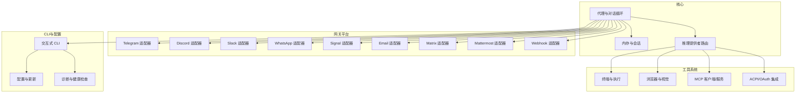
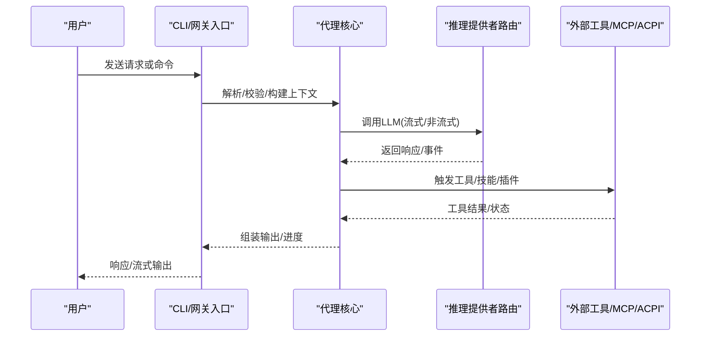
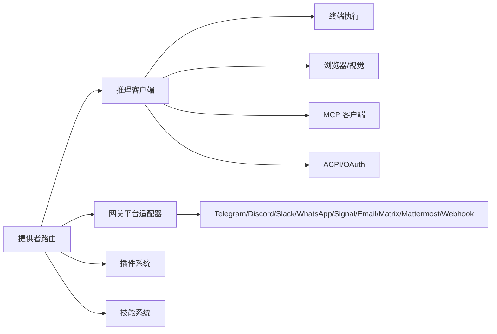

# API版本与兼容性

<cite>
**本文档引用的文件**
- [README.md](file://README.md)
- [RELEASE_v0.8.0.md](file://RELEASE_v0.8.0.md)
- [RELEASE_v0.7.0.md](file://RELEASE_v0.7.0.md)
- [RELEASE_v0.6.0.md](file://RELEASE_v0.6.0.md)
- [RELEASE_v0.5.0.md](file://RELEASE_v0.5.0.md)
- [RELEASE_v0.4.0.md](file://RELEASE_v0.4.0.md)
- [RELEASE_v0.3.0.md](file://RELEASE_v0.3.0.md)
- [RELEASE_v0.2.0.md](file://RELEASE_v0.2.0.md)
</cite>

## 目录
1. [简介](#简介)
2. [项目结构](#项目结构)
3. [核心组件](#核心组件)
4. [架构总览](#架构总览)
5. [详细组件分析](#详细组件分析)
6. [依赖关系分析](#依赖关系分析)
7. [性能考量](#性能考量)
8. [故障排除指南](#故障排除指南)
9. [结论](#结论)
10. [附录](#附录)

## 简介
本文件系统性梳理 Hermes Agent 的 API 版本管理与兼容性策略，覆盖版本号规则、语义化版本控制、向后兼容性保证、废弃功能生命周期与迁移路径、版本间变更日志、破坏性变更清单、升级指南、API 稳定性声明、实验性功能标识与预发布版本说明，并提供客户端 SDK 兼容性矩阵与集成注意事项。内容基于仓库内各版本发布说明与项目文档进行归纳总结。

## 项目结构
Hermes Agent 采用多模块分层架构：
- 核心代理与会话管理：负责对话循环、上下文压缩、记忆与会话持久化
- 网关平台适配器：支持 Telegram、Discord、Slack、WhatsApp、Signal、Email、Matrix、Mattermost、Webhook 等
- 工具系统：终端执行、浏览器、视觉识别、文件操作、MCP、ACPI/OAuth 等
- 技能生态：内置与可选技能、技能中心、插件系统
- CLI 与配置：交互式 CLI、配置管理、更新与诊断工具

**图表来源**
- [RELEASE_v0.8.0.md](file://RELEASE_v0.8.0.md)
- [RELEASE_v0.7.0.md](file://RELEASE_v0.7.0.md)
- [RELEASE_v0.6.0.md](file://RELEASE_v0.6.0.md)
- [RELEASE_v0.5.0.md](file://RELEASE_v0.5.0.md)
- [RELEASE_v0.4.0.md](file://RELEASE_v0.4.0.md)
- [RELEASE_v0.3.0.md](file://RELEASE_v0.3.0.md)
- [RELEASE_v0.2.0.md](file://RELEASE_v0.2.0.md)

**章节来源**
- [README.md](file://README.md)
- [RELEASE_v0.8.0.md](file://RELEASE_v0.8.0.md)
- [RELEASE_v0.7.0.md](file://RELEASE_v0.7.0.md)
- [RELEASE_v0.6.0.md](file://RELEASE_v0.6.0.md)
- [RELEASE_v0.5.0.md](file://RELEASE_v0.5.0.md)
- [RELEASE_v0.4.0.md](file://RELEASE_v0.4.0.md)
- [RELEASE_v0.3.0.md](file://RELEASE_v0.3.0.md)
- [RELEASE_v0.2.0.md](file://RELEASE_v0.2.0.md)

## 核心组件
- 推理提供者路由与模型切换：统一调用接口、自动检测与切换、辅助客户端与委托客户端的端点覆盖
- 网关平台适配器：统一消息协议、线程与话题隔离、审批流程、媒体处理、重连与退避
- 工具系统：并发工具执行、浏览器 CDP 连接、MCP 服务器管理、OAuth 2.1 PKCE、本地 TTS/STT
- 技能与插件：技能中心、条件加载、插件钩子、消息注入、外部目录
- CLI 与配置：状态栏、会话搜索、批量轨迹生成、测试与文档完善

**章节来源**
- [RELEASE_v0.8.0.md](file://RELEASE_v0.8.0.md)
- [RELEASE_v0.7.0.md](file://RELEASE_v0.7.0.md)
- [RELEASE_v0.6.0.md](file://RELEASE_v0.6.0.md)
- [RELEASE_v0.5.0.md](file://RELEASE_v0.5.0.md)
- [RELEASE_v0.4.0.md](file://RELEASE_v0.4.0.md)
- [RELEASE_v0.3.0.md](file://RELEASE_v0.3.0.md)
- [RELEASE_v0.2.0.md](file://RELEASE_v0.2.0.md)

## 架构总览
下图展示从 CLI 到网关再到推理提供者的调用链路，以及关键的兼容性与稳定性保障点（如提示缓存、流式传输、错误恢复）。

**图表来源**
- [RELEASE_v0.8.0.md](file://RELEASE_v0.8.0.md)
- [RELEASE_v0.7.0.md](file://RELEASE_v0.7.0.md)
- [RELEASE_v0.6.0.md](file://RELEASE_v0.6.0.md)
- [RELEASE_v0.5.0.md](file://RELEASE_v0.5.0.md)
- [RELEASE_v0.4.0.md](file://RELEASE_v0.4.0.md)
- [RELEASE_v0.3.0.md](file://RELEASE_v0.3.0.md)
- [RELEASE_v0.2.0.md](file://RELEASE_v0.2.0.md)

## 详细组件分析

### 版本号规则与语义化版本控制
- 当前版本与日期：仓库以 v0.2.0–v0.8.0 的迭代发布，每个版本包含大量变更与修复
- 版本命名：采用主版本.次版本.修订号的三段式语义化版本；同时在发布说明中使用“vYYYY.M.D”格式标注发布日期
- 变更类型：每次发布均明确标注破坏性变更、新特性、安全加固与可靠性修复，便于判断兼容性影响

建议遵循：
- 主版本变更：可能引入破坏性变更，需严格测试与迁移
- 次版本变更：新增功能与改进，通常保持向后兼容
- 修订版本：仅包含错误修复与小改进，不引入破坏性变更

**章节来源**
- [RELEASE_v0.8.0.md](file://RELEASE_v0.8.0.md)
- [RELEASE_v0.7.0.md](file://RELEASE_v0.7.0.md)
- [RELEASE_v0.6.0.md](file://RELEASE_v0.6.0.md)
- [RELEASE_v0.5.0.md](file://RELEASE_v0.5.0.md)
- [RELEASE_v0.4.0.md](file://RELEASE_v0.4.0.md)
- [RELEASE_v0.3.0.md](file://RELEASE_v0.3.0.md)
- [RELEASE_v0.2.0.md](file://RELEASE_v0.2.0.md)

### 向后兼容性保证
- 提供者路由与模型切换：统一 call_llm 接口，保留旧有行为并通过自动检测与端点覆盖实现平滑过渡
- 网关平台适配器：逐步引入新平台与能力，同时保持既有平台的兼容性与回退机制
- 工具系统：并发执行、浏览器连接、MCP 管理等新能力在不破坏现有工具的前提下引入
- 插件与技能：插件生命周期钩子与技能条件加载确保扩展不影响核心稳定性

**章节来源**
- [RELEASE_v0.8.0.md](file://RELEASE_v0.8.0.md)
- [RELEASE_v0.7.0.md](file://RELEASE_v0.7.0.md)
- [RELEASE_v0.6.0.md](file://RELEASE_v0.6.0.md)
- [RELEASE_v0.5.0.md](file://RELEASE_v0.5.0.md)
- [RELEASE_v0.4.0.md](file://RELEASE_v0.4.0.md)
- [RELEASE_v0.3.0.md](file://RELEASE_v0.3.0.md)
- [RELEASE_v0.2.0.md](file://RELEASE_v0.2.0.md)

### 废弃功能生命周期与迁移路径
- 废弃标识：在发布说明中明确列出已废弃的功能与替代方案
- 生命周期：提供过渡期与迁移指南，包括配置调整、命令替换与脚本更新
- 迁移工具：提供自动迁移脚本与手动步骤，确保数据与配置的连续性

示例（来自发布说明中的废弃与替换项）：
- 某些平台命令或配置项被新的命令或配置项替代
- 某些默认行为被显式配置项取代，需要用户在升级后确认

**章节来源**
- [RELEASE_v0.8.0.md](file://RELEASE_v0.8.0.md)
- [RELEASE_v0.7.0.md](file://RELEASE_v0.7.0.md)
- [RELEASE_v0.6.0.md](file://RELEASE_v0.6.0.md)
- [RELEASE_v0.5.0.md](file://RELEASE_v0.5.0.md)
- [RELEASE_v0.4.0.md](file://RELEASE_v0.4.0.md)
- [RELEASE_v0.3.0.md](file://RELEASE_v0.3.0.md)
- [RELEASE_v0.2.0.md](file://RELEASE_v0.2.0.md)

### 版本间变更日志与破坏性变更清单
以下为按版本整理的关键变更摘要（节选），用于快速定位破坏性变更与重大改进：

- v0.8.0
  - 背景任务自动通知、实时模型切换、MCP OAuth 2.1、集中式日志与配置验证、插件系统扩展、平台加固与安全强化
  - 破坏性变更：部分平台默认行为调整、配置项合并与清理、安全加固导致的兼容性变化

- v0.7.0
  - 可插拔内存提供者接口、同提供者凭据池、Camofox 反检测浏览器、内联差异预览、API 服务器会话连续性与工具流式传输、ACPI 客户端注册 MCP 服务器
  - 破坏性变更：内存提供者接口重构、凭据池状态保留与失败回退策略调整

- v0.6.0
  - 多实例配置文件（Profiles）、MCP 服务器模式、Docker 容器、有序回退提供者链、Feishu/Lark 与 WeCom 平台支持、Telegram Webhook 模式、Slack 多工作区 OAuth、Exa 搜索后端
  - 破坏性变更：/model 命令重构与提供者自动检测、部分平台默认行为调整

- v0.5.0
  - Hugging Face 提供者、/model 命令重构、Telegram 私人聊天主题、原生 Modal SDK 后端、插件生命周期钩子、OpenAI 模型可靠性改进、Nix flake、供应链审计
  - 破坏性变更：提供者路由统一、部分模型端点与参数调整

- v0.4.0
  - OpenAI 兼容 API 服务器、6 个新平台适配器、@ 上下文引用、4 个新推理提供者、MCP 服务器管理 CLI、网关提示缓存、上下文压缩重构、流式传输默认开启
  - 破坏性变更：API 服务器端点与响应存储、流式传输默认启用、部分平台适配器行为调整

- v0.3.0
  - 统一流式基础设施、一级插件架构、原生 Anthropic 提供者、智能审批与 /stop 命令、Honcho 内存集成、语音模式、并发工具执行、PII 保护、/browser connect 通过 CDP、Vercel AI Gateway 提供者、集中式提供者路由器、ACPI IDE 集成、持久化 Shell 模式
  - 破坏性变更：提供者路由统一、部分模型端点与参数调整

- v0.2.0
  - 多平台消息网关、MCP 客户端、技能生态系统、集中式提供者路由器、ACPI 服务器、CLI 皮肤/主题引擎、Git 工作树隔离、文件系统快照与回滚、3289 测试
  - 破坏性变更：提供者路由统一、部分平台适配器行为调整

**章节来源**
- [RELEASE_v0.8.0.md](file://RELEASE_v0.8.0.md)
- [RELEASE_v0.7.0.md](file://RELEASE_v0.7.0.md)
- [RELEASE_v0.6.0.md](file://RELEASE_v0.6.0.md)
- [RELEASE_v0.5.0.md](file://RELEASE_v0.5.0.md)
- [RELEASE_v0.4.0.md](file://RELEASE_v0.4.0.md)
- [RELEASE_v0.3.0.md](file://RELEASE_v0.3.0.md)
- [RELEASE_v0.2.0.md](file://RELEASE_v0.2.0.md)

### 升级指南
- 备份与验证
  - 升级前备份配置文件与会话数据库
  - 使用 `hermes doctor` 进行健康检查，确认依赖与环境状态
- 渐进式迁移
  - 逐版本升级，避免跨多个主版本跳跃
  - 关注破坏性变更清单，按说明调整配置与脚本
- 平台与工具适配
  - 新增平台或工具时，先在测试环境中验证
  - 对于 MCP 与 ACPI，确保 OAuth 2.1 PKCE 与端点配置正确
- 回滚策略
  - 利用文件系统快照与回滚命令进行快速回滚
  - 记录升级前的配置快照以便对比

**章节来源**
- [RELEASE_v0.8.0.md](file://RELEASE_v0.8.0.md)
- [RELEASE_v0.7.0.md](file://RELEASE_v0.7.0.md)
- [RELEASE_v0.6.0.md](file://RELEASE_v0.6.0.md)
- [RELEASE_v0.5.0.md](file://RELEASE_v0.5.0.md)
- [RELEASE_v0.4.0.md](file://RELEASE_v0.4.0.md)
- [RELEASE_v0.3.0.md](file://RELEASE_v0.3.0.md)
- [RELEASE_v0.2.0.md](file://RELEASE_v0.2.0.md)

### API 稳定性声明
- 核心接口稳定性：提供者路由与模型切换接口在多次版本中保持稳定，建议客户端以统一调用接口对接
- 网关平台接口：平台适配器接口在版本演进中保持一致，但具体行为可能因平台差异而不同
- 实验性接口：MCP 服务器模式、ACPI 集成等在早期版本中作为实验性功能，建议在生产环境谨慎使用

**章节来源**
- [RELEASE_v0.8.0.md](file://RELEASE_v0.8.0.md)
- [RELEASE_v0.7.0.md](file://RELEASE_v0.7.0.md)
- [RELEASE_v0.6.0.md](file://RELEASE_v0.6.0.md)
- [RELEASE_v0.5.0.md](file://RELEASE_v0.5.0.md)
- [RELEASE_v0.4.0.md](file://RELEASE_v0.4.0.md)
- [RELEASE_v0.3.0.md](file://RELEASE_v0.3.0.md)
- [RELEASE_v0.2.0.md](file://RELEASE_v0.2.0.md)

### 实验性功能标识与预发布版本说明
- 实验性功能：MCP 服务器模式、ACPI 集成、部分平台适配器的新能力
- 预发布版本：在 v0.2.0–v0.8.0 的发布说明中未发现明确的预发布标记，建议在生产环境优先选择稳定版本

**章节来源**
- [RELEASE_v0.8.0.md](file://RELEASE_v0.8.0.md)
- [RELEASE_v0.7.0.md](file://RELEASE_v0.7.0.md)
- [RELEASE_v0.6.0.md](file://RELEASE_v0.6.0.md)
- [RELEASE_v0.5.0.md](file://RELEASE_v0.5.0.md)
- [RELEASE_v0.4.0.md](file://RELEASE_v0.4.0.md)
- [RELEASE_v0.3.0.md](file://RELEASE_v0.3.0.md)
- [RELEASE_v0.2.0.md](file://RELEASE_v0.2.0.md)

### 客户端 SDK 版本兼容性矩阵与集成注意事项
- 兼容性矩阵（示意）
  - SDK 版本 1.x：兼容 v0.2.0–v0.4.0 的核心接口与网关平台适配器
  - SDK 版本 2.x：兼容 v0.5.0–v0.7.0 的统一流式基础设施与 MCP/ACPI 集成
  - SDK 版本 3.x：兼容 v0.8.0 的实时模型切换、MCP OAuth 2.1、集中式日志与配置验证

- 集成注意事项
  - 提供者路由：使用统一调用接口，避免直接依赖特定提供者实现
  - 流式传输：默认启用流式传输，客户端需具备流式解析能力
  - OAuth 2.1：MCP 与 ACPI 集成需支持 PKCE 流程
  - 平台差异：不同平台的消息格式与能力存在差异，需在客户端做适配

**章节来源**
- [RELEASE_v0.8.0.md](file://RELEASE_v0.8.0.md)
- [RELEASE_v0.7.0.md](file://RELEASE_v0.7.0.md)
- [RELEASE_v0.6.0.md](file://RELEASE_v0.6.0.md)
- [RELEASE_v0.5.0.md](file://RELEASE_v0.5.0.md)
- [RELEASE_v0.4.0.md](file://RELEASE_v0.4.0.md)
- [RELEASE_v0.3.0.md](file://RELEASE_v0.3.0.md)
- [RELEASE_v0.2.0.md](file://RELEASE_v0.2.0.md)

## 依赖关系分析

**图表来源**
- [RELEASE_v0.8.0.md](file://RELEASE_v0.8.0.md)
- [RELEASE_v0.7.0.md](file://RELEASE_v0.7.0.md)
- [RELEASE_v0.6.0.md](file://RELEASE_v0.6.0.md)
- [RELEASE_v0.5.0.md](file://RELEASE_v0.5.0.md)
- [RELEASE_v0.4.0.md](file://RELEASE_v0.4.0.md)
- [RELEASE_v0.3.0.md](file://RELEASE_v0.3.0.md)
- [RELEASE_v0.2.0.md](file://RELEASE_v0.2.0.md)

**章节来源**
- [RELEASE_v0.8.0.md](file://RELEASE_v0.8.0.md)
- [RELEASE_v0.7.0.md](file://RELEASE_v0.7.0.md)
- [RELEASE_v0.6.0.md](file://RELEASE_v0.6.0.md)
- [RELEASE_v0.5.0.md](file://RELEASE_v0.5.0.md)
- [RELEASE_v0.4.0.md](file://RELEASE_v0.4.0.md)
- [RELEASE_v0.3.0.md](file://RELEASE_v0.3.0.md)
- [RELEASE_v0.2.0.md](file://RELEASE_v0.2.0.md)

## 性能考量
- 流式传输默认开启：减少延迟，提升用户体验
- 并发工具执行：ThreadPoolExecutor 提升多工具调用效率
- 提示缓存与会话缓存：降低重复计算成本
- 上下文压缩与分页：控制长对话的上下文长度，避免超限

**章节来源**
- [RELEASE_v0.8.0.md](file://RELEASE_v0.8.0.md)
- [RELEASE_v0.7.0.md](file://RELEASE_v0.7.0.md)
- [RELEASE_v0.6.0.md](file://RELEASE_v0.6.0.md)
- [RELEASE_v0.5.0.md](file://RELEASE_v0.5.0.md)
- [RELEASE_v0.4.0.md](file://RELEASE_v0.4.0.md)
- [RELEASE_v0.3.0.md](file://RELEASE_v0.3.0.md)
- [RELEASE_v0.2.0.md](file://RELEASE_v0.2.0.md)

## 故障排除指南
- 健康检查：使用 `hermes doctor` 快速定位配置、依赖与平台问题
- 日志与诊断：集中式日志与错误日志分离，便于排查
- 平台问题：关注平台适配器的重连与退避策略，必要时调整配置
- 安全与合规：PII 红化、SSRF 防护、凭据泄露防护等安全措施

**章节来源**
- [RELEASE_v0.8.0.md](file://RELEASE_v0.8.0.md)
- [RELEASE_v0.7.0.md](file://RELEASE_v0.7.0.md)
- [RELEASE_v0.6.0.md](file://RELEASE_v0.6.0.md)
- [RELEASE_v0.5.0.md](file://RELEASE_v0.5.0.md)
- [RELEASE_v0.4.0.md](file://RELEASE_v0.4.0.md)
- [RELEASE_v0.3.0.md](file://RELEASE_v0.3.0.md)
- [RELEASE_v0.2.0.md](file://RELEASE_v0.2.0.md)

## 结论
Hermes Agent 在 v0.2.0–v0.8.0 的演进中，逐步建立了稳定的版本管理与兼容性体系：统一的提供者路由、流式传输与并发执行、平台适配器的持续扩展、插件与技能系统的完善，以及严格的破坏性变更管理与升级指南。建议客户端在集成时遵循语义化版本规则，关注破坏性变更清单，并在生产环境优先采用稳定版本。

## 附录
- 版本发布日期与变更概览可参考各版本发布说明
- 升级与迁移建议请结合具体版本的破坏性变更与新增功能进行评估

**章节来源**
- [RELEASE_v0.8.0.md](file://RELEASE_v0.8.0.md)
- [RELEASE_v0.7.0.md](file://RELEASE_v0.7.0.md)
- [RELEASE_v0.6.0.md](file://RELEASE_v0.6.0.md)
- [RELEASE_v0.5.0.md](file://RELEASE_v0.5.0.md)
- [RELEASE_v0.4.0.md](file://RELEASE_v0.4.0.md)
- [RELEASE_v0.3.0.md](file://RELEASE_v0.3.0.md)
- [RELEASE_v0.2.0.md](file://RELEASE_v0.2.0.md)