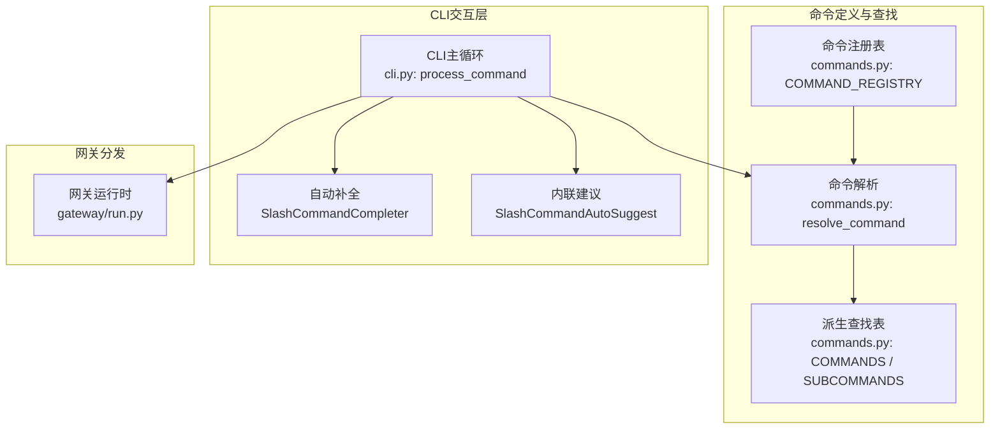
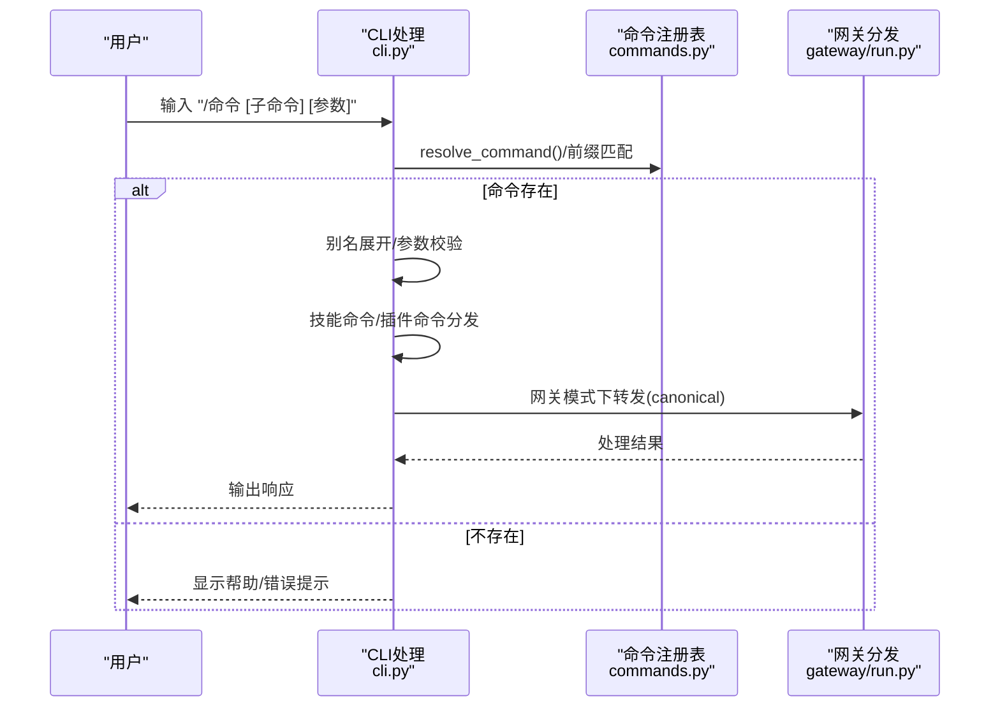
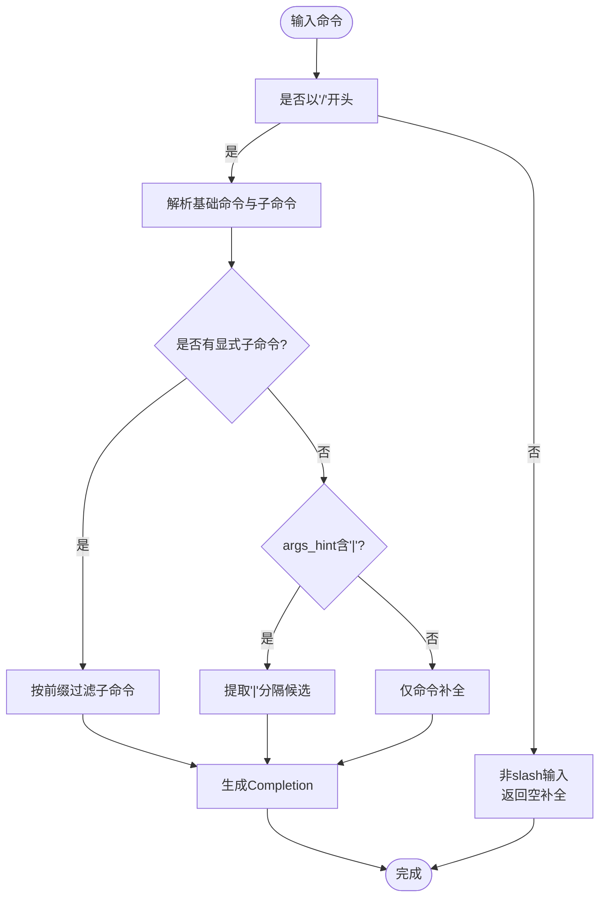
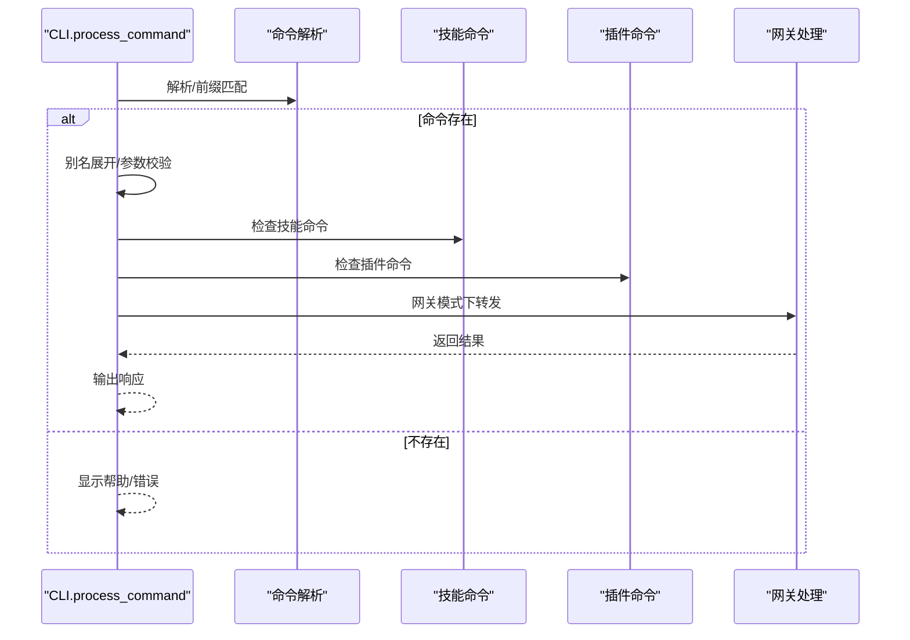
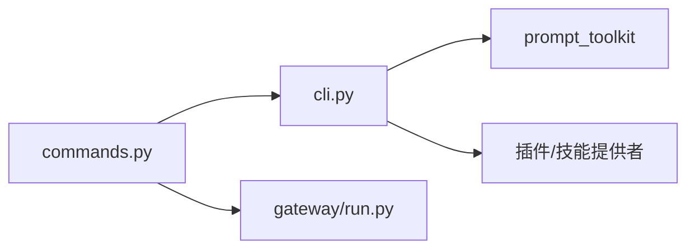

# CLI命令参考

<cite>
**本文档引用的文件**
- [hermes_cli/main.py](file://hermes_cli/main.py)
- [hermes_cli/commands.py](file://hermes_cli/commands.py)
- [cli.py](file://cli.py)
- [gateway/run.py](file://gateway/run.py)
- [tests/hermes_cli/test_commands.py](file://tests/hermes_cli/test_commands.py)
- [tests/cli/test_cli_prefix_matching.py](file://tests/cli/test_cli_prefix_matching.py)
</cite>

## 目录
1. [简介](#简介)
2. [项目结构](#项目结构)
3. [核心组件](#核心组件)
4. [架构总览](#架构总览)
5. [详细组件分析](#详细组件分析)
6. [依赖分析](#依赖分析)
7. [性能考虑](#性能考虑)
8. [故障排除指南](#故障排除指南)
9. [结论](#结论)
10. [附录](#附录)

## 简介
本参考文档面向Hermes Agent CLI命令系统，系统性梳理所有slash命令的定义、参数、别名与使用方式，按功能分类呈现会话管理、配置管理、工具技能、信息查询等命令类别，并覆盖命令可用性条件（CLI独有、网关独有、配置门控）、子命令支持与自动补全功能。文档同时提供命令组合使用的最佳实践与常见错误处理方法，帮助用户高效、安全地使用CLI交互体验。

## 项目结构
Hermes CLI命令系统由以下关键模块构成：
- 命令注册与解析：集中于命令定义与查找逻辑
- CLI交互层：负责命令输入、前缀匹配、自动补全与建议
- 网关命令分发：将slash命令映射到平台适配器
- 测试用例：验证自动补全、建议、前缀匹配与过滤行为

**图表来源**
- [hermes_cli/commands.py:56-279](file://hermes_cli/commands.py#L56-L279)
- [cli.py:5500-5575](file://cli.py#L5500-L5575)
- [gateway/run.py:2728-2768](file://gateway/run.py#L2728-L2768)

**章节来源**
- [hermes_cli/commands.py:1-1053](file://hermes_cli/commands.py#L1-L1053)
- [cli.py:5500-6299](file://cli.py#L5500-L6299)
- [gateway/run.py:2728-2768](file://gateway/run.py#L2728-L2768)

## 核心组件
- 命令定义与注册
  - 使用CommandDef数据类统一描述命令名称、别名、描述、参数提示、子命令、可用性条件等
  - 全局COMMAND_REGISTRY作为单一真实来源，供CLI帮助、网关菜单、自动补全与平台映射使用
- 命令解析与查找
  - resolve_command支持带或不带斜杠的名称解析，兼容别名
  - rebuild_lookups在插件注册后重建派生查找表，确保新命令可见
- CLI命令处理
  - process_command实现前缀匹配、别名展开、技能命令与插件命令分发、未知命令提示
- 自动补全与内联建议
  - SlashCommandCompleter提供命令、子命令、路径、上下文引用与模型别名补全
  - SlashCommandAutoSuggest提供命令与子命令的内联建议文本
- 网关命令分发
  - gateway/run.py中对常用命令进行canonical映射与处理分支

**章节来源**
- [hermes_cli/commands.py:37-279](file://hermes_cli/commands.py#L37-L279)
- [cli.py:5500-5575](file://cli.py#L5500-L5575)
- [gateway/run.py:2728-2768](file://gateway/run.py#L2728-L2768)

## 架构总览
下图展示了从用户输入slash命令到执行处理的关键流程，包括CLI与网关两条路径：

**图表来源**
- [cli.py:5500-5575](file://cli.py#L5500-L5575)
- [hermes_cli/commands.py:182-241](file://hermes_cli/commands.py#L182-L241)
- [gateway/run.py:2728-2768](file://gateway/run.py#L2728-L2768)

## 详细组件分析

### 命令定义与可用性条件
- 可用性标记
  - cli_only：仅CLI可用
  - gateway_only：仅网关可用
  - gateway_config_gate：通过配置门控在网关侧启用
- 子命令与参数提示
  - subcommands：显式声明可tab补全的子命令
  - args_hint：参数占位符，支持管道分隔的隐式子命令列表
- 别名
  - aliases：提供简短或常用别名，如/new的别名reset

**章节来源**
- [hermes_cli/commands.py:37-50](file://hermes_cli/commands.py#L37-L50)
- [hermes_cli/commands.py:262-279](file://hermes_cli/commands.py#L262-L279)

### 会话管理类命令
- new/reset：开始全新会话（含历史）
- clear：清屏并开始新会话（CLI独有）
- history：显示对话历史（CLI独有）
- save：保存当前对话（CLI独有）
- retry：重试上一条消息（重新发送给代理）
- undo：移除最后一条用户/助手交换
- title [name]：为当前会话设置标题
- branch/fork [name]：分支当前会话（探索不同路径）
- compress [focus主题]：手动压缩对话上下文
- rollback [编号]：列出或恢复文件系统快照
- stop：终止所有正在运行的后台进程
- approve/deny：批准/拒绝待处理的危险命令（网关独有）
- background/bg <prompt>：在后台运行提示
- btw <问题>：使用会话上下文进行临时旁路提问（无工具、不持久化）
- queue/q <prompt>：排队下一个回合的提示（不打断）
- status：显示会话信息
- sethome：将当前聊天设为主频道（网关独有）
- resume [name]：恢复之前命名的会话

**章节来源**
- [hermes_cli/commands.py:57-93](file://hermes_cli/commands.py#L57-L93)
- [cli.py:5603-5615](file://cli.py#L5603-L5615)
- [cli.py:5744-5756](file://cli.py#L5744-L5756)
- [cli.py:5898-6079](file://cli.py#L5898-L6079)

### 配置管理类命令
- config：显示当前配置（CLI独有）
- model [模型] [--global]：切换当前会话模型（支持别名与全局选项）
- provider：显示可用提供商与当前提供商
- personality [名称]：设置预设个性
- statusbar/sb：切换上下文/模型状态栏（CLI独有）
- verbose：循环工具进度显示：关闭→新增→全部→详细（受display.tool_progress_command门控）
- yolo：切换YOLO模式（跳过所有危险命令审批）
- reasoning [级别|show|hide]：管理推理努力与显示（子命令：none/minimal/low/medium/high/xhigh/show/hide/on/off）
- fast [normal|fast|status]：切换快速模式（OpenAI优先处理/Anthropic快速模式）
- skin：显示或更改显示皮肤（CLI独有）
- voice [on|off|tts|status]：切换语音模式

**章节来源**
- [hermes_cli/commands.py:94-120](file://hermes_cli/commands.py#L94-L120)
- [cli.py:6120-6129](file://cli.py#L6120-L6129)
- [cli.py:6159-6262](file://cli.py#L6159-L6262)

### 工具与技能类命令
- tools：管理工具（tools list/disable/enable [名称...])
- toolsets：列出可用工具集（CLI独有）
- skills：搜索、安装、检查或管理技能（子命令：search/browse/inspect/install）
- cron：管理计划任务（子命令：list/add/create/edit/pause/resume/run/remove）
- reload-mcp/reload_mcp：从配置重新加载MCP服务器
- browser：连接浏览器工具到本地Chrome（子命令：connect/disconnect/status）
- plugins：列出已安装插件及其状态（CLI独有）

**章节来源**
- [hermes_cli/commands.py:121-139](file://hermes_cli/commands.py#L121-L139)
- [cli.py:5898-6079](file://cli.py#L5898-L6079)

### 信息查询类命令
- commands：浏览所有命令与技能（分页）（网关独有）
- help：显示可用命令
- restart：在排空活动运行后优雅重启网关（网关独有）
- usage：显示当前会话的令牌用量与速率限制
- insights [天数]：显示使用洞察与分析
- platforms/gateway：显示网关/消息平台状态（CLI独有）
- paste：检查剪贴板中的图片并附加
- image <路径>：附加本地图片文件用于下一次提示（CLI独有）
- update：更新Hermes Agent到最新版本（网关独有）
- debug：上传调试报告（系统信息+日志）并获取可分享链接

**章节来源**
- [hermes_cli/commands.py:140-158](file://hermes_cli/commands.py#L140-L158)
- [cli.py:5500-5575](file://cli.py#L5500-L5575)

### 退出类命令
- quit/exit/q：退出CLI（CLI独有）

**章节来源**
- [hermes_cli/commands.py:159-162](file://hermes_cli/commands.py#L159-L162)

### 命令可用性与配置门控
- CLI独有：clear/history/save/statusbar/skin/image/toolsets/plugins/browser等
- 网关独有：approve/deny/restart/platforms/update/commands/sethome等
- 配置门控：verbose命令受display.tool_progress_command控制；部分网关命令可通过gateway_config_gate在网关侧启用

**章节来源**
- [hermes_cli/commands.py:47-49](file://hermes_cli/commands.py#L47-L49)
- [hermes_cli/commands.py:296-339](file://hermes_cli/commands.py#L296-L339)

### 子命令与自动补全
- 子命令支持
  - 显式子命令：subcommands字段定义
  - 隐式子命令：args_hint中以管道分隔的候选列表
- 自动补全
  - SlashCommandCompleter支持命令、子命令、路径、上下文引用（@file:/@folder:等）与模型别名补全
  - SlashCommandAutoSuggest提供命令与子命令的内联建议文本
- 前缀匹配与别名展开
  - process_command支持唯一前缀匹配与最短匹配优先策略，避免无限递归

**图表来源**
- [hermes_cli/commands.py:914-976](file://hermes_cli/commands.py#L914-L976)
- [tests/hermes_cli/test_commands.py:336-566](file://tests/hermes_cli/test_commands.py#L336-L566)

**章节来源**
- [hermes_cli/commands.py:646-1053](file://hermes_cli/commands.py#L646-L1053)
- [tests/hermes_cli/test_commands.py:336-566](file://tests/hermes_cli/test_commands.py#L336-L566)
- [tests/cli/test_cli_prefix_matching.py:36-96](file://tests/cli/test_cli_prefix_matching.py#L36-L96)

### 命令处理流程（CLI）

**图表来源**
- [cli.py:5500-5575](file://cli.py#L5500-L5575)
- [gateway/run.py:2728-2768](file://gateway/run.py#L2728-L2768)

**章节来源**
- [cli.py:5500-5575](file://cli.py#L5500-L5575)
- [gateway/run.py:2728-2768](file://gateway/run.py#L2728-L2768)

## 依赖分析
- 组件耦合
  - commands.py与cli.py通过resolve_command与COMMANDS建立松耦合依赖
  - 网关通过canonical映射复用CLI命令语义
- 外部依赖
  - prompt_toolkit用于自动补全与内联建议
  - 插件与技能命令通过动态提供者注入

**图表来源**
- [hermes_cli/commands.py:1-1053](file://hermes_cli/commands.py#L1-L1053)
- [cli.py:5500-6299](file://cli.py#L5500-L6299)
- [gateway/run.py:2728-2768](file://gateway/run.py#L2728-L2768)

**章节来源**
- [hermes_cli/commands.py:1-1053](file://hermes_cli/commands.py#L1-L1053)
- [cli.py:5500-6299](file://cli.py#L5500-L6299)
- [gateway/run.py:2728-2768](file://gateway/run.py#L2728-L2768)

## 性能考虑
- 自动补全与建议
  - 路径与上下文引用补全采用限流与目录遍历优化，避免阻塞
  - 内联建议仅在slash输入时触发，减少非必要计算
- 前缀匹配
  - 优先精确匹配与最短匹配，避免多次展开导致的递归开销
- 网关命令分发
  - canonical映射减少字符串处理成本，提高路由效率

[本节为通用指导，无需特定文件引用]

## 故障排除指南
- 未知命令
  - 现象：输入“/xyz”等不存在命令
  - 处理：CLI会提示“未知命令”，建议使用“/help”查看可用命令
- 前缀歧义
  - 现象：输入“/re”可能匹配多个命令
  - 处理：CLI会提示“模糊命令，请问是否是...”，建议使用更长前缀或完整命令
- 子命令不匹配
  - 现象：输入“/reasoning h”但无合适建议
  - 处理：确认子命令拼写（如“show”），或使用“/reasoning”查看帮助
- 网关命令不可用
  - 现象：某些命令在网关侧不可见
  - 处理：检查配置门控（如verbose的display.tool_progress_command），或确认命令是否为CLI独有

**章节来源**
- [cli.py:5568-5573](file://cli.py#L5568-L5573)
- [tests/cli/test_cli_prefix_matching.py:72-96](file://tests/cli/test_cli_prefix_matching.py#L72-L96)
- [tests/hermes_cli/test_commands.py:531-566](file://tests/hermes_cli/test_commands.py#L531-L566)

## 结论
Hermes Agent CLI命令系统以统一的命令注册表为核心，结合CLI交互层的智能补全与建议、网关侧的命令分发，实现了跨平台一致的slash命令体验。通过明确的可用性标记与配置门控，系统既保证了灵活性，也确保了安全性与易用性。建议用户在日常使用中充分利用自动补全与内联建议，遵循命令组合的最佳实践，以获得更高效、稳定的交互体验。

[本节为总结性内容，无需特定文件引用]

## 附录

### 命令速查表（按类别）
- 会话管理：new/reset、clear、history、save、retry、undo、title、branch/fork、compress、rollback、stop、approve、deny、background/bg、btw、queue/q、status、sethome、resume
- 配置管理：config、model、provider、personality、statusbar/sb、verbose、yolo、reasoning、fast、skin、voice
- 工具与技能：tools、toolsets、skills、cron、reload-mcp/reload_mcp、browser、plugins
- 信息查询：commands、help、restart、usage、insights、platforms/gateway、paste、image、update、debug
- 退出：quit/exit/q

**章节来源**
- [hermes_cli/commands.py:56-162](file://hermes_cli/commands.py#L56-L162)

### 最佳实践
- 使用自动补全与内联建议提升输入效率
- 在网关环境中优先使用“approve/deny”处理危险命令
- 合理使用“background/bg”与“btw”进行异步与临时查询
- 通过“reasoning”与“fast”调节推理与服务等级
- 使用“rollback”与“compress”管理长对话上下文

[本节为通用指导，无需特定文件引用]