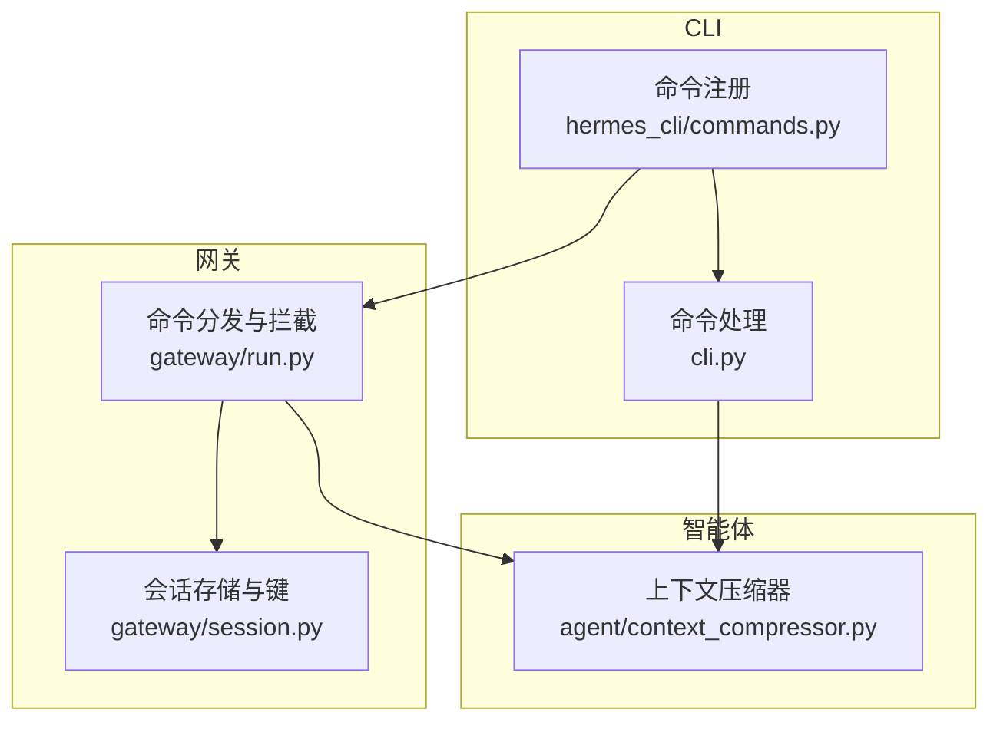
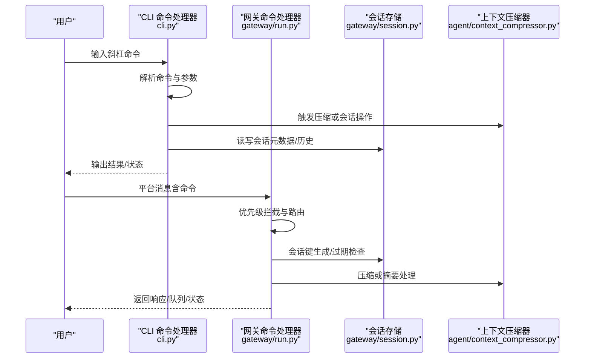
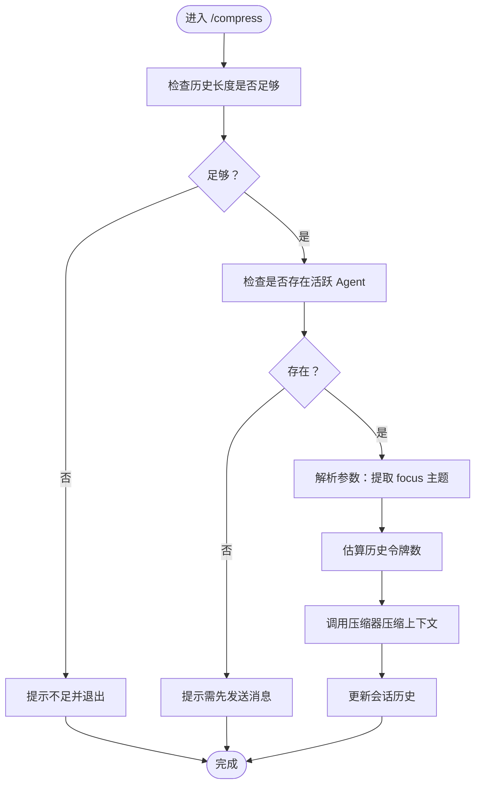
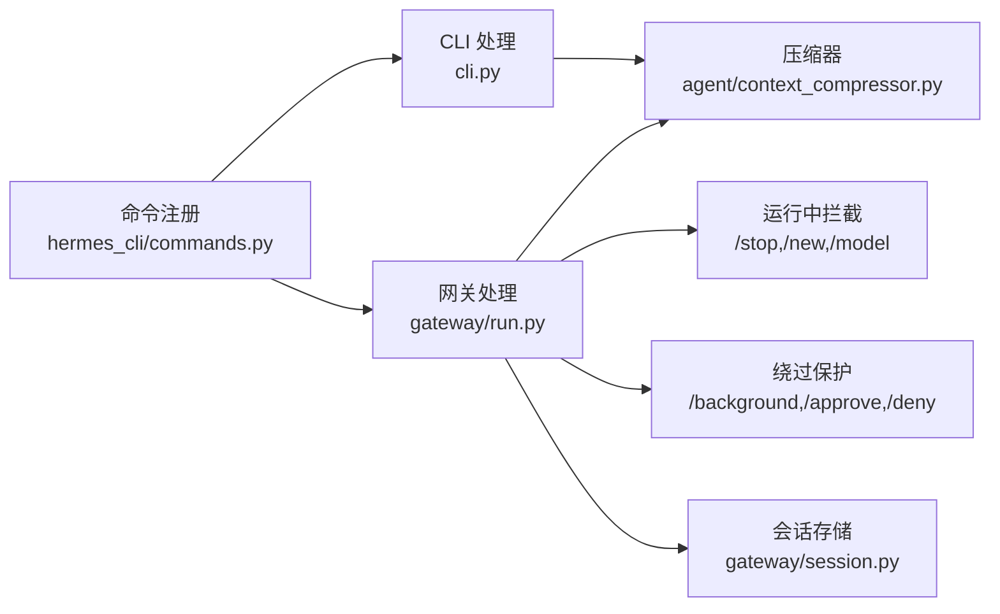

# 会话管理命令

<cite>
**本文引用的文件**
- [hermes_cli/commands.py](file://hermes_cli/commands.py)
- [cli.py](file://cli.py)
- [gateway/run.py](file://gateway/run.py)
- [gateway/session.py](file://gateway/session.py)
- [agent/context_compressor.py](file://agent/context_compressor.py)
- [tests/cli/test_compress_focus.py](file://tests/cli/test_compress_focus.py)
- [tests/agent/test_compress_focus.py](file://tests/agent/test_compress_focus.py)
</cite>

## 目录
1. [简介](#简介)
2. [项目结构](#项目结构)
3. [核心组件](#核心组件)
4. [架构总览](#架构总览)
5. [详细组件分析](#详细组件分析)
6. [依赖分析](#依赖分析)
7. [性能考量](#性能考量)
8. [故障排查指南](#故障排查指南)
9. [结论](#结论)
10. [附录](#附录)

## 简介
本参考文档系统梳理 Hermes Agent 的会话管理命令，覆盖以下命令：/new、/clear、/history、/save、/retry、/undo、/title、/branch、/compress、/rollback、/stop、/approve、/deny、/background、/btw、/queue、/status、/resume。内容包括：
- 命令语法与参数说明
- 可用性条件（CLI 独有、网关独有、配置门控）
- 使用场景与实际应用示例
- 命令间依赖关系与交互
- 会话生命周期管理最佳实践（分支、历史记录、上下文压缩）

## 项目结构
围绕会话管理命令的关键代码分布在如下模块：
- hermes_cli/commands.py：集中定义所有斜杠命令及其元数据（名称、别名、参数占位符、可用性标记、子命令等）
- cli.py：CLI 中命令解析与执行逻辑，包含各命令的具体处理函数
- gateway/run.py：网关平台中命令解析与执行逻辑，包含运行时拦截与路由
- gateway/session.py：网关侧会话存储、键生成、过期策略与会话状态管理
- agent/context_compressor.py：上下文压缩器，支持手动压缩与焦点主题注入
- 测试用例：验证 /compress <focus> 的行为与焦点主题传递

**图示来源**
- [hermes_cli/commands.py:56-92](file://hermes_cli/commands.py#L56-L92)
- [cli.py:5300-5800](file://cli.py#L5300-L5800)
- [gateway/run.py:2500-2800](file://gateway/run.py#L2500-L2800)
- [gateway/session.py:495-800](file://gateway/session.py#L495-L800)
- [agent/context_compressor.py:60-200](file://agent/context_compressor.py#L60-L200)

**章节来源**
- [hermes_cli/commands.py:56-92](file://hermes_cli/commands.py#L56-L92)
- [cli.py:5300-5800](file://cli.py#L5300-L5800)
- [gateway/run.py:2500-2800](file://gateway/run.py#L2500-L2800)
- [gateway/session.py:495-800](file://gateway/session.py#L495-L800)
- [agent/context_compressor.py:60-200](file://agent/context_compressor.py#L60-L200)

## 核心组件
- 命令注册中心：集中定义命令、别名、参数占位符、可用性标记（cli_only、gateway_only、gateway_config_gate）与子命令提示
- CLI 命令处理器：负责解析命令、参数与别名，调用对应处理函数，并在需要时与会话数据库交互
- 网关命令处理器：在消息适配器层面对命令进行优先级处理、运行中拦截与路由，确保安全与一致性
- 会话存储与键：基于来源信息构建确定性会话键，支持过期策略与自动重置
- 上下文压缩器：在长对话中按阈值触发压缩，支持焦点主题注入以指导摘要保留重点

**章节来源**
- [hermes_cli/commands.py:37-50](file://hermes_cli/commands.py#L37-L50)
- [cli.py:5300-5800](file://cli.py#L5300-L5800)
- [gateway/run.py:2500-2800](file://gateway/run.py#L2500-L2800)
- [gateway/session.py:436-493](file://gateway/session.py#L436-L493)
- [agent/context_compressor.py:60-200](file://agent/context_compressor.py#L60-L200)

## 架构总览
下图展示命令从输入到执行的关键路径，以及与会话存储、压缩器的交互。

**图示来源**
- [cli.py:5300-5800](file://cli.py#L5300-L5800)
- [gateway/run.py:2500-2800](file://gateway/run.py#L2500-L2800)
- [gateway/session.py:495-800](file://gateway/session.py#L495-L800)
- [agent/context_compressor.py:60-200](file://agent/context_compressor.py#L60-L200)

## 详细组件分析

### 命令可用性与注册
- 命令注册：集中于 COMMAND_REGISTRY，包含 name、description、category、aliases、args_hint、subcommands、cli_only、gateway_only、gateway_config_gate 等字段
- CLI 可见性：仅当非 cli_only 或满足配置门控时，在网关表面显示
- 配置门控：通过读取配置路径（如 display.tool_progress_command）决定是否在网关显示

**章节来源**
- [hermes_cli/commands.py:56-92](file://hermes_cli/commands.py#L56-L92)
- [hermes_cli/commands.py:285-358](file://hermes_cli/commands.py#L285-L358)
- [hermes_cli/commands.py:296-323](file://hermes_cli/commands.py#L296-L323)
- [hermes_cli/commands.py:325-339](file://hermes_cli/commands.py#L325-L339)

### /new 与 /reset
- 功能：启动全新会话（新会话 ID + 清空历史）
- CLI 行为：清理旧会话、通知插件 on_session_finalize/on_session_reset、更新会话数据库
- 网关行为：在运行中时中断当前代理，清空待处理队列，强制切换到新会话
- 依赖关系：与会话边界钩子、会话存储、Agent 状态重置强关联

**章节来源**
- [cli.py:4004-4060](file://cli.py#L4004-L4060)
- [cli.py:3988-4003](file://cli.py#L3988-L4003)
- [gateway/run.py:2559-2572](file://gateway/run.py#L2559-L2572)

### /clear
- 功能：清屏并启动新会话（仅 CLI）
- 行为：与 /new 类似，但强调“清屏”体验

**章节来源**
- [hermes_cli/commands.py:60-61](file://hermes_cli/commands.py#L60-L61)
- [cli.py:4004-4060](file://cli.py#L4004-L4060)

### /history
- 功能：显示对话历史（仅 CLI）
- 行为：渲染用户/助手消息，隐藏工具消息，提供预览与统计

**章节来源**
- [hermes_cli/commands.py:62-63](file://hermes_cli/commands.py#L62-L63)
- [cli.py:3921-3987](file://cli.py#L3921-L3987)

### /save
- 功能：保存当前对话至文件（仅 CLI）
- 行为：序列化模型、会话开始时间与消息列表

**章节来源**
- [hermes_cli/commands.py:64-65](file://hermes_cli/commands.py#L64-L65)
- [cli.py:4254-4273](file://cli.py#L4254-L4273)

### /retry
- 功能：重试上一条用户消息（重新发送给代理）
- 行为：回溯找到最后一条用户消息，移除最后一条助手响应及工具消息，重新入队

**章节来源**
- [hermes_cli/commands.py:66](file://hermes_cli/commands.py#L66)
- [cli.py:4274-4301](file://cli.py#L4274-L4301)

### /undo
- 功能：撤销最后一次用户/助手交换
- 行为：回溯找到最后一条用户消息，截断历史至该处

**章节来源**
- [hermes_cli/commands.py:67](file://hermes_cli/commands.py#L67)
- [cli.py:4303-4334](file://cli.py#L4303-L4334)

### /title
- 功能：为当前会话设置标题
- 行为：若会话已存在则直接设置；否则延迟到首次消息时保存；支持显示当前标题与会话 ID

**章节来源**
- [hermes_cli/commands.py:68-69](file://hermes_cli/commands.py#L68-L69)
- [cli.py:5314-5363](file://cli.py#L5314-L5363)

### /branch 与 /fork
- 功能：分支当前会话，复制完整历史到新会话，便于探索不同路径
- 行为：结束旧会话、创建新会话、复制消息、设置标题、同步 Agent 状态

**章节来源**
- [hermes_cli/commands.py:70-71](file://hermes_cli/commands.py#L70-L71)
- [cli.py:4143-4253](file://cli.py#L4143-L4253)

### /compress
- 功能：手动压缩对话上下文
- 语法：/compress [focus 主题]
- 行为：估算令牌数、可选传入 focus_topic 指导摘要保留重点；调用压缩器进行压缩
- 测试验证：焦点主题正确传递至压缩器

**图示来源**
- [cli.py:6270-6315](file://cli.py#L6270-L6315)
- [tests/cli/test_compress_focus.py:20-63](file://tests/cli/test_compress_focus.py#L20-L63)
- [tests/agent/test_compress_focus.py:31-56](file://tests/agent/test_compress_focus.py#L31-L56)

**章节来源**
- [hermes_cli/commands.py:72-73](file://hermes_cli/commands.py#L72-L73)
- [cli.py:6270-6315](file://cli.py#L6270-L6315)
- [tests/cli/test_compress_focus.py:20-63](file://tests/cli/test_compress_focus.py#L20-L63)
- [tests/agent/test_compress_focus.py:31-56](file://tests/agent/test_compress_focus.py#L31-L56)
- [agent/context_compressor.py:60-200](file://agent/context_compressor.py#L60-L200)

### /rollback
- 功能：列出、对比或恢复文件系统快照（支持单文件恢复与撤销聊天回合）
- 语法：/rollback、/rollback <N>、/rollback diff <N>、/rollback <N> <file>
- 行为：启用检查点后，列出快照、解析引用、差异输出、恢复并自动撤销一次聊天回合

**章节来源**
- [hermes_cli/commands.py:74-75](file://hermes_cli/commands.py#L74-L75)
- [cli.py:3272-3365](file://cli.py#L3272-L3365)

### /stop
- 功能：终止所有后台进程
- 网关行为：在运行中时强制中断代理、清理待处理消息、释放会话锁、标记会话挂起，下次访问自动重置

**章节来源**
- [hermes_cli/commands.py:76](file://hermes_cli/commands.py#L76)
- [gateway/run.py:2535-2550](file://gateway/run.py#L2535-L2550)

### /approve 与 /deny
- 功能：批准或拒绝危险命令
- 行为：绕过运行中代理的中断路径，直接路由到审批处理，保证阻塞事件能被正确唤醒

**章节来源**
- [hermes_cli/commands.py:77-80](file://hermes_cli/commands.py#L77-L80)
- [gateway/run.py:2595-2602](file://gateway/run.py#L2595-L2602)

### /background 与 /bg
- 功能：在后台会话中运行提示，不干扰当前会话
- 行为：启动独立 AIAgent，静默执行，完成后在 CLI 输出结果；/background 不应中断当前对话

**章节来源**
- [hermes_cli/commands.py:81-82](file://hermes_cli/commands.py#L81-L82)
- [cli.py:5603-5742](file://cli.py#L5603-L5742)
- [gateway/run.py:2604-2607](file://gateway/run.py#L2604-L2607)

### /btw
- 功能：使用会话上下文进行临时提问（无工具、不持久化）
- 行为：快照当前历史，启动无工具代理，打印答案后不修改主会话

**章节来源**
- [hermes_cli/commands.py:83-84](file://hermes_cli/commands.py#L83-L84)
- [cli.py:5744-5800](file://cli.py#L5744-L5800)

### /queue 与 /q
- 功能：将提示排队到下一回合，不打断当前对话
- 行为：将事件放入适配器的待处理队列，等待后续轮次

**章节来源**
- [hermes_cli/commands.py:85-86](file://hermes_cli/commands.py#L85-L86)
- [gateway/run.py:2574-2589](file://gateway/run.py#L2574-L2589)

### /status
- 功能：显示会话信息
- 行为：CLI 显示模型、令牌用量、运行状态；网关显示平台连接、家频道等

**章节来源**
- [hermes_cli/commands.py:87](file://hermes_cli/commands.py#L87)
- [cli.py:3576-3627](file://cli.py#L3576-L3627)

### /resume
- 功能：在会话中切换到先前命名的会话
- 行为：解析标题或 ID，结束当前会话，加载目标会话历史并同步 Agent 状态

**章节来源**
- [hermes_cli/commands.py:91-92](file://hermes_cli/commands.py#L91-L92)
- [cli.py:4064-4142](file://cli.py#L4064-L4142)

## 依赖分析
- 命令可用性依赖：
  - cli_only=True：仅 CLI 可见
  - gateway_only=True：仅网关可见
  - gateway_config_gate：通过配置路径判断是否在网关显示
- 运行时拦截：
  - /stop 强制中断并释放会话锁
  - /new 在运行中时中断并清空队列
  - /model 在运行中禁止使用
  - /approve / /deny 绕过中断路径
  - /background 绕过运行中保护
- 会话键与过期：
  - 基于来源（平台、聊天类型、线程、用户标识）构建确定性键
  - 支持空闲/每日重置策略，活跃进程存在时不重置

**图示来源**
- [hermes_cli/commands.py:56-92](file://hermes_cli/commands.py#L56-L92)
- [gateway/run.py:2535-2607](file://gateway/run.py#L2535-L2607)
- [gateway/session.py:436-616](file://gateway/session.py#L436-L616)
- [agent/context_compressor.py:60-200](file://agent/context_compressor.py#L60-L200)

**章节来源**
- [hermes_cli/commands.py:285-358](file://hermes_cli/commands.py#L285-L358)
- [gateway/run.py:2535-2607](file://gateway/run.py#L2535-L2607)
- [gateway/session.py:436-616](file://gateway/session.py#L436-L616)
- [agent/context_compressor.py:60-200](file://agent/context_compressor.py#L60-L200)

## 性能考量
- 上下文压缩阈值与预算
  - 基于模型上下文长度与阈值百分比计算压缩触发点
  - 尾部令牌预算保护最新内容，摘要比例与上限控制摘要规模
- 工具输出预修剪
  - 在 LLM 摘要前剔除旧工具结果，降低令牌占用
- 令牌估算与迭代更新
  - 通过粗估令牌数决定是否压缩；多次压缩时迭代更新摘要，保留跨轮次信息
- 后台任务与并发
  - /background 与 /btw 使用独立线程与会话，避免阻塞前台对话

**章节来源**
- [agent/context_compressor.py:60-200](file://agent/context_compressor.py#L60-L200)
- [cli.py:5603-5800](file://cli.py#L5603-L5800)

## 故障排查指南
- 命令未知或歧义
  - 检查命令拼写与别名；系统会尝试前缀匹配与最短唯一匹配
- /compress 未生效
  - 确认历史长度足够（至少 4 条消息）
  - 确认压缩功能已启用且存在活跃 Agent
  - 若传入焦点主题，确认参数解析正确
- /rollback 无法使用
  - 检查是否启用检查点；确认工作目录存在快照
- /stop 无效
  - 若代理被阻塞（例如等待审批事件），需强制释放会话锁并标记挂起，下次访问自动重置
- /new 在运行中卡住
  - 网关会中断代理并清空队列，确保新会话正常启动

**章节来源**
- [cli.py:5535-5574](file://cli.py#L5535-L5574)
- [cli.py:6270-6315](file://cli.py#L6270-L6315)
- [cli.py:3272-3365](file://cli.py#L3272-L3365)
- [gateway/run.py:2535-2550](file://gateway/run.py#L2535-L2550)
- [gateway/run.py:2559-2572](file://gateway/run.py#L2559-L2572)

## 结论
Hermes Agent 的会话管理命令体系通过统一的命令注册与多端执行路径（CLI 与网关）实现了高度一致的行为与可观测性。结合会话键生成、过期策略与上下文压缩机制，用户可在长对话与多平台环境中保持高效与可控的会话生命周期。建议在复杂任务中配合 /branch、/compress、/title 与 /resume 实现分支探索、上下文优化与历史导航。

## 附录
- 会话生命周期最佳实践
  - 分支探索：使用 /branch 创建独立副本，保留原会话状态
  - 历史管理：定期使用 /history 查看与 /save 导出重要对话
  - 上下文压缩：在接近阈值时使用 /compress <focus 主题>，聚焦关键信息
  - 会话切换：使用 /resume 快速回到之前的会话，提升连续性
  - 资源清理：必要时使用 /stop 终止后台任务，避免资源泄漏