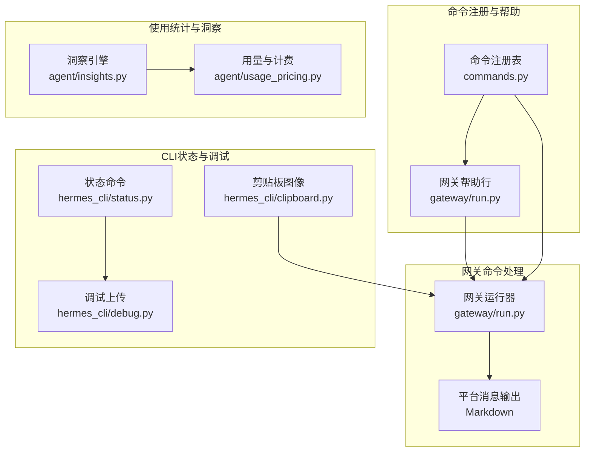
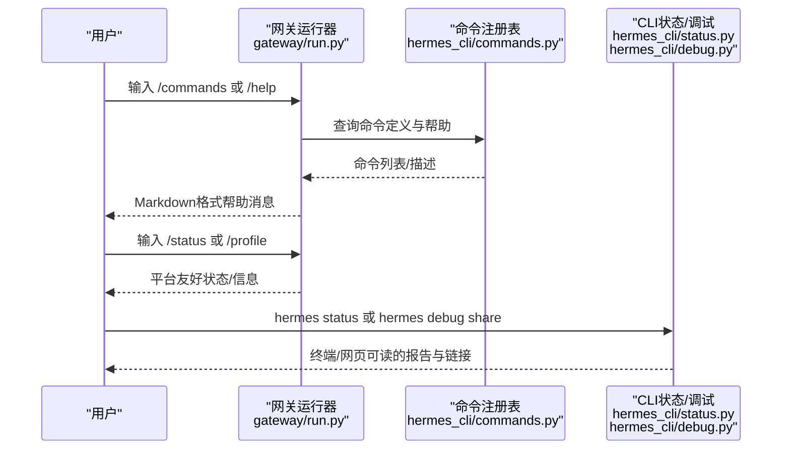
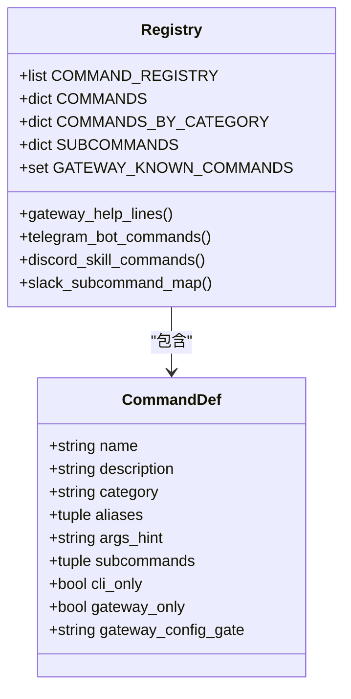
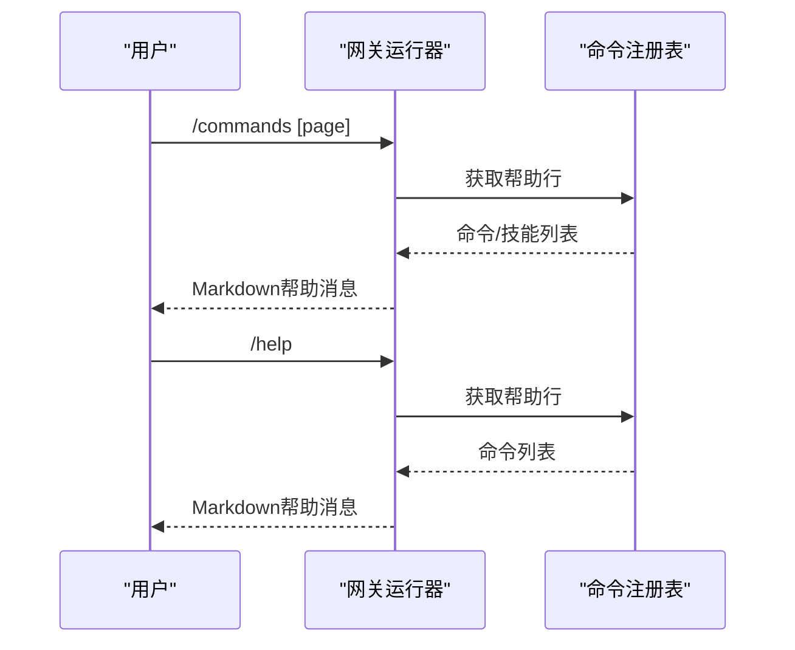
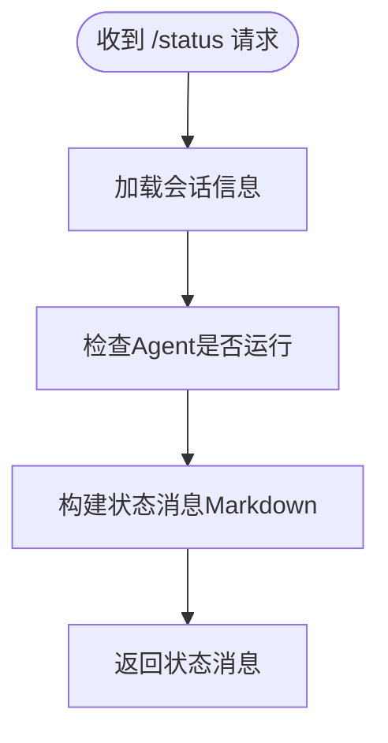
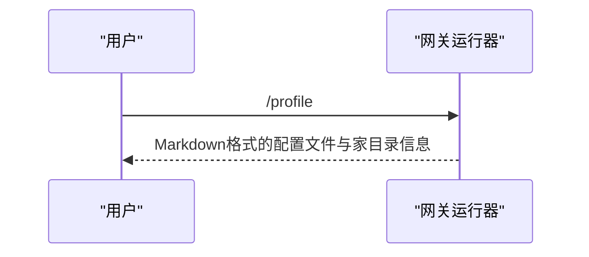
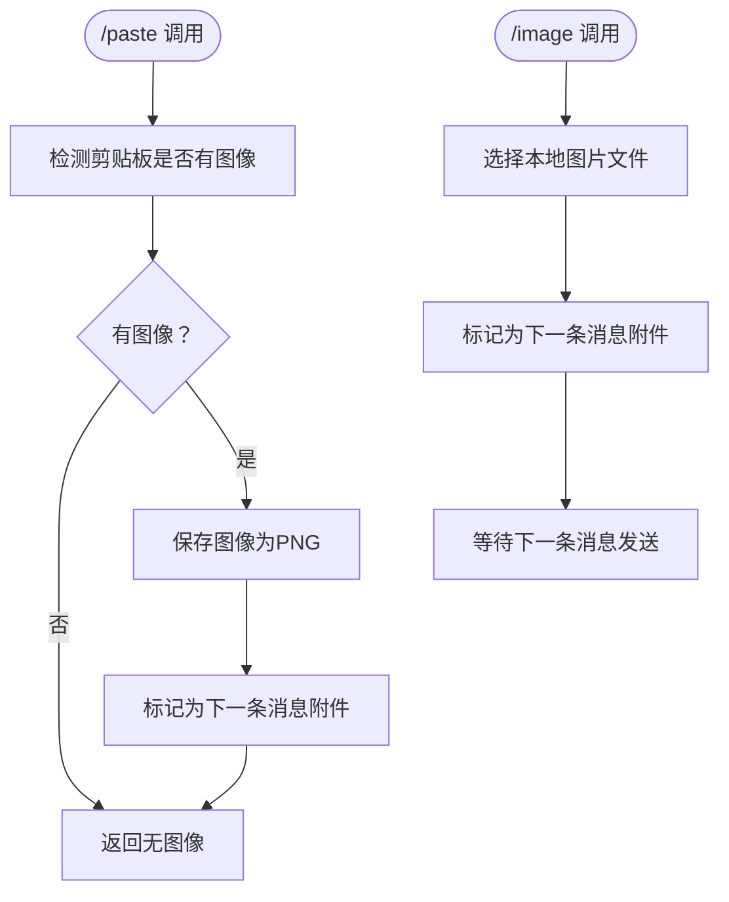
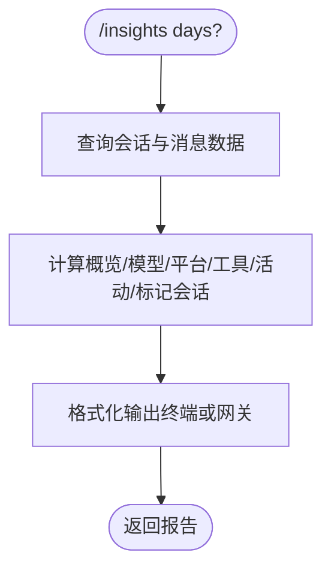
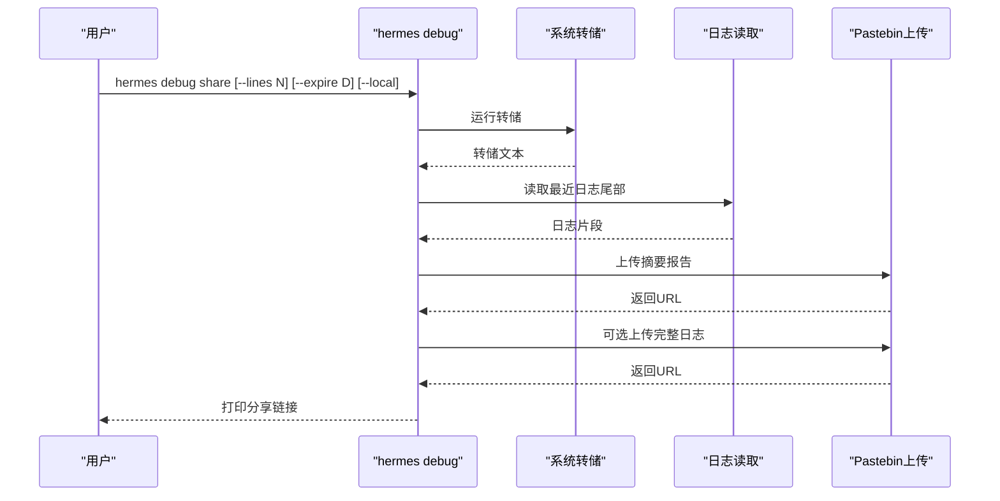
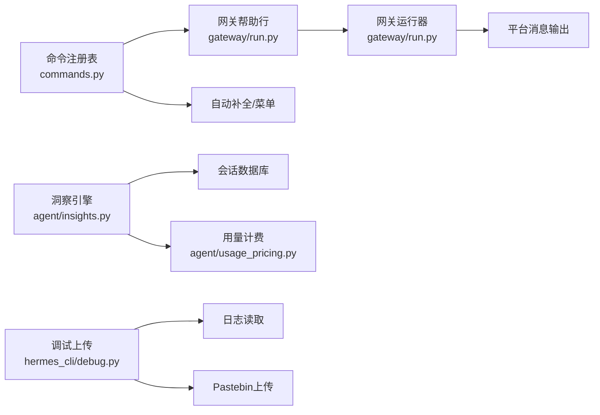

# 信息查询命令

<cite>
**本文档引用的文件**
- [commands.py](file://hermes_cli/commands.py)
- [run.py](file://gateway/run.py)
- [status.py](file://hermes_cli/status.py)
- [debug.py](file://hermes_cli/debug.py)
- [insights.py](file://agent/insights.py)
- [usage_pricing.py](file://agent/usage_pricing.py)
- [clipboard.py](file://hermes_cli/clipboard.py)
- [slash-commands.md](file://website/docs/reference/slash-commands.md)
</cite>

## 目录
1. [简介](#简介)
2. [项目结构](#项目结构)
3. [核心组件](#核心组件)
4. [架构总览](#架构总览)
5. [详细组件分析](#详细组件分析)
6. [依赖分析](#依赖分析)
7. [性能考虑](#性能考虑)
8. [故障排查指南](#故障排查指南)
9. [结论](#结论)
10. [附录](#附录)

## 简介
本参考文档面向Hermes Agent的信息查询命令，系统性梳理并解释以下命令的行为、输出格式与解读方法：/commands、/help、/status、/profile、/platforms、/paste、/image、/update、/debug、/usage、/insights。文档同时覆盖状态信息获取、平台状态监控、使用统计分析维度、调试信息收集与分享流程，并提供最佳实践与常见问题诊断建议。

## 项目结构
信息查询命令在CLI与网关（Gateway）两侧均有实现与展示：
- 命令注册与帮助：集中于命令注册表，供CLI帮助、网关菜单、自动补全等场景复用。
- 网关侧命令处理：由网关运行器统一调度，生成平台友好的Markdown消息。
- CLI侧状态与调试：提供本地状态概览、日志摘要与调试报告上传能力。
- 使用统计与洞察：基于会话数据库生成多维使用报告，支持终端与网关两种格式化输出。

图表来源
- [commands.py:140-162](file://hermes_cli/commands.py#L140-L162)
- [run.py:4156-4176](file://gateway/run.py#L4156-L4176)
- [status.py:85-476](file://hermes_cli/status.py#L85-L476)
- [debug.py:247-337](file://hermes_cli/debug.py#L247-L337)
- [insights.py:112-162](file://agent/insights.py#L112-L162)
- [usage_pricing.py:481-557](file://agent/usage_pricing.py#L481-L557)

章节来源
- [commands.py:140-162](file://hermes_cli/commands.py#L140-L162)
- [run.py:4156-4176](file://gateway/run.py#L4156-L4176)
- [status.py:85-476](file://hermes_cli/status.py#L85-L476)
- [debug.py:247-337](file://hermes_cli/debug.py#L247-L337)
- [insights.py:112-162](file://agent/insights.py#L112-L162)
- [usage_pricing.py:481-557](file://agent/usage_pricing.py#L481-L557)

## 核心组件
- 命令注册与派发：命令定义、别名、参数提示、平台可用性门控均在命令注册表中集中管理，网关帮助与菜单、自动补全均由此派生。
- 网关命令处理器：统一处理/commands、/help、/status、/profile等命令，生成Markdown消息返回给平台。
- CLI状态与调试：/status输出环境、密钥、认证、订阅、平台配置、服务状态、计划任务、会话数等；/debug支持生成并上传调试报告。
- 使用统计与洞察：/usage输出当前会话用量与限流；/insights输出历史30天的模型、平台、工具、活动模式等综合报告。

章节来源
- [commands.py:140-162](file://hermes_cli/commands.py#L140-L162)
- [run.py:4040-4104](file://gateway/run.py#L4040-L4104)
- [status.py:85-476](file://hermes_cli/status.py#L85-L476)
- [debug.py:247-337](file://hermes_cli/debug.py#L247-L337)
- [insights.py:112-162](file://agent/insights.py#L112-L162)

## 架构总览
信息查询命令在不同环境下的交互路径如下：

图表来源
- [run.py:4156-4176](file://gateway/run.py#L4156-L4176)
- [commands.py:140-162](file://hermes_cli/commands.py#L140-L162)
- [status.py:85-476](file://hermes_cli/status.py#L85-L476)
- [debug.py:247-337](file://hermes_cli/debug.py#L247-L337)

## 详细组件分析

### 命令注册与帮助
- 命令注册表集中定义所有命令（含别名、参数提示、分类、平台可用性），用于CLI帮助、网关菜单、自动补全等。
- 网关侧通过“帮助行”生成器输出命令清单，支持技能命令动态注入。

图表来源
- [commands.py:37-50](file://hermes_cli/commands.py#L37-L50)
- [commands.py:56-162](file://hermes_cli/commands.py#L56-L162)
- [commands.py:341-357](file://hermes_cli/commands.py#L341-L357)

章节来源
- [commands.py:37-50](file://hermes_cli/commands.py#L37-L50)
- [commands.py:56-162](file://hermes_cli/commands.py#L56-L162)
- [commands.py:341-357](file://hermes_cli/commands.py#L341-L357)

### /commands 与 /help
- /commands：分页列出所有命令与技能，支持页码参数。
- /help：列出可用命令及简要描述，技能命令单独分组显示。

图表来源
- [run.py:4178-4200](file://gateway/run.py#L4178-L4200)
- [run.py:4156-4176](file://gateway/run.py#L4156-L4176)
- [commands.py:341-357](file://hermes_cli/commands.py#L341-L357)

章节来源
- [run.py:4178-4200](file://gateway/run.py#L4178-L4200)
- [run.py:4156-4176](file://gateway/run.py#L4156-L4176)
- [slash-commands.md:68-78](file://website/docs/reference/slash-commands.md#L68-L78)

### /status（网关）
- 输出当前会话ID、标题、创建/最后活跃时间、累计Token、Agent运行状态、已连接平台等。
- 适合在各平台内快速确认会话状态与运行情况。

图表来源
- [run.py:4070-4104](file://gateway/run.py#L4070-L4104)

章节来源
- [run.py:4070-4104](file://gateway/run.py#L4070-L4104)

### /profile
- 输出当前活动配置文件名称与Hermes家目录显示路径，便于确认运行环境归属。

图表来源
- [run.py:4040-4068](file://gateway/run.py#L4040-L4068)

章节来源
- [run.py:4040-4068](file://gateway/run.py#L4040-L4068)

### /platforms（网关别名：/gateway）
- 在网关侧用于查看平台状态（与CLI的“平台配置”不同），通常用于确认适配器连接状态与平台列表。

章节来源
- [commands.py:149-150](file://hermes_cli/commands.py#L149-L150)
- [slash-commands.md:75](file://website/docs/reference/slash-commands.md#L75)

### /paste 与 /image（CLI）
- /paste：检测系统剪贴板中的图像并保存到临时位置，随后可在下一次输入中作为附件发送。
- /image：直接附加本地图片文件，供后续提示使用。
- 两者均服务于多模态输入场景，提升视觉内容的便捷接入。

图表来源
- [clipboard.py:27-54](file://hermes_cli/clipboard.py#L27-L54)
- [clipboard.py:119-214](file://hermes_cli/clipboard.py#L119-L214)
- [clipboard.py:219-433](file://hermes_cli/clipboard.py#L219-L433)

章节来源
- [clipboard.py:27-54](file://hermes_cli/clipboard.py#L27-L54)
- [clipboard.py:119-214](file://hermes_cli/clipboard.py#L119-L214)
- [clipboard.py:219-433](file://hermes_cli/clipboard.py#L219-L433)
- [slash-commands.md:76-77](file://website/docs/reference/slash-commands.md#L76-L77)

### /usage
- 输出当前会话的消息数量、估算Token总量、缓存读写Token（若非零）、速率限制状态、预估费用（若可得）。
- 对于订阅包含的提供商，费用状态显示为“包含”。

章节来源
- [slash-commands.md:73](file://website/docs/reference/slash-commands.md#L73)
- [usage_pricing.py:481-557](file://agent/usage_pricing.py#L481-L557)

### /insights
- 生成最近N天（默认30天）的综合使用洞察，包括：
  - 概览：会话数、消息数、工具调用次数、Token总量、预估费用、活跃时长、平均会话时长、平均每会话消息数、Token数。
  - 模型拆分：按模型统计会话数、Token、费用（若定价已知）。
  - 平台拆分：按来源平台统计会话数、消息数、Token。
  - 工具使用：Top工具调用次数与占比。
  - 活动模式：按周几与小时分布、活跃天数、最长连续活跃天数。
  - 标记会话：最长会话、消息最多会话、Token最多会话、工具调用最多会话。
- 支持终端与网关两种格式化输出，网关版更简洁。

图表来源
- [insights.py:112-162](file://agent/insights.py#L112-L162)
- [insights.py:324-594](file://agent/insights.py#L324-L594)
- [insights.py:599-790](file://agent/insights.py#L599-L790)

章节来源
- [insights.py:112-162](file://agent/insights.py#L112-L162)
- [insights.py:324-594](file://agent/insights.py#L324-L594)
- [insights.py:599-790](file://agent/insights.py#L599-L790)

### /debug（CLI）
- 支持生成并上传调试报告，包含系统转储、最近日志尾部、以及可选的完整agent.log与gateway.log。
- 提供过期时间设置与本地打印选项，失败时回退到本地输出。

图表来源
- [debug.py:247-337](file://hermes_cli/debug.py#L247-L337)
- [debug.py:206-241](file://hermes_cli/debug.py#L206-L241)

章节来源
- [debug.py:247-337](file://hermes_cli/debug.py#L247-L337)
- [debug.py:206-241](file://hermes_cli/debug.py#L206-L241)

### /update（网关）
- 触发网关更新流程（如适用），用于升级Hermes Agent版本。

章节来源
- [commands.py:155-156](file://hermes_cli/commands.py#L155-L156)
- [slash-commands.md:75](file://website/docs/reference/slash-commands.md#L75)

## 依赖分析
- 命令注册表是CLI帮助、网关菜单、自动补全与平台映射的单一事实来源。
- 网关运行器依赖命令注册表生成帮助行，并根据事件上下文格式化输出。
- 使用洞察依赖会话数据库与用量计费模块，提供跨模型、平台、工具的聚合分析。
- 调试上传依赖日志读取与网络上传模块，确保最小化对生产环境的影响。

图表来源
- [commands.py:341-357](file://hermes_cli/commands.py#L341-L357)
- [run.py:4156-4176](file://gateway/run.py#L4156-L4176)
- [insights.py:112-162](file://agent/insights.py#L112-L162)
- [usage_pricing.py:481-557](file://agent/usage_pricing.py#L481-L557)
- [debug.py:247-337](file://hermes_cli/debug.py#L247-L337)

章节来源
- [commands.py:341-357](file://hermes_cli/commands.py#L341-L357)
- [run.py:4156-4176](file://gateway/run.py#L4156-L4176)
- [insights.py:112-162](file://agent/insights.py#L112-L162)
- [usage_pricing.py:481-557](file://agent/usage_pricing.py#L481-L557)
- [debug.py:247-337](file://hermes_cli/debug.py#L247-L337)

## 性能考虑
- /insights在大数据量下可能涉及数据库扫描与聚合计算，建议合理设置天数窗口与过滤条件（如按平台筛选）。
- /debug上传前先读取日志尾部，避免一次性传输大文件；完整日志可选上传以减少带宽占用。
- 网关帮助行与自动补全依赖命令注册表，保持其轻量化与稳定可复用。

## 故障排查指南
- /status显示Agent未运行
  - 检查网关服务状态与进程；确认会话锁未被阻塞。
- /usage费用显示“未知”
  - 当前模型/路由无官方定价或自托管端点，费用无法估算。
- /insights无数据
  - 确认会话数据库存在且有历史数据；检查时间窗口设置。
- /debug上传失败
  - 检查网络连通性；尝试本地输出以便手动分享；调整过期时间或改用本地模式。
- /paste无图像
  - 确认剪贴板确实包含图像；不同平台/终端组合支持度不同；必要时使用/clipboard替代方案。

章节来源
- [run.py:4070-4104](file://gateway/run.py#L4070-L4104)
- [usage_pricing.py:500-501](file://agent/usage_pricing.py#L500-L501)
- [insights.py:130-141](file://agent/insights.py#L130-L141)
- [debug.py:282-318](file://hermes_cli/debug.py#L282-L318)

## 结论
本文档系统梳理了Hermes Agent的信息查询命令，涵盖命令行为、输出格式与解读方法，并结合实际代码实现给出架构图与流程图。通过这些命令，用户可以在CLI与网关环境中高效地获取状态、监控平台、分析使用统计、收集并分享调试信息，从而提升运维效率与问题定位速度。

## 附录
- 命令一览与用途参考：[slash-commands.md:68-78](file://website/docs/reference/slash-commands.md#L68-L78)
- 命令注册与派发机制：[commands.py:56-162](file://hermes_cli/commands.py#L56-L162)
- 网关命令处理入口：[run.py:4156-4176](file://gateway/run.py#L4156-L4176)
- CLI状态与调试：[status.py:85-476](file://hermes_cli/status.py#L85-L476)、[debug.py:247-337](file://hermes_cli/debug.py#L247-L337)
- 使用统计与洞察：[insights.py:112-790](file://agent/insights.py#L112-790)、[usage_pricing.py:481-557](file://agent/usage_pricing.py#L481-557)
- 多模态输入（剪贴板/本地图片）：[clipboard.py:27-433](file://hermes_cli/clipboard.py#L27-L433)