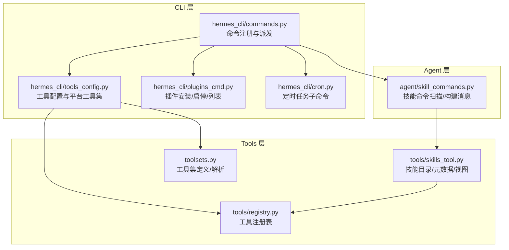
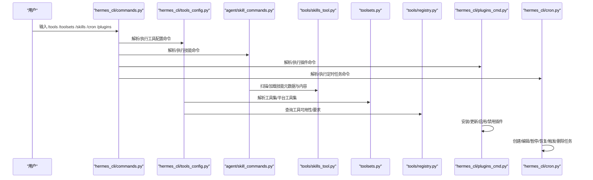
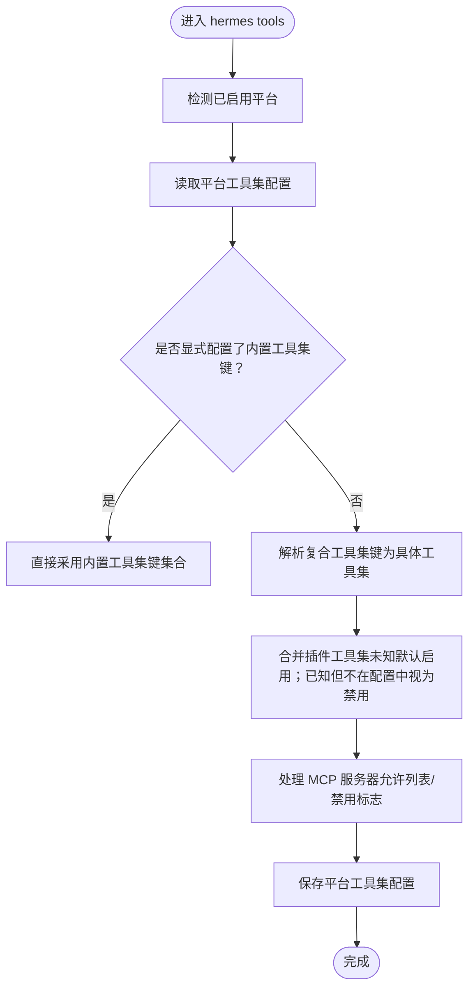
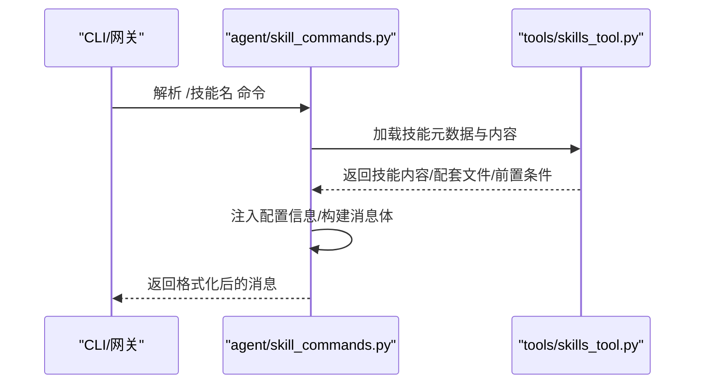
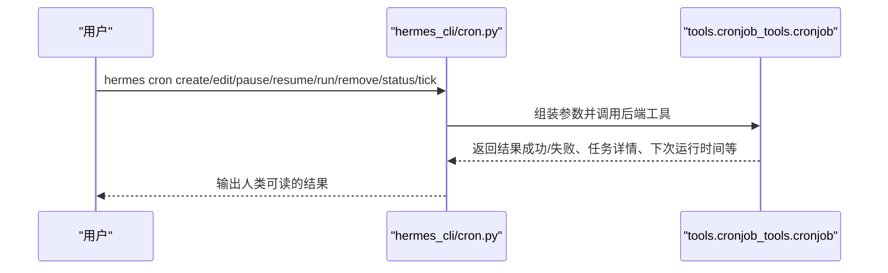
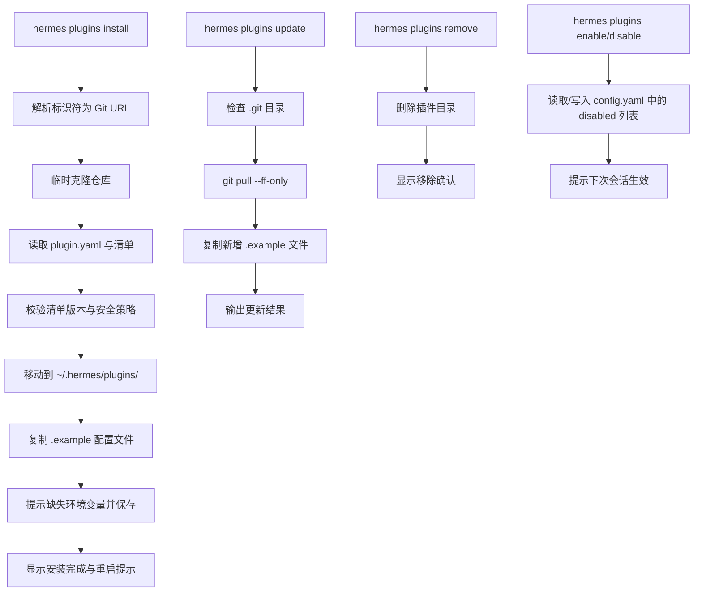
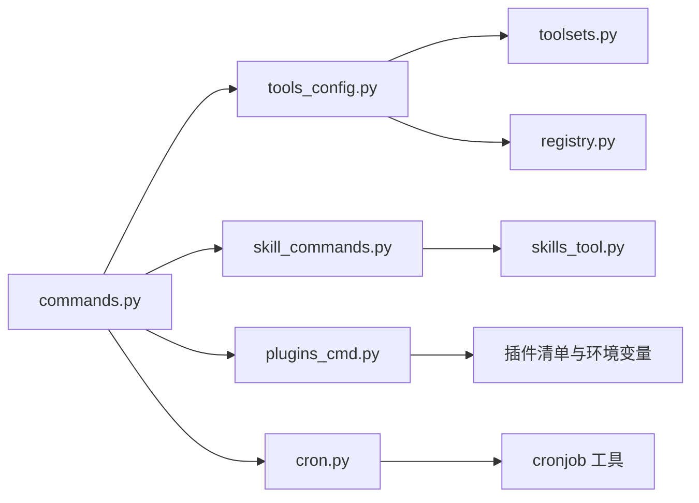

# 工具技能命令

<cite>
**本文引用的文件**
- [hermes_cli/tools_config.py](file://hermes_cli/tools_config.py)
- [hermes_cli/plugins_cmd.py](file://hermes_cli/plugins_cmd.py)
- [hermes_cli/cron.py](file://hermes_cli/cron.py)
- [agent/skill_commands.py](file://agent/skill_commands.py)
- [tools/skills_tool.py](file://tools/skills_tool.py)
- [toolsets.py](file://toolsets.py)
- [tools/registry.py](file://tools/registry.py)
- [hermes_cli/commands.py](file://hermes_cli/commands.py)
</cite>

## 目录
1. [简介](#简介)
2. [项目结构](#项目结构)
3. [核心组件](#核心组件)
4. [架构总览](#架构总览)
5. [详细组件分析](#详细组件分析)
6. [依赖分析](#依赖分析)
7. [性能考虑](#性能考虑)
8. [故障排查指南](#故障排查指南)
9. [结论](#结论)
10. [附录](#附录)

## 简介
本参考文档围绕 Hermes Agent 的“工具技能命令”体系，系统梳理以下命令与能力：
- 工具管理命令：/tools、/toolsets
- 技能管理命令：/skills
- 定时任务命令：/cron
- 插件管理命令：/plugins

内容覆盖工具启用/禁用机制、工具集（toolset）概念与使用、技能的安装/搜索/检查/管理流程、定时任务的创建/调度/监控方法，以及插件的安装/配置/状态管理。同时提供性能优化建议与安全注意事项，帮助用户在不同平台与场景下高效、安全地使用工具与技能。

## 项目结构
围绕“工具技能命令”的相关模块主要分布在以下路径：
- hermes_cli：命令注册、CLI 子命令实现（tools_config、plugins_cmd、cron）
- agent：技能命令解析与消息构建（skill_commands）
- tools：技能工具与工具注册（skills_tool、registry）
- toolsets：工具集定义与解析（toolsets）

**图表来源**
- [hermes_cli/commands.py:121-138](file://hermes_cli/commands.py#L121-L138)
- [hermes_cli/tools_config.py:465-563](file://hermes_cli/tools_config.py#L465-L563)
- [hermes_cli/plugins_cmd.py:284-595](file://hermes_cli/plugins_cmd.py#L284-L595)
- [hermes_cli/cron.py:160-290](file://hermes_cli/cron.py#L160-L290)
- [agent/skill_commands.py:200-327](file://agent/skill_commands.py#L200-L327)
- [tools/skills_tool.py:711-777](file://tools/skills_tool.py#L711-L777)
- [toolsets.py:395-467](file://toolsets.py#L395-L467)

**章节来源**
- [hermes_cli/commands.py:121-138](file://hermes_cli/commands.py#L121-L138)
- [hermes_cli/tools_config.py:465-563](file://hermes_cli/tools_config.py#L465-L563)
- [hermes_cli/plugins_cmd.py:284-595](file://hermes_cli/plugins_cmd.py#L284-L595)
- [hermes_cli/cron.py:160-290](file://hermes_cli/cron.py#L160-L290)
- [agent/skill_commands.py:200-327](file://agent/skill_commands.py#L200-L327)
- [tools/skills_tool.py:711-777](file://tools/skills_tool.py#L711-L777)
- [toolsets.py:395-467](file://toolsets.py#L395-L467)

## 核心组件
- 命令注册中心：集中定义所有斜杠命令及其类别、别名、参数提示、子命令等，供 CLI、网关、平台菜单统一使用。
- 工具配置与平台工具集：按平台聚合工具集，支持启用/禁用、MCP 服务器、插件工具集发现与合并。
- 技能系统：扫描本地与外部技能目录，构建技能命令映射，加载技能内容与配套文件，注入配置信息。
- 工具集系统：定义可组合的工具集合，支持递归解析、别名、插件扩展。
- 插件系统：安装/更新/移除/启用/禁用插件，读取插件清单与环境变量需求，提供内存/上下文引擎配置入口。
- 定时任务系统：CLI 子命令封装，调用后端工具执行任务的创建/编辑/暂停/恢复/触发/删除与状态查询。

**章节来源**
- [hermes_cli/commands.py:56-162](file://hermes_cli/commands.py#L56-L162)
- [hermes_cli/tools_config.py:465-563](file://hermes_cli/tools_config.py#L465-L563)
- [agent/skill_commands.py:200-327](file://agent/skill_commands.py#L200-L327)
- [toolsets.py:395-467](file://toolsets.py#L395-L467)
- [hermes_cli/plugins_cmd.py:284-595](file://hermes_cli/plugins_cmd.py#L284-L595)
- [hermes_cli/cron.py:160-290](file://hermes_cli/cron.py#L160-L290)

## 架构总览
下图展示“工具技能命令”在系统中的交互关系与数据流：

**图表来源**
- [hermes_cli/commands.py:121-138](file://hermes_cli/commands.py#L121-L138)
- [hermes_cli/tools_config.py:465-563](file://hermes_cli/tools_config.py#L465-L563)
- [agent/skill_commands.py:200-327](file://agent/skill_commands.py#L200-L327)
- [tools/skills_tool.py:711-777](file://tools/skills_tool.py#L711-L777)
- [toolsets.py:395-467](file://toolsets.py#L395-L467)
- [tools/registry.py:223-255](file://tools/registry.py#L223-L255)
- [hermes_cli/plugins_cmd.py:284-595](file://hermes_cli/plugins_cmd.py#L284-L595)
- [hermes_cli/cron.py:160-290](file://hermes_cli/cron.py#L160-L290)

## 详细组件分析

### 工具管理命令：/tools 与 /toolsets
- /toolsets：列出可用工具集，支持按类别/平台过滤，显示描述与工具数量。
- /tools：提供工具集选择与配置，支持：
  - 平台维度：Telegram/Discord/Slack 等默认工具集
  - 工具集维度：web、browser、terminal、file、vision、image_gen、moa、tts、skills、todo、memory、session_search、clarify、delegation、cronjob、rl、homeassistant 等
  - 启用/禁用：保存到配置，区分“显式配置”与“复合工具集推断”
  - MCP 服务器：允许/禁止特定 MCP 服务或全局默认 MCP
  - 插件工具集：自动发现并默认启用新插件工具集，已知但未列出视为禁用

**图表来源**
- [hermes_cli/tools_config.py:465-563](file://hermes_cli/tools_config.py#L465-L563)
- [toolsets.py:410-467](file://toolsets.py#L410-L467)

**章节来源**
- [hermes_cli/tools_config.py:465-563](file://hermes_cli/tools_config.py#L465-L563)
- [toolsets.py:395-467](file://toolsets.py#L395-L467)

### 技能管理命令：/skills
- 技能目录与元数据：技能以 SKILL.md 为主文件，支持 YAML 前言元数据（名称、描述、平台限制、前置条件、元信息等），并支持 references/templates/assets 等配套文件。
- 技能命令扫描：从本地与外部技能目录扫描，构建“/技能名”命令映射，过滤不兼容平台与被禁用技能。
- 技能内容加载：按需加载完整内容、链接文件、运行时配置注入，支持“预加载技能”用于会话引导。
- 技能分类与列表：支持按类别列出技能，统计数量，提供简要描述与提示。

**图表来源**
- [agent/skill_commands.py:200-327](file://agent/skill_commands.py#L200-L327)
- [tools/skills_tool.py:711-777](file://tools/skills_tool.py#L711-L777)

**章节来源**
- [agent/skill_commands.py:200-327](file://agent/skill_commands.py#L200-L327)
- [tools/skills_tool.py:711-777](file://tools/skills_tool.py#L711-L777)

### 定时任务命令：/cron
- 支持子命令：list、create/add、edit、pause、resume、run、remove、status、tick
- 列表展示：显示任务 ID、名称、计划表达式、重复次数、下次运行时间、交付目标、技能/脚本、最后运行状态与错误、网关运行状态
- 状态检查：显示网关进程是否存在，以及最近一次运行时间
- 调度执行：tick 触发一次到期任务执行
- 任务生命周期：创建、编辑（含技能增删改）、暂停/恢复、手动触发、删除

**图表来源**
- [hermes_cli/cron.py:160-290](file://hermes_cli/cron.py#L160-L290)

**章节来源**
- [hermes_cli/cron.py:160-290](file://hermes_cli/cron.py#L160-L290)

### 插件管理命令：/plugins
- 安装：支持 owner/repo 或完整 Git URL，克隆到 ~/.hermes/plugins/，读取 plugin.yaml，复制 .example 文件，提示缺失环境变量，显示安装后说明
- 更新：拉取最新版本，复制新增 .example 文件
- 移除：删除插件目录
- 启用/禁用：写入配置中的 disabled 列表，重启网关生效
- 列表：展示已安装插件、版本、描述、来源（本地/Git），以及当前内存提供者与上下文引擎配置入口

**图表来源**
- [hermes_cli/plugins_cmd.py:284-595](file://hermes_cli/plugins_cmd.py#L284-L595)

**章节来源**
- [hermes_cli/plugins_cmd.py:284-595](file://hermes_cli/plugins_cmd.py#L284-L595)

## 依赖分析
- 命令注册中心（commands.py）为所有平台与界面提供统一命令定义与派发逻辑，包括别名、子命令、平台可用性门控。
- 工具配置（tools_config.py）依赖工具集（toolsets.py）进行解析，并通过工具注册表（registry.py）检查工具可用性与要求。
- 技能命令（skill_commands.py）依赖技能工具（skills_tool.py）扫描与加载技能内容。
- 定时任务（cron.py）通过后端工具（tools.cronjob_tools）实现任务生命周期管理。
- 插件（plugins_cmd.py）依赖 hermes_home 目录结构与 plugin.yaml 清单，支持内存/上下文引擎配置。

**图表来源**
- [hermes_cli/commands.py:56-162](file://hermes_cli/commands.py#L56-L162)
- [hermes_cli/tools_config.py:465-563](file://hermes_cli/tools_config.py#L465-L563)
- [agent/skill_commands.py:200-327](file://agent/skill_commands.py#L200-L327)
- [tools/skills_tool.py:711-777](file://tools/skills_tool.py#L711-L777)
- [toolsets.py:395-467](file://toolsets.py#L395-L467)
- [tools/registry.py:223-255](file://tools/registry.py#L223-L255)
- [hermes_cli/plugins_cmd.py:284-595](file://hermes_cli/plugins_cmd.py#L284-L595)
- [hermes_cli/cron.py:160-290](file://hermes_cli/cron.py#L160-L290)

**章节来源**
- [hermes_cli/commands.py:56-162](file://hermes_cli/commands.py#L56-L162)
- [hermes_cli/tools_config.py:465-563](file://hermes_cli/tools_config.py#L465-L563)
- [agent/skill_commands.py:200-327](file://agent/skill_commands.py#L200-L327)
- [tools/skills_tool.py:711-777](file://tools/skills_tool.py#L711-L777)
- [toolsets.py:395-467](file://toolsets.py#L395-L467)
- [tools/registry.py:223-255](file://tools/registry.py#L223-L255)
- [hermes_cli/plugins_cmd.py:284-595](file://hermes_cli/plugins_cmd.py#L284-L595)
- [hermes_cli/cron.py:160-290](file://hermes_cli/cron.py#L160-L290)

## 性能考虑
- 工具集解析缓存：工具集解析涉及递归与去重，建议在高频场景避免重复扫描；工具令牌估算仅在需要时触发并缓存结果，减少开销。
- 技能扫描与加载：技能扫描按需加载，避免一次性读取全部内容；建议合理组织技能目录层级，减少 IO 压力。
- 插件安装与依赖：安装前复制 .example 配置文件，避免重复覆盖；Node/MCP 依赖安装失败时提供明确提示，便于快速定位问题。
- 定时任务调度：tick 仅执行到期任务，建议结合网关状态检查，避免无效轮询。

[本节为通用指导，无需引用具体文件]

## 故障排查指南
- 工具集未生效
  - 检查平台工具集配置是否为“显式配置”，否则复合工具集可能被推断导致误判
  - 确认插件工具集是否被“已知但未列出”视为禁用
  - 参考：[hermes_cli/tools_config.py:465-563](file://hermes_cli/tools_config.py#L465-L563)
- 技能命令不可用
  - 确认技能是否被禁用或平台不兼容
  - 检查技能目录权限与编码
  - 参考：[agent/skill_commands.py:200-327](file://agent/skill_commands.py#L200-L327)
- 定时任务未触发
  - 检查网关是否运行，使用 status 查看 PID 与最近运行时间
  - 使用 tick 手动触发一次到期任务
  - 参考：[hermes_cli/cron.py:127-157](file://hermes_cli/cron.py#L127-L157)
- 插件安装失败
  - 检查 Git 是否可用、URL 是否安全、清单版本是否受支持
  - 确认 .example 配置文件复制与环境变量提示是否正确
  - 参考：[hermes_cli/plugins_cmd.py:284-595](file://hermes_cli/plugins_cmd.py#L284-L595)

**章节来源**
- [hermes_cli/tools_config.py:465-563](file://hermes_cli/tools_config.py#L465-L563)
- [agent/skill_commands.py:200-327](file://agent/skill_commands.py#L200-L327)
- [hermes_cli/cron.py:127-157](file://hermes_cli/cron.py#L127-L157)
- [hermes_cli/plugins_cmd.py:284-595](file://hermes_cli/plugins_cmd.py#L284-L595)

## 结论
本文档系统化梳理了 Hermes Agent 的工具技能命令体系，涵盖工具集与工具管理、技能的全生命周期、定时任务的创建与监控，以及插件的安装与配置。通过命令注册中心与各模块的职责划分，系统实现了跨平台的一致体验与可扩展能力。建议在实际使用中结合平台特性与安全策略，合理配置工具集与技能，定期维护插件与定时任务，以获得稳定高效的自动化体验。

[本节为总结性内容，无需引用具体文件]

## 附录
- 常用命令速览
  - /tools：管理工具集与平台工具集，支持启用/禁用、MCP 服务器控制
  - /toolsets：查看可用工具集与工具数量
  - /skills：搜索/浏览/检查/安装技能，支持按类别筛选
  - /cron：管理定时任务（list/create/edit/pause/resume/run/remove/status/tick）
  - /plugins：安装/更新/移除/启用/禁用插件，查看列表与状态

[本节为概览性内容，无需引用具体文件]