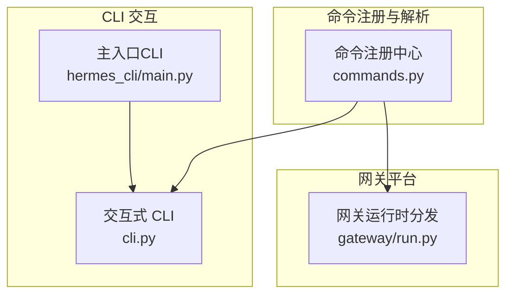
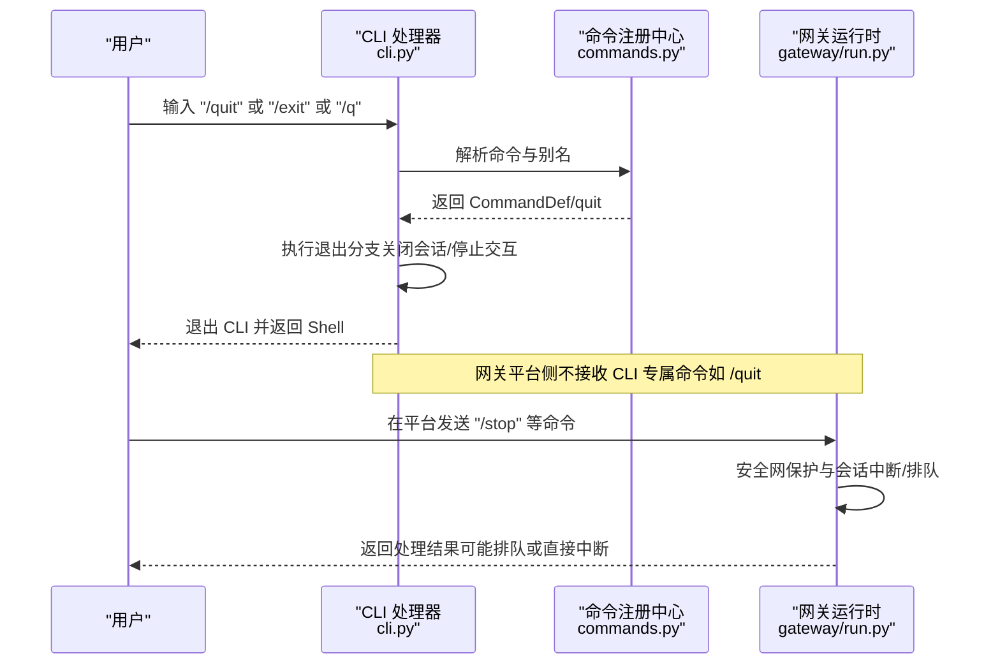
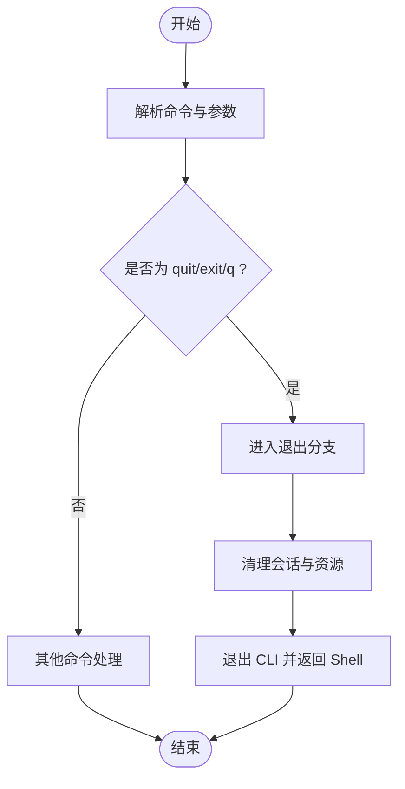
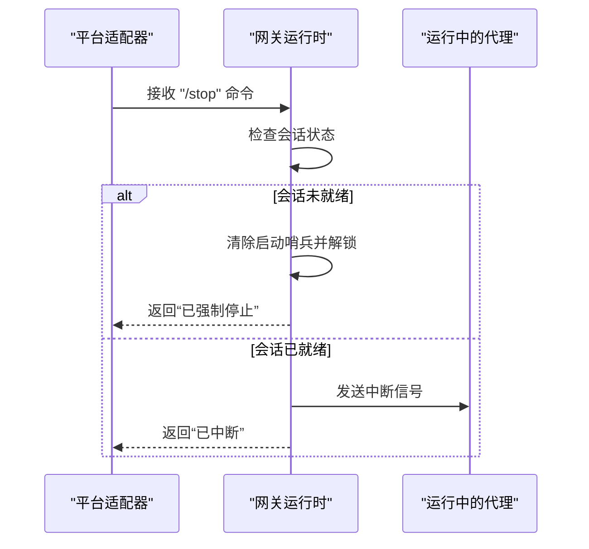
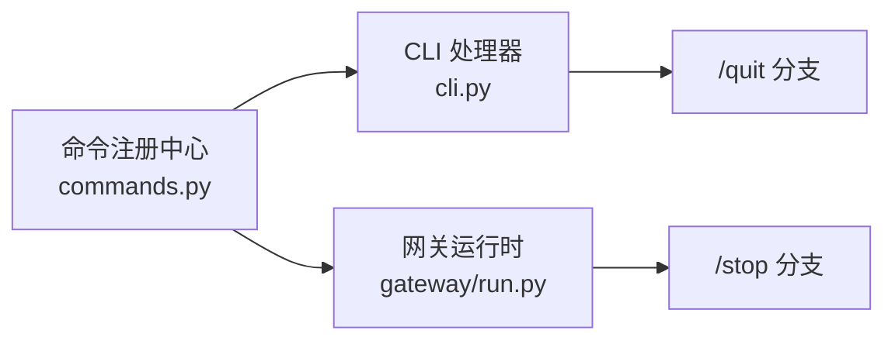

# 退出命令

<cite>
**本文引用的文件**
- [cli.py](file://cli.py)
- [commands.py](file://hermes_cli/commands.py)
- [test_commands.py](file://tests/hermes_cli/test_commands.py)
- [run.py](file://gateway/run.py)
- [main.py](file://hermes_cli/main.py)
</cite>

## 目录
1. [简介](#简介)
2. [项目结构](#项目结构)
3. [核心组件](#核心组件)
4. [架构总览](#架构总览)
5. [详细组件分析](#详细组件分析)
6. [依赖分析](#依赖分析)
7. [性能考虑](#性能考虑)
8. [故障排查指南](#故障排查指南)
9. [结论](#结论)

## 简介
本参考文档聚焦于 Hermes Agent 的“退出”相关命令，包括 /quit、/exit、/q 等。文档将系统阐述以下内容：
- 命令行为差异与别名映射
- 退出前的清理流程与后台任务处理
- 优雅退出与强制退出的区别
- 退出对会话状态的影响
- 安全使用建议（避免数据丢失与资源泄漏）
- 退出过程中的错误处理与恢复机制

## 项目结构
围绕“退出命令”的关键代码分布在 CLI 交互层与命令注册中心，并在网关平台侧有相应的命令分发与安全网保护逻辑。

图示来源
- [commands.py:56-162](file://hermes_cli/commands.py#L56-L162)
- [cli.py:5450-5699](file://cli.py#L5450-L5699)
- [run.py:2570-2769](file://gateway/run.py#L2570-L2769)
- [main.py:758-784](file://hermes_cli/main.py#L758-L784)

章节来源
- [commands.py:56-162](file://hermes_cli/commands.py#L56-L162)
- [cli.py:5450-5699](file://cli.py#L5450-L5699)
- [run.py:2570-2769](file://gateway/run.py#L2570-L2769)
- [main.py:758-784](file://hermes_cli/main.py#L758-L784)

## 核心组件
- 命令注册中心：集中定义所有斜杠命令及其别名、分类、参数提示等；其中 /quit 命令被声明为仅 CLI 可用，并带有别名 exit、q。
- CLI 交互层：负责解析用户输入、识别斜杠命令、执行对应处理分支；在 /queue 等命令处理中体现了“前缀匹配优先短命中最短”的策略，从而确保 /q 被识别为 /queue 而非 /quit。
- 网关运行时：在平台消息到达时进行命令解析与分发，对活跃会话中断、排队、重启等进行统一控制；对 /stop 等命令有安全网保护，防止误中断或竞态。

章节来源
- [commands.py:56-162](file://hermes_cli/commands.py#L56-L162)
- [cli.py:5450-5699](file://cli.py#L5450-L5699)
- [run.py:2570-2769](file://gateway/run.py#L2570-L2769)

## 架构总览
下图展示从用户输入到命令处理的整体路径，以及退出相关命令在不同环境中的行为边界。

图示来源
- [commands.py:56-162](file://hermes_cli/commands.py#L56-L162)
- [cli.py:5450-5699](file://cli.py#L5450-L5699)
- [run.py:2570-2769](file://gateway/run.py#L2570-L2769)

## 详细组件分析

### 命令注册与别名映射
- /quit 命令定义：属于“退出”类别，仅 CLI 可用，别名为 exit、q。
- 别名解析测试覆盖：单元测试验证 q、exit 均可解析为 quit 的规范名称。
- CLI 侧帮助与自动补全：/quit 不出现在网关可用命令集合中，确保其仅在 CLI 环境生效。

章节来源
- [commands.py:159-162](file://hermes_cli/commands.py#L159-L162)
- [test_commands.py:97-104](file://tests/hermes_cli/test_commands.py#L97-L104)
- [test_commands.py:120-140](file://tests/hermes_cli/test_commands.py#L120-L140)

### CLI 中的命令处理与前缀匹配
- 命令分支选择：在处理函数中，/quit、/exit、/q 均会被解析为 quit 的规范名称并进入同一处理分支。
- 前缀匹配策略：当存在多个候选命令时，优先选择“最短唯一前缀”，例如 /qui 会被扩展为 /quit 而不是更长的 /quint-pipeline，从而保证 /q 作为 /queue 的别名不会被误判为 /quit。
- 退出分支行为：在 CLI 侧，/quit 将触发 CLI 退出流程（关闭会话、释放资源、返回 Shell），具体实现位于 CLI 主循环与会话管理处。

图示来源
- [cli.py:5450-5699](file://cli.py#L5450-L5699)
- [cli.py:5535-5573](file://cli.py#L5535-L5573)

章节来源
- [cli.py:5450-5699](file://cli.py#L5450-L5699)
- [cli.py:5535-5573](file://cli.py#L5535-L5573)

### 网关平台中的命令分发与安全网
- 命令分发：网关运行时根据命令名称进行分发，/stop 命令会触发安全网保护逻辑，避免在会话启动中或正在运行时造成竞态。
- 安全网保护：若会话处于“待启动”状态且收到 /stop，则清除启动哨兵并解锁会话；否则会根据当前状态进行中断或排队。
- 与退出命令的关系：/stop 用于终止活跃会话，而 /quit 是 CLI 专属退出命令；两者在语义上互补：前者面向“会话运行中”的中断，后者面向“CLI 交互层”的退出。

图示来源
- [run.py:2570-2769](file://gateway/run.py#L2570-L2769)

章节来源
- [run.py:2570-2769](file://gateway/run.py#L2570-L2769)

### 退出前的清理流程与后台进程处理
- 会话清理：CLI 退出前会完成会话状态的收尾（如持久化必要信息、关闭流式输出缓冲等），确保对话历史与上下文不被破坏。
- 后台任务处理：CLI 退出通常会停止当前会话的交互，但不会强制终止已在运行的后台任务；后台任务会在其自身生命周期内自行完成或由系统回收。
- 网关侧的后台任务：网关平台对后台任务（如 /background）有独立的生命周期管理，CLI 退出不影响网关侧已启动的任务。

章节来源
- [cli.py:5603-5699](file://cli.py#L5603-L5699)
- [run.py:2570-2769](file://gateway/run.py#L2570-L2769)

### 优雅退出 vs 强制退出
- 优雅退出：通过 /quit 进入 CLI 退出流程，系统按顺序完成清理与资源释放，尽量保持一致性与可恢复性。
- 强制退出：在 CLI 退出过程中，若检测到会话处于异常状态（例如长时间无响应），系统可能采取更激进的清理策略以避免阻塞。
- 网关侧的强制停止：/stop 在网关侧对“未就绪”会话采用强制清理策略，对“已就绪”会话采用中断策略，二者均属于平台级的“强制”手段。

章节来源
- [cli.py:5450-5699](file://cli.py#L5450-L5699)
- [run.py:2570-2769](file://gateway/run.py#L2570-L2769)

### 退出对会话状态的影响
- CLI 退出：会话上下文在 CLI 退出后保持不变，下次可通过会话恢复继续对话；退出不会删除历史记录。
- 网关侧中断：/stop 会中断当前会话的交互，但不会删除历史；若会话处于“待启动”阶段，/stop 会解锁会话以便后续操作。
- 队列与重试：/queue 等命令在 CLI 侧会将请求放入队列，退出不会影响这些队列项的后续处理。

章节来源
- [run.py:2570-2769](file://gateway/run.py#L2570-L2769)
- [cli.py:5450-5699](file://cli.py#L5450-L5699)

### 安全使用建议
- 使用 /quit 退出 CLI，避免在网关平台直接输入该命令，以免混淆。
- 在退出前确认无重要后台任务在运行，或在退出后检查任务状态。
- 若需要立即终止活跃会话，请使用网关平台的 /stop 命令，而非依赖 CLI 退出。
- 避免在退出时进行可能产生副作用的操作（如危险命令审批流程），确保退出前已完成必要的确认步骤。

章节来源
- [commands.py:159-162](file://hermes_cli/commands.py#L159-L162)
- [run.py:2570-2769](file://gateway/run.py#L2570-L2769)

## 依赖分析
- 命令注册中心为 CLI 与网关提供统一的命令解析能力，/quit 仅在 CLI 生效，/stop 在网关生效。
- CLI 与网关分别维护各自的退出与中断策略，避免相互干扰。
- 前缀匹配与别名解析在 CLI 侧确保 /q 作为 /queue 别名的正确性，同时不影响 /quit 的识别。

图示来源
- [commands.py:56-162](file://hermes_cli/commands.py#L56-L162)
- [cli.py:5450-5699](file://cli.py#L5450-L5699)
- [run.py:2570-2769](file://gateway/run.py#L2570-L2769)

章节来源
- [commands.py:56-162](file://hermes_cli/commands.py#L56-L162)
- [cli.py:5450-5699](file://cli.py#L5450-L5699)
- [run.py:2570-2769](file://gateway/run.py#L2570-L2769)

## 性能考虑
- 前缀匹配与别名解析在 CLI 侧采用“最短唯一前缀”策略，减少歧义与重解析开销。
- 网关侧对“未就绪”会话的强制清理避免了长时间阻塞，提升整体吞吐。
- CLI 退出流程尽量减少阻塞点，确保快速返回 Shell。

## 故障排查指南
- 问题：/q 被识别为 /quit 而非 /queue
  - 原因：前缀匹配优先选择最短唯一前缀，/qui 更短于 /quint-pipeline，因此 /q 会被扩展为 /quit。
  - 解决：在需要队列时明确使用 /queue 或在需要退出时使用 /quit。
- 问题：/quit 在网关平台无效
  - 原因：/quit 仅 CLI 可用，网关平台不识别该命令。
  - 解决：在网关平台使用 /stop 终止会话。
- 问题：退出后发现后台任务仍在运行
  - 原因：CLI 退出不强制终止后台任务。
  - 解决：在网关平台查看任务状态或使用相应命令管理后台任务。

章节来源
- [cli.py:5535-5573](file://cli.py#L5535-L5573)
- [test_commands.py:97-104](file://tests/hermes_cli/test_commands.py#L97-L104)
- [run.py:2570-2769](file://gateway/run.py#L2570-L2769)

## 结论
- /quit、/exit、/q 在命令注册中心被统一映射到 quit 的规范名称，CLI 侧通过前缀匹配与别名解析确保行为一致。
- CLI 退出与网关中断（/stop）职责清晰：前者用于退出 CLI 交互层，后者用于终止活跃会话。
- 退出流程注重清理与资源释放，避免数据丢失与资源泄漏；后台任务遵循各自生命周期管理。
- 实践中应根据场景选择合适的命令（/quit 用于 CLI 退出，/stop 用于网关停机），并关注退出后的状态与任务收尾。