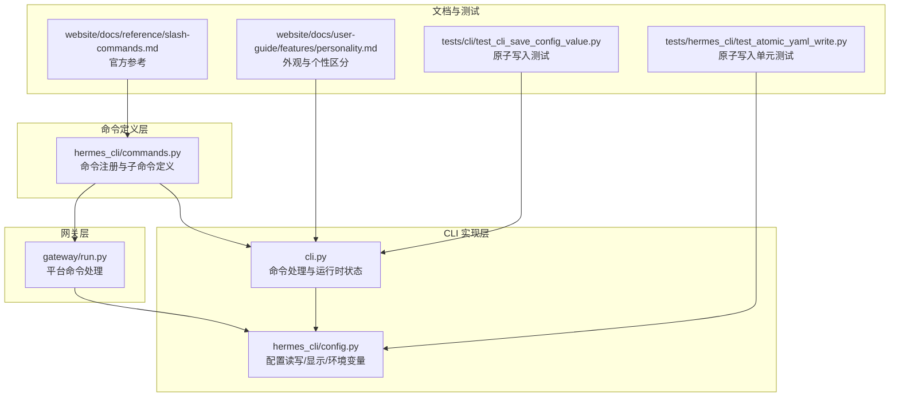
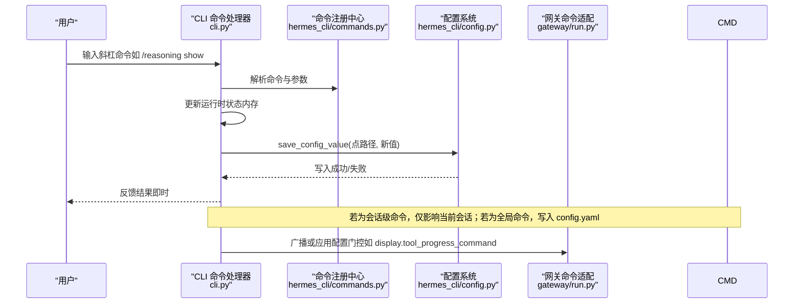
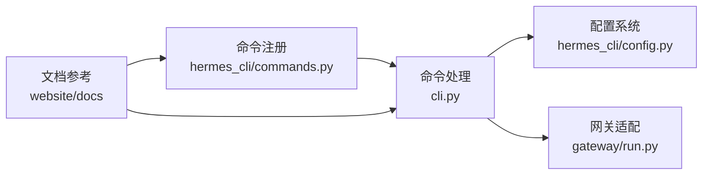

# 配置管理命令

<cite>
**本文引用的文件**
- [cli.py](file://cli.py)
- [commands.py](file://hermes_cli/commands.py)
- [config.py](file://hermes_cli/config.py)
- [run.py](file://gateway/run.py)
- [test_cli_save_config_value.py](file://tests/cli/test_cli_save_config_value.py)
- [atomic_yaml_write.py](file://tests/hermes_cli/test_atomic_yaml_write.py)
- [slash-commands.md](file://website/docs/reference/slash-commands.md)
- [personality.md](file://website/docs/user-guide/features/personality.md)
</cite>

## 目录
1. [简介](#简介)
2. [项目结构](#项目结构)
3. [核心组件](#核心组件)
4. [架构总览](#架构总览)
5. [详细组件分析](#详细组件分析)
6. [依赖分析](#依赖分析)
7. [性能考虑](#性能考虑)
8. [故障排除指南](#故障排除指南)
9. [结论](#结论)

## 简介
本文件为 Hermes Agent 的配置管理命令提供完整参考，覆盖以下命令：
- /config、/model、/provider、/personality、/statusbar、/verbose、/yolo、/reasoning、/fast、/skin、/voice

内容包括：命令用途、参数、作用范围（会话级/全局）、与配置文件的关系、默认值、取值范围、相互影响、变更生效方式、持久化机制与回滚方法、典型应用场景与故障排除。

## 项目结构
与配置管理命令直接相关的代码分布在如下模块：
- 命令注册与自动补全：hermes_cli/commands.py
- CLI 交互与命令处理：cli.py
- 配置读写与显示：hermes_cli/config.py
- 网关平台命令处理：gateway/run.py
- 文档与用户指南：website/docs/reference/slash-commands.md、website/docs/user-guide/features/personality.md
- 测试用例：tests/cli/test_cli_save_config_value.py、tests/hermes_cli/test_atomic_yaml_write.py

**图表来源**
- [commands.py:1-120](file://hermes_cli/commands.py#L1-L120)
- [cli.py:6080-6262](file://cli.py#L6080-L6262)
- [config.py:2663-2800](file://hermes_cli/config.py#L2663-L2800)
- [run.py:4626-4657](file://gateway/run.py#L4626-L4657)

**章节来源**
- [commands.py:1-120](file://hermes_cli/commands.py#L1-L120)
- [cli.py:6080-6262](file://cli.py#L6080-L6262)
- [config.py:2663-2800](file://hermes_cli/config.py#L2663-L2800)
- [run.py:4626-4657](file://gateway/run.py#L4626-L4657)

## 核心组件
- 命令注册中心：集中定义所有斜杠命令及其参数提示、别名、可用平台等元信息。
- CLI 命令处理器：解析命令、更新运行时状态、调用持久化函数、即时反馈。
- 配置系统：负责 config.yaml/.env 的读取、校验、安全写入（原子写）、显示与迁移。
- 网关命令适配：在消息平台中启用/限制命令，受 display.tool_progress_command 等配置门控。

关键职责与关系：
- 命令注册决定“有哪些命令”和“如何补全/提示”。
- CLI 处理器决定“命令如何执行”和“状态如何保存到配置”。
- 配置系统决定“配置如何持久化”和“何时生效”。

**章节来源**
- [commands.py:1-120](file://hermes_cli/commands.py#L1-L120)
- [cli.py:6080-6262](file://cli.py#L6080-L6262)
- [config.py:2663-2800](file://hermes_cli/config.py#L2663-L2800)

## 架构总览
下图展示配置管理命令从输入到持久化的端到端流程：

**图表来源**
- [cli.py:6080-6262](file://cli.py#L6080-L6262)
- [commands.py:1-120](file://hermes_cli/commands.py#L1-L120)
- [config.py:2663-2800](file://hermes_cli/config.py#L2663-L2800)
- [run.py:4626-4657](file://gateway/run.py#L4626-L4657)

## 详细组件分析

### /config 命令
- 作用：显示当前配置概览（路径、模型、显示、终端、压缩、时区、消息平台、技能等）。
- 参数：无。
- 作用范围：全局。
- 生效方式：读取 config.yaml/.env，不写入。
- 默认值：来自默认配置字典。
- 相关文件：
  - 显示逻辑：[config.py:2663-2800](file://hermes_cli/config.py#L2663-L2800)
  - 官方参考：[slash-commands.md:46](file://website/docs/reference/slash-commands.md#L46)

**章节来源**
- [config.py:2663-2800](file://hermes_cli/config.py#L2663-L2800)
- [slash-commands.md:46](file://website/docs/reference/slash-commands.md#L46)

### /model 命令
- 作用：查看或切换当前会话使用的模型；支持 provider 模式与自定义端点模式。
- 参数：可选模型名称或 provider 模式字符串。
- 作用范围：会话级（当前会话有效），也可通过 --global 影响全局（需命令行支持）。
- 生效方式：更新运行时模型并可持久化到配置（取决于具体实现与权限）。
- 默认值：来自默认配置 model 字段。
- 相关文件：
  - 官方参考：[slash-commands.md:47](file://website/docs/reference/slash-commands.md#L47)
  - 命令注册：[commands.py:97](file://hermes_cli/commands.py#L97)

**章节来源**
- [slash-commands.md:47](file://website/docs/reference/slash-commands.md#L47)
- [commands.py:97](file://hermes_cli/commands.py#L97)

### /provider 命令
- 作用：查看可用推理提供商及当前提供商。
- 参数：无。
- 作用范围：会话级。
- 生效方式：读取配置与认证状态，不写入。
- 相关文件：
  - 官方参考：[slash-commands.md:48](file://website/docs/reference/slash-commands.md#L48)
  - 命令注册：[commands.py:98](file://hermes_cli/commands.py#L98)

**章节来源**
- [slash-commands.md:48](file://website/docs/reference/slash-commands.md#L48)
- [commands.py:98](file://hermes_cli/commands.py#L98)

### /personality 命令
- 作用：设置预定义“对话个性”，影响模型输出风格与语气。
- 参数：可选个性名称；支持 none/default/neutral 清空。
- 作用范围：会话级。
- 生效方式：写入 config.yaml 对应键值；网关侧读取 personalities 配置。
- 默认值：display.personality 默认为 kawaii。
- 相关文件：
  - 官方参考：[slash-commands.md:49](file://website/docs/reference/slash-commands.md#L49)
  - 命令注册：[commands.py:101](file://hermes_cli/commands.py#L101)
  - 网关处理：[run.py:4626-4657](file://gateway/run.py#L4626-L4657)
  - 外观与个性区分说明：[personality.md:264-272](file://website/docs/user-guide/features/personality.md#L264-L272)

**章节来源**
- [slash-commands.md:49](file://website/docs/reference/slash-commands.md#L49)
- [commands.py:101](file://hermes_cli/commands.py#L101)
- [run.py:4626-4657](file://gateway/run.py#L4626-L4657)
- [personality.md:264-272](file://website/docs/user-guide/features/personality.md#L264-L272)

### /statusbar 命令
- 作用：切换上下文/模型状态栏显示。
- 参数：无。
- 作用范围：CLI 专用（cli_only），会话级。
- 生效方式：更新运行时状态并在 TUI 中即时反映。
- 相关文件：
  - 命令注册：[commands.py:103](file://hermes_cli/commands.py#L103)

**章节来源**
- [commands.py:103](file://hermes_cli/commands.py#L103)

### /verbose 命令
- 作用：循环切换工具进度显示级别（off → new → all → verbose）。
- 参数：无。
- 作用范围：CLI 专用（cli_only），会话级。
- 生效方式：更新运行时状态；可通过 display.tool_progress_command 在网关侧启用。
- 相关文件：
  - 命令注册：[commands.py:105-107](file://hermes_cli/commands.py#L105-L107)
  - CLI 实现：[cli.py:6120-6147](file://cli.py#L6120-L6147)

**章节来源**
- [commands.py:105-107](file://hermes_cli/commands.py#L105-L107)
- [cli.py:6120-6147](file://cli.py#L6120-L6147)

### /yolo 命令
- 作用：开启/关闭 YOLO 模式，跳过危险命令审批。
- 参数：无。
- 作用范围：会话级（通过环境变量控制）。
- 生效方式：设置/清除环境变量，立即影响后续审批流程。
- 相关文件：
  - CLI 实现：[cli.py:6148-6157](file://cli.py#L6148-L6157)

**章节来源**
- [cli.py:6148-6157](file://cli.py#L6148-L6157)

### /reasoning 命令
- 作用：管理推理努力级别与显示开关。
- 参数：level（none/minimal/low/medium/high/xhigh）或 show/on、hide/off。
- 作用范围：会话级。
- 生效方式：更新运行时推理配置并持久化到 config.yaml（如允许）；同时影响回调与流式渲染。
- 默认值：未设置时使用默认推理级别。
- 相关文件：
  - 命令注册：[commands.py:110-112](file://hermes_cli/commands.py#L110-L112)
  - CLI 实现：[cli.py:6159-6221](file://cli.py#L6159-L6221)

**章节来源**
- [commands.py:110-112](file://hermes_cli/commands.py#L110-L112)
- [cli.py:6159-6221](file://cli.py#L6159-L6221)

### /fast 命令
- 作用：切换模型服务等级（OpenAI Priority Processing 或 Anthropic Fast Mode）。
- 参数：normal/fast/status/on/off。
- 作用范围：会话级。
- 生效方式：更新运行时 service_tier 并持久化到配置（如允许）。
- 相关文件：
  - 命令注册：[commands.py:113-115](file://hermes_cli/commands.py#L113-L115)
  - CLI 实现：[cli.py:6220-6262](file://cli.py#L6220-L6262)

**章节来源**
- [commands.py:113-115](file://hermes_cli/commands.py#L113-L115)
- [cli.py:6220-6262](file://cli.py#L6220-L6262)

### /skin 命令
- 作用：查看或切换显示皮肤/主题。
- 参数：可选皮肤名称。
- 作用范围：会话级。
- 生效方式：更新运行时皮肤并在下次会话开始时应用；持久化到 display.skin。
- 相关文件：
  - 命令注册：[commands.py:116-117](file://hermes_cli/commands.py#L116-L117)
  - CLI 实现：[cli.py:6080-6119](file://cli.py#L6080-L6119)

**章节来源**
- [commands.py:116-117](file://hermes_cli/commands.py#L116-L117)
- [cli.py:6080-6119](file://cli.py#L6080-L6119)

### /voice 命令
- 作用：切换语音模式（录音/转写/朗读）。
- 参数：on/off/tts/status。
- 作用范围：会话级。
- 生效方式：更新运行时语音状态并在 TUI 中即时反馈。
- 相关文件：
  - 命令注册：[commands.py:118-119](file://hermes_cli/commands.py#L118-L119)
  - CLI 实现：[cli.py:2015-2031](file://cli.py#L2015-L2031)

**章节来源**
- [commands.py:118-119](file://hermes_cli/commands.py#L118-L119)
- [cli.py:2015-2031](file://cli.py#L2015-L2031)

## 依赖分析
- 命令注册与自动补全依赖于 central registry（commands.py）。
- CLI 命令处理器依赖配置系统进行读取与持久化（cli.py → config.py）。
- 网关层对命令可用性有“配置门控”（如 display.tool_progress_command）。
- 文档与用户指南提供行为约束与示例（website/docs）。

**图表来源**
- [commands.py:1-120](file://hermes_cli/commands.py#L1-L120)
- [cli.py:6080-6262](file://cli.py#L6080-L6262)
- [config.py:2663-2800](file://hermes_cli/config.py#L2663-L2800)
- [run.py:4626-4657](file://gateway/run.py#L4626-L4657)

**章节来源**
- [commands.py:1-120](file://hermes_cli/commands.py#L1-L120)
- [cli.py:6080-6262](file://cli.py#L6080-L6262)
- [config.py:2663-2800](file://hermes_cli/config.py#L2663-L2800)
- [run.py:4626-4657](file://gateway/run.py#L4626-L4657)

## 性能考虑
- 推理显示与流式渲染：reasoning 显示与流式输出会增加渲染开销，建议在长任务中按需开启。
- 工具进度级别：verbose 会输出大量中间信息，可能影响交互流畅度，适合调试场景。
- 语音模式：录音/转写/朗读涉及外部服务与本地解码，注意资源占用与延迟。
- 配置写入：采用原子写入避免部分写入导致的损坏，但频繁写入仍可能带来 I/O 压力。

## 故障排除指南
- 配置写入失败或文件损坏
  - 现象：保存配置时报错或配置文件被截断。
  - 原因：磁盘空间不足、权限问题、写入过程中断。
  - 处理：检查磁盘空间与权限；重试；必要时手动备份并恢复 config.yaml。
  - 参考：[test_cli_save_config_value.py:67-80](file://tests/cli/test_cli_save_config_value.py#L67-L80)、[atomic_yaml_write.py:21-35](file://tests/hermes_cli/test_atomic_yaml_write.py#L21-L35)
- YOLO 模式误用
  - 现象：危险命令未被审批。
  - 处理：关闭 YOLO 模式以恢复审批流程。
  - 参考：[cli.py:6148-6157](file://cli.py#L6148-L6157)
- 推理显示异常
  - 现象：推理内容未显示或显示不完整。
  - 处理：切换 /reasoning show/on；检查 streaming_enabled 与回调设置。
  - 参考：[cli.py:6159-6221](file://cli.py#L6159-L6221)
- 语音模式问题
  - 现象：无法录音、转写失败或朗读异常。
  - 处理：检查 STT/TTS 提供商配置与网络；确认 record_key 设置。
  - 参考：[cli.py:2015-2031](file://cli.py#L2015-L2031)

**章节来源**
- [test_cli_save_config_value.py:67-80](file://tests/cli/test_cli_save_config_value.py#L67-L80)
- [atomic_yaml_write.py:21-35](file://tests/hermes_cli/test_atomic_yaml_write.py#L21-L35)
- [cli.py:6148-6157](file://cli.py#L6148-L6157)
- [cli.py:6159-6221](file://cli.py#L6159-L6221)
- [cli.py:2015-2031](file://cli.py#L2015-L2031)

## 结论
- 配置管理命令覆盖了会话级与全局级两大维度，既满足即时体验调整，也支持持久化配置。
- CLI 与网关层通过统一的命令注册与配置系统实现一致的行为与持久化策略。
- 建议在生产环境中谨慎使用 /yolo，并结合 /verbose 与 /reasoning 进行调试与监控。
- 遇到配置写入问题时，优先检查磁盘与权限，并利用原子写入机制保障数据安全。