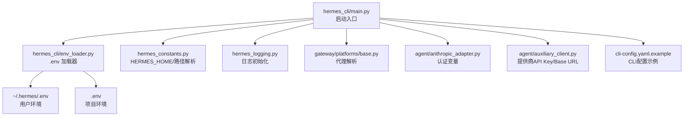
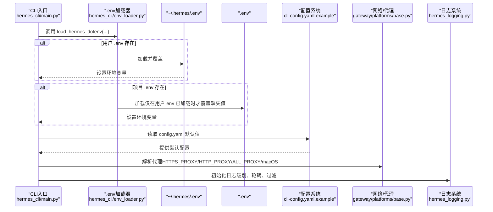
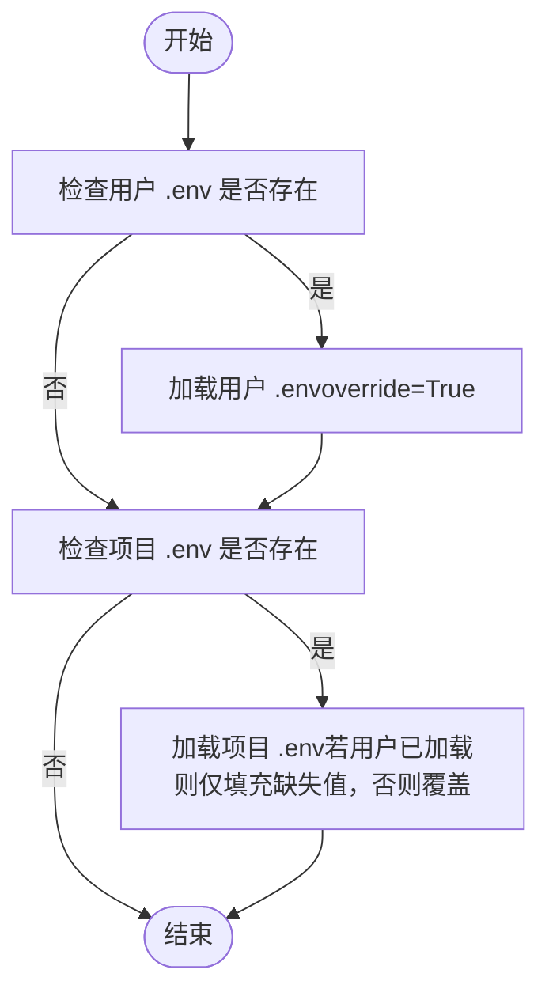
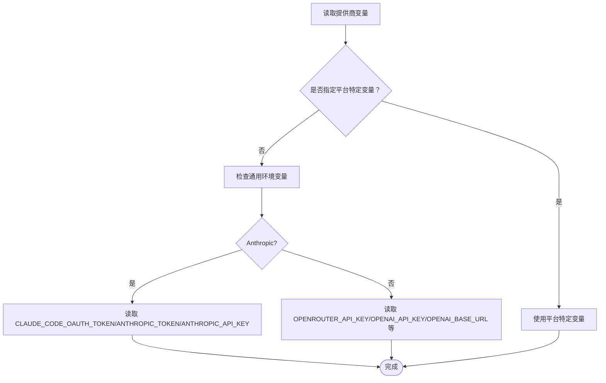
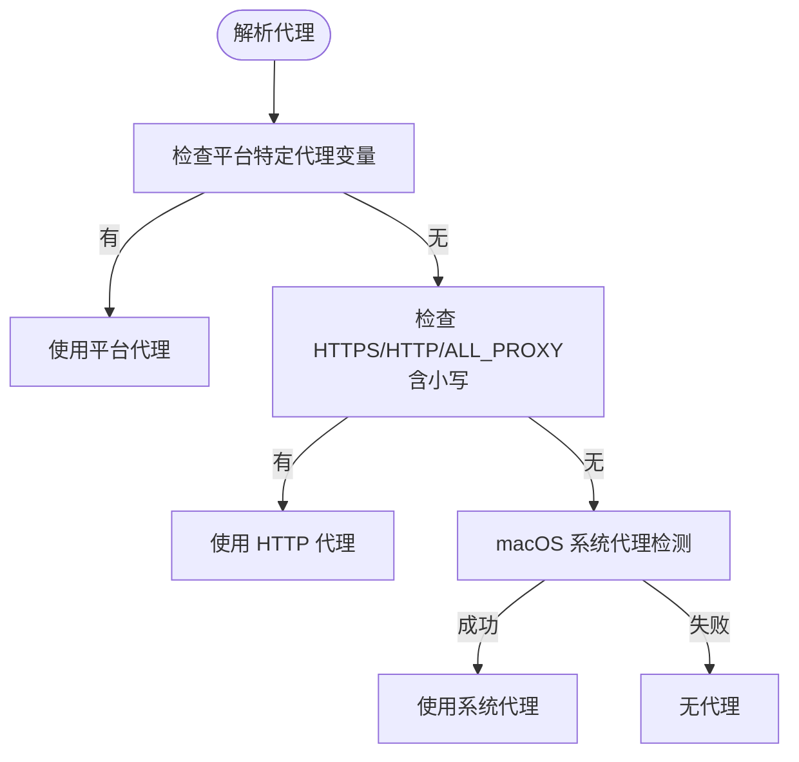
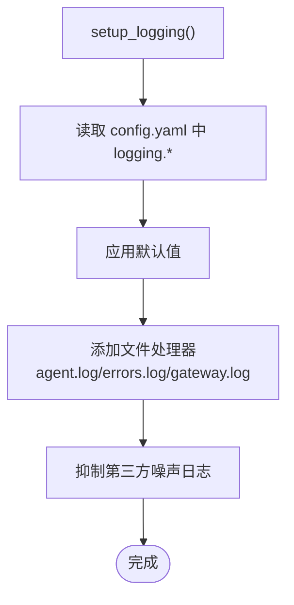
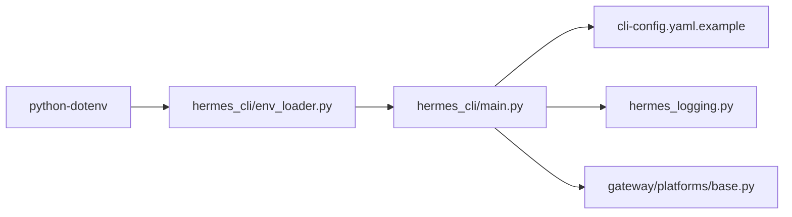

# 环境变量参考

<cite>
**本文引用的文件**
- [hermes_cli/env_loader.py](file://hermes_cli/env_loader.py)
- [hermes_constants.py](file://hermes_constants.py)
- [hermes_cli/main.py](file://hermes_cli/main.py)
- [cli-config.yaml.example](file://cli-config.yaml.example)
- [hermes_logging.py](file://hermes_logging.py)
- [gateway/platforms/base.py](file://gateway/platforms/base.py)
- [agent/anthropic_adapter.py](file://agent/anthropic_adapter.py)
- [agent/auxiliary_client.py](file://agent/auxiliary_client.py)
- [.envrc](file://.envrc)
- [requirements.txt](file://requirements.txt)
</cite>

## 目录
1. [简介](#简介)
2. [项目结构](#项目结构)
3. [核心组件](#核心组件)
4. [架构总览](#架构总览)
5. [详细组件分析](#详细组件分析)
6. [依赖关系分析](#依赖关系分析)
7. [性能考量](#性能考量)
8. [故障排查指南](#故障排查指南)
9. [结论](#结论)
10. [附录](#附录)

## 简介
本参考文档面向Hermes Agent的环境变量系统，系统性梳理并解释所有支持的环境变量（含认证凭据、网络配置、调试选项、平台特定变量等），并给出用途说明、默认值、数据类型、使用示例、加载顺序与优先级、安全注意事项以及常见部署场景的配置模板与最佳实践。内容基于仓库中的实际实现与示例配置文件整理而成，确保可追溯与可验证。

## 项目结构
围绕环境变量系统的关键文件与职责如下：
- hermes_cli/env_loader.py：统一加载用户与项目级 .env 文件，定义加载顺序与覆盖策略。
- hermes_constants.py：集中管理与 HERMES_HOME 相关的路径解析与平台检测（如容器、WSL、Termux）。
- hermes_cli/main.py：CLI 启动时加载 .env 并尽早应用 IPv4 偏好策略。
- cli-config.yaml.example：CLI 配置示例，包含模型提供商、终端工具、语音识别、日志等配置项，部分键值可由 .env 覆盖。
- hermes_logging.py：日志子系统，读取 config.yaml 中的日志相关配置，并通过 .env 控制日志级别等行为。
- gateway/platforms/base.py：代理解析逻辑，支持 HTTPS_PROXY/HTTP_PROXY/ALL_PROXY 及平台特定代理变量。
- agent/anthropic_adapter.py：Anthropic 相关认证变量（如 ANTHROPIC_TOKEN、CLAUDE_CODE_OAUTH_TOKEN、ANTHROPIC_API_KEY）。
- agent/auxiliary_client.py：辅助客户端对多个提供商的 API Key 与 Base URL 的读取与覆盖逻辑。
- requirements.txt：运行依赖，其中包含 python-dotenv，用于 .env 加载。
- .envrc：Devbox 入口脚本，声明使用 flake 环境。

**图表来源**
- [hermes_cli/main.py:140-165](file://hermes_cli/main.py#L140-L165)
- [hermes_cli/env_loader.py:18-45](file://hermes_cli/env_loader.py#L18-L45)
- [hermes_constants.py:11-137](file://hermes_constants.py#L11-L137)
- [hermes_logging.py:161-265](file://hermes_logging.py#L161-L265)
- [gateway/platforms/base.py:148-190](file://gateway/platforms/base.py#L148-L190)
- [agent/anthropic_adapter.py:502-601](file://agent/anthropic_adapter.py#L502-L601)
- [agent/auxiliary_client.py:764-1175](file://agent/auxiliary_client.py#L764-L1175)
- [cli-config.yaml.example:1-800](file://cli-config.yaml.example#L1-L800)

**章节来源**
- [hermes_cli/env_loader.py:18-45](file://hermes_cli/env_loader.py#L18-L45)
- [hermes_cli/main.py:140-165](file://hermes_cli/main.py#L140-L165)
- [hermes_constants.py:11-137](file://hermes_constants.py#L11-L137)
- [cli-config.yaml.example:1-800](file://cli-config.yaml.example#L1-L800)

## 核心组件
- 用户与项目 .env 加载器
  - 行为：优先加载用户级 ~/.hermes/.env；若存在项目级 .env，则仅在用户 env 存在时填充缺失值；否则项目 .env 也可覆盖已导出的 shell 变量。
  - 关键函数：load_hermes_dotenv(...)，内部调用 python-dotenv 的 load_dotenv 并处理编码回退。
  - 返回：已加载的文件路径列表。
- HERMES_HOME 与路径解析
  - 提供 get_hermes_home()、get_default_hermes_root()、get_hermes_dir() 等，统一从环境变量或默认路径解析。
  - 支持容器、WSL、Termux 等平台检测，影响路径与行为。
- 日志系统
  - setup_logging() 读取 config.yaml 中 logging.* 配置作为默认值，可通过 .env 控制日志级别、轮转大小、备份数等。
- 代理解析
  - resolve_proxy_url() 按优先级解析代理：平台特定变量 > HTTPS_PROXY/HTTP_PROXY/ALL_PROXY（含小写变体）> macOS 系统代理。
- 认证与提供商变量
  - Anthropic：CLAUDE_CODE_OAUTH_TOKEN、ANTHROPIC_TOKEN、ANTHROPIC_API_KEY。
  - 辅助客户端：OPENROUTER_API_KEY、OPENAI_API_KEY、OPENAI_BASE_URL 等。
- CLI 配置与覆盖
  - cli-config.yaml.example 中的 provider/base_url 等项可由 .env 覆盖（例如 OPENROUTER_API_KEY、OPENAI_API_KEY、OPENAI_BASE_URL 等）。

**章节来源**
- [hermes_cli/env_loader.py:18-45](file://hermes_cli/env_loader.py#L18-L45)
- [hermes_constants.py:11-137](file://hermes_constants.py#L11-L137)
- [hermes_logging.py:161-265](file://hermes_logging.py#L161-L265)
- [gateway/platforms/base.py:148-190](file://gateway/platforms/base.py#L148-L190)
- [agent/anthropic_adapter.py:502-601](file://agent/anthropic_adapter.py#L502-L601)
- [agent/auxiliary_client.py:764-1175](file://agent/auxiliary_client.py#L764-L1175)
- [cli-config.yaml.example:1-800](file://cli-config.yaml.example#L1-L800)

## 架构总览
下图展示了 .env 加载、配置覆盖与运行时使用的整体流程：

**图表来源**
- [hermes_cli/main.py:140-165](file://hermes_cli/main.py#L140-L165)
- [hermes_cli/env_loader.py:18-45](file://hermes_cli/env_loader.py#L18-L45)
- [gateway/platforms/base.py:148-190](file://gateway/platforms/base.py#L148-L190)
- [hermes_logging.py:161-265](file://hermes_logging.py#L161-L265)
- [cli-config.yaml.example:1-800](file://cli-config.yaml.example#L1-L800)

## 详细组件分析

### .env 加载顺序与优先级
- 加载顺序
  1) 读取 HERMES_HOME（默认 ~/.hermes），定位用户 .env。
  2) 若用户 .env 存在，加载并以 override=True 的方式覆盖当前环境。
  3) 若传入了项目 .env 路径且存在，加载之；若用户 .env 已加载，则仅填充缺失值；否则项目 .env 也可覆盖已导出的 shell 变量。
- 编码回退：当 UTF-8 解码失败时自动尝试 latin-1。
- 返回值：已加载的文件路径列表。

**图表来源**
- [hermes_cli/env_loader.py:18-45](file://hermes_cli/env_loader.py#L18-L45)

**章节来源**
- [hermes_cli/env_loader.py:18-45](file://hermes_cli/env_loader.py#L18-L45)

### 认证凭据与提供商变量
- Anthropic
  - CLAUDE_CODE_OAUTH_TOKEN：Claude Code 使用的 OAuth Token。
  - ANTHROPIC_TOKEN：历史持久化设置令牌（Hermes 曾保存到该变量）。
  - ANTHROPIC_API_KEY：常规 API Key 或兼容的 OAuth Token。
  - 读取顺序与优先级：CLAUDE_CODE_OAUTH_TOKEN > ANTHROPIC_TOKEN > ANTHROPIC_API_KEY。
- OpenRouter/OpenAI
  - OPENROUTER_API_KEY：OpenRouter API Key。
  - OPENAI_API_KEY：OpenAI API Key。
  - OPENAI_BASE_URL：OpenAI 兼容服务 Base URL，默认值见常量定义。
- 其他提供商
  - NOUS_API_KEY：Nous Portal API Key。
  - HUGGINGFACE_TOKEN：Hugging Face Inference Token。
  - GOOGLE_API_KEY/GEMINI_API_KEY：Google AI Studio Key。
  - ZEPHYR/GLM/KIMI/MINIMAX 等提供商的 API Key 变量名详见示例配置注释。

**图表来源**
- [agent/anthropic_adapter.py:502-601](file://agent/anthropic_adapter.py#L502-L601)
- [agent/auxiliary_client.py:764-1175](file://agent/auxiliary_client.py#L764-L1175)

**章节来源**
- [agent/anthropic_adapter.py:502-601](file://agent/anthropic_adapter.py#L502-L601)
- [agent/auxiliary_client.py:764-1175](file://agent/auxiliary_client.py#L764-L1175)
- [cli-config.yaml.example:1-800](file://cli-config.yaml.example#L1-L800)

### 网络与代理配置
- 代理解析优先级
  1) 平台特定代理变量（如 DISCORD_PROXY）。
  2) HTTPS_PROXY/HTTP_PROXY/ALL_PROXY（含小写变体）。
  3) macOS 系统代理（通过 scutil 自动检测）。
- IPv4 偏好
  - 在 config.yaml 中启用 network.force_ipv4: true 时，会修改 socket.getaddrinfo 以优先解析 IPv4，缓解 IPv6 不可达导致的超时问题。

**图表来源**
- [gateway/platforms/base.py:148-190](file://gateway/platforms/base.py#L148-L190)
- [hermes_constants.py:253-293](file://hermes_constants.py#L253-L293)

**章节来源**
- [gateway/platforms/base.py:148-190](file://gateway/platforms/base.py#L148-L190)
- [hermes_constants.py:253-293](file://hermes_constants.py#L253-L293)

### 调试与日志级别
- 日志初始化
  - setup_logging() 读取 config.yaml 中 logging.level、logging.max_size_mb、logging.backup_count 作为默认值。
  - 可通过 .env 覆盖日志级别等行为（具体键名以实际实现为准）。
- 详细日志
  - setup_verbose_logging() 添加 DEBUG 级别控制台处理器，便于交互式调试。

**图表来源**
- [hermes_logging.py:161-265](file://hermes_logging.py#L161-L265)

**章节来源**
- [hermes_logging.py:161-265](file://hermes_logging.py#L161-L265)

### 平台特定变量与路径
- HERMES_HOME
  - 默认 ~/.hermes；支持容器/WSL/Termux 环境下的行为差异。
  - get_hermes_dir() 会在新旧路径之间做向后兼容解析。
- 缓存与日志路径
  - 图片/音频/文档缓存目录通过 get_hermes_dir() 统一解析，兼容旧版目录名。
- 子进程 HOME 注入
  - 当 {HERMES_HOME}/home/ 存在时，子进程可注入该目录作为 HOME，避免写入系统级主目录。

**章节来源**
- [hermes_constants.py:11-137](file://hermes_constants.py#L11-L137)
- [gateway/platforms/base.py:316-574](file://gateway/platforms/base.py#L316-L574)

### CLI 配置与 .env 覆盖
- 示例配置
  - cli-config.yaml.example 展示了模型提供商选择、终端后端、语音识别、日志、工具集等配置项。
- .env 覆盖
  - 部分键值（如 OPENROUTER_API_KEY、OPENAI_API_KEY、OPENAI_BASE_URL 等）可由 .env 覆盖示例配置中的默认值。

**章节来源**
- [cli-config.yaml.example:1-800](file://cli-config.yaml.example#L1-L800)

## 依赖关系分析
- .env 加载依赖 python-dotenv。
- CLI 启动依赖 .env 完成认证与网络配置的早期注入。
- 日志系统依赖 config.yaml 的日志配置，同时受 .env 影响。
- 代理解析依赖系统环境变量与平台能力（macOS）。

**图表来源**
- [requirements.txt:7](file://requirements.txt#L7)
- [hermes_cli/env_loader.py:18-45](file://hermes_cli/env_loader.py#L18-L45)
- [hermes_cli/main.py:140-165](file://hermes_cli/main.py#L140-L165)
- [hermes_logging.py:161-265](file://hermes_logging.py#L161-L265)
- [gateway/platforms/base.py:148-190](file://gateway/platforms/base.py#L148-L190)

**章节来源**
- [requirements.txt:7](file://requirements.txt#L7)
- [hermes_cli/env_loader.py:18-45](file://hermes_cli/env_loader.py#L18-L45)
- [hermes_cli/main.py:140-165](file://hermes_cli/main.py#L140-L165)
- [hermes_logging.py:161-265](file://hermes_logging.py#L161-L265)
- [gateway/platforms/base.py:148-190](file://gateway/platforms/base.py#L148-L190)

## 性能考量
- IPv4 偏好：在网络环境 IPv6 不稳定时启用，可减少 DNS 解析超时带来的延迟。
- 日志轮转：合理设置最大文件大小与备份数，避免磁盘占用过大。
- 代理解析：优先使用平台特定代理变量，减少不必要的系统代理探测。

[本节为通用建议，无需特定文件来源]

## 故障排查指南
- .env 未生效
  - 确认 .env 路径正确（用户级 ~/.hermes/.env 或项目级 .env）。
  - 检查加载顺序：用户 .env 优先；项目 .env 仅在用户 .env 存在时才覆盖缺失值。
- 代理无法连接
  - 检查 HTTPS_PROXY/HTTP_PROXY/ALL_PROXY 及其小写变体是否正确。
  - macOS 环境下确认系统代理设置。
- 认证失败
  - 按提供商变量优先级核对 CLAUDE_CODE_OAUTH_TOKEN/ANTHROPIC_TOKEN/ANTHROPIC_API_KEY 等。
  - 确认 OPENROUTER_API_KEY/OPENAI_API_KEY/OPENAI_BASE_URL 是否与示例配置一致。
- 日志级别异常
  - 检查 config.yaml 中 logging.level 与实际运行时日志输出是否一致。
  - 如需详细日志，调用 setup_verbose_logging() 或使用相应 CLI 参数。

**章节来源**
- [hermes_cli/env_loader.py:18-45](file://hermes_cli/env_loader.py#L18-L45)
- [gateway/platforms/base.py:148-190](file://gateway/platforms/base.py#L148-L190)
- [agent/anthropic_adapter.py:502-601](file://agent/anthropic_adapter.py#L502-L601)
- [agent/auxiliary_client.py:764-1175](file://agent/auxiliary_client.py#L764-L1175)
- [hermes_logging.py:161-265](file://hermes_logging.py#L161-L265)

## 结论
Hermes Agent 的环境变量系统以 .env 为核心，结合 CLI 启动流程与配置文件示例，实现了灵活而可控的覆盖机制。通过明确的加载顺序、代理解析与日志初始化策略，用户可在不同平台与部署环境中快速适配认证、网络与调试需求。建议在生产环境中优先使用用户级 .env 管理敏感信息，并配合最小权限原则与定期审计。

[本节为总结，无需特定文件来源]

## 附录

### 环境变量清单与说明
- 认证与提供商
  - ANTHROPIC_TOKEN：Anthropic 设置令牌（历史持久化）。
  - CLAUDE_CODE_OAUTH_TOKEN：Claude Code OAuth Token。
  - ANTHROPIC_API_KEY：Anthropic API Key。
  - OPENROUTER_API_KEY：OpenRouter API Key。
  - OPENAI_API_KEY：OpenAI API Key。
  - OPENAI_BASE_URL：OpenAI 兼容服务 Base URL。
  - NOUS_API_KEY：Nous Portal API Key。
  - HUGGINGFACE_TOKEN：Hugging Face Inference Token。
  - GOOGLE_API_KEY/GEMINI_API_KEY：Google AI Studio Key。
  - 其他提供商 API Key：详见示例配置注释。
- 网络与代理
  - HTTPS_PROXY/HTTP_PROXY/ALL_PROXY（含小写变体）。
  - 平台特定代理变量（如 DISCORD_PROXY）。
  - macOS 系统代理：通过 scutil 自动检测。
  - network.force_ipv4：在 config.yaml 中启用以强制 IPv4。
- 路径与目录
  - HERMES_HOME：Hermes 数据根目录，默认 ~/.hermes。
  - 缓存目录：图片/音频/文档缓存路径由 get_hermes_dir() 解析，兼容旧版名称。
  - 子进程 HOME：当 {HERMES_HOME}/home/ 存在时，子进程注入该目录。
- 日志与调试
  - 日志级别：由 config.yaml 中 logging.level 控制，亦可由 .env 覆盖。
  - 详细日志：通过 setup_verbose_logging() 或相应 CLI 参数启用。
- 开发与环境
  - .envrc：声明使用 flake 环境（Devbox）。

**章节来源**
- [agent/anthropic_adapter.py:502-601](file://agent/anthropic_adapter.py#L502-L601)
- [agent/auxiliary_client.py:764-1175](file://agent/auxiliary_client.py#L764-L1175)
- [gateway/platforms/base.py:148-190](file://gateway/platforms/base.py#L148-L190)
- [hermes_constants.py:11-137](file://hermes_constants.py#L11-L137)
- [hermes_logging.py:161-265](file://hermes_logging.py#L161-L265)
- [.envrc:1-2](file://.envrc#L1-L2)
- [cli-config.yaml.example:1-800](file://cli-config.yaml.example#L1-L800)

### 加载顺序与优先级摘要
- .env 加载顺序
  1) 用户 .env（~/.hermes/.env）：override=True，优先级最高。
  2) 项目 .env（.env）：仅在用户 .env 存在时填充缺失值；否则也可覆盖已导出的 shell 变量。
- 配置覆盖
  - config.yaml 提供默认值；.env 可覆盖示例配置中的键值（如 OPENROUTER_API_KEY、OPENAI_API_KEY、OPENAI_BASE_URL 等）。
- 运行时策略
  - CLI 启动时尽早加载 .env 并应用 IPv4 偏好策略，随后初始化日志系统。

**章节来源**
- [hermes_cli/env_loader.py:18-45](file://hermes_cli/env_loader.py#L18-L45)
- [hermes_cli/main.py:140-165](file://hermes_cli/main.py#L140-L165)
- [cli-config.yaml.example:1-800](file://cli-config.yaml.example#L1-L800)

### 安全注意事项
- 将敏感凭据（API Key、Token）置于用户级 .env 中，避免提交至版本控制。
- 仅在必要时开启详细日志，避免将敏感信息写入日志文件。
- 在容器或共享环境中，谨慎转发环境变量至沙箱（如 Docker Forward Env）。
- 定期轮换与审计 API Key，遵循最小权限原则。

[本节为通用建议，无需特定文件来源]

### 常见部署场景模板与最佳实践
- 开发机（本地）
  - 使用项目 .env 作为开发回退，用户 .env 仅存放本地敏感信息。
  - 代理：根据网络环境设置 HTTPS_PROXY/HTTP_PROXY；macOS 下可使用系统代理。
- 容器/WSL
  - 将 HERMES_HOME 指向持久化卷；如需子进程隔离，创建 {HERMES_HOME}/home/ 并注入 HOME。
  - 如遇 IPv6 不可达，启用 network.force_ipv4。
- 多平台网关
  - 为各平台设置专用代理变量（如 DISCORD_PROXY），避免全局代理污染。
- 生产环境
  - 使用用户级 .env 管理凭据；通过 config.yaml 控制日志级别与轮转；限制日志输出敏感信息。
  - 对外暴露的服务应使用平台特定代理变量与最小权限 API Key。

[本节为通用建议，无需特定文件来源]