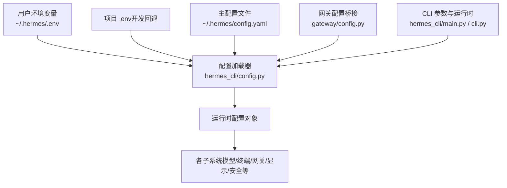
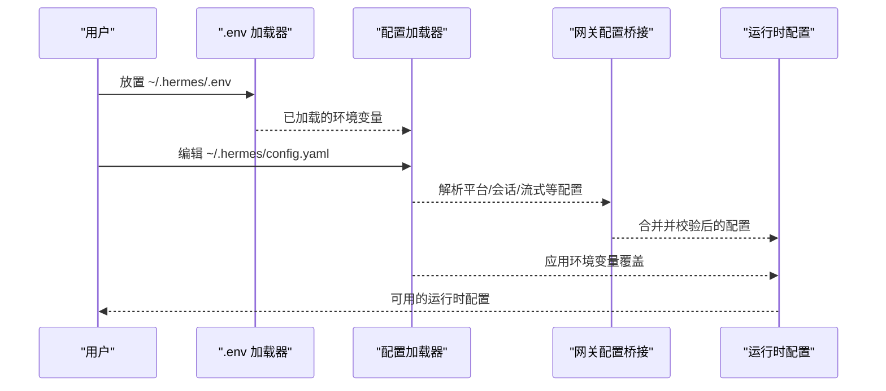
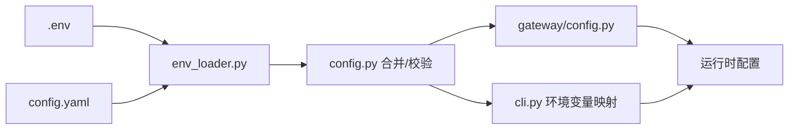

# 配置参数参考

<cite>
**本文引用的文件**
- [cli-config.yaml.example](file://cli-config.yaml.example)
- [hermes_cli/config.py](file://hermes_cli/config.py)
- [hermes_cli/main.py](file://hermes_cli/main.py)
- [hermes_cli/env_loader.py](file://hermes_cli/env_loader.py)
- [hermes_cli/auth.py](file://hermes_cli/auth.py)
- [gateway/config.py](file://gateway/config.py)
- [cli.py](file://cli.py)
- [hermes_cli/memory_setup.py](file://hermes_cli/memory_setup.py)
- [tools/skills_tool.py](file://tools/skills_tool.py)
- [tests/gateway/test_webhook_dynamic_routes.py](file://tests/gateway/test_webhook_dynamic_routes.py)
</cite>

## 目录
1. [简介](#简介)
2. [项目结构与配置来源](#项目结构与配置来源)
3. [核心组件与配置体系](#核心组件与配置体系)
4. [架构总览](#架构总览)
5. [详细配置项解析](#详细配置项解析)
6. [依赖关系分析](#依赖关系分析)
7. [性能与稳定性考量](#性能与稳定性考量)
8. [故障排除指南](#故障排除指南)
9. [结论](#结论)
10. [附录：配置优先级与示例](#附录配置优先级与示例)

## 简介
本文件为 Hermes Agent 的完整配置参数参考手册，覆盖环境变量、配置文件、命令行参数与运行时配置。内容按功能模块组织（模型、终端、浏览器、上下文压缩、辅助模型、持久化记忆、会话重置策略、网关、显示、语音、工具集、MCP、平台设置、安全扫描、日志与网络等），并提供默认值、取值范围、作用域说明与配置示例；同时阐述配置优先级、继承关系与动态更新机制，并给出验证规则、错误处理与故障排除建议。

## 项目结构与配置来源
- 用户配置主文件位于 ~/.hermes/config.yaml，用户环境变量 ~/.hermes/.env 优先于系统环境覆盖。
- CLI 启动时加载 ~/.hermes/.env，随后加载项目根目录 .env（开发回退）。
- 网关配置可从 config.yaml 的“平台”段落与各平台子段落合并加载，并支持环境变量覆盖。
- CLI 还支持将部分终端配置映射到环境变量以供终端工具使用。

图示来源
- [hermes_cli/env_loader.py:18-46](file://hermes_cli/env_loader.py#L18-L46)
- [hermes_cli/config.py:311-706](file://hermes_cli/config.py#L311-L706)
- [gateway/config.py:431-670](file://gateway/config.py#L431-L670)
- [hermes_cli/main.py:140-165](file://hermes_cli/main.py#L140-L165)
- [cli.py:380-457](file://cli.py#L380-L457)

章节来源
- [hermes_cli/env_loader.py:18-46](file://hermes_cli/env_loader.py#L18-L46)
- [hermes_cli/config.py:311-706](file://hermes_cli/config.py#L311-L706)
- [gateway/config.py:431-670](file://gateway/config.py#L431-L670)
- [hermes_cli/main.py:140-165](file://hermes_cli/main.py#L140-L165)
- [cli.py:380-457](file://cli.py#L380-L457)

## 核心组件与配置体系
- 默认配置与迁移：DEFAULT_CONFIG 定义了所有可用键的默认值与结构，包含模型、代理行为、终端、浏览器、压缩、智能路由、辅助模型、显示、隐私、TTS/STT、语音、人类延迟、上下文引擎、记忆、委托、预填消息、技能、Honcho、时区、平台特定设置、审批、快速命令、个性、安全扫描、定时任务、日志与网络等。
- 环境变量与可选键：OPTIONAL_ENV_VARS 列出可选的环境变量及其描述、提示、URL、类别与高级标记，用于在升级或首次配置时引导用户填写。
- 提供商注册表：PROVIDER_REGISTRY 描述已知推理提供商的认证类型、基础 URL、客户端 ID、作用域与 API Key 环境变量映射。
- 网关配置：GatewayConfig 将平台连接、会话重置策略、投递偏好、流式传输等整合为统一配置对象，支持从 config.yaml 与环境变量合并与校验。

章节来源
- [hermes_cli/config.py:311-706](file://hermes_cli/config.py#L311-L706)
- [hermes_cli/config.py:730-800](file://hermes_cli/config.py#L730-L800)
- [hermes_cli/auth.py:102-261](file://hermes_cli/auth.py#L102-L261)
- [gateway/config.py:221-430](file://gateway/config.py#L221-L430)

## 架构总览
下图展示了配置加载与应用的关键流程：从 .env 与 config.yaml 加载，合并网关配置，应用环境变量覆盖，最终生成运行时配置对象并注入到各子系统。

图示来源
- [hermes_cli/env_loader.py:18-46](file://hermes_cli/env_loader.py#L18-L46)
- [gateway/config.py:431-670](file://gateway/config.py#L431-L670)
- [hermes_cli/config.py:742-743](file://hermes_cli/config.py#L742-L743)

章节来源
- [hermes_cli/env_loader.py:18-46](file://hermes_cli/env_loader.py#L18-L46)
- [gateway/config.py:431-670](file://gateway/config.py#L431-L670)
- [hermes_cli/config.py:742-743](file://hermes_cli/config.py#L742-L743)

## 详细配置项解析

### 模型配置（model）
- 关键字：model、providers、fallback_providers、credential_pool_strategies、smart_model_routing、auxiliary、prefill_messages_file
- 默认值与结构：参见 DEFAULT_CONFIG 中 model、smart_model_routing、auxiliary、prefill_messages_file 字段。
- 常用键：
  - default：默认模型名称（字符串）
  - provider：推理提供商选择（auto/openrouter/nous/anthropic/openai-codex/copilot/gemini/zai/kimi-coding/minimax/minimax-cn/huggingface/xiaomi/kilocode/ai-gateway/custom 及别名）
  - base_url：自定义兼容 OpenAI 的端点（当 provider 为 custom 或本地服务时）
  - api_key：API 密钥（可放在 .env 或 config.yaml）
  - context_length：上下文窗口大小（tokens，自动检测时可不设）
  - max_tokens：单次响应输出上限（tokens）
  - provider_routing：仅在使用 OpenRouter 时生效（排序策略、白名单/黑名单、顺序、参数要求、数据策略）
- 作用域：CLI、网关、代理循环
- 示例：参见 cli-config.yaml.example 的 model 段落

章节来源
- [cli-config.yaml.example:8-46](file://cli-config.yaml.example#L8-L46)
- [hermes_cli/config.py:311-344](file://hermes_cli/config.py#L311-L344)
- [hermes_cli/config.py:421-426](file://hermes_cli/config.py#L421-L426)
- [hermes_cli/config.py:434-492](file://hermes_cli/config.py#L434-L492)

### 终端配置（terminal）
- 关键字：terminal.backend、terminal.cwd、terminal.timeout、terminal.docker_*、terminal.container_*、terminal.persistent_shell、terminal.env_passthrough 等
- 默认值与结构：参见 DEFAULT_CONFIG 中 terminal 字段。
- 常用键：
  - backend：local/ssh/docker/singularity/modal/daytona
  - cwd：工作目录（本地后端为当前目录，远程容器后端以容器内路径为准）
  - timeout：命令执行超时秒数
  - docker_image、singularity_image、modal_image、daytona_image：容器镜像
  - container_cpu/memory/disk/persistent：容器资源限制与持久化
  - docker_mount_cwd_to_workspace：是否挂载宿主机工作目录到 /workspace
  - persistent_shell：跨命令保持交互式 shell
  - env_passthrough/docker_forward_env/docker_env：环境变量透传与注入
- 作用域：CLI 与网关的终端工具
- 示例：参见 cli-config.yaml.example 的 terminal 段落

章节来源
- [cli-config.yaml.example:124-251](file://cli-config.yaml.example#L124-L251)
- [hermes_cli/config.py:346-383](file://hermes_cli/config.py#L346-L383)
- [cli.py:380-457](file://cli.py#L380-L457)

### 浏览器配置（browser）
- 关键字：browser.inactivity_timeout、browser.command_timeout、browser.record_sessions、browser.allow_private_urls、browser.camofox.managed_persistence
- 默认值与结构：参见 DEFAULT_CONFIG 中 browser 字段。
- 作用域：浏览器自动化工具
- 示例：参见 cli-config.yaml.example 的 browser 段落

章节来源
- [cli-config.yaml.example:267-273](file://cli-config.yaml.example#L267-L273)
- [hermes_cli/config.py:385-397](file://hermes_cli/config.py#L385-L397)

### 上下文压缩（compression）
- 关键字：compression.enabled、threshold、target_ratio、protect_last_n、summary_model、summary_provider、summary_base_url
- 默认值与结构：参见 DEFAULT_CONFIG 中 compression 字段。
- 作用域：代理上下文管理
- 示例：参见 cli-config.yaml.example 的 compression 段落

章节来源
- [cli-config.yaml.example:275-321](file://cli-config.yaml.example#L275-L321)
- [hermes_cli/config.py:412-420](file://hermes_cli/config.py#L412-L420)

### 辅助模型（auxiliary）
- 关键字：auxiliary.vision、auxiliary.web_extract、auxiliary.compression、auxiliary.session_search、auxiliary.skills_hub、auxiliary.approval、auxiliary.mcp、auxiliary.flush_memories
- 默认值与结构：参见 DEFAULT_CONFIG 中 auxiliary 字段。
- 作用域：图像分析、网页提取、压缩摘要、会话检索、技能中心、审批、MCP、内存刷新等辅助任务
- 示例：参见 cli-config.yaml.example 的 auxiliary 段落

章节来源
- [cli-config.yaml.example:323-399](file://cli-config.yaml.example#L323-L399)
- [hermes_cli/config.py:434-492](file://hermes_cli/config.py#L434-L492)

### 显示与交互（display）
- 关键字：display.compact、display.personality、display.resume_display、display.busy_input_mode、display.bell_on_complete、display.show_reasoning、display.streaming、display.inline_diffs、display.show_cost、display.skin、display.interim_assistant_messages、display.tool_progress、display.tool_progress_command、display.tool_progress_overrides、display.tool_preview_length、display.platforms
- 默认值与结构：参见 DEFAULT_CONFIG 中 display 字段。
- 作用域：CLI 与网关显示控制
- 示例：参见 cli-config.yaml.example 的 display 段落

章节来源
- [cli-config.yaml.example:763-800](file://cli-config.yaml.example#L763-L800)
- [hermes_cli/config.py:494-510](file://hermes_cli/config.py#L494-L510)

### 语音与听写（tts/stt）
- 关键字：tts.provider、tts.*（edge/elevenlabs/openai/mistral/neutts）、stt.enabled、stt.provider、stt.local、stt.openai、stt.mistral
- 默认值与结构：参见 DEFAULT_CONFIG 中 tts、stt 字段。
- 作用域：语音合成与语音转文本
- 示例：参见 cli-config.yaml.example 的 tts/stt 段落

章节来源
- [cli-config.yaml.example:686-710](file://cli-config.yaml.example#L686-L710)
- [hermes_cli/config.py:518-558](file://hermes_cli/config.py#L518-L558)

### 代理行为（agent）
- 关键字：agent.max_turns、agent.gateway_timeout、agent.restart_drain_timeout、agent.tool_use_enforcement、agent.gateway_timeout_warning、agent.gateway_notify_interval、agent.service_tier、agent.reasoning_effort、agent.personalities
- 默认值与结构：参见 DEFAULT_CONFIG 中 agent 字段。
- 作用域：代理循环与网关执行
- 示例：参见 cli-config.yaml.example 的 agent 段落

章节来源
- [cli-config.yaml.example:467-515](file://cli-config.yaml.example#L467-L515)
- [hermes_cli/config.py:317-344](file://hermes_cli/config.py#L317-L344)

### 工具集与平台工具集（toolsets/platform_toolsets）
- 关键字：platform_toolsets（平台到工具集映射）、toolsets（已弃用）
- 默认值与结构：参见 cli-config.yaml.example 的 platform_toolsets 段落与注释。
- 作用域：CLI 与网关平台工具集
- 示例：参见 cli-config.yaml.example 的 platform_toolsets 段落

章节来源
- [cli-config.yaml.example:523-631](file://cli-config.yaml.example#L523-L631)

### 网关配置（gateway）
- 关键字：session_reset、quick_commands、stt、group_sessions_per_user、thread_sessions_per_user、unauthorized_dm_behavior、streaming、platforms.*（各平台配置）
- 默认值与结构：参见 gateway/config.py 中 GatewayConfig 的字段与默认构造。
- 作用域：网关进程与平台适配器
- 示例：参见 gateway/config.py 的示例与注释

章节来源
- [gateway/config.py:221-430](file://gateway/config.py#L221-L430)
- [gateway/config.py:431-670](file://gateway/config.py#L431-L670)

### 平台设置（platforms.*）
- 关键字：telegram、discord、whatsapp、slack、signal、matrix、homeassistant、email、sms、dingtalk、api_server、webhook、feishu、wecom、wecom_callback、weixin、bluebubbles
- 默认值与结构：参见 gateway/config.py 的平台枚举与配置类。
- 作用域：各平台适配器
- 示例：参见 gateway/config.py 的平台段落与注释

章节来源
- [gateway/config.py:48-69](file://gateway/config.py#L48-L69)
- [gateway/config.py:142-187](file://gateway/config.py#L142-L187)

### 安全扫描（security）
- 关键字：security.redact_secrets、security.tirith_enabled、security.tirith_path、security.tirith_timeout、security.tirith_fail_open、security.website_blocklist.*
- 默认值与结构：参见 DEFAULT_CONFIG 中 security 字段。
- 作用域：命令执行前的安全扫描
- 示例：参见 cli-config.yaml.example 的 security 段落

章节来源
- [cli-config.yaml.example:253-265](file://cli-config.yaml.example#L253-L265)
- [hermes_cli/config.py:669-680](file://hermes_cli/config.py#L669-L680)

### 日志与网络（logging/network）
- 关键字：logging.level、logging.max_size_mb、logging.backup_count、network.force_ipv4
- 默认值与结构：参见 DEFAULT_CONFIG 中 logging、network 字段。
- 作用域：全局日志与网络连接
- 示例：参见 hermes_cli/config.py 的默认配置

章节来源
- [hermes_cli/config.py:689-702](file://hermes_cli/config.py#L689-L702)

### 环境变量与可选键
- 可选环境变量：OPTIONAL_ENV_VARS 定义了可选的 API Key 与配置项，如 OPENROUTER_API_KEY、GOOGLE_API_KEY、GEMINI_API_KEY、GLM_API_KEY、ANTHROPIC_API_KEY、COPILOT_GITHUB_TOKEN 等。
- 作用域：提供商选择、鉴权与功能增强
- 示例：参见 hermes_cli/config.py 的 OPTIONAL_ENV_VARS 定义

章节来源
- [hermes_cli/config.py:730-800](file://hermes_cli/config.py#L730-L800)

### 记忆与外部提供者（memory）
- 关键字：memory.memory_enabled、memory.user_profile_enabled、memory.memory_char_limit、memory.user_char_limit、memory.provider
- 默认值与结构：参见 DEFAULT_CONFIG 中 memory 字段。
- 作用域：持久化记忆
- 示例：参见 hermes_cli/config.py 的 memory 字段

章节来源
- [hermes_cli/config.py:584-596](file://hermes_cli/config.py#L584-L596)

### 委托与子代理（delegation）
- 关键字：delegation.model、delegation.provider、delegation.base_url、delegation.api_key、delegation.max_iterations、delegation.reasoning_effort
- 默认值与结构：参见 DEFAULT_CONFIG 中 delegation 字段。
- 作用域：子代理执行
- 示例：参见 hermes_cli/config.py 的 delegation 字段

章节来源
- [hermes_cli/config.py:597-611](file://hermes_cli/config.py#L597-L611)

### 技能与外部目录（skills）
- 关键字：skills.external_dirs
- 默认值与结构：参见 DEFAULT_CONFIG 中 skills 字段。
- 作用域：技能加载与共享
- 示例：参见 cli-config.yaml.example 的 skills 段落

章节来源
- [cli-config.yaml.example:446-465](file://cli-config.yaml.example#L446-L465)
- [hermes_cli/config.py:617-623](file://hermes_cli/config.py#L617-L623)

### Honcho 集成（honcho）
- 关键字：honcho（Hermes 特定覆盖）
- 默认值与结构：参见 DEFAULT_CONFIG 中 honcho 字段。
- 作用域：跨会话用户建模
- 示例：参见 cli-config.yaml.example 的 honcho 段落

章节来源
- [cli-config.yaml.example:749-761](file://cli-config.yaml.example#L749-L761)
- [hermes_cli/config.py:624-628](file://hermes_cli/config.py#L624-L628)

### MCP 服务器（mcp_servers）
- 关键字：mcp_servers.*（stdio/http 服务器）、sampling.*
- 默认值与结构：参见 cli-config.yaml.example 的 mcp_servers 段落。
- 作用域：MCP 生态集成
- 示例：参见 cli-config.yaml.example 的 mcp_servers 段落

章节来源
- [cli-config.yaml.example:636-684](file://cli-config.yaml.example#L636-L684)

## 依赖关系分析
- 配置加载链路：
  - hermes_cli/env_loader.py 负责加载 ~/.hermes/.env 与项目 .env。
  - hermes_cli/config.py 提供 DEFAULT_CONFIG、OPTIONAL_ENV_VARS、Provider 注册表与配置合并逻辑。
  - gateway/config.py 将 config.yaml 的平台段落与环境变量合并为 GatewayConfig。
  - cli.py 将 terminal 配置映射到环境变量以便终端工具使用。
- 环境变量覆盖：
  - 网关层：TELEGRAM_*、DISCORD_*、WHATSAPP_*、SLACK_*、MATRIX_* 等平台令牌与行为通过环境变量覆盖。
  - 终端层：TERMINAL_* 系列环境变量覆盖 terminal 配置。
- 动态更新：
  - 网关 webhook 动态路由：监听动态路由文件变更，mtime 变更触发重新加载，文件删除清空动态路由。

图示来源
- [hermes_cli/env_loader.py:18-46](file://hermes_cli/env_loader.py#L18-L46)
- [hermes_cli/config.py:311-706](file://hermes_cli/config.py#L311-L706)
- [gateway/config.py:431-670](file://gateway/config.py#L431-L670)
- [cli.py:380-457](file://cli.py#L380-L457)

章节来源
- [hermes_cli/env_loader.py:18-46](file://hermes_cli/env_loader.py#L18-L46)
- [hermes_cli/config.py:311-706](file://hermes_cli/config.py#L311-L706)
- [gateway/config.py:431-670](file://gateway/config.py#L431-L670)
- [cli.py:380-457](file://cli.py#L380-L457)

## 性能与稳定性考量
- 上下文压缩阈值与目标比例影响历史压缩效率与最近上下文保留量，需结合模型上下文长度与对话复杂度调整。
- 终端容器资源（CPU/内存/磁盘）与持久化设置影响沙箱稳定性与性能。
- 网关流式传输编辑间隔与缓冲阈值影响消息实时性与平台速率限制。
- 安全扫描（tirith）与 IPv4 强制切换对网络与安全性有额外开销，按需启用。

## 故障排除指南
- 网关平台令牌为空或占位符：
  - 现象：平台启用但令牌为空或为占位符，导致适配器无法连接。
  - 处理：检查 TELEGRAM_BOT_TOKEN、DISCORD_BOT_TOKEN 等环境变量，确保非空且非占位符。
- 网关 webhook 动态路由未生效：
  - 现象：修改动态路由文件后未更新。
  - 处理：确认文件 mtime 更新，或删除文件以清空动态路由；检查文件 JSON 格式正确性。
- 终端容器不可见或无权限：
  - 现象：容器运行在 root 命名空间，普通用户无法看到。
  - 处理：为容器运行时配置 sudo NOPASSWD 规则或使用 sudo hermes 执行。
- IPv6 连接异常：
  - 现象：服务器 IPv6 不可达导致连接超时。
  - 处理：启用 network.force_ipv4 或修复网络配置。
- 环境变量覆盖冲突：
  - 现象：.env 与 config.yaml 同键冲突。
  - 处理：确认 ~/.hermes/.env 优先级高于系统环境变量；必要时清理占位符或移除冲突键。

章节来源
- [gateway/config.py:673-741](file://gateway/config.py#L673-L741)
- [tests/gateway/test_webhook_dynamic_routes.py:38-87](file://tests/gateway/test_webhook_dynamic_routes.py#L38-L87)
- [hermes_cli/main.py:543-648](file://hermes_cli/main.py#L543-L648)
- [hermes_cli/config.py:696-702](file://hermes_cli/config.py#L696-L702)

## 结论
Hermes Agent 的配置体系以 DEFAULT_CONFIG 为核心，结合 .env 与 config.yaml 的层次化加载与环境变量覆盖，形成灵活而强大的运行时配置。通过网关配置桥接与 CLI 参数映射，实现了从模型、终端、浏览器、上下文压缩、辅助模型、持久化记忆、会话重置策略、显示、语音、工具集、MCP、平台设置、安全扫描、日志与网络等全栈能力的统一管理。建议在生产环境中明确区分 .env 与 config.yaml 的职责边界，合理设置容器资源与压缩策略，并按需启用安全扫描与 IPv4 强制切换以提升稳定性与安全性。

## 附录：配置优先级与示例
- 配置优先级（从高到低）：
  1) 环境变量（如 TELEGRAM_BOT_TOKEN、TERMINAL_*、网络.force_ipv4 等）
  2) ~/.hermes/config.yaml
  3) ~/.hermes/gateway.json（遗留默认层，config.yaml 同键覆盖）
  4) 内置默认值（DEFAULT_CONFIG）
- CLI 参数映射示例（节选）：
  - terminal.container_cpu → TERMINAL_CONTAINER_CPU
  - terminal.container_memory → TERMINAL_CONTAINER_MEMORY
  - terminal.container_disk → TERMINAL_CONTAINER_DISK
  - terminal.container_persistent → TERMINAL_CONTAINER_PERSISTENT
  - terminal.docker_volumes → TERMINAL_DOCKER_VOLUMES
  - terminal.docker_mount_cwd_to_workspace → TERMINAL_DOCKER_MOUNT_CWD_TO_WORKSPACE
  - terminal.persistent_shell → TERMINAL_PERSISTENT_SHELL
  - terminal.sudo_password → SUDO_PASSWORD
- 示例文件：
  - cli-config.yaml.example：提供模型、终端、浏览器、压缩、辅助模型、显示、TTS/STT、代理行为、工具集、MCP、网关、安全扫描等完整示例与注释。

章节来源
- [cli.py:431-457](file://cli.py#L431-L457)
- [cli-config.yaml.example:1-886](file://cli-config.yaml.example#L1-L886)