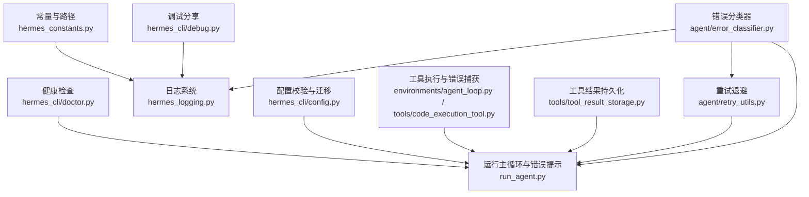
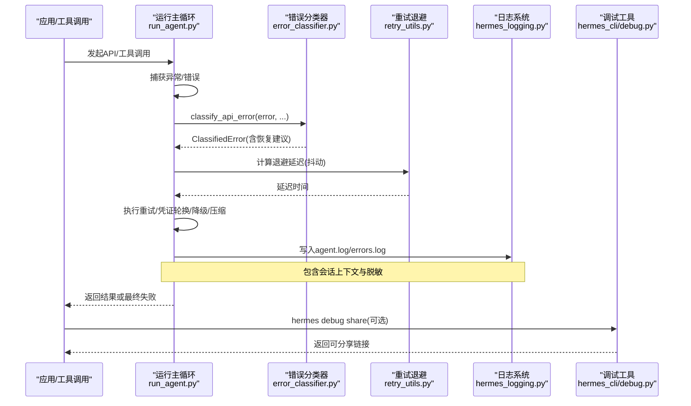
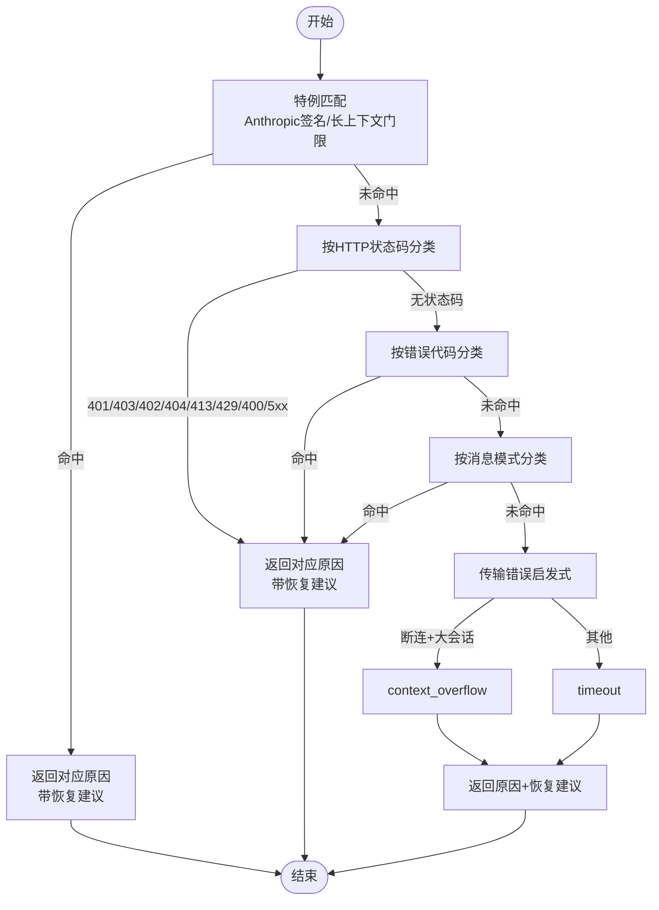
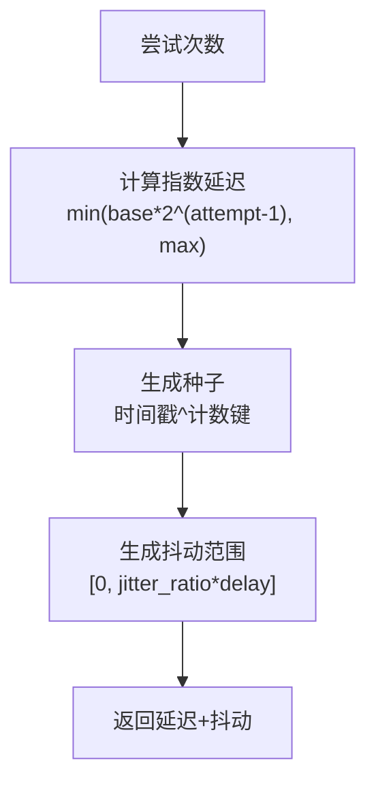
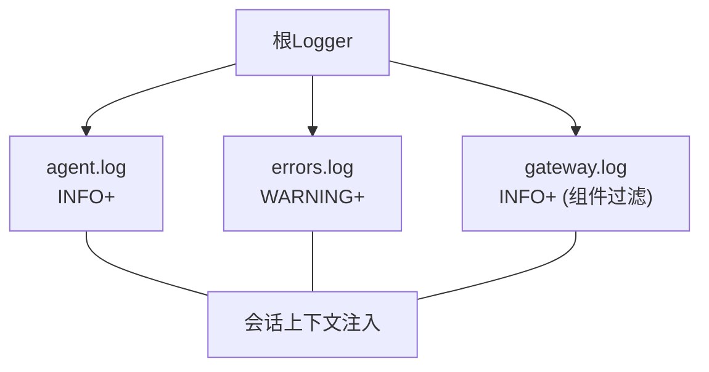
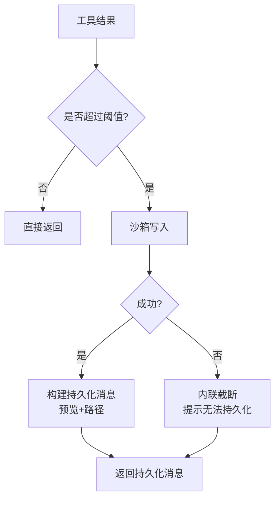
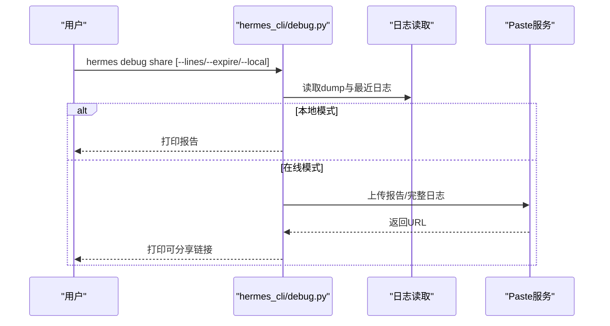
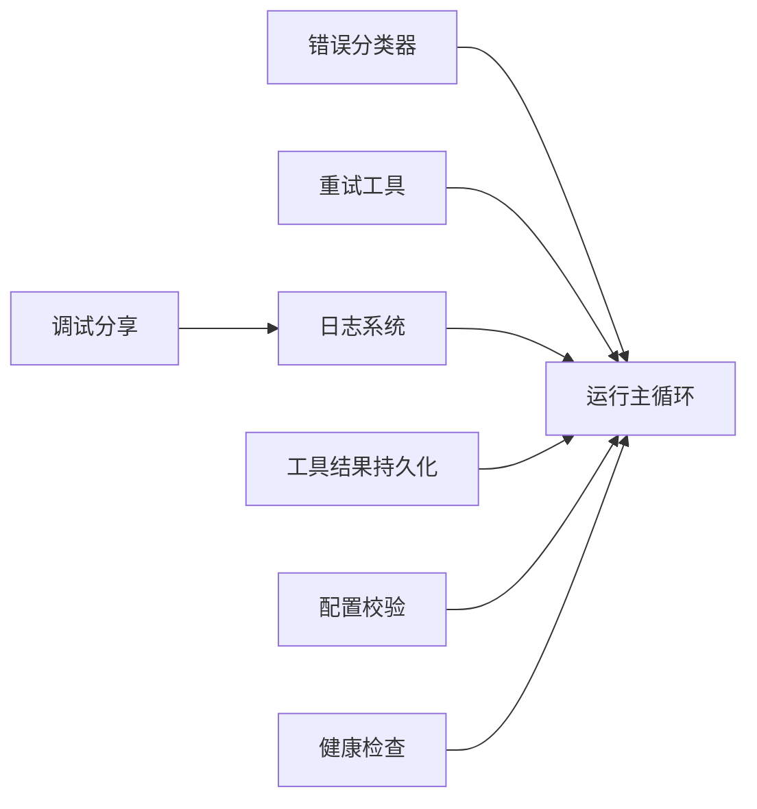

# 错误代码参考

<cite>
**本文引用的文件**
- [agent/error_classifier.py](file://agent/error_classifier.py)
- [run_agent.py](file://run_agent.py)
- [agent/retry_utils.py](file://agent/retry_utils.py)
- [hermes_logging.py](file://hermes_logging.py)
- [hermes_constants.py](file://hermes_constants.py)
- [hermes_cli/debug.py](file://hermes_cli/debug.py)
- [hermes_cli/doctor.py](file://hermes_cli/doctor.py)
- [tools/tool_result_storage.py](file://tools/tool_result_storage.py)
- [environments/agent_loop.py](file://environments/agent_loop.py)
- [tools/code_execution_tool.py](file://tools/code_execution_tool.py)
- [hermes_cli/config.py](file://hermes_cli/config.py)
</cite>

## 目录
1. [简介](#简介)
2. [项目结构](#项目结构)
3. [核心组件](#核心组件)
4. [架构总览](#架构总览)
5. [详细组件分析](#详细组件分析)
6. [依赖分析](#依赖分析)
7. [性能考虑](#性能考虑)
8. [故障排查指南](#故障排查指南)
9. [结论](#结论)
10. [附录](#附录)

## 简介
本手册面向Hermes Agent使用者与维护者，提供完整的错误处理与故障排查参考。内容覆盖错误分类体系、错误来源（网络、认证、工具执行、配置等）、错误描述、触发条件、影响范围、修复步骤、日志分析方法、调试技巧、预防措施以及常见问题的快速排查流程与联系支持方式。文档以代码为依据，确保信息准确可追溯。

## 项目结构
围绕错误处理的关键模块包括：
- 错误分类与恢复：agent/error_classifier.py
- 重试与退避：agent/retry_utils.py
- 日志系统：hermes_logging.py
- 常量与路径：hermes_constants.py
- 调试与诊断：hermes_cli/debug.py、hermes_cli/doctor.py
- 工具结果持久化：tools/tool_result_storage.py
- 工具执行与错误捕获：environments/agent_loop.py、tools/code_execution_tool.py
- 配置校验与迁移：hermes_cli/config.py
- 运行主循环与错误提示：run_agent.py

**图表来源**
- [agent/error_classifier.py:222-395](file://agent/error_classifier.py#L222-L395)
- [agent/retry_utils.py:19-58](file://agent/retry_utils.py#L19-L58)
- [hermes_logging.py:161-265](file://hermes_logging.py#L161-L265)
- [hermes_constants.py:11-56](file://hermes_constants.py#L11-L56)
- [hermes_cli/debug.py:206-240](file://hermes_cli/debug.py#L206-L240)
- [hermes_cli/doctor.py:162-800](file://hermes_cli/doctor.py#L162-L800)
- [tools/tool_result_storage.py:116-173](file://tools/tool_result_storage.py#L116-L173)
- [environments/agent_loop.py:436-460](file://environments/agent_loop.py#L436-L460)
- [tools/code_execution_tool.py:382-414](file://tools/code_execution_tool.py#L382-L414)
- [hermes_cli/config.py:1714-1735](file://hermes_cli/config.py#L1714-L1735)
- [run_agent.py:8297-8314](file://run_agent.py#L8297-L8314)

**章节来源**
- [agent/error_classifier.py:222-395](file://agent/error_classifier.py#L222-L395)
- [agent/retry_utils.py:19-58](file://agent/retry_utils.py#L19-L58)
- [hermes_logging.py:161-265](file://hermes_logging.py#L161-L265)
- [hermes_constants.py:11-56](file://hermes_constants.py#L11-L56)
- [hermes_cli/debug.py:206-240](file://hermes_cli/debug.py#L206-L240)
- [hermes_cli/doctor.py:162-800](file://hermes_cli/doctor.py#L162-L800)
- [tools/tool_result_storage.py:116-173](file://tools/tool_result_storage.py#L116-L173)
- [environments/agent_loop.py:436-460](file://environments/agent_loop.py#L436-L460)
- [tools/code_execution_tool.py:382-414](file://tools/code_execution_tool.py#L382-L414)
- [hermes_cli/config.py:1714-1735](file://hermes_cli/config.py#L1714-L1735)
- [run_agent.py:8297-8314](file://run_agent.py#L8297-L8314)

## 核心组件
- 错误分类与恢复策略
  - 提供统一的错误分类枚举与结构化分类结果，指导重试、凭证轮换、降级、压缩上下文等恢复动作。
  - 支持基于状态码、错误代码、消息模式、传输错误、服务器断连等多源判定。
- 重试与退避
  - 实现抖动指数退避，避免“惊群效应”，提升并发重试的稳定性。
- 日志系统
  - 统一输出到~/.hermes/logs/，包含agent.log、errors.log、gateway.log；支持会话上下文标记、脱敏格式化、轮转与权限控制。
- 工具结果持久化
  - 对超大工具输出进行沙箱持久化与预览替换，防止上下文溢出；对单回合聚合预算进行强制裁剪。
- 调试与诊断
  - 提供hermes debug share一键上传调试报告；hermes doctor进行系统性健康检查与自动修复建议。
- 配置校验
  - 结构化配置校验与版本迁移，提前暴露配置问题，减少运行时错误。

**章节来源**
- [agent/error_classifier.py:25-80](file://agent/error_classifier.py#L25-L80)
- [agent/retry_utils.py:19-58](file://agent/retry_utils.py#L19-L58)
- [hermes_logging.py:161-265](file://hermes_logging.py#L161-L265)
- [tools/tool_result_storage.py:116-173](file://tools/tool_result_storage.py#L116-L173)
- [hermes_cli/debug.py:206-240](file://hermes_cli/debug.py#L206-L240)
- [hermes_cli/doctor.py:162-800](file://hermes_cli/doctor.py#L162-L800)
- [hermes_cli/config.py:1714-1735](file://hermes_cli/config.py#L1714-L1735)

## 架构总览
下图展示了错误从产生到被分类、恢复、记录与上报的整体流程。

**图表来源**
- [run_agent.py:8297-8314](file://run_agent.py#L8297-L8314)
- [agent/error_classifier.py:222-395](file://agent/error_classifier.py#L222-L395)
- [agent/retry_utils.py:19-58](file://agent/retry_utils.py#L19-L58)
- [hermes_logging.py:224-242](file://hermes_logging.py#L224-L242)
- [hermes_cli/debug.py:247-318](file://hermes_cli/debug.py#L247-L318)

## 详细组件分析

### 错误分类与恢复策略
- 分类维度
  - 认证/授权：auth、auth_permanent
  - 计费/配额：billing、rate_limit
  - 服务端：overloaded、server_error
  - 传输/超时：timeout
  - 上下文/负载：context_overflow、payload_too_large
  - 模型：model_not_found
  - 请求格式：format_error
  - 供应商特例：thinking_signature、long_context_tier
  - 兜底：unknown
- 分类优先级
  1) 供应商特例（如Anthropic签名、长上下文门限）
  2) HTTP状态码 + 消息细化
  3) 错误代码分类
  4) 消息模式匹配（计费 vs 速率限制 vs 上下文溢出 vs 认证）
  5) 传输错误启发式
  6) 大会话断连 → 上下文溢出
  7) 兜底unknown（可退避重试）

**图表来源**
- [agent/error_classifier.py:222-395](file://agent/error_classifier.py#L222-L395)
- [agent/error_classifier.py:400-504](file://agent/error_classifier.py#L400-L504)
- [agent/error_classifier.py:613-648](file://agent/error_classifier.py#L613-L648)
- [agent/error_classifier.py:653-739](file://agent/error_classifier.py#L653-L739)

**章节来源**
- [agent/error_classifier.py:25-80](file://agent/error_classifier.py#L25-L80)
- [agent/error_classifier.py:222-395](file://agent/error_classifier.py#L222-L395)

### 重试与退避
- 抖动指数退避
  - 基于尝试次数计算延迟，加入随机抖动，避免多个会话同时重试。
  - 可配置基础延迟、最大延迟与抖动比例。
- 并发安全
  - 使用锁保护抖动种子生成，保证多线程下的唯一性与时序差异。

**图表来源**
- [agent/retry_utils.py:19-58](file://agent/retry_utils.py#L19-L58)

**章节来源**
- [agent/retry_utils.py:19-58](file://agent/retry_utils.py#L19-L58)

### 日志系统与会话上下文
- 输出文件
  - agent.log：全部活动（INFO+）
  - errors.log：警告及以上（快速定位）
  - gateway.log：网关专用（仅gateway.*记录）
- 会话上下文
  - set_session_context()/clear_session_context()在每条日志中注入[会话ID]，便于关联排查。
- 安全与轮转
  - RotatingFileHandler + RedactingFormatter，防止敏感信息落盘；受控轮转与备份数量。
- 组件过滤
  - 通过组件前缀路由不同日志到独立文件。

**图表来源**
- [hermes_logging.py:161-265](file://hermes_logging.py#L161-L265)

**章节来源**
- [hermes_logging.py:161-265](file://hermes_logging.py#L161-L265)
- [hermes_constants.py:11-56](file://hermes_constants.py#L11-L56)

### 工具结果持久化与上下文溢出防护
- 三层防御
  1) 工具内部截断阈值
  2) 单结果持久化（沙箱写入）+ 预览替换
  3) 单回合聚合预算裁剪
- 关键行为
  - 超阈值写入沙箱，生成heredoc标记，避免模型上下文溢出。
  - 若沙箱写入失败，回退内联截断并提示。
  - 对非持久化结果按大小排序裁剪，直至低于预算。

**图表来源**
- [tools/tool_result_storage.py:116-173](file://tools/tool_result_storage.py#L116-L173)
- [tools/tool_result_storage.py:175-227](file://tools/tool_result_storage.py#L175-L227)

**章节来源**
- [tools/tool_result_storage.py:116-173](file://tools/tool_result_storage.py#L116-L173)
- [tools/tool_result_storage.py:175-227](file://tools/tool_result_storage.py#L175-L227)

### 调试与诊断
- hermes debug share
  - 收集系统快照（hermes dump）+ 最近日志尾部，上传至paste服务，返回可分享URL。
  - 支持本地打印或指定过期天数。
- hermes doctor
  - 检查Python版本、包依赖、配置文件、认证状态、目录结构、外部工具、API连通性等。
  - 提供自动修复建议与操作命令，必要时提示手动处理。

**图表来源**
- [hermes_cli/debug.py:247-318](file://hermes_cli/debug.py#L247-L318)
- [hermes_cli/debug.py:206-240](file://hermes_cli/debug.py#L206-L240)

**章节来源**
- [hermes_cli/debug.py:206-318](file://hermes_cli/debug.py#L206-L318)
- [hermes_cli/doctor.py:162-800](file://hermes_cli/doctor.py#L162-L800)

### 配置校验与迁移
- 结构校验
  - 提前发现配置中的结构性问题（如自定义provider格式错误），避免运行时崩溃。
- 版本迁移
  - 自动迁移配置版本，补充新增字段；支持交互或静默模式。
- 配置警告
  - 启动时打印配置问题清单与修复建议，引导用户使用hermes doctor。

**章节来源**
- [hermes_cli/config.py:1714-1735](file://hermes_cli/config.py#L1714-L1735)

## 依赖分析
- 组件耦合
  - 错误分类器与运行主循环强耦合：主循环根据分类结果决定重试、轮换、降级、压缩。
  - 重试工具与主循环弱耦合：仅提供延迟计算，具体决策在主循环。
  - 日志系统与各模块松耦合：通过标准logging接口输出，不引入循环依赖。
  - 工具结果持久化与主循环弱耦合：仅在工具返回后处理，不影响调用链。
- 外部依赖
  - HTTP客户端（如httpx/OpenAI SDK）产生的异常与响应体用于分类。
  - 第三方平台适配器（如Discord/Slack）在连接失败时提供致命/可重试信息，驱动重试队列。

**图表来源**
- [agent/error_classifier.py:222-395](file://agent/error_classifier.py#L222-L395)
- [run_agent.py:8297-8314](file://run_agent.py#L8297-L8314)
- [hermes_logging.py:161-265](file://hermes_logging.py#L161-L265)
- [tools/tool_result_storage.py:116-173](file://tools/tool_result_storage.py#L116-L173)
- [hermes_cli/config.py:1714-1735](file://hermes_cli/config.py#L1714-L1735)
- [hermes_cli/doctor.py:162-800](file://hermes_cli/doctor.py#L162-L800)
- [hermes_cli/debug.py:247-318](file://hermes_cli/debug.py#L247-L318)

**章节来源**
- [agent/error_classifier.py:222-395](file://agent/error_classifier.py#L222-L395)
- [run_agent.py:8297-8314](file://run_agent.py#L8297-L8314)
- [hermes_logging.py:161-265](file://hermes_logging.py#L161-L265)
- [tools/tool_result_storage.py:116-173](file://tools/tool_result_storage.py#L116-L173)
- [hermes_cli/config.py:1714-1735](file://hermes_cli/config.py#L1714-L1735)
- [hermes_cli/doctor.py:162-800](file://hermes_cli/doctor.py#L162-L800)
- [hermes_cli/debug.py:247-318](file://hermes_cli/debug.py#L247-L318)

## 性能考虑
- 退避抖动
  - 降低并发重试的峰值压力，避免“惊群效应”导致上游进一步拥塞。
- 日志轮转与脱敏
  - 控制单文件大小与备份数量，避免磁盘膨胀；脱敏格式化避免敏感信息泄露。
- 工具结果持久化
  - 将超大输出写入沙箱，减少内存与上下文占用；对非持久化结果按大小裁剪，保障吞吐。

[本节为通用建议，无需特定文件引用]

## 故障排查指南

### 常见错误来源与处理要点
- 网络错误
  - 触发条件：DNS解析失败、连接超时、读取超时、协议错误、远端断开。
  - 影响范围：API调用中断、平台适配器连接失败。
  - 修复步骤：检查网络连通性、代理设置、IPv4偏好、上游服务状态；必要时启用强制IPv4。
  - 参考实现：错误分类器对传输错误类型与断连场景的启发式判断。
- 认证错误
  - 触发条件：401/403、令牌无效/过期、密钥错误。
  - 影响范围：所有需要鉴权的API调用。
  - 修复步骤：刷新/轮换凭证、检查环境变量、确认提供商登录状态；主循环会在分类后触发凭证轮换与降级。
- 工具执行错误
  - 触发条件：工具内部异常、子进程退出码异常、返回JSON包含错误字段。
  - 影响范围：单次工具调用失败，可能影响后续流程。
  - 修复步骤：查看工具日志、检查沙箱写入权限、确认工具参数与环境；必要时降低输出阈值或禁用耗时工具。
- 配置错误
  - 触发条件：配置文件缺失、结构不合法、字段过期、缺少必需环境变量。
  - 影响范围：启动阶段或首次使用时报错。
  - 修复步骤：运行hermes doctor自动修复；使用hermes config check查看缺失项；按提示迁移配置版本。

**章节来源**
- [agent/error_classifier.py:398-504](file://agent/error_classifier.py#L398-L504)
- [run_agent.py:8297-8314](file://run_agent.py#L8297-L8314)
- [environments/agent_loop.py:436-460](file://environments/agent_loop.py#L436-L460)
- [tools/code_execution_tool.py:382-414](file://tools/code_execution_tool.py#L382-L414)
- [hermes_cli/config.py:1714-1735](file://hermes_cli/config.py#L1714-L1735)
- [hermes_cli/doctor.py:162-800](file://hermes_cli/doctor.py#L162-L800)

### 错误日志分析方法
- 快速定位
  - 使用errors.log快速筛选警告及以上级别错误。
  - 使用会话上下文标签[会话ID]在agent.log中过滤特定对话。
- 日志采集
  - 使用hermes debug share一键收集系统快照与最近日志，便于外部分析。
- 日志轮转
  - 注意轮转文件（如agent.log.1）也可能包含关键信息。

**章节来源**
- [hermes_logging.py:224-242](file://hermes_logging.py#L224-L242)
- [hermes_cli/debug.py:115-181](file://hermes_cli/debug.py#L115-L181)

### 调试技巧
- 会话上下文
  - 在对话开始设置set_session_context，在结束清理clear_session_context，确保日志可追踪。
- 详细日志
  - 启用调试输出（--verbose）查看更详细的控制台日志。
- 环境隔离
  - 使用沙箱写入工具结果，避免污染上下文；若失败，查看回退提示。

**章节来源**
- [hermes_logging.py:72-88](file://hermes_logging.py#L72-L88)
- [hermes_logging.py:268-298](file://hermes_logging.py#L268-L298)
- [tools/tool_result_storage.py:153-172](file://tools/tool_result_storage.py#L153-L172)

### 预防措施
- 配置前置校验
  - 启动时打印配置警告，尽早暴露问题。
- 重试策略
  - 使用抖动退避，避免集中重试；结合分类器建议选择合适的恢复动作。
- 上下文管理
  - 启用上下文压缩与工具结果持久化，降低溢出风险。

**章节来源**
- [hermes_cli/config.py:1714-1735](file://hermes_cli/config.py#L1714-L1735)
- [agent/retry_utils.py:19-58](file://agent/retry_utils.py#L19-L58)
- [tools/tool_result_storage.py:116-173](file://tools/tool_result_storage.py#L116-L173)

### 常见错误快速排查流程
- 网络/上游错误
  - 步骤：检查errors.log中的HTTP状态码与耗时；确认上游服务可用性；必要时启用强制IPv4。
  - 参考：运行主循环中的错误提示与分类器对状态码的解释。
- 认证失败
  - 步骤：确认API密钥/令牌有效；检查提供商登录状态；查看凭证轮换是否生效。
- 工具执行失败
  - 步骤：查看工具返回的错误字段与退出码；检查沙箱写入权限；缩小参数范围复现。
- 配置问题
  - 步骤：运行hermes doctor；根据提示补齐缺失字段；迁移配置版本。

**章节来源**
- [run_agent.py:8297-8314](file://run_agent.py#L8297-L8314)
- [agent/error_classifier.py:400-504](file://agent/error_classifier.py#L400-L504)
- [environments/agent_loop.py:436-460](file://environments/agent_loop.py#L436-L460)
- [hermes_cli/doctor.py:162-800](file://hermes_cli/doctor.py#L162-L800)

### 联系支持
- 本地排障
  - 使用hermes debug share生成可分享链接，附上错误摘要与最近日志。
- 平台适配器
  - 若平台连接失败，查看fatal_error_message与fatal_error_retryable，按需重试或更换平台。
- 文档与社区
  - 参考项目文档与示例配置，必要时提交issue并附带调试报告。

**章节来源**
- [hermes_cli/debug.py:247-318](file://hermes_cli/debug.py#L247-L318)
- [gateway/run.py:1617-1643](file://gateway/run.py#L1617-L1643)

## 结论
Hermes Agent通过统一的错误分类体系、智能恢复策略、完善的日志与调试能力，为复杂多模型、多平台、多工具的Agent运行提供了稳健的错误处理框架。遵循本手册的分类与排查流程，可显著缩短故障定位时间，提升系统稳定性与用户体验。

[本节为总结性内容，无需特定文件引用]

## 附录

### 错误分类与恢复建议对照表（摘要）
- 认证/授权：auth/auth_permanent → 凭证轮换/降级
- 计费/配额：billing/rate_limit → 立即轮换/降级，周期性重试
- 服务端：overloaded/server_error → 退避重试
- 传输/超时：timeout → 重建客户端/重试
- 上下文/负载：context_overflow/payload_too_large → 压缩/截断
- 模型：model_not_found → 降级到可用模型
- 请求格式：format_error → 中止或清洗后重试
- 供应商特例：thinking_signature/long_context_tier → 特定处理
- 兜底：unknown → 可退避重试

**章节来源**
- [agent/error_classifier.py:25-80](file://agent/error_classifier.py#L25-L80)
- [agent/error_classifier.py:398-504](file://agent/error_classifier.py#L398-L504)