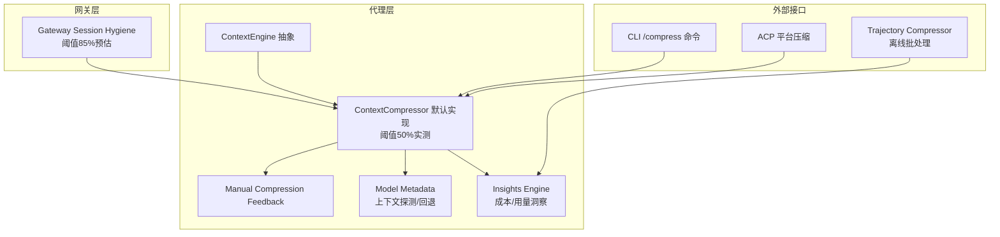
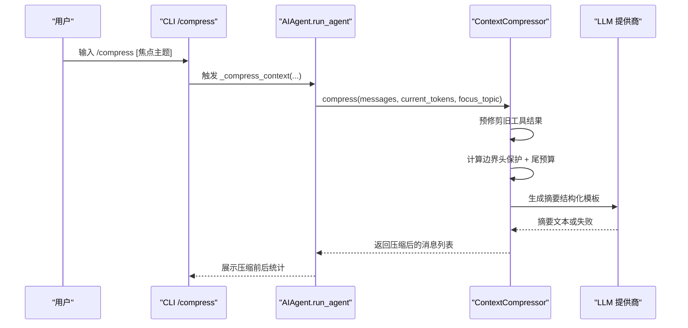
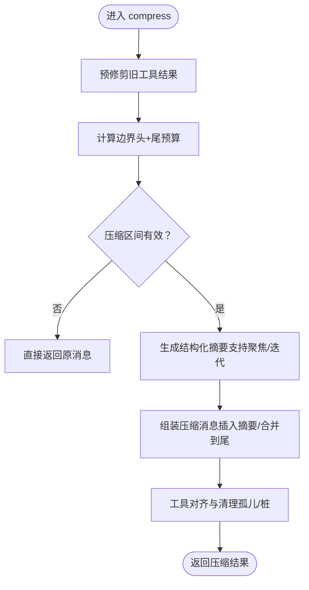
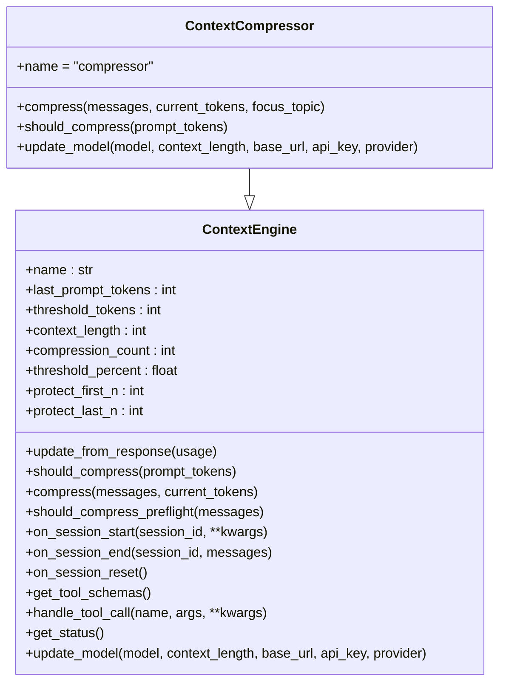
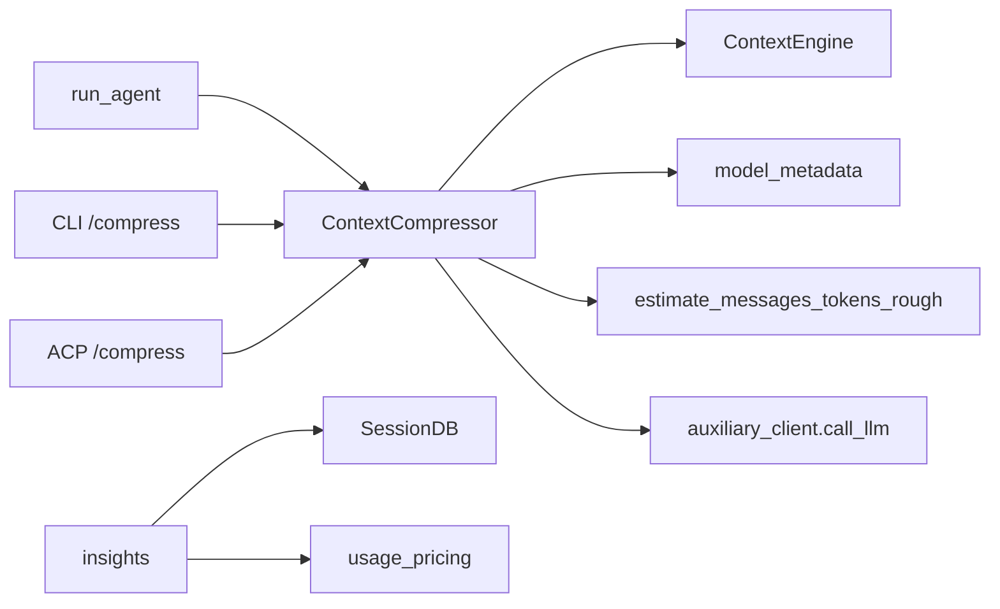

# 上下文压缩系统

<cite>
**本文引用的文件**
- [agent/context_compressor.py](file://agent/context_compressor.py)
- [agent/context_engine.py](file://agent/context_engine.py)
- [agent/manual_compression_feedback.py](file://agent/manual_compression_feedback.py)
- [run_agent.py](file://run_agent.py)
- [cli.py](file://cli.py)
- [website/docs/developer-guide/context-compression-and-caching.md](file://website/docs/developer-guide/context-compression-and-caching.md)
- [cli-config.yaml.example](file://cli-config.yaml.example)
- [datagen-config-examples/trajectory_compression.yaml](file://datagen-config-examples/trajectory_compression.yaml)
- [agent/model_metadata.py](file://agent/model_metadata.py)
- [agent/insights.py](file://agent/insights.py)
- [acp_adapter/server.py](file://acp_adapter/server.py)
- [tests/run_agent/test_long_context_tier_429.py](file://tests/run_agent/test_long_context_tier_429.py)
- [trajectory_compressor.py](file://trajectory_compressor.py)
</cite>

## 目录
1. [简介](#简介)
2. [项目结构](#项目结构)
3. [核心组件](#核心组件)
4. [架构总览](#架构总览)
5. [详细组件分析](#详细组件分析)
6. [依赖分析](#依赖分析)
7. [性能考量](#性能考量)
8. [故障排查指南](#故障排查指南)
9. [结论](#结论)
10. [附录](#附录)

## 简介
本文件系统化阐述 Hermes Agent 的上下文压缩系统，覆盖长对话历史的处理机制、压缩算法与优化策略，以及自动与手动压缩的触发条件、配置项与效果评估。文档同时给出压缩质量的衡量标准、性能影响与资源消耗、配置指南与调优建议、失败诊断方法、压缩与记忆保留的平衡考虑，以及压缩效果的监控与分析工具使用指导。

## 项目结构
上下文压缩系统由“网关层安全网”和“代理内压缩器”两层协同工作，并辅以提示缓存（Anthropic）与 CLI/ACP 的手动压缩入口。关键文件与职责如下：
- agent/context_engine.py：上下文引擎抽象基类，定义生命周期与接口
- agent/context_compressor.py：默认压缩引擎实现，负责阈值判断、边界保护、摘要生成与消息组装
- agent/manual_compression_feedback.py：手动压缩后的用户反馈汇总
- run_agent.py：主循环中对上下文溢出的探测、降级与重试、压缩尝试与持久化
- cli.py：/compress 命令的手动触发与结果展示
- website/docs/developer-guide/context-compression-and-caching.md：官方文档，含双层压缩、参数说明与示例
- cli-config.yaml.example：压缩配置项的默认值与注释
- datagen-config-examples/trajectory_compression.yaml：轨迹压缩配置示例（离线批处理）
- agent/model_metadata.py：模型上下文长度探测、回退与最小阈值
- agent/insights.py：会话洞察与成本估算，辅助评估压缩效果
- acp_adapter/server.py：ACP 平台中的压缩入口
- tests/run_agent/test_long_context_tier_429.py：长上下文层级探测与限制的测试用例
- trajectory_compressor.py：轨迹压缩器（离线批处理），用于数据集层面的压缩统计与报告

图表来源
- [website/docs/developer-guide/context-compression-and-caching.md:37-75](file://website/docs/developer-guide/context-compression-and-caching.md#L37-L75)
- [agent/context_engine.py:32-185](file://agent/context_engine.py#L32-L185)
- [agent/context_compressor.py:60-171](file://agent/context_compressor.py#L60-L171)
- [cli.py:6280-6331](file://cli.py#L6280-L6331)
- [acp_adapter/server.py:630-661](file://acp_adapter/server.py#L630-L661)
- [agent/manual_compression_feedback.py:8-50](file://agent/manual_compression_feedback.py#L8-L50)
- [agent/model_metadata.py:67-91](file://agent/model_metadata.py#L67-L91)
- [agent/insights.py:94-162](file://agent/insights.py#L94-L162)
- [trajectory_compressor.py:1125-1150](file://trajectory_compressor.py#L1125-L1150)

章节来源
- [website/docs/developer-guide/context-compression-and-caching.md:37-106](file://website/docs/developer-guide/context-compression-and-caching.md#L37-L106)
- [cli-config.yaml.example:284-312](file://cli-config.yaml.example#L284-L312)

## 核心组件
- 上下文引擎抽象（ContextEngine）：定义生命周期（on_session_start/end/reset）、状态字段（last_prompt_tokens、threshold_tokens、context_length、compression_count）、接口（update_from_response、should_compress、compress）与可选工具（get_tool_schemas、handle_tool_call）。
- 默认压缩引擎（ContextCompressor）：在代理内部循环中运行，基于真实 API 报告的 token 数进行阈值判断；采用“头尾保护 + 中部摘要”的四阶段算法；支持迭代更新摘要、工具调用/结果配对修复、摘要失败冷却等。
- 手动压缩反馈（manual_compression_feedback）：对用户执行 /compress 后的结果进行统一反馈，包括消息数变化、粗略 token 变化与注意事项。
- 主循环集成（run_agent）：在 API 调用后检测上下文溢出，尝试降级模型或触发压缩；限制最大压缩尝试次数；压缩失败时持久化会话并返回错误。
- 配置与文档（cli-config.yaml.example、开发者指南）：提供 compression.enabled、threshold、target_ratio、protect_last_n 等关键参数及说明。
- 模型元数据（model_metadata）：提供上下文长度探测、回退策略与最小阈值，避免在小上下文模型上过早压缩。
- 洞察引擎（insights）：提供会话成本与用量洞察，辅助评估压缩效果与资源消耗。
- ACP 适配器（acp_adapter/server）：在 ACP 平台中提供压缩入口，避免 SQLite 会话分裂副作用。
- 轨迹压缩器（trajectory_compressor）：离线批处理工具，支持目标 token、摘要目标、保护区间、并发与指标输出。

章节来源
- [agent/context_engine.py:32-185](file://agent/context_engine.py#L32-L185)
- [agent/context_compressor.py:60-171](file://agent/context_compressor.py#L60-L171)
- [agent/manual_compression_feedback.py:8-50](file://agent/manual_compression_feedback.py#L8-L50)
- [run_agent.py:9100-9161](file://run_agent.py#L9100-L9161)
- [cli-config.yaml.example:284-312](file://cli-config.yaml.example#L284-L312)
- [website/docs/developer-guide/context-compression-and-caching.md:77-106](file://website/docs/developer-guide/context-compression-and-caching.md#L77-L106)
- [agent/model_metadata.py:67-91](file://agent/model_metadata.py#L67-L91)
- [agent/insights.py:94-162](file://agent/insights.py#L94-L162)
- [acp_adapter/server.py:630-661](file://acp_adapter/server.py#L630-L661)
- [trajectory_compressor.py:1125-1150](file://trajectory_compressor.py#L1125-L1150)

## 架构总览
双层压缩体系：
- 网关会话卫生（85% 阈值，预估）：在进入代理前对长时间未交互的会话进行安全压缩，防止溢出。
- 代理内压缩器（50% 阈值，实测）：在代理工具循环中，基于真实 API 报告的 token 数进行压缩决策与执行。

图表来源
- [cli.py:6280-6331](file://cli.py#L6280-L6331)
- [run_agent.py:9133-9151](file://run_agent.py#L9133-L9151)
- [agent/context_compressor.py:666-800](file://agent/context_compressor.py#L666-L800)

章节来源
- [website/docs/developer-guide/context-compression-and-caching.md:37-75](file://website/docs/developer-guide/context-compression-and-caching.md#L37-L75)
- [run_agent.py:9100-9161](file://run_agent.py#L9100-L9161)

## 详细组件分析

### 组件一：ContextCompressor（默认压缩引擎）
- 触发条件：当 prompt_tokens ≥ threshold_tokens（threshold_tokens = context_length × threshold_percent）时触发。
- 边界保护：头保护（system + 首次对话）+ 尾保护（按 token 预算，不低于固定消息数）。
- 算法流程：
  1) 预修剪旧工具结果（节省 token）
  2) 确定压缩起止边界（避免拆分 tool_call/tool_result 组）
  3) 结构化摘要生成（支持聚焦主题与迭代更新）
  4) 组装压缩后的消息列表（角色选择避免连续同角色）
- 工具对齐与清理：移除孤儿结果、为缺失结果注入桩占位，确保 API 不报错。
- 摘要失败冷却：在摘要生成异常时进入冷却期，避免频繁重试造成噪声。

图表来源
- [agent/context_compressor.py:666-800](file://agent/context_compressor.py#L666-L800)
- [agent/context_compressor.py:186-241](file://agent/context_compressor.py#L186-L241)
- [agent/context_compressor.py:604-661](file://agent/context_compressor.py#L604-L661)
- [agent/context_compressor.py:318-484](file://agent/context_compressor.py#L318-L484)
- [agent/context_compressor.py:506-564](file://agent/context_compressor.py#L506-L564)

章节来源
- [agent/context_compressor.py:60-171](file://agent/context_compressor.py#L60-L171)
- [agent/context_compressor.py:666-800](file://agent/context_compressor.py#L666-L800)

### 组件二：ContextEngine（抽象基类）
- 生命周期：注册 → 会话开始 → 使用量更新 → 判定压缩 → 执行压缩 → 会话结束。
- 关键字段：last_prompt_tokens、threshold_tokens、context_length、compression_count。
- 可选能力：预检（should_compress_preflight）、工具模式（get_tool_schemas/handle_tool_call）、状态展示（get_status）、模型切换（update_model）。

图表来源
- [agent/context_engine.py:32-185](file://agent/context_engine.py#L32-L185)
- [agent/context_compressor.py:60-171](file://agent/context_compressor.py#L60-L171)

章节来源
- [agent/context_engine.py:32-185](file://agent/context_engine.py#L32-L185)

### 组件三：手动压缩反馈（manual_compression_feedback）
- 输出：压缩前后消息数变化、粗略 token 变化、是否无变化、必要备注（如消息减少但 token 增加的解释）。
- 用途：CLI /compress 命令后向用户直观呈现压缩效果。

章节来源
- [agent/manual_compression_feedback.py:8-50](file://agent/manual_compression_feedback.py#L8-L50)
- [cli.py:6280-6331](file://cli.py#L6280-L6331)

### 组件四：主循环集成（run_agent）
- 上下文溢出处理：检测 413/429/长上下文层级等错误；尝试降级模型；若仍溢出则触发压缩。
- 最大压缩尝试次数：超过上限则记录错误并持久化当前会话。
- 压缩后重试：压缩成功后短暂休眠并重新尝试发送消息。

章节来源
- [run_agent.py:9100-9161](file://run_agent.py#L9100-L9161)

### 组件五：CLI 与 ACP 平台入口
- CLI /compress：支持可选焦点主题，估算粗略 token 数，调用 agent._compress_context 并打印反馈。
- ACP 平台：在保持稳定会话 ID 的前提下，避免 SQLite 分割副作用，调用 agent._compress_context。

章节来源
- [cli.py:6280-6331](file://cli.py#L6280-L6331)
- [acp_adapter/server.py:630-661](file://acp_adapter/server.py#L630-L661)

### 组件六：轨迹压缩器（离线批处理）
- 目标：对已完成的轨迹进行压缩，保留头尾，摘要中间内容，支持目标 token、摘要目标、并发与指标输出。
- 指标：聚合统计、保存到文件，便于离线评估压缩效果。

章节来源
- [trajectory_compressor.py:1125-1150](file://trajectory_compressor.py#L1125-L1150)
- [datagen-config-examples/trajectory_compression.yaml:1-102](file://datagen-config-examples/trajectory_compression.yaml#L1-L102)

## 依赖分析
- ContextCompressor 依赖：
  - ContextEngine（接口契约）
  - auxiliary_client.call_llm（摘要生成）
  - model_metadata（上下文长度探测与最小阈值）
  - estimate_messages_tokens_rough（粗略 token 估算）
- run_agent 依赖 ContextCompressor 的 should_compress/compress，并在溢出时驱动压缩。
- CLI/ACP 依赖 agent._compress_context，后者委托 ContextCompressor 执行压缩。
- insights 依赖 SessionDB 与 usage_pricing，用于成本与用量洞察。

图表来源
- [agent/context_compressor.py:24-30](file://agent/context_compressor.py#L24-L30)
- [run_agent.py:9133-9151](file://run_agent.py#L9133-L9151)
- [cli.py:6280-6331](file://cli.py#L6280-L6331)
- [acp_adapter/server.py:630-661](file://acp_adapter/server.py#L630-L661)
- [agent/insights.py:94-162](file://agent/insights.py#L94-L162)

章节来源
- [agent/context_compressor.py:24-30](file://agent/context_compressor.py#L24-L30)
- [run_agent.py:9133-9151](file://run_agent.py#L9133-L9151)
- [cli.py:6280-6331](file://cli.py#L6280-L6331)
- [acp_adapter/server.py:630-661](file://acp_adapter/server.py#L630-L661)
- [agent/insights.py:94-162](file://agent/insights.py#L94-L162)

## 性能考量
- 摘要模型上下文窗口要求：摘要模型必须至少与主模型同等大小，否则会因上下文不足导致摘要失败，进而丢弃中间内容。应优先选择具备足够上下文窗口的快速/廉价模型作为摘要器。
- 预修剪工具结果：显著降低 token 消耗，减少摘要负担。
- 迭代摘要：跨多次压缩保留信息，减少重复丢失。
- 冷却机制：摘要失败后进入冷却，避免频繁重试。
- 离线轨迹压缩：适合批量评估与调参，降低在线压力。

章节来源
- [website/docs/developer-guide/context-compression-and-caching.md:144-148](file://website/docs/developer-guide/context-compression-and-caching.md#L144-L148)
- [agent/context_compressor.py:186-241](file://agent/context_compressor.py#L186-L241)
- [agent/context_compressor.py:318-484](file://agent/context_compressor.py#L318-L484)

## 故障排查指南
- 摘要失败（无提供商可用/上下文不足）：
  - 现象：日志警告“摘要生成不可用”，插入静态占位上下文标记。
  - 处理：检查摘要模型上下文窗口是否小于主模型；更换更大上下文窗口的摘要模型；等待冷却时间结束再试。
- 上下文溢出（413/429/长上下文层级）：
  - 现象：run_agent 检测到溢出，尝试降级模型；若仍溢出则触发压缩；超过最大尝试次数则记录错误并持久化。
  - 处理：调整阈值/目标比例/尾预算；启用更激进的预修剪；缩短会话或定期手动压缩。
- 模型探测与限制：
  - 测试用例验证了在不同上下文层级下的限制行为，确保不会错误持久化订阅层级而非模型能力。
- ACP 平台压缩：
  - 注意避免 SQLite 会话分割副作用，确保会话 ID 稳定。

章节来源
- [agent/context_compressor.py:468-483](file://agent/context_compressor.py#L468-L483)
- [run_agent.py:9100-9161](file://run_agent.py#L9100-L9161)
- [tests/run_agent/test_long_context_tier_429.py:116-147](file://tests/run_agent/test_long_context_tier_429.py#L116-L147)
- [acp_adapter/server.py:630-661](file://acp_adapter/server.py#L630-L661)

## 结论
Hermes Agent 的上下文压缩系统通过“网关安全网 + 代理内压缩器”的双层设计，在保证稳定性的同时实现了高效的长对话管理。默认压缩引擎采用结构化摘要与严格的边界保护策略，结合迭代更新与工具对齐清理，兼顾压缩效率与信息完整性。配合 CLI/ACP 手动入口、离线轨迹压缩与洞察引擎，用户可以灵活地进行压缩策略调优与效果评估。

## 附录

### 自动压缩触发条件与配置
- 触发条件：prompt_tokens ≥ threshold × context_length
- 关键配置（compression.*）：
  - enabled：是否启用压缩
  - threshold：触发阈值比例（默认 0.50）
  - target_ratio：尾预算占阈值的比例（默认 0.20）
  - protect_last_n：最少保护尾部消息数（默认 20）
  - summary_model：摘要模型覆盖（默认使用辅助模型）

章节来源
- [website/docs/developer-guide/context-compression-and-caching.md:77-98](file://website/docs/developer-guide/context-compression-and-caching.md#L77-L98)
- [cli-config.yaml.example:284-312](file://cli-config.yaml.example#L284-L312)

### 手动压缩触发与效果评估
- 触发方式：CLI /compress [焦点主题] 或 ACP 平台入口
- 效果评估：消息数变化、粗略 token 变化、是否无变化、必要备注
- 指标输出：离线轨迹压缩器支持指标文件输出，便于批量评估

章节来源
- [cli.py:6280-6331](file://cli.py#L6280-L6331)
- [acp_adapter/server.py:630-661](file://acp_adapter/server.py#L630-L661)
- [agent/manual_compression_feedback.py:8-50](file://agent/manual_compression_feedback.py#L8-L50)
- [trajectory_compressor.py:1125-1150](file://trajectory_compressor.py#L1125-L1150)

### 压缩质量衡量标准与监控
- 衡量标准：消息数减少率、token 估算变化、摘要完整性（迭代更新）、工具调用/结果一致性
- 监控工具：insights 引擎提供会话成本与用量洞察；CLI /usage 展示当前上下文与压缩次数；轨迹压缩器输出指标文件

章节来源
- [agent/insights.py:94-162](file://agent/insights.py#L94-L162)
- [cli.py:6340-6417](file://cli.py#L6340-L6417)
- [trajectory_compressor.py:1125-1150](file://trajectory_compressor.py#L1125-L1150)