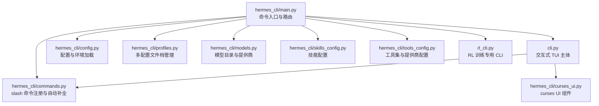
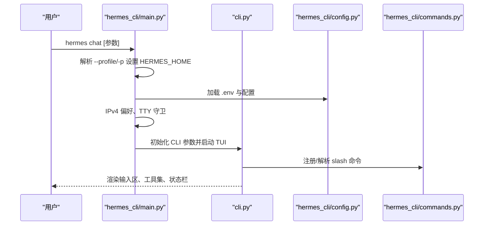
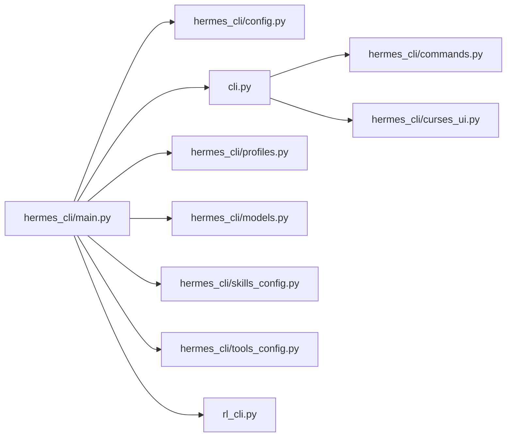

# 命令行界面

<cite>
**本文引用的文件**
- [hermes_cli/main.py](file://hermes_cli/main.py)
- [cli.py](file://cli.py)
- [hermes_cli/commands.py](file://hermes_cli/commands.py)
- [hermes_cli/curses_ui.py](file://hermes_cli/curses_ui.py)
- [hermes_cli/config.py](file://hermes_cli/config.py)
- [hermes_cli/profiles.py](file://hermes_cli/profiles.py)
- [hermes_cli/models.py](file://hermes_cli/models.py)
- [hermes_cli/skills_config.py](file://hermes_cli/skills_config.py)
- [hermes_cli/tools_config.py](file://hermes_cli/tools_config.py)
- [rl_cli.py](file://rl_cli.py)
</cite>

## 目录
1. [简介](#简介)
2. [项目结构](#项目结构)
3. [核心组件](#核心组件)
4. [架构总览](#架构总览)
5. [详细组件分析](#详细组件分析)
6. [依赖分析](#依赖分析)
7. [性能考虑](#性能考虑)
8. [故障排查指南](#故障排查指南)
9. [结论](#结论)
10. [附录](#附录)

## 简介
本文件面向使用者与维护者，系统化梳理 Hermes Agent 的命令行界面（CLI）与交互式 TUI（文本用户界面）。内容覆盖：
- 所有 CLI 子命令、标志与参数用法
- 交互式 TUI 的多行编辑、斜杠命令自动补全、对话历史、中断重定向与流式工具输出
- slash 命令完整参考：模型切换、个性设置、重试撤销、上下文压缩等
- 配置管理、会话管理与个性化设置
- 实际使用示例与最佳实践

## 项目结构
Hermes CLI 的入口与核心逻辑集中在以下模块：
- hermes_cli/main.py：命令解析、子命令路由、TTY 守卫、容器模式、会话浏览与首次运行引导
- cli.py：交互式 TUI 主体，负责输入区域、布局、渲染、工具集选择、会话状态与资源清理
- hermes_cli/commands.py：slash 命令注册表、自动补全与平台映射
- hermes_cli/curses_ui.py：基于 curses 的多选/单选清单与终端输入缓冲刷新
- hermes_cli/config.py：配置读取/保存、环境变量桥接、权限与托管模式处理
- hermes_cli/profiles.py：多配置文件档（profile）管理，含别名与服务集成
- hermes_cli/models.py：模型目录与定价查询、提供商映射
- hermes_cli/skills_config.py：技能启用/禁用配置（全局与平台维度）
- hermes_cli/tools_config.py：工具集与提供商配置（web、browser、vision、image_gen、tts、rl 等）
- rl_cli.py：强化学习专用 CLI 运行器

图表来源
- [hermes_cli/main.py](file://hermes_cli/main.py)
- [cli.py](file://cli.py)
- [hermes_cli/commands.py](file://hermes_cli/commands.py)
- [hermes_cli/curses_ui.py](file://hermes_cli/curses_ui.py)
- [hermes_cli/config.py](file://hermes_cli/config.py)
- [hermes_cli/profiles.py](file://hermes_cli/profiles.py)
- [hermes_cli/models.py](file://hermes_cli/models.py)
- [hermes_cli/skills_config.py](file://hermes_cli/skills_config.py)
- [hermes_cli/tools_config.py](file://hermes_cli/tools_config.py)
- [rl_cli.py](file://rl_cli.py)

章节来源
- [hermes_cli/main.py](file://hermes_cli/main.py)
- [cli.py](file://cli.py)

## 核心组件
- 命令入口与路由
  - 解析 --profile/-p 并在模块导入前设置 HERMES_HOME，确保后续配置读取正确
  - 加载 .env 与集中日志初始化
  - 早期应用 IPv4 偏好以避免网络问题
  - 路由到 chat、gateway、setup、sessions browse 等子命令
- 交互式 TUI
  - prompt_toolkit 布局与固定输入区
  - 工具集选择、预填充消息、浏览器连接、工作树隔离
  - 资源清理（终端环境、浏览器会话、MCP 服务器、辅助客户端）
- slash 命令系统
  - 统一注册表 COMMAND_REGISTRY，支持别名、子命令与平台门控
  - 自动补全与建议（prompt_toolkit），路径与上下文引用补全
- 配置与环境
  - 用户配置优先于项目配置；环境变量桥接到运行时
  - 支持托管安装（NixOS/Homebrew）与容器模式
- 多配置文件档（Profiles）
  - 独立的 HERMES_HOME 目录，含 config.yaml、.env、记忆、会话、技能、网关、定时任务与日志
  - 别名脚本与服务管理（systemd/launchd）

章节来源
- [hermes_cli/main.py](file://hermes_cli/main.py)
- [cli.py](file://cli.py)
- [hermes_cli/commands.py](file://hermes_cli/commands.py)
- [hermes_cli/curses_ui.py](file://hermes_cli/curses_ui.py)
- [hermes_cli/config.py](file://hermes_cli/config.py)
- [hermes_cli/profiles.py](file://hermes_cli/profiles.py)

## 架构总览
下图展示 CLI 启动到进入交互式 TUI 的关键流程。

图表来源
- [hermes_cli/main.py](file://hermes_cli/main.py)
- [cli.py](file://cli.py)
- [hermes_cli/config.py](file://hermes_cli/config.py)
- [hermes_cli/commands.py](file://hermes_cli/commands.py)

## 详细组件分析

### 命令入口与路由（hermes_cli/main.py）
- 首次运行检测：若未配置任何推理提供商，提示执行 hermes setup
- TTY 守卫：对需要交互的命令（如 setup、tools、model）强制要求交互终端
- 容器模式：通过 .container-mode 文件判断是否应进入容器执行 hermes
- 会话浏览：提供基于 curses 的交互式会话筛选与选择
- 子命令路由：chat、gateway、setup、sessions browse、whatsapp 等

章节来源
- [hermes_cli/main.py](file://hermes_cli/main.py)

### 交互式 TUI（cli.py）
- 配置加载与桥接：优先 ~/.hermes/config.yaml，其次 ./cli-config.yaml；将 terminal/browser/auxiliary 等配置映射到环境变量
- Git 工作树隔离：在 git 仓库中创建独立工作树，退出时按策略清理
- 输入与布局：prompt_toolkit 固定输入区、滚动窗口、状态栏、工具进度显示
- 流式输出：工具调用与模型响应的增量渲染
- 资源清理：终端环境、浏览器会话、MCP 服务器、辅助客户端在退出时统一回收

章节来源
- [cli.py](file://cli.py)

### slash 命令系统（hermes_cli/commands.py）
- 命令注册：COMMAND_REGISTRY 提供名称、别名、描述、参数占位符、子命令与平台门控
- 自动补全：SlashCommandCompleter 支持命令、子命令、技能命令、路径与上下文引用补全
- 平台映射：Telegram/Discord/Slack 等平台的命令菜单与子命令映射
- 命令可用性：根据配置门控动态决定命令在网关端是否可见

章节来源
- [hermes_cli/commands.py](file://hermes_cli/commands.py)

### curses UI 组件（hermes_cli/curses_ui.py）
- 多选/单选清单：支持键盘导航、确认/取消、状态栏右对齐
- 输入缓冲刷新：在 curses 退出后刷新 stdin 缓冲，避免残留转义序列影响后续输入
- 文本回退：在不支持 curses 的终端上提供数字编号选择

章节来源
- [hermes_cli/curses_ui.py](file://hermes_cli/curses_ui.py)

### 配置管理（hermes_cli/config.py）
- 路径与权限：确保 ~/.hermes 及子目录安全权限；托管安装（NixOS/Homebrew）下采用组可读权限
- 配置读写：优先用户配置 ~/.hermes/config.yaml，其次项目配置 ./cli-config.yaml；支持环境变量桥接
- 容器模式：读取 .container-mode 决定是否在容器内执行
- 托管安装：提供升级建议与错误提示

章节来源
- [hermes_cli/config.py](file://hermes_cli/config.py)

### 多配置文件档（Profiles，hermes_cli/profiles.py）
- 结构：每个 profile 是独立的 HERMES_HOME，包含 config.yaml、.env、记忆、会话、技能、网关、定时任务与日志
- 创建/删除：支持克隆源 profile、导出归档、清理服务与别名脚本
- 激活：通过 hermes -p <name> 或别名脚本激活指定 profile
- 包装器：在 ~/.local/bin 下生成 <name> 命令以快速切换

章节来源
- [hermes_cli/profiles.py](file://hermes_cli/profiles.py)

### 模型与提供商（hermes_cli/models.py）
- 模型目录：OpenRouter 与多家提供商的模型列表，支持缓存与实时刷新
- 定价查询：从 OpenRouter 兼容端点获取模型定价，格式化为终端表格
- 提供商映射：统一提供商别名，便于选择与切换

章节来源
- [hermes_cli/models.py](file://hermes_cli/models.py)

### 技能配置（hermes_cli/skills_config.py）
- 全局与平台维度：skills.disabled 与 skills.platform_disabled
- 交互式配置：按类别或逐项启用/禁用技能
- 与 curses UI 协作：使用多选清单进行批量操作

章节来源
- [hermes_cli/skills_config.py](file://hermes_cli/skills_config.py)

### 工具集与提供商配置（hermes_cli/tools_config.py）
- 工具集分类：web、browser、terminal、file、code_execution、vision、image_gen、moa、tts、skills、todo、memory、session_search、clarify、delegation、cronjob、rl、homeassistant
- 提供商感知：针对不同工具集提供多种提供商选项与环境变量要求
- 后置安装：浏览器工具、Camofox、RL 训练平台等需要额外安装步骤
- 工具令牌估算：基于 tiktoken 估算工具 schema 的上下文开销

章节来源
- [hermes_cli/tools_config.py](file://hermes_cli/tools_config.py)

### 强化学习专用 CLI（rl_cli.py）
- 用途：为 RL 训练工作流提供专用运行器，扩展超时、RL 专属系统提示与工具集
- 环境检查：验证 tinker-atropos 子模块与 API 密钥
- 交互模式：支持持续对话与训练状态查询

章节来源
- [rl_cli.py](file://rl_cli.py)

## 依赖分析
- 命令入口依赖配置与环境加载，再驱动 TUI 与命令解析
- TUI 依赖命令系统进行 slash 命令解析与自动补全
- 配置模块负责将配置映射到环境变量，影响工具与终端行为
- Profiles 与容器模式影响 CLI 的执行路径与 HOME 目录解析
- 模型与工具配置模块为选择与切换提供数据支撑

图表来源
- [hermes_cli/main.py](file://hermes_cli/main.py)
- [cli.py](file://cli.py)
- [hermes_cli/commands.py](file://hermes_cli/commands.py)
- [hermes_cli/curses_ui.py](file://hermes_cli/curses_ui.py)
- [hermes_cli/config.py](file://hermes_cli/config.py)
- [hermes_cli/profiles.py](file://hermes_cli/profiles.py)
- [hermes_cli/models.py](file://hermes_cli/models.py)
- [hermes_cli/skills_config.py](file://hermes_cli/skills_config.py)
- [hermes_cli/tools_config.py](file://hermes_cli/tools_config.py)
- [rl_cli.py](file://rl_cli.py)

章节来源
- [hermes_cli/main.py](file://hermes_cli/main.py)
- [cli.py](file://cli.py)
- [hermes_cli/commands.py](file://hermes_cli/commands.py)
- [hermes_cli/curses_ui.py](file://hermes_cli/curses_ui.py)
- [hermes_cli/config.py](file://hermes_cli/config.py)
- [hermes_cli/profiles.py](file://hermes_cli/profiles.py)
- [hermes_cli/models.py](file://hermes_cli/models.py)
- [hermes_cli/skills_config.py](file://hermes_cli/skills_config.py)
- [hermes_cli/tools_config.py](file://hermes_cli/tools_config.py)
- [rl_cli.py](file://rl_cli.py)

## 性能考虑
- 配置缓存：OpenRouter 模型目录与定价查询带缓存，减少网络请求
- 上下文压缩：在接近上下文上限时自动压缩，阈值与目标比例可配置
- 工具令牌估算：仅在首次调用时触发工具发现与编码器初始化，后续复用缓存
- 流式输出：工具与模型响应增量渲染，降低等待感并提升交互效率

## 故障排查指南
- 首次运行无配置
  - 现象：提示未配置任何提供商，建议执行 hermes setup
  - 处理：按向导配置至少一个提供商或设置 API Key
- 非交互终端运行交互命令
  - 现象：报错要求交互终端
  - 处理：直接在终端中运行，不要通过管道或非交互子进程
- 容器模式无法找到容器
  - 现象：提示容器不可见或需要 sudo
  - 处理：授予容器运行时的无密码 sudo 权限或手动 sudo hermes
- 配置权限问题（托管安装）
  - 现象：配置文件权限不符合预期
  - 处理：遵循托管安装的权限约定，使用推荐升级命令
- TUI 输入异常（残留转义序列）
  - 现象：输入框出现乱码或按键异常
  - 处理：确保在交互式 TUI 退出后调用输入缓冲刷新函数

章节来源
- [hermes_cli/main.py](file://hermes_cli/main.py)
- [hermes_cli/config.py](file://hermes_cli/config.py)
- [hermes_cli/curses_ui.py](file://hermes_cli/curses_ui.py)

## 结论
Hermes Agent 的 CLI 与 TUI 将命令解析、配置管理、工具与模型选择、会话与记忆管理整合为一体，既适合新手快速上手，也为高级用户提供强大的定制能力。通过 slash 命令、多配置文件档与容器/托管模式支持，用户可在不同环境中高效使用。

## 附录

### CLI 命令与参数速查
- hermes chat
  - 功能：进入交互式聊天
  - 关键参数：--model/--provider、--toolsets、--skills、--query、--image、--resume、--worktree、--checkpoints、--pass-session-id、--max-turns、--yolo、--source
  - 示例：hermes chat --toolsets web,terminal --model anthropic/claude-3.5-sonnet
- hermes gateway
  - 功能：网关管理（start/stop/status/install/uninstall）
  - 示例：hermes gateway start
- hermes setup
  - 功能：交互式设置向导
- hermes sessions browse
  - 功能：交互式浏览与选择会话
- hermes model
  - 功能：查看/切换当前会话使用的模型
- hermes config
  - 功能：查看/编辑/设置配置
- hermes skills
  - 功能：搜索、安装、检查或管理技能
- hermes tools
  - 功能：管理工具集与提供商
- hermes cron
  - 功能：管理定时任务
- hermes status
  - 功能：显示组件状态
- hermes doctor
  - 功能：检查配置与依赖
- hermes version/update/uninstall
  - 功能：版本信息、更新、卸载
- hermes profile
  - 功能：创建/使用/删除配置文件档，支持克隆与导出
- hermes logout
  - 功能：清除存储的认证信息
- hermes acp
  - 功能：作为 ACP 服务器运行
- hermes sessions browse
  - 功能：交互式会话选择器

章节来源
- [hermes_cli/main.py](file://hermes_cli/main.py)
- [cli.py](file://cli.py)
- [hermes_cli/skills_config.py](file://hermes_cli/skills_config.py)
- [hermes_cli/tools_config.py](file://hermes_cli/tools_config.py)
- [hermes_cli/profiles.py](file://hermes_cli/profiles.py)

### slash 命令参考（常用）
- 会话管理
  - /new：新建会话
  - /clear：清屏并新建会话
  - /history：显示对话历史
  - /save：保存当前对话
  - /retry：重试上次消息
  - /undo：撤销最后一次用户/助手交换
  - /title：为当前会话设置标题
  - /branch：分支当前会话
  - /compress：手动压缩上下文
  - /rollback：列出或恢复文件系统快照
  - /stop：终止所有后台进程
  - /resume：恢复先前命名的会话
- 配置与显示
  - /config：显示当前配置
  - /model：切换当前会话模型（支持 --global）
  - /provider：显示可用提供商与当前提供商
  - /personality：设置预定义个性
  - /statusbar：切换上下文/模型状态栏
  - /verbose：循环工具进度显示级别
  - /yolo：切换 YOLO 模式（跳过危险命令审批）
  - /reasoning：管理推理努力与显示（none/minimal/low/medium/high/xhigh/show/hide/on/off）
  - /fast：切换快速模式（OpenAI 优先/Anthropic 快速模式）
  - /skin：显示或更改显示皮肤/主题
  - /voice：切换语音模式（on/off/tts/status）
- 工具与技能
  - /tools：管理工具（list/disable/enable）
  - /toolsets：列出可用工具集
  - /skills：搜索/浏览/检查/安装技能
  - /cron：管理定时任务（list/add/create/edit/pause/resume/run/remove）
  - /reload-mcp：从配置重新加载 MCP 服务器
  - /browser：连接浏览器工具（connect/disconnect/status）
  - /plugins：列出已安装插件及其状态
- 信息与帮助
  - /commands：浏览所有命令与技能（分页）
  - /help：显示可用命令
  - /usage：显示当前会话的令牌用量与速率限制
  - /insights：显示使用洞察与分析
  - /platforms：显示网关/消息平台状态
  - /paste：检查剪贴板中的图片并附加
  - /image：附加本地图片文件
  - /debug：上传调试报告
  - /quit：退出 CLI

章节来源
- [hermes_cli/commands.py](file://hermes_cli/commands.py)

### 交互式 TUI 功能要点
- 多行编辑：支持多行输入与回车换行
- 斜杠命令自动补全：命令、子命令、技能命令、路径与上下文引用
- 对话历史：通过 /history 查看，支持 /resume 恢复
- 中断重定向：在 busy-input 模式下支持中断
- 流式工具输出：工具调用与模型响应增量渲染
- 资源清理：退出时自动清理终端环境、浏览器会话、MCP 服务器与辅助客户端

章节来源
- [cli.py](file://cli.py)
- [hermes_cli/commands.py](file://hermes_cli/commands.py)
- [hermes_cli/curses_ui.py](file://hermes_cli/curses_ui.py)

### 配置管理与个性化
- 配置文件位置：~/.hermes/config.yaml（用户）与 ./cli-config.yaml（项目）
- 环境变量桥接：terminal、browser、auxiliary 等配置映射到环境变量
- 个性化：系统提示、推理努力、服务等级、显示皮肤、语音与 STT 配置
- 多配置文件档：通过 hermes -p <name> 或别名脚本切换

章节来源
- [hermes_cli/config.py](file://hermes_cli/config.py)
- [hermes_cli/profiles.py](file://hermes_cli/profiles.py)

### 使用示例与最佳实践
- 快速开始
  - hermes setup 完成首次配置
  - hermes chat 开始对话
- 模型切换
  - hermes chat --model openai/gpt-5.4
  - /model 切换当前会话模型
- 工具集选择
  - hermes chat --toolsets web,terminal
  - hermes tools 配置提供商与 API Key
- 会话管理
  - /new 新建会话，/history 查看历史，/resume 恢复
  - /compress 在上下文接近上限时手动压缩
- 多配置文件档
  - hermes profile create coder --clone
  - coder chat 或 hermes -p coder chat
- 强化学习
  - rl_cli.py --interactive 进入 RL 训练对话模式

章节来源
- [hermes_cli/main.py](file://hermes_cli/main.py)
- [cli.py](file://cli.py)
- [hermes_cli/tools_config.py](file://hermes_cli/tools_config.py)
- [rl_cli.py](file://rl_cli.py)