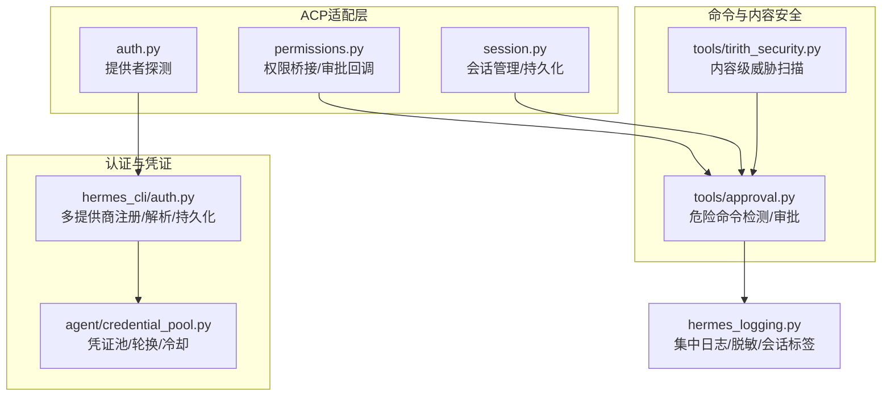
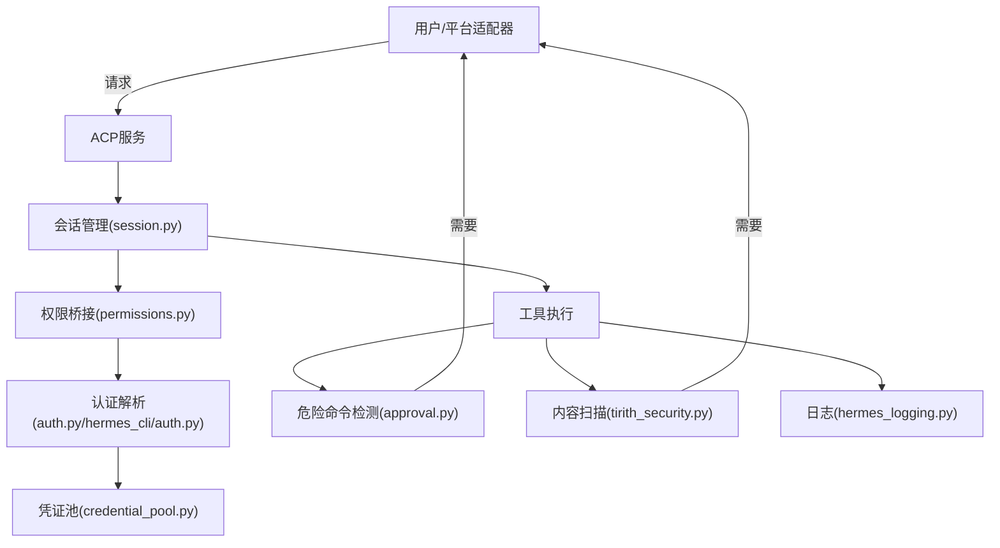
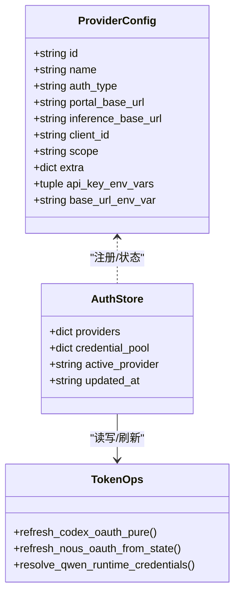
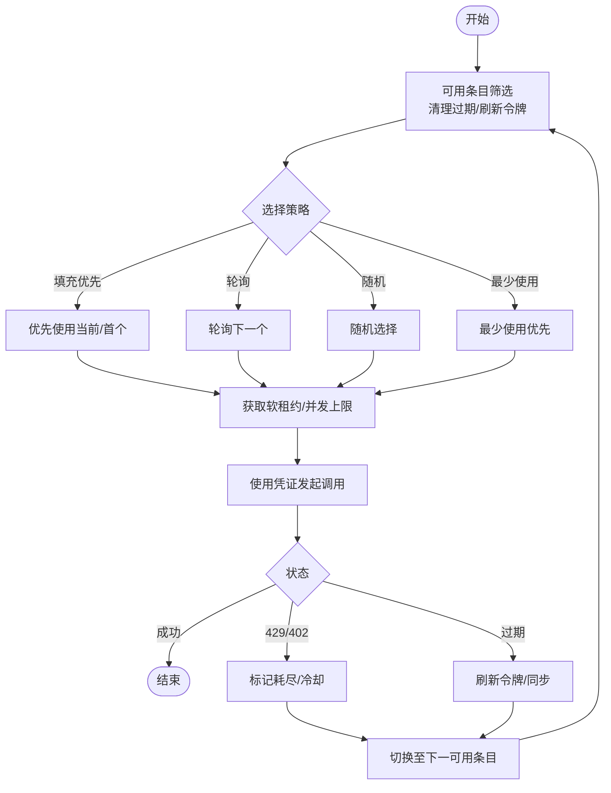
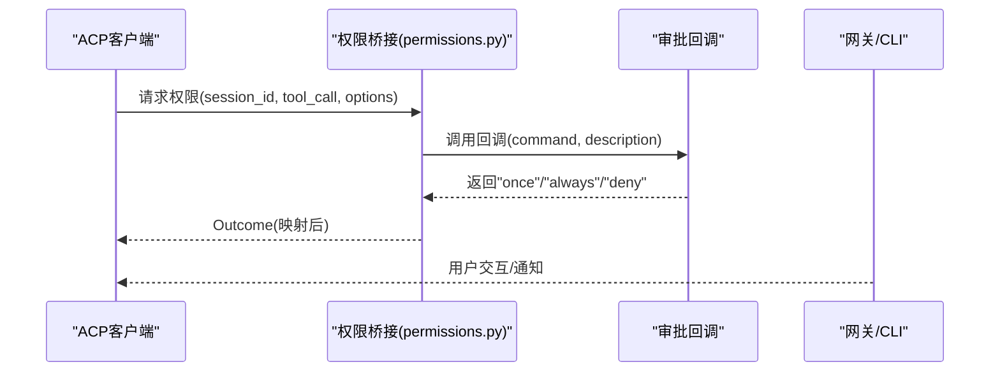
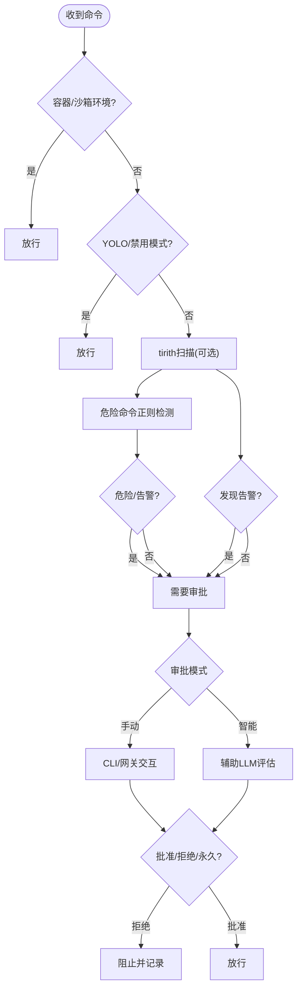
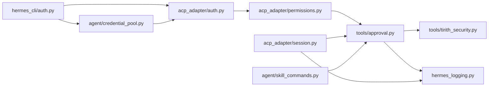

# 安全与权限

<cite>
**本文引用的文件**
- [acp_adapter/auth.py](file://acp_adapter/auth.py)
- [acp_adapter/permissions.py](file://acp_adapter/permissions.py)
- [acp_adapter/session.py](file://acp_adapter/session.py)
- [agent/credential_pool.py](file://agent/credential_pool.py)
- [hermes_cli/auth.py](file://hermes_cli/auth.py)
- [tools/approval.py](file://tools/approval.py)
- [tools/tirith_security.py](file://tools/tirith_security.py)
- [hermes_logging.py](file://hermes_logging.py)
- [agent/skill_commands.py](file://agent/skill_commands.py)
</cite>

## 目录
1. [简介](#简介)
2. [项目结构](#项目结构)
3. [核心组件](#核心组件)
4. [架构总览](#架构总览)
5. [详细组件分析](#详细组件分析)
6. [依赖分析](#依赖分析)
7. [性能考虑](#性能考虑)
8. [故障排查指南](#故障排查指南)
9. [结论](#结论)
10. [附录](#附录)

## 简介
本文件面向Hermes Agent的安全与权限体系，系统化阐述安全架构设计原则、威胁模型与防护措施，覆盖权限控制机制、命令审批流程、访问控制策略、凭证池管理与密钥轮换、安全配置最佳实践与合规要求、安全审计与日志记录、异常检测与响应流程，并提供面向管理员与开发者的安全部署与运维指导。

## 项目结构
围绕安全与权限的关键模块分布如下：
- ACP适配层：认证探测、会话管理、权限桥接
- 凭证与认证：多提供商OAuth与API Key解析、持久化存储、轮换与同步
- 命令审批与安全扫描：危险命令检测、网关/CLI审批流、内容级威胁扫描（tirith）
- 日志与审计：集中式日志、脱敏格式化、会话上下文注入
- 技能与平台：技能命令加载与安全提示、平台适配器

**图表来源**
- [acp_adapter/auth.py:1-25](file://acp_adapter/auth.py#L1-L25)
- [acp_adapter/permissions.py:1-78](file://acp_adapter/permissions.py#L1-L78)
- [acp_adapter/session.py:1-476](file://acp_adapter/session.py#L1-L476)
- [hermes_cli/auth.py:1-3258](file://hermes_cli/auth.py#L1-L3258)
- [agent/credential_pool.py:1-1357](file://agent/credential_pool.py#L1-L1357)
- [tools/approval.py:1-924](file://tools/approval.py#L1-L924)
- [tools/tirith_security.py:1-671](file://tools/tirith_security.py#L1-L671)
- [hermes_logging.py:1-395](file://hermes_logging.py#L1-L395)

**章节来源**
- [acp_adapter/auth.py:1-25](file://acp_adapter/auth.py#L1-L25)
- [acp_adapter/permissions.py:1-78](file://acp_adapter/permissions.py#L1-L78)
- [acp_adapter/session.py:1-476](file://acp_adapter/session.py#L1-L476)
- [hermes_cli/auth.py:1-3258](file://hermes_cli/auth.py#L1-L3258)
- [agent/credential_pool.py:1-1357](file://agent/credential_pool.py#L1-L1357)
- [tools/approval.py:1-924](file://tools/approval.py#L1-L924)
- [tools/tirith_security.py:1-671](file://tools/tirith_security.py#L1-L671)
- [hermes_logging.py:1-395](file://hermes_logging.py#L1-L395)

## 核心组件
- 提供者与认证解析：支持OAuth设备码、外部OAuth与API Key多提供商，跨进程文件锁保护凭据存储，动态端点探测与缓存。
- 凭证池：多凭证并行与失败转移、冷却与刷新策略、持久化与并发租约。
- 权限与会话：ACP会话到Agent实例映射、持久化会话数据库、工作目录隔离与工具环境覆盖。
- 命令审批：正则危险模式匹配、会话/永久白名单、智能审批（辅助LLM）、网关异步审批队列。
- 内容安全扫描：tirith自动安装与校验、超时与失败开路策略、发现上限与摘要截断。
- 日志与审计：统一日志、脱敏格式化、按组件路由、会话上下文标签、受控轮转与共享权限。

**章节来源**
- [hermes_cli/auth.py:1-3258](file://hermes_cli/auth.py#L1-L3258)
- [agent/credential_pool.py:1-1357](file://agent/credential_pool.py#L1-L1357)
- [acp_adapter/session.py:1-476](file://acp_adapter/session.py#L1-L476)
- [tools/approval.py:1-924](file://tools/approval.py#L1-L924)
- [tools/tirith_security.py:1-671](file://tools/tirith_security.py#L1-L671)
- [hermes_logging.py:1-395](file://hermes_logging.py#L1-L395)

## 架构总览
Hermes Agent的安全架构以“最小权限+多重防护”为核心：
- 认证层：统一提供者注册与解析，优先使用持久化凭据；对OAuth令牌进行单次/轮换与跨进程同步。
- 授权层：ACP会话持久化与恢复，命令执行前的危险与内容级双重检查，必要时触发用户审批。
- 防护层：凭证池冷却与轮转、TLS验证与可选不安全模式、日志脱敏与会话追踪。
- 审计层：集中日志、组件分离、错误聚焦、会话标签，便于回溯与合规审计。

**图表来源**
- [acp_adapter/session.py:1-476](file://acp_adapter/session.py#L1-L476)
- [acp_adapter/permissions.py:1-78](file://acp_adapter/permissions.py#L1-L78)
- [acp_adapter/auth.py:1-25](file://acp_adapter/auth.py#L1-L25)
- [hermes_cli/auth.py:1-3258](file://hermes_cli/auth.py#L1-L3258)
- [agent/credential_pool.py:1-1357](file://agent/credential_pool.py#L1-L1357)
- [tools/approval.py:1-924](file://tools/approval.py#L1-L924)
- [tools/tirith_security.py:1-671](file://tools/tirith_security.py#L1-L671)
- [hermes_logging.py:1-395](file://hermes_logging.py#L1-L395)

## 详细组件分析

### 组件A：认证与提供者解析（hermes_cli/auth.py）
- 多提供商注册与解析：定义OAuth与API Key提供商，支持环境变量与自定义端点，提供解析优先级链。
- 持久化存储：auth.json跨进程文件锁，版本化结构，提供者状态与凭证池分离。
- OAuth令牌管理：Codex/Qwen/Nous等令牌刷新、迁移与写回，避免刷新冲突。
- 端点探测与缓存：如Z.AI多端点探测结果缓存，减少重复探测成本。
- 安全增强：令牌指纹化用于遥测而不泄露字节；TLS验证可配置，支持CA Bundle与不安全模式。

**图表来源**
- [hermes_cli/auth.py:85-261](file://hermes_cli/auth.py#L85-L261)
- [hermes_cli/auth.py:704-779](file://hermes_cli/auth.py#L704-L779)
- [hermes_cli/auth.py:1363-1477](file://hermes_cli/auth.py#L1363-L1477)
- [hermes_cli/auth.py:1189-1218](file://hermes_cli/auth.py#L1189-L1218)

**章节来源**
- [hermes_cli/auth.py:1-3258](file://hermes_cli/auth.py#L1-L3258)

### 组件B：凭证池与密钥轮换（agent/credential_pool.py）
- 数据结构：PooledCredential承载令牌、过期、重试时间与额外元数据；支持自定义端点池键。
- 选择策略：填充优先、轮询、随机、最少使用；并发租约限制每凭证最大并发。
- 冷却与刷新：基于HTTP状态与重置时间计算冷却时长；OAuth令牌在过期前刷新；跨进程同步（如Codex/Claude）。
- 持久化：auth.json中独立credential_pool字段，线程安全写入与排序保持。

**图表来源**
- [agent/credential_pool.py:358-1004](file://agent/credential_pool.py#L358-L1004)
- [agent/credential_pool.py:823-882](file://agent/credential_pool.py#L823-L882)

**章节来源**
- [agent/credential_pool.py:1-1357](file://agent/credential_pool.py#L1-L1357)

### 组件C：ACP会话与权限（acp_adapter/session.py, permissions.py）
- 会话管理：内存+数据库双层存储，支持创建、fork、恢复、更新工作目录、清理；任务工作目录覆盖与清理。
- 权限桥接：将ACP权限请求映射为Hermes审批结果字符串，超时自动拒绝，支持会话级选项映射。
- ACP stdio输出重定向：确保协议帧与人类可读输出分离，避免污染stdout。

**图表来源**
- [acp_adapter/permissions.py:26-78](file://acp_adapter/permissions.py#L26-L78)
- [acp_adapter/session.py:70-164](file://acp_adapter/session.py#L70-L164)

**章节来源**
- [acp_adapter/session.py:1-476](file://acp_adapter/session.py#L1-L476)
- [acp_adapter/permissions.py:1-78](file://acp_adapter/permissions.py#L1-L78)

### 组件D：命令审批与内容安全（tools/approval.py, tools/tirith_security.py）
- 危险命令检测：正则模式覆盖删除、权限修改、系统服务、脚本执行、Git破坏性操作等；敏感路径覆盖（/etc、/dev/sd、~/.ssh、~/.hermes/.env）。
- 审批流：CLI同步输入、网关异步队列；会话级与永久白名单；YOLO模式绕过；智能审批（辅助LLM）。
- 内容安全扫描：tirith自动下载与校验（SHA-256与cosign可选），超时/失败开路，发现上限与摘要长度限制。

**图表来源**
- [tools/approval.py:181-193](file://tools/approval.py#L181-L193)
- [tools/approval.py:583-657](file://tools/approval.py#L583-L657)
- [tools/tirith_security.py:600-604](file://tools/tirith_security.py#L600-L604)

**章节来源**
- [tools/approval.py:1-924](file://tools/approval.py#L1-L924)
- [tools/tirith_security.py:1-671](file://tools/tirith_security.py#L1-L671)

### 组件E：日志与审计（hermes_logging.py）
- 统一入口：setup_logging集中初始化，支持CLI/Gateway/Cron三模式。
- 脱敏格式化：RedactingFormatter避免敏感信息落盘。
- 组件分离：gateway.log仅接收网关组件日志，agent.log为主通道。
- 会话标签：通过LogRecord工厂注入session_tag，便于关联会话与审计。
- 受控轮转：大小与备份数可配置，受管模式下设置组可读写权限。

**章节来源**
- [hermes_logging.py:1-395](file://hermes_logging.py#L1-L395)

### 组件F：技能与平台（agent/skill_commands.py）
- 技能命令加载：从本地与外部目录扫描SKILL.md，构建/校验命令键，注入配置与支持文件列表。
- 平台适配：过滤不兼容平台，尊重禁用列表，生成运行时提示与视图工具链接。

**章节来源**
- [agent/skill_commands.py:1-369](file://agent/skill_commands.py#L1-L369)

## 依赖分析
- 认证与凭证：hermes_cli/auth.py依赖环境变量与配置，agent/credential_pool.py依赖认证解析结果与持久化接口。
- 会话与权限：acp_adapter/session.py依赖会话数据库与Agent工厂；permissions.py依赖ACP客户端与事件循环。
- 命令审批：tools/approval.py依赖会话上下文、配置与辅助LLM客户端；tirith_security.py依赖外部二进制与配置。
- 日志：各模块通过统一入口接入，避免分散配置。

**图表来源**
- [hermes_cli/auth.py:1-3258](file://hermes_cli/auth.py#L1-L3258)
- [agent/credential_pool.py:1-1357](file://agent/credential_pool.py#L1-L1357)
- [acp_adapter/auth.py:1-25](file://acp_adapter/auth.py#L1-L25)
- [acp_adapter/permissions.py:1-78](file://acp_adapter/permissions.py#L1-L78)
- [acp_adapter/session.py:1-476](file://acp_adapter/session.py#L1-L476)
- [tools/approval.py:1-924](file://tools/approval.py#L1-L924)
- [tools/tirith_security.py:1-671](file://tools/tirith_security.py#L1-L671)
- [hermes_logging.py:1-395](file://hermes_logging.py#L1-L395)
- [agent/skill_commands.py:1-369](file://agent/skill_commands.py#L1-L369)

**章节来源**
- [hermes_cli/auth.py:1-3258](file://hermes_cli/auth.py#L1-L3258)
- [agent/credential_pool.py:1-1357](file://agent/credential_pool.py#L1-L1357)
- [acp_adapter/session.py:1-476](file://acp_adapter/session.py#L1-L476)
- [tools/approval.py:1-924](file://tools/approval.py#L1-L924)
- [tools/tirith_security.py:1-671](file://tools/tirith_security.py#L1-L671)
- [hermes_logging.py:1-395](file://hermes_logging.py#L1-L395)
- [agent/skill_commands.py:1-369](file://agent/skill_commands.py#L1-L369)

## 性能考虑
- 凭证池选择策略：轮询/最少使用适合高并发场景；随机策略降低热点；填充优先提升命中率。
- 刷新与冷却：过期前刷新减少失败重试；冷却时间基于HTTP状态与提供方重置时间，避免雪崩。
- 日志轮转：合理设置大小与备份数，避免磁盘压力；脱敏格式化不影响性能。
- 扫描超时：tirith默认超时与失败开路策略，保证命令执行不阻塞。
- 会话持久化：数据库写入批量合并消息，减少IO次数。

[本节为通用建议，无需特定文件引用]

## 故障排查指南
- 凭证无法刷新/被占用
  - 现象：Codex刷新返回“refresh_token_reused”或Nou令牌未更新。
  - 排查：确认是否被其他客户端（CLI/VS Code扩展）消费；检查auth.json与外部CLI文件同步；查看刷新日志。
  - 参考
    - [hermes_cli/auth.py:1363-1477](file://hermes_cli/auth.py#L1363-L1477)
    - [agent/credential_pool.py:547-741](file://agent/credential_pool.py#L547-L741)
- 审批超时/挂起
  - 现象：网关审批队列阻塞或超时。
  - 排查：检查会话键一致性、通知回调是否注册、是否有未决请求；确认审批模式与超时配置。
  - 参考
    - [tools/approval.py:224-280](file://tools/approval.py#L224-L280)
    - [tools/approval.py:517-529](file://tools/approval.py#L517-L529)
- 日志缺失/脱敏问题
  - 现象：日志未落盘或包含敏感信息。
  - 排查：确认setup_logging已调用且格式化器正确；检查会话上下文是否注入；核对组件过滤。
  - 参考
    - [hermes_logging.py:161-265](file://hermes_logging.py#L161-L265)
    - [hermes_logging.py:95-124](file://hermes_logging.py#L95-L124)
- ACP会话异常
  - 现象：重启后会话丢失或历史不完整。
  - 排查：检查SessionDB路径与权限；确认持久化消息写入；核对cwd与模型配置同步。
  - 参考
    - [acp_adapter/session.py:251-332](file://acp_adapter/session.py#L251-L332)
    - [acp_adapter/session.py:333-405](file://acp_adapter/session.py#L333-L405)

**章节来源**
- [hermes_cli/auth.py:1363-1477](file://hermes_cli/auth.py#L1363-L1477)
- [agent/credential_pool.py:547-741](file://agent/credential_pool.py#L547-L741)
- [tools/approval.py:224-280](file://tools/approval.py#L224-L280)
- [tools/approval.py:517-529](file://tools/approval.py#L517-L529)
- [hermes_logging.py:161-265](file://hermes_logging.py#L161-L265)
- [hermes_logging.py:95-124](file://hermes_logging.py#L95-L124)
- [acp_adapter/session.py:251-405](file://acp_adapter/session.py#L251-L405)

## 结论
Hermes Agent的安全与权限体系通过“认证统一、凭证池化、会话持久、命令双检、日志脱敏”的设计，实现了对多提供商、多后端、多平台场景下的安全控制与可观测性。建议在生产环境中启用智能审批、严格日志策略与定期审计，结合合规要求完善访问控制与事件响应流程。

[本节为总结，无需特定文件引用]

## 附录

### 安全配置最佳实践
- 凭证管理
  - 使用凭证池并配置冷却与刷新策略；避免将API Key硬编码于代码；优先使用OAuth设备码。
  - 参考
    - [agent/credential_pool.py:358-882](file://agent/credential_pool.py#L358-L882)
    - [hermes_cli/auth.py:704-779](file://hermes_cli/auth.py#L704-L779)
- 审批与白名单
  - 启用智能审批模式；谨慎使用永久允许；YOLO仅限受控场景。
  - 参考
    - [tools/approval.py:517-529](file://tools/approval.py#L517-L529)
    - [tools/approval.py:373-400](file://tools/approval.py#L373-L400)
- 日志与审计
  - 开启集中日志与脱敏；按组件分离；设置会话标签；定期轮转与归档。
  - 参考
    - [hermes_logging.py:161-265](file://hermes_logging.py#L161-L265)
- 内容安全
  - 启用tirith扫描并设置超时与失败开路；限制发现数量与摘要长度。
  - 参考
    - [tools/tirith_security.py:68-87](file://tools/tirith_security.py#L68-L87)
    - [tools/tirith_security.py:600-604](file://tools/tirith_security.py#L600-L604)

### 合规与响应
- 合规要点
  - 凭证存储最小化暴露；TLS验证默认开启；日志脱敏；会话可追溯。
- 安全事件响应
  - 快速定位会话与命令轨迹；冻结受影响凭证；审查审批决策；复盘并调整策略。
- 参考
  - [hermes_logging.py:161-265](file://hermes_logging.py#L161-L265)
  - [tools/approval.py:583-657](file://tools/approval.py#L583-L657)