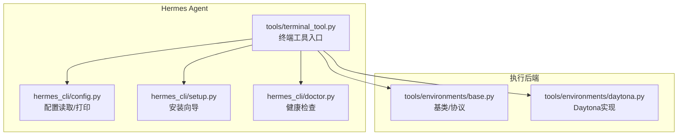
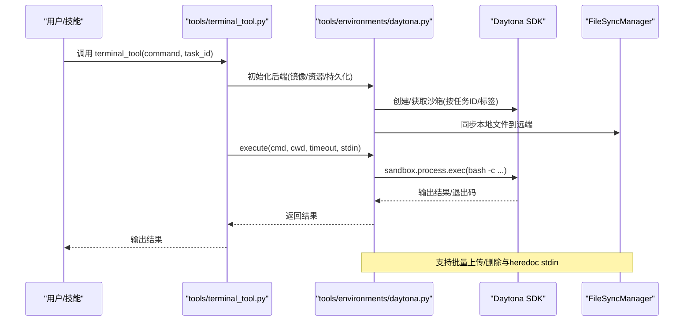
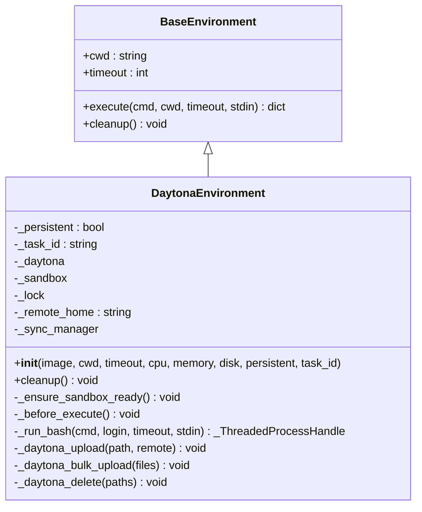
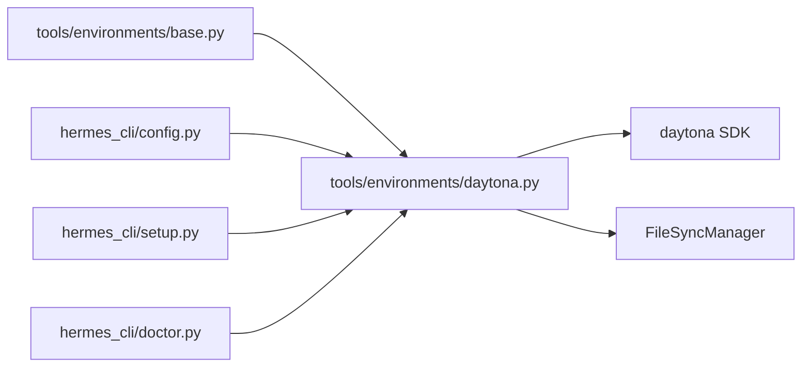

# Daytona云执行

<cite>
**本文引用的文件**
- [tools/environments/daytona.py](file://tools/environments/daytona.py)
- [tests/tools/test_daytona_environment.py](file://tests/tools/test_daytona_environment.py)
- [tests/integration/test_daytona_terminal.py](file://tests/integration/test_daytona_terminal.py)
- [cli-config.yaml.example](file://cli-config.yaml.example)
- [hermes_cli/config.py](file://hermes_cli/config.py)
- [hermes_cli/setup.py](file://hermes_cli/setup.py)
- [hermes_cli/doctor.py](file://hermes_cli/doctor.py)
- [tools/environments/base.py](file://tools/environments/base.py)
- [tools/terminal_tool.py](file://tools/terminal_tool.py)
- [README.md](file://README.md)
</cite>

## 目录
1. [简介](#简介)
2. [项目结构](#项目结构)
3. [核心组件](#核心组件)
4. [架构总览](#架构总览)
5. [详细组件分析](#详细组件分析)
6. [依赖分析](#依赖分析)
7. [性能考虑](#性能考虑)
8. [故障排除指南](#故障排除指南)
9. [结论](#结论)
10. [附录](#附录)

## 简介
本文件面向Hermes Agent在Daytona云执行环境中的使用与集成，系统性阐述以下内容：
- Daytona工作区创建、容器实例管理与开发环境配置
- 文件同步机制、持久化策略与会话生命周期
- 实时协作与版本控制集成（通过文件同步与任务标签）
- 自动化构建流程（通过终端工具与任务ID隔离）
- 执行配置项（镜像、CPU/内存/磁盘、持久化、超时等）
- 性能特征、成本控制与资源优化建议
- 与Hermes Agent的集成方式、数据同步与状态保持
- 使用指南、故障排除与最佳实践

Daytona后端为Hermes Agent提供了“沙箱即服务”的能力：命令在Daytona提供的云端沙箱中运行，支持持久化工作区、按需停止与恢复，适合团队协作、持续开发与自动化流水线。

章节来源
- [README.md:14](file://README.md#L14)
- [README.md:24](file://README.md#L24)

## 项目结构
与Daytona云执行相关的核心文件与职责如下：
- tools/environments/daytona.py：Daytona执行环境实现，封装沙箱生命周期、文件同步与命令执行
- tests/tools/test_daytona_environment.py：单元测试，覆盖构造、持久化、清理、执行、中断与资源转换
- tests/integration/test_daytona_terminal.py：集成测试，验证命令执行、文件系统持久化与任务隔离
- cli-config.yaml.example：示例配置，展示Daytona后端的配置键与默认值
- hermes_cli/config.py：配置打印与读取逻辑，包含Daytona相关键
- hermes_cli/setup.py：安装向导，引导用户安装Daytona SDK、配置API Key与镜像
- hermes_cli/doctor.py：健康检查，验证Daytona SDK与API Key可用性
- tools/environments/base.py：所有执行后端的基类与通用协议（如_process_handle）
- tools/terminal_tool.py：终端工具入口，负责选择并初始化具体后端（含Daytona）

图表来源
- [tools/terminal_tool.py:1665](file://tools/terminal_tool.py#L1665-L1695)
- [hermes_cli/config.py:2732](file://hermes_cli/config.py#L2732-L2735)
- [hermes_cli/setup.py:1340](file://hermes_cli/setup.py#L1340-L1378)
- [hermes_cli/doctor.py:584](file://hermes_cli/doctor.py#L584-L597)
- [tools/environments/base.py:1-200](file://tools/environments/base.py#L1-L200)
- [tools/environments/daytona.py:1-230](file://tools/environments/daytona.py#L1-L230)

章节来源
- [tools/terminal_tool.py:1665](file://tools/terminal_tool.py#L1665-L1695)
- [cli-config.yaml.example:200-223](file://cli-config.yaml.example#L200-L223)

## 核心组件
- DaytonaEnvironment：Daytona执行后端实现，负责：
  - 解析并转换资源参数（CPU/内存/磁盘），限制磁盘上限
  - 基于任务ID查找/创建沙箱，支持持久化与回退到旧版沙箱
  - 检测远程家目录并解析工作目录
  - 初始化FileSyncManager，进行文件同步（上传/批量上传/删除）
  - 执行命令（带heredoc stdin）、中断处理（调用沙箱stop）、生命周期管理（启动/停止/删除）
- BaseEnvironment与_process_handle：统一的后端抽象与进程句柄适配器，屏蔽不同后端的差异
- 配置与安装：通过配置文件与安装向导设置镜像、资源、API Key；doctor进行健康检查

章节来源
- [tools/environments/daytona.py:29-230](file://tools/environments/daytona.py#L29-L230)
- [tools/environments/base.py:125-200](file://tools/environments/base.py#L125-L200)
- [hermes_cli/config.py:2732](file://hermes_cli/config.py#L2732-L2735)
- [hermes_cli/setup.py:1340](file://hermes_cli/setup.py#L1340-L1378)
- [hermes_cli/doctor.py:584](file://hermes_cli/doctor.py#L584-L597)

## 架构总览
下图展示了Hermes Agent通过终端工具选择Daytona后端，并与Daytona SDK交互完成沙箱生命周期管理与命令执行的整体流程。

图表来源
- [tools/terminal_tool.py:1665](file://tools/terminal_tool.py#L1665-L1695)
- [tools/environments/daytona.py:107-138](file://tools/environments/daytona.py#L107-L138)
- [tools/environments/daytona.py:184-213](file://tools/environments/daytona.py#L184-L213)

## 详细组件分析

### DaytonaEnvironment 类
- 资源与命名
  - 将内存与磁盘从MB转换为GiB，并对磁盘做平台上限约束
  - 使用“hermes-”前缀加任务ID作为沙箱名称，便于识别与回收
- 沙箱发现与恢复
  - 优先按名称精确获取沙箱并启动
  - 若失败则按标签回退到旧版沙箱列表
  - 两者均失败则创建新沙箱
- 远程环境探测
  - 通过执行命令探测$HOME，动态调整cwd
- 文件同步
  - 通过FileSyncManager与SDK文件系统接口进行单文件上传、批量上传与删除
  - 批量上传使用multipart POST，显著降低HTTP/TLS开销
- 命令执行与中断
  - 包装为阻塞SDK调用，返回适配器化的_process_handle
  - 中断时调用沙箱stop，避免僵尸进程
- 生命周期
  - 清理阶段：持久化模式下仅停止，否则直接删除

图表来源
- [tools/environments/base.py:125-200](file://tools/environments/base.py#L125-L200)
- [tools/environments/daytona.py:29-230](file://tools/environments/daytona.py#L29-L230)

章节来源
- [tools/environments/daytona.py:39-138](file://tools/environments/daytona.py#L39-L138)
- [tools/environments/daytona.py:141-171](file://tools/environments/daytona.py#L141-L171)
- [tools/environments/daytona.py:177-230](file://tools/environments/daytona.py#L177-L230)

### 单元测试要点（test_daytona_environment）
- 构造与cwd解析：$HOME检测失败或为空时保留默认cwd
- 持久化：按名称获取成功则直接start；未找到则按标签回退；两者都失败则创建新沙箱
- 清理：持久化模式stop，非持久化模式delete
- 执行：SDK原生timeout透传；非零退出码正确返回；stdin通过heredoc包装
- 中断：触发is_interrupted后调用stop，返回130
- 资源转换：内存/磁盘向下取整为1GiB最小单位，磁盘超过上限被截断

章节来源
- [tests/tools/test_daytona_environment.py:116-138](file://tests/tools/test_daytona_environment.py#L116-L138)
- [tests/tools/test_daytona_environment.py:144-186](file://tests/tools/test_daytona_environment.py#L144-L186)
- [tests/tools/test_daytona_environment.py:192-214](file://tests/tools/test_daytona_environment.py#L192-L214)
- [tests/tools/test_daytona_environment.py:221-320](file://tests/tools/test_daytona_environment.py#L221-L320)
- [tests/tools/test_daytona_environment.py:365-395](file://tests/tools/test_daytona_environment.py#L365-L395)
- [tests/tools/test_daytona_environment.py:342-359](file://tests/tools/test_daytona_environment.py#L342-L359)

### 集成测试要点（test_daytona_terminal）
- 基础命令：echo、python版本、非零退出码
- 文件系统：临时文件读写、包安装后复用
- 持久化：停止沙箱后重启仍可读取之前写入的文件
- 隔离：不同任务ID之间文件不可见

章节来源
- [tests/integration/test_daytona_terminal.py:56-124](file://tests/integration/test_daytona_terminal.py#L56-L124)

### 配置与安装
- 示例配置键
  - backend: "daytona"
  - cwd: "~"
  - timeout: 180
  - lifetime_seconds: 300
  - daytona_image: "镜像名"
  - container_disk: 10240（Daytona平台限制为10GB）
- 安装向导
  - 自动安装daytona SDK
  - 引导配置DAYTONA_API_KEY
  - 设置TERMINAL_DAYTONA_IMAGE
  - 提示容器资源配置
- 健康检查
  - 检查SDK是否可导入
  - 检查DAYTONA_API_KEY是否设置

章节来源
- [cli-config.yaml.example:200-223](file://cli-config.yaml.example#L200-L223)
- [hermes_cli/setup.py:1340-1378](file://hermes_cli/setup.py#L1340-L1378)
- [hermes_cli/doctor.py:584-597](file://hermes_cli/doctor.py#L584-L597)

## 依赖分析
- 组件耦合
  - DaytonaEnvironment继承BaseEnvironment，遵循统一协议，便于替换其他后端
  - 通过FileSyncManager与SDK文件系统交互，解耦文件同步细节
- 外部依赖
  - daytona SDK：用于沙箱创建、获取、启动、停止与文件上传
  - hermes_cli：配置、安装向导与健康检查
- 可能的循环依赖
  - 当前结构清晰，无明显循环导入

图表来源
- [tools/environments/base.py:1-200](file://tools/environments/base.py#L1-L200)
- [tools/environments/daytona.py:1-230](file://tools/environments/daytona.py#L1-L230)
- [hermes_cli/config.py:2732](file://hermes_cli/config.py#L2732-L2735)
- [hermes_cli/setup.py:1340](file://hermes_cli/setup.py#L1340-L1378)
- [hermes_cli/doctor.py:584](file://hermes_cli/doctor.py#L584-L597)

章节来源
- [tools/environments/daytona.py:53-64](file://tools/environments/daytona.py#L53-L64)
- [tools/environments/base.py:125-200](file://tools/environments/base.py#L125-L200)

## 性能考虑
- 文件同步优化
  - 批量上传使用multipart POST，减少HTTP/TLS开销
  - 仅对必要父目录执行mkdir，避免重复创建
- 资源限制
  - 内存/磁盘按GiB向上取整，磁盘上限10GB
  - 通过任务ID与标签实现沙箱复用，减少冷启动时间
- 超时与中断
  - SDK原生timeout透传，避免shell层timeout叠加
  - 中断直接调用stop，快速释放资源
- 成本控制
  - 持久化模式在空闲时停止，降低占用
  - 通过限制磁盘大小与合理CPU/内存配置控制成本

章节来源
- [tools/environments/daytona.py:147-167](file://tools/environments/daytona.py#L147-L167)
- [tools/environments/daytona.py:68-76](file://tools/environments/daytona.py#L68-L76)
- [tools/environments/daytona.py:197-213](file://tools/environments/daytona.py#L197-L213)

## 故障排除指南
- 缺少Daytona SDK
  - 现象：健康检查失败
  - 处理：运行安装向导或手动pip install daytona
- 未设置DAYTONA_API_KEY
  - 现象：健康检查失败
  - 处理：在环境变量中配置DAYTONA_API_KEY
- 磁盘超出限制
  - 现象：日志警告磁盘被截断至10GB
  - 处理：调整container_disk至≤10240MB
- 沙箱无法恢复
  - 现象：按名称/标签均未找到沙箱
  - 处理：允许自动创建新沙箱；检查任务ID与标签一致性
- 批量上传缓慢
  - 现象：大量小文件上传耗时长
  - 处理：使用批量上传接口；合并小文件或减少文件数量

章节来源
- [hermes_cli/doctor.py:584-597](file://hermes_cli/doctor.py#L584-L597)
- [tools/environments/daytona.py:70-75](file://tools/environments/daytona.py#L70-L75)
- [tools/environments/daytona.py:81-105](file://tools/environments/daytona.py#L81-L105)
- [tools/environments/daytona.py:147-167](file://tools/environments/daytona.py#L147-L167)

## 结论
Daytona云执行为Hermes Agent提供了稳定、可扩展且具备持久化能力的云端开发环境。通过统一的后端抽象与文件同步机制，Daytona后端在保证隔离与安全的同时，兼顾了性能与成本控制。结合配置向导与健康检查，用户可以快速完成环境搭建与日常运维。

## 附录

### 使用指南
- 安装与配置
  - 运行安装向导，自动安装SDK并引导配置API Key与镜像
  - 在配置文件中设置backend为"daytona"，并指定daytona_image
- 执行命令
  - 通过terminal_tool传入command与task_id，即可在Daytona沙箱中执行
  - 支持cwd、timeout、stdin等参数
- 持久化与清理
  - 开启container_persistent后，沙箱停止但文件系统保留
  - 关闭后端会删除沙箱，避免资源泄露

章节来源
- [hermes_cli/setup.py:1340-1378](file://hermes_cli/setup.py#L1340-L1378)
- [cli-config.yaml.example:200-223](file://cli-config.yaml.example#L200-L223)
- [tools/terminal_tool.py:1665](file://tools/terminal_tool.py#L1665-L1695)

### 最佳实践
- 任务隔离
  - 为每个任务分配唯一task_id，确保沙箱与文件互不干扰
- 资源规划
  - 根据任务类型设置合理的CPU/内存/磁盘，避免过度配置
  - 对大文件操作使用批量上传，减少HTTP往返
- 持久化策略
  - 长时间任务启用持久化，短任务关闭持久化以降低成本
- 版本控制与同步
  - 将项目代码与配置纳入版本控制，利用FileSyncManager同步关键文件
- 监控与告警
  - 通过doctor定期检查SDK与API Key状态，及时发现异常

章节来源
- [tests/integration/test_daytona_terminal.py:114-124](file://tests/integration/test_daytona_terminal.py#L114-L124)
- [tools/environments/daytona.py:147-167](file://tools/environments/daytona.py#L147-L167)