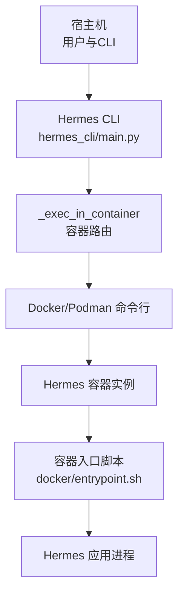
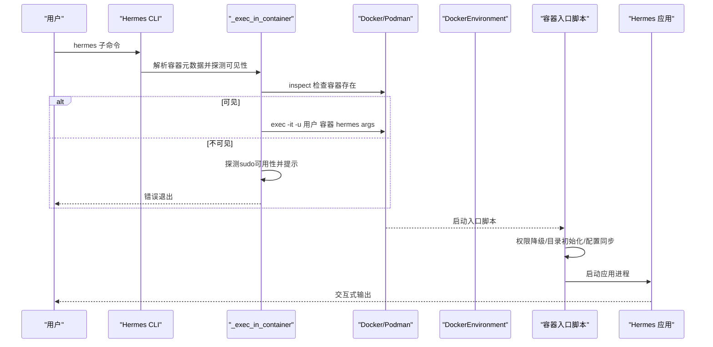
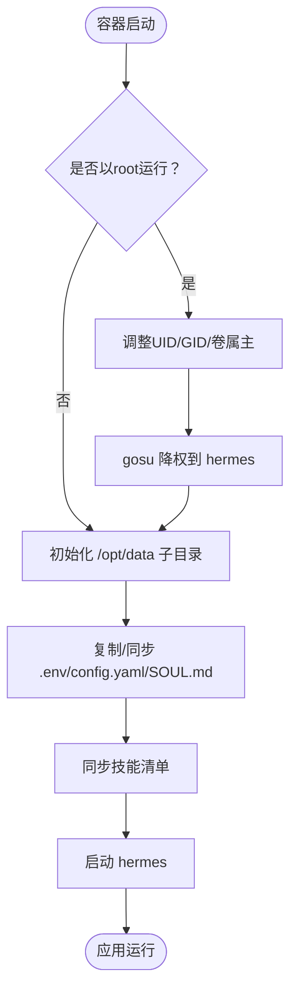
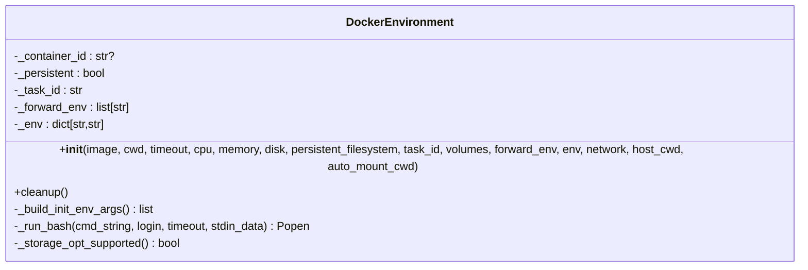
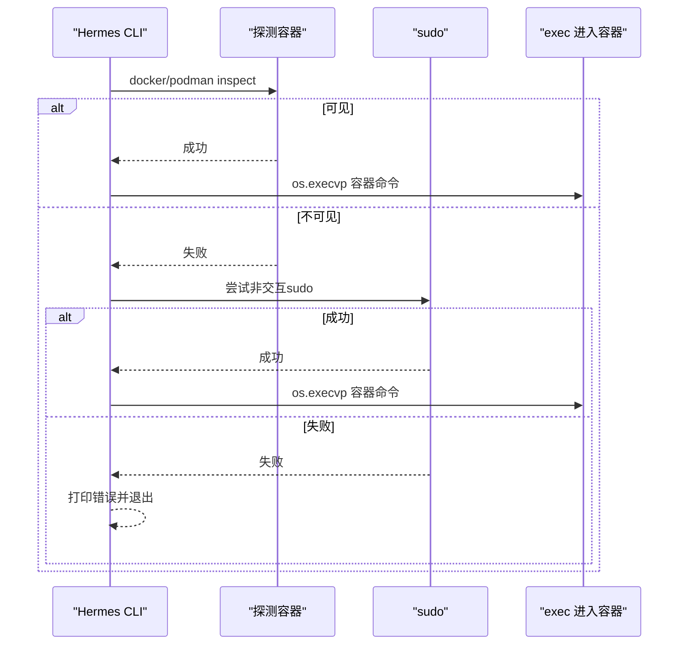
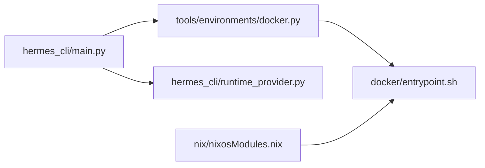
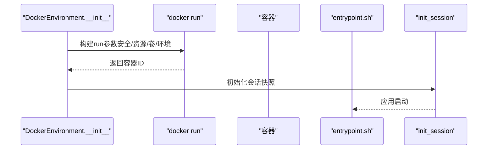

# Docker容器执行

<cite>
**本文引用的文件**
- [Dockerfile](file://Dockerfile)
- [.dockerignore](file://.dockerignore)
- [docker/entrypoint.sh](file://docker/entrypoint.sh)
- [docker/SOUL.md](file://docker/SOUL.md)
- [tools/environments/docker.py](file://tools/environments/docker.py)
- [hermes_cli/main.py](file://hermes_cli/main.py)
- [hermes_cli/runtime_provider.py](file://hermes_cli/runtime_provider.py)
- [hermes_cli/setup.py](file://hermes_cli/setup.py)
- [nix/nixosModules.nix](file://nix/nixosModules.nix)
- [tools/credential_files.py](file://tools/credential_files.py)
- [docs/specs/container-cli-review-fixes.md](file://docs/specs/container-cli-review-fixes.md)
- [optional-skills/devops/docker-management/SKILL.md](file://optional-skills/devops/docker-management/SKILL.md)
</cite>

## 目录
1. [简介](#简介)
2. [项目结构](#项目结构)
3. [核心组件](#核心组件)
4. [架构总览](#架构总览)
5. [详细组件分析](#详细组件分析)
6. [依赖关系分析](#依赖关系分析)
7. [性能考量](#性能考量)
8. [故障排查指南](#故障排查指南)
9. [结论](#结论)
10. [附录](#附录)

## 简介
本文件面向Hermes Agent的Docker容器执行环境，系统性阐述容器后端架构、容器管理与隔离机制、启动流程、镜像构建与运行时配置、网络与卷挂载、环境变量传递、资源限制与健康检查、安全最佳实践、数据持久化与日志管理、编排与监控、故障恢复策略，以及性能优化与调试技巧。文档以仓库中实际实现为依据，辅以图示帮助读者快速理解从宿主到容器的完整执行链路。

## 项目结构
围绕Docker容器执行的关键目录与文件如下：
- 镜像构建与入口：Dockerfile、docker/entrypoint.sh、.dockerignore
- 容器后端实现：tools/environments/docker.py（DockerEnvironment类）
- 容器CLI路由与交互：hermes_cli/main.py（_exec_in_container等）
- 运行时提供者解析：hermes_cli/runtime_provider.py
- 容器资源设置：hermes_cli/setup.py
- NixOS容器集成：nix/nixosModules.nix
- 凭据与挂载安全：tools/credential_files.py
- 规范与测试参考：docs/specs/container-cli-review-fixes.md、optional-skills/devops/docker-management/SKILL.md

图表来源
- [hermes_cli/main.py:561-647](file://hermes_cli/main.py#L561-L647)
- [docker/entrypoint.sh:1-65](file://docker/entrypoint.sh#L1-L65)
- [tools/environments/docker.py:217-437](file://tools/environments/docker.py#L217-L437)

章节来源
- [Dockerfile:1-47](file://Dockerfile#L1-L47)
- [.dockerignore:1-16](file://.dockerignore#L1-L16)
- [docker/entrypoint.sh:1-65](file://docker/entrypoint.sh#L1-L65)
- [tools/environments/docker.py:217-437](file://tools/environments/docker.py#L217-L437)
- [hermes_cli/main.py:561-647](file://hermes_cli/main.py#L561-L647)

## 核心组件
- 镜像与入口
  - Dockerfile定义基础镜像、系统依赖、非root用户、Python虚拟环境、Playwright浏览器缓存路径、卷与入口点。
  - 入口脚本负责权限降级、初始化家目录与配置、同步技能清单并启动应用。
- 容器后端
  - DockerEnvironment封装容器生命周期、资源限制、卷挂载、网络控制、环境变量注入、会话快照与清理。
- CLI路由
  - _exec_in_container负责探测容器可见性、必要时通过sudo调用、透明地将当前进程替换为容器内命令。
- 运行时提供者
  - runtime_provider解析模型与推理端点，确保容器内可访问所需凭据与URL。
- 资源设置
  - setup.py提供交互式CPU/内存/磁盘与持久化开关配置。
- NixOS集成
  - nixosModules.nix在系统服务中以root模式创建容器，通过入口脚本完成UID/GID映射与权限降级。
- 安全与挂载
  - credential_files对凭据文件挂载进行路径校验，防止越权访问宿主敏感文件。

章节来源
- [Dockerfile:1-47](file://Dockerfile#L1-L47)
- [docker/entrypoint.sh:1-65](file://docker/entrypoint.sh#L1-L65)
- [tools/environments/docker.py:217-561](file://tools/environments/docker.py#L217-L561)
- [hermes_cli/main.py:561-647](file://hermes_cli/main.py#L561-L647)
- [hermes_cli/runtime_provider.py:595-800](file://hermes_cli/runtime_provider.py#L595-L800)
- [hermes_cli/setup.py:619-659](file://hermes_cli/setup.py#L619-L659)
- [nix/nixosModules.nix:74-845](file://nix/nixosModules.nix#L74-L845)
- [tools/credential_files.py:66-101](file://tools/credential_files.py#L66-L101)

## 架构总览
下图展示从宿主CLI到容器内部应用的执行路径，包括权限降级、卷挂载、环境变量注入与会话快照初始化。

图表来源
- [hermes_cli/main.py:561-647](file://hermes_cli/main.py#L561-L647)
- [docker/entrypoint.sh:1-65](file://docker/entrypoint.sh#L1-L65)
- [tools/environments/docker.py:217-437](file://tools/environments/docker.py#L217-L437)

## 详细组件分析

### 镜像与入口脚本
- 镜像层叠与依赖
  - 多阶段基础镜像、系统包安装、非root用户创建、gosu与uv工具复制、Node/Playwright预装、Python虚拟环境与可编辑安装。
  - 关键环境变量：PYTHONUNBUFFERED、PLAYWRIGHT_BROWSERS_PATH、HERMES_HOME。
- 入口脚本职责
  - 在root下检测并按需调整hermes用户UID/GID、修正卷所有权、使用gosu降权。
  - 初始化/同步配置：.env、config.yaml、SOUL.md；同步技能清单；启动应用。

图表来源
- [docker/entrypoint.sh:1-65](file://docker/entrypoint.sh#L1-L65)
- [Dockerfile:1-47](file://Dockerfile#L1-L47)

章节来源
- [Dockerfile:1-47](file://Dockerfile#L1-L47)
- [docker/entrypoint.sh:1-65](file://docker/entrypoint.sh#L1-L65)

### 容器后端：DockerEnvironment
- 安全边界
  - 默认丢弃所有能力、仅添加必要能力、禁止新特权、限制PID数量、tmpfs限制与nosuid/exec组合。
- 资源限制
  - CPU核数、内存MB、磁盘大小（仅overlay2+XFS+pquota支持）。
- 文件系统与持久化
  - 非持久模式：/workspace、/root、/home使用tmpfs；持久模式：绑定宿主目录。
  - 支持自动挂载宿主工作目录或显式用户卷。
- 卷与挂载
  - 凭据文件只读挂载、技能目录只读挂载、缓存目录只读挂载。
  - 用户自定义卷格式校验与去重。
- 环境变量
  - 显式docker_env与docker_forward_env（含白名单过滤）在容器创建时注入。
- 会话与执行
  - 容器启动后生成会话快照，后续exec复用快照环境，避免重复注入。
  - 提供登录shell与非登录shell两种bash执行模式。
- 清理策略
  - 停止容器并按持久化状态决定是否删除。

图表来源
- [tools/environments/docker.py:217-561](file://tools/environments/docker.py#L217-L561)

章节来源
- [tools/environments/docker.py:217-561](file://tools/environments/docker.py#L217-L561)

### CLI容器路由：_exec_in_container
- 可见性探测
  - 使用docker/podman inspect探测容器是否存在；若不可见，尝试sudo非交互方式；失败则提示授予sudo权限或以root运行。
- 透明替换
  - 成功后直接os.execvp进入容器命令，保持退出码语义一致。
- TTY与环境
  - 自动识别TTY并传入TERM/COLORTERM/LANG/LC_ALL；按需-u指定执行用户。

图表来源
- [hermes_cli/main.py:561-647](file://hermes_cli/main.py#L561-L647)

章节来源
- [hermes_cli/main.py:561-647](file://hermes_cli/main.py#L561-L647)

### 运行时提供者解析
- 提供者选择与API模式
  - 根据配置与环境变量解析推理提供者、API模式与端点URL，支持Anthropic Messages、OpenAI Codex Responses等。
- 凭据池与刷新
  - 对特定提供者（如Nous）支持从凭据池选择并处理过期令牌刷新。
- 本地模型检测
  - 当仅加载一个模型时自动检测并填充默认模型名。

章节来源
- [hermes_cli/runtime_provider.py:595-800](file://hermes_cli/runtime_provider.py#L595-L800)

### 容器资源设置与持久化
- 交互式配置
  - 提供CPU、内存、磁盘与持久化开关的问答式设置，写入配置。
- 默认值与约束
  - 默认持久化开启；CPU/内存/磁盘输入类型转换失败时保留原值。

章节来源
- [hermes_cli/setup.py:619-659](file://hermes_cli/setup.py#L619-L659)

### NixOS容器集成
- 容器创建与入口
  - 以root在容器内创建入口脚本，首次启动完成hermes用户与sudo配置后降权。
  - 通过环境变量传递HERMES_UID/GID、HOME、HERMES_HOME等。
- 稳定符号链接与GC根
  - 维护指向store路径的稳定链接，并建立GC根防止清理。
- 差分重建
  - 通过身份文件判断配置变更并触发重建。

章节来源
- [nix/nixosModules.nix:74-845](file://nix/nixosModules.nix#L74-L845)

### 凭据与挂载安全
- 路径校验
  - 拒绝绝对路径与越界相对路径（如../），确保凭据文件位于HERMES_HOME之下。
- 只读挂载
  - 凭据、技能与缓存目录均以只读方式挂载，降低容器对宿主写风险。

章节来源
- [tools/credential_files.py:66-101](file://tools/credential_files.py#L66-L101)

## 依赖关系分析
- CLI到后端
  - hermes_cli/main.py依赖tools/environments/docker.py中的DockerEnvironment实现容器生命周期与执行。
- 运行时提供者
  - runtime_provider.py为容器内推理提供端点与凭据，间接影响容器网络与凭据挂载策略。
- NixOS模块
  - nix/nixosModules.nix与容器入口脚本配合，确保在系统服务中以root模式创建容器并完成降权。

图表来源
- [hermes_cli/main.py:561-647](file://hermes_cli/main.py#L561-L647)
- [tools/environments/docker.py:217-561](file://tools/environments/docker.py#L217-L561)
- [docker/entrypoint.sh:1-65](file://docker/entrypoint.sh#L1-L65)
- [hermes_cli/runtime_provider.py:595-800](file://hermes_cli/runtime_provider.py#L595-L800)
- [nix/nixosModules.nix:74-845](file://nix/nixosModules.nix#L74-L845)

章节来源
- [hermes_cli/main.py:561-647](file://hermes_cli/main.py#L561-L647)
- [tools/environments/docker.py:217-561](file://tools/environments/docker.py#L217-L561)
- [docker/entrypoint.sh:1-65](file://docker/entrypoint.sh#L1-L65)
- [hermes_cli/runtime_provider.py:595-800](file://hermes_cli/runtime_provider.py#L595-L800)
- [nix/nixosModules.nix:74-845](file://nix/nixosModules.nix#L74-L845)

## 性能考量
- 日志与I/O
  - 设置PYTHONUNBUFFERED=1确保Python输出实时可见，利于容器日志聚合。
- 临时文件系统
  - /tmp、/var/tmp、/run使用tmpfs并限制大小，减少磁盘抖动，提升I/O性能。
- 依赖预装
  - Playwright浏览器与Node依赖在构建阶段安装，避免容器内首次运行时的下载与编译开销。
- 资源上限
  - 通过CPU核数与内存限制避免资源争用；磁盘限制在特定驱动上生效，否则退化为无配额运行。
- 磁盘与网络
  - 非持久模式使用大容量tmpfs，适合短期任务；持久模式适合需要跨会话保存的工作区与家目录。

章节来源
- [Dockerfile:5-16](file://Dockerfile#L5-L16)
- [tools/environments/docker.py:128-145](file://tools/environments/docker.py#L128-L145)
- [tools/environments/docker.py:263-278](file://tools/environments/docker.py#L263-L278)

## 故障排查指南
- 容器不可见
  - 症状：无法通过docker/podman看到目标容器。
  - 处理：确认用户是否属于docker组；在不支持sudo的环境中，使用root或授予sudo免密权限。
- Docker守护进程异常
  - 症状：docker version超时或返回非零。
  - 处理：检查Docker服务状态与网络；在macOS上确认Docker Desktop已加入PATH或在已知路径中。
- 磁盘配额不生效
  - 症状：设置disk后仍无配额。
  - 处理：确认存储驱动为overlay2且文件系统为XFS并启用pquota；否则将退化为无配额。
- 权限与卷归属
  - 症状：容器内写入失败或权限不足。
  - 处理：入口脚本会根据HERMES_UID/GID调整hermes用户与卷属主；确保宿主卷正确挂载。
- 环境变量未注入
  - 症状：容器内缺少期望的环境变量。
  - 处理：检查docker_forward_env与docker_env配置，确认键名合法且未被屏蔽；仅在会话初始化时注入一次。
- CLI路由失败
  - 症状：_exec_in_container报错并退出。
  - 处理：查看sudo提示与容器元数据；确保容器名称与后端正确；必要时以root或sudo运行。

章节来源
- [hermes_cli/main.py:561-647](file://hermes_cli/main.py#L561-L647)
- [tools/environments/docker.py:151-214](file://tools/environments/docker.py#L151-L214)
- [tools/environments/docker.py:494-531](file://tools/environments/docker.py#L494-L531)
- [docker/entrypoint.sh:11-30](file://docker/entrypoint.sh#L11-L30)

## 结论
Hermes Agent的Docker容器执行环境以“容器即安全边界”为核心理念，结合严格的权限控制、资源限制与只读挂载，为Agent提供隔离、可控且高性能的运行空间。通过入口脚本完成权限降级与配置初始化，借助DockerEnvironment统一管理容器生命周期与执行上下文，CLI路由实现对宿主与容器的无缝衔接。配合NixOS集成与凭据安全策略，整体方案兼顾易用性与安全性，适用于开发调试、短期任务与生产场景。

## 附录

### Dockerfile配置详解
- 基础镜像与多阶段
  - 使用带特定SHA的uv与gosu镜像作为来源，确保工具链版本稳定。
- 系统依赖与环境
  - 安装构建工具、Node/NPM、Python、ripgrep、ffmpeg、gcc、Python头文件与libffi、procps。
  - 设置Python缓冲、Playwright浏览器缓存路径、非root用户与hermes家目录。
- 依赖安装与虚拟环境
  - 安装Node与Playwright（含系统依赖）、安装Python依赖（可编辑安装all功能集）。
- 入口与卷
  - 设定HERMES_HOME为卷挂载点，ENTRYPOINT为容器入口脚本。

章节来源
- [Dockerfile:1-47](file://Dockerfile#L1-L47)

### 容器启动流程（代码级）

图表来源
- [tools/environments/docker.py:408-437](file://tools/environments/docker.py#L408-L437)
- [docker/entrypoint.sh:33-64](file://docker/entrypoint.sh#L33-L64)

### 网络、卷与环境变量
- 网络
  - 默认启用网络；可通过network=False禁用网络。
- 卷
  - 支持用户自定义卷（必须包含冒号）、自动挂载宿主工作目录、持久模式绑定宿主目录、凭据/技能/缓存只读挂载。
- 环境变量
  - docker_env在创建时注入；docker_forward_env在初始化会话时注入，后续命令从快照继承。

章节来源
- [tools/environments/docker.py:277-393](file://tools/environments/docker.py#L277-L393)
- [tools/environments/docker.py:438-468](file://tools/environments/docker.py#L438-L468)

### 资源限制与健康检查
- 资源限制
  - CPU核数、内存MB、磁盘大小（受存储驱动与文件系统限制）。
- 健康检查
  - 仓库未内置健康检查探针；建议在外部编排中添加HTTP/命令探针以监控应用存活。

章节来源
- [tools/environments/docker.py:263-278](file://tools/environments/docker.py#L263-L278)
- [hermes_cli/setup.py:619-659](file://hermes_cli/setup.py#L619-L659)

### 安全最佳实践
- 最小权限
  - 默认丢弃所有能力、仅添加必要能力、禁止新特权、限制PID数量。
- 只读挂载
  - 凭据、技能与缓存目录只读挂载，避免容器写回宿主。
- 路径校验
  - 严格校验凭据文件路径，拒绝绝对路径与越界相对路径。
- 权限降级
  - 入口脚本在root下完成UID/GID映射与卷属主修正后降权运行。

章节来源
- [tools/environments/docker.py:128-145](file://tools/environments/docker.py#L128-L145)
- [tools/credential_files.py:66-101](file://tools/credential_files.py#L66-L101)
- [docker/entrypoint.sh:11-30](file://docker/entrypoint.sh#L11-L30)

### 数据持久化与日志管理
- 持久化
  - 持久模式绑定宿主目录至/workspace与/root；非持久模式使用tmpfs，适合短期任务。
- 日志
  - PYTHONUNBUFFERED=1确保日志实时输出；容器标准输出/错误可用于日志收集。

章节来源
- [Dockerfile:5-10](file://Dockerfile#L5-L10)
- [tools/environments/docker.py:314-340](file://tools/environments/docker.py#L314-L340)

### 编排、监控与故障恢复
- 编排
  - 可使用Docker/Podman或Kubernetes管理容器；仓库提供CLI路由与NixOS集成。
- 监控
  - 建议在外部添加健康检查与资源指标采集；容器内应用可暴露健康端点。
- 故障恢复
  - 容器后端提供清理逻辑；入口脚本在root下完成初始化后降权，降低权限滥用风险。

章节来源
- [hermes_cli/main.py:561-647](file://hermes_cli/main.py#L561-L647)
- [tools/environments/docker.py:533-561](file://tools/environments/docker.py#L533-L561)
- [nix/nixosModules.nix:74-845](file://nix/nixosModules.nix#L74-L845)

### 性能优化与调试技巧
- 预热与缓存
  - 构建阶段预装Playwright与Node依赖，减少容器内首次运行时间。
- I/O优化
  - 使用tmpfs承载临时目录，避免频繁磁盘IO。
- 调试
  - 使用docker exec进入容器交互调试；通过日志与TTY标志位定位问题。

章节来源
- [Dockerfile:27-32](file://Dockerfile#L27-L32)
- [tools/environments/docker.py:128-145](file://tools/environments/docker.py#L128-L145)
- [optional-skills/devops/docker-management/SKILL.md:55-120](file://optional-skills/devops/docker-management/SKILL.md#L55-L120)