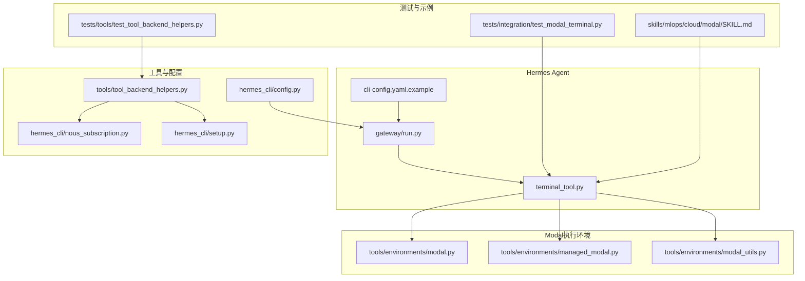
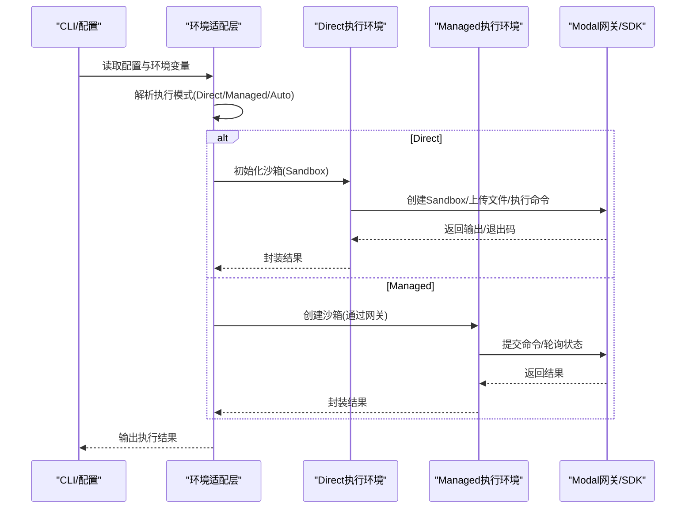
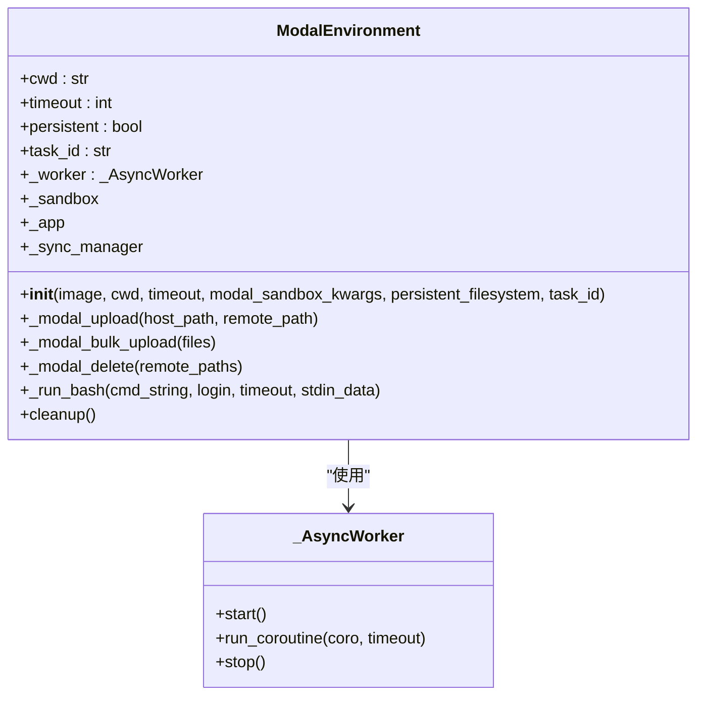
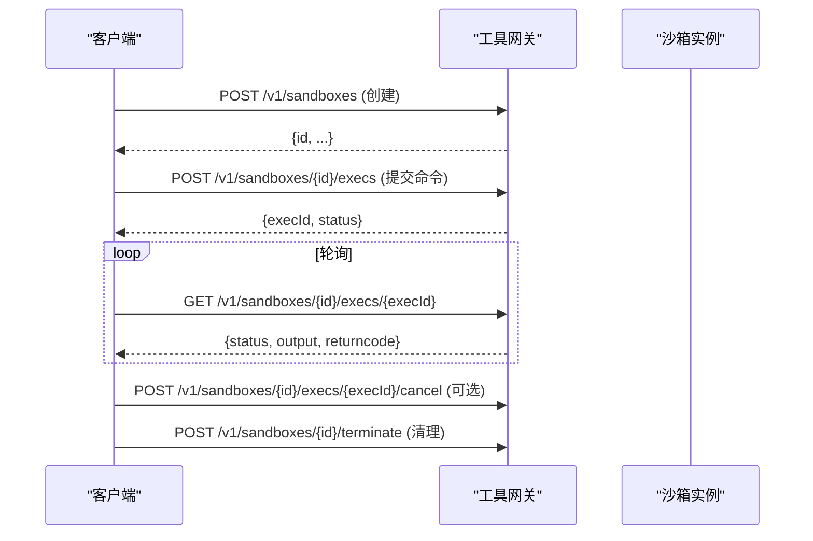
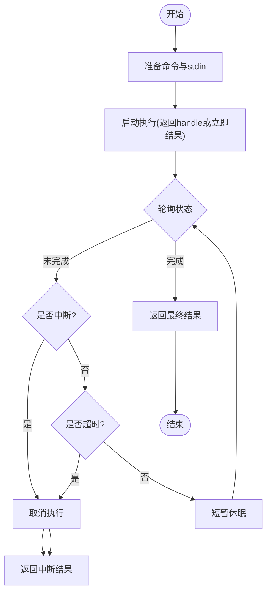
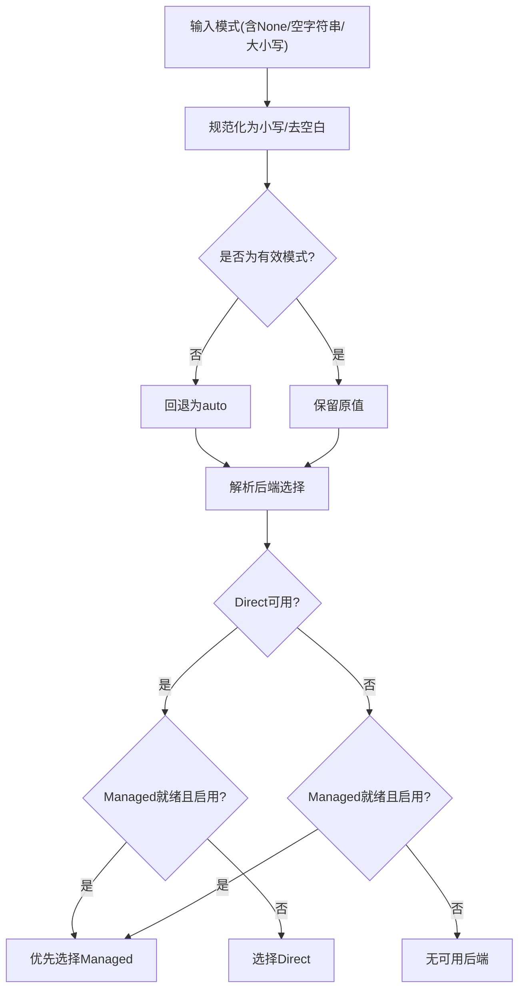
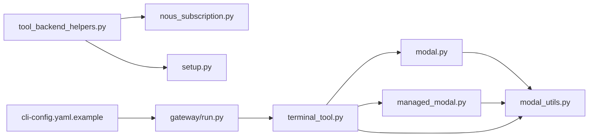

# Modal云执行

<cite>
**本文引用的文件**
- [tools/environments/modal.py](file://tools/environments/modal.py)
- [tools/environments/managed_modal.py](file://tools/environments/managed_modal.py)
- [tools/environments/modal_utils.py](file://tools/environments/modal_utils.py)
- [cli-config.yaml.example](file://cli-config.yaml.example)
- [tests/integration/test_modal_terminal.py](file://tests/integration/test_modal_terminal.py)
- [skills/mlops/cloud/modal/SKILL.md](file://skills/mlops/cloud/modal/SKILL.md)
- [tests/tools/test_tool_backend_helpers.py](file://tests/tools/test_tool_backend_helpers.py)
- [tools/tool_backend_helpers.py](file://tools/tool_backend_helpers.py)
- [hermes_cli/nous_subscription.py](file://hermes_cli/nous_subscription.py)
- [hermes_cli/setup.py](file://hermes_cli/setup.py)
- [gateway/run.py](file://gateway/run.py)
- [hermes_cli/config.py](file://hermes_cli/config.py)
- [scripts/kill_modal.sh](file://scripts/kill_modal.sh)
</cite>

## 目录
1. [简介](#简介)
2. [项目结构](#项目结构)
3. [核心组件](#核心组件)
4. [架构总览](#架构总览)
5. [详细组件分析](#详细组件分析)
6. [依赖关系分析](#依赖关系分析)
7. [性能考虑](#性能考虑)
8. [故障排查指南](#故障排查指南)
9. [结论](#结论)
10. [附录](#附录)

## 简介
本文件面向Hermes Agent在Modal云平台上的无服务器执行环境，系统化阐述其架构设计、函数即服务（FaaS）与无服务器计算模型的落地方式；覆盖应用部署、函数定义与资源配置；解释自动扩缩容、负载均衡与高可用机制；给出执行配置参数（CPU、内存、GPU）详解；并提供成本优化、性能调优与监控告警建议。文档同时记录Hermes Agent与Modal的集成模式、数据传输与状态管理，并提供最佳实践、故障恢复与运维管理指南。

## 项目结构
围绕Modal云执行的相关代码主要分布在以下模块：
- 环境适配层：直接使用Modal SDK的沙箱执行与托管网关执行两类实现
- 工具后端辅助：模式选择、凭证检测与后端状态解析
- 配置桥接：CLI与配置文件到运行时环境变量的映射
- 测试与示例：终端工具集成测试与Modal技能文档

图表来源
- [tools/environments/modal.py:147-435](file://tools/environments/modal.py#L147-L435)
- [tools/environments/managed_modal.py:36-283](file://tools/environments/managed_modal.py#L36-L283)
- [tools/environments/modal_utils.py:58-187](file://tools/environments/modal_utils.py#L58-L187)
- [cli-config.yaml.example:190-212](file://cli-config.yaml.example#L190-L212)
- [gateway/run.py:103-127](file://gateway/run.py#L103-L127)
- [tests/integration/test_modal_terminal.py:1-302](file://tests/integration/test_modal_terminal.py#L1-302)
- [skills/mlops/cloud/modal/SKILL.md:14-345](file://skills/mlops/cloud/modal/SKILL.md#L14-L345)
- [tests/tools/test_tool_backend_helpers.py:78-277](file://tests/tools/test_tool_backend_helpers.py#L78-L277)
- [tools/tool_backend_helpers.py:26-77](file://tools/tool_backend_helpers.py#L26-L77)
- [hermes_cli/nous_subscription.py:255-428](file://hermes_cli/nous_subscription.py#L255-L428)
- [hermes_cli/setup.py:1225-1257](file://hermes_cli/setup.py#L1225-L1257)
- [hermes_cli/config.py:347, 719, 2921](file://hermes_cli/config.py#L347)
- [hermes_cli/config.py:719](file://hermes_cli/config.py#L719)
- [hermes_cli/config.py:2921](file://hermes_cli/config.py#L2921)

章节来源
- [tools/environments/modal.py:147-435](file://tools/environments/modal.py#L147-L435)
- [tools/environments/managed_modal.py:36-283](file://tools/environments/managed_modal.py#L36-L283)
- [tools/environments/modal_utils.py:58-187](file://tools/environments/modal_utils.py#L58-L187)
- [cli-config.yaml.example:190-212](file://cli-config.yaml.example#L190-L212)
- [gateway/run.py:103-127](file://gateway/run.py#L103-L127)
- [tests/integration/test_modal_terminal.py:1-302](file://tests/integration/test_modal_terminal.py#L1-302)
- [skills/mlops/cloud/modal/SKILL.md:14-345](file://skills/mlops/cloud/modal/SKILL.md#L14-L345)
- [tests/tools/test_tool_backend_helpers.py:78-277](file://tests/tools/test_tool_backend_helpers.py#L78-L277)
- [tools/tool_backend_helpers.py:26-77](file://tools/tool_backend_helpers.py#L26-L77)
- [hermes_cli/nous_subscription.py:255-428](file://hermes_cli/nous_subscription.py#L255-L428)
- [hermes_cli/setup.py:1225-1257](file://hermes_cli/setup.py#L1225-L1257)
- [hermes_cli/config.py:347, 719, 2921](file://hermes_cli/config.py#L347)
- [hermes_cli/config.py:719](file://hermes_cli/config.py#L719)
- [hermes_cli/config.py:2921](file://hermes_cli/config.py#L2921)

## 核心组件
- 直接模式（Direct）沙箱执行环境：通过Modal原生SDK创建Sandbox，支持快照持久化、文件同步与中断取消。
- 托管模式（Managed）执行环境：通过工具网关创建与管理沙箱，客户端仅负责命令准备与轮询结果。
- Modal通用执行流程：统一命令准备、stdin处理、超时与中断控制、结果封装。
- 模式选择与凭证检测：根据环境变量与配置文件判断是否具备Direct或Managed能力，自动/手动选择后端。
- 配置桥接：CLI配置与环境变量映射，支持容器资源（CPU/内存/磁盘）、镜像与执行模式等参数。

章节来源
- [tools/environments/modal.py:147-435](file://tools/environments/modal.py#L147-L435)
- [tools/environments/managed_modal.py:36-283](file://tools/environments/managed_modal.py#L36-L283)
- [tools/environments/modal_utils.py:58-187](file://tools/environments/modal_utils.py#L58-L187)
- [tools/tool_backend_helpers.py:26-77](file://tools/tool_backend_helpers.py#L26-L77)
- [cli-config.yaml.example:190-212](file://cli-config.yaml.example#L190-L212)
- [gateway/run.py:103-127](file://gateway/run.py#L103-L127)

## 架构总览
Modal云执行在Hermes中分为两条路径：
- 直接模式：Agent侧直接调用Modal SDK创建Sandbox，自行管理快照与文件同步。
- 托管模式：Agent通过工具网关创建沙箱，执行由网关调度，Agent仅负责轮询与中断。

图表来源
- [tools/environments/modal.py:147-435](file://tools/environments/modal.py#L147-L435)
- [tools/environments/managed_modal.py:36-283](file://tools/environments/managed_modal.py#L36-L283)
- [tools/environments/modal_utils.py:75-132](file://tools/environments/modal_utils.py#L75-L132)
- [cli-config.yaml.example:190-212](file://cli-config.yaml.example#L190-L212)
- [gateway/run.py:103-127](file://gateway/run.py#L103-L127)

## 详细组件分析

### 直接模式执行环境（ModalEnvironment）
- 职责：基于Modal SDK创建Sandbox，支持快照持久化、文件同步、中断取消与清理。
- 关键特性：
  - 快照恢复与存储：按任务ID命名空间保存/删除快照，提升冷启动效率。
  - 文件同步：单文件与批量tar流式上传，兼容Modal SDK的stdin写入限制。
  - 异步工作线程：独立事件循环，保证异步调用安全。
  - 中断支持：通过Sandbox终止实现命令级中断。
- 数据与控制流：
  - 命令执行前触发文件同步；执行时封装为异步进程句柄；完成后可选快照保存。

图表来源
- [tools/environments/modal.py:147-435](file://tools/environments/modal.py#L147-L435)
- [tools/environments/modal.py:115-145](file://tools/environments/modal.py#L115-L145)

章节来源
- [tools/environments/modal.py:147-435](file://tools/environments/modal.py#L147-L435)

### 托管模式执行环境（ManagedModalEnvironment）
- 职责：通过工具网关创建与管理沙箱，客户端仅负责命令准备与轮询。
- 关键特性：
  - 请求封装：统一POST创建沙箱、提交执行、轮询状态与取消执行。
  - 资源参数：CPU、内存、磁盘、空闲超时、持久化开关等映射至网关。
  - 错误格式化：从HTTP响应提取错误信息，便于定位问题。
  - 凭证限制：不支持主机凭据挂载，需切换Direct模式。
- 数据与控制流：
  - 命令准备后通过REST接口提交；轮询返回完成/失败/取消/超时；必要时取消执行。

图表来源
- [tools/environments/managed_modal.py:72-171](file://tools/environments/managed_modal.py#L72-L171)
- [tools/environments/managed_modal.py:172-212](file://tools/environments/managed_modal.py#L172-L212)
- [tools/environments/managed_modal.py:248-283](file://tools/environments/managed_modal.py#L248-L283)

章节来源
- [tools/environments/managed_modal.py:36-283](file://tools/environments/managed_modal.py#L36-L283)

### Modal通用执行流程（BaseModalExecutionEnvironment）
- 职责：统一命令准备、stdin处理（heredoc或管道）、超时与中断控制、结果封装。
- 关键流程：
  - 命令预处理：包装sudo输入、根据stdin模式拼接heredoc。
  - 执行：开始执行后进入轮询；客户端侧超时与中断均会触发取消。
  - 结果：封装标准输出与退出码，异常统一转为错误结果。

图表来源
- [tools/environments/modal_utils.py:75-132](file://tools/environments/modal_utils.py#L75-L132)
- [tools/environments/modal_utils.py:137-162](file://tools/environments/modal_utils.py#L137-L162)

章节来源
- [tools/environments/modal_utils.py:58-187](file://tools/environments/modal_utils.py#L58-L187)

### 模式选择与凭证检测
- 模式规范化：支持auto/direct/managed三种模式，自动/大小写/空白处理。
- 凭证检测：识别环境变量与配置文件中的Modal令牌，用于Direct模式可用性判断。
- 后端解析：综合模式请求、Direct可用性与Managed就绪状态，决定最终后端。

图表来源
- [tests/tools/test_tool_backend_helpers.py:78-120](file://tests/tools/test_tool_backend_helpers.py#L78-L120)
- [tools/tool_backend_helpers.py:26-77](file://tools/tool_backend_helpers.py#L26-L77)
- [hermes_cli/nous_subscription.py:255-428](file://hermes_cli/nous_subscription.py#L255-L428)
- [hermes_cli/setup.py:1225-1257](file://hermes_cli/setup.py#L1225-L1257)

章节来源
- [tests/tools/test_tool_backend_helpers.py:78-277](file://tests/tools/test_tool_backend_helpers.py#L78-L277)
- [tools/tool_backend_helpers.py:26-77](file://tools/tool_backend_helpers.py#L26-L77)
- [hermes_cli/nous_subscription.py:255-428](file://hermes_cli/nous_subscription.py#L255-L428)
- [hermes_cli/setup.py:1225-1257](file://hermes_cli/setup.py#L1225-L1257)

### 配置参数与桥接
- CLI配置示例：提供Modal后端的镜像、工作目录、超时、生命周期等参数。
- 环境变量映射：CLI配置与运行时环境变量之间的桥接逻辑，确保容器资源与执行模式生效。
- 运行时参数：容器CPU/内存/磁盘、镜像、执行模式等在运行期被读取并传递给后端。

章节来源
- [cli-config.yaml.example:190-212](file://cli-config.yaml.example#L190-L212)
- [gateway/run.py:103-127](file://gateway/run.py#L103-L127)
- [hermes_cli/config.py:347, 719, 2921](file://hermes_cli/config.py#L347)
- [hermes_cli/config.py:719](file://hermes_cli/config.py#L719)
- [hermes_cli/config.py:2921](file://hermes_cli/config.py#L2921)

## 依赖关系分析
- 组件耦合：
  - 直接模式与托管模式分别依赖Modal SDK与工具网关，彼此独立演进。
  - 通用执行流程抽象了命令准备与轮询逻辑，降低重复实现。
- 外部依赖：
  - Modal SDK：用于Direct模式的Sandbox创建、执行与快照。
  - 工具网关：用于Managed模式的沙箱生命周期管理与命令执行。
- 可能的循环依赖：当前模块间为单向依赖，未见循环。

图表来源
- [tools/environments/modal.py:147-435](file://tools/environments/modal.py#L147-L435)
- [tools/environments/managed_modal.py:36-283](file://tools/environments/managed_modal.py#L36-L283)
- [tools/environments/modal_utils.py:58-187](file://tools/environments/modal_utils.py#L58-L187)
- [tools/tool_backend_helpers.py:26-77](file://tools/tool_backend_helpers.py#L26-L77)
- [hermes_cli/nous_subscription.py:255-428](file://hermes_cli/nous_subscription.py#L255-L428)
- [hermes_cli/setup.py:1225-1257](file://hermes_cli/setup.py#L1225-L1257)
- [cli-config.yaml.example:190-212](file://cli-config.yaml.example#L190-L212)
- [gateway/run.py:103-127](file://gateway/run.py#L103-L127)

章节来源
- [tools/environments/modal.py:147-435](file://tools/environments/modal.py#L147-L435)
- [tools/environments/managed_modal.py:36-283](file://tools/environments/managed_modal.py#L36-L283)
- [tools/environments/modal_utils.py:58-187](file://tools/environments/modal_utils.py#L58-L187)
- [tools/tool_backend_helpers.py:26-77](file://tools/tool_backend_helpers.py#L26-L77)
- [hermes_cli/nous_subscription.py:255-428](file://hermes_cli/nous_subscription.py#L255-L428)
- [hermes_cli/setup.py:1225-1257](file://hermes_cli/setup.py#L1225-L1257)
- [cli-config.yaml.example:190-212](file://cli-config.yaml.example#L190-L212)
- [gateway/run.py:103-127](file://gateway/run.py#L103-L127)

## 性能考虑
- 冷启动与快照：
  - 直接模式通过快照恢复显著降低冷启动时间，建议在长生命周期任务中启用持久化。
  - 文件同步采用批量tar流式上传，避免参数长度限制。
- 并发与超时：
  - 通用执行流程支持客户端侧超时与中断，避免长时间阻塞。
  - 托管模式通过轮询与取消接口实现细粒度控制。
- 资源规划：
  - 容器资源（CPU/内存/磁盘）与镜像选择直接影响性能与成本，建议结合任务特征进行调优。
- GPU加速：
  - Modal技能文档提供了GPU规格与配置示例，可按需选择合适GPU与并发策略。

章节来源
- [tools/environments/modal.py:154-156](file://tools/environments/modal.py#L154-L156)
- [tools/environments/modal.py:306-348](file://tools/environments/modal.py#L306-L348)
- [tools/environments/modal_utils.py:104-131](file://tools/environments/modal_utils.py#L104-L131)
- [cli-config.yaml.example:216-222](file://cli-config.yaml.example#L216-L222)
- [skills/mlops/cloud/modal/SKILL.md:115-148](file://skills/mlops/cloud/modal/SKILL.md#L115-L148)

## 故障排查指南
- 执行失败与错误格式化：
  - 托管模式对HTTP错误进行格式化输出，便于快速定位问题。
- 中断与超时：
  - 通用执行流程在中断或超时时返回标准化结果，避免死锁。
- 清理与资源回收：
  - 提供脚本用于终止Modal相关进程，避免资源泄漏。
- 集成测试：
  - 提供完整的终端工具测试套件，验证认证、命令执行、文件系统持久化与隔离性。

章节来源
- [tools/environments/managed_modal.py:268-283](file://tools/environments/managed_modal.py#L268-L283)
- [tools/environments/modal_utils.py:104-131](file://tools/environments/modal_utils.py#L104-L131)
- [scripts/kill_modal.sh](file://scripts/kill_modal.sh)
- [tests/integration/test_modal_terminal.py:1-302](file://tests/integration/test_modal_terminal.py#L1-302)

## 结论
Hermes Agent在Modal云上的执行方案以“直接模式”和“托管模式”双轨并行：前者强调灵活性与自控，后者强调易用与集中治理。通过统一的执行流程抽象、完善的模式选择与凭证检测、以及详尽的配置桥接，系统在性能、可靠性与可观测性方面实现了良好平衡。结合GPU加速、快照与资源规划，可在保证成本可控的同时获得卓越的弹性与扩展性。

## 附录
- Modal技能文档：涵盖GPU规格、容器镜像、持久化存储、Web端点、动态批处理、密钥管理、调度与性能优化等主题。
- CLI配置示例：提供Modal后端的镜像、工作目录、超时、生命周期与容器资源参数的配置说明。
- 环境变量映射：CLI配置与运行时环境变量之间的桥接逻辑，确保容器资源与执行模式生效。

章节来源
- [skills/mlops/cloud/modal/SKILL.md:14-345](file://skills/mlops/cloud/modal/SKILL.md#L14-L345)
- [cli-config.yaml.example:190-212](file://cli-config.yaml.example#L190-L212)
- [gateway/run.py:103-127](file://gateway/run.py#L103-L127)