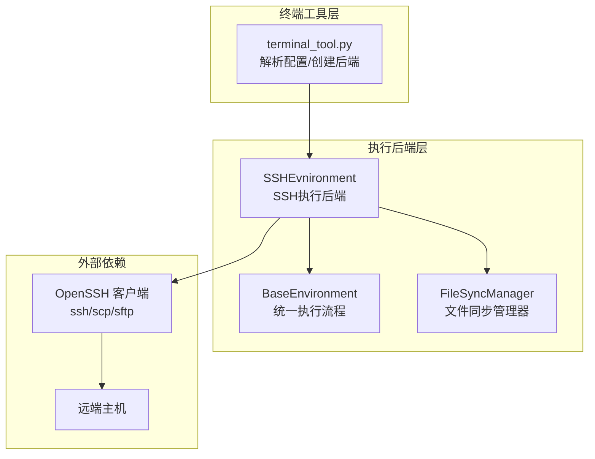
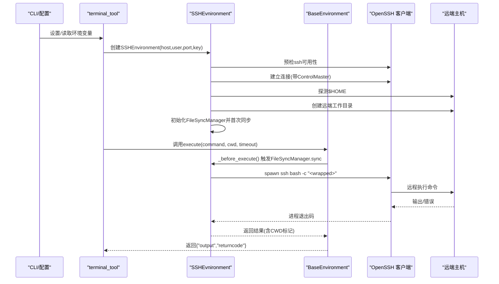
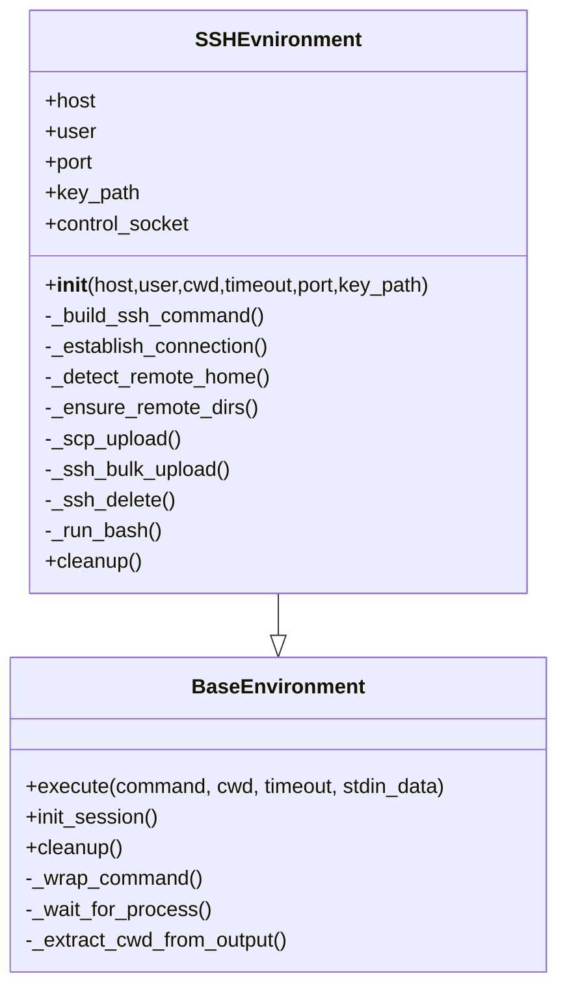
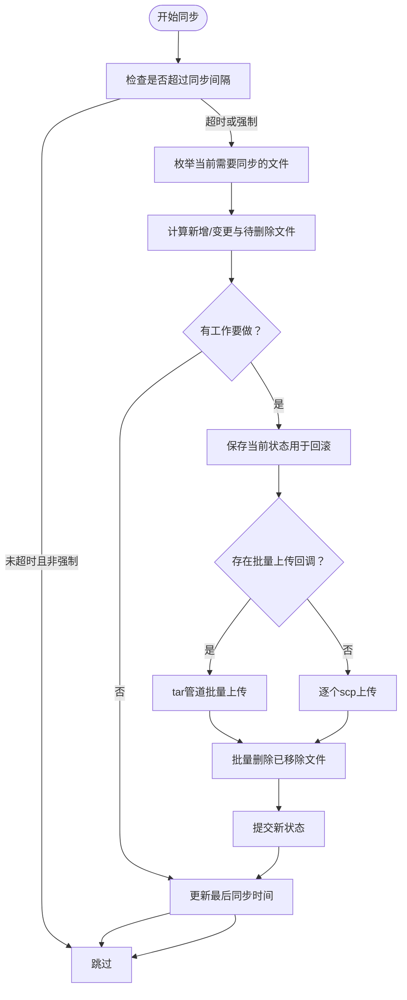
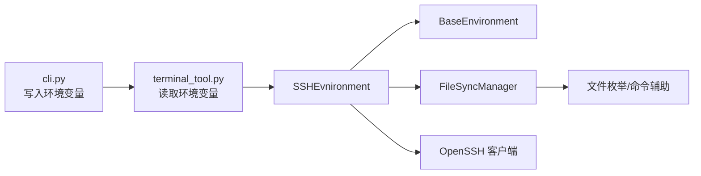

# SSH远程执行

<cite>
**本文引用的文件**
- [tools/environments/ssh.py](file://tools/environments/ssh.py)
- [tools/environments/base.py](file://tools/environments/base.py)
- [tools/environments/file_sync.py](file://tools/environments/file_sync.py)
- [tests/tools/test_ssh_environment.py](file://tests/tools/test_ssh_environment.py)
- [tests/tools/test_ssh_bulk_upload.py](file://tests/tools/test_ssh_bulk_upload.py)
- [tools/terminal_tool.py](file://tools/terminal_tool.py)
- [cli.py](file://cli.py)
- [website/docs/reference/environment-variables.md](file://website/docs/reference/environment-variables.md)
- [tests/tools/test_file_sync_perf.py](file://tests/tools/test_file_sync_perf.py)
- [tests/tools/test_credential_files.py](file://tests/tools/test_credential_files.py)
- [tools/approval.py](file://tools/approval.py)
- [hermes_cli/doctor.py](file://hermes_cli/doctor.py)
- [hermes_cli/setup.py](file://hermes_cli/setup.py)
</cite>

## 目录
1. [简介](#简介)
2. [项目结构](#项目结构)
3. [核心组件](#核心组件)
4. [架构总览](#架构总览)
5. [详细组件分析](#详细组件分析)
6. [依赖分析](#依赖分析)
7. [性能考量](#性能考量)
8. [故障排查指南](#故障排查指南)
9. [结论](#结论)
10. [附录](#附录)

## 简介
本文件面向Hermes Agent的SSH远程执行环境，系统性阐述SSH连接建立、认证机制、安全传输、密钥与主机公钥校验、连接池管理、远程命令执行、文件传输与批量上传、端口转发能力边界、配置参数（超时、重连、并发）、安全最佳实践、隧道与代理跳转配置、性能优化与故障诊断等主题。内容基于仓库中的实际实现与测试用例进行归纳总结，帮助开发者与运维人员在复杂网络环境下稳定、安全地使用SSH后端。

## 项目结构
SSH远程执行由以下模块协同完成：
- 执行后端：SSHEnvironment（封装OpenSSH客户端调用）
- 基类抽象：BaseEnvironment（统一命令包装、会话快照、CWD跟踪、超时与中断处理）
- 文件同步：FileSyncManager（变更检测、删除追踪、速率限制、事务性同步）
- 终端工具桥接：terminal_tool（解析环境变量并创建SSH后端）
- CLI与配置：cli.py、hermes_cli/*（环境变量映射、健康检查、安装向导）

**图表来源**
- [tools/terminal_tool.py:659-678](file://tools/terminal_tool.py#L659-L678)
- [tools/environments/ssh.py:31-64](file://tools/environments/ssh.py#L31-L64)
- [tools/environments/base.py:226-284](file://tools/environments/base.py#L226-L284)
- [tools/environments/file_sync.py:74-100](file://tools/environments/file_sync.py#L74-L100)

**章节来源**
- [tools/terminal_tool.py:659-678](file://tools/terminal_tool.py#L659-L678)
- [tools/environments/ssh.py:31-64](file://tools/environments/ssh.py#L31-L64)
- [tools/environments/base.py:226-284](file://tools/environments/base.py#L226-L284)
- [tools/environments/file_sync.py:74-100](file://tools/environments/file_sync.py#L74-L100)

## 核心组件
- SSHEnvironment：负责构建SSH命令、建立连接、检测远端家目录、确保远端工作目录、初始化文件同步管理器、执行远程命令、清理ControlMaster连接。
- BaseEnvironment：提供统一的命令包装、会话快照（环境变量、函数、别名、shell选项）、CWD标记与提取、超时与中断处理、进程生命周期管理。
- FileSyncManager：基于mtime+size的变更检测，支持单文件上传与批量tar管道上传，删除追踪，速率限制（默认5秒），事务性提交/回滚。
- terminal_tool：从环境变量读取SSH配置，创建SSHEnvironment实例；支持持久化shell开关。
- CLI与配置：将配置写入环境变量，供terminal_tool读取；doctor与setup提供健康检查与安装引导。

**章节来源**
- [tools/environments/ssh.py:31-64](file://tools/environments/ssh.py#L31-L64)
- [tools/environments/base.py:226-284](file://tools/environments/base.py#L226-L284)
- [tools/environments/file_sync.py:74-100](file://tools/environments/file_sync.py#L74-L100)
- [tools/terminal_tool.py:659-678](file://tools/terminal_tool.py#L659-L678)
- [cli.py:431-457](file://cli.py#L431-L457)

## 架构总览
SSH远程执行的整体流程如下：
- 启动阶段：terminal_tool读取环境变量，构造SSHEnvironment；预检OpenSSH可用性；建立一次连接以验证凭据与可达性；探测远端家目录；准备远端工作目录；初始化FileSyncManager并首次全量同步。
- 执行阶段：每次execute前触发FileSyncManager.sync（受速率限制）；BaseEnvironment包装命令（会话快照、CWD、sudo处理、stdin注入）；通过SSHEvnironment.spawn ssh进程执行bash -c；等待输出、提取CWD、返回结果。
- 清理阶段：关闭ControlMaster连接并删除socket文件。

**图表来源**
- [tools/terminal_tool.py:659-678](file://tools/terminal_tool.py#L659-L678)
- [tools/environments/ssh.py:31-64](file://tools/environments/ssh.py#L31-L64)
- [tools/environments/base.py:519-558](file://tools/environments/base.py#L519-L558)

**章节来源**
- [tools/terminal_tool.py:659-678](file://tools/terminal_tool.py#L659-L678)
- [tools/environments/ssh.py:31-64](file://tools/environments/ssh.py#L31-L64)
- [tools/environments/base.py:519-558](file://tools/environments/base.py#L519-L558)

## 详细组件分析

### SSHEnvironment：连接、认证与执行
- 连接建立与预检
  - 预检OpenSSH客户端是否存在，不存在则抛出明确错误。
  - 构建ssh命令行，启用ControlMaster自动模式、持久化、批处理模式、连接超时、严格主机密钥检查策略。
  - 首次连接通过echo验证连通性与凭据有效性。
- 主机公钥验证
  - 默认采用“接受新主机密钥”策略，适合开发/CI场景；生产建议结合known_hosts或更严格的策略。
- 控制套接字与连接池
  - 使用临时目录下的socket路径作为ControlPath，实现连接复用与持久化（默认300秒）。
- 远端环境准备
  - 探测远端家目录，创建~/.hermes/{skills,credentials,cache}目录树。
- 命令执行
  - 通过spawn ssh bash -c执行包装后的命令；支持login shell与stdin数据注入。
- 清理
  - 通过ControlMaster发送exit指令并删除socket文件。

**图表来源**
- [tools/environments/ssh.py:31-64](file://tools/environments/ssh.py#L31-L64)
- [tools/environments/ssh.py:235-245](file://tools/environments/ssh.py#L235-L245)
- [tools/environments/base.py:226-284](file://tools/environments/base.py#L226-L284)

**章节来源**
- [tools/environments/ssh.py:23-92](file://tools/environments/ssh.py#L23-L92)
- [tools/environments/ssh.py:114-121](file://tools/environments/ssh.py#L114-L121)
- [tools/environments/ssh.py:235-245](file://tools/environments/ssh.py#L235-L245)
- [tools/environments/ssh.py:247-258](file://tools/environments/ssh.py#L247-L258)

### FileSyncManager：文件同步与批量上传
- 变更检测
  - 基于本地文件mtime与size，识别新增/变更文件；记录已同步文件集合并更新时间戳。
- 删除追踪
  - 对比当前集合与已同步集合，生成待删除列表。
- 速率限制
  - 默认每5秒同步一次；可通过强制标志或环境变量绕过。
- 事务性
  - 仅当所有上传/删除操作成功才提交状态，否则回滚。
- 上传策略
  - 单文件：scp上传。
  - 批量：通过tar管道在单TCP流中传输，减少子进程开销；先批量创建父目录，再一次性解压到远端根目录。

**图表来源**
- [tools/environments/file_sync.py:101-169](file://tools/environments/file_sync.py#L101-L169)
- [tests/tools/test_ssh_bulk_upload.py:140-216](file://tests/tools/test_ssh_bulk_upload.py#L140-L216)

**章节来源**
- [tools/environments/file_sync.py:74-169](file://tools/environments/file_sync.py#L74-L169)
- [tests/tools/test_ssh_bulk_upload.py:43-174](file://tests/tools/test_ssh_bulk_upload.py#L43-L174)

### BaseEnvironment：统一执行模型与会话快照
- 命令包装
  - 在每次执行前source会话快照（若已创建），切换工作目录，执行命令，重新导出快照，输出CWD标记。
- 会话快照
  - 首次执行时捕获登录shell环境（export -p、declare -f、alias -p、shell选项），后续命令直接source快照，提升性能。
- CWD跟踪
  - 远端通过stdout标记线定位当前工作目录，本地通过文件读取或标记解析更新cwd。
- 超时与中断
  - 周期性轮询进程状态，支持超时与SIGINT中断，返回标准化结果。
- 统一execute入口
  - 将超时、stdin、sudo处理、命令包装、进程等待、CWD更新整合为单一接口。

**章节来源**
- [tools/environments/base.py:289-325](file://tools/environments/base.py#L289-L325)
- [tools/environments/base.py:330-366](file://tools/environments/base.py#L330-L366)
- [tools/environments/base.py:382-450](file://tools/environments/base.py#L382-L450)
- [tools/environments/base.py:519-558](file://tools/environments/base.py#L519-L558)

### terminal_tool：SSH配置解析与后端创建
- 环境变量映射
  - 读取TERMINAL_SSH_HOST/USER/PORT/KEY及持久化shell开关，构造ssh_config传递给后端工厂。
- 后端创建
  - 当env_type为ssh时，根据ssh_config创建SSHEvnironment实例。
- 持久化shell
  - 默认跟随全局持久化设置，可按后端覆盖。

**章节来源**
- [tools/terminal_tool.py:659-678](file://tools/terminal_tool.py#L659-L678)
- [tools/terminal_tool.py:690-816](file://tools/terminal_tool.py#L690-L816)

## 依赖分析
- 外部依赖
  - OpenSSH客户端（ssh/scp）：用于连接、文件传输与批量上传。
  - 远端主机：需支持bash与标准Unix工具链。
- 内部耦合
  - SSHEvnironment依赖BaseEnvironment的命令包装与生命周期管理。
  - SSHEvnironment通过FileSyncManager实现文件同步，后者依赖工具模块提供的文件枚举与shell命令辅助。
- 环境变量与配置
  - CLI与hermes_cli将配置写入环境变量，terminal_tool读取并创建后端；环境变量参考文档定义了SSH相关键值。

**图表来源**
- [cli.py:431-457](file://cli.py#L431-L457)
- [tools/terminal_tool.py:659-678](file://tools/terminal_tool.py#L659-L678)
- [tools/environments/ssh.py:31-64](file://tools/environments/ssh.py#L31-L64)
- [tools/environments/file_sync.py:30-56](file://tools/environments/file_sync.py#L30-L56)

**章节来源**
- [cli.py:431-457](file://cli.py#L431-L457)
- [website/docs/reference/environment-variables.md:129-155](file://website/docs/reference/environment-variables.md#L129-L155)

## 性能考量
- 连接复用
  - ControlMaster自动模式与持久化（默认300秒）显著降低握手开销；socket路径位于系统临时目录，便于清理。
- 文件同步优化
  - 默认5秒同步间隔，避免频繁IO；批量上传通过tar管道减少子进程与往返次数；父目录去重批量创建。
- 执行开销
  - 会话快照仅在首次创建，后续命令通过source快照快速恢复环境；CWD标记与文件读取相结合，减少额外查询。
- 测试验证
  - 性能测试显示在同步触发后，命令执行耗时显著降低（远小于1.5秒），证明mtime跳过与连接复用有效。

**章节来源**
- [tools/environments/ssh.py:66-81](file://tools/environments/ssh.py#L66-L81)
- [tools/environments/file_sync.py:20-21](file://tools/environments/file_sync.py#L20-L21)
- [tests/tools/test_file_sync_perf.py:106-127](file://tests/tools/test_file_sync_perf.py#L106-L127)

## 故障排查指南
- SSH客户端不可用
  - 现象：初始化时报错提示未安装或PATH中无ssh。
  - 处理：安装OpenSSH客户端并确保在PATH中。
- 连接失败/超时
  - 现象：连接echo失败或超时。
  - 处理：检查主机名、端口、密钥路径；确认网络可达；调整ConnectTimeout；必要时手动ssh验证。
- 主机公钥策略
  - 现象：首次连接被拒绝或出现主机密钥警告。
  - 处理：生产环境建议使用known_hosts或更严格策略；开发/CI可接受新主机密钥。
- 文件同步失败
  - 现象：mkdir失败、tar创建失败、SSH提取失败。
  - 处理：检查远端权限、磁盘空间；查看stderr日志；确认批量上传回调可用。
- 进程超时与中断
  - 现象：命令超时返回124或被中断返回130。
  - 处理：适当增大timeout；检查远端负载；确认中断信号正确传递。
- 环境变量与配置
  - 现象：SSH后端未生效或参数不正确。
  - 处理：确认TERMINAL_SSH_*与持久化开关设置；doctor与setup提供健康检查与引导。

**章节来源**
- [tools/environments/ssh.py:23-28](file://tools/environments/ssh.py#L23-L28)
- [tools/environments/ssh.py:83-92](file://tools/environments/ssh.py#L83-L92)
- [tests/tools/test_ssh_bulk_upload.py:175-242](file://tests/tools/test_ssh_bulk_upload.py#L175-L242)
- [tools/environments/base.py:419-429](file://tools/environments/base.py#L419-L429)
- [hermes_cli/doctor.py:567-567](file://hermes_cli/doctor.py#L567-L567)
- [hermes_cli/setup.py:1412-1412](file://hermes_cli/setup.py#L1412-L1412)

## 结论
Hermes Agent的SSH远程执行通过统一的后端抽象、连接复用与文件同步机制，在保证安全性的同时兼顾性能与易用性。生产环境中应强化主机公钥策略、密钥管理与访问控制，并结合doctor与setup工具进行部署与维护。对于大规模并发与高延迟网络，建议结合批量上传、连接池参数与超时策略进行针对性优化。

## 附录

### SSH配置参数详解
- 连接参数
  - 主机与用户：TERMINAL_SSH_HOST、TERMINAL_SSH_USER
  - 端口：TERMINAL_SSH_PORT（默认22）
  - 私钥：TERMINAL_SSH_KEY（私钥路径）
  - 持久化shell：TERMINAL_SSH_PERSISTENT（默认跟随全局持久化设置）
- 超时与重试
  - 连接超时：ConnectTimeout（默认10秒）
  - 批处理模式：BatchMode（默认开启）
  - 连接持久化：ControlPersist（默认300秒）
- 并发与连接池
  - ControlMaster：auto（启用连接复用）
  - ControlPath：基于临时目录的socket路径
- 端口转发
  - 代码中未实现端口转发功能；如需端口转发，请在ssh命令行参数中添加相应选项（例如通过extra_args传入）。

**章节来源**
- [tools/environments/ssh.py:66-81](file://tools/environments/ssh.py#L66-L81)
- [website/docs/reference/environment-variables.md:129-155](file://website/docs/reference/environment-variables.md#L129-L155)

### 安全最佳实践
- 密钥管理
  - 使用受保护的私钥文件；避免在代码或配置中硬编码密钥；定期轮换。
- 访问控制
  - 限制SSH用户权限；使用sudo策略最小化授权；避免在远端写入敏感路径。
- 主机公钥验证
  - 生产环境使用known_hosts或严格策略；开发/CI可接受新主机密钥但需谨慎。
- 凭据注册与路径遍历防护
  - 凭据文件注册受HERMES_HOME沙箱约束，禁止绝对路径与路径穿越；敏感目录（如~/.ssh）写入需审批。

**章节来源**
- [tests/tools/test_credential_files.py:233-267](file://tests/tools/test_credential_files.py#L233-L267)
- [tools/approval.py:56-74](file://tools/approval.py#L56-L74)

### 隧道、代理跳转与多跳连接
- 代码现状
  - 未实现内置隧道/代理跳转/多跳连接逻辑。
- 建议方案
  - 通过extra_args传入ssh原生命令行参数（如- J/-o ProxyJump）实现代理跳转；或在本地ssh_config中配置ProxyJump。
  - 注意：使用代理跳转时，批量上传仍会复用ControlMaster socket，需确保socket路径在目标跳板上可达。

**章节来源**
- [tools/environments/ssh.py:78-81](file://tools/environments/ssh.py#L78-L81)
- [tests/tools/test_ssh_bulk_upload.py:244-271](file://tests/tools/test_ssh_bulk_upload.py#L244-L271)