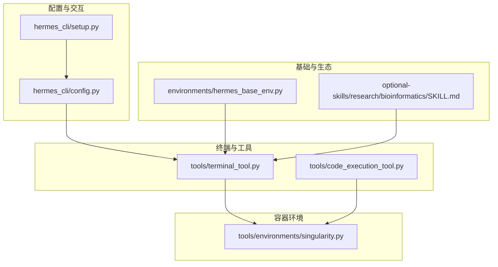
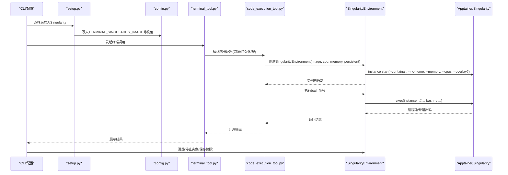
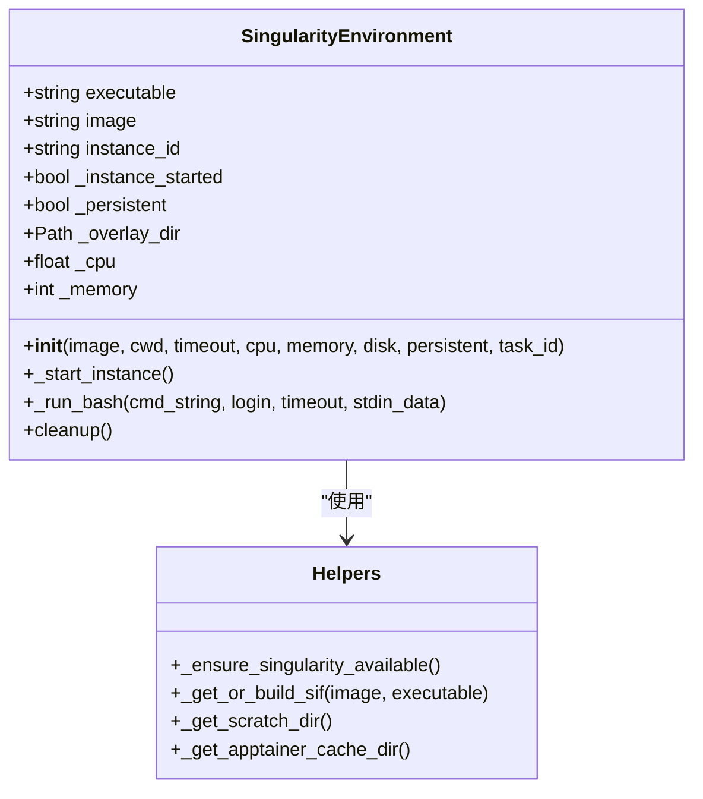
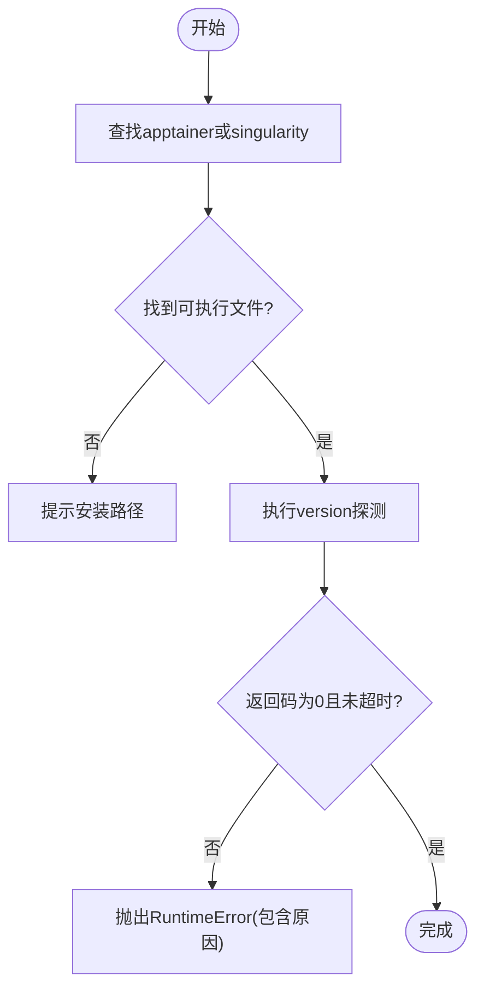
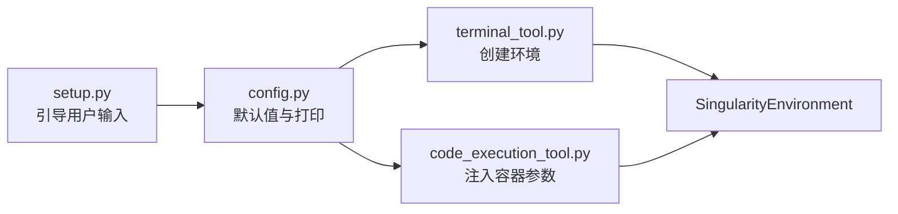
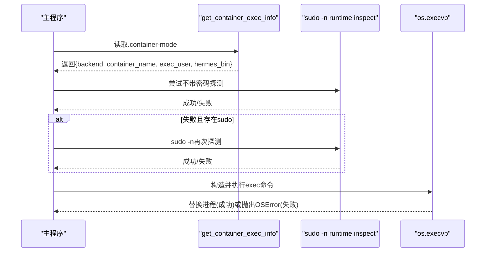
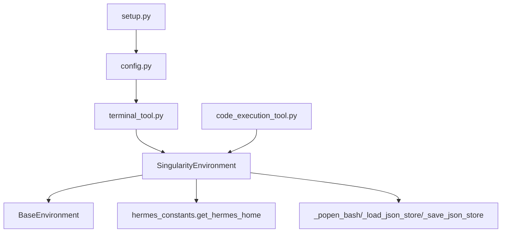

# Singularity执行

<cite>
**本文引用的文件**
- [tools/environments/singularity.py](file://tools/environments/singularity.py)
- [tests/tools/test_singularity_preflight.py](file://tests/tools/test_singularity_preflight.py)
- [hermes_cli/setup.py](file://hermes_cli/setup.py)
- [hermes_cli/config.py](file://hermes_cli/config.py)
- [tools/terminal_tool.py](file://tools/terminal_tool.py)
- [tools/code_execution_tool.py](file://tools/code_execution_tool.py)
- [environments/hermes_base_env.py](file://environments/hermes_base_env.py)
- [README.md](file://README.md)
- [optional-skills/research/bioinformatics/SKILL.md](file://optional-skills/research/bioinformatics/SKILL.md)
- [docs/specs/container-cli-review-fixes.md](file://docs/specs/container-cli-review-fixes.md)
</cite>

## 目录
1. [简介](#简介)
2. [项目结构](#项目结构)
3. [核心组件](#核心组件)
4. [架构总览](#架构总览)
5. [详细组件分析](#详细组件分析)
6. [依赖分析](#依赖分析)
7. [性能考虑](#性能考虑)
8. [故障排查指南](#故障排查指南)
9. [结论](#结论)
10. [附录](#附录)

## 简介
本文件系统化梳理Hermes Agent在Singularity/Apptainer容器环境下的执行方案，覆盖镜像构建、实例启动、命令执行、持久化与快照、资源限制、安全隔离、权限管理、网络与挂载策略、HPC集群集成、以及在学术研究（尤其是生物信息学）与高性能计算中的实践路径。文档同时给出配置参数清单、调试方法与性能优化建议，并对与传统Linux系统的兼容性进行说明。

## 项目结构
围绕Singularity执行的关键代码分布在以下模块：
- 容器环境实现：tools/environments/singularity.py
- 配置与交互：hermes_cli/config.py、hermes_cli/setup.py
- 终端工具与代码执行工具：tools/terminal_tool.py、tools/code_execution_tool.py
- 基础环境定义：environments/hermes_base_env.py
- 生物信息学技能生态：optional-skills/research/bioinformatics/SKILL.md
- 容器路由与CLI规范：docs/specs/container-cli-review-fixes.md
- 单元测试：tests/tools/test_singularity_preflight.py

**图表来源**
- [hermes_cli/config.py:360-383](file://hermes_cli/config.py#L360-L383)
- [hermes_cli/setup.py:1199-1220](file://hermes_cli/setup.py#L1199-L1220)
- [tools/terminal_tool.py:1270-1280](file://tools/terminal_tool.py#L1270-L1280)
- [tools/code_execution_tool.py:482-489](file://tools/code_execution_tool.py#L482-L489)
- [tools/environments/singularity.py:156-194](file://tools/environments/singularity.py#L156-L194)
- [environments/hermes_base_env.py:120-124](file://environments/hermes_base_env.py#L120-L124)
- [optional-skills/research/bioinformatics/SKILL.md:1-20](file://optional-skills/research/bioinformatics/SKILL.md#L1-L20)

**章节来源**
- [README.md:24-26](file://README.md#L24-L26)
- [hermes_cli/config.py:360-383](file://hermes_cli/config.py#L360-L383)
- [hermes_cli/setup.py:1199-1220](file://hermes_cli/setup.py#L1199-L1220)
- [tools/terminal_tool.py:1270-1280](file://tools/terminal_tool.py#L1270-L1280)
- [tools/code_execution_tool.py:482-489](file://tools/code_execution_tool.py#L482-L489)
- [tools/environments/singularity.py:156-194](file://tools/environments/singularity.py#L156-L194)
- [environments/hermes_base_env.py:120-124](file://environments/hermes_base_env.py#L120-L124)
- [optional-skills/research/bioinformatics/SKILL.md:1-20](file://optional-skills/research/bioinformatics/SKILL.md#L1-L20)

## 核心组件
- SingularityEnvironment：基于Apptainer/Singularity的硬核容器环境，支持资源限制、可选持久化文件系统、会话级快照、按需实例启动与停止。
- 预检与镜像缓存：自动检测可用的apptainer或singularity二进制，执行版本探测；对docker://镜像进行SIF构建与缓存，避免重复构建。
- 资源与挂载：通过--memory、--cpus、--overlay或--writable-tmpfs等参数实现资源限制与持久化；自动绑定凭据与技能目录到容器内。
- 生命周期管理：实例启动、命令执行、清理与快照保存；支持任务级overlay目录与快照持久化。

**章节来源**
- [tools/environments/singularity.py:156-263](file://tools/environments/singularity.py#L156-L263)
- [tests/tools/test_singularity_preflight.py:1-78](file://tests/tools/test_singularity_preflight.py#L1-L78)

## 架构总览
下图展示从配置到容器执行的端到端流程，包括镜像解析、实例启动、命令执行与清理。

**图表来源**
- [hermes_cli/setup.py:1199-1220](file://hermes_cli/setup.py#L1199-L1220)
- [hermes_cli/config.py:360-383](file://hermes_cli/config.py#L360-L383)
- [tools/terminal_tool.py:1270-1280](file://tools/terminal_tool.py#L1270-L1280)
- [tools/code_execution_tool.py:482-489](file://tools/code_execution_tool.py#L482-L489)
- [tools/environments/singularity.py:195-244](file://tools/environments/singularity.py#L195-L244)

## 详细组件分析

### SingularityEnvironment类
- 关键职责
  - 可靠的二进制探测与版本检查
  - docker://镜像到SIF的构建与缓存
  - 实例启动（含containall、no-home、资源限制、挂载凭据/技能）
  - 命令执行（spawn per call）
  - 清理与快照持久化（任务级overlay）

- 安全与隔离
  - 默认启用--containall与--no-home，降低容器逃逸风险
  - 只读挂载凭据与技能目录，减少写扩散面
  - 支持overlay持久化以保留工作区状态

- 资源控制
  - --memory（MB）、--cpus参数映射到容器资源上限
  - 通过APPTAINER_CACHEDIR/APPTAINER_TMPDIR控制缓存与临时目录位置

- 数据流与生命周期
  - 初始化：解析镜像、构建SIF、创建overlay、启动实例、初始化会话
  - 执行：每次execute spawn新进程，复用会话环境变量
  - 清理：停止实例，若持久化则保存overlay快照

**图表来源**
- [tools/environments/singularity.py:156-263](file://tools/environments/singularity.py#L156-L263)

**章节来源**
- [tools/environments/singularity.py:156-263](file://tools/environments/singularity.py#L156-L263)

### 预检与安装引导
- 预检逻辑
  - 优先apptainer，回退singularity
  - 版本命令探测，超时与失败均抛出明确错误
  - 单元测试覆盖优先级、异常路径与超时处理

- 安装引导
  - setup.py中检测PATH中的apptainer/singularity，提示安装链接
  - 引导用户输入镜像与资源参数

**图表来源**
- [tests/tools/test_singularity_preflight.py:1-78](file://tests/tools/test_singularity_preflight.py#L1-L78)
- [hermes_cli/setup.py:1201-1211](file://hermes_cli/setup.py#L1201-L1211)

**章节来源**
- [tests/tools/test_singularity_preflight.py:1-78](file://tests/tools/test_singularity_preflight.py#L1-L78)
- [hermes_cli/setup.py:1201-1211](file://hermes_cli/setup.py#L1201-L1211)

### 配置参数与集成点
- 终端后端与镜像
  - terminal.backend=singularity
  - terminal.singularity_image=docker://...
  - 通过config.py打印当前配置，支持set设置

- 容器资源与持久化
  - container_cpu、container_memory(MB)、container_disk(MB)
  - container_persistent=true启用overlay持久化
  - docker_volumes、docker_mount_cwd_to_workspace（用于Docker，但Singularity亦可结合挂载策略）

- 终端工具集成
  - terminal_tool.py根据env_type选择容器配置并创建环境
  - code_execution_tool.py在docker/singularity/modal/daytona分支中注入资源与持久化参数

**图表来源**
- [hermes_cli/config.py:360-383](file://hermes_cli/config.py#L360-L383)
- [hermes_cli/config.py:2726-2727](file://hermes_cli/config.py#L2726-L2727)
- [tools/terminal_tool.py:1270-1280](file://tools/terminal_tool.py#L1270-L1280)
- [tools/code_execution_tool.py:482-489](file://tools/code_execution_tool.py#L482-L489)
- [hermes_cli/setup.py:1212-1217](file://hermes_cli/setup.py#L1212-L1217)

**章节来源**
- [hermes_cli/config.py:360-383](file://hermes_cli/config.py#L360-L383)
- [hermes_cli/config.py:2726-2727](file://hermes_cli/config.py#L2726-L2727)
- [tools/terminal_tool.py:1270-1280](file://tools/terminal_tool.py#L1270-L1280)
- [tools/code_execution_tool.py:482-489](file://tools/code_execution_tool.py#L482-L489)
- [hermes_cli/setup.py:1212-1217](file://hermes_cli/setup.py#L1212-L1217)

### 容器路由与CLI规范（面向HPC与多后端）
- 容器路由流程
  - 读取.container-mode元数据，判断后端与容器名
  - 探测是否需要sudo访问root命名空间容器
  - 构造exec命令（TTY、用户、环境变量、容器名、二进制与参数），随后os.execvp替换当前进程
  - 对超时、找不到容器、权限不足等情况给出清晰错误与修复建议

- 与Singularity的契合点
  - 后端可为apptainer/singularity
  - sudo探测与非交互模式(-n)确保脚本化与管道场景可用
  - 通过环境变量传递TTY、语言与区域设置

**图表来源**
- [docs/specs/container-cli-review-fixes.md:83-190](file://docs/specs/container-cli-review-fixes.md#L83-L190)

**章节来源**
- [docs/specs/container-cli-review-fixes.md:83-190](file://docs/specs/container-cli-review-fixes.md#L83-L190)

### 在HPC与科学计算中的应用
- 生物信息学生态
  - 提供400+生物信息学技能索引，涵盖基因组学、转录组学、单细胞、变异检测、蛋白结构、药物基因组学、宏基因组等
  - 支持通过Conda/环境包管理器与Singularity组合实现可复现分析
  - 技能仓库强调“可复现打包”（Conda + Singularity + 校验和）

- 高性能计算集成
  - Singularity/Apptainer在HPC中广泛采用，便于在节点间移植与隔离
  - 结合容器路由与CLI规范，可在HPC集群上以非交互方式执行命令
  - 通过--memory/--cpus限制资源，避免资源争用

**章节来源**
- [optional-skills/research/bioinformatics/SKILL.md:1-20](file://optional-skills/research/bioinformatics/SKILL.md#L1-L20)
- [optional-skills/research/bioinformatics/SKILL.md:207-226](file://optional-skills/research/bioinformatics/SKILL.md#L207-L226)

## 依赖分析
- 组件耦合
  - SingularityEnvironment依赖基础环境基类与工具函数（日志、JSON存储、Popen封装）
  - 终端与代码执行工具通过统一的容器配置接口注入资源与持久化参数
  - setup.py与config.py共同决定镜像与资源默认值

- 外部依赖
  - Apptainer/Singularity CLI
  - 可选：凭据与技能目录挂载（由工具模块提供）
  - 缓存目录与overlay目录（位于沙箱或/scratch）

**图表来源**
- [tools/environments/singularity.py:18-23](file://tools/environments/singularity.py#L18-L23)
- [tools/terminal_tool.py:1270-1280](file://tools/terminal_tool.py#L1270-L1280)
- [tools/code_execution_tool.py:482-489](file://tools/code_execution_tool.py#L482-L489)
- [hermes_cli/setup.py:1212-1217](file://hermes_cli/setup.py#L1212-L1217)
- [hermes_cli/config.py:360-383](file://hermes_cli/config.py#L360-L383)

**章节来源**
- [tools/environments/singularity.py:18-23](file://tools/environments/singularity.py#L18-L23)
- [tools/terminal_tool.py:1270-1280](file://tools/terminal_tool.py#L1270-L1280)
- [tools/code_execution_tool.py:482-489](file://tools/code_execution_tool.py#L482-L489)
- [hermes_cli/setup.py:1212-1217](file://hermes_cli/setup.py#L1212-L1217)
- [hermes_cli/config.py:360-383](file://hermes_cli/config.py#L360-L383)

## 性能考虑
- 镜像构建与缓存
  - 使用APPTAINER_CACHEDIR与APPTAINER_TMPDIR减少I/O争用
  - SIF构建加锁避免并发重复构建
- 资源限制
  - 合理设置--memory与--cpus，避免容器被OOMKiller或调度器限流
- 持久化策略
  - overlay适合频繁写入的工作区；tmpfs更轻量但重启丢失
- I/O与网络
  - 仅挂载必要目录，减少容器内文件系统扫描开销
  - 禁用不需要的网络访问，降低容器间通信复杂度

[本节为通用指导，无需特定文件引用]

## 故障排查指南
- 无法找到Apptainer/Singularity
  - 现象：RuntimeError提示未找到apptainer或singularity
  - 处理：确认PATH包含可执行文件，或按提示安装
  - 参考：预检单元测试覆盖该场景

- SIF构建失败或超时
  - 现象：构建失败回退至docker://URL
  - 处理：检查APPTAINER_CACHEDIR与磁盘空间；重试或手动构建SIF

- 实例启动失败
  - 现象：instance start返回非零
  - 处理：查看stderr；确认--memory/--cpus参数合理；检查overlay目录权限

- 容器路由问题
  - 现象：找不到容器或需要sudo
  - 处理：按CLI规范中的sudo提示配置nopasswd规则；或直接使用sudo hermes

**章节来源**
- [tests/tools/test_singularity_preflight.py:39-77](file://tests/tools/test_singularity_preflight.py#L39-L77)
- [tools/environments/singularity.py:120-153](file://tools/environments/singularity.py#L120-L153)
- [docs/specs/container-cli-review-fixes.md:140-166](file://docs/specs/container-cli-review-fixes.md#L140-L166)

## 结论
Hermes Agent通过Singularity/Apptainer实现了面向HPC与科学计算的高隔离、可复现、可扩展的执行环境。其设计强调：
- 明确的预检与镜像缓存机制
- 精细的资源限制与持久化选项
- 与CLI路由与配置体系的无缝集成
- 在生物信息学与高性能计算领域的良好适配

建议在生产环境中结合容器路由与CLI规范，配合合理的资源与持久化策略，以获得稳定、可审计的执行体验。

[本节为总结性内容，无需特定文件引用]

## 附录

### 配置参数清单（与Singularity相关）
- 终端后端与镜像
  - terminal.backend=singularity
  - terminal.singularity_image=docker://...
- 容器资源
  - container_cpu
  - container_memory(MB)
  - container_disk(MB)
  - container_persistent=true/false
- 其他
  - docker_volumes（用于挂载主机目录，注意隔离性）
  - docker_mount_cwd_to_workspace（默认关闭，避免弱化隔离）

**章节来源**
- [hermes_cli/config.py:360-383](file://hermes_cli/config.py#L360-L383)
- [hermes_cli/config.py:2726-2727](file://hermes_cli/config.py#L2726-L2727)
- [tools/terminal_tool.py:1270-1280](file://tools/terminal_tool.py#L1270-L1280)
- [tools/code_execution_tool.py:482-489](file://tools/code_execution_tool.py#L482-L489)

### HPC与生物信息学实践要点
- 使用Conda/环境包管理器与Singularity组合，确保可复现性
- 利用overlay持久化工作区，减少重复构建成本
- 在集群上通过容器路由与CLI规范实现非交互式批处理

**章节来源**
- [optional-skills/research/bioinformatics/SKILL.md:207-226](file://optional-skills/research/bioinformatics/SKILL.md#L207-L226)
- [docs/specs/container-cli-review-fixes.md:83-190](file://docs/specs/container-cli-review-fixes.md#L83-L190)