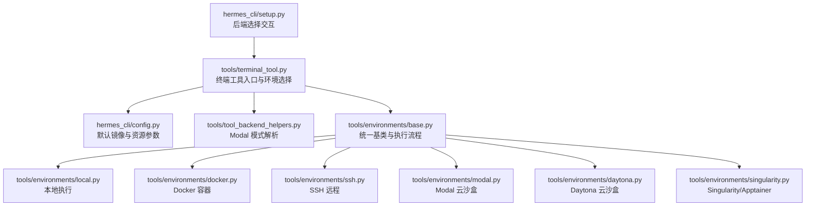
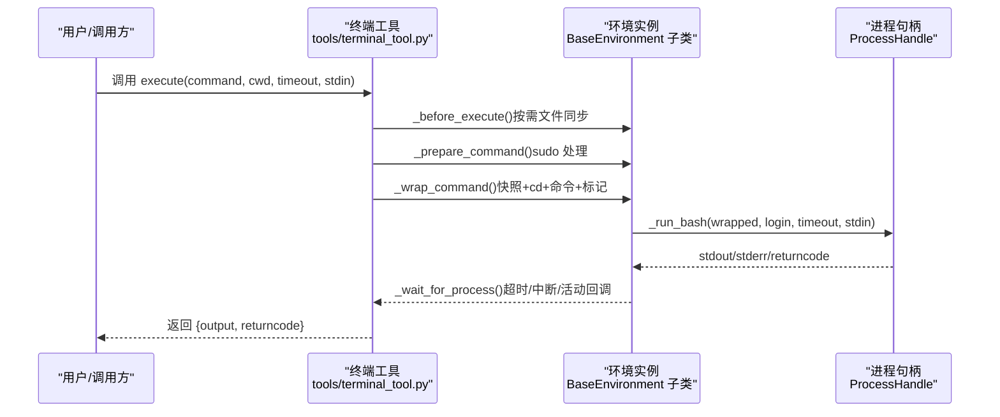
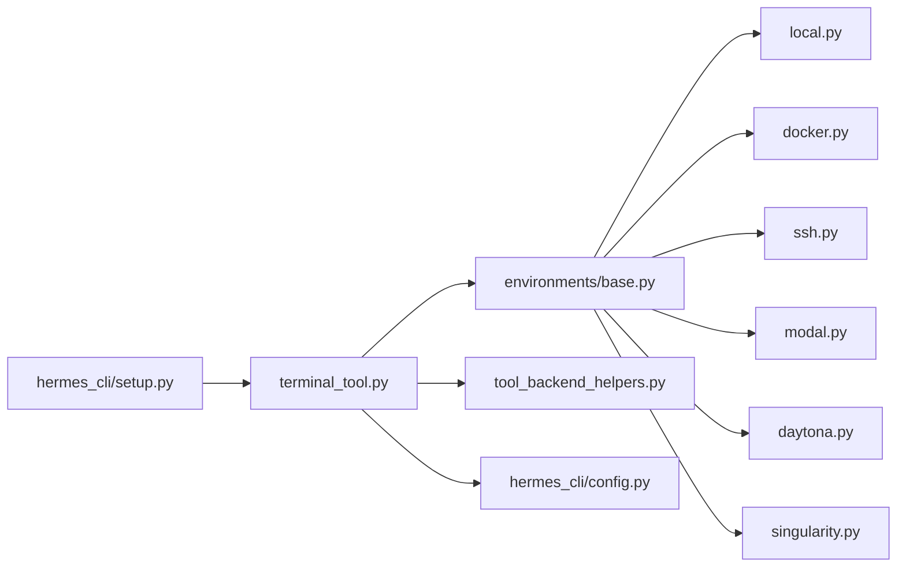

# 容器后端支持

<cite>
**本文引用的文件**
- [tools/terminal_tool.py](file://tools/terminal_tool.py)
- [tools/tool_backend_helpers.py](file://tools/tool_backend_helpers.py)
- [hermes_cli/config.py](file://hermes_cli/config.py)
- [hermes_cli/setup.py](file://hermes_cli/setup.py)
- [tools/environments/base.py](file://tools/environments/base.py)
- [tools/environments/local.py](file://tools/environments/local.py)
- [tools/environments/docker.py](file://tools/environments/docker.py)
- [tools/environments/ssh.py](file://tools/environments/ssh.py)
- [tools/environments/modal.py](file://tools/environments/modal.py)
- [tools/environments/daytona.py](file://tools/environments/daytona.py)
- [tools/environments/singularity.py](file://tools/environments/singularity.py)
</cite>

## 目录
1. [引言](#引言)
2. [项目结构](#项目结构)
3. [核心组件](#核心组件)
4. [架构总览](#架构总览)
5. [详细组件分析](#详细组件分析)
6. [依赖分析](#依赖分析)
7. [性能考量](#性能考量)
8. [故障排除指南](#故障排除指南)
9. [结论](#结论)
10. [附录](#附录)

## 引言
本文件系统化阐述 Hermes Agent 的“容器后端支持”，覆盖六种执行后端：本地（local）、Docker 容器、SSH 远程、Modal 云沙盒、Daytona 云沙盒与 Singularity/Apptainer。内容包括：
- 各后端特点、适用场景与配置要点
- 实现原理（安全隔离、资源管理、持久化）
- 性能特征与最佳实践
- 部署与运维建议、迁移策略与兼容性注意事项
- 故障排除与常见问题定位

## 项目结构
围绕终端工具与环境抽象，后端能力由统一的环境基类与各后端实现构成，并通过终端工具入口进行编排与调度。

图示来源
- [tools/terminal_tool.py:690-817](file://tools/terminal_tool.py#L690-L817)
- [hermes_cli/config.py:360-379](file://hermes_cli/config.py#L360-L379)
- [tools/tool_backend_helpers.py:48-81](file://tools/tool_backend_helpers.py#L48-L81)
- [tools/environments/base.py:226-580](file://tools/environments/base.py#L226-L580)
- [tools/environments/local.py:216-315](file://tools/environments/local.py#L216-L315)
- [tools/environments/docker.py:217-561](file://tools/environments/docker.py#L217-L561)
- [tools/environments/ssh.py:31-259](file://tools/environments/ssh.py#L31-L259)
- [tools/environments/modal.py:147-435](file://tools/environments/modal.py#L147-L435)
- [tools/environments/daytona.py:29-230](file://tools/environments/daytona.py#L29-L230)
- [tools/environments/singularity.py:156-263](file://tools/environments/singularity.py#L156-L263)
- [hermes_cli/setup.py:1099-1130](file://hermes_cli/setup.py#L1099-L1130)

章节来源
- [tools/terminal_tool.py:690-817](file://tools/terminal_tool.py#L690-L817)
- [hermes_cli/config.py:360-379](file://hermes_cli/config.py#L360-L379)
- [hermes_cli/setup.py:1099-1130](file://hermes_cli/setup.py#L1099-L1130)

## 核心组件
- 终端工具入口：负责根据环境变量与用户选择构建具体环境实例，统一执行流程与生命周期管理。
- 环境基类：定义统一的会话快照、命令封装、超时与中断处理、CWD 跟踪等通用逻辑。
- 六种后端实现：分别在本地进程、Docker 容器、SSH 远程、Modal 云沙盒、Daytona 云沙盒、Singularity/Apptainer 中执行命令。
- Modal 模式解析：在直接模式与托管模式之间自动或显式选择。
- CLI 配置与安装：提供默认镜像、资源参数、后端选择交互与安装提示。

章节来源
- [tools/environments/base.py:226-580](file://tools/environments/base.py#L226-L580)
- [tools/terminal_tool.py:690-817](file://tools/terminal_tool.py#L690-L817)
- [tools/tool_backend_helpers.py:48-81](file://tools/tool_backend_helpers.py#L48-L81)
- [hermes_cli/config.py:360-379](file://hermes_cli/config.py#L360-L379)

## 架构总览
统一的“环境抽象 + 执行编排”架构，所有后端遵循相同的命令封装与会话快照机制，差异体现在资源隔离、持久化策略与文件同步方式。

图示来源
- [tools/environments/base.py:519-558](file://tools/environments/base.py#L519-L558)
- [tools/environments/base.py:382-450](file://tools/environments/base.py#L382-L450)
- [tools/terminal_tool.py:519-558](file://tools/terminal_tool.py#L519-L558)

## 详细组件分析

### 本地执行（Local）
- 特点
  - 最快、零网络延迟；适合开发调试与低风险命令。
  - 无容器隔离，注意敏感操作与权限控制。
- 实现要点
  - 使用 bash 登录/非登录模式执行；会话快照通过导出环境变量与函数实现。
  - 通过安全路径与环境变量过滤，避免泄露凭证。
  - CWD 通过临时文件回读更新。
- 安全与隔离
  - 无容器边界；通过环境变量白名单与阻断列表降低泄露风险。
- 资源管理
  - 无硬性 CPU/内存限制；受宿主机策略影响。
- 性能
  - 启动开销最小；I/O 直接访问宿主机文件系统。

章节来源
- [tools/environments/local.py:216-315](file://tools/environments/local.py#L216-L315)
- [tools/environments/base.py:289-325](file://tools/environments/base.py#L289-L325)

### Docker 容器
- 特点
  - 可信隔离与可重复环境；支持资源配额与持久化工作区。
- 实现要点
  - 启动守护容器，使用 Tini/Catatonit 作为 PID 1；安全参数最小化能力集。
  - 支持 tmpfs 与 bind mount；可选持久化 home/workspace。
  - 环境变量转发与只读挂载凭据目录；可选将宿主当前工作目录绑定到 /workspace。
- 安全与隔离
  - 能力降级、禁止新特权、PID 限制、受限 tmpfs。
- 资源管理
  - CPU、内存、磁盘（部分驱动支持）；网络可禁用。
- 性能
  - 首次镜像拉取与容器启动有额外开销；持久化可减少重复初始化成本。

章节来源
- [tools/environments/docker.py:217-561](file://tools/environments/docker.py#L217-L561)

### SSH 远程
- 特点
  - 在远端机器上执行命令；适合跨主机协作与专用硬件。
- 实现要点
  - 使用 SSH ControlMaster 复用连接；首次建立连接并检测远端 HOME。
  - 文件同步通过单文件 SCP 与批量 tar 流传输，减少往返开销。
  - CWD 通过输出标记解析。
- 安全与隔离
  - 依赖 SSH 认证与密钥；无容器隔离。
- 资源管理
  - 受远端资源限制；无内置配额。
- 性能
  - 连接复用显著降低握手成本；批量上传提升大文件集合效率。

章节来源
- [tools/environments/ssh.py:31-259](file://tools/environments/ssh.py#L31-L259)

### Modal 云执行
- 特点
  - 原生 Modal SDK Sandbox；支持快照恢复以缩短冷启动。
  - 适合需要云原生弹性与快速扩展的场景。
- 实现要点
  - 通过 App lookup 创建/复用沙盒；支持凭据与技能目录挂载。
  - 快照存储于本地 JSON；失败时回退至基础镜像。
  - stdin 采用 heredoc 方式注入（SDK 限制）。
- 安全与隔离
  - Modal 沙盒提供隔离；镜像可预装 Python。
- 资源管理
  - CPU/内存/磁盘参数映射到 Sandbox；快照保存文件系统。
- 性能
  - 冷启动时间受镜像与快照恢复影响；快照可显著加速后续启动。

章节来源
- [tools/environments/modal.py:147-435](file://tools/environments/modal.py#L147-L435)

### Daytona 云执行
- 特点
  - 使用 Daytona SDK；支持持久化沙盒（停止后保留文件系统）。
- 实现要点
  - 优先尝试按任务 ID 恢复沙盒；否则创建新沙盒；自动检测 HOME/CWD。
  - 提供批量文件上传接口；支持并发写入保护。
- 安全与隔离
  - Daytona 沙盒提供隔离；资源上限与平台限制需关注。
- 资源管理
  - CPU/内存/磁盘参数映射；磁盘上限存在平台限制。
- 性能
  - 恢复现有沙盒可减少初始化时间；批量上传优化大文件同步。

章节来源
- [tools/environments/daytona.py:29-230](file://tools/environments/daytona.py#L29-L230)

### Singularity/Apptainer
- 特点
  - 面向 HPC 场景的容器运行时；支持 overlay 持久化与严格隔离。
- 实现要点
  - 支持 apptainer/singularity 可执行；必要时构建 SIF 缓存。
  - 通过 instance start/stop 生命周期管理；持久化使用 overlay 目录。
  - 凭据与技能目录只读挂载。
- 安全与隔离
  - containall/no-home 参数强化隔离；能力降级。
- 资源管理
  - CPU/内存参数映射；磁盘通过 overlay 控制。
- 性能
  - 首次构建 SIF 有一次性成本；后续实例启动较快。

章节来源
- [tools/environments/singularity.py:156-263](file://tools/environments/singularity.py#L156-L263)

### 环境选择与配置
- 选择指南
  - 开发/测试/低风险：本地
  - 需要隔离与一致环境：Docker 或 Singularity
  - 跨主机/专用硬件：SSH
  - 云弹性与快速扩展：Modal 或 Daytona
- 配置要点
  - 默认镜像与资源参数来自 CLI 配置；可通过环境变量覆盖。
  - Modal 模式支持 auto/direct/managed，自动解析可用模式。
  - Docker 支持显式挂载与仅转发特定环境变量。

章节来源
- [hermes_cli/config.py:360-379](file://hermes_cli/config.py#L360-L379)
- [tools/tool_backend_helpers.py:48-81](file://tools/tool_backend_helpers.py#L48-L81)
- [hermes_cli/setup.py:1099-1130](file://hermes_cli/setup.py#L1099-L1130)
- [tools/terminal_tool.py:646-678](file://tools/terminal_tool.py#L646-L678)

## 依赖分析
- 组件耦合
  - 终端工具对各后端实现解耦，通过统一基类接口交互。
  - Modal/Daytona 依赖各自 SDK；Docker/SSH/Singularity 依赖系统工具。
- 关键依赖链
  - 终端工具 → 环境基类 → 具体后端 → 外部系统/SDK
  - Modal/Daytona 文件同步依赖 FileSyncManager；Docker/SSH/Singularity 依赖本地文件系统或 SDK。

图示来源
- [tools/terminal_tool.py:690-817](file://tools/terminal_tool.py#L690-L817)
- [tools/environments/base.py:226-580](file://tools/environments/base.py#L226-L580)
- [tools/tool_backend_helpers.py:48-81](file://tools/tool_backend_helpers.py#L48-L81)
- [hermes_cli/config.py:360-379](file://hermes_cli/config.py#L360-L379)
- [hermes_cli/setup.py:1099-1130](file://hermes_cli/setup.py#L1099-L1130)

## 性能考量
- 启动与冷启动
  - Modal/Daytona/SSH/Docker/Singularity 均存在启动/连接/镜像准备开销；快照/恢复与连接复用可显著降低。
- I/O 与文件同步
  - Modal/Daytona/SSH 提供批量上传；Docker/Singularity 通过挂载/overlay 直接访问宿主文件系统。
- 资源配额
  - Docker/Modal/Daytona/Singularity 支持 CPU/内存/磁盘限制；本地与 SSH 受宿主策略约束。
- 并发与中断
  - 统一的超时与中断处理保障长命令可控；Modal/Daytona 通过 SDK 取消接口终止。

章节来源
- [tools/environments/modal.py:306-348](file://tools/environments/modal.py#L306-L348)
- [tools/environments/daytona.py:147-167](file://tools/environments/daytona.py#L147-L167)
- [tools/environments/ssh.py:141-217](file://tools/environments/ssh.py#L141-L217)
- [tools/environments/docker.py:494-531](file://tools/environments/docker.py#L494-L531)
- [tools/environments/base.py:382-450](file://tools/environments/base.py#L382-L450)

## 故障排除指南
- Docker 相关
  - 未找到 docker 可执行：检查 PATH 与已知安装位置；确保 Docker 正在运行。
  - 存储驱动不支持磁盘限额：在 overlay2+XFS+pquota 环境下生效。
- Modal 相关
  - 快照恢复失败：自动回退至基础镜像；检查快照 JSON 与权限。
  - stdin 大小限制：采用 heredoc 分块写入。
- Daytona 相关
  - 沙盒状态异常：刷新状态并重启；磁盘超过平台上限将被裁剪。
- SSH 相关
  - 连接失败：确认 OpenSSH 安装、主机密钥策略与超时设置。
- Singularity 相关
  - 未找到 apptainer/singularity：安装并确保 CLI 可用；SIF 构建失败将回退到远程镜像。
- 通用
  - 超时/中断：统一通过中断事件与超时处理返回明确结果；检查活动回调是否触发。

章节来源
- [tools/environments/docker.py:151-215](file://tools/environments/docker.py#L151-L215)
- [tools/environments/docker.py:494-531](file://tools/environments/docker.py#L494-L531)
- [tools/environments/modal.py:240-263](file://tools/environments/modal.py#L240-L263)
- [tools/environments/modal.py:300-304](file://tools/environments/modal.py#L300-L304)
- [tools/environments/daytona.py:177-183](file://tools/environments/daytona.py#L177-L183)
- [tools/environments/daytona.py:70-76](file://tools/environments/daytona.py#L70-L76)
- [tools/environments/ssh.py:23-29](file://tools/environments/ssh.py#L23-L29)
- [tools/environments/singularity.py:30-60](file://tools/environments/singularity.py#L30-L60)
- [tools/environments/singularity.py:120-153](file://tools/environments/singularity.py#L120-L153)
- [tools/environments/base.py:411-430](file://tools/environments/base.py#L411-L430)

## 结论
Hermes Agent 的容器后端支持以统一的环境抽象为核心，结合 Modal/Daytona 的云原生能力与 Docker/Singularity 的企业级隔离，覆盖从本地开发到云端弹性执行的完整场景。通过会话快照、文件同步与资源配额，系统在安全性、可移植性与性能之间取得平衡。建议依据任务隔离需求、网络与资源约束选择合适后端，并结合快照与连接复用优化启动与同步性能。

## 附录
- 配置最佳实践
  - 明确镜像来源与默认资源参数；在 CI/生产中固定镜像版本。
  - 仅转发必要的环境变量；敏感信息通过只读挂载或托管网关注入。
  - 启用持久化时，定期清理过期沙盒与缓存，避免磁盘占用过高。
- 迁移策略
  - 从本地迁移到容器：先在本地验证命令，再在 Docker/Singularity 中复现实验环境。
  - 从 Docker 迁移到 Modal/Daytona：利用快照恢复减少迁移成本；校准资源参数。
  - 从 SSH 迁移到 Modal/Daytona：统一凭据挂载与文件同步策略。
- 兼容性注意事项
  - Modal/Daytona 的 stdin 与 ARG_MAX 限制不同；必要时分块传输。
  - Docker 存储驱动限制导致磁盘限额不可用时，改用 tmpfs 或外部卷。
  - SSH 批量上传在大文件集合下显著优于逐文件 SCP。