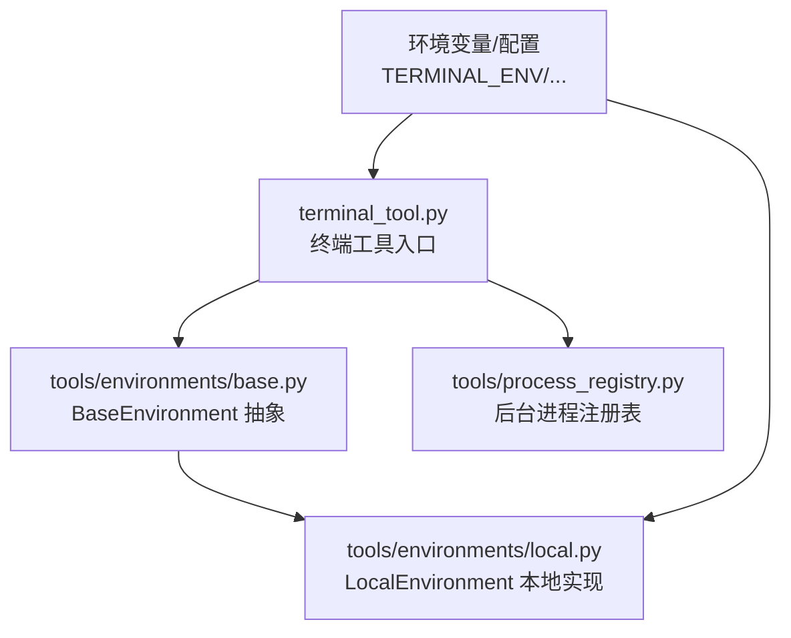
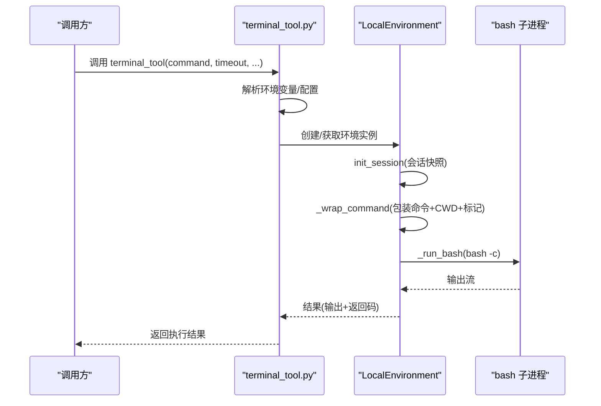
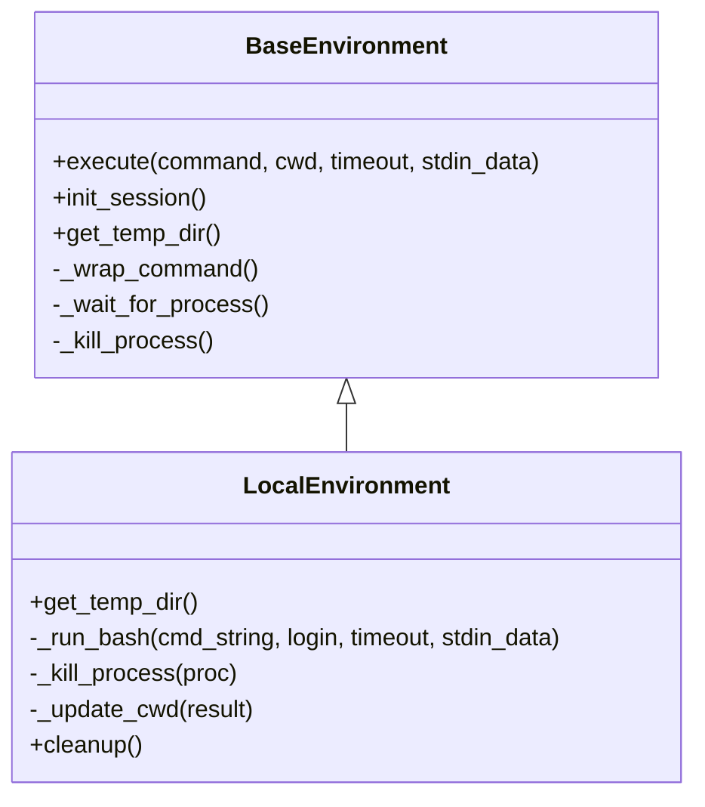
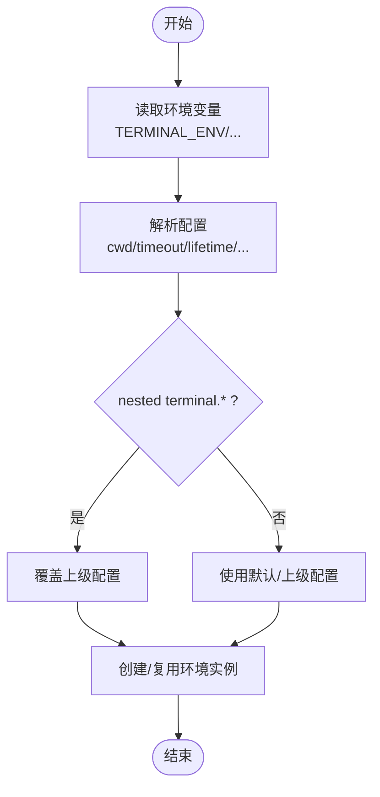
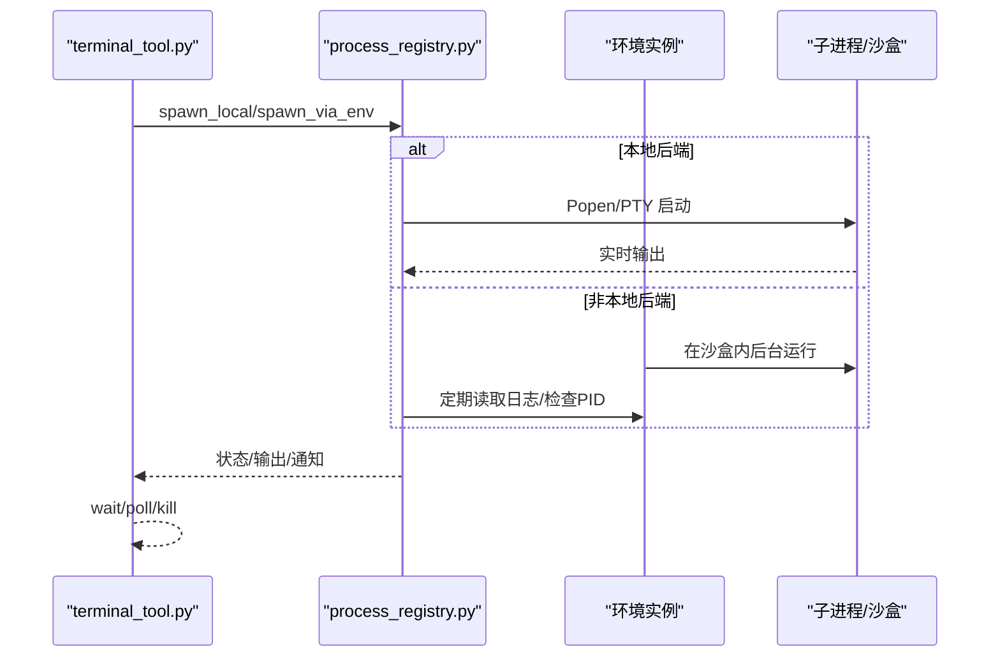
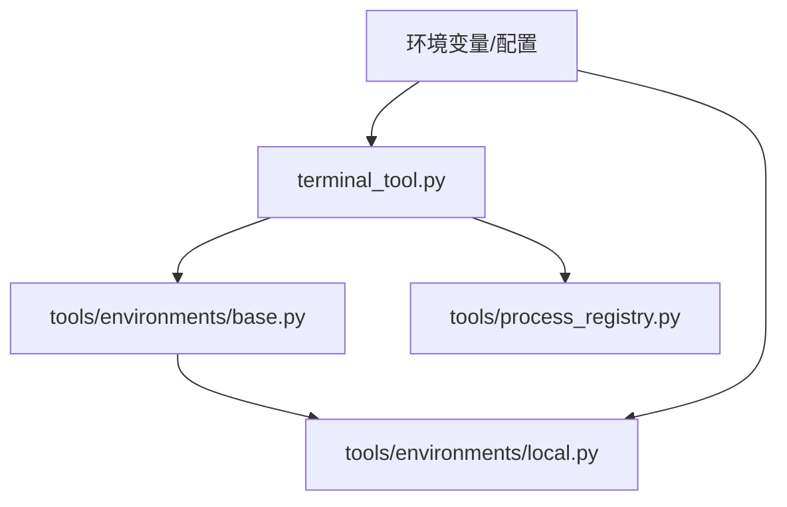

# 本地执行环境

<cite>
**本文引用的文件**
- [tools/environments/local.py](file://tools/environments/local.py)
- [tools/environments/base.py](file://tools/environments/base.py)
- [tools/terminal_tool.py](file://tools/terminal_tool.py)
- [tools/process_registry.py](file://tools/process_registry.py)
- [environments/hermes_base_env.py](file://environments/hermes_base_env.py)
- [environments/README.md](file://environments/README.md)
- [cli-config.yaml.example](file://cli-config.yaml.example)
- [tests/gateway/test_config_cwd_bridge.py](file://tests/gateway/test_config_cwd_bridge.py)
- [tests/tools/test_terminal_foreground_timeout_cap.py](file://tests/tools/test_terminal_foreground_timeout_cap.py)
- [hermes_cli/setup.py](file://hermes_cli/setup.py)
- [hermes_cli/doctor.py](file://hermes_cli/doctor.py)
</cite>

## 目录
1. [简介](#简介)
2. [项目结构](#项目结构)
3. [核心组件](#核心组件)
4. [架构总览](#架构总览)
5. [详细组件分析](#详细组件分析)
6. [依赖分析](#依赖分析)
7. [性能考虑](#性能考虑)
8. [故障排查指南](#故障排查指南)
9. [结论](#结论)
10. [附录](#附录)

## 简介
本文件系统化阐述 Hermes Agent 的本地执行环境（TERMINAL_ENV=local）：从工作机制、隔离与安全、资源限制到性能特征与并发能力；并给出配置参数详解（如 terminal_timeout、terminal_lifetime、tool_pool_size），以及最佳实践、常见问题排查与性能优化建议。同时对本地执行与容器/云端后端进行对比，帮助读者在不同场景下做出合理选择。

## 项目结构
本地执行环境由“工具层”“环境层”“进程注册表”“配置桥接”等模块协同完成：
- 工具层：terminal_tool 提供统一入口，解析环境变量与配置，按需创建并复用环境实例。
- 环境层：BaseEnvironment 抽象出会话快照、命令包装、超时与中断处理；LocalEnvironment 实现本地直连执行。
- 进程注册表：process_registry 负责后台任务生命周期管理（输出缓冲、轮询、通知、清理）。
- 配置桥接：环境变量 TERMINAL_ENV、TERMINAL_TIMEOUT、TERMINAL_LIFETIME_SECONDS 等贯穿各层。

图示来源
- [tools/terminal_tool.py](file://tools/terminal_tool.py)
- [tools/environments/base.py](file://tools/environments/base.py)
- [tools/environments/local.py](file://tools/environments/local.py)
- [tools/process_registry.py](file://tools/process_registry.py)

章节来源
- [tools/terminal_tool.py](file://tools/terminal_tool.py)
- [tools/environments/base.py](file://tools/environments/base.py)
- [tools/environments/local.py](file://tools/environments/local.py)
- [tools/process_registry.py](file://tools/process_registry.py)

## 核心组件
- 终端工具（terminal_tool）
  - 解析环境变量与配置，决定后端类型与默认工作目录、超时、生命周期等。
  - 创建并缓存环境实例，支持前台/后台执行、危险命令审批、sudo 处理、磁盘用量告警等。
- 环境抽象（BaseEnvironment）
  - 统一执行流程：会话快照、命令包装、超时与中断处理、CWD 同步。
  - 支持登录 shell 回退、stdin heredoc 嵌入、SDK 后端适配器等。
- 本地环境（LocalEnvironment）
  - 每次执行 spawn-per-call，使用 bash -c 执行命令；通过会话快照保持环境一致性。
  - 本地 CWD 通过临时文件回读，HOME 隔离，环境变量清洗，路径安全策略。
- 进程注册表（process_registry）
  - 统一管理后台任务：输出滚动缓冲、轮询、通知、超时与中断、崩溃恢复。
  - 仅本地后端 spawn_local，其他后端通过环境 execute 包装并在沙盒内轮询日志。

章节来源
- [tools/terminal_tool.py](file://tools/terminal_tool.py)
- [tools/environments/base.py](file://tools/environments/base.py)
- [tools/environments/local.py](file://tools/environments/local.py)
- [tools/process_registry.py](file://tools/process_registry.py)

## 架构总览
本地执行的关键流程：工具层解析配置 → 创建/复用 LocalEnvironment → 生成会话快照 → 包装命令（含 CWD、环境变量、标记）→ spawn bash 子进程 → 等待/中断/超时 → 更新 CWD → 返回结果。

图示来源
- [tools/terminal_tool.py](file://tools/terminal_tool.py)
- [tools/environments/local.py](file://tools/environments/local.py)
- [tools/environments/base.py](file://tools/environments/base.py)

## 详细组件分析

### LocalEnvironment 本地执行机制
- 进程隔离
  - 每次执行 spawn-per-call，使用 bash -c 启动新进程，避免跨调用状态污染。
  - 登录 shell 回退：若会话快照失败，改用 bash -l 加载用户配置。
- 资源限制
  - 通过 TERMINAL_TIMEOUT 控制前台命令超时；后台任务受各自环境 timeout 影响。
  - 本地不强制 CPU/内存/磁盘限制，但可通过外部策略（如 systemd slice、cgroups）约束。
- 安全与环境变量
  - 清洗敏感变量（如 API Key、组织标识等），支持白名单透传（env_passthrough）。
  - 强制 HOME 隔离至 {HERMES_HOME}/home/，避免宿主系统工具配置泄漏。
  - 严格 PATH 合并与 sane 默认路径，减少环境差异。
- CWD 与持久化
  - 本地通过临时文件回读当前工作目录，确保跨调用一致。
  - 会话快照保存环境变量、函数、别名、shell 选项，提升交互体验。
- 终止与清理
  - 支持进程组终止（非 Windows）；失败时回退到单进程终止。
  - 提供 cleanup 清理临时文件。

图示来源
- [tools/environments/base.py](file://tools/environments/base.py)
- [tools/environments/local.py](file://tools/environments/local.py)

章节来源
- [tools/environments/local.py](file://tools/environments/local.py)
- [tools/environments/base.py](file://tools/environments/base.py)

### 终端工具与配置桥接
- 环境变量解析
  - TERMINAL_ENV 决定后端类型，默认 local。
  - TERMINAL_TIMEOUT、TERMINAL_LIFETIME_SECONDS、TERMINAL_CWD 等影响行为。
  - 支持 per-task 环境覆盖（register_task_env_overrides）。
- 配置优先级
  - nested terminal.* 优先于顶层配置；未设置时回退到默认值或宿主环境。
- 前台最大超时
  - FOREGROUND_MAX_TIMEOUT（默认 600 秒）用于前台命令上限保护，后台不受限。

图示来源
- [tools/terminal_tool.py](file://tools/terminal_tool.py)
- [tests/gateway/test_config_cwd_bridge.py](file://tests/gateway/test_config_cwd_bridge.py)

章节来源
- [tools/terminal_tool.py](file://tools/terminal_tool.py)
- [tests/gateway/test_config_cwd_bridge.py](file://tests/gateway/test_config_cwd_bridge.py)

### 进程注册表与后台任务
- 本地后端 spawn_local：直接使用 subprocess.Popen 或 PTY（可选），支持实时输出与交互。
- 非本地后端 spawn_via_env：在沙盒内后台运行，通过日志文件轮询输出与退出状态。
- 输出与通知：滚动输出窗口（默认 200KB）、速率限制的 watch 模式匹配、完成通知队列。
- 超时与中断：wait 支持请求超时与用户中断；kill 支持进程组终止。

图示来源
- [tools/process_registry.py](file://tools/process_registry.py)
- [tools/terminal_tool.py](file://tools/terminal_tool.py)

章节来源
- [tools/process_registry.py](file://tools/process_registry.py)
- [tools/terminal_tool.py](file://tools/terminal_tool.py)

### 配置参数详解
- terminal_timeout（TERMINAL_TIMEOUT）
  - 默认 180 秒；前台命令受 FOREGROUND_MAX_TIMEOUT 上限保护（默认 600 秒）。
  - 后台任务遵循各自环境 timeout。
- terminal_lifetime（TERMINAL_LIFETIME_SECONDS）
  - 环境空闲生命周期（秒），超过后被清理线程回收。
- tool_pool_size（线程池大小）
  - 控制并发工具调用线程数，需满足并行评估需求（如 TB2 评测通常 128）。
- 其他关键参数
  - TERMINAL_CWD：本地后端默认使用当前工作目录；容器后端忽略相对/宿主路径。
  - TERMINAL_LOCAL_PERSISTENT：本地持久 shell 开关（需显式开启）。
  - TERMINAL_MAX_FOREGROUND_TIMEOUT：前台命令最大超时阈值。

章节来源
- [tools/terminal_tool.py](file://tools/terminal_tool.py)
- [environments/hermes_base_env.py](file://environments/hermes_base_env.py)
- [cli-config.yaml.example](file://cli-config.yaml.example)
- [tests/tools/test_terminal_foreground_timeout_cap.py](file://tests/tools/test_terminal_foreground_timeout_cap.py)

### 本地执行的性能特征
- 启动开销
  - spawn-per-call：每次执行均启动 bash，存在进程启动与 shell 初始化成本。
  - 会话快照：首次初始化耗时较长，后续命令复用快照显著降低开销。
- 并发与线程池
  - tool_pool_size 需根据并发任务数设置，过小会导致线程池饥饿。
  - 进程注册表对后台任务有输出缓冲与轮询，注意内存占用。
- I/O 与磁盘
  - 本地直连磁盘 I/O，无网络延迟；注意大结果落盘与滚动缓冲策略。
  - 磁盘用量告警阈值可配置，定期清理可避免空间不足。

章节来源
- [tools/environments/local.py](file://tools/environments/local.py)
- [tools/process_registry.py](file://tools/process_registry.py)
- [tools/terminal_tool.py](file://tools/terminal_tool.py)
- [environments/hermes_base_env.py](file://environments/hermes_base_env.py)

### 最佳实践
- 合理设置超时
  - 前台命令使用较小 timeout，后台任务明确超时上限；避免阻塞等待。
- 控制并发
  - 根据硬件与任务特性调整 tool_pool_size，确保线程充足。
- 使用持久 shell（谨慎）
  - 本地持久 shell 可减少重复初始化，但需注意状态泄漏与资源占用。
- 环境变量与安全
  - 仅透传必要变量；敏感变量一律过滤；HOME 隔离避免污染。
- 路径与工作目录
  - 本地后端使用绝对路径更稳妥；容器后端避免相对/宿主路径。
- 后台任务监控
  - 利用 watch 模式与通知队列及时获知进度；合理设置速率限制。

章节来源
- [tools/environments/local.py](file://tools/environments/local.py)
- [tools/terminal_tool.py](file://tools/terminal_tool.py)
- [tools/process_registry.py](file://tools/process_registry.py)

### 对比优势与局限性
- 优势
  - 低延迟、无网络开销；与宿主文件系统直连；环境变量与 PATH 更可控。
  - 会话快照减少重复初始化；sudo 与交互式工具支持完善。
- 局限性
  - 缺少强隔离（无容器/沙箱）；资源限制需外部手段控制。
  - 并发高时进程数量膨胀；后台任务输出缓冲占用内存。
- 与容器/云端后端对比
  - 容器/云端后端具备更强隔离与资源限制能力，但引入网络与镜像拉取成本。
  - 本地更适合开发调试、小规模任务与对延迟敏感场景。

章节来源
- [hermes_cli/setup.py](file://hermes_cli/setup.py)
- [hermes_cli/doctor.py](file://hermes_cli/doctor.py)
- [environments/README.md](file://environments/README.md)

## 依赖分析
本地执行链路中的关键依赖关系如下：

图示来源
- [tools/terminal_tool.py](file://tools/terminal_tool.py)
- [tools/environments/base.py](file://tools/environments/base.py)
- [tools/environments/local.py](file://tools/environments/local.py)
- [tools/process_registry.py](file://tools/process_registry.py)

章节来源
- [tools/terminal_tool.py](file://tools/terminal_tool.py)
- [tools/environments/base.py](file://tools/environments/base.py)
- [tools/environments/local.py](file://tools/environments/local.py)
- [tools/process_registry.py](file://tools/process_registry.py)

## 性能考虑
- 进程启动成本
  - spawn-per-call 与 shell 初始化带来固定开销；会话快照可显著降低重复成本。
- 线程与并发
  - tool_pool_size 与后台任务数量需平衡，避免线程饥饿与上下文切换开销。
- I/O 与内存
  - 后台任务滚动输出窗口（默认 200KB）需结合任务输出量调优。
  - 大型结果落地磁盘，注意 I/O 峰值与清理策略。
- 超时与中断
  - 合理设置 FOREGROUND_MAX_TIMEOUT 与 TERMINAL_TIMEOUT，避免长时间阻塞。

## 故障排查指南
- 前台命令超时上限
  - 若前台命令被拒绝，检查 FOREGROUND_MAX_TIMEOUT 与模型是否显式传入超时。
- 磁盘用量告警
  - 当总用量超过阈值（默认 500GB）触发告警，建议清理沙盒与临时文件。
- sudo 权限问题
  - 交互模式下可输入密码；非交互模式需配置 SUDO_PASSWORD 或优雅降级。
- 环境变量泄漏
  - 检查是否误透传敏感变量；确认已启用 env_passthrough 白名单。
- 后台任务无输出
  - 确认 watch 模式未被速率限制抑制；检查日志轮询与权限。
- 终端后端选择
  - 确认 TERMINAL_ENV 设置正确；不同后端对 CWD/资源限制的处理不同。

章节来源
- [tools/terminal_tool.py](file://tools/terminal_tool.py)
- [tools/process_registry.py](file://tools/process_registry.py)
- [hermes_cli/doctor.py](file://hermes_cli/doctor.py)

## 结论
TERMINAL_ENV=local 以“spawn-per-call + 会话快照”的方式在本地实现高效、可控的命令执行。其优势在于低延迟与直连磁盘，适合开发调试与小规模任务；在高并发与强隔离场景下，可考虑容器/云端后端。通过合理设置超时、并发线程池与环境变量策略，并配合后台任务监控与清理机制，可在保证安全性的同时获得稳定性能。

## 附录
- 关键配置项速览
  - TERMINAL_ENV：local（默认）
  - TERMINAL_TIMEOUT：默认 180 秒
  - TERMINAL_LIFETIME_SECONDS：默认 300 秒
  - TERMINAL_MAX_FOREGROUND_TIMEOUT：默认 600 秒
  - tool_pool_size：默认 128（评测常用）
  - TERMINAL_CWD：本地默认当前目录；容器后端忽略相对/宿主路径
  - TERMINAL_LOCAL_PERSISTENT：本地持久 shell（需显式开启）

章节来源
- [tools/terminal_tool.py](file://tools/terminal_tool.py)
- [environments/hermes_base_env.py](file://environments/hermes_base_env.py)
- [cli-config.yaml.example](file://cli-config.yaml.example)