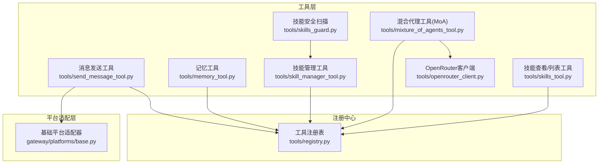
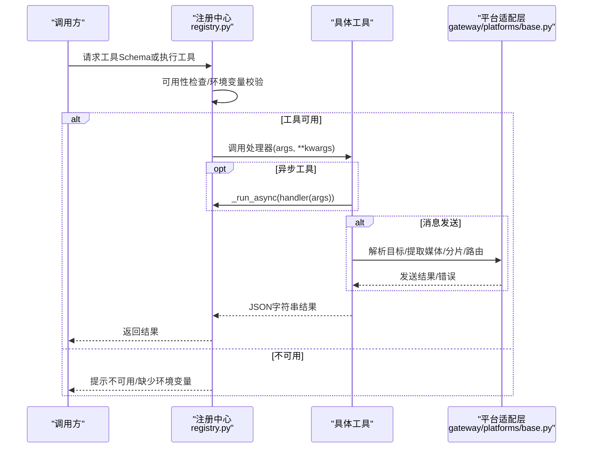
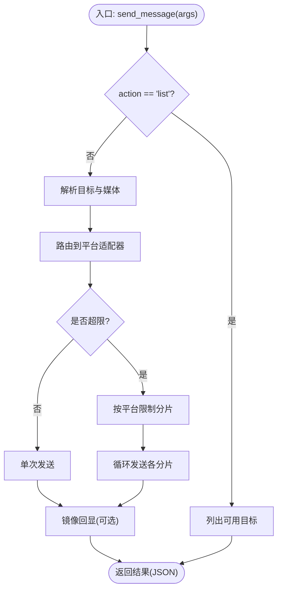
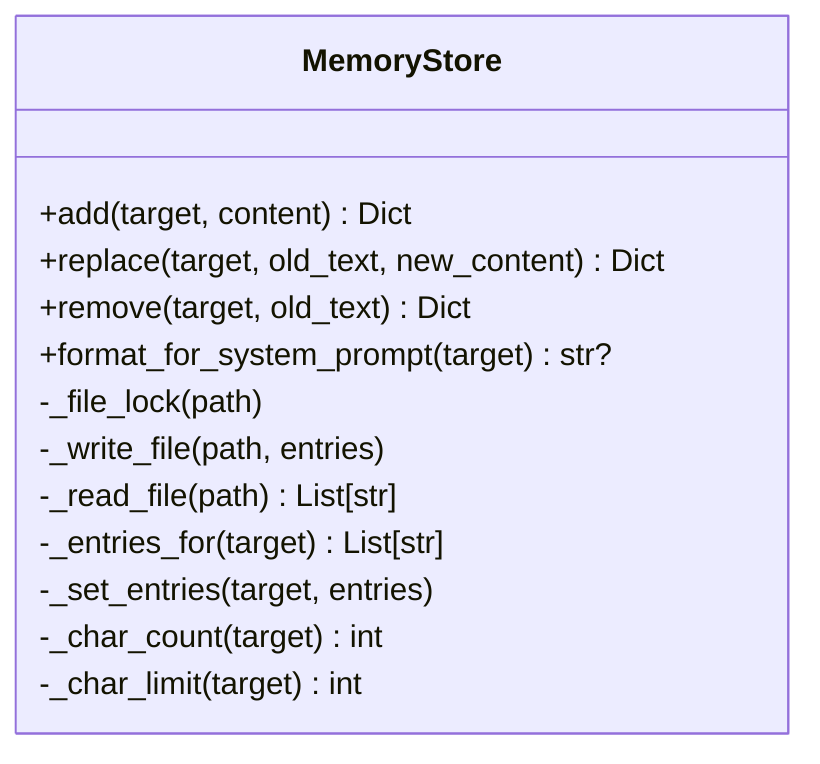
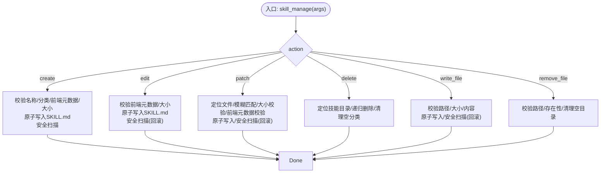
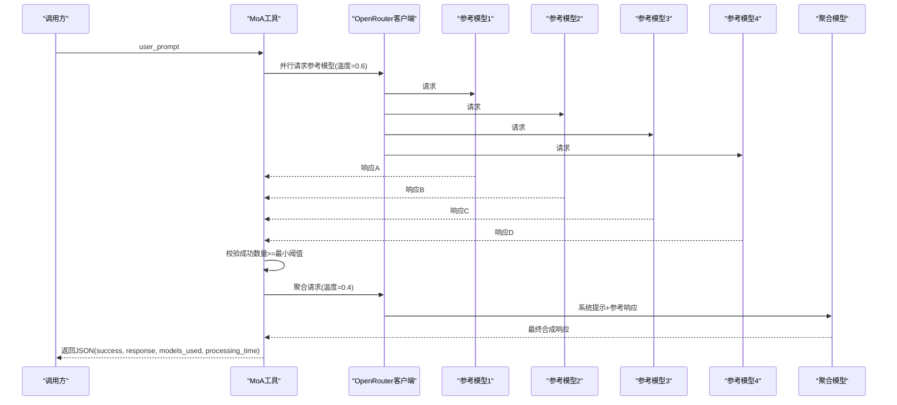
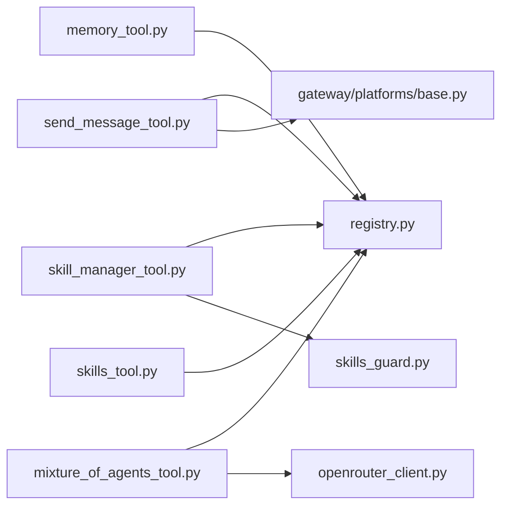

# 专用工具

<cite>
**本文引用的文件**
- [tools/send_message_tool.py](file://tools/send_message_tool.py)
- [tools/memory_tool.py](file://tools/memory_tool.py)
- [tools/skill_manager_tool.py](file://tools/skill_manager_tool.py)
- [tools/mixture_of_agents_tool.py](file://tools/mixture_of_agents_tool.py)
- [tools/registry.py](file://tools/registry.py)
- [tools/skills_tool.py](file://tools/skills_tool.py)
- [tools/skills_guard.py](file://tools/skills_guard.py)
- [tools/openrouter_client.py](file://tools/openrouter_client.py)
- [gateway/platforms/base.py](file://gateway/platforms/base.py)
</cite>

## 目录
1. [简介](#简介)
2. [项目结构](#项目结构)
3. [核心组件](#核心组件)
4. [架构总览](#架构总览)
5. [详细组件分析](#详细组件分析)
6. [依赖分析](#依赖分析)
7. [性能考量](#性能考量)
8. [故障排查指南](#故障排查指南)
9. [结论](#结论)
10. [附录](#附录)

## 简介
本文件面向Hermes Agent的“专用工具”，系统化梳理消息发送、记忆、技能管理与混合代理（MoA）等工具的设计与实现，覆盖平台集成、格式处理、路由机制、数据存储与检索、安全扫描、API接口与参数规范、返回值约定、以及使用建议与选择指导。目标是帮助用户在不同场景下正确、安全、高效地使用这些工具。

## 项目结构
专用工具主要分布在tools目录中，并通过统一的工具注册中心进行集中管理；平台适配层位于gateway/platforms目录，为消息发送工具提供跨平台能力。

图示来源
- [tools/registry.py:1-336](file://tools/registry.py#L1-L336)
- [tools/send_message_tool.py:1-1052](file://tools/send_message_tool.py#L1-L1052)
- [tools/memory_tool.py:1-561](file://tools/memory_tool.py#L1-L561)
- [tools/skill_manager_tool.py:1-762](file://tools/skill_manager_tool.py#L1-L762)
- [tools/mixture_of_agents_tool.py:1-563](file://tools/mixture_of_agents_tool.py#L1-L563)
- [tools/skills_tool.py:1-1359](file://tools/skills_tool.py#L1-L1359)
- [tools/skills_guard.py:1-978](file://tools/skills_guard.py#L1-L978)
- [tools/openrouter_client.py:1-34](file://tools/openrouter_client.py#L1-L34)
- [gateway/platforms/base.py:1-2072](file://gateway/platforms/base.py#L1-L2072)

章节来源
- [tools/registry.py:1-336](file://tools/registry.py#L1-L336)

## 核心组件
- 消息发送工具：支持多平台（Telegram、Discord、Slack、WhatsApp、Signal、Email、SMS、Matrix、Mattermost、HomeAssistant、钉钉、飞书、企业微信、微信、蓝鲸、Webhook等），具备目标解析、媒体提取、智能分片、镜像回显、重复投递跳过等功能。
- 记忆工具：提供个人记忆与用户画像两类持久化存储，采用文件锁与原子写入保障并发安全，遵循“会话前缀快照”以稳定系统提示词注入。
- 技能管理工具：支持技能的创建、编辑、补丁式修改、删除、写入/移除支撑文件，内置安全扫描与路径校验，确保内容合规与文件系统安全。
- 混合代理工具（MoA）：基于多模型协作的推理增强方案，参考前沿研究论文，采用参考模型并行生成与聚合模型合成的两层架构，具备失败容忍与调试日志。
- 工具注册中心：集中管理工具Schema、处理器、可用性检查、异步桥接与结果大小限制等元数据，屏蔽调用细节。
- 平台适配层：提供统一的平台抽象、消息长度计算、代理解析、媒体缓存、URL安全校验等基础设施。

章节来源
- [tools/send_message_tool.py:1-1052](file://tools/send_message_tool.py#L1-L1052)
- [tools/memory_tool.py:1-561](file://tools/memory_tool.py#L1-L561)
- [tools/skill_manager_tool.py:1-762](file://tools/skill_manager_tool.py#L1-L762)
- [tools/mixture_of_agents_tool.py:1-563](file://tools/mixture_of_agents_tool.py#L1-L563)
- [tools/registry.py:1-336](file://tools/registry.py#L1-L336)
- [gateway/platforms/base.py:1-2072](file://gateway/platforms/base.py#L1-L2072)

## 架构总览
专用工具通过注册中心对外暴露统一的函数式Schema，调用时由注册中心根据可用性检查与环境变量决定是否执行，并对异步工具进行桥接。消息发送工具在执行前解析目标、提取媒体、按平台限制进行分片，再路由到对应平台适配器；记忆与技能工具分别负责文件级持久化与目录级治理；MoA工具通过共享OpenRouter客户端并行请求多个前沿模型，最终由聚合模型输出高质量合成结果。

图示来源
- [tools/registry.py:116-167](file://tools/registry.py#L116-L167)
- [tools/send_message_tool.py:317-440](file://tools/send_message_tool.py#L317-L440)
- [gateway/platforms/base.py:779-800](file://gateway/platforms/base.py#L779-L800)

## 详细组件分析

### 消息发送工具（send_message）
- 功能特性
  - 支持平台：Telegram、Discord、Slack、WhatsApp、Signal、Email、SMS、Matrix、Mattermost、HomeAssistant、钉钉、飞书、企业微信、微信、蓝鲸、Webhook等。
  - 目标解析：支持平台名、频道名、聊天ID、主题线程ID等多种形式；可解析人类友好名称为平台ID。
  - 媒体处理：从消息中提取媒体标签，按平台能力进行发送；Telegram支持图片/视频/音频/语音一次性发送，其他平台当前仅文本。
  - 智能分片：依据各平台最大长度限制进行分片，保留代码块边界与Markdown结构。
  - 镜像回显：向会话内镜像已发送消息，便于上下文追踪。
  - 重复投递跳过：当与计划任务自动投递目标一致时，避免冗余发送。
  - 安全与隐私：对错误信息中的敏感参数进行脱敏处理。
- 使用场景
  - 多渠道通知与汇报
  - 自动化脚本与定时任务的消息投递
  - 跨团队沟通与知识广播
- 配置要点
  - 各平台凭据需在网关配置中启用并设置相应环境变量或配置项。
  - Telegram/飞书等平台可能需要额外依赖包。
- API与参数
  - 名称：send_message
  - 参数
    - action: "send" 或 "list"
    - target: "平台[:目标标识]"，如 "telegram:123456789"、"discord:#general"、"slack:G0123456789"
    - message: 文本消息
  - 返回
    - 成功：包含平台、聊天ID、消息ID等字段
    - 失败：包含标准化错误信息（已脱敏）
- 路由机制
  - 解析目标后，按平台映射到对应适配器，必要时进行格式转换（如Slack的mrkdwn、Telegram的MarkdownV2）。
  - 对超长消息进行分片，逐段发送；Telegram支持媒体与文本组合发送。
- 错误处理
  - 统一包装为JSON错误对象，敏感信息脱敏。
  - 对网络/速率限制等可重试错误进行指数退避重试（部分平台）。

图示来源
- [tools/send_message_tool.py:83-228](file://tools/send_message_tool.py#L83-L228)
- [tools/send_message_tool.py:317-440](file://tools/send_message_tool.py#L317-L440)
- [gateway/platforms/base.py:24-75](file://gateway/platforms/base.py#L24-L75)

章节来源
- [tools/send_message_tool.py:1-1052](file://tools/send_message_tool.py#L1-L1052)
- [gateway/platforms/base.py:1-2072](file://gateway/platforms/base.py#L1-L2072)

### 记忆工具（memory）
- 功能特性
  - 存储位置：按用户档案动态解析内存目录，确保多配置文件切换时路径一致。
  - 数据结构：两份独立文件，分别存储“个人笔记/观察”和“用户画像”，以分隔符拼接多条目。
  - 内容扫描：内置威胁模式检测（提示注入、数据外泄、破坏性命令、持久化等），防止危险内容进入系统提示词。
  - 并发安全：文件锁与临时文件+原子替换写入，避免竞态与部分写入。
  - 会话注入：加载时捕获“冻结快照”，保证系统提示词稳定，避免前缀缓存失效。
  - 字符限制：分别为个人记忆与用户画像设定字符上限，超过则拒绝新增。
- 使用场景
  - 长期记忆与用户偏好固化
  - 环境事实与工作流约定的持久化
  - 降低重复输入成本，提升交互效率
- API与参数
  - 名称：memory
  - 参数
    - action: "add"、"replace"、"remove"
    - target: "memory" 或 "user"
    - content: 新增/替换内容
    - old_text: 替换/删除时用于定位的唯一子串
  - 返回
    - 成功：包含条目列表、使用率百分比、条目数量等
    - 失败：错误信息（含原因与当前用量）
- 存储与检索
  - 读取：去重、截断、渲染为系统提示词块
  - 写入：加锁、重载、追加/替换/删除、原子落盘
  - 同步：会话开始时注入快照，会话中变更仅落盘不改变系统提示词

图示来源
- [tools/memory_tool.py:100-437](file://tools/memory_tool.py#L100-L437)

章节来源
- [tools/memory_tool.py:1-561](file://tools/memory_tool.py#L1-L561)

### 技能管理工具（skill_manage）
- 功能特性
  - 技能创建：校验名称/分类合法性、前端元数据完整性、内容大小限制，原子写入SKILL.md。
  - 技能编辑：全量重写，保持前端元数据结构。
  - 补丁式修改：基于模糊匹配的查找替换，支持唯一性约束或全部替换。
  - 文件管理：在references/templates/scripts/assets等受控子目录中添加/删除文件，支持路径安全校验。
  - 删除技能：递归删除目录，清理空分类。
  - 安全扫描：安装前后进行静态扫描，结合信任源策略决定允许/阻断/确认。
- 使用场景
  - 将复杂任务沉淀为可复用的“程序化记忆”
  - 快速迭代与修复技能中的步骤与注意事项
  - 组织化管理技能分类与配套资料
- API与参数
  - 名称：skill_manage
  - 参数
    - action: "create"、"edit"、"patch"、"delete"、"write_file"、"remove_file"
    - name: 技能名称（小写、点号/连字符/下划线）
    - content: 全量SKILL.md内容（含YAML前端元数据）
    - old_string/new_string: 补丁式修改的查找/替换
    - file_path: 支撑文件相对路径（references/templates/scripts/assets）
    - file_content: 写入文件内容
    - replace_all: 是否全部替换
    - category: 可选分类
  - 返回
    - 成功：包含操作结果、路径、提示信息等
    - 失败：错误信息（含唯一匹配提示、文件存在性提示等）
- 安全与合规
  - 扫描规则覆盖外泄、注入、破坏、持久化、网络、混淆、执行、路径遍历、挖矿、供应链、权限提升等类别。
  - 信任源策略：builtin/trusted/community/agent-created四档，决定允许/阻断/确认行为。

图示来源
- [tools/skill_manager_tool.py:588-647](file://tools/skill_manager_tool.py#L588-L647)
- [tools/skills_guard.py:595-640](file://tools/skills_guard.py#L595-L640)

章节来源
- [tools/skill_manager_tool.py:1-762](file://tools/skill_manager_tool.py#L1-L762)
- [tools/skills_guard.py:1-978](file://tools/skills_guard.py#L1-L978)

### 混合代理工具（mixture_of_agents）
- 功能特性
  - 两层架构：参考模型并行生成多样响应，聚合模型综合合成高质量输出。
  - 温度优化：参考模型温度偏高以促进多样性，聚合模型温度较低以提升一致性。
  - 失败容忍：至少需要满足最小成功数才继续聚合，其余失败模型可被忽略。
  - 调试与可观测性：可开启调试模式，记录调用参数、失败模型、处理耗时等。
- 使用场景
  - 复杂数学证明与计算
  - 高难度算法设计与实现
  - 多步骤分析与推理
  - 需要多领域视角的任务
- API与参数
  - 名称：mixture_of_agents
  - 参数
    - user_prompt: 复杂问题描述
    - reference_models/aggregator_model: 可选自定义模型列表
  - 返回
    - 成功：包含success、response、使用的模型列表、处理耗时
    - 失败：包含错误信息与默认模型列表
- 性能与成本
  - 单次调用通常产生5次API请求（4个参考模型+1个聚合模型），延迟较高但质量显著提升。
  - 适合真正困难的问题，避免滥用导致成本飙升。

图示来源
- [tools/mixture_of_agents_tool.py:233-407](file://tools/mixture_of_agents_tool.py#L233-L407)
- [tools/openrouter_client.py:14-34](file://tools/openrouter_client.py#L14-L34)

章节来源
- [tools/mixture_of_agents_tool.py:1-563](file://tools/mixture_of_agents_tool.py#L1-L563)
- [tools/openrouter_client.py:1-34](file://tools/openrouter_client.py#L1-L34)

### 工具注册中心（registry）
- 职责
  - 统一注册所有工具的Schema、处理器、可用性检查、异步桥接、环境变量要求与结果大小限制。
  - 提供工具查询、可用性检查、工具集元数据汇总与工具到工具集映射。
- 关键能力
  - dispatch：根据名称分发到处理器，自动桥接异步工具，捕获异常并返回标准错误格式。
  - get_definitions：按工具名集合返回OpenAI兼容的函数Schema，自动过滤不可用工具。
  - 工具集可用性：按工具集维度进行检查，支持UI展示与配置提示。

章节来源
- [tools/registry.py:1-336](file://tools/registry.py#L1-L336)

### 技能查看/列表工具（skills_tool）
- 功能
  - 技能分类：扫描本地与外部技能目录，统计分类与技能数量，支持描述文件加载。
  - 技能列表：按平台过滤、去重、排序，仅返回名称与简述，降低令牌消耗。
  - 技能视图：按需加载完整内容、标签、相关文件等。
- 适用场景
  - 快速发现与浏览技能
  - 在使用前预览技能内容与前置条件
- 注意
  - 平台兼容性与前置环境变量会参与筛选与就绪状态评估。

章节来源
- [tools/skills_tool.py:1-1359](file://tools/skills_tool.py#L1-L1359)

## 依赖分析
- 工具到注册中心
  - 各工具模块在导入时通过注册中心完成Schema与处理器登记，形成松耦合的扩展机制。
- 消息发送到平台适配层
  - 通过统一的平台适配器接口与工具常量，实现跨平台的一致行为与安全控制。
- MoA到OpenRouter
  - 通过共享客户端封装认证与请求格式，统一温度策略与重试逻辑。
- 技能管理到安全扫描
  - 安装前后均进行扫描，结合信任源策略决定是否允许，确保社区/外部技能的安全性。

图示来源
- [tools/registry.py:1-336](file://tools/registry.py#L1-L336)
- [tools/send_message_tool.py:1-1052](file://tools/send_message_tool.py#L1-L1052)
- [tools/memory_tool.py:1-561](file://tools/memory_tool.py#L1-L561)
- [tools/skill_manager_tool.py:1-762](file://tools/skill_manager_tool.py#L1-L762)
- [tools/mixture_of_agents_tool.py:1-563](file://tools/mixture_of_agents_tool.py#L1-L563)
- [tools/skills_tool.py:1-1359](file://tools/skills_tool.py#L1-L1359)
- [tools/skills_guard.py:1-978](file://tools/skills_guard.py#L1-L978)
- [tools/openrouter_client.py:1-34](file://tools/openrouter_client.py#L1-L34)
- [gateway/platforms/base.py:1-2072](file://gateway/platforms/base.py#L1-L2072)

章节来源
- [tools/registry.py:1-336](file://tools/registry.py#L1-L336)
- [tools/send_message_tool.py:1-1052](file://tools/send_message_tool.py#L1-L1052)
- [tools/skill_manager_tool.py:1-762](file://tools/skill_manager_tool.py#L1-L762)
- [tools/mixture_of_agents_tool.py:1-563](file://tools/mixture_of_agents_tool.py#L1-L563)
- [tools/skills_guard.py:1-978](file://tools/skills_guard.py#L1-L978)
- [tools/openrouter_client.py:1-34](file://tools/openrouter_client.py#L1-L34)
- [gateway/platforms/base.py:1-2072](file://gateway/platforms/base.py#L1-L2072)

## 性能考量
- 消息发送
  - 分片与格式转换带来少量CPU开销；媒体发送在Telegram上为一次性请求，其他平台按文本分段发送。
  - 可通过合理的目标解析与镜像回显减少重复发送与上下文重建成本。
- 记忆工具
  - 文件锁与原子写入确保一致性，但会增加I/O开销；建议批量写入或合并频繁更新。
  - “冻结快照”避免系统提示词频繁变化，有利于长会话的前缀缓存命中。
- 技能管理
  - 模糊匹配与安全扫描会引入额外时间；建议在技能创建阶段集中处理，避免频繁补丁式修改。
- MoA
  - 单次调用涉及多次API请求，延迟与成本显著上升；仅在确实需要时使用，并考虑缓存中间结果。

## 故障排查指南
- 消息发送
  - 平台未配置：检查网关配置与环境变量；确认平台启用状态。
  - 目标解析失败：使用list动作先获取可用目标，再精确指定ID或主题线程。
  - 媒体发送受限：当前仅Telegram支持媒体一次性发送，其他平台仅文本。
  - 重复投递：若与计划任务自动投递目标相同，工具会自动跳过并提示。
  - 错误脱敏：工具对敏感参数进行脱敏，便于用户与模型查看。
- 记忆工具
  - 内容过大：超过字符限制会拒绝新增；请精简内容或删除冗余条目。
  - 注入/外泄检测：若触发威胁模式，将直接阻止写入并给出明确原因。
  - 并发冲突：工具内部已加锁与原子写入，一般无需手动干预。
- 技能管理
  - 路径遍历：禁止使用“..”等非法路径；确保文件在受控子目录内。
  - 安全扫描阻断：若扫描发现高危/警示项，需根据信任源策略决定是否强制安装或修正内容。
  - 唯一匹配：补丁式修改要求old_text具有唯一性，否则需更精确或开启全部替换。
- MoA
  - API密钥缺失：需设置OPENROUTER_API_KEY；否则无法发起请求。
  - 失败容忍：若参考模型失败数量超过阈值，将直接返回错误；可适当放宽或更换模型。
  - 调试模式：可通过环境变量开启调试，记录详细处理过程与指标。

章节来源
- [tools/send_message_tool.py:38-48](file://tools/send_message_tool.py#L38-L48)
- [tools/memory_tool.py:85-98](file://tools/memory_tool.py#L85-L98)
- [tools/skill_manager_tool.py:217-243](file://tools/skill_manager_tool.py#L217-L243)
- [tools/mixture_of_agents_tool.py:299-301](file://tools/mixture_of_agents_tool.py#L299-L301)

## 结论
Hermes Agent的专用工具围绕“跨平台消息发送、持久化记忆、程序化技能与多模型协作”四大能力构建，通过注册中心实现统一调度与安全控制，借助平台适配层与OpenRouter客户端保障可扩展性与稳定性。建议在实际使用中优先选择合适工具：简单通知用消息发送，长期知识沉淀用记忆工具，可复用流程用技能管理，极端推理难题用MoA工具，并严格遵循安全扫描与环境配置要求。

## 附录
- 工具选择指导
  - 需要在多平台间传递消息：优先使用消息发送工具，配合list动作确认目标。
  - 需要长期记忆与用户画像：使用记忆工具，注意内容合规与字符限制。
  - 需要沉淀可复用流程：使用技能管理工具，先在本地测试并通过安全扫描。
  - 需要复杂推理与高质量输出：使用MoA工具，仅在确有必要时启用。
- 使用建议
  - 配置优先：确保平台凭据与环境变量齐全，避免运行时失败。
  - 安全第一：技能管理务必通过安全扫描，谨慎处理敏感信息。
  - 成本控制：MoA工具成本较高，建议缓存结果与复用中间产物。
  - 观测性：开启调试模式以便快速定位问题。