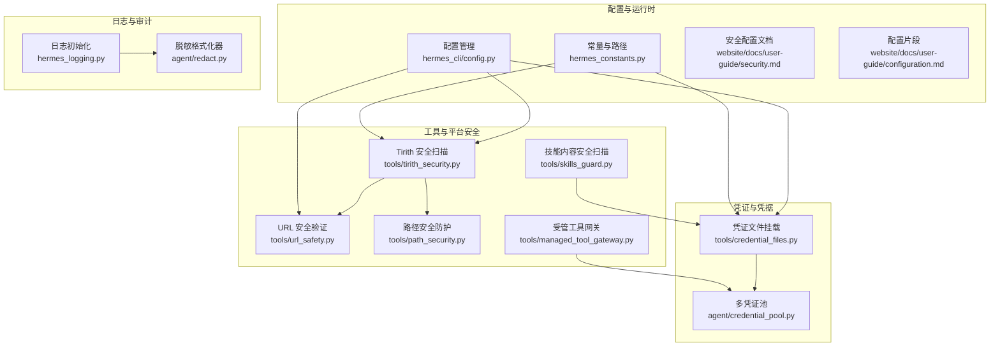
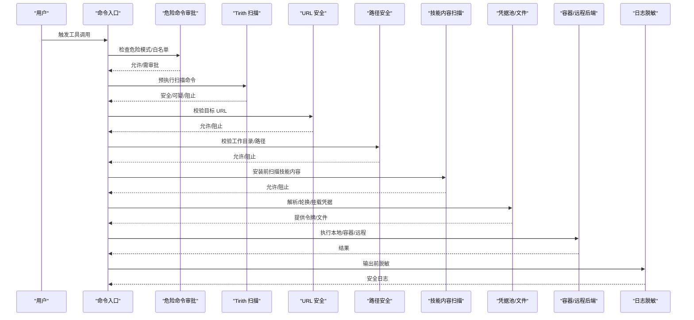
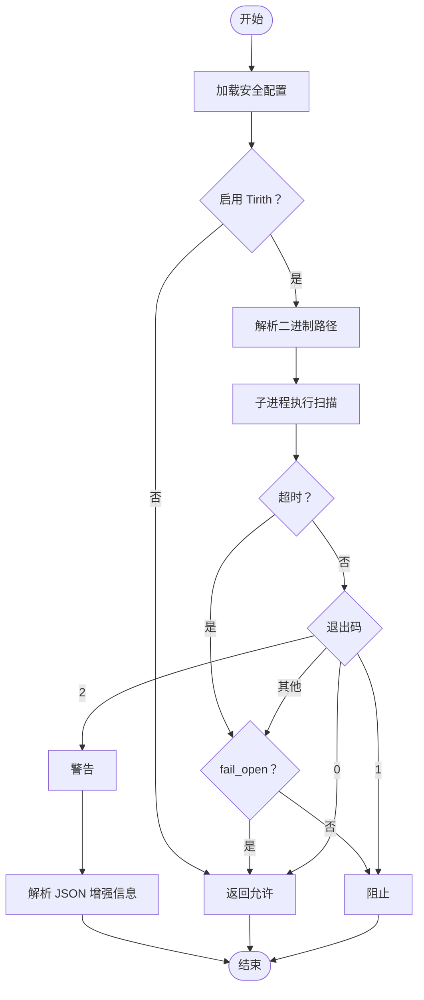
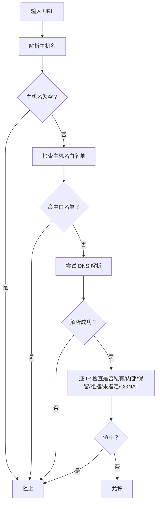
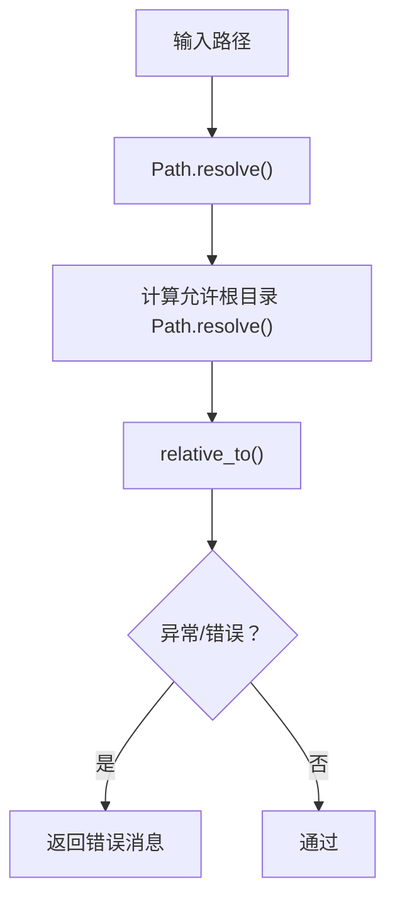
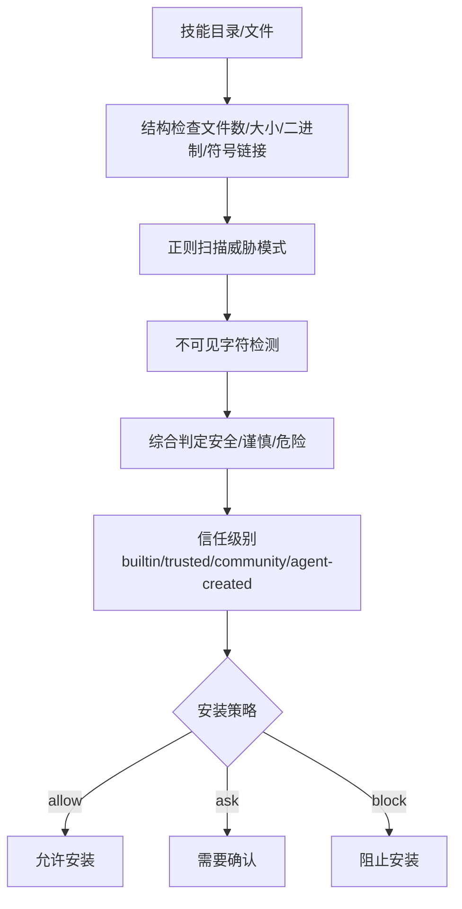
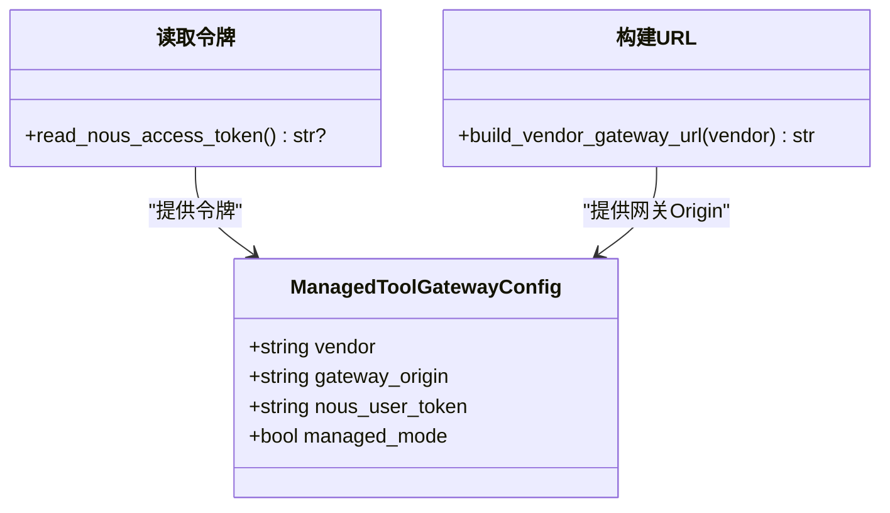
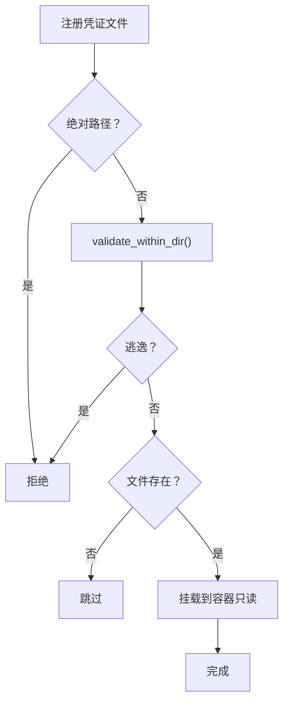
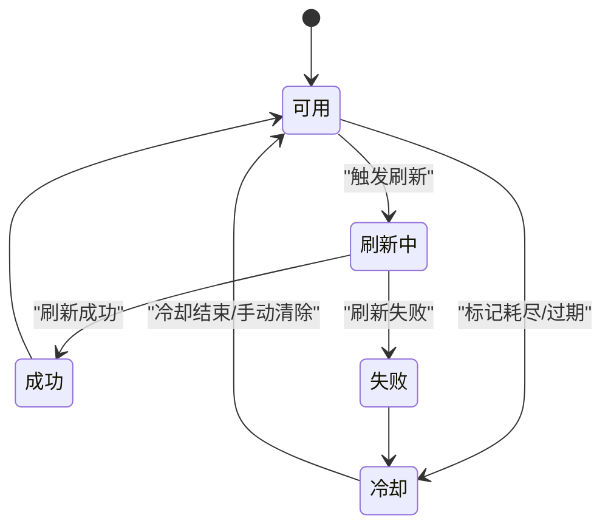
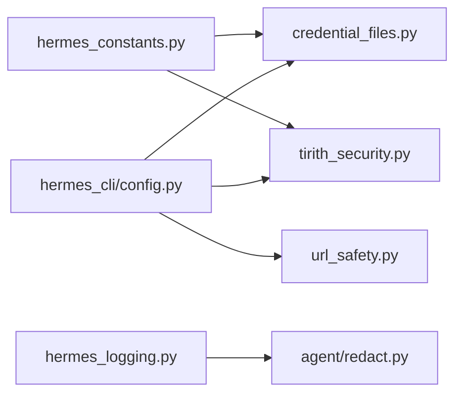

# 工具安全与权限

<cite>
**本文引用的文件**
- [tirith_security.py](file://tools/tirith_security.py)
- [url_safety.py](file://tools/url_safety.py)
- [path_security.py](file://tools/path_security.py)
- [credential_files.py](file://tools/credential_files.py)
- [skills_guard.py](file://tools/skills_guard.py)
- [managed_tool_gateway.py](file://tools/managed_tool_gateway.py)
- [credential_pool.py](file://agent/credential_pool.py)
- [hermes_constants.py](file://hermes_constants.py)
- [config.py](file://hermes_cli/config.py)
- [security.md](file://website/docs/user-guide/security.md)
- [configuration.md](file://website/docs/user-guide/configuration.md)
- [hermes_logging.py](file://hermes_logging.py)
- [redact.py](file://agent/redact.py)
</cite>

## 目录
1. [简介](#简介)
2. [项目结构](#项目结构)
3. [核心组件](#核心组件)
4. [架构总览](#架构总览)
5. [详细组件分析](#详细组件分析)
6. [依赖分析](#依赖分析)
7. [性能考虑](#性能考虑)
8. [故障排查指南](#故障排查指南)
9. [结论](#结论)
10. [附录](#附录)

## 简介
本文件系统性梳理 Hermes Agent 的工具安全与权限体系，覆盖命令预执行安全扫描（Tirith）、URL 安全验证、路径安全防护、凭证文件的安全存储与访问控制、工具执行的容器隔离与资源限制、日志与审计、异常检测以及合规与最佳实践。目标是帮助用户在不同部署形态下正确配置与评估工具安全风险。

## 项目结构
围绕工具安全的关键模块分布如下：
- 命令与工具安全：tools/tirith_security.py、tools/url_safety.py、tools/path_security.py、tools/skills_guard.py、tools/managed_tool_gateway.py
- 凭证与凭据池：tools/credential_files.py、agent/credential_pool.py
- 配置与常量：hermes_cli/config.py、hermes_constants.py
- 文档与配置示例：website/docs/user-guide/security.md、website/docs/user-guide/configuration.md
- 日志与脱敏：hermes_logging.py、agent/redact.py

图表来源
- [tirith_security.py:1-671](file://tools/tirith_security.py#L1-L671)
- [url_safety.py:1-98](file://tools/url_safety.py#L1-L98)
- [path_security.py:1-44](file://tools/path_security.py#L1-L44)
- [skills_guard.py:1-978](file://tools/skills_guard.py#L1-L978)
- [managed_tool_gateway.py:1-168](file://tools/managed_tool_gateway.py#L1-L168)
- [credential_files.py:1-408](file://tools/credential_files.py#L1-L408)
- [credential_pool.py:1-1357](file://agent/credential_pool.py#L1-L1357)
- [hermes_constants.py:1-200](file://hermes_constants.py#L1-L200)
- [config.py:1-3082](file://hermes_cli/config.py#L1-L3082)
- [security.md:1-560](file://website/docs/user-guide/security.md#L1-L560)
- [configuration.md:1145-1166](file://website/docs/user-guide/configuration.md#L1145-L1166)
- [hermes_logging.py:235-278](file://hermes_logging.py#L235-L278)
- [redact.py:155-181](file://agent/redact.py#L155-L181)

章节来源
- [security.md:1-560](file://website/docs/user-guide/security.md#L1-L560)
- [configuration.md:1145-1166](file://website/docs/user-guide/configuration.md#L1145-L1166)

## 核心组件
- Tirith 预执行安全扫描：对终端命令进行内容级威胁检测，支持自动安装、校验与失败开闭策略。
- URL 安全验证：阻断私有/内部网络地址与云元数据端点，DNS 失败即阻断。
- 路径安全防护：统一的路径解析与遍历检查，防止逃逸到允许目录之外。
- 技能内容安全扫描：基于正则的静态扫描与信任策略，决定是否允许安装。
- 受管工具网关：通过 Nous 订阅令牌与共享网关域名，安全转发工具请求。
- 凭证文件挂载与凭据池：仅挂载相对且受限的主机文件，支持凭据轮换与过期冷却。
- 配置与常量：集中管理 HERMES_HOME、缓存目录布局与子进程 HOME 隔离。
- 日志与脱敏：统一日志初始化与脱敏格式化器，保护敏感信息。

章节来源
- [tirith_security.py:600-671](file://tools/tirith_security.py#L600-L671)
- [url_safety.py:51-98](file://tools/url_safety.py#L51-L98)
- [path_security.py:15-44](file://tools/path_security.py#L15-L44)
- [skills_guard.py:595-713](file://tools/skills_guard.py#L595-L713)
- [managed_tool_gateway.py:132-168](file://tools/managed_tool_gateway.py#L132-L168)
- [credential_files.py:55-102](file://tools/credential_files.py#L55-L102)
- [credential_pool.py:358-415](file://agent/credential_pool.py#L358-L415)
- [hermes_constants.py:11-137](file://hermes_constants.py#L11-L137)
- [hermes_logging.py:235-278](file://hermes_logging.py#L235-L278)
- [redact.py:173-181](file://agent/redact.py#L173-L181)

## 架构总览
Hermes 在“危险命令审批”“容器隔离”“MCP 环境变量过滤”“上下文文件扫描”“跨会话隔离”“输入参数白名单”等七层边界内运行。工具调用链路中，命令在本地或远程后端执行前，先经 Tirith 扫描与 URL/路径/技能内容三类安全检查；凭证通过凭据池与只读挂载进入容器；日志输出前进行脱敏处理。

图表来源
- [tirith_security.py:600-671](file://tools/tirith_security.py#L600-L671)
- [url_safety.py:51-98](file://tools/url_safety.py#L51-L98)
- [path_security.py:15-44](file://tools/path_security.py#L15-L44)
- [skills_guard.py:595-713](file://tools/skills_guard.py#L595-L713)
- [credential_pool.py:358-415](file://agent/credential_pool.py#L358-L415)
- [hermes_logging.py:235-278](file://hermes_logging.py#L235-L278)
- [redact.py:173-181](file://agent/redact.py#L173-L181)

## 详细组件分析

### Tirith 安全检查
- 自动安装与校验：首次使用从 GitHub Releases 下载，支持 cosign 供应链证明与 SHA-256 校验；失败原因持久化并在 24 小时内抑制重试。
- 运行时行为：以子进程方式执行，超时或 spawn 失败遵循 fail_open/fail_closed 配置；退出码映射为允许/警告/阻止，JSON 输出仅增强不覆盖判定。
- 配置项：启用开关、二进制路径、超时、失败策略，均支持环境变量覆盖。

图表来源
- [tirith_security.py:600-671](file://tools/tirith_security.py#L600-L671)

章节来源
- [tirith_security.py:68-87](file://tools/tirith_security.py#L68-L87)
- [tirith_security.py:281-372](file://tools/tirith_security.py#L281-L372)
- [tirith_security.py:379-476](file://tools/tirith_security.py#L379-L476)
- [tirith_security.py:510-590](file://tools/tirith_security.py#L510-L590)
- [tirith_security.py:600-671](file://tools/tirith_security.py#L600-L671)
- [configuration.md:1145-1166](file://website/docs/user-guide/configuration.md#L1145-L1166)

### URL 安全验证
- 主机名白名单：显式阻断 metadata.google.internal、metadata.goog 等内部主机名。
- 私有/内部地址阻断：私有、回环、链路本地、保留、组播、未指定、CGNAT（100.64.0.0/10）等。
- DNS 失败即阻断：解析失败直接阻止，避免 SSRF 与 DNS 重绑定绕过。
- 重定向链：在各平台适配器与媒体缓存辅助中二次校验每跳目标。

图表来源
- [url_safety.py:51-98](file://tools/url_safety.py#L51-L98)

章节来源
- [url_safety.py:26-48](file://tools/url_safety.py#L26-L48)
- [url_safety.py:51-98](file://tools/url_safety.py#L51-L98)
- [security.md:470-482](file://website/docs/user-guide/security.md#L470-L482)

### 路径安全防护
- 统一校验：使用 Path.resolve() 与 relative_to()，拒绝任何解析后逃逸至允许根目录之外的路径。
- 快速检查：has_traversal_component() 在完整解析前快速识别明显遍历组件。
- 场景：技能管理、cronjob、凭证文件注册等广泛复用。

图表来源
- [path_security.py:15-44](file://tools/path_security.py#L15-L44)

章节来源
- [path_security.py:15-44](file://tools/path_security.py#L15-L44)

### 技能内容安全扫描（Skills Guard）
- 信任策略：builtin/trusted/community/agent-created 四档信任，结合“安全/谨慎/危险”三档判定决定安装。
- 正则扫描：覆盖数据外泄、提示词注入、破坏性操作、持久化、网络、混淆、执行、路径遍历、挖矿、供应链、提权、配置持久化、硬编码密钥等。
- 结构检查：文件数量、总大小、单文件大小、二进制扩展名、符号链接、不可见 Unicode 字符。
- 决策：支持强制安装覆盖，生成可读报告。

图表来源
- [skills_guard.py:595-713](file://tools/skills_guard.py#L595-L713)
- [skills_guard.py:734-800](file://tools/skills_guard.py#L734-L800)

章节来源
- [skills_guard.py:39-76](file://tools/skills_guard.py#L39-L76)
- [skills_guard.py:82-484](file://tools/skills_guard.py#L82-L484)
- [skills_guard.py:595-713](file://tools/skills_guard.py#L595-L713)
- [security.md:483-521](file://website/docs/user-guide/security.md#L483-L521)

### 受管工具网关（Managed Tool Gateway）
- 网关 URL 解析：支持环境变量覆盖，否则按 vendor-gateway.domain 构造。
- 访问令牌：优先环境变量，其次 auth.json 中 Nous Provider 缓存，最后刷新获取。
- 配置封装：返回冻结配置对象，便于后续工具调用。

图表来源
- [managed_tool_gateway.py:22-168](file://tools/managed_tool_gateway.py#L22-L168)

章节来源
- [managed_tool_gateway.py:30-103](file://tools/managed_tool_gateway.py#L30-L103)
- [managed_tool_gateway.py:117-168](file://tools/managed_tool_gateway.py#L117-L168)

### 凭证文件的安全存储与访问控制
- 注册与挂载：仅允许相对路径且解析后位于 HERMES_HOME 内；支持用户配置与技能声明两种来源；容器内以只读挂载。
- 技能目录安全：检测并跳过符号链接，必要时复制为干净副本，避免容器内暴露宿主任意文件。
- 缓存目录镜像：文档、图片、音频、截图等缓存目录映射到容器，保持新布局一致性。
- 清理与会话隔离：使用 ContextVar 防止跨会话数据泄漏；会话重置时清空注册表。

图表来源
- [credential_files.py:55-102](file://tools/credential_files.py#L55-L102)
- [credential_files.py:175-198](file://tools/credential_files.py#L175-L198)
- [credential_files.py:201-243](file://tools/credential_files.py#L201-L243)

章节来源
- [credential_files.py:31-47](file://tools/credential_files.py#L31-L47)
- [credential_files.py:55-102](file://tools/credential_files.py#L55-L102)
- [credential_files.py:130-173](file://tools/credential_files.py#L130-L173)
- [credential_files.py:201-290](file://tools/credential_files.py#L201-L290)
- [credential_files.py:352-401](file://tools/credential_files.py#L352-L401)
- [hermes_constants.py:73-91](file://hermes_constants.py#L73-L91)

### 凭据池与轮换策略
- 多凭证池：同一 Provider 的多个凭据条目，支持随机、最少使用、轮询等选择策略。
- 冷却与过期：根据 429/402 或 provider reset_at 计算冷却时间；到期后自动清理状态。
- 刷新与同步：OAuth 刷新失败时尝试从外部状态同步最新令牌；刷新后写回 auth.json 与 CLI 文件，避免“刷新令牌已使用”问题。
- 并发与租约：软租约限制并发使用，防止过度消耗配额。

图表来源
- [credential_pool.py:358-415](file://agent/credential_pool.py#L358-L415)
- [credential_pool.py:547-741](file://agent/credential_pool.py#L547-L741)
- [credential_pool.py:823-882](file://agent/credential_pool.py#L823-L882)

章节来源
- [credential_pool.py:358-415](file://agent/credential_pool.py#L358-L415)
- [credential_pool.py:547-741](file://agent/credential_pool.py#L547-L741)
- [credential_pool.py:823-882](file://agent/credential_pool.py#L823-L882)

### 工具执行的沙箱隔离、资源限制与监控
- 容器隔离：Docker 后端默认丢弃所有能力、限制 PID 数、限制 /tmp 等 tmpfs、限制进程数、持久/临时文件系统策略。
- 资源限制：CPU、内存、磁盘大小可在配置中设置；建议生产环境使用容器后端以消除本地危险命令审批需求。
- 监控与日志：独立 gateway 日志、错误日志轮转；日志格式化器统一脱敏。

章节来源
- [security.md:271-320](file://website/docs/user-guide/security.md#L271-L320)
- [security.md:321-331](file://website/docs/user-guide/security.md#L321-L331)
- [security.md:416-450](file://website/docs/user-guide/security.md#L416-L450)
- [hermes_logging.py:235-278](file://hermes_logging.py#L235-L278)

### 工具安全审计、日志记录与异常检测
- 审计范围：危险命令审批、URL/路径/技能扫描、MCP 环境变量过滤、凭证文件挂载、容器资源限制。
- 日志脱敏：统一格式化器替换密钥、令牌、密码等敏感模式；错误日志单独轮转。
- 异常检测：Tirith 失败开闭、DNS 失败阻断、未知退出码按 fail_open/fail_closed 处理、容器清理吞错。

章节来源
- [tirith_security.py:627-652](file://tools/tirith_security.py#L627-L652)
- [url_safety.py:93-97](file://tools/url_safety.py#L93-L97)
- [redact.py:173-181](file://agent/redact.py#L173-L181)
- [hermes_logging.py:235-278](file://hermes_logging.py#L235-L278)

### 合规要求与最佳实践
- 生产部署清单：明确允许列表、容器后端、资源限制、密钥安全存放、DM 配对、命令白名单、禁止在敏感目录工作、非 root 运行、日志监控、定期更新。
- 网络隔离：建议将网关与命令执行分离，使用 SSH 后端或容器后端。
- 环境变量透传：仅透传技能声明或显式配置的变量；避免将基础设施密钥加入透传列表。

章节来源
- [security.md:522-560](file://website/docs/user-guide/security.md#L522-L560)

## 依赖分析
- 常量与路径：HERMES_HOME、缓存目录布局、子进程 HOME 隔离由 hermes_constants.py 提供，被 credential_files、tirith_security 等广泛使用。
- 配置与策略：hermes_cli/config.py 提供配置加载与管理，影响 Tirith、URL 安全、容器资源等策略。
- 日志与脱敏：hermes_logging.py 初始化日志与处理器，redact.py 提供脱敏格式化器，贯穿工具执行链路。

图表来源
- [hermes_constants.py:11-137](file://hermes_constants.py#L11-L137)
- [config.py:1-200](file://hermes_cli/config.py#L1-L200)
- [credential_files.py:50-53](file://tools/credential_files.py#L50-L53)
- [tirith_security.py:37-39](file://tools/tirith_security.py#L37-L39)
- [hermes_logging.py:235-278](file://hermes_logging.py#L235-L278)
- [redact.py:173-181](file://agent/redact.py#L173-L181)

章节来源
- [hermes_constants.py:11-137](file://hermes_constants.py#L11-L137)
- [config.py:1-200](file://hermes_cli/config.py#L1-L200)
- [hermes_logging.py:235-278](file://hermes_logging.py#L235-L278)
- [redact.py:173-181](file://agent/redact.py#L173-L181)

## 性能考虑
- Tirith 自动安装采用后台线程，避免启动阻塞；失败原因持久化减少重复网络尝试。
- URL 安全验证与路径安全检查为 O(1)/O(n) 常数/线性复杂度，开销极低。
- 技能扫描按文本文件进行正则匹配，文件数与大小受结构检查约束，避免异常大包导致扫描时间过长。
- 容器后端通过 tmpfs 限制临时空间，避免磁盘 IO 影响；持久卷策略按需开启。

## 故障排查指南
- Tirith 不可用或超时
  - 检查配置项：tirith_enabled、tirith_path、tirith_timeout、tirith_fail_open。
  - 查看失败原因标记文件（24 小时内抑制重试），cosign 缺失时可等待其就绪后自动重试。
  - 章节来源
    - [tirith_security.py:68-87](file://tools/tirith_security.py#L68-L87)
    - [tirith_security.py:113-175](file://tools/tirith_security.py#L113-L175)
    - [tirith_security.py:510-590](file://tools/tirith_security.py#L510-L590)
    - [configuration.md:1145-1166](file://website/docs/user-guide/configuration.md#L1145-L1166)

- URL 被阻断
  - 检查是否命中主机名白名单或私有/内部地址；DNS 失败会被阻断。
  - 章节来源
    - [url_safety.py:26-48](file://tools/url_safety.py#L26-L48)
    - [url_safety.py:51-98](file://tools/url_safety.py#L51-L98)

- 路径逃逸
  - 使用 validate_within_dir() 返回的错误消息定位具体逃逸路径；避免使用绝对路径与包含 “..” 的相对路径。
  - 章节来源
    - [path_security.py:15-44](file://tools/path_security.py#L15-L44)

- 技能安装被阻止
  - 查看扫描报告中的严重级别与类别；根据信任级别与策略决定是否强制安装。
  - 章节来源
    - [skills_guard.py:642-677](file://tools/skills_guard.py#L642-L677)
    - [skills_guard.py:679-713](file://tools/skills_guard.py#L679-L713)

- 凭证文件未挂载
  - 确认路径相对且位于 HERMES_HOME 内；检查容器只读挂载与技能声明；核对配置项 terminal.credential_files。
  - 章节来源
    - [credential_files.py:55-102](file://tools/credential_files.py#L55-L102)
    - [credential_files.py:130-173](file://tools/credential_files.py#L130-L173)
    - [credential_files.py:175-198](file://tools/credential_files.py#L175-L198)

- 日志泄露风险
  - 确保使用 RedactingFormatter；检查日志轮转与权限；避免将敏感信息写入 stdout。
  - 章节来源
    - [hermes_logging.py:235-278](file://hermes_logging.py#L235-L278)
    - [redact.py:173-181](file://agent/redact.py#L173-L181)

## 结论
Hermes Agent 通过“命令预执行扫描 + URL/路径/技能内容三重安全 + 受管工具网关 + 凭据池与只读挂载 + 容器隔离 + 日志脱敏”的纵深防御模型，有效降低工具调用带来的安全风险。建议在生产环境启用容器后端、严格允许列表、最小化环境变量透传，并定期审查配置与日志。

## 附录
- 安全配置参考
  - 章节来源
    - [configuration.md:1145-1166](file://website/docs/user-guide/configuration.md#L1145-L1166)
    - [security.md:483-521](file://website/docs/user-guide/security.md#L483-L521)