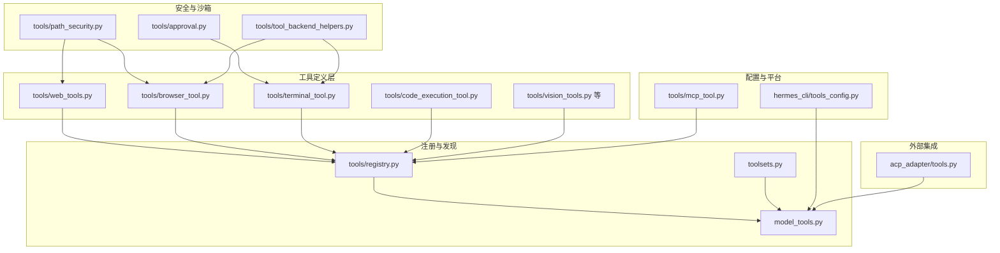
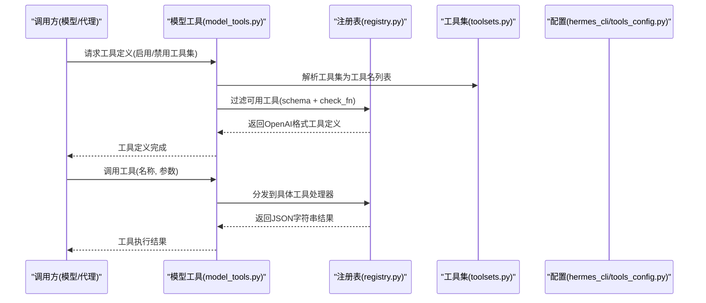
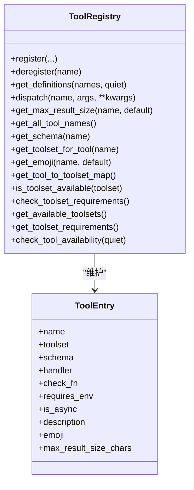
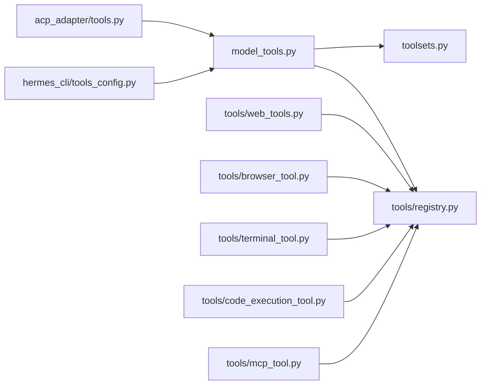

# 工具概念与架构

<cite>
**本文引用的文件**
- [tools/__init__.py](file://tools/__init__.py)
- [tools/registry.py](file://tools/registry.py)
- [model_tools.py](file://model_tools.py)
- [toolsets.py](file://toolsets.py)
- [hermes_cli/tools_config.py](file://hermes_cli/tools_config.py)
- [acp_adapter/tools.py](file://acp_adapter/tools.py)
- [tools/web_tools.py](file://tools/web_tools.py)
- [tools/browser_tool.py](file://tools/browser_tool.py)
- [tools/terminal_tool.py](file://tools/terminal_tool.py)
- [tools/approval.py](file://tools/approval.py)
- [tools/path_security.py](file://tools/path_security.py)
- [tools/code_execution_tool.py](file://tools/code_execution_tool.py)
- [tools/tool_backend_helpers.py](file://tools/tool_backend_helpers.py)
- [tools/mcp_tool.py](file://tools/mcp_tool.py)
- [toolset_distributions.py](file://toolset_distributions.py)
- [run_agent.py](file://run_agent.py)
</cite>

## 目录
1. [引言](#引言)
2. [项目结构](#项目结构)
3. [核心组件](#核心组件)
4. [架构总览](#架构总览)
5. [详细组件分析](#详细组件分析)
6. [依赖分析](#依赖分析)
7. [性能考量](#性能考量)
8. [故障排查指南](#故障排查指南)
9. [结论](#结论)
10. [附录](#附录)

## 引言
本文件系统化阐述 Hermes Agent 的工具概念与架构，覆盖工具注册机制、生命周期管理、分类体系、命名规范与版本管理、加载与依赖解析、初始化流程、与代理系统的集成与通信协议、安全模型与权限控制、沙箱机制、最佳实践与设计原则，以及扩展性与性能优化策略。目标是帮助开发者与平台集成者快速理解并高效扩展工具生态。

## 项目结构
Hermes Agent 将工具按功能域拆分为独立模块（如浏览器、终端、文件、网络、视觉等），通过中央注册表统一收集与分发；工具集（toolset）用于对工具进行组合与按场景启用；配置层负责工具集的启用/禁用、后端提供商选择与环境变量注入；运行时由模型工具层负责发现、过滤、调度与结果序列化。

图示来源
- [tools/web_tools.py:1-200](file://tools/web_tools.py#L1-L200)
- [tools/browser_tool.py:1-200](file://tools/browser_tool.py#L1-L200)
- [tools/terminal_tool.py:1-200](file://tools/terminal_tool.py#L1-L200)
- [tools/code_execution_tool.py:1-200](file://tools/code_execution_tool.py#L1-L200)
- [tools/registry.py:1-336](file://tools/registry.py#L1-L336)
- [model_tools.py:1-578](file://model_tools.py#L1-L578)
- [toolsets.py:1-656](file://toolsets.py#L1-L656)
- [hermes_cli/tools_config.py:1-800](file://hermes_cli/tools_config.py#L1-L800)
- [tools/mcp_tool.py:1746-1775](file://tools/mcp_tool.py#L1746-L1775)
- [tools/approval.py:1-200](file://tools/approval.py#L1-L200)
- [tools/path_security.py:1-44](file://tools/path_security.py#L1-L44)
- [tools/tool_backend_helpers.py:1-90](file://tools/tool_backend_helpers.py#L1-L90)
- [acp_adapter/tools.py:1-215](file://acp_adapter/tools.py#L1-L215)

章节来源
- [tools/__init__.py:1-26](file://tools/__init__.py#L1-L26)
- [tools/registry.py:1-336](file://tools/registry.py#L1-L336)
- [model_tools.py:1-578](file://model_tools.py#L1-L578)
- [toolsets.py:1-656](file://toolsets.py#L1-L656)
- [hermes_cli/tools_config.py:1-800](file://hermes_cli/tools_config.py#L1-L800)
- [acp_adapter/tools.py:1-215](file://acp_adapter/tools.py#L1-L215)

## 核心组件
- 中央注册表：集中收集工具元数据、处理器与可用性检查函数，提供查询、过滤与分发能力。
- 模型工具层：触发工具发现、根据工具集过滤生成模型可用的工具定义、执行工具调用、参数类型强制转换、错误统一处理。
- 工具集系统：以可组合的方式定义工具集合，支持内置与插件动态注册，提供解析与校验。
- 配置与平台：统一工具配置入口，支持按平台启用工具集、提供商选择、环境变量注入与后置安装步骤。
- 安全与沙箱：危险命令检测与审批、路径合法性校验、环境变量透传白名单、终端/容器/云沙箱隔离。
- 外部集成：ACP 工具映射与事件构建、MCP 动态工具发现与注册。

章节来源
- [tools/registry.py:24-291](file://tools/registry.py#L24-L291)
- [model_tools.py:132-185](file://model_tools.py#L132-L185)
- [toolsets.py:395-615](file://toolsets.py#L395-L615)
- [hermes_cli/tools_config.py:44-800](file://hermes_cli/tools_config.py#L44-L800)
- [tools/approval.py:75-133](file://tools/approval.py#L75-L133)
- [tools/path_security.py:15-44](file://tools/path_security.py#L15-L44)
- [tools/tool_backend_helpers.py:16-90](file://tools/tool_backend_helpers.py#L16-L90)
- [acp_adapter/tools.py:20-96](file://acp_adapter/tools.py#L20-L96)
- [tools/mcp_tool.py:1746-1775](file://tools/mcp_tool.py#L1746-L1775)

## 架构总览
工具系统采用“模块自注册 + 中央注册表 + 模型工具层编排”的分层架构。工具模块在导入时向注册表注册自身信息；模型工具层在运行时触发发现、过滤与调度；工具集系统提供按场景的组合与启用；配置层决定可用工具集与后端提供商；安全模块贯穿工具调用链路。

图示来源
- [model_tools.py:234-354](file://model_tools.py#L234-L354)
- [model_tools.py:459-549](file://model_tools.py#L459-L549)
- [tools/registry.py:116-167](file://tools/registry.py#L116-L167)
- [toolsets.py:410-467](file://toolsets.py#L410-L467)
- [hermes_cli/tools_config.py:465-563](file://hermes_cli/tools_config.py#L465-L563)

## 详细组件分析

### 工具注册与分发（注册表）
- 注册条目 ToolEntry：封装工具名称、所属工具集、Schema、处理器、可用性检查函数、环境要求、是否异步、描述、表情符号、最大结果长度等。
- 注册与反注册：模块导入时调用注册；MCP 列表变更时可反注册旧工具并清理工具集检查。
- 可用性检查：按工具集维度缓存检查函数，支持失败静默与日志调试。
- 调度：同步/异步统一分发，异常捕获并返回标准化错误。

图示来源
- [tools/registry.py:24-291](file://tools/registry.py#L24-L291)

章节来源
- [tools/registry.py:24-291](file://tools/registry.py#L24-L291)

### 工具集系统（toolsets）
- 内置工具集：按功能域划分（web、browser、terminal、file、vision、image_gen、tts、skills、todo、memory、session_search、clarify、code_execution、delegation、cronjob、messaging、homeassistant、rl 等）。
- 组合工具集：支持通过 includes 组合多个工具集，形成场景化套件（如 safe、debugging）。
- 动态工具集：插件可通过注册表新增工具集，系统自动纳入解析。
- 解析与校验：递归解析工具集，去重合并，支持别名 all/* 自动包含所有工具集。

章节来源
- [toolsets.py:66-391](file://toolsets.py#L66-L391)
- [toolsets.py:410-467](file://toolsets.py#L410-L467)
- [toolsets.py:489-542](file://toolsets.py#L489-L542)
- [toolsets.py:547-564](file://toolsets.py#L547-L564)

### 模型工具层（model_tools）
- 发现与导入：集中导入各工具模块以触发注册；支持 MCP 与插件工具发现。
- 工具定义生成：根据启用/禁用工具集解析为最终工具名集合，过滤不可用工具，动态调整 execute_code 与 browser_navigate 的描述。
- 参数类型强制转换：将 LLM 返回的字符串参数按 Schema 类型安全转换。
- 调度与钩子：拦截特定工具交由代理循环处理；调用前后触发插件钩子；异步桥接至持久事件循环。

章节来源
- [model_tools.py:132-185](file://model_tools.py#L132-L185)
- [model_tools.py:234-354](file://model_tools.py#L234-L354)
- [model_tools.py:372-457](file://model_tools.py#L372-L457)
- [model_tools.py:459-549](file://model_tools.py#L459-L549)
- [model_tools.py:39-126](file://model_tools.py#L39-L126)

### 配置与平台（hermes_cli/tools_config）
- 工具集清单：内置可配置工具集及其描述，支持插件工具集追加。
- 提供商感知配置：针对不同工具集（如 web、browser、image_gen、tts）提供多提供商选项与环境变量提示。
- 平台工具集：按平台默认工具集与用户选择合并，支持 MCP 服务器白/黑名单与“no_mcp”禁用。
- 后置安装：对需要额外依赖（如浏览器云服务）提供 npm 安装或子模块安装指引。
- 令牌估算：基于工具 Schema 计算近似上下文占用，辅助选择工具集。

章节来源
- [hermes_cli/tools_config.py:44-800](file://hermes_cli/tools_config.py#L44-L800)

### 外部集成（ACP 映射）
- 工具种类映射：将 Hermes 工具名映射到 ACP ToolKind（read、edit、execute、fetch、think、other）。
- 事件构建：生成 ToolCallStart/Update 事件，包含标题、内容、位置与原始输入/输出，支持结果截断与 UI 友好展示。

章节来源
- [acp_adapter/tools.py:20-96](file://acp_adapter/tools.py#L20-L96)
- [acp_adapter/tools.py:104-197](file://acp_adapter/tools.py#L104-L197)
- [acp_adapter/tools.py:205-215](file://acp_adapter/tools.py#L205-L215)

### 工具实现示例

#### Web 工具（多后端）
- 后端选择：优先使用配置中的 backend，其次依据环境变量与托管网关状态回退。
- 网站安全：URL 安全检查与网站策略校验。
- 调试模式：可开启详细日志与结果压缩指标记录。

章节来源
- [tools/web_tools.py:75-121](file://tools/web_tools.py#L75-L121)
- [tools/web_tools.py:184-200](file://tools/web_tools.py#L184-L200)

#### 浏览器工具（多后端）
- 后端自动检测：本地 Chromium、Browserbase、Browser Use、Firecrawl 等。
- 会话隔离：按任务 ID 隔离浏览器会话，支持无障碍树快照与元素交互。
- 命令超时与清理：可配置命令超时，定期清理截图目录。

章节来源
- [tools/browser_tool.py:76-94](file://tools/browser_tool.py#L76-L94)
- [tools/browser_tool.py:146-168](file://tools/browser_tool.py#L146-L168)

#### 终端工具（多环境）
- 执行后端：local、docker、modal（直连/托管）、SSH、Singularity、Daytona。
- 危险命令审批：统一的危险模式检测与审批流程，支持会话级状态与永久允许列表。
- 路径与环境安全：工作目录字符白名单、环境变量透传白名单、磁盘用量告警。
- 资源限制：前台命令最大超时、后台通知、自动清理线程。

章节来源
- [tools/terminal_tool.py:148-152](file://tools/terminal_tool.py#L148-L152)
- [tools/approval.py:75-133](file://tools/approval.py#L75-L133)
- [tools/path_security.py:15-44](file://tools/path_security.py#L15-L44)
- [tools/tool_backend_helpers.py:16-90](file://tools/tool_backend_helpers.py#L16-L90)

#### 代码执行沙箱（Programmatic Tool Calling）
- 两种传输：本地 Unix Domain Socket 与远程文件 RPC。
- 沙箱可用工具集：web_search、web_extract、read_file、write_file、search_files、patch、terminal。
- 资源限制：默认超时、最大工具调用次数、stdout/stderr 字节数限制。
- 动态生成 hermes_tools.py：仅生成当前会话允许的工具桩函数。

章节来源
- [tools/code_execution_tool.py:54-76](file://tools/code_execution_tool.py#L54-L76)
- [tools/code_execution_tool.py:130-163](file://tools/code_execution_tool.py#L130-L163)

### MCP 动态工具发现
- 服务器工具注册：按配置 include/exclude 过滤工具名，避免与内置工具冲突。
- 工具集检查：当工具集内最后一个工具被移除时，清理对应工具集检查函数。

章节来源
- [tools/mcp_tool.py:1746-1775](file://tools/mcp_tool.py#L1746-L1775)

## 依赖分析
- 模块耦合：工具模块仅在导入时注册，不直接依赖模型工具层，降低启动时的循环依赖风险。
- 注册表单例：全局唯一注册表，避免重复注册与跨模块共享问题。
- 工具集解析：通过静态字典与插件注册表双重来源，确保扩展性与向后兼容。
- 配置驱动：工具可用性与后端选择由配置与环境变量驱动，便于平台化部署。

图示来源
- [model_tools.py:132-185](file://model_tools.py#L132-L185)
- [tools/registry.py:1-336](file://tools/registry.py#L1-L336)
- [toolsets.py:1-656](file://toolsets.py#L1-L656)
- [hermes_cli/tools_config.py:1-800](file://hermes_cli/tools_config.py#L1-L800)
- [tools/mcp_tool.py:1746-1775](file://tools/mcp_tool.py#L1746-L1775)
- [acp_adapter/tools.py:1-215](file://acp_adapter/tools.py#L1-L215)

章节来源
- [model_tools.py:132-185](file://model_tools.py#L132-L185)
- [tools/registry.py:1-336](file://tools/registry.py#L1-L336)
- [toolsets.py:1-656](file://toolsets.py#L1-L656)
- [hermes_cli/tools_config.py:1-800](file://hermes_cli/tools_config.py#L1-L800)
- [tools/mcp_tool.py:1746-1775](file://tools/mcp_tool.py#L1746-L1775)
- [acp_adapter/tools.py:1-215](file://acp_adapter/tools.py#L1-L215)

## 性能考量
- 事件循环复用：为 CLI 与工作线程分别维护持久事件循环，避免“事件循环已关闭”错误并提升异步客户端复用效率。
- 工具发现延迟：首次导入触发工具模块，建议在启动阶段预热或按需懒加载。
- 工具定义缓存：CLI/TUI 层对工具令牌估算结果做进程级缓存，减少重复计算。
- 资源限制：终端工具的前台超时、代码执行沙箱的调用次数与输出大小限制，防止资源滥用。
- 磁盘与清理：终端工具定期清理截图目录与环境，避免磁盘占用过高。
- 工具集分布采样：基于概率分布采样工具集，平衡不同场景下的工具组合。

章节来源
- [model_tools.py:39-126](file://model_tools.py#L39-L126)
- [hermes_cli/tools_config.py:654-700](file://hermes_cli/tools_config.py#L654-L700)
- [tools/terminal_tool.py:1215-1244](file://tools/terminal_tool.py#L1215-L1244)
- [tools/code_execution_tool.py:66-71](file://tools/code_execution_tool.py#L66-L71)
- [toolset_distributions.py:214-261](file://toolset_distributions.py#L214-L261)

## 故障排查指南
- 工具不可用：检查工具集可用性检查函数与环境变量；查看注册表日志与可用工具集汇总。
- 工具调用错误：统一返回 JSON 错误字符串，包含错误类型与消息；关注异步桥接与异常捕获。
- 危险命令阻断：确认命令是否匹配危险模式；必要时在会话中设置允许项或调整审批回调。
- 路径逃逸：使用路径合法性校验工具，避免 .. 路径遍历与越权访问。
- 终端超时：前台命令超过最大超时将被拒绝，改为后台执行并使用完成通知。
- MCP 工具冲突：确认 include/exclude 规则与内置工具命名冲突，必要时调整前缀或过滤规则。

章节来源
- [tools/registry.py:116-167](file://tools/registry.py#L116-L167)
- [tools/approval.py:181-193](file://tools/approval.py#L181-L193)
- [tools/path_security.py:15-44](file://tools/path_security.py#L15-L44)
- [tools/terminal_tool.py:1215-1223](file://tools/terminal_tool.py#L1215-L1223)
- [tools/mcp_tool.py:1746-1775](file://tools/mcp_tool.py#L1746-L1775)

## 结论
Hermes Agent 的工具系统以注册表为核心，结合工具集组合、配置驱动与安全沙箱，实现了高扩展性与强约束的工具生态。通过统一的发现、过滤、调度与错误处理机制，工具可在多平台、多后端环境下稳定运行，并支持动态 MCP 工具发现与插件扩展。遵循本文的安全模型、命名规范与最佳实践，可有效保障工具系统的安全性与可维护性。

## 附录

### 工具分类体系与命名规范
- 工具集（toolset）：按功能域与场景组合的工具集合，支持 includes 组合与插件动态注册。
- 工具名：采用清晰语义的动词短语（如 read_file、web_search、browser_navigate、terminal 等），避免缩写与歧义。
- 命名前缀：MCP 工具通常带前缀以避免与内置工具冲突（见 MCP 注册逻辑）。

章节来源
- [toolsets.py:66-391](file://toolsets.py#L66-L391)
- [tools/mcp_tool.py:1746-1775](file://tools/mcp_tool.py#L1746-L1775)

### 版本管理与兼容性
- 工具集别名：all/* 自动包含所有工具集，保证新工具无需修改上层调用。
- 向后兼容：遗留工具集映射与 Schema 动态调整（如 execute_code、browser_navigate）。

章节来源
- [toolsets.py:429-435](file://toolsets.py#L429-L435)
- [model_tools.py:204-227](file://model_tools.py#L204-L227)
- [model_tools.py:314-341](file://model_tools.py#L314-L341)

### 加载机制与初始化流程
- 模块导入触发注册：工具模块在导入时调用注册表 register。
- 模型工具层触发发现：导入工具模块与 MCP 插件发现。
- 工具集解析：根据启用/禁用工具集解析为最终工具名集合。
- 调度与钩子：参数类型转换、代理循环拦截、插件钩子调用。

章节来源
- [model_tools.py:132-185](file://model_tools.py#L132-L185)
- [model_tools.py:234-354](file://model_tools.py#L234-L354)
- [model_tools.py:459-549](file://model_tools.py#L459-L549)

### 与代理系统的集成与通信协议
- 模型 API：以 OpenAI 格式工具定义与函数调用协议对接。
- ACP 集成：将工具调用映射为 ACP 事件，支持 UI 展示与进度更新。
- 运行时统计：工具执行耗时、结果大小与错误日志记录，便于可观测性。

章节来源
- [acp_adapter/tools.py:104-197](file://acp_adapter/tools.py#L104-L197)
- [run_agent.py:7271-7298](file://run_agent.py#L7271-L7298)

### 安全模型、权限控制与沙箱机制
- 危险命令检测：正则模式库覆盖删除、权限修改、系统服务控制、脚本执行等多种高危行为。
- 审批系统：会话级状态、永久允许列表、CLI/网关异步提示。
- 路径安全：路径解析与相对路径校验，阻止 .. 遍历。
- 环境变量透传：技能注册与配置共同决定可透传变量集合。
- 终端/容器/云沙箱：隔离执行环境，前台超时与后台通知，自动清理线程。

章节来源
- [tools/approval.py:75-133](file://tools/approval.py#L75-L133)
- [tools/path_security.py:15-44](file://tools/path_security.py#L15-L44)
- [tools/tool_backend_helpers.py:83-90](file://tools/tool_backend_helpers.py#L83-L90)
- [tools/terminal_tool.py:1215-1244](file://tools/terminal_tool.py#L1215-L1244)

### 最佳实践与设计原则
- 工具注册：在模块顶层导入注册表并调用 register，避免在函数内部注册。
- Schema 设计：保持参数类型明确，提供简洁描述与示例值。
- 可用性检查：为每个工具集提供 check_fn，失败时返回 False 并记录日志。
- 异步处理：异步工具需标记 is_async，统一通过 _run_async 桥接。
- 安全优先：默认拒绝危险命令，严格路径与环境变量校验，最小权限原则。
- 可观测性：工具执行耗时、结果大小与错误日志，便于定位问题。

章节来源
- [tools/registry.py:59-94](file://tools/registry.py#L59-L94)
- [tools/registry.py:149-167](file://tools/registry.py#L149-L167)
- [tools/approval.py:181-193](file://tools/approval.py#L181-L193)
- [tools/path_security.py:15-44](file://tools/path_security.py#L15-L44)
- [model_tools.py:39-126](file://model_tools.py#L39-L126)