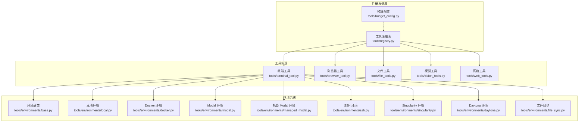
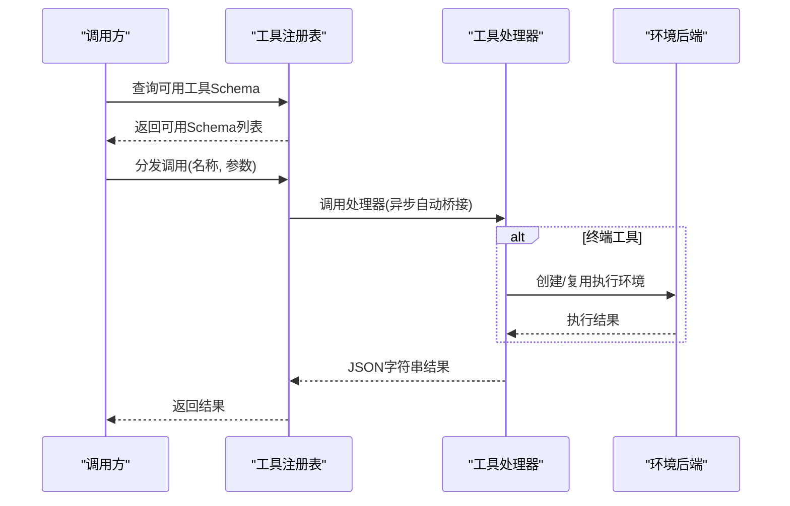
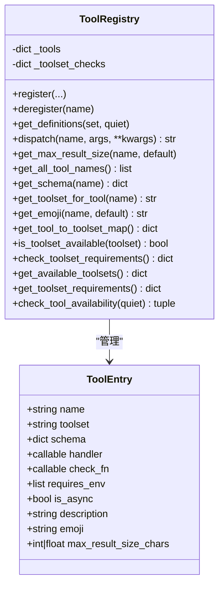
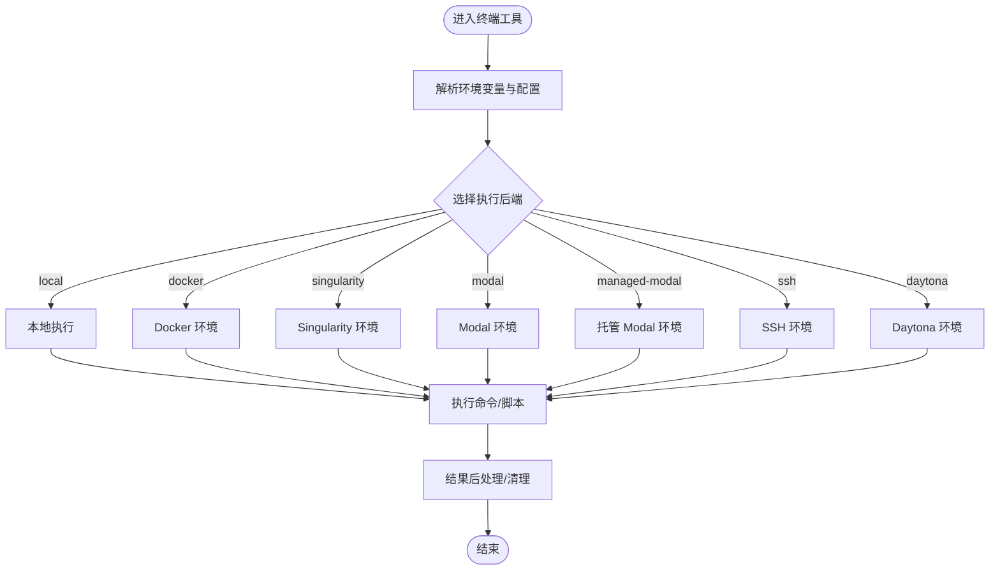
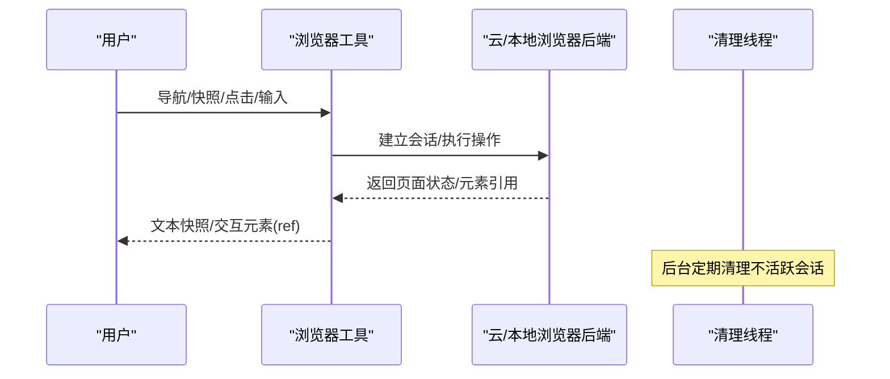
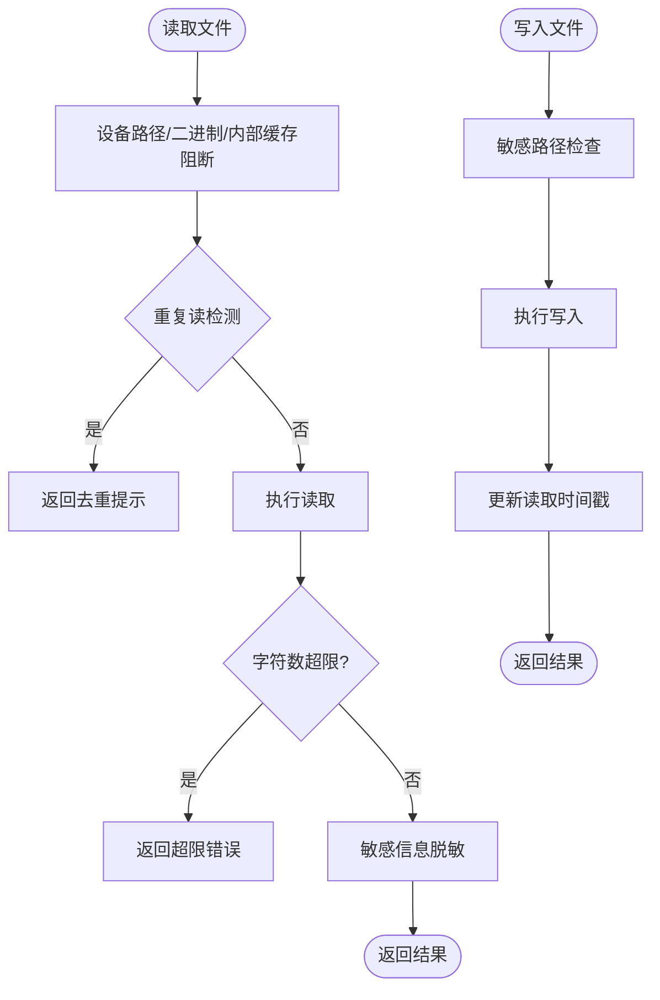
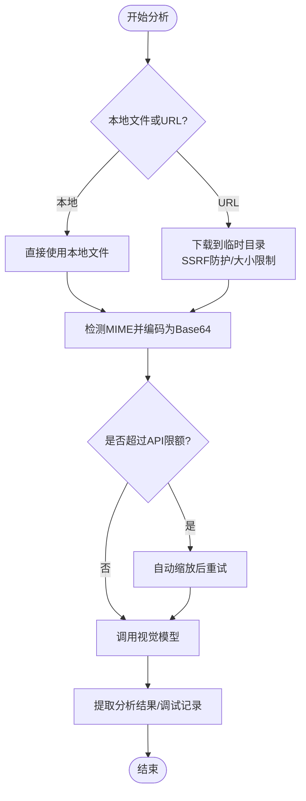
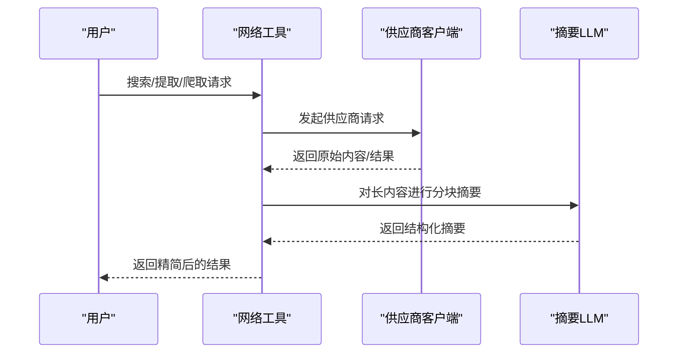
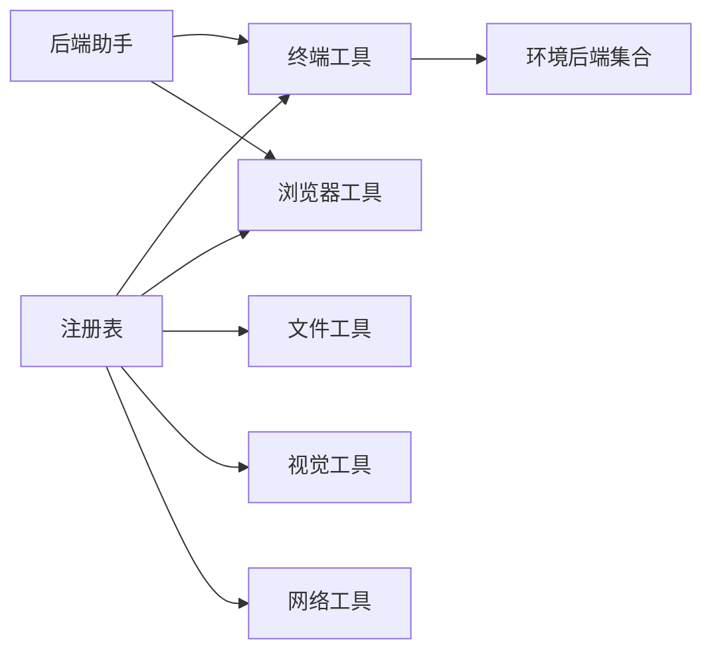

# 工具系统

<cite>
**本文档引用的文件**
- [tools/__init__.py](file://tools/__init__.py)
- [tools/registry.py](file://tools/registry.py)
- [tools/terminal_tool.py](file://tools/terminal_tool.py)
- [tools/browser_tool.py](file://tools/browser_tool.py)
- [tools/file_tools.py](file://tools/file_tools.py)
- [tools/vision_tools.py](file://tools/vision_tools.py)
- [tools/web_tools.py](file://tools/web_tools.py)
- [tools/tool_backend_helpers.py](file://tools/tool_backend_helpers.py)
- [tools/budget_config.py](file://tools/budget_config.py)
- [tools/environments/base.py](file://tools/environments/base.py)
- [tools/environments/local.py](file://tools/environments/local.py)
- [tools/environments/docker.py](file://tools/environments/docker.py)
- [tools/environments/modal.py](file://tools/environments/modal.py)
- [tools/environments/managed_modal.py](file://tools/environments/managed_modal.py)
- [tools/environments/ssh.py](file://tools/environments/ssh.py)
- [tools/environments/singularity.py](file://tools/environments/singularity.py)
- [tools/environments/daytona.py](file://tools/environments/daytona.py)
- [tools/environments/file_sync.py](file://tools/environments/file_sync.py)
- [tools/environments/modal_utils.py](file://tools/environments/modal_utils.py)
</cite>

## 目录
1. [简介](#简介)
2. [项目结构](#项目结构)
3. [核心组件](#核心组件)
4. [架构总览](#架构总览)
5. [详细组件分析](#详细组件分析)
6. [依赖分析](#依赖分析)
7. [性能考虑](#性能考虑)
8. [故障排查指南](#故障排查指南)
9. [结论](#结论)
10. [附录](#附录)

## 简介
本文件系统性阐述 Hermes Agent 的工具系统：从工具集概念与注册机制，到工具分类体系与调用流程；覆盖终端、浏览器、文件、视觉、网络等工具的功能特性与安全限制；并提供最佳实践、性能优化建议与自定义工具开发指南，帮助用户在不同场景下做出正确的工具选择与配置。

## 项目结构
工具系统围绕“集中式注册表 + 后端环境抽象 + 统一调度”展开：
- 注册中心：集中管理工具元数据、可用性检查、分发与预算控制
- 工具实现：各工具模块按统一模式注册自身 Schema、处理器与可用性检查
- 环境后端：对终端类工具提供本地/容器/云沙箱等执行环境
- 辅助能力：预算控制、调试会话、URL 安全、Modal 模式解析等

图表来源
- [tools/registry.py:1-336](file://tools/registry.py#L1-L336)
- [tools/budget_config.py:1-53](file://tools/budget_config.py#L1-L53)
- [tools/terminal_tool.py:1-800](file://tools/terminal_tool.py#L1-L800)
- [tools/browser_tool.py:1-800](file://tools/browser_tool.py#L1-L800)
- [tools/file_tools.py:1-800](file://tools/file_tools.py#L1-L800)
- [tools/vision_tools.py:1-799](file://tools/vision_tools.py#L1-L799)
- [tools/web_tools.py:1-800](file://tools/web_tools.py#L1-L800)
- [tools/environments/base.py](file://tools/environments/base.py)
- [tools/environments/local.py](file://tools/environments/local.py)
- [tools/environments/docker.py](file://tools/environments/docker.py)
- [tools/environments/modal.py](file://tools/environments/modal.py)
- [tools/environments/managed_modal.py](file://tools/environments/managed_modal.py)
- [tools/environments/ssh.py](file://tools/environments/ssh.py)
- [tools/environments/singularity.py](file://tools/environments/singularity.py)
- [tools/environments/daytona.py](file://tools/environments/daytona.py)
- [tools/environments/file_sync.py](file://tools/environments/file_sync.py)
- [tools/environments/modal_utils.py](file://tools/environments/modal_utils.py)

章节来源
- [tools/__init__.py:1-26](file://tools/__init__.py#L1-L26)
- [tools/registry.py:1-336](file://tools/registry.py#L1-L336)
- [tools/budget_config.py:1-53](file://tools/budget_config.py#L1-L53)

## 核心组件
- 工具注册表（ToolRegistry）
  - 职责：集中注册工具 Schema、处理器、可用性检查函数、工具集映射与工具级预算阈值解析
  - 特性：支持按工具集可用性检查、按需过滤 Schema、统一错误格式化、异步处理器桥接
- 预算配置（BudgetConfig）
  - 职责：定义每工具最大结果字符数、单轮预算与预览大小；支持工具级覆盖与固定阈值
- 环境后端（Environments）
  - 职责：为终端工具提供本地/容器/云沙箱执行环境，统一生命周期管理与资源配额
- 工具实现
  - 终端工具：多后端执行、后台任务、sudo 与危险命令审批、磁盘使用告警
  - 浏览器工具：本地/云浏览器后端、会话隔离、清理线程、SSRF 保护
  - 文件工具：读写/补丁/搜索、设备路径阻断、敏感路径保护、重复读去重与过量读告警
  - 视觉工具：图像下载/校验/自动缩放、多后端视觉模型路由、调试日志
  - 网络工具：多供应商搜索/提取/爬取、内容智能摘要、大文本分块合成

章节来源
- [tools/registry.py:48-290](file://tools/registry.py#L48-L290)
- [tools/budget_config.py:23-53](file://tools/budget_config.py#L23-L53)
- [tools/terminal_tool.py:505-800](file://tools/terminal_tool.py#L505-L800)
- [tools/browser_tool.py:380-620](file://tools/browser_tool.py#L380-L620)
- [tools/file_tools.py:149-278](file://tools/file_tools.py#L149-L278)
- [tools/vision_tools.py:405-679](file://tools/vision_tools.py#L405-L679)
- [tools/web_tools.py:477-800](file://tools/web_tools.py#L477-L800)

## 架构总览
工具系统采用“注册表驱动 + 后端可插拔”的设计，工具通过模块级注册向注册表上报自身信息；运行时由注册表按可用性筛选 Schema 并分发调用；终端工具通过环境后端实现跨平台/跨云的一致体验。

图表来源
- [tools/registry.py:116-167](file://tools/registry.py#L116-L167)
- [tools/terminal_tool.py:690-792](file://tools/terminal_tool.py#L690-L792)

章节来源
- [tools/registry.py:116-167](file://tools/registry.py#L116-L167)
- [tools/terminal_tool.py:690-792](file://tools/terminal_tool.py#L690-L792)

## 详细组件分析

### 工具注册与分发（注册表）
- 注册项（ToolEntry）包含：名称、工具集、Schema、处理器、可用性检查、是否异步、描述、表情符号、最大结果字符数
- 可用性检查：按工具集维度缓存检查结果，避免重复开销；支持异常兜底返回不可用
- Schema 过滤：仅返回通过 check_fn 的工具 Schema；未设置 check_fn 的工具默认视为可用
- 结果序列化：统一 tool_error/tool_result 辅助函数，保证错误格式一致

图表来源
- [tools/registry.py:24-94](file://tools/registry.py#L24-L94)
- [tools/registry.py:48-290](file://tools/registry.py#L48-L290)

章节来源
- [tools/registry.py:24-290](file://tools/registry.py#L24-L290)

### 终端工具（多后端执行与安全）
- 支持后端：local、docker、singularity、modal、managed-modal、ssh、daytona
- 关键能力：
  - 多后端环境生命周期管理、超时与资源配额、持久化文件系统
  - sudo 自动改写与密码注入、交互式密码提示、危险命令审批
  - 磁盘使用告警、会话缓存与清理线程、任务级环境覆盖
- 安全要点：
  - 工作目录白名单字符集校验、敏感路径阻断
  - SSRF 与私网地址访问控制（浏览器工具中体现）

图表来源
- [tools/terminal_tool.py:690-792](file://tools/terminal_tool.py#L690-L792)
- [tools/environments/local.py](file://tools/environments/local.py)
- [tools/environments/docker.py](file://tools/environments/docker.py)
- [tools/environments/modal.py](file://tools/environments/modal.py)
- [tools/environments/managed_modal.py](file://tools/environments/managed_modal.py)
- [tools/environments/ssh.py](file://tools/environments/ssh.py)
- [tools/environments/singularity.py](file://tools/environments/singularity.py)
- [tools/environments/daytona.py](file://tools/environments/daytona.py)

章节来源
- [tools/terminal_tool.py:505-800](file://tools/terminal_tool.py#L505-L800)
- [tools/environments/base.py](file://tools/environments/base.py)

### 浏览器工具（会话隔离与清理）
- 后端：本地 agent-browser、Browserbase、Browser Use、Firecrawl
- 会话管理：按 task_id 隔离、后台清理线程、孤儿进程回收、CDP 连接复用
- 安全：SSRF 保护、私网地址访问控制、策略检查、URL 安全校验
- 提示：命令超时可配置，快照超过阈值自动摘要

图表来源
- [tools/browser_tool.py:380-620](file://tools/browser_tool.py#L380-L620)
- [tools/browser_tool.py:625-772](file://tools/browser_tool.py#L625-L772)

章节来源
- [tools/browser_tool.py:1-800](file://tools/browser_tool.py#L1-L800)

### 文件工具（读写/补丁/搜索）
- 读取：设备路径阻断、二进制文件阻断、内部缓存文件阻断、重复读去重、超限告警
- 写入：敏感路径保护、修改时间跟踪、外部变更警告、预期写入异常日志降噪
- 补丁：替换模式与 V4A 多文件补丁、模糊匹配策略、语法检查
- 搜索：基于 ripgrep 的内容/文件搜索、分页与上下文、截断提示

图表来源
- [tools/file_tools.py:280-448](file://tools/file_tools.py#L280-L448)
- [tools/file_tools.py:571-593](file://tools/file_tools.py#L571-L593)
- [tools/file_tools.py:595-650](file://tools/file_tools.py#L595-L650)
- [tools/file_tools.py:655-718](file://tools/file_tools.py#L655-L718)

章节来源
- [tools/file_tools.py:1-800](file://tools/file_tools.py#L1-L800)

### 视觉工具（图像分析与安全）
- 输入：URL 或本地文件路径；远程下载并临时保存，本地文件直接使用
- 下载：SSRF 重定向防护、大小限制、重试逻辑、MIME 类型检测
- 编码：Base64 数据 URL，自动缩放以适配 API 限额
- 路由：多后端视觉模型（OpenRouter/Nous/Codex/Anthropic/自定义），失败自动降级
- 调试：可开启调试会话，记录调用与结果

图表来源
- [tools/vision_tools.py:405-679](file://tools/vision_tools.py#L405-L679)

章节来源
- [tools/vision_tools.py:1-799](file://tools/vision_tools.py#L1-L799)

### 网络工具（多供应商与智能摘要）
- 供应商：Exa、Firecrawl、Parallel、Tavily；支持直连或通过 Nous 托管网关
- 内容处理：超长内容自动分块并行摘要，再合成统一摘要；超大内容拒绝处理
- LLM 摘要：使用 Gemini 3 Flash Preview（或指定模型）进行结构化摘要，保留关键事实与引用

图表来源
- [tools/web_tools.py:477-800](file://tools/web_tools.py#L477-L800)

章节来源
- [tools/web_tools.py:1-800](file://tools/web_tools.py#L1-L800)

### 工具分类与可用性检查
- 工具集（toolset）：用于将相关工具归组，便于批量可用性检查与 UI 展示
- 工具集可用性：注册表维护每个工具集的 check_fn，统一返回可用/不可用
- 工具级预算：优先级为“固定阈值 > 工具覆盖 > 注册表阈值 > 默认阈值”

章节来源
- [tools/registry.py:229-290](file://tools/registry.py#L229-L290)
- [tools/budget_config.py:38-53](file://tools/budget_config.py#L38-L53)

## 依赖分析
- 注册表与工具实现解耦：工具模块仅在导入时注册，避免初始化时加载完整工具栈
- 环境后端与终端工具强耦合：终端工具通过环境抽象屏蔽后端差异
- 后端选择辅助：工具后端助手提供 Modal 模式解析、Browser 云提供商规范化等

图表来源
- [tools/registry.py:1-336](file://tools/registry.py#L1-L336)
- [tools/tool_backend_helpers.py:1-90](file://tools/tool_backend_helpers.py#L1-L90)
- [tools/terminal_tool.py:505-800](file://tools/terminal_tool.py#L505-L800)
- [tools/browser_tool.py:244-300](file://tools/browser_tool.py#L244-L300)

章节来源
- [tools/registry.py:1-336](file://tools/registry.py#L1-L336)
- [tools/tool_backend_helpers.py:1-90](file://tools/tool_backend_helpers.py#L1-L90)

## 性能考虑
- 工具结果大小控制
  - 使用预算配置限制单工具结果字符数，避免上下文膨胀
  - 网络工具对超长内容采用分块并行摘要与合成，减少令牌消耗
- 终端工具
  - 后台任务与会话复用降低冷启动成本
  - 超时与资源配额限制避免长时间占用
- 文件工具
  - 重复读去重、只在必要时触发摘要，减少不必要的计算
- 视觉工具
  - 自动缩放与失败重试，平衡质量与性能
- 浏览器工具
  - 不活跃会话清理线程防止资源泄露

章节来源
- [tools/budget_config.py:23-53](file://tools/budget_config.py#L23-L53)
- [tools/web_tools.py:477-800](file://tools/web_tools.py#L477-L800)
- [tools/terminal_tool.py:505-800](file://tools/terminal_tool.py#L505-L800)
- [tools/file_tools.py:149-278](file://tools/file_tools.py#L149-L278)
- [tools/vision_tools.py:405-679](file://tools/vision_tools.py#L405-L679)
- [tools/browser_tool.py:448-598](file://tools/browser_tool.py#L448-L598)

## 故障排查指南
- 终端工具
  - sudo 失败：检查 SUDO_PASSWORD 与交互模式；查看提示消息
  - 危险命令被拦截：通过审批回调或禁用危险命令守卫（谨慎）
  - 磁盘使用过高：关注磁盘使用告警，执行清理
- 浏览器工具
  - 私网地址访问被拒：调整 allow_private_urls 配置或使用受信代理
  - 会话孤儿：清理线程会回收，也可手动清理
- 文件工具
  - 设备路径/二进制文件读取失败：遵循替代方案（如视觉工具）
  - 写入权限错误：检查敏感路径保护与权限
- 视觉工具
  - 图像过大：启用 Pillow 自动缩放或手动压缩
  - API 拒绝：检查模型兼容性与配额
- 网络工具
  - 供应商配置缺失：检查对应 API Key 或网关配置
  - 内容过大：使用爬取指令聚焦或切换更小文本

章节来源
- [tools/terminal_tool.py:182-206](file://tools/terminal_tool.py#L182-L206)
- [tools/browser_tool.py:342-361](file://tools/browser_tool.py#L342-L361)
- [tools/browser_tool.py:448-598](file://tools/browser_tool.py#L448-L598)
- [tools/file_tools.py:280-448](file://tools/file_tools.py#L280-L448)
- [tools/vision_tools.py:512-525](file://tools/vision_tools.py#L512-L525)
- [tools/web_tools.py:160-172](file://tools/web_tools.py#L160-L172)

## 结论
Hermes Agent 工具系统通过集中式注册表实现工具的统一管理与调度，结合多后端环境抽象与严格的可用性检查，既保证了灵活性与可扩展性，又确保了安全性与稳定性。配合预算控制、调试与清理机制，能够在复杂任务中高效、可控地完成终端、浏览、文件、视觉与网络等多类操作。

## 附录
- 自定义工具开发步骤
  - 在工具模块中定义处理器函数与 Schema
  - 在模块末尾调用注册表注册：name、toolset、schema、handler、check_fn、is_async、emoji 等
  - 如有 per-tool 最大结果字符数需求，可在注册表或预算配置中设置
- 工具选择与配置决策
  - 任务类型决定后端：本地/容器/云沙箱
  - 安全要求决定可用性检查：sudo、敏感路径、SSRF
  - 性能要求决定预算与摘要策略：长文本分块、预览大小
- API 参考要点
  - 注册表方法：register、deregister、get_definitions、dispatch、get_max_result_size、check_toolset_requirements
  - 工具处理器返回：统一 JSON 字符串；错误使用 tool_error，成功使用 tool_result

章节来源
- [tools/registry.py:59-111](file://tools/registry.py#L59-L111)
- [tools/registry.py:309-336](file://tools/registry.py#L309-L336)
- [tools/budget_config.py:38-53](file://tools/budget_config.py#L38-L53)