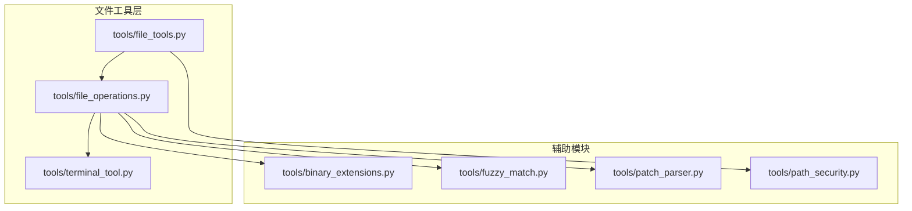
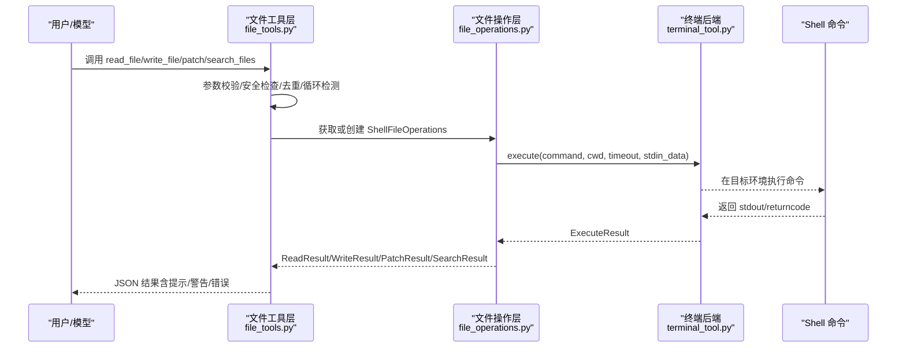
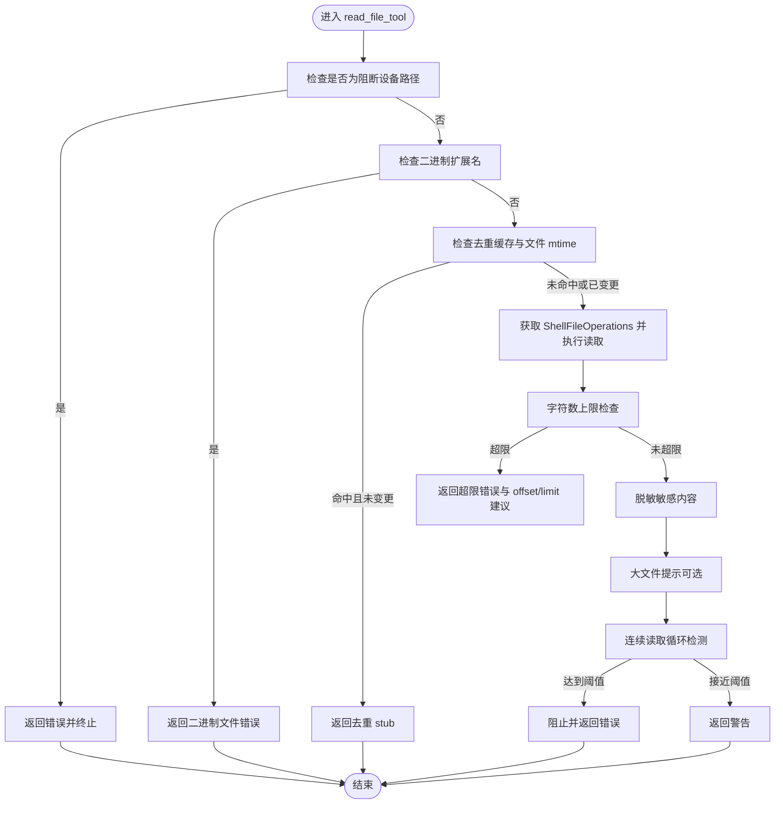
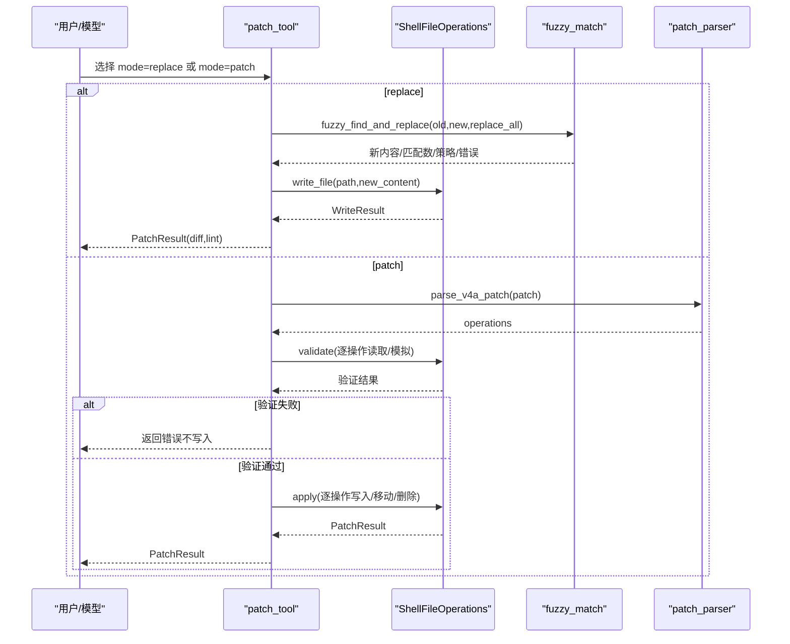
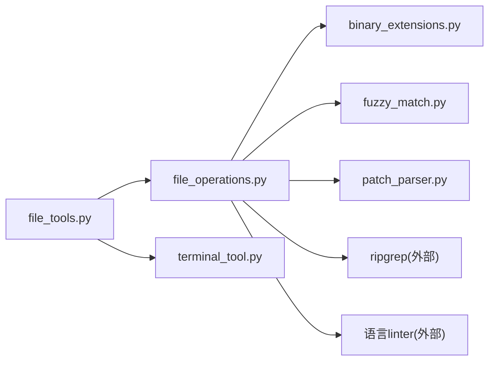

# 文件工具

<cite>
**本文引用的文件**
- [tools/file_tools.py](file://tools/file_tools.py)
- [tools/file_operations.py](file://tools/file_operations.py)
- [tools/binary_extensions.py](file://tools/binary_extensions.py)
- [tools/fuzzy_match.py](file://tools/fuzzy_match.py)
- [tools/patch_parser.py](file://tools/patch_parser.py)
- [tools/path_security.py](file://tools/path_security.py)
- [tools/terminal_tool.py](file://tools/terminal_tool.py)
- [tests/tools/test_file_tools.py](file://tests/tools/test_file_tools.py)
- [tests/tools/test_file_read_guards.py](file://tests/tools/test_file_read_guards.py)
- [tests/tools/test_file_operations.py](file://tests/tools/test_file_operations.py)
- [tests/tools/test_file_operations_edge_cases.py](file://tests/tools/test_file_operations_edge_cases.py)
- [website/docs/user-guide/configuration.md](file://website/docs/user-guide/configuration.md)
</cite>

## 目录
1. [简介](#简介)
2. [项目结构](#项目结构)
3. [核心组件](#核心组件)
4. [架构总览](#架构总览)
5. [详细组件分析](#详细组件分析)
6. [依赖分析](#依赖分析)
7. [性能考虑](#性能考虑)
8. [故障排除指南](#故障排除指南)
9. [结论](#结论)
10. [附录](#附录)

## 简介
本文件工具模块为 Hermes Agent 提供统一的文件操作能力，覆盖读取、写入、补丁（替换与 V4A 批量补丁）、搜索等常见任务，并在多后端（本地、Docker、Modal、SSH、Singularity、Daytona）环境中通过终端抽象层执行。该模块内置多重安全机制：设备文件阻断、二进制文件识别、敏感路径保护、写入沙箱限制、字符数上限、重复读取去重与循环检测、外部修改告警、路径规范化与遍历检测等。同时提供对大文件与二进制文件的处理策略，以及批量操作建议与性能优化要点。

## 项目结构
文件工具相关代码主要位于 tools 目录下，核心文件如下：
- tools/file_tools.py：对外暴露的工具函数 read_file、write_file、patch、search_files，以及工具注册与参数模式定义
- tools/file_operations.py：统一的文件操作接口与 ShellFileOperations 实现，封装读写、补丁、搜索、删除、移动等命令式操作
- tools/binary_extensions.py：二进制扩展名集合与快速判断
- tools/fuzzy_match.py：多策略模糊匹配与替换，用于 patch 的“替换模式”
- tools/patch_parser.py：V4A 补丁格式解析与应用，支持多文件批量变更
- tools/path_security.py：路径合法性校验与遍历检测
- tools/terminal_tool.py：终端后端抽象与环境管理，为文件操作提供执行上下文

图表来源
- [tools/file_tools.py:1-836](file://tools/file_tools.py#L1-L836)
- [tools/file_operations.py:1-1153](file://tools/file_operations.py#L1-L1153)
- [tools/terminal_tool.py:1-200](file://tools/terminal_tool.py#L1-L200)
- [tools/binary_extensions.py:1-43](file://tools/binary_extensions.py#L1-L43)
- [tools/fuzzy_match.py:1-567](file://tools/fuzzy_match.py#L1-L567)
- [tools/patch_parser.py:1-581](file://tools/patch_parser.py#L1-L581)
- [tools/path_security.py:1-44](file://tools/path_security.py#L1-L44)

章节来源
- [tools/file_tools.py:1-836](file://tools/file_tools.py#L1-L836)
- [tools/file_operations.py:1-1153](file://tools/file_operations.py#L1-L1153)
- [tools/terminal_tool.py:1-200](file://tools/terminal_tool.py#L1-L200)

## 核心组件
- 工具注册与对外接口
  - FILE_TOOLS：注册 read_file、write_file、patch、search_files 四个工具
  - 各工具的 JSON Schema 定义，明确参数、默认值与行为约束
- ShellFileOperations：跨后端统一文件操作实现，基于终端环境 execute 接口执行 shell 命令
- 路径安全与写入控制
  - 敏感路径前缀与精确路径拒绝列表
  - 可选安全根目录 HERMES_WRITE_SAFE_ROOT 沙箱
  - 设备文件阻断与二进制文件识别
- 读取安全与去重
  - 字符数上限与分页读取
  - 连续重复读取检测与去重缓存
  - 外部修改告警（mtime 对比）
- 搜索与补丁
  - ripgrep 驱动的内容/文件搜索
  - 替换模式：多策略模糊匹配
  - V4A 补丁：解析、预检、两阶段应用（验证-再应用）

章节来源
- [tools/file_tools.py:720-800](file://tools/file_tools.py#L720-L800)
- [tools/file_operations.py:39-117](file://tools/file_operations.py#L39-L117)
- [tools/file_operations.py:322-800](file://tools/file_operations.py#L322-L800)

## 架构总览
文件工具的调用链从工具层到操作层再到终端后端，形成清晰的职责分离与可扩展性。

图表来源
- [tools/file_tools.py:280-448](file://tools/file_tools.py#L280-L448)
- [tools/file_operations.py:350-368](file://tools/file_operations.py#L350-L368)
- [tools/terminal_tool.py:1-200](file://tools/terminal_tool.py#L1-L200)

## 详细组件分析

### 组件A：文件读取 read_file_tool
- 功能要点
  - 设备文件阻断：针对 /dev/zero、/dev/random、/proc/self/fd/* 等阻断读取
  - 二进制扩展名快速判断：避免文本显示二进制文件
  - 内部缓存与去重：同一路径/偏移/范围且未变更时返回轻量 stub
  - 字符数上限：根据配置限制单次读取字符数，超限则提示使用 offset/limit
  - 大文件提示：当文件较大且未限定范围时给出分段读取建议
  - 连续读取循环检测：超过阈值直接阻止或警告
  - 敏感路径检查：对写入敏感路径的读取进行拦截
  - 秘密内容脱敏：读取后对结果进行敏感信息脱敏
- 性能与安全
  - 通过去重与连续读取检测减少重复传输
  - 字符数上限防止上下文窗口被大文件填满
  - 设备文件阻断避免阻塞与无限输出
- 使用建议
  - 大文件优先使用 offset/limit 分段读取
  - 若文件未变更，复用上次结果以节省 token

图表来源
- [tools/file_tools.py:280-448](file://tools/file_tools.py#L280-L448)
- [tools/file_tools.py:328-447](file://tools/file_tools.py#L328-L447)

章节来源
- [tools/file_tools.py:280-448](file://tools/file_tools.py#L280-L448)
- [tests/tools/test_file_read_guards.py:1-378](file://tests/tools/test_file_read_guards.py#L1-L378)

### 组件B：文件写入 write_file_tool
- 功能要点
  - 敏感路径检查：拒绝写入系统关键路径与凭证文件
  - 外部修改告警：若文件自上次读取后被外部修改，返回警告
  - 写入成功后刷新读取时间戳，避免后续误报
  - 异常分类：预期写入异常（如权限不足）不计入错误日志，其他异常记录错误
- 安全机制
  - 写入拒绝列表与可选安全根目录沙箱
  - 路径规范化与遍历检测
- 使用建议
  - 修改前先 read_file，确认内容与上下文一致
  - 对于系统级文件修改，使用终端工具配合 sudo

章节来源
- [tools/file_tools.py:571-593](file://tools/file_tools.py#L571-L593)
- [tools/file_operations.py:99-117](file://tools/file_operations.py#L99-L117)

### 组件C：补丁 patch_tool（替换模式与 V4A）
- 替换模式
  - 多策略模糊匹配：逐策略尝试，容忍空白、缩进、转义、Unicode 等差异
  - 唯一性要求：默认要求匹配唯一，否则提示提供更多上下文或启用 replace_all
  - 自动语法检查：写回后运行对应语言的 linter
- V4A 模式
  - 解析：支持 Update/Add/Delete/Move 多种操作
  - 预检：两阶段验证（先读取当前内容，模拟 hunk 应用顺序，确保每一步都可定位）
  - 应用：按操作类型分别执行，生成统一 diff
- 安全与鲁棒性
  - 预检阶段失败不写入任何文件
  - 应用阶段失败会提示运行 git diff 评估状态
  - 上下文提示缺失时的容错插入策略

图表来源
- [tools/file_tools.py:595-649](file://tools/file_tools.py#L595-L649)
- [tools/fuzzy_match.py:50-102](file://tools/fuzzy_match.py#L50-L102)
- [tools/patch_parser.py:69-224](file://tools/patch_parser.py#L69-L224)
- [tools/patch_parser.py:325-427](file://tools/patch_parser.py#L325-L427)

章节来源
- [tools/file_tools.py:595-649](file://tools/file_tools.py#L595-L649)
- [tools/fuzzy_match.py:50-102](file://tools/fuzzy_match.py#L50-L102)
- [tools/patch_parser.py:69-224](file://tools/patch_parser.py#L69-L224)
- [tools/patch_parser.py:325-427](file://tools/patch_parser.py#L325-L427)

### 组件D：搜索 search_tool
- 支持内容搜索与文件名搜索
- 输出模式：显示匹配行、仅文件路径、统计计数
- 分页与截断提示：提供下一页 offset 建议
- 连续搜索循环检测：与读取一致的去重与警告/阻止逻辑
- 内容脱敏：对匹配内容进行敏感信息脱敏

章节来源
- [tools/file_tools.py:652-717](file://tools/file_tools.py#L652-L717)

### 组件E：ShellFileOperations（跨后端实现）
- 统一接口：read_file/read_file_raw/write_file/patch_replace/patch_v4a/delete_file/move_file/search
- 命令执行：通过 env.execute(command, cwd, timeout, stdin_data) 执行
- 路径与命令安全
  - 路径展开：支持 ~ 与 ~user 展开，避免 shell 注入
  - 命令转义：单引号包裹 + 内嵌单引号转义
  - 命令可用性缓存：减少 command -v 查询
- 读取细节
  - 分页读取：sed offset,limit
  - 行号添加：LINE_NUM|CONTENT 格式，长行截断
  - 图像与二进制：图像直接提示使用视觉工具；二进制样本采样判断
  - 类似文件建议：文件不存在时列出目录中相似文件
- 写入细节
  - 父目录自动创建
  - 大文件通过 stdin 管道写入，绕过 ARG_MAX 限制
  - 写入后统计字节数
- 搜索细节
  - ripgrep 驱动，支持正则与 glob
  - 输出模式与上下文行控制
- 删除与移动
  - 删除与移动同样受写入拒绝列表保护
- 语法检查
  - 针对 Python/JS/TS/Go/Rust 等语言的 linter 自动运行

章节来源
- [tools/file_operations.py:322-800](file://tools/file_operations.py#L322-L800)

### 组件F：路径安全与遍历检测
- validate_within_dir：确保路径解析后仍在允许根目录内，使用 resolve() 与 relative_to()
- has_traversal_component：快速检测 .. 组件，前置过滤潜在遍历攻击
- 与写入拒绝列表结合：双重保障敏感路径与越界访问

章节来源
- [tools/path_security.py:15-44](file://tools/path_security.py#L15-L44)
- [tools/file_operations.py:99-117](file://tools/file_operations.py#L99-L117)

## 依赖分析
- 组件耦合
  - file_tools 依赖 file_operations 提供的 ShellFileOperations
  - file_operations 依赖 binary_extensions 判断二进制扩展名
  - patch_tool 依赖 fuzzy_match 与 patch_parser
  - file_tools 依赖 terminal_tool 提供的环境与执行上下文
- 外部依赖
  - 终端后端 execute 接口（本地、Docker、Modal、SSH、Singularity、Daytona）
  - ripgrep（搜索功能）
  - 各语言 linter（Python/JS/TS/Go/Rust）

图表来源
- [tools/file_tools.py:1-14](file://tools/file_tools.py#L1-L14)
- [tools/file_operations.py:1-36](file://tools/file_operations.py#L1-L36)
- [tools/terminal_tool.py:1-50](file://tools/terminal_tool.py#L1-L50)

章节来源
- [tools/file_tools.py:1-14](file://tools/file_tools.py#L1-L14)
- [tools/file_operations.py:1-36](file://tools/file_operations.py#L1-L36)
- [tools/terminal_tool.py:1-50](file://tools/terminal_tool.py#L1-L50)

## 性能考虑
- 读取性能
  - 分页读取与行号添加：避免一次性读取大文件
  - 去重与连续读取检测：减少重复传输与上下文膨胀
  - 字符数上限：防止超大内容进入上下文
- 写入性能
  - 大文件通过 stdin 管道写入，避免命令行参数长度限制
  - 仅在必要时创建父目录
- 搜索性能
  - ripgrep 高效搜索，支持正则与 glob
  - 输出模式与上下文行可控，避免冗余
- 批量操作策略
  - 优先使用 V4A 补丁进行多文件批量变更，先 validate 再 apply
  - 将多次小写入合并为一次大写入（注意字符数上限与上下文限制）
  - 使用 offset/limit 分段读取，避免一次性读取超大文件
- 环境选择
  - 本地环境通常最快；容器/云沙箱适合隔离与一致性
  - 长时间任务建议使用持久化工作区，避免频繁重建

[本节为通用性能讨论，无需特定文件引用]

## 故障排除指南
- 读取失败
  - 文件不存在：工具会列出相似文件作为建议
  - 设备文件阻断：请改用终端工具或视觉工具
  - 二进制文件：使用视觉工具分析图像，或终端查看二进制
  - 超出字符数上限：使用 offset/limit 缩小范围
  - 连续读取循环：停止重复读取，先写入或响应
- 写入失败
  - 权限不足：检查目标路径是否在敏感列表或安全根之外
  - 外部修改告警：先重新读取确认最新内容
  - 预期写入异常：不会记录为错误日志，属于正常拒绝
- 补丁失败
  - 替换模式：old_string 不唯一或不存在，提供更明确上下文或启用 replace_all
  - V4A 模式：解析失败或验证失败（例如 hunk 无法定位），先 read_file_raw 核对内容
- 搜索失败
  - 结果被截断：使用 offset 下一页
  - 模式不匹配：调整正则或 glob

章节来源
- [tests/tools/test_file_tools.py:1-200](file://tests/tools/test_file_tools.py#L1-L200)
- [tests/tools/test_file_read_guards.py:1-378](file://tests/tools/test_file_read_guards.py#L1-L378)
- [tests/tools/test_file_operations.py:196-226](file://tests/tools/test_file_operations.py#L196-L226)
- [tests/tools/test_file_operations_edge_cases.py:1-36](file://tests/tools/test_file_operations_edge_cases.py#L1-L36)

## 结论
Hermes Agent 的文件工具模块通过统一的 ShellFileOperations 抽象，实现了跨后端的一致文件操作体验，并在安全性、易用性与性能之间取得平衡。其内置的设备文件阻断、二进制文件识别、敏感路径保护、字符数上限、重复读取去重与循环检测、外部修改告警、路径规范化与遍历检测等机制，有效降低了文件操作的风险。配合 V4A 批量补丁与模糊匹配，能够高效完成复杂编辑任务。建议在实际使用中遵循分段读取、先读取后写入、谨慎使用敏感路径与系统文件的原则，并结合配置项合理设置读取字符数上限。

[本节为总结性内容，无需特定文件引用]

## 附录

### A. 工具与参数模式
- read_file：支持 offset/limit 分页，行号前缀，字符数上限，大文件提示，连续读取循环检测
- write_file：完全覆盖写入，自动创建父目录，外部修改告警，预期写入异常不记录错误日志
- patch：replace 模式（多策略模糊匹配，唯一性要求），patch 模式（V4A 解析与两阶段应用）
- search_files：内容搜索（正则/上下文行）与文件搜索（glob/排序），分页与截断提示

章节来源
- [tools/file_tools.py:739-800](file://tools/file_tools.py#L739-L800)

### B. 配置项与安全策略
- file_read_max_chars：控制单次 read_file 返回的最大字符数，默认约 100K（约 25–35K tokens）
- HERMES_WRITE_SAFE_ROOT：可选安全根目录，限制写入范围
- 敏感路径前缀与精确路径：拒绝写入系统关键路径与凭证文件
- 设备文件阻断：阻断无限输出或阻塞输入的设备路径
- 路径遍历检测：前置检测 .. 组件，避免路径穿越

章节来源
- [website/docs/user-guide/configuration.md:390-408](file://website/docs/user-guide/configuration.md#L390-L408)
- [tools/file_tools.py:32-52](file://tools/file_tools.py#L32-L52)
- [tools/file_operations.py:45-117](file://tools/file_operations.py#L45-L117)
- [tools/path_security.py:37-44](file://tools/path_security.py#L37-L44)