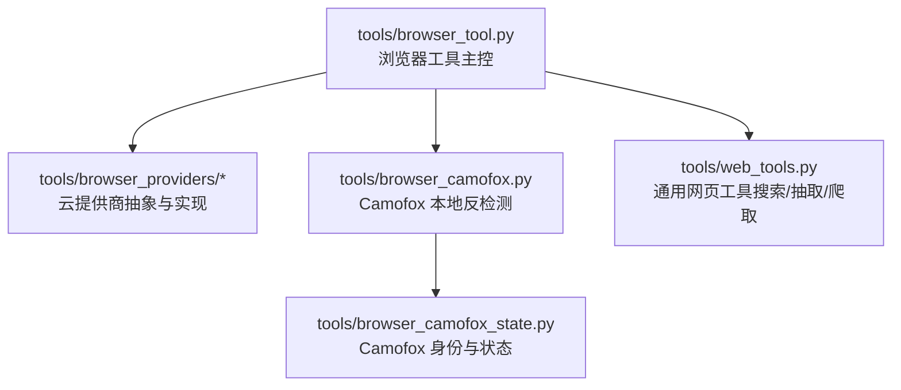
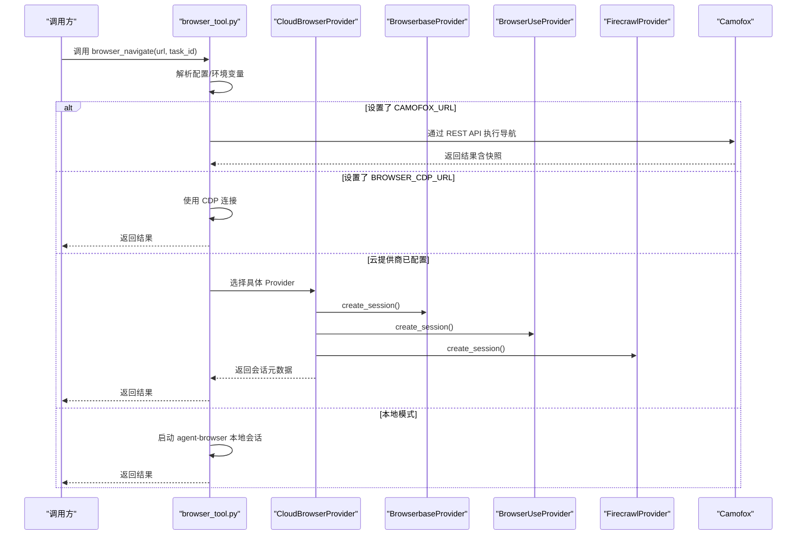
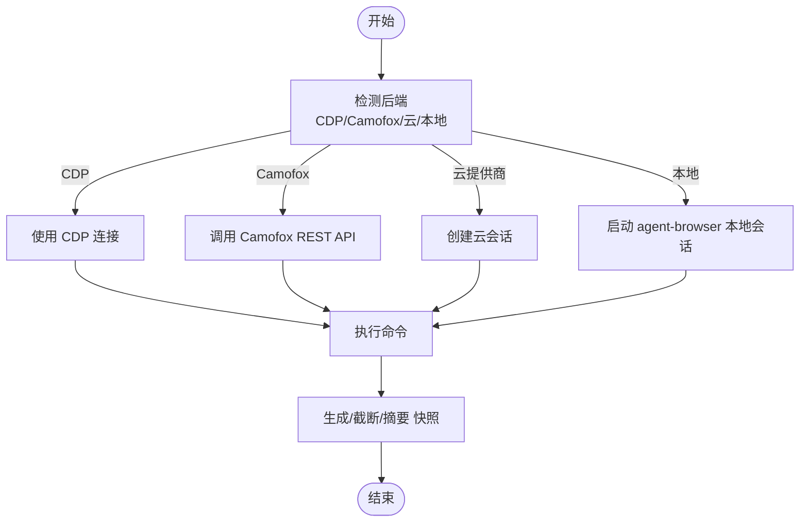
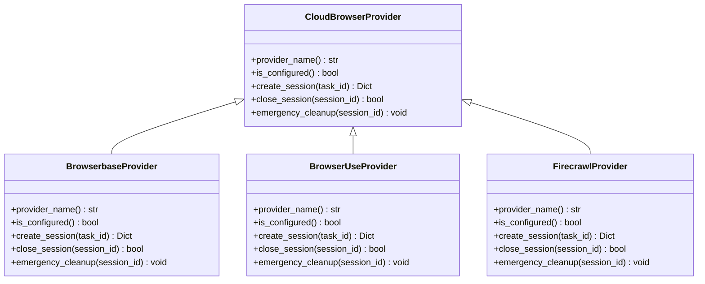
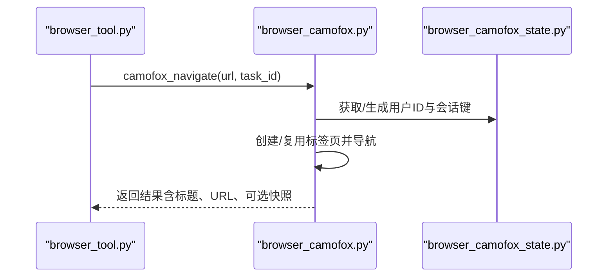
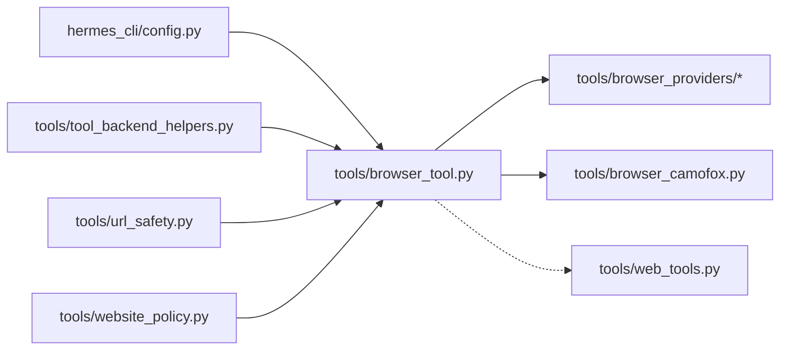

# 浏览器工具

<cite>
**本文引用的文件**
- [browser_tool.py](file://tools/browser_tool.py)
- [browser_camofox.py](file://tools/browser_camofox.py)
- [browser_camofox_state.py](file://tools/browser_camofox_state.py)
- [base.py](file://tools/browser_providers/base.py)
- [browserbase.py](file://tools/browser_providers/browserbase.py)
- [browser_use.py](file://tools/browser_providers/browser_use.py)
- [firecrawl.py](file://tools/browser_providers/firecrawl.py)
- [web_tools.py](file://tools/web_tools.py)
- [config.py](file://hermes_cli/config.py)
- [tool_backend_helpers.py](file://tools/tool_backend_helpers.py)
</cite>

## 目录
1. [简介](#简介)
2. [项目结构](#项目结构)
3. [核心组件](#核心组件)
4. [架构总览](#架构总览)
5. [详细组件分析](#详细组件分析)
6. [依赖分析](#依赖分析)
7. [性能考虑](#性能考虑)
8. [故障排除指南](#故障排除指南)
9. [结论](#结论)
10. [附录](#附录)

## 简介
本文件系统化梳理 Hermes Agent 的浏览器工具模块，覆盖以下主题：
- 功能特性与能力边界：页面导航、快照、元素交互、滚动、键盘输入、图片提取、视觉分析、控制台与 JS 检测、录制与清理
- 支持的浏览器类型与后端：本地 Headless Chromium、Browserbase、Browser Use、Firecrawl、Camofox（自托管反检测）
- 集成方式与配置：环境变量、配置文件、云厂商网关、代理与隐身模式、超时与保活
- 页面导航、元素交互与数据提取机制：基于可访问性树的文本快照、ref 引用选择器、任务感知的内容摘要
- 会话管理、Cookie 处理与隐私保护：会话隔离、后台清理线程、SSRF 阻断、私有地址策略
- 性能优化与并发控制：命令超时、快照截断与摘要、清理阈值、并发安全
- 安全限制与防护：SSRF、重定向到内网、URL 编码敏感信息阻断、线程锁保护
- 最佳实践与故障排除：安装与环境准备、配置建议、常见问题定位

## 项目结构
浏览器工具由“主控模块 + 云提供商适配层 + 可选 Camofox 本地反检测”三部分构成，并与通用网页工具模块互补。

图示来源
- [browser_tool.py](file://tools/browser_tool.py)
- [browser_camofox.py](file://tools/browser_camofox.py)
- [browser_camofox_state.py](file://tools/browser_camofox_state.py)
- [base.py](file://tools/browser_providers/base.py)
- [browserbase.py](file://tools/browser_providers/browserbase.py)
- [browser_use.py](file://tools/browser_providers/browser_use.py)
- [firecrawl.py](file://tools/browser_providers/firecrawl.py)
- [web_tools.py](file://tools/web_tools.py)

章节来源
- [browser_tool.py](file://tools/browser_tool.py)
- [browser_camofox.py](file://tools/browser_camofox.py)
- [browser_camofox_state.py](file://tools/browser_camofox_state.py)
- [base.py](file://tools/browser_providers/base.py)
- [browserbase.py](file://tools/browser_providers/browserbase.py)
- [browser_use.py](file://tools/browser_providers/browser_use.py)
- [firecrawl.py](file://tools/browser_providers/firecrawl.py)
- [web_tools.py](file://tools/web_tools.py)

## 核心组件
- 主控模块（browser_tool.py）
  - 提供统一的工具接口：browser_navigate、browser_snapshot、browser_click、browser_type、browser_scroll、browser_back、browser_press、browser_get_images、browser_vision、browser_console
  - 自动检测后端：本地（agent-browser）、CDP 连接、云提供商（Browserbase/Browser Use/Firecrawl）
  - 会话管理：按 task_id 隔离；后台清理线程；紧急退出清理
  - 安全与合规：SSRF 阻断、私有地址策略、URL 安全检查、敏感信息阻断
  - 性能：命令超时、快照截断/摘要、并发安全（锁）
- 云提供商适配层（browser_providers/*）
  - 抽象接口 CloudBrowserProvider，具体实现 BrowserbaseProvider、BrowserUseProvider、FirecrawlProvider
  - 统一会话生命周期：创建、关闭、紧急清理
- Camofox 本地反检测（browser_camofox.py + browser_camofox_state.py）
  - 通过 Camoufox（Firefox 衍生）+ Camofox-browser REST API 实现本地反检测浏览
  - 支持持久化身份映射、VNC 可视化、会话软清理
- 通用网页工具（web_tools.py）
  - 对外搜索/抽取/爬取，支持多后端（Exa、Firecrawl、Parallel、Tavily），与浏览器工具互补

章节来源
- [browser_tool.py](file://tools/browser_tool.py)
- [base.py](file://tools/browser_providers/base.py)
- [browserbase.py](file://tools/browser_providers/browserbase.py)
- [browser_use.py](file://tools/browser_providers/browser_use.py)
- [firecrawl.py](file://tools/browser_providers/firecrawl.py)
- [browser_camofox.py](file://tools/browser_camofox.py)
- [browser_camofox_state.py](file://tools/browser_camofox_state.py)
- [web_tools.py](file://tools/web_tools.py)

## 架构总览
浏览器工具在运行期根据配置与环境变量自动选择后端，并通过统一的工具接口完成页面操作与数据提取。

图示来源
- [browser_tool.py](file://tools/browser_tool.py)
- [browserbase.py](file://tools/browser_providers/browserbase.py)
- [browser_use.py](file://tools/browser_providers/browser_use.py)
- [firecrawl.py](file://tools/browser_providers/firecrawl.py)
- [browser_camofox.py](file://tools/browser_camofox.py)

## 详细组件分析

### 主控模块（browser_tool.py）
- 工具接口与参数
  - browser_navigate：初始化会话并加载页面，返回紧凑快照
  - browser_snapshot：可选 full=true 获取完整内容；超过阈值自动截断或摘要
  - browser_click、browser_type、browser_scroll、browser_back、browser_press：元素交互与键盘操作
  - browser_get_images：从可访问性树解析图片列表
  - browser_vision：截图并送入视觉模型分析，返回分析结果与截图路径
  - browser_console：读取控制台日志与未捕获异常；支持表达式求值
- 后端选择逻辑
  - 优先级：BROWSER_CDP_URL（直接 CDP 连接）> Camofox（CAMOFOX_URL）> 云提供商（Browserbase/Browser Use/Firecrawl）> 本地 agent-browser
  - 云提供商注册表：browserbase、browser-use、firecrawl
- 会话与清理
  - 按 task_id 隔离；记录最后活动时间；后台线程定期清理不活跃会话
  - 紧急清理：进程退出时清理所有活动会话
- 安全与合规
  - SSRF：默认阻止私有/内部地址；可通过配置允许
  - 私有地址策略：可配置是否允许访问
  - URL 安全检查：失败时阻断
  - 敏感信息阻断：对 URL 中编码的密钥进行拦截
- 性能与并发
  - 命令超时：可从配置读取，默认 30s
  - 快照阈值：超过 8000 字符自动摘要
  - 并发安全：清理集合与活动时间字典使用锁保护

图示来源
- [browser_tool.py](file://tools/browser_tool.py)

章节来源
- [browser_tool.py](file://tools/browser_tool.py)

### 云提供商适配层
- CloudBrowserProvider 抽象
  - provider_name、is_configured、create_session、close_session、emergency_cleanup
- BrowserbaseProvider
  - 直连 Browserbase API，支持 proxies、advanced stealth、keepAlive、自定义超时
  - 付费功能不可用时自动回退
- BrowserUseProvider
  - 支持直连 API Key 或 Nous 管理网关；短会话超时以节省成本
  - 管理模式下使用幂等键避免并发冲突
- FirecrawlProvider
  - 通过 FIRECRAWL_API_KEY 或 FIRECRAWL_API_URL 创建浏览器会话

图示来源
- [base.py](file://tools/browser_providers/base.py)
- [browserbase.py](file://tools/browser_providers/browserbase.py)
- [browser_use.py](file://tools/browser_providers/browser_use.py)
- [firecrawl.py](file://tools/browser_providers/firecrawl.py)

章节来源
- [base.py](file://tools/browser_providers/base.py)
- [browserbase.py](file://tools/browser_providers/browserbase.py)
- [browser_use.py](file://tools/browser_providers/browser_use.py)
- [firecrawl.py](file://tools/browser_providers/firecrawl.py)

### Camofox 本地反检测
- 通过 CAMOFOX_URL 连接到 Camofox-browser REST API，实现本地反检测浏览
- 支持持久化身份映射（可选），VNC 可视化（若服务暴露）
- 会话软清理：启用持久化时仅释放内存跟踪，保留服务端上下文

图示来源
- [browser_camofox.py](file://tools/browser_camofox.py)
- [browser_camofox_state.py](file://tools/browser_camofox_state.py)

章节来源
- [browser_camofox.py](file://tools/browser_camofox.py)
- [browser_camofox_state.py](file://tools/browser_camofox_state.py)

### 通用网页工具（web_tools.py）
- 支持后端：Exa、Firecrawl、Parallel、Tavily
- 优先级：直接配置 > 管理网关（Nous 订阅者）
- 内容处理：大文本分块并行摘要，最终合成；可配置最小长度触发

章节来源
- [web_tools.py](file://tools/web_tools.py)

## 依赖分析
- 配置与环境
  - hermes_cli/config.py：读取配置（如 browser.command_timeout、browser.allow_private_urls）
  - tools/tool_backend_helpers.py：标准化浏览器云提供商键名、Modal 模式解析
- 安全与合规
  - tools/url_safety.py、tools/website_policy.py：URL 安全检查与网站访问策略
- 会话与清理
  - browser_tool.py 内部维护 _active_sessions、_session_last_activity、后台清理线程
- 并发与线程安全
  - _cleanup_lock 保护共享状态；测试验证 _recording_sessions 的访问受保护

图示来源
- [browser_tool.py](file://tools/browser_tool.py)
- [config.py](file://hermes_cli/config.py)
- [tool_backend_helpers.py](file://tools/tool_backend_helpers.py)

章节来源
- [browser_tool.py](file://tools/browser_tool.py)
- [config.py](file://hermes_cli/config.py)
- [tool_backend_helpers.py](file://tools/tool_backend_helpers.py)

## 性能考虑
- 命令超时：从配置读取 browser.command_timeout，最低 5s，避免瞬时超时导致失败
- 快照处理：超过阈值（约 8000 字符）自动截断或摘要，减少 LLM 输入开销
- 清理策略：后台线程每 30s 扫描一次，按 BROWSER_INACTIVITY_TIMEOUT（默认 300s）清理不活跃会话
- 并发控制：清理集合与活动时间字典使用锁保护，避免竞态
- 云会话成本：Browser Use 管理模式默认短会话超时，降低计费风险

章节来源
- [browser_tool.py](file://tools/browser_tool.py)

## 故障排除指南
- 本地安装与环境
  - 本地模式需安装 agent-browser：参考提示命令；Termux 环境需要显式安装而非裸 npx 回退
  - 若 PATH 不包含 Homebrew 版本化 Node（如 node@24），模块会自动发现并前置
- 云提供商配置
  - Browserbase：需设置 BROWSERBASE_API_KEY、BROWSERBASE_PROJECT_ID；可选 proxies、advanced stealth、keepAlive、自定义超时
  - Browser Use：可直连 API Key 或通过 Nous 管理网关；管理模式下短会话超时
  - Firecrawl：设置 FIRECRAWL_API_KEY 或 FIRECRAWL_API_URL
- Camofox
  - 设置 CAMOFOX_URL；若服务暴露 VNC 端口，可在返回中看到可视化链接
  - 可启用 managed_persistence 保持 Cookie/状态跨任务
- 安全与合规
  - SSRF 默认阻断私有地址；如需访问，请在配置中开启 allow_private_urls
  - URL 中出现编码的 API Key 将被拦截
- 并发与清理
  - 如遇会话泄漏，检查后台清理线程是否正常；紧急退出会触发清理
  - 若出现“孤儿会话”，模块会在启动时扫描并终止
- 调试与诊断
  - 使用 browser_console 查看控制台日志与未捕获异常
  - 使用 browser_vision 获取截图并结合可选标注（@eN）辅助定位

章节来源
- [browser_tool.py](file://tools/browser_tool.py)
- [browserbase.py](file://tools/browser_providers/browserbase.py)
- [browser_use.py](file://tools/browser_providers/browser_use.py)
- [firecrawl.py](file://tools/browser_providers/firecrawl.py)
- [browser_camofox.py](file://tools/browser_camofox.py)

## 结论
Hermes Agent 的浏览器工具通过统一接口屏蔽后端差异，支持本地与云端多种场景，并内置安全与性能保障机制。配合通用网页工具，可覆盖从简单检索到复杂页面交互的广泛需求。建议在生产环境中：
- 明确后端选择与配置项，优先使用管理网关以降低成本
- 启用适当的 SSRF 与 URL 安全策略
- 合理设置命令超时与清理阈值，确保资源可控
- 在需要反检测或隐私保护时选用 Camofox 本地方案

## 附录

### 工具接口与参数速览
- browser_navigate：url（必填）
- browser_snapshot：full（可选）
- browser_click：ref（必填）
- browser_type：ref、text（必填）
- browser_scroll：direction（必填，"up"/"down"）
- browser_back：无
- browser_press：key（必填）
- browser_get_images：无
- browser_vision：question（必填，annotate 可选）
- browser_console：clear、expression（可选）

章节来源
- [browser_tool.py](file://tools/browser_tool.py)