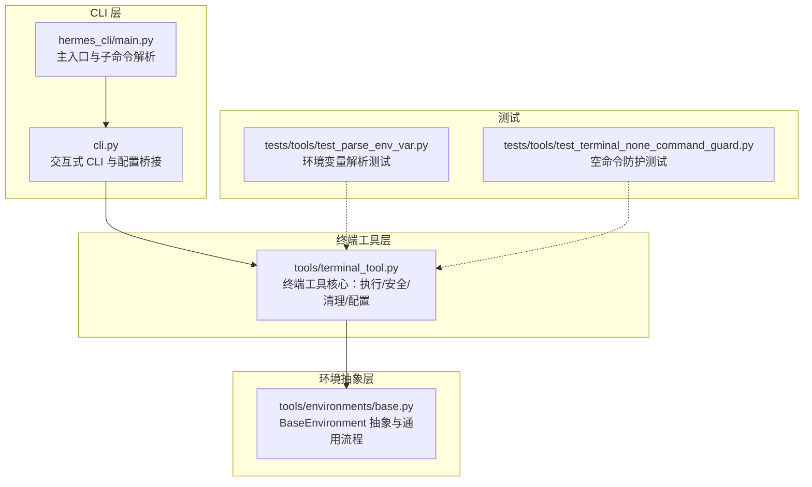
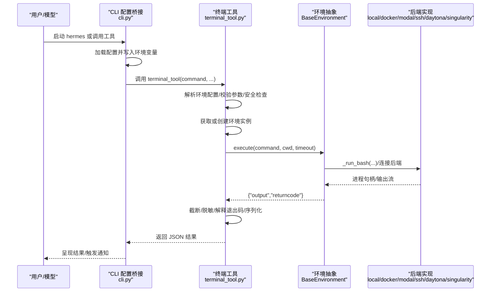
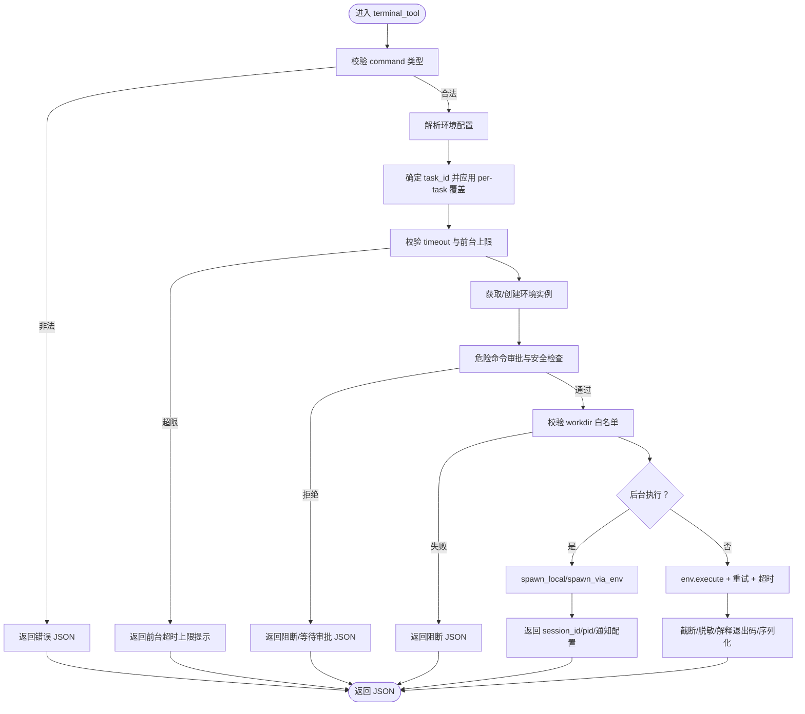
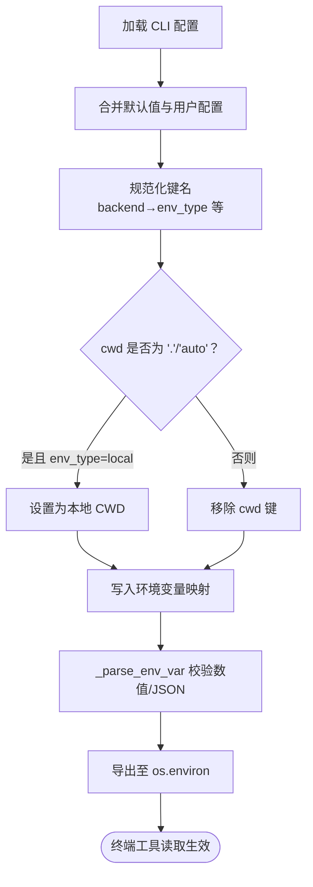
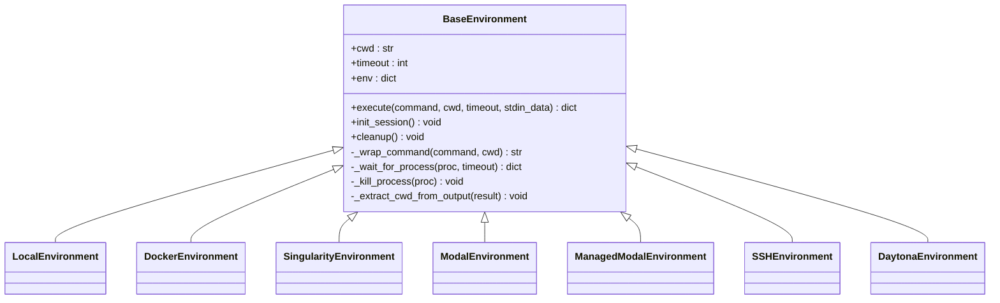
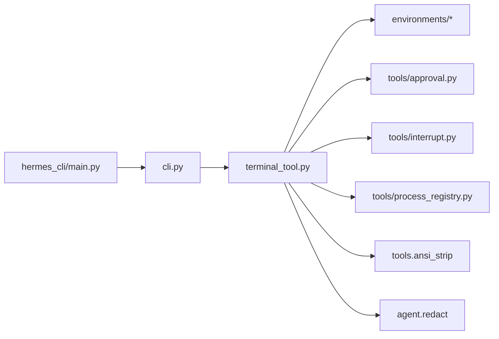

# 终端工具

<cite>
**本文引用的文件**
- [tools/terminal_tool.py](file://tools/terminal_tool.py)
- [cli.py](file://cli.py)
- [hermes_cli/main.py](file://hermes_cli/main.py)
- [tools/environments/base.py](file://tools/environments/base.py)
- [tests/tools/test_parse_env_var.py](file://tests/tools/test_parse_env_var.py)
- [tests/tools/test_terminal_none_command_guard.py](file://tests/tools/test_terminal_none_command_guard.py)
</cite>

## 目录
1. [简介](#简介)
2. [项目结构](#项目结构)
3. [核心组件](#核心组件)
4. [架构总览](#架构总览)
5. [详细组件分析](#详细组件分析)
6. [依赖分析](#依赖分析)
7. [性能考虑](#性能考虑)
8. [故障排除指南](#故障排除指南)
9. [结论](#结论)
10. [附录](#附录)

## 简介
本文件系统性阐述 Hermes Agent 的终端工具（Terminal Tool）：包括功能特性、使用方式、参数与配置、代码执行机制、安全与沙箱隔离、输出与错误处理、环境变量与工作目录、调试与排障、性能优化与资源管理，以及最佳实践与安全建议。该工具支持在本地、Docker、Singularity、Modal、SSH、Daytona 等多种环境中执行命令，并提供后台任务、会话持久化、自动清理、危险命令审批等能力。

## 项目结构
终端工具位于 tools 子模块中，核心入口为 tools/terminal_tool.py；CLI 启动流程由 hermes_cli/main.py 和 cli.py 共同完成，二者负责加载配置、桥接环境变量、注册回调与清理逻辑。后端环境抽象统一于 tools/environments/base.py，各具体后端（local/docker/modal/ssh/daytona/singularity）通过继承 BaseEnvironment 提供一致的执行接口。

图表来源
- [hermes_cli/main.py:1-120](file://hermes_cli/main.py#L1-L120)
- [cli.py:192-522](file://cli.py#L192-L522)
- [tools/terminal_tool.py:602-678](file://tools/terminal_tool.py#L602-L678)
- [tools/environments/base.py:226-580](file://tools/environments/base.py#L226-L580)
- [tests/tools/test_parse_env_var.py:1-86](file://tests/tools/test_parse_env_var.py#L1-L86)
- [tests/tools/test_terminal_none_command_guard.py:1-21](file://tests/tools/test_terminal_none_command_guard.py#L1-L21)

章节来源
- [hermes_cli/main.py:1-120](file://hermes_cli/main.py#L1-L120)
- [cli.py:192-522](file://cli.py#L192-L522)
- [tools/terminal_tool.py:602-678](file://tools/terminal_tool.py#L602-L678)
- [tools/environments/base.py:226-580](file://tools/environments/base.py#L226-L580)
- [tests/tools/test_parse_env_var.py:1-86](file://tests/tools/test_parse_env_var.py#L1-L86)
- [tests/tools/test_terminal_none_command_guard.py:1-21](file://tests/tools/test_terminal_none_command_guard.py#L1-L21)

## 核心组件
- 终端工具入口函数 terminal_tool：负责参数校验、环境选择与复用、安全检查、前台/后台执行、输出截断与脱敏、退出码语义解释、结果序列化返回。
- 环境配置与桥接：从环境变量读取配置，CLI 将配置映射到环境变量，供终端工具生效。
- 环境抽象 BaseEnvironment：统一会话快照、命令包装、CWD 跟踪、超时与中断处理、进程生命周期管理。
- 安全与沙箱：危险命令审批、sudo 密码缓存与提示、工作目录白名单校验、容器/云沙箱资源限制、自动清理线程。
- 背景任务与通知：通过进程注册表管理后台进程，支持完成通知与模式匹配监控。

章节来源
- [tools/terminal_tool.py:1133-1556](file://tools/terminal_tool.py#L1133-L1556)
- [cli.py:391-521](file://cli.py#L391-L521)
- [tools/environments/base.py:226-580](file://tools/environments/base.py#L226-L580)

## 架构总览
终端工具采用“配置驱动 + 环境抽象 + 统一执行”的分层设计。CLI 在启动阶段将用户配置与默认值合并并写入环境变量，终端工具按需读取；执行时根据 env_type 选择具体后端，复用已存在环境以降低冷启动成本；统一通过 BaseEnvironment 执行命令，保证超时、中断、CWD、输出等行为一致性。

图表来源
- [cli.py:391-521](file://cli.py#L391-L521)
- [tools/terminal_tool.py:1133-1556](file://tools/terminal_tool.py#L1133-L1556)
- [tools/environments/base.py:519-558](file://tools/environments/base.py#L519-L558)

## 详细组件分析

### 终端工具入口与执行流程
- 参数与行为
  - 支持前台执行（默认）与后台执行（background），后台可设置 notify_on_complete 自动通知、watch_patterns 监控输出。
  - timeout 受 FOREGROUND_MAX_TIMEOUT 上限约束；前台超长任务应改为后台并开启完成通知。
  - workdir 支持每命令工作目录，但必须通过白名单校验，防止路径注入。
  - pty 控制伪终端；对需要管道 stdin 的命令（如 gh auth login --with-token）会自动禁用 PTY。
- 执行路径
  - 前台：直接调用 env.execute，带重试与超时处理，返回完整输出与退出码。
  - 后台：通过进程注册表创建会话，返回 session_id/pid；支持网关平台自动监视与通知。
- 输出与错误
  - 输出截断：超过阈值时保留首尾片段并插入省略提示。
  - ANSI 清理：剥离控制字符，避免模型复制格式化内容。
  - 敏感信息脱敏：对输出进行敏感信息检测与替换。
  - 退出码语义：对 grep/rg/diff/test/curl/git 等常见非错误退出码给出解释，减少无效回溯。

图表来源
- [tools/terminal_tool.py:1133-1556](file://tools/terminal_tool.py#L1133-L1556)

章节来源
- [tools/terminal_tool.py:1133-1556](file://tools/terminal_tool.py#L1133-L1556)

### 环境配置与桥接
- CLI 配置加载与环境变量桥接
  - CLI 读取用户配置（~/.hermes/config.yaml）与项目默认配置（cli-config.yaml），合并后将终端相关键映射到环境变量，覆盖 .env 中的默认值。
  - 支持的键包括 env_type、cwd、timeout、lifetime_seconds、docker/singularity/modal/daytona 镜像、SSH 连接参数、容器资源（CPU/内存/磁盘/持久化）、Docker 挂载与环境转发、持久化 shell、SUDO 密码等。
  - 特殊处理：cwd 为 "." 或 "auto" 时，仅在本地后端解析为当前工作目录，其他后端忽略以避免主机路径不可用。
- 环境变量解析与校验
  - 使用 _parse_env_var 包装器解析整数、浮点数与 JSON 列表，异常时抛出清晰错误，避免单个配置项导致全局失败。
  - 测试覆盖了有效/无效输入场景，确保配置健壮性。

图表来源
- [cli.py:192-521](file://cli.py#L192-L521)
- [tests/tools/test_parse_env_var.py:1-86](file://tests/tools/test_parse_env_var.py#L1-L86)

章节来源
- [cli.py:192-521](file://cli.py#L192-L521)
- [tests/tools/test_parse_env_var.py:1-86](file://tests/tools/test_parse_env_var.py#L1-L86)

### 环境抽象与执行管线
- BaseEnvironment 统一执行流程
  - 会话快照：初始化时捕获环境（变量、函数、别名、shell 选项），后续命令先 source 快照，提升一致性与性能。
  - 命令包装：将实际命令包裹为“切换工作目录 → 执行 → 更新快照/标记 CWD”的脚本，保证跨调用状态一致。
  - CWD 跟踪：远程后端通过 stdout 标记提取当前工作目录；本地通过文件读取。
  - 超时与中断：轮询进程状态，支持 is_interrupted 主动中断；超时统一返回 124。
  - 进程生命周期：统一 kill/wait 接口，子类可扩展为进程组终止等。
- 后端差异
  - local：直接子进程，支持持久化 shell 与 PTY。
  - docker/singularity/modal/daytona：容器/云沙箱，支持资源限制、持久化文件系统、stdin heredoc 注入。
  - ssh：远端连接，需配置 host/user/port/key。
  - 统一通过 execute(command, cwd, timeout, stdin_data) 对外暴露。

图表来源
- [tools/environments/base.py:226-580](file://tools/environments/base.py#L226-L580)

章节来源
- [tools/environments/base.py:226-580](file://tools/environments/base.py#L226-L580)

### 安全与沙箱隔离
- 危险命令审批
  - 通过 _check_all_guards 统一调用 Tirith 与危险命令检测，支持用户确认（一次/会话/总是/拒绝）与智能放行。
  - 在网关模式下，审批请求可能转交外部平台，terminal_tool 返回 approval_required 状态。
- sudo 处理
  - _transform_sudo_command 将裸 sudo 替换为 -S -p ''，从标准输入读取密码；若未配置密码且交互模式可用，弹出 45 秒倒计时输入框并缓存本次会话密码。
  - 在消息通道（gateway）中若检测到 sudo 失败提示，附加帮助信息引导用户在 agent 机器上配置 SUDO_PASSWORD。
- 工作目录校验
  - 使用白名单正则仅允许安全字符，拒绝包含 shell 元字符的路径，防止注入。
- 沙箱与资源
  - 容器/云后端支持 CPU/内存/磁盘限制与持久化文件系统；Singularity 场景有磁盘用量告警。
  - 自动清理线程定期回收空闲环境，避免资源泄漏；支持 per-task 创建锁，避免并发重复创建。

章节来源
- [tools/terminal_tool.py:137-206](file://tools/terminal_tool.py#L137-L206)
- [tools/terminal_tool.py:448-502](file://tools/terminal_tool.py#L448-L502)
- [tools/terminal_tool.py:150-180](file://tools/terminal_tool.py#L150-L180)
- [tools/terminal_tool.py:819-916](file://tools/terminal_tool.py#L819-L916)

### 输出处理与错误管理
- 输出截断与脱敏
  - 超长输出按 4:6 分割保留头尾，插入省略提示；剥离 ANSI 控制符；敏感信息脱敏。
- 退出码语义解释
  - 针对 grep/rg/diff/test/curl/git 等常见非错误返回码，附加人类可读说明，避免模型误判。
- 错误分类与重试
  - 前台执行具备最多 3 次指数退避重试；超时统一返回 124；其他异常序列化错误信息并附 traceback。
- 空命令与类型保护
  - 对 None 或非字符串命令直接拒绝并返回错误 JSON，避免崩溃。

章节来源
- [tools/terminal_tool.py:1508-1556](file://tools/terminal_tool.py#L1508-L1556)
- [tools/terminal_tool.py:1049-1115](file://tools/terminal_tool.py#L1049-L1115)
- [tests/tools/test_terminal_none_command_guard.py:1-21](file://tests/tools/test_terminal_none_command_guard.py#L1-L21)

### 环境变量、工作目录与路径配置
- 关键环境变量
  - TERMINAL_ENV：后端类型（local/docker/singularity/modal/daytona/ssh）
  - TERMINAL_CWD：默认工作目录（本地解析为当前目录，其他后端忽略）
  - TERMINAL_TIMEOUT、TERMINAL_LIFETIME_SECONDS：命令超时与环境空闲生命周期
  - TERMINAL_DOCKER_* / TERMINAL_SINGULARITY_* / TERMINAL_MODAL_* / TERMINAL_DAYTONA_*：镜像与资源配置
  - TERMINAL_SSH_*：SSH 连接参数
  - SUDO_PASSWORD：sudo 密码（与交互式提示互斥）
  - TERMINAL_SANDBOX_DIR：沙箱根目录，默认 {HERMES_HOME}/sandboxes
- CLI 映射规则
  - CLI 将 config.yaml 中的 terminal.* 键映射到上述环境变量，优先级遵循“显式配置文件 > .env > 默认值”。

章节来源
- [tools/terminal_tool.py:602-678](file://tools/terminal_tool.py#L602-L678)
- [cli.py:391-521](file://cli.py#L391-L521)

## 依赖分析
- 组件耦合
  - terminal_tool 依赖 tools/environments/* 实现与 tools/approval、tools/interrupt、tools/process_registry 等模块。
  - CLI 通过环境变量桥接配置，避免在工具内部硬编码默认值。
- 外部依赖
  - Docker/Singularity/Modal/Daytona/SSH 命令行工具或 SDK；容器资源限制依赖后端能力。
- 循环依赖
  - 通过延迟导入与模块间协议（ProcessHandle）避免循环。

图表来源
- [tools/terminal_tool.py:1-120](file://tools/terminal_tool.py#L1-L120)
- [cli.py:576-592](file://cli.py#L576-L592)
- [hermes_cli/main.py:1-80](file://hermes_cli/main.py#L1-L80)

章节来源
- [tools/terminal_tool.py:1-120](file://tools/terminal_tool.py#L1-L120)
- [cli.py:576-592](file://cli.py#L576-L592)
- [hermes_cli/main.py:1-80](file://hermes_cli/main.py#L1-L80)

## 性能考虑
- 环境复用与冷启动
  - 通过 _active_environments 缓存任务级环境，避免重复创建；per-task 创建锁防止并发重复初始化。
- 超时与重试
  - 前台执行最大重试 3 次，指数退避；前台超时受 FOREGROUND_MAX_TIMEOUT 限制，长任务建议后台执行。
- 输出与日志
  - 输出截断与脱敏减少传输与存储开销；ANSI 清理避免格式污染。
- 资源限制
  - 容器/云后端按 CPU/内存/磁盘配置，避免资源争用；持久化文件系统在代价与稳定性之间权衡。
- 清理策略
  - 后台清理线程周期回收空闲环境；进程注册表跟踪活跃进程，避免误杀。

章节来源
- [tools/terminal_tool.py:819-916](file://tools/terminal_tool.py#L819-L916)
- [tools/terminal_tool.py:1461-1499](file://tools/terminal_tool.py#L1461-L1499)

## 故障排除指南
- 常见问题与定位
  - 前台超时：检查 FOREGROUND_MAX_TIMEOUT 与命令耗时，改用后台并开启 notify_on_complete。
  - 磁盘占用过高：关注 Singularity 磁盘用量告警，必要时运行 cleanup_all_environments。
  - sudo 失败（消息通道）：在 agent 机器上设置 SUDO_PASSWORD，或在交互模式下输入密码。
  - 工作目录被阻断：确保 workdir 仅含安全字符，避免相对/主机路径进入容器/云后端。
  - SSH 后端缺少凭据：配置 TERMINAL_SSH_HOST 与 TERMINAL_SSH_USER。
  - Modal 后端不可用：检查 direct/managed 模式与凭证；必要时启用 managed 模式或提供 direct 凭证。
- 调试技巧
  - 查看 CLI 日志（~/.hermes/logs/agent.log）与错误日志（errors.log）。
  - 使用后台执行 + notify_on_complete + watch_patterns 观察输出与完成信号。
  - 临时关闭 sudo 密码缓存与审批回调，验证是否为交互环节导致的问题。
- 单元测试参考
  - 环境变量解析错误与类型提示：tests/tools/test_parse_env_var.py
  - 空命令拒绝与错误返回：tests/tools/test_terminal_none_command_guard.py

章节来源
- [tools/terminal_tool.py:182-206](file://tools/terminal_tool.py#L182-L206)
- [tools/terminal_tool.py:1558-1599](file://tools/terminal_tool.py#L1558-L1599)
- [tests/tools/test_parse_env_var.py:1-86](file://tests/tools/test_parse_env_var.py#L1-L86)
- [tests/tools/test_terminal_none_command_guard.py:1-21](file://tests/tools/test_terminal_none_command_guard.py#L1-L21)

## 结论
终端工具通过“配置驱动 + 环境抽象 + 统一执行”的架构，在多后端环境下提供一致、安全、可控的命令执行体验。其内置的安全审批、sudo 管理、输出脱敏与截断、退出码语义解释、后台任务与通知、自动清理等机制，既满足日常开发需求，又兼顾生产环境的稳定性与安全性。建议在长任务与高风险操作中优先采用后台执行与审批流程，并合理配置资源与清理策略。

## 附录

### 使用示例与最佳实践
- 前台短任务：直接调用 terminal_tool，设置合理 timeout；避免超过前台超时上限。
- 后台长任务：设置 background=true，必要时开启 notify_on_complete；通过 watch_patterns 监控关键输出。
- 高风险命令：提前确认审批流程，必要时使用 force（仅内部使用）绕过审批。
- 工作目录：尽量使用相对路径或明确的后端内路径；避免传入主机绝对路径到容器/云后端。
- 资源规划：为容器/云后端设置合适的 CPU/内存/磁盘；关注磁盘用量告警并定期清理。
- 安全建议：在消息通道中启用 SUDO_PASSWORD；避免在输出中泄露敏感信息；使用白名单路径与最小权限原则。

### 环境变量速查
- 后端与镜像：TERMINAL_ENV、TERMINAL_DOCKER_IMAGE、TERMINAL_SINGULARITY_IMAGE、TERMINAL_MODAL_IMAGE、TERMINAL_DAYTONA_IMAGE
- 资源与持久化：TERMINAL_CONTAINER_CPU、TERMINAL_CONTAINER_MEMORY、TERMINAL_CONTAINER_DISK、TERMINAL_CONTAINER_PERSISTENT
- SSH：TERMINAL_SSH_HOST、TERMINAL_SSH_USER、TERMINAL_SSH_PORT、TERMINAL_SSH_KEY
- 工作目录与超时：TERMINAL_CWD、TERMINAL_TIMEOUT、TERMINAL_LIFETIME_SECONDS
- Docker 特性：TERMINAL_DOCKER_VOLUMES、TERMINAL_DOCKER_MOUNT_CWD_TO_WORKSPACE、TERMINAL_DOCKER_FORWARD_ENV
- 持久化 shell：TERMINAL_PERSISTENT_SHELL、TERMINAL_LOCAL_PERSISTENT
- 沙箱目录：TERMINAL_SANDBOX_DIR
- sudo：SUDO_PASSWORD

章节来源
- [tools/terminal_tool.py:602-678](file://tools/terminal_tool.py#L602-L678)
- [cli.py:391-521](file://cli.py#L391-L521)