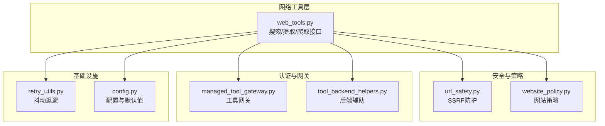
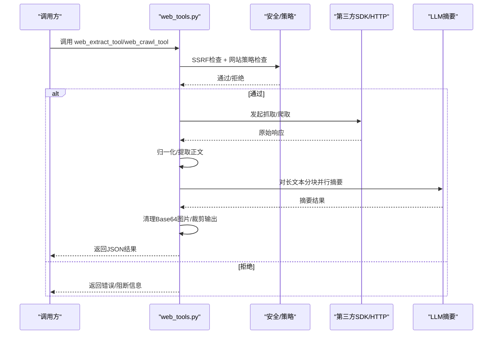
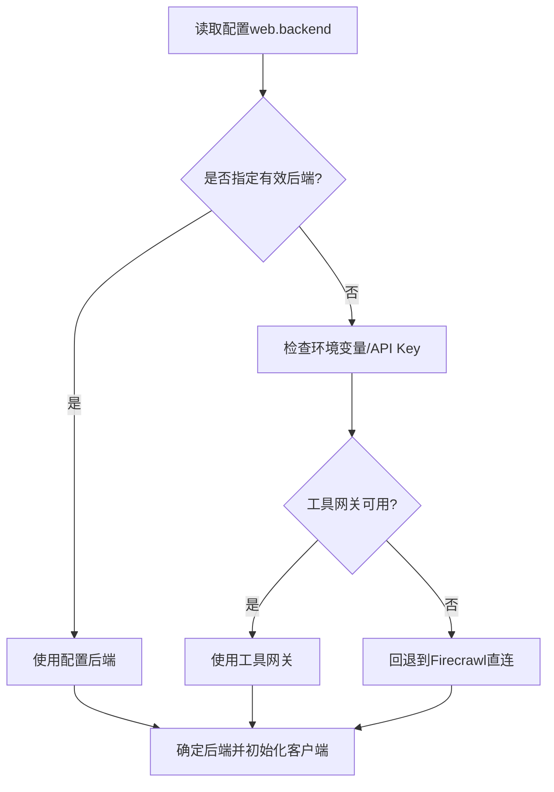
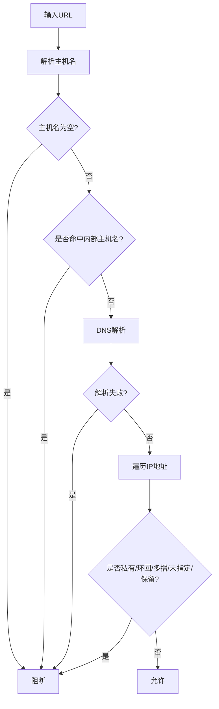
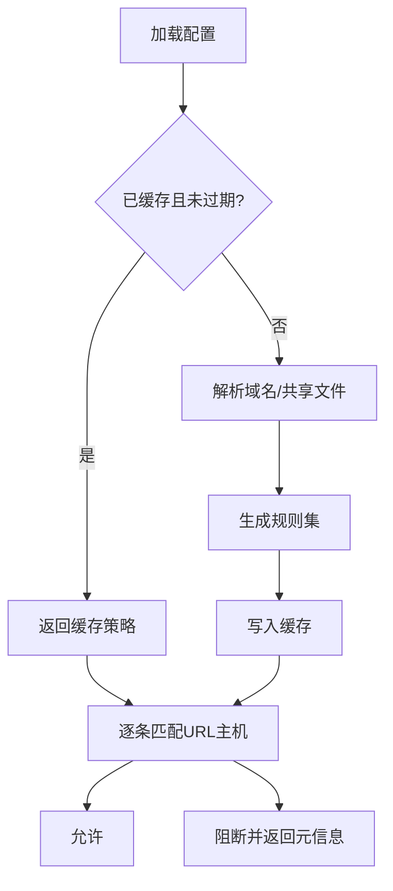
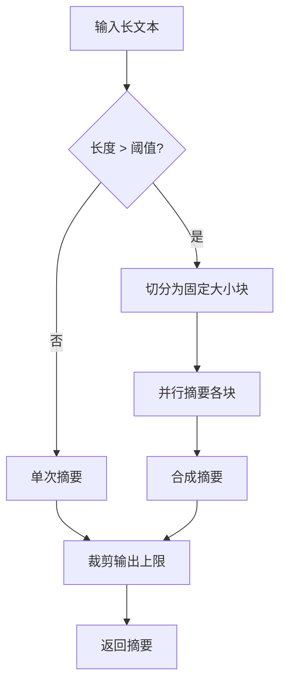
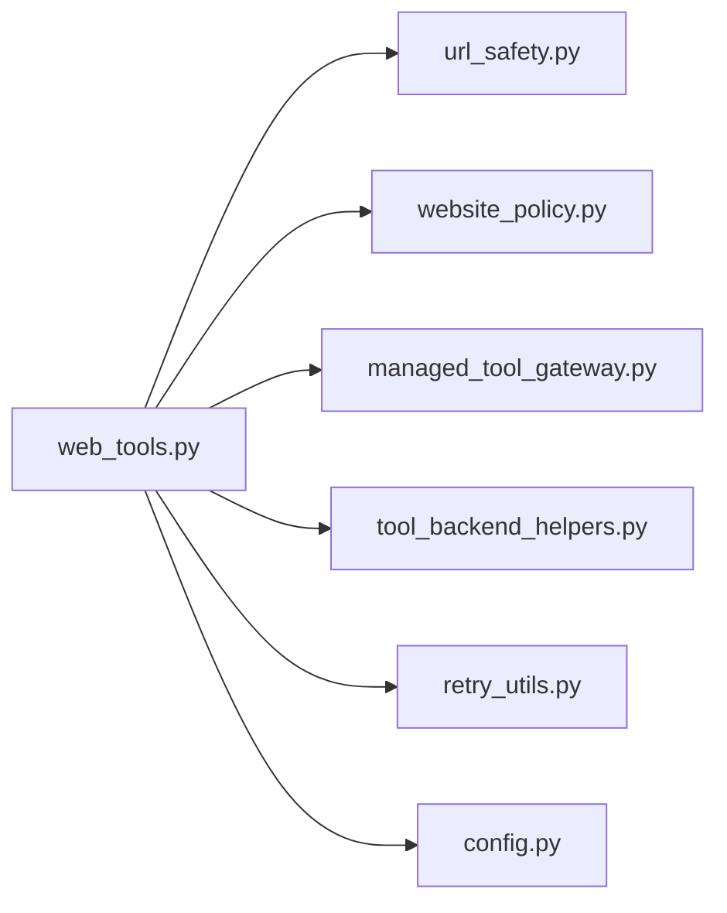

# 网络工具

<cite>
**本文引用的文件**
- [web_tools.py](file://tools/web_tools.py)
- [url_safety.py](file://tools/url_safety.py)
- [website_policy.py](file://tools/website_policy.py)
- [managed_tool_gateway.py](file://tools/managed_tool_gateway.py)
- [tool_backend_helpers.py](file://tools/tool_backend_helpers.py)
- [retry_utils.py](file://agent/retry_utils.py)
- [config.py](file://hermes_cli/config.py)
</cite>

## 目录
1. [简介](#简介)
2. [项目结构](#项目结构)
3. [核心组件](#核心组件)
4. [架构总览](#架构总览)
5. [详细组件分析](#详细组件分析)
6. [依赖分析](#依赖分析)
7. [性能考虑](#性能考虑)
8. [故障排查指南](#故障排查指南)
9. [结论](#结论)
10. [附录](#附录)

## 简介
本文件系统性阐述 Hermes Agent 的网络工具模块，覆盖以下方面：
- 功能特性：网页搜索、内容提取、站点爬取与智能摘要
- HTTP 请求处理与数据获取：后端选择、SDK 调用、响应归一化
- 安全检查：URL 验证（SSRF 防护）、网站访问策略（域名黑名单）、内容过滤（Base64 图片清理）
- 代理与认证：工具网关（Nous 会员）与环境变量驱动的认证
- 超时与重试：LLM 处理超时、抓取超时、指数退避抖动重试
- 性能优化：大文本分块并行摘要、合成、输出裁剪
- 错误处理与调试：统一错误返回、调试会话与日志

## 项目结构
网络工具位于 tools/web_tools.py，配套安全与策略模块：
- URL 安全：tools/url_safety.py
- 网站策略：tools/website_policy.py
- 工具网关：tools/managed_tool_gateway.py
- 后端辅助：tools/tool_backend_helpers.py
- 重试工具：agent/retry_utils.py
- 配置入口：hermes_cli/config.py

图表来源
- [web_tools.py](file://tools/web_tools.py)
- [url_safety.py](file://tools/url_safety.py)
- [website_policy.py](file://tools/website_policy.py)
- [managed_tool_gateway.py](file://tools/managed_tool_gateway.py)
- [tool_backend_helpers.py](file://tools/tool_backend_helpers.py)
- [retry_utils.py](file://agent/retry_utils.py)
- [config.py](file://hermes_cli/config.py)

章节来源
- [web_tools.py](file://tools/web_tools.py)
- [url_safety.py](file://tools/url_safety.py)
- [website_policy.py](file://tools/website_policy.py)
- [managed_tool_gateway.py](file://tools/managed_tool_gateway.py)
- [tool_backend_helpers.py](file://tools/tool_backend_helpers.py)
- [retry_utils.py](file://agent/retry_utils.py)
- [config.py](file://hermes_cli/config.py)

## 核心组件
- 后端选择与可用性检测：根据配置与环境变量自动选择 Firecrawl/Parallel/Tavily/Exa；支持直接配置或通过 Nous 工具网关
- 抓取与提取：Firecrawl 提供搜索、提取、爬取；Parallel/Tavily 提供对应能力；统一响应归一化
- 智能摘要：对长文本进行分块并行摘要，再合成，限制输出大小
- 安全与策略：SSRF 防护、网站黑名单、Base64 图片清理
- 超时与重试：抓取超时、LLM 处理超时、抖动退避重试
- 调试与可观测性：调试会话记录调用参数、原始响应、压缩指标与最终结果

章节来源
- [web_tools.py](file://tools/web_tools.py)
- [url_safety.py](file://tools/url_safety.py)
- [website_policy.py](file://tools/website_policy.py)

## 架构总览
网络工具在运行时按以下流程工作：
- 解析配置与后端选择
- 执行安全检查（URL 验证、网站策略）
- 调用第三方 SDK 或 HTTP 接口
- 归一化响应格式
- 可选：LLM 智能摘要（分块并行+合成）
- 清理与裁剪输出
- 记录调试信息

图表来源
- [web_tools.py](file://tools/web_tools.py)
- [url_safety.py](file://tools/url_safety.py)
- [website_policy.py](file://tools/website_policy.py)

## 详细组件分析

### 组件A：后端选择与客户端初始化
- 后端优先级：配置指定 > 环境变量存在 > 工具网关就绪
- Firecrawl 支持直连（API Key/自托管 URL）与 Nous 工具网关（会员）
- Parallel/Tavily/Exa 分别通过环境变量校验可用性
- 工具网关：域名/协议可配置，令牌从缓存或刷新读取

图表来源
- [web_tools.py](file://tools/web_tools.py)
- [managed_tool_gateway.py](file://tools/managed_tool_gateway.py)
- [tool_backend_helpers.py](file://tools/tool_backend_helpers.py)

章节来源
- [web_tools.py](file://tools/web_tools.py)
- [managed_tool_gateway.py](file://tools/managed_tool_gateway.py)
- [tool_backend_helpers.py](file://tools/tool_backend_helpers.py)

### 组件B：URL 安全检查（SSRF 防护）
- 主机名白名单/黑名单
- DNS 解析失败即阻断
- 私有/环回/链路本地/多播/未指定/保留地址阻断
- CGNAT 特例阻断
- 异常即阻断（Fail-Closed）

图表来源
- [url_safety.py](file://tools/url_safety.py)

章节来源
- [url_safety.py](file://tools/url_safety.py)

### 组件C：网站访问策略（域名黑名单）
- 支持配置启用/禁用、域名列表、共享文件列表
- 规则标准化与去重
- 缓存策略（带 TTL），避免频繁读取配置
- 匹配规则：精确匹配、通配符 *.domain、子域后缀
- 失败开路（fail-open）以保证稳定性

图表来源
- [website_policy.py](file://tools/website_policy.py)

章节来源
- [website_policy.py](file://tools/website_policy.py)

### 组件D：内容提取与智能摘要
- 大文本阈值与分块：超过阈值采用分块并行摘要，再合成
- 输出上限：单页摘要上限，防止上下文溢出
- LLM 提示工程：分块摘要与整体合成提示词区分
- 重试：最多有限次重试，指数退避并加抖动
- 超时：LLM 处理超时可配置，默认较长超时

图表来源
- [web_tools.py](file://tools/web_tools.py)

章节来源
- [web_tools.py](file://tools/web_tools.py)
- [retry_utils.py](file://agent/retry_utils.py)

### 组件E：HTTP 请求与响应处理
- Firecrawl：搜索、提取、爬取；支持格式选择（markdown/html）
- Parallel：异步提取；错误聚合
- Tavily：HTTP POST 请求；响应归一化
- 响应归一化：统一字段结构，便于后续处理
- 抓取超时：对同步抓取设置超时保护

章节来源
- [web_tools.py](file://tools/web_tools.py)

### 组件F：调试与可观测性
- 调试开关：WEB_TOOLS_DEBUG
- 会话记录：调用参数、原始响应大小、最终响应大小、压缩指标、处理应用
- 日志位置：./logs 下的 JSON 文件

章节来源
- [web_tools.py](file://tools/web_tools.py)

## 依赖分析
- 内聚性：网络工具围绕“搜索/提取/爬取”形成高内聚模块
- 耦合点：
  - 安全模块（SSRF、策略）作为前置过滤器
  - 工具网关与后端辅助用于认证与模式选择
  - LLM 摘要依赖辅助模型配置
  - 调试模块贯穿所有关键路径
- 外部依赖：第三方 SDK（Firecrawl/Parallel/Tavily）、HTTPX、配置解析

图表来源
- [web_tools.py](file://tools/web_tools.py)
- [url_safety.py](file://tools/url_safety.py)
- [website_policy.py](file://tools/website_policy.py)
- [managed_tool_gateway.py](file://tools/managed_tool_gateway.py)
- [tool_backend_helpers.py](file://tools/tool_backend_helpers.py)
- [retry_utils.py](file://agent/retry_utils.py)
- [config.py](file://hermes_cli/config.py)

章节来源
- [web_tools.py](file://tools/web_tools.py)
- [url_safety.py](file://tools/url_safety.py)
- [website_policy.py](file://tools/website_policy.py)
- [managed_tool_gateway.py](file://tools/managed_tool_gateway.py)
- [tool_backend_helpers.py](file://tools/tool_backend_helpers.py)
- [retry_utils.py](file://agent/retry_utils.py)
- [config.py](file://hermes_cli/config.py)

## 性能考虑
- 大文本分块并行摘要：提升吞吐，降低单次 LLM 负担
- 输出裁剪：限制最大字符数，避免上下文膨胀
- 抓取超时：防止长时间阻塞
- 抖动退避：降低并发重试的同质化峰值
- 策略缓存：减少频繁读取配置带来的 IO 开销

## 故障排查指南
- 后端不可用
  - 检查配置与环境变量是否满足任一后端要求
  - 若使用工具网关，确认令牌与网关 URL 可用
- SSRF 阻断
  - 检查目标 URL 是否指向私有/内部地址
  - 如需例外，调整安全策略（谨慎）
- 网站策略阻断
  - 查看阻断规则来源与规则内容
  - 检查配置文件与共享文件路径
- 抓取超时
  - 增加抓取超时或改用浏览器工具
- LLM 摘要失败
  - 检查辅助模型可用性与超时配置
  - 适当提高超时或降低最小处理长度
- 调试
  - 启用 WEB_TOOLS_DEBUG，查看日志文件中的完整调用轨迹

章节来源
- [web_tools.py](file://tools/web_tools.py)
- [url_safety.py](file://tools/url_safety.py)
- [website_policy.py](file://tools/website_policy.py)

## 结论
网络工具模块在功能上覆盖搜索、提取、爬取与智能摘要，在安全上提供 SSRF 防护与网站策略，在性能上采用分块并行与输出裁剪，在可靠性上提供超时与抖动退避。通过工具网关与灵活的后端选择，用户可在不同认证与部署场景下稳定使用。

## 附录
- 环境变量与配置要点
  - 后端 API Key：FIRECRAWL_API_KEY、PARALLEL_API_KEY、TAVILY_API_KEY、EXA_API_KEY
  - 工具网关：TOOL_GATEWAY_DOMAIN、TOOL_GATEWAY_SCHEME、TOOL_GATEWAY_USER_TOKEN
  - 调试：WEB_TOOLS_DEBUG
  - 网络偏好：force_ipv4（见配置项）
- 最佳实践
  - 使用工具网关以获得更好的稳定性与限流控制
  - 对长文本启用 LLM 摘要，但合理设置最小长度与输出上限
  - 在生产中开启网站策略黑名单，定期维护规则
  - 为 LLM 摘要设置充足超时，避免因本地模型慢导致失败

章节来源
- [web_tools.py](file://tools/web_tools.py)
- [config.py](file://hermes_cli/config.py)