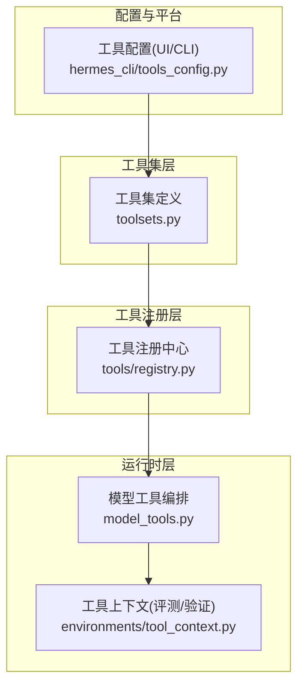
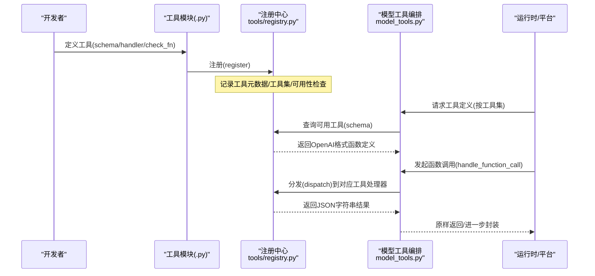
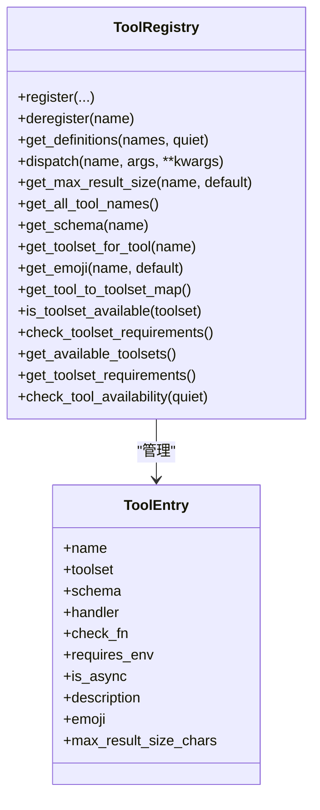
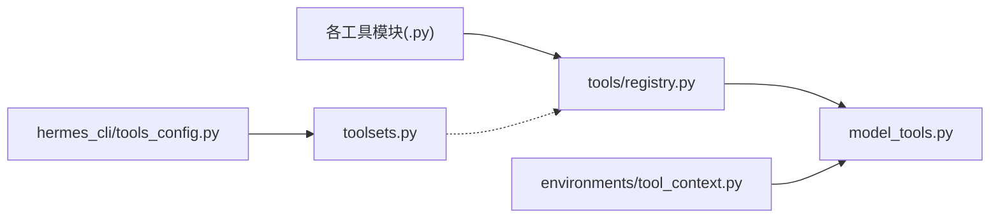

# 自定义工具开发

<cite>
**本文引用的文件**
- [tools/registry.py](file://tools/registry.py)
- [model_tools.py](file://model_tools.py)
- [toolsets.py](file://toolsets.py)
- [hermes_cli/tools_config.py](file://hermes_cli/tools_config.py)
- [tools/__init__.py](file://tools/__init__.py)
- [tools/web_tools.py](file://tools/web_tools.py)
- [tools/terminal_tool.py](file://tools/terminal_tool.py)
- [tools/file_tools.py](file://tools/file_tools.py)
- [tools/vision_tools.py](file://tools/vision_tools.py)
- [tools/tool_backend_helpers.py](file://tools/tool_backend_helpers.py)
- [environments/tool_context.py](file://environments/tool_context.py)
- [acp_adapter/tools.py](file://acp_adapter/tools.py)
</cite>

## 目录
1. [简介](#简介)
2. [项目结构](#项目结构)
3. [核心组件](#核心组件)
4. [架构总览](#架构总览)
5. [详细组件分析](#详细组件分析)
6. [依赖分析](#依赖分析)
7. [性能考量](#性能考量)
8. [故障排查指南](#故障排查指南)
9. [结论](#结论)
10. [附录](#附录)

## 简介
本指南面向希望在 Hermes Agent 中开发自定义工具的工程师，系统讲解工具开发的框架结构、接口规范与实现要点；详解工具注册机制、元数据与依赖声明；解释参数校验、错误处理与结果格式化；给出测试策略、调试技巧与性能优化建议；并提供模板示例、最佳实践与常见陷阱，以及发布与版本管理、兼容性考虑等实用建议。

## 项目结构
Hermes 的工具体系由“工具注册中心 + 工具集编排 + 运行时调度”三层构成：
- 工具注册中心：集中登记工具的模式(schema)、处理器(handler)、可用性检查、工具集归属、描述与图标等元数据，并统一提供查询、分发与错误归一化。
- 工具集编排：以“工具集(toolset)”为单位聚合工具，支持组合与继承，便于按平台/场景启用/禁用。
- 运行时调度：在推理或交互过程中，根据工具集解析出具体工具名集合，生成 OpenAI 兼容的函数调用模式，执行工具处理器并返回标准化结果。

图示来源
- [tools/registry.py:1-336](file://tools/registry.py#L1-L336)
- [toolsets.py:1-656](file://toolsets.py#L1-L656)
- [model_tools.py:1-200](file://model_tools.py#L1-L200)
- [environments/tool_context.py:1-475](file://environments/tool_context.py#L1-L475)
- [hermes_cli/tools_config.py:1-800](file://hermes_cli/tools_config.py#L1-L800)

章节来源
- [tools/registry.py:1-336](file://tools/registry.py#L1-L336)
- [toolsets.py:1-656](file://toolsets.py#L1-L656)
- [model_tools.py:1-200](file://model_tools.py#L1-L200)
- [hermes_cli/tools_config.py:1-800](file://hermes_cli/tools_config.py#L1-L800)
- [environments/tool_context.py:1-475](file://environments/tool_context.py#L1-L475)

## 核心组件
- 工具注册中心
  - 职责：登记工具的 schema、处理器、可用性检查、工具集归属、描述、图标、异步标记、最大结果长度等；提供按名称查询、按工具集过滤、可用性检查、分发执行、工具集元信息汇总等能力。
  - 关键点：注册时可覆盖同名冲突（不同工具集），支持动态注销；分发时自动桥接同步/异步；异常统一包装为 JSON 字符串错误。
- 工具集编排
  - 职责：定义工具集及其包含关系，支持组合、别名与插件扩展；提供解析为具体工具名列表的能力；维护平台默认工具集映射。
- 运行时编排
  - 职责：触发工具模块导入完成注册；提供获取工具定义、处理函数调用、查询工具集映射等公共 API；内置事件循环桥接，避免“事件循环已关闭”问题。
- 工具上下文
  - 职责：在评测/验证阶段，为奖励函数提供对所有工具的不受限访问，按任务 ID 维持会话隔离与资源清理。

章节来源
- [tools/registry.py:24-291](file://tools/registry.py#L24-L291)
- [toolsets.py:29-391](file://toolsets.py#L29-L391)
- [model_tools.py:35-200](file://model_tools.py#L35-L200)
- [environments/tool_context.py:67-475](file://environments/tool_context.py#L67-L475)

## 架构总览
下图展示从“工具注册到运行时调用”的端到端流程，包括工具发现、可用性检查、模式生成与执行分发。

图示来源
- [tools/registry.py:59-167](file://tools/registry.py#L59-L167)
- [model_tools.py:132-200](file://model_tools.py#L132-L200)

章节来源
- [tools/registry.py:59-167](file://tools/registry.py#L59-L167)
- [model_tools.py:132-200](file://model_tools.py#L132-L200)

## 详细组件分析

### 工具注册中心：注册、查询与分发
- 注册接口
  - 参数：名称、工具集、OpenAI 函数模式(schema)、处理器、可用性检查函数、环境变量要求、是否异步、描述、图标、最大结果长度等。
  - 冲突处理：同名但不同工具集时发出警告并覆盖；同时登记工具集的可用性检查函数。
- 可用性与查询
  - 按工具名集合查询 OpenAI 函数定义，内部会调用 check_fn 并缓存结果；未通过检查的工具会被过滤。
  - 提供工具集可用性检查、工具集元信息汇总、工具名到工具集映射等辅助查询。
- 执行分发
  - 同步/异步自动桥接；捕获异常并统一返回 JSON 字符串错误；支持设置每工具最大结果长度与全局默认值。
- 结果序列化助手
  - 提供 tool_error 与 tool_result 两个轻量封装，减少重复样板代码。

图示来源
- [tools/registry.py:24-291](file://tools/registry.py#L24-L291)

章节来源
- [tools/registry.py:24-336](file://tools/registry.py#L24-L336)

### 工具集编排：定义、解析与组合
- 静态工具集定义：内置常用工具集（如 web、terminal、file、browser、vision、image_gen、tts、skills、todo、memory、session_search、clarify、code_execution、delegation、cronjob、messaging、homeassistant、rl 等），支持直接包含工具或组合其他工具集。
- 解析逻辑：递归解析包含的工具集，去重合并；支持特殊别名 all/* 表示全量工具。
- 动态扩展：插件注册的工具集可通过注册中心回显，toolsets 模块提供合成视图。
- 平台默认工具集：每个消息平台有默认工具集，确保跨平台一致性。

章节来源
- [toolsets.py:29-391](file://toolsets.py#L29-L391)
- [toolsets.py:410-467](file://toolsets.py#L410-L467)
- [toolsets.py:489-528](file://toolsets.py#L489-L528)

### 运行时编排：发现、桥接与调度
- 工具发现：集中导入各工具模块，触发其注册；失败模块被安全忽略，不影响其他工具加载。
- 异步桥接：维护主线程与工作线程的长驻事件循环，避免“事件循环已关闭”问题；在异步/同步上下文中选择合适执行路径。
- 公共 API：提供获取工具定义、处理函数调用、查询映射与可用性检查等接口，供 run_agent、CLI、批跑与 RL 环境使用。

章节来源
- [model_tools.py:132-185](file://model_tools.py#L132-L185)
- [model_tools.py:81-126](file://model_tools.py#L81-L126)
- [model_tools.py:191-198](file://model_tools.py#L191-L198)

### 工具上下文：评测/验证中的“不受限访问”
- 设计目标：在奖励/验证函数中，允许直接调用任意工具，且共享 rollout 的 task_id，从而复用终端/浏览器状态。
- 实现要点：通过 handle_function_call 在线执行；为异步后端提供线程池执行保护；提供终端、文件、搜索、网页、浏览器、通用调用等便捷方法；提供清理资源的收尾逻辑。

章节来源
- [environments/tool_context.py:67-475](file://environments/tool_context.py#L67-L475)

### 工具实现示例：Web、终端、文件、视觉
- Web 工具
  - 特点：多后端兼容（Exa、Firecrawl、Parallel、Tavily）；支持直连与受管网关；具备调试日志与内容压缩摘要；URL 安全检查与网站策略。
  - 关键点：后端选择逻辑、环境变量优先级、受管网关可用性检测、下载超时与大小限制。
- 终端工具
  - 特点：多后端（local/docker/modal/SSH/Singularity/Daytona）；支持后台任务、VM/容器生命周期管理、空闲清理；危险命令审批与路径白名单校验。
  - 关键点：前台超时上限、磁盘用量告警、sudo 密码回调、危险命令守卫。
- 文件工具
  - 特点：读取字符数上限、大文件提示、设备路径阻断、敏感路径写入保护、并发读写跟踪与缓存、重复读去重。
  - 关键点：读取上限配置、阻断设备路径、写入前敏感路径检查。
- 视觉工具
  - 特点：图片 URL 校验、MIME 类型探测、SSRF 防护（重定向二次校验）、下载超时与大小限制、临时文件清理。
  - 关键点：URL 格式与私有地址校验、HTTP 头部与重定向钩子、Content-Length 预检。

章节来源
- [tools/web_tools.py:75-121](file://tools/web_tools.py#L75-L121)
- [tools/web_tools.py:184-200](file://tools/web_tools.py#L184-L200)
- [tools/terminal_tool.py:85-124](file://tools/terminal_tool.py#L85-L124)
- [tools/terminal_tool.py:148-152](file://tools/terminal_tool.py#L148-L152)
- [tools/file_tools.py:32-56](file://tools/file_tools.py#L32-L56)
- [tools/file_tools.py:74-90](file://tools/file_tools.py#L74-L90)
- [tools/file_tools.py:99-116](file://tools/file_tools.py#L99-L116)
- [tools/vision_tools.py:75-103](file://tools/vision_tools.py#L75-L103)
- [tools/vision_tools.py:128-200](file://tools/vision_tools.py#L128-L200)

### 工具配置与平台集成
- 工具配置器
  - 支持按平台勾选工具集；对需要密钥的工具集提供提供商选择与环境变量配置；提供令牌估算与 UI 状态提示。
  - 支持插件扩展的工具集；支持 MCP 服务器工具集的默认启用/禁用。
- 平台工具集解析
  - 将平台默认工具集与用户显式配置合并；支持复合工具集解析；保留非配置类条目（如 MCP 服务器名）。

章节来源
- [hermes_cli/tools_config.py:46-110](file://hermes_cli/tools_config.py#L46-L110)
- [hermes_cli/tools_config.py:465-563](file://hermes_cli/tools_config.py#L465-L563)
- [hermes_cli/tools_config.py:608-644](file://hermes_cli/tools_config.py#L608-L644)

### ACP 工具映射与事件构建
- 映射规则：将 Hermes 工具名映射到 ACP ToolKind（read/edit/search/execute/fetch/think/other）。
- 事件构建：为工具调用生成标题、位置信息、内容块；支持 diff/patch/text 等多种内容类型；完成时截断过长结果并标注字符总数。

章节来源
- [acp_adapter/tools.py:20-56](file://acp_adapter/tools.py#L20-L56)
- [acp_adapter/tools.py:104-197](file://acp_adapter/tools.py#L104-L197)
- [acp_adapter/tools.py:205-215](file://acp_adapter/tools.py#L205-L215)

## 依赖分析
- 模块耦合
  - tools/registry.py 作为单例中心，被 model_tools.py 与各工具模块导入；工具模块在导入时即完成注册，形成“自举式”注册链。
  - toolsets.py 仅维护静态定义与解析逻辑，不直接依赖工具模块；平台工具集解析在 hermes_cli/tools_config.py 中完成。
  - environments/tool_context.py 通过 model_tools.handle_function_call 调用工具，避免直接依赖具体工具模块。
- 外部依赖
  - 工具实现常依赖 httpx、第三方 SDK（如 firecrawl）、平台/后端 SDK（如 OpenRouter、Modal、Docker 等）。
  - 配置与平台层依赖 hermes_cli.config 与平台注册表。

图示来源
- [tools/registry.py:1-20](file://tools/registry.py#L1-L20)
- [model_tools.py:132-185](file://model_tools.py#L132-L185)
- [toolsets.py:1-20](file://toolsets.py#L1-L20)
- [hermes_cli/tools_config.py:1-30](file://hermes_cli/tools_config.py#L1-L30)
- [environments/tool_context.py:1-40](file://environments/tool_context.py#L1-L40)

章节来源
- [tools/registry.py:1-20](file://tools/registry.py#L1-L20)
- [model_tools.py:132-185](file://model_tools.py#L132-L185)
- [toolsets.py:1-20](file://toolsets.py#L1-L20)
- [hermes_cli/tools_config.py:1-30](file://hermes_cli/tools_config.py#L1-L30)
- [environments/tool_context.py:1-40](file://environments/tool_context.py#L1-L40)

## 性能考量
- 事件循环与异步
  - 使用持久事件循环避免“事件循环已关闭”错误，提升异步客户端（httpx/AsyncOpenAI）的稳定性与复用效率。
- 工具发现与缓存
  - 工具发现仅在首次导入时触发；工具令牌估算结果在进程内缓存，避免重复计算。
- 结果截断与字符上限
  - 对过长结果进行截断并标注总字符数，降低 UI 与上下文开销。
- 读取与写入保护
  - 文件读取设置字符上限，写入前进行敏感路径检查，避免系统破坏与权限异常日志噪声。
- 下载与网络
  - 图像下载设置超时与大小上限，重定向二次校验防止 SSRF；Web 工具支持受管网关以降低延迟与提高吞吐。

章节来源
- [model_tools.py:81-126](file://model_tools.py#L81-L126)
- [model_tools.py:608-700](file://model_tools.py#L608-L700)
- [acp_adapter/tools.py:185-197](file://acp_adapter/tools.py#L185-L197)
- [tools/file_tools.py:32-56](file://tools/file_tools.py#L32-L56)
- [tools/file_tools.py:99-116](file://tools/file_tools.py#L99-L116)
- [tools/vision_tools.py:128-200](file://tools/vision_tools.py#L128-L200)
- [tools/web_tools.py:110-121](file://tools/web_tools.py#L110-L121)

## 故障排查指南
- 工具不可用
  - 检查工具集可用性检查函数是否抛错或返回 False；查看注册中心的日志输出；确认环境变量是否满足 requires_env。
- 执行异常
  - 查看注册中心的异常捕获与 JSON 错误返回；定位具体工具处理器的异常栈；必要时开启调试日志。
- 终端工具问题
  - 检查危险命令审批与路径白名单；确认磁盘用量告警阈值；核对 sudo 回调与批准策略。
- 文件工具问题
  - 检查读取上限与大文件提示；确认敏感路径写入保护；观察重复读去重与缓存失效时机。
- 视觉工具问题
  - 检查 URL 格式与私有地址校验；确认重定向二次校验是否拦截；核对下载超时与大小限制。
- Web 工具问题
  - 检查后端选择逻辑与环境变量；确认受管网关可用性；核对网站策略与调试日志。

章节来源
- [tools/registry.py:132-167](file://tools/registry.py#L132-L167)
- [tools/terminal_tool.py:148-200](file://tools/terminal_tool.py#L148-L200)
- [tools/file_tools.py:74-116](file://tools/file_tools.py#L74-L116)
- [tools/vision_tools.py:75-103](file://tools/vision_tools.py#L75-L103)
- [tools/web_tools.py:75-121](file://tools/web_tools.py#L75-L121)

## 结论
Hermes 的工具体系以“注册中心 + 工具集编排 + 运行时调度”为核心，辅以平台配置与上下文工具，形成高内聚、低耦合、可扩展的工具生态。开发者只需遵循注册接口、编写处理器与可用性检查、声明工具集归属与依赖，即可快速接入并参与推理/交互/评测全流程。通过统一的结果格式、事件循环桥接与安全防护，整体具备良好的稳定性与可维护性。

## 附录

### 开发接口规范与实现指南
- 注册接口
  - 必填：name、toolset、schema、handler
  - 可选：check_fn、requires_env、is_async、description、emoji、max_result_size_chars
  - 注意：同名工具若来自不同工具集会覆盖，需关注日志警告
- 处理器返回
  - 必须返回 JSON 字符串；推荐使用注册中心提供的 tool_error/tool_result 辅助函数
- 可用性检查
  - check_fn 应幂等、快速、无副作用；失败时返回 False 或抛出异常
- 异步处理器
  - is_async=True 时，注册中心会自动桥接；避免在处理器中自行创建/关闭事件循环

章节来源
- [tools/registry.py:59-94](file://tools/registry.py#L59-L94)
- [tools/registry.py:309-336](file://tools/registry.py#L309-L336)

### 参数验证、错误处理与结果格式化
- 参数验证
  - 终端：危险命令审批、工作目录路径白名单、sudo 密码回调
  - 文件：读取上限、设备路径阻断、敏感路径写入保护
  - 视觉：URL 格式与私有地址校验、重定向二次校验、下载超时与大小限制
  - Web：后端可用性检测、受管网关可用性、调试日志
- 错误处理
  - 统一捕获异常并返回 JSON 字符串错误；提供 tool_error 辅助
- 结果格式化
  - 完成事件截断过长结果并标注总字符数；提供人类可读标题与位置信息

章节来源
- [tools/terminal_tool.py:148-180](file://tools/terminal_tool.py#L148-L180)
- [tools/file_tools.py:74-116](file://tools/file_tools.py#L74-L116)
- [tools/vision_tools.py:128-200](file://tools/vision_tools.py#L128-L200)
- [tools/web_tools.py:110-121](file://tools/web_tools.py#L110-L121)
- [acp_adapter/tools.py:185-197](file://acp_adapter/tools.py#L185-L197)
- [tools/registry.py:309-336](file://tools/registry.py#L309-L336)

### 测试策略与调试技巧
- 单元测试
  - 使用 pytest；针对工具处理器编写输入/输出断言；模拟异常路径与边界条件
- 集成测试
  - 使用 hermes_cli/tools_config.py 的工具集解析与令牌估算功能进行集成验证
- 调试技巧
  - 设置调试环境变量（如 WEB_TOOLS_DEBUG、VISION_TOOLS_DEBUG）；利用 DebugSession 输出中间结果
  - 在工具上下文中使用 call_tool 直接调用未封装的工具，便于快速验证

章节来源
- [hermes_cli/tools_config.py:654-700](file://hermes_cli/tools_config.py#L654-L700)
- [environments/tool_context.py:420-434](file://environments/tool_context.py#L420-L434)

### 模板示例与最佳实践
- 模板步骤
  - 定义工具 schema（OpenAI 函数模式）
  - 编写处理器函数，返回 JSON 字符串
  - 可选：实现 check_fn 与 requires_env
  - 在模块级调用 registry.register 完成注册
  - 将工具加入合适的工具集
- 最佳实践
  - 保持处理器幂等与可重入
  - 明确参数校验与错误提示
  - 控制结果大小，必要时分页/摘要
  - 使用持久事件循环与连接池
  - 严格的安全校验（URL、路径、权限）

章节来源
- [tools/registry.py:59-94](file://tools/registry.py#L59-L94)
- [model_tools.py:81-126](file://model_tools.py#L81-L126)

### 发布流程、版本管理与兼容性
- 发布流程
  - 在 hermes_cli/tools_config.py 中完善工具集与提供商配置项
  - 在 toolsets.py 中将工具加入相应工具集
  - 在 tools/registry.py 中注册工具元数据
  - 提供必要的 check_fn 与 requires_env
- 版本管理
  - 通过工具集与平台默认工具集维持向后兼容；新增工具集时避免破坏既有工具集
- 兼容性
  - 多后端兼容（Web 工具支持多种供应商）；异步桥接保证不同运行时兼容
  - ACP 工具映射与事件构建确保编辑器/平台集成一致

章节来源
- [hermes_cli/tools_config.py:46-110](file://hermes_cli/tools_config.py#L46-L110)
- [toolsets.py:29-391](file://toolsets.py#L29-L391)
- [acp_adapter/tools.py:20-56](file://acp_adapter/tools.py#L20-L56)