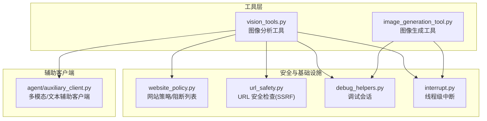
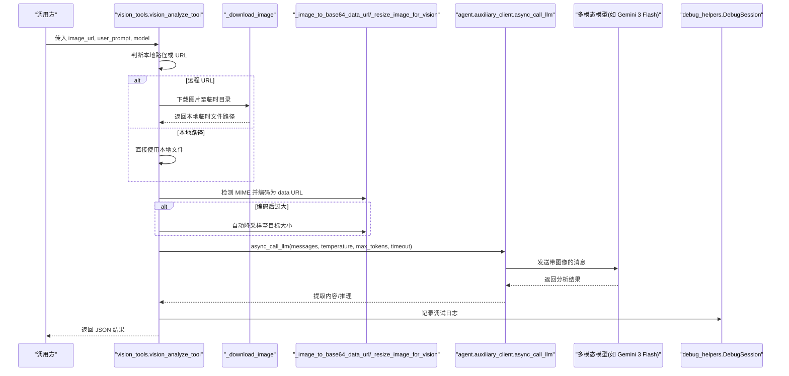
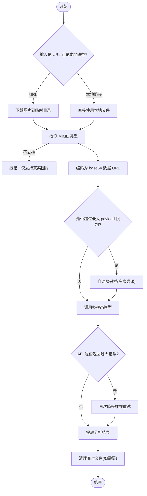
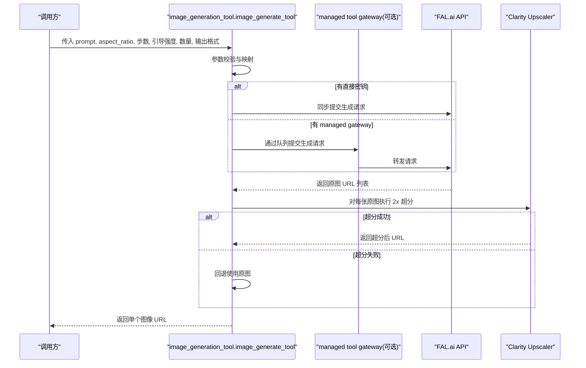
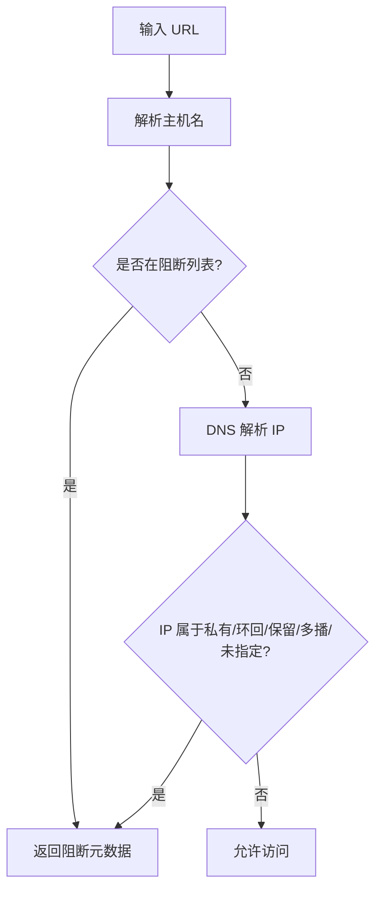
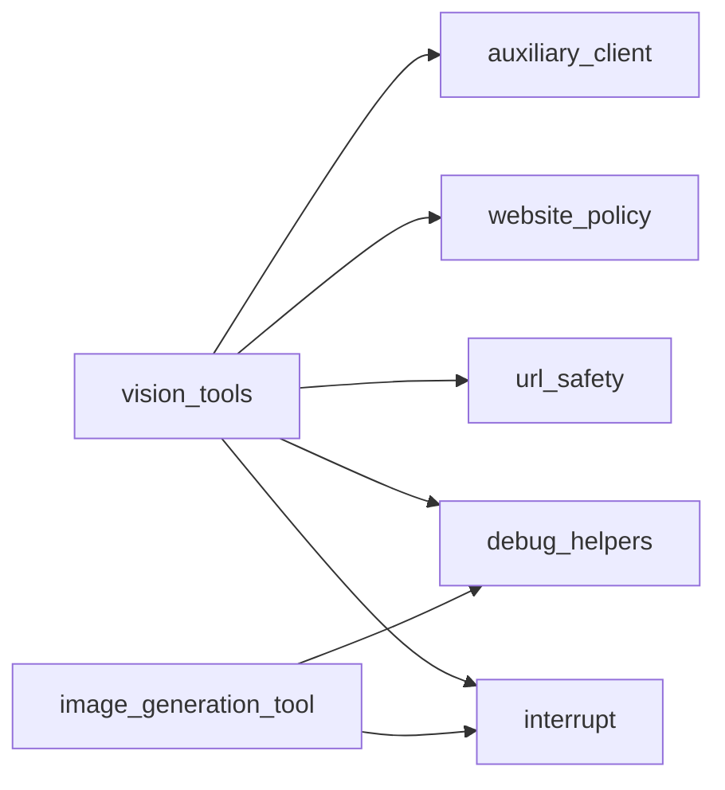

# 视觉工具

<cite>
**本文引用的文件列表**
- [vision_tools.py](file://tools/vision_tools.py)
- [image_generation_tool.py](file://tools/image_generation_tool.py)
- [website_policy.py](file://tools/website_policy.py)
- [url_safety.py](file://tools/url_safety.py)
- [debug_helpers.py](file://tools/debug_helpers.py)
- [interrupt.py](file://tools/interrupt.py)
- [auxiliary_client.py](file://agent/auxiliary_client.py)
</cite>

## 目录
1. [简介](#简介)
2. [项目结构与定位](#项目结构与定位)
3. [核心组件](#核心组件)
4. [架构总览](#架构总览)
5. [详细组件分析](#详细组件分析)
6. [依赖关系分析](#依赖关系分析)
7. [性能与优化](#性能与优化)
8. [故障排查指南](#故障排查指南)
9. [结论](#结论)
10. [附录：最佳实践与创意指导](#附录最佳实践与创意指导)

## 简介
本文件系统化梳理 Hermes Agent 中的视觉工具能力，覆盖图像分析（vision）与图像生成（image generation）两大模块，重点说明：
- 图像分析工具的输入来源、下载与格式转换、尺寸与压缩策略、错误处理与重试机制
- 图像生成工具的参数配置、质量控制与自动超分策略
- 安全与合规：网站访问策略、SSRF 防护、中断与调试支持
- 存储与缓存：临时文件清理、日志调试会话、线程级中断信号
- 性能优化与最佳实践：自动降采样、重试与回退、调试与监控

## 项目结构与定位
视觉工具位于 tools 目录下，分别提供：
- 视觉分析：从 URL 或本地路径加载图片，转为 base64 数据 URL，调用辅助客户端路由的多模态模型进行分析
- 图像生成：通过 FAL.ai 的 FLUX 2 Pro 模型生成图像，并使用 Clarity Upscaler 自动 2x 超分增强

图表来源
- [vision_tools.py:1-799](file://tools/vision_tools.py#L1-L799)
- [image_generation_tool.py:1-704](file://tools/image_generation_tool.py#L1-L704)
- [website_policy.py:1-283](file://tools/website_policy.py#L1-L283)
- [url_safety.py:1-98](file://tools/url_safety.py#L1-L98)
- [debug_helpers.py:1-106](file://tools/debug_helpers.py#L1-L106)
- [interrupt.py:1-77](file://tools/interrupt.py#L1-L77)
- [auxiliary_client.py:1-800](file://agent/auxiliary_client.py#L1-L800)

章节来源
- [vision_tools.py:1-799](file://tools/vision_tools.py#L1-L799)
- [image_generation_tool.py:1-704](file://tools/image_generation_tool.py#L1-L704)
- [auxiliary_client.py:1-800](file://agent/auxiliary_client.py#L1-L800)

## 核心组件
- 视觉分析工具（vision_tools）
  - 支持 URL 与本地文件路径两种输入
  - 下载远程图片到临时目录，自动检测 MIME 类型，转换为 base64 数据 URL
  - 自动尺寸检测与降采样，支持 API 失败后的二次尝试
  - 通过辅助客户端路由调用多模态模型，提取分析结果
  - 提供调试会话与中断支持
- 图像生成工具（image_generation_tool）
  - 使用 FAL.ai FLUX 2 Pro 生成图像，支持步数、引导强度、数量、输出格式等参数
  - 自动 2x 超分增强（Clarity Upscaler），失败时回退原图
  - 同步模式避免事件循环生命周期问题
  - 提供调试会话与中断支持

章节来源
- [vision_tools.py:405-679](file://tools/vision_tools.py#L405-L679)
- [image_generation_tool.py:352-534](file://tools/image_generation_tool.py#L352-L534)

## 架构总览
视觉工具在运行时的典型流程如下：

图表来源
- [vision_tools.py:405-679](file://tools/vision_tools.py#L405-L679)
- [auxiliary_client.py:1-800](file://agent/auxiliary_client.py#L1-L800)
- [debug_helpers.py:36-106](file://tools/debug_helpers.py#L36-L106)

## 详细组件分析

### 组件一：图像分析工具（vision_tools）
- 输入与来源
  - 支持 HTTP/HTTPS URL 与本地文件路径（含 file:// 前缀）
  - 对于 URL，下载到 ./temp_vision_images/ 临时目录；对于本地路径直接使用
- 下载与安全
  - 使用 httpx 异步下载，支持重定向与事件钩子二次校验
  - 内容长度预检与最大文件限制，防止大体积攻击
  - 网站策略与 URL 安全检查双重防护
- 编码与尺寸控制
  - 自动检测 MIME 类型，不支持的文件类型拒绝
  - base64 数据 URL 编码，超过上限自动降采样（先 Pillow 尝试，再回退）
  - 二次尝试：若 API 报错与“过大”相关，自动降采样后重试
- 多模态调用
  - 通过辅助客户端路由选择可用的多模态模型
  - 默认温度较低、较长上下文，适合精确描述与问答
- 错误处理与回退
  - 识别支付不足、模型不支持、请求无效等错误并给出明确提示
  - 内容为空时重试一次
- 资源清理
  - 仅清理临时下载的文件，本地缓存文件不删除
- 调试与中断
  - 可启用调试会话记录调用详情
  - 支持线程级中断，及时中止长时间任务

图表来源
- [vision_tools.py:128-229](file://tools/vision_tools.py#L128-L229)
- [vision_tools.py:299-403](file://tools/vision_tools.py#L299-L403)
- [vision_tools.py:552-591](file://tools/vision_tools.py#L552-L591)

章节来源
- [vision_tools.py:75-104](file://tools/vision_tools.py#L75-L104)
- [vision_tools.py:128-229](file://tools/vision_tools.py#L128-L229)
- [vision_tools.py:231-252](file://tools/vision_tools.py#L231-L252)
- [vision_tools.py:254-278](file://tools/vision_tools.py#L254-L278)
- [vision_tools.py:289-297](file://tools/vision_tools.py#L289-L297)
- [vision_tools.py:299-403](file://tools/vision_tools.py#L299-L403)
- [vision_tools.py:405-679](file://tools/vision_tools.py#L405-L679)

### 组件二：图像生成工具（image_generation_tool）
- 模型与默认参数
  - 默认模型：FAL.ai FLUX 2 Pro
  - 默认宽高比映射：landscape/square/portrait → 预设尺寸
  - 步数、引导强度、数量、输出格式等参数校验
- 生成与超分
  - 同步模式提交请求，避免事件循环生命周期问题
  - 成功后自动 2x 超分（Clarity Upscaler），失败则回退原图
- 环境与网关
  - 支持直接 FAL 密钥或通过 managed tool gateway（nous 用户令牌 + 队列主机）
  - 重用同步客户端以避免资源泄漏
- 调试与中断
  - 可启用调试会话记录生成过程
  - 支持线程级中断

图表来源
- [image_generation_tool.py:203-216](file://tools/image_generation_tool.py#L203-L216)
- [image_generation_tool.py:291-350](file://tools/image_generation_tool.py#L291-L350)
- [image_generation_tool.py:352-534](file://tools/image_generation_tool.py#L352-L534)

章节来源
- [image_generation_tool.py:46-87](file://tools/image_generation_tool.py#L46-L87)
- [image_generation_tool.py:218-289](file://tools/image_generation_tool.py#L218-L289)
- [image_generation_tool.py:291-350](file://tools/image_generation_tool.py#L291-L350)
- [image_generation_tool.py:352-534](file://tools/image_generation_tool.py#L352-L534)

### 组件三：安全与合规（website_policy 与 url_safety）
- 网站策略
  - 从配置读取阻断域名列表，支持共享文件合并
  - 缓存策略减少频繁解析 YAML
  - 对最终 URL 匹配规则，支持通配与父域匹配
- URL 安全
  - 解析主机名并解析 IP，阻断私有/环回/保留/多播/未指定地址
  - 特定内部主机名白名单阻断
  - 重定向链路二次校验，防止 SSRF

图表来源
- [website_policy.py:232-283](file://tools/website_policy.py#L232-L283)
- [url_safety.py:51-98](file://tools/url_safety.py#L51-L98)

章节来源
- [website_policy.py:93-199](file://tools/website_policy.py#L93-L199)
- [website_policy.py:232-283](file://tools/website_policy.py#L232-L283)
- [url_safety.py:51-98](file://tools/url_safety.py#L51-L98)

### 组件四：调试与中断（debug_helpers 与 interrupt）
- 调试会话
  - 通过环境变量开启，记录每次调用的参数、耗时、结果摘要
  - 保存为 JSON 文件，便于复盘与问题定位
- 线程级中断
  - 每个线程独立的中断状态，避免并发会话互相影响
  - 工具可在关键点轮询中断状态并优雅退出

章节来源
- [debug_helpers.py:36-106](file://tools/debug_helpers.py#L36-L106)
- [interrupt.py:24-49](file://tools/interrupt.py#L24-L49)

## 依赖关系分析
- 视觉分析工具依赖
  - 辅助客户端：统一多模态/文本后端选择与路由
  - 网站策略与 URL 安全：下载前与下载后双重阻断
  - 调试与中断：日志与中断信号
- 图像生成工具依赖
  - FAL.ai SDK（同步模式）与可选 managed gateway
  - 调试与中断：日志与中断信号

图表来源
- [vision_tools.py:40-42](file://tools/vision_tools.py#L40-L42)
- [image_generation_tool.py:39-42](file://tools/image_generation_tool.py#L39-L42)
- [auxiliary_client.py:1-800](file://agent/auxiliary_client.py#L1-L800)

章节来源
- [vision_tools.py:40-42](file://tools/vision_tools.py#L40-L42)
- [image_generation_tool.py:39-42](file://tools/image_generation_tool.py#L39-L42)
- [auxiliary_client.py:1-800](file://agent/auxiliary_client.py#L1-L800)

## 性能与优化
- 自动降采样与二次尝试
  - 在 API 拒绝“过大”时自动降采样至目标大小并重试，提升成功率
- 同步 API 避免事件循环生命周期问题
  - 图像生成工具采用同步模式，避免在 gateway 线程池中出现“事件循环已关闭”的问题
- 缓存与最小化解析
  - 网站策略采用短 TTL 缓存，降低频繁解析配置的成本
- 调试日志与指标
  - 调试会话记录调用次数、耗时、参数与结果摘要，便于性能分析与回归定位

章节来源
- [vision_tools.py:289-297](file://tools/vision_tools.py#L289-L297)
- [vision_tools.py:574-591](file://tools/vision_tools.py#L574-L591)
- [image_generation_tool.py:453-461](file://tools/image_generation_tool.py#L453-L461)
- [website_policy.py:131-199](file://tools/website_policy.py#L131-L199)
- [debug_helpers.py:70-89](file://tools/debug_helpers.py#L70-L89)

## 故障排查指南
- 视觉分析常见问题
  - “图像过大”：确认是否触发自动降采样；若仍失败，建议手动压缩或更换格式
  - “模型不支持/请求无效”：检查模型是否支持多模态，或图片格式是否被接受
  - “支付不足/余额不足”：切换到其他可用后端或充值
  - “网络/下载失败”：检查 URL 可达性、代理与防火墙；确认未被网站策略阻断
- 图像生成常见问题
  - “FAL_KEY 未设置”：请配置密钥或 managed gateway
  - “超分失败”：回退使用原图，不影响整体流程
  - “事件循环已关闭”：确保使用同步模式（工具已内置）
- 安全相关
  - 若被阻断，请检查网站策略配置与共享阻断列表
  - SSRF 防护：确认未指向私有/环回/保留地址
- 调试与中断
  - 开启调试会话查看 JSON 日志
  - 在长任务中合理设置中断，避免长时间占用

章节来源
- [vision_tools.py:620-668](file://tools/vision_tools.py#L620-L668)
- [image_generation_tool.py:516-534](file://tools/image_generation_tool.py#L516-L534)
- [website_policy.py:232-283](file://tools/website_policy.py#L232-L283)
- [url_safety.py:51-98](file://tools/url_safety.py#L51-L98)
- [debug_helpers.py:70-89](file://tools/debug_helpers.py#L70-L89)
- [interrupt.py:24-49](file://tools/interrupt.py#L24-L49)

## 结论
Hermes Agent 的视觉工具在安全性、稳定性与易用性之间取得良好平衡：
- 视觉分析：完善的下载与安全校验、自动降采样与二次尝试、统一的多模态后端路由
- 图像生成：稳定的同步模式、自动超分增强、清晰的参数与错误反馈
- 安全与合规：网站策略与 URL 安全检查双保险，调试与中断机制保障可观测性与可控性
- 性能与可维护性：缓存策略、最小化解析、日志与中断，便于持续优化与问题定位

## 附录：最佳实践与创意指导
- 视觉分析
  - 提示词应包含“完整描述+具体问题”，便于模型同时完成描述与问答
  - 对大图优先考虑自动降采样，或手动压缩后再分析
  - 使用本地缓存文件可避免重复下载，提高效率
- 图像生成
  - 选择合适的宽高比与步数，步数越多越耗时但细节更丰富
  - 引导强度影响与提示词契合度，适度调整以获得更贴合的风格
  - 输出格式优先 PNG 以保留透明度（如需）
- 安全与合规
  - 合理配置网站策略阻断列表，避免访问敏感站点
  - 避免指向私有/环回/保留地址，防止 SSRF
- 调试与监控
  - 开启调试会话，定期检查日志，关注失败率与耗时趋势
  - 在长任务中设置中断，避免资源浪费