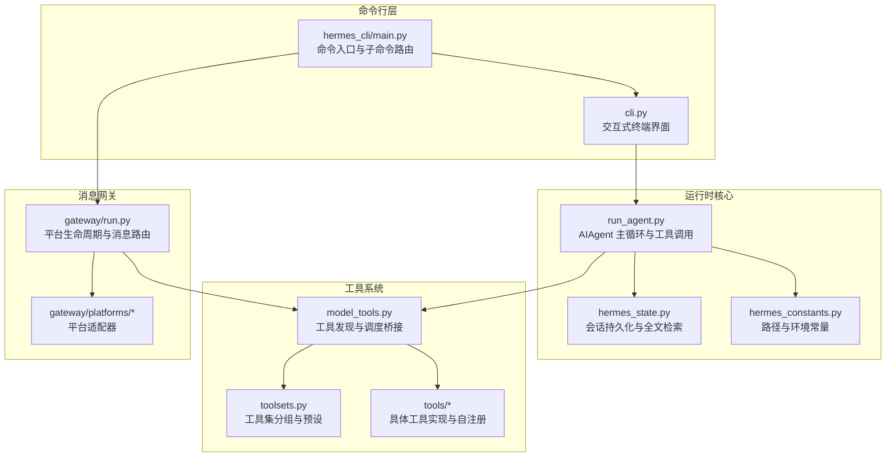
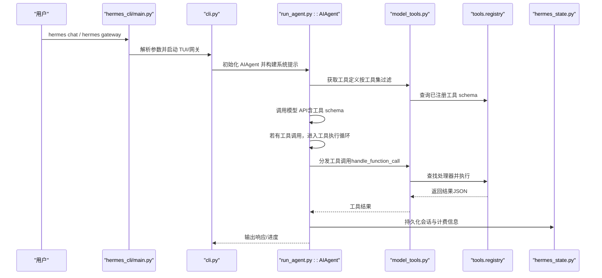
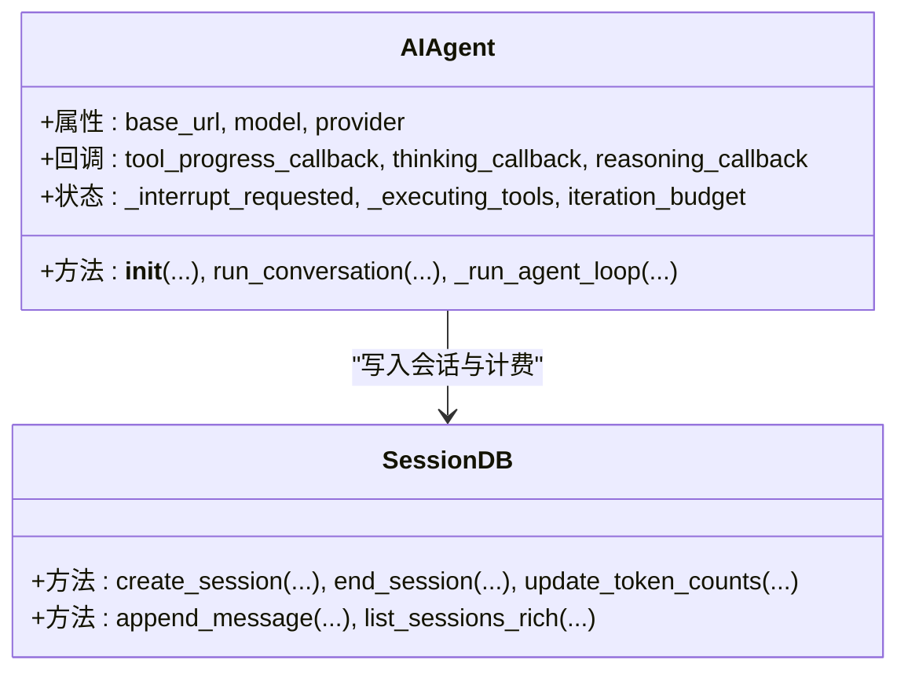
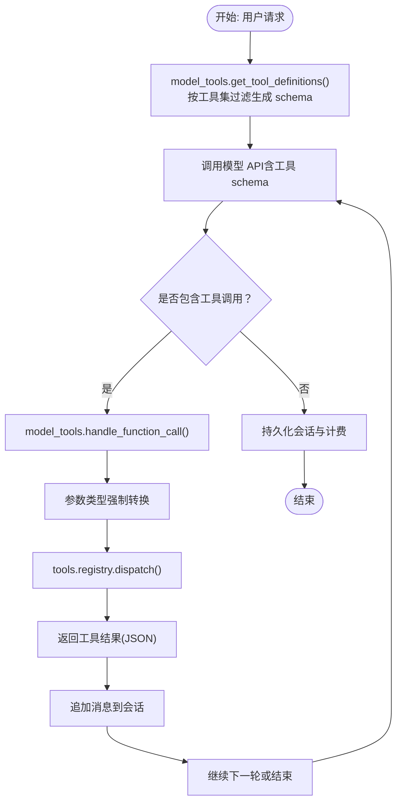
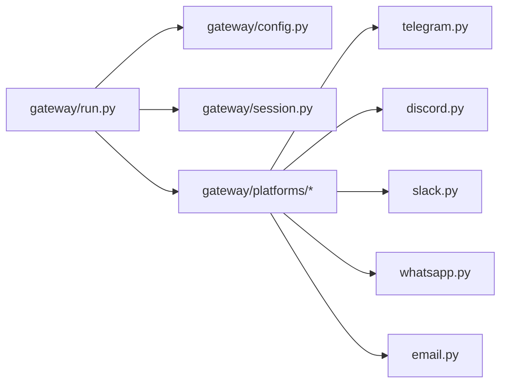
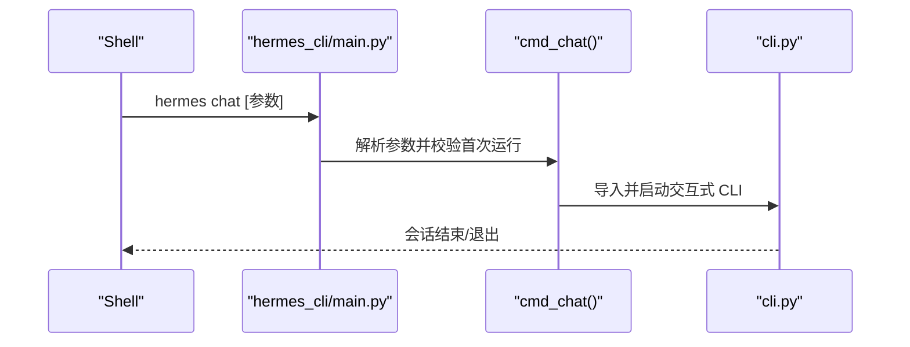
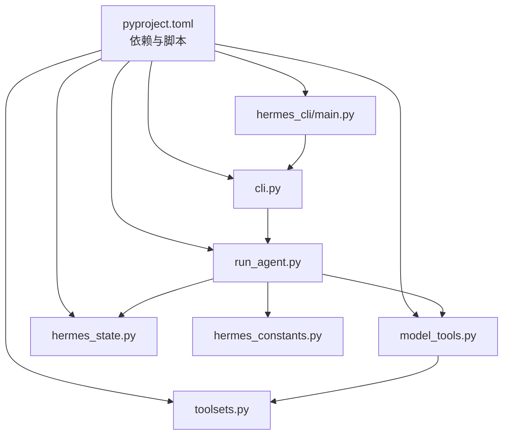

# 代码结构理解

<cite>
**本文档引用的文件**
- [README.md](file://README.md)
- [CONTRIBUTING.md](file://CONTRIBUTING.md)
- [pyproject.toml](file://pyproject.toml)
- [hermes_constants.py](file://hermes_constants.py)
- [hermes_state.py](file://hermes_state.py)
- [run_agent.py](file://run_agent.py)
- [cli.py](file://cli.py)
- [model_tools.py](file://model_tools.py)
- [toolsets.py](file://toolsets.py)
- [hermes_cli/main.py](file://hermes_cli/main.py)
</cite>

## 目录
1. [简介](#简介)
2. [项目结构](#项目结构)
3. [核心组件](#核心组件)
4. [架构总览](#架构总览)
5. [详细组件分析](#详细组件分析)
6. [依赖分析](#依赖分析)
7. [性能考虑](#性能考虑)
8. [故障排除指南](#故障排除指南)
9. [结论](#结论)
10. [附录](#附录)

## 简介
本指南面向希望深入理解 Hermes Agent 项目的开发者与贡献者，系统性解析其整体架构、模块组织原则与关键设计模式。重点涵盖 agent 核心模块、tools 工具系统、gateway 消息网关、hermes_cli 命令行接口等，并提供导入关系图、模块依赖关系说明以及新贡献者的快速上手方法。

## 项目结构
Hermes Agent 采用“功能域+层次化”的混合组织方式：核心对话循环位于 run_agent.py，交互式 CLI 在 cli.py，工具系统在 tools/，平台适配在 gateway/，命令行入口在 hermes_cli/。各子系统通过清晰的边界与公共接口（如 model_tools.py 的工具注册与调度）进行解耦协作。

**图表来源**
- [hermes_cli/main.py:1-200](file://hermes_cli/main.py#L1-L200)
- [cli.py:575-600](file://cli.py#L575-L600)
- [run_agent.py:492-800](file://run_agent.py#L492-L800)
- [model_tools.py:130-185](file://model_tools.py#L130-L185)
- [toolsets.py:66-391](file://toolsets.py#L66-L391)
- [hermes_state.py:115-161](file://hermes_state.py#L115-L161)
- [hermes_constants.py:11-57](file://hermes_constants.py#L11-L57)

**章节来源**
- [README.md:1-179](file://README.md#L1-L179)
- [CONTRIBUTING.md:114-197](file://CONTRIBUTING.md#L114-L197)

## 核心组件
- AIAgent（run_agent.py）：负责对话主循环、工具调用、上下文压缩、会话持久化与错误处理。
- 工具系统（model_tools.py + tools/）：通过自注册机制将工具 schema、处理器与元数据注入统一注册表，支持按工具集过滤与动态调度。
- 工具集（toolsets.py）：定义工具集合与场景化预设，支持组合与动态解析，便于不同平台与场景启用/禁用工具。
- 会话存储（hermes_state.py）：基于 SQLite + FTS5 的会话数据库，提供全文检索、计费统计与标题管理。
- 命令行入口（hermes_cli/main.py + cli.py）：提供 hermes 命令、聊天界面、网关管理、配置与诊断等功能。
- 网关（gateway/）：多平台消息适配与生命周期管理，承载跨平台会话与交付。

**章节来源**
- [run_agent.py:492-800](file://run_agent.py#L492-L800)
- [model_tools.py:130-185](file://model_tools.py#L130-L185)
- [toolsets.py:66-391](file://toolsets.py#L66-L391)
- [hermes_state.py:115-161](file://hermes_state.py#L115-L161)
- [hermes_cli/main.py:1-200](file://hermes_cli/main.py#L1-L200)
- [cli.py:575-600](file://cli.py#L575-L600)

## 架构总览
下图展示从命令行到工具执行的关键流程与模块交互：

**图表来源**
- [hermes_cli/main.py:676-784](file://hermes_cli/main.py#L676-L784)
- [cli.py:575-600](file://cli.py#L575-L600)
- [run_agent.py:492-800](file://run_agent.py#L492-L800)
- [model_tools.py:234-354](file://model_tools.py#L234-L354)
- [hermes_state.py:355-420](file://hermes_state.py#L355-L420)

## 详细组件分析

### agent 核心模块（AIAgent）
- 职责：管理对话循环、工具调用、上下文压缩、会话持久化、错误分类与重试、流式输出回调、迭代预算控制。
- 关键特性：
  - 自适应 API 模式（chat_completions / codex_responses / anthropic_messages）。
  - 迭代预算与中断机制，避免无限工具调用。
  - 并行工具执行策略（只对安全工具并行，路径隔离）。
  - 推理配置与提示缓存（Anthropic）。
- 会话持久化：通过 hermes_state.py 写入 sessions/messages 表，支持 FTS5 全文检索与标题管理。

**图表来源**
- [run_agent.py:492-800](file://run_agent.py#L492-L800)
- [hermes_state.py:355-420](file://hermes_state.py#L355-L420)

**章节来源**
- [run_agent.py:492-800](file://run_agent.py#L492-L800)
- [hermes_state.py:115-161](file://hermes_state.py#L115-L161)

### tools 工具系统（自注册与调度）
- 自注册工具模式：每个工具文件在导入时调用 tools.registry.register() 完成 schema 与处理器注册；model_tools.py 通过集中导入触发发现。
- 调度桥接：model_tools.handle_function_call 统一接收工具调用，先类型强制转换，再通过注册表分发，支持插件钩子与沙箱工具动态 schema。
- 工具集分组：toolsets.py 提供 web、terminal、file、browser、skills、messaging 等常用工具集，支持组合与场景化预设（如 hermes-cli、hermes-telegram 等）。

**图表来源**
- [model_tools.py:234-354](file://model_tools.py#L234-L354)
- [model_tools.py:459-549](file://model_tools.py#L459-L549)
- [toolsets.py:66-391](file://toolsets.py#L66-L391)

**章节来源**
- [model_tools.py:130-185](file://model_tools.py#L130-L185)
- [model_tools.py:234-354](file://model_tools.py#L234-L354)
- [model_tools.py:459-549](file://model_tools.py#L459-L549)
- [toolsets.py:66-391](file://toolsets.py#L66-L391)

### gateway 消息网关
- 职责：统一平台生命周期（启动/停止/重启）、消息路由、会话管理、定时任务与平台特定适配（Telegram、Discord、Slack、WhatsApp、Signal、Email 等）。
- 设计要点：平台适配器遵循统一基类接口，通过配置解析与会话上下文管理实现一致的用户体验。

**图表来源**
- [hermes_cli/main.py:786-790](file://hermes_cli/main.py#L786-L790)
- [toolsets.py:284-391](file://toolsets.py#L284-L391)

**章节来源**
- [hermes_cli/main.py:786-790](file://hermes_cli/main.py#L786-L790)
- [toolsets.py:284-391](file://toolsets.py#L284-L391)

### hermes_cli 命令行接口
- 职责：hermes 命令入口、子命令解析（chat、gateway、setup、doctor、cron 等）、配置加载与环境变量桥接、皮肤引擎初始化、资源清理与容器后端路由。
- 关键流程：命令入口解析参数后，根据子命令路由到对应模块（如 chat 启动 cli.py 的交互式 TUI，gateway 管理网关进程）。

**图表来源**
- [hermes_cli/main.py:676-784](file://hermes_cli/main.py#L676-L784)
- [cli.py:575-600](file://cli.py#L575-L600)

**章节来源**
- [hermes_cli/main.py:1-200](file://hermes_cli/main.py#L1-L200)
- [hermes_cli/main.py:676-784](file://hermes_cli/main.py#L676-L784)
- [cli.py:575-600](file://cli.py#L575-L600)

## 依赖分析
- 包与脚本：pyproject.toml 定义了核心依赖、可选依赖与脚本入口（hermes、hermes-agent、hermes-acp），并声明了 setuptools 打包规则。
- 模块导入关系：
  - hermes_cli/main.py 依赖 hermes_constants 加载环境，初始化日志与 IPv4 优先级，再路由到具体命令。
  - cli.py 依赖 run_agent.py 与 model_tools.py，负责 TUI 与会话交互。
  - run_agent.py 依赖 agent/* 子模块（prompt_builder、context_compressor、memory_manager 等）与 tools/* 工具。
  - model_tools.py 依赖 tools.registry 与 toolsets，完成工具发现与调度。
  - hermes_state.py 依赖 hermes_constants 提供默认数据库路径。

**图表来源**
- [pyproject.toml:1-129](file://pyproject.toml#L1-L129)
- [hermes_cli/main.py:1-200](file://hermes_cli/main.py#L1-L200)
- [cli.py:575-600](file://cli.py#L575-L600)
- [run_agent.py:492-800](file://run_agent.py#L492-L800)
- [model_tools.py:130-185](file://model_tools.py#L130-L185)
- [toolsets.py:66-391](file://toolsets.py#L66-L391)
- [hermes_state.py:115-161](file://hermes_state.py#L115-L161)
- [hermes_constants.py:11-57](file://hermes_constants.py#L11-L57)

**章节来源**
- [pyproject.toml:1-129](file://pyproject.toml#L1-L129)
- [hermes_cli/main.py:1-200](file://hermes_cli/main.py#L1-L200)
- [cli.py:575-600](file://cli.py#L575-L600)
- [run_agent.py:492-800](file://run_agent.py#L492-L800)
- [model_tools.py:130-185](file://model_tools.py#L130-L185)
- [toolsets.py:66-391](file://toolsets.py#L66-L391)
- [hermes_state.py:115-161](file://hermes_state.py#L115-L161)
- [hermes_constants.py:11-57](file://hermes_constants.py#L11-L57)

## 性能考虑
- 数据库并发：hermes_state.py 使用 WAL 模式与短超时 + 随机抖动重试，降低多进程写锁竞争导致的 UI 卡顿。
- 工具并行：仅对只读/无共享状态工具进行并行执行，路径相关工具按目标路径去重，避免冲突。
- 事件循环：model_tools.py 为 CLI/网关线程维护长生命周期事件循环，避免“事件循环已关闭”问题，提升异步客户端稳定性。
- 上下文压缩：run_agent.py 在接近上下文限制时自动触发压缩，减少重复计算与网络往返。

**章节来源**
- [hermes_state.py:123-236](file://hermes_state.py#L123-L236)
- [run_agent.py:267-337](file://run_agent.py#L267-L337)
- [model_tools.py:44-126](file://model_tools.py#L44-L126)

## 故障排除指南
- 首次运行无配置：hermes_cli/main.py 中的 cmd_chat 对未配置提供明确引导，建议运行 hermes setup。
- 网络连接问题：可通过配置 network.force_ipv4 强制 IPv4，避免 IPv6 回退导致的超时。
- 工具不可用：使用 hermes doctor 检查依赖与配置；通过 hermes tools 列出可用工具集；检查工具集过滤与 check_fn 条件。
- 会话恢复：使用 hermes sessions browse 或直接传入会话 ID/标题进行恢复；若标题冲突，系统会自动选择最新延续版本。
- 日志定位：所有 hermes 子命令均写入 agent.log 与 errors.log，位于 ~/.hermes/logs/。

**章节来源**
- [hermes_cli/main.py:708-734](file://hermes_cli/main.py#L708-L734)
- [hermes_constants.py:253-293](file://hermes_constants.py#L253-L293)
- [hermes_state.py:653-681](file://hermes_state.py#L653-L681)

## 结论
Hermes Agent 通过清晰的模块边界与设计模式（自注册工具、工具集分组、会话持久化、异步事件循环管理）实现了高扩展性与跨平台一致性。新贡献者可从 hermes_cli/main.py 与 cli.py 入门，逐步理解 run_agent.py 的核心循环与 model_tools.py 的工具调度机制，再深入 gateway 与 tools 子系统以扩展能力。

## 附录
- 新贡献者快速上手清单：
  - 阅读 README 与 CONTRIBUTING，确认开发环境与安装步骤。
  - 从 hermes_cli/main.py 与 cli.py 熟悉命令行与 TUI 流程。
  - 阅读 run_agent.py 了解 AIAgent 的核心循环与工具调用链。
  - 通过 model_tools.py 与 toolsets.py 理解工具注册与分组机制。
  - 使用 hermes doctor 与 hermes sessions browse 快速验证配置与会话状态。
  - 参考 pyproject.toml 了解依赖与打包规则，确保本地开发环境一致。

**章节来源**
- [README.md:140-179](file://README.md#L140-L179)
- [CONTRIBUTING.md:52-111](file://CONTRIBUTING.md#L52-L111)
- [hermes_cli/main.py:1-200](file://hermes_cli/main.py#L1-L200)
- [cli.py:575-600](file://cli.py#L575-L600)
- [run_agent.py:492-800](file://run_agent.py#L492-L800)
- [model_tools.py:130-185](file://model_tools.py#L130-L185)
- [toolsets.py:66-391](file://toolsets.py#L66-L391)
- [pyproject.toml:1-129](file://pyproject.toml#L1-L129)