# AIAgent核心类

<cite>
**本文档引用的文件**
- [run_agent.py](file://run_agent.py)
- [AGENTS.md](file://AGENTS.md)
- [model_tools.py](file://model_tools.py)
- [tools/registry.py](file://tools/registry.py)
- [agent/prompt_builder.py](file://agent/prompt_builder.py)
- [agent/context_compressor.py](file://agent/context_compressor.py)
- [agent/memory_manager.py](file://agent/memory_manager.py)
- [agent/anthropic_adapter.py](file://agent/anthropic_adapter.py)
- [agent/error_classifier.py](file://agent/error_classifier.py)
- [agent/retry_utils.py](file://agent/retry_utils.py)
- [agent/smart_model_routing.py](file://agent/smart_model_routing.py)
- [agent/model_metadata.py](file://agent/model_metadata.py)
- [agent/display.py](file://agent/display.py)
- [agent/trajectory.py](file://agent/trajectory.py)
- [agent/usage_pricing.py](file://agent/usage_pricing.py)
- [agent/rate_limit_tracker.py](file://agent/rate_limit_tracker.py)
- [agent/subdirectory_hints.py](file://agent/subdirectory_hints.py)
- [agent/prompt_caching.py](file://agent/prompt_caching.py)
- [agent/title_generator.py](file://agent/title_generator.py)
- [agent/insights.py](file://agent/insights.py)
- [agent/redact.py](file://agent/redact.py)
- [agent/manual_compression_feedback.py](file://agent/manual_compression_feedback.py)
- [agent/skill_utils.py](file://agent/skill_utils.py)
- [agent/skill_commands.py](file://agent/skill_commands.py)
- [agent/memory_provider.py](file://agent/memory_provider.py)
- [agent/auxiliary_client.py](file://agent/auxiliary_client.py)
- [agent/copilot_acp_client.py](file://agent/copilot_acp_client.py)
- [agent/cached_client.py](file://agent/cached_client.py)
- [agent/credential_pool.py](file://agent/credential_pool.py)
- [agent/smart_model_routing.py](file://agent/smart_model_routing.py)
- [agent/smart_model_routing.py](file://agent/smart_model_routing.py)
- [agent/smart_model_routing.py](file://agent/smart_model_routing.py)
- [agent/smart_model_routing.py](file://agent/smart_model_routing.py)
- [agent/smart_model_routing.py](file://agent/smart_model_routing.py)
- [agent/smart_model_routing.py](file://agent/smart_model_routing.py)
- [agent/smart_model_routing.py](file://agent/smart_model_routing.py)
- [agent/smart_model_routing.py](file://agent/smart_model_routing.py)
- [agent/smart_model_routing.py](file://agent/smart_model_routing.py)
- [agent/smart_model_routing.py](file://agent/smart_model_routing.py)
- [agent/smart_model_routing.py](file://agent/smart_model_routing.py)
- [agent/smart_model_routing.py](file://agent/smart_model_routing.py)
- [agent/smart_model_routing.py](file://agent/smart_model_routing.py)
- [agent/smart_model_routing.py](file://agent/smart_model_routing.py)
- [agent/smart_model_routing.py](file://agent/smart_model_routing.py)
- [agent/smart_model_routing.py](file://agent/smart_model_routing.py)
- [agent/smart_model_routing.py](file://agent/smart_model_routing.py)
- [agent/smart_model_routing.py](file://agent/smart_model_routing.py)
- [agent/smart_model_routing.py](file://agent/smart_model_routing.py)
- [agent/smart_model_routing.py](file://agent/smart_model_routing.py)
- [agent/smart_model_routing.py](file://agent/smart_model_routing.py)
- [agent/smart_model_routing.py](file://agent/smart_model_routing.py)
- [agent/smart_model_routing.py](file://agent/smart_model_routing.py)
- [agent/smart_model_routing.py](file://agent/smart_model_routing.py)
- [agent/smart_model_routing.py](file://agent/smart_model_routing.py)
- [agent/smart_model_routing.py](file://agent/smart_model_routing.py)
- [agent/smart_model_routing.py](file://agent/smart_model_routing.py)
- [agent/smart_model_routing.py](file://agent/smart_model_routing.py)
- [agent/s......](file://agent/smart_model_routing.py)
</cite>

## 目录
1. [简介](#简介)
2. [项目结构](#项目结构)
3. [核心组件](#核心组件)
4. [架构概览](#架构概览)
5. [详细组件分析](#详细组件分析)
6. [依赖分析](#依赖分析)
7. [性能考虑](#性能考虑)
8. [故障排除指南](#故障排除指南)
9. [结论](#结论)

## 简介

AIAgent是Hermes Agent项目的核心类，负责管理AI模型的对话循环、工具调用执行和响应处理。该类提供了完整的AI代理功能，包括自动工具调用循环、可配置的模型参数、错误处理和恢复、消息历史管理以及对多个模型提供商的支持。

AIAgent类设计为独立的AI代理，可以与支持函数调用的AI模型配合使用，处理对话循环、工具执行和响应管理。它支持多种API模式（聊天完成、Codex响应、Anthropic消息），具有强大的错误处理和恢复机制，以及灵活的工具系统。

## 项目结构

Hermes Agent项目的整体架构围绕AIAgent核心类构建，采用模块化设计：

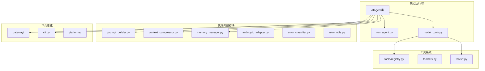

**图表来源**
- [run_agent.py:1-100](file://run_agent.py#L1-L100)
- [AGENTS.md:11-80](file://AGENTS.md#L11-L80)

**章节来源**
- [run_agent.py:1-100](file://run_agent.py#L1-L100)
- [AGENTS.md:11-80](file://AGENTS.md#L11-L80)

## 核心组件

### AIAgent类设计架构

AIAgent类采用了分层架构设计，将不同功能模块分离到专门的子系统中：

#### 初始化参数配置
- **基础配置**：base_url、api_key、provider、model
- **会话管理**：max_iterations、tool_delay、session_id
- **工具系统**：enabled_toolsets、disabled_toolsets、save_trajectories
- **回调系统**：各种事件回调函数
- **高级配置**：reasoning_config、max_tokens、service_tier

#### 对话循环管理机制
- **迭代预算系统**：通过IterationBudget类管理最大迭代次数
- **中断机制**：支持线程安全的中断请求和传播
- **子代理委托**：支持嵌套的子代理执行和资源管理

#### 工具调用流程控制
- **工具发现**：动态加载和验证可用工具
- **并发执行**：智能并行工具执行和序列化执行
- **结果处理**：统一的工具结果格式化和持久化

**章节来源**
- [run_agent.py:492-780](file://run_agent.py#L492-L780)
- [AGENTS.md:82-125](file://AGENTS.md#L82-L125)

## 架构概览

AIAgent的整体架构体现了高度模块化和可扩展的设计原则：

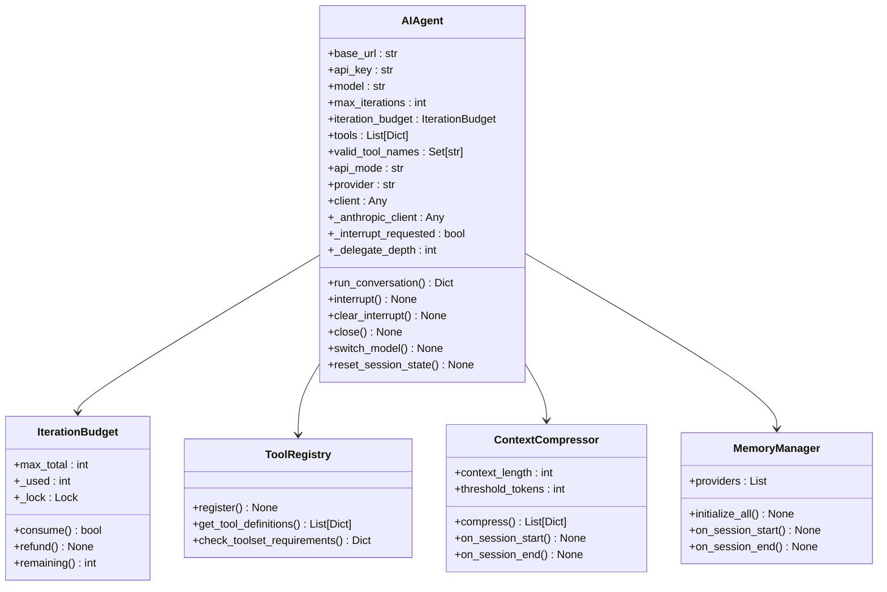

**图表来源**
- [run_agent.py:170-212](file://run_agent.py#L170-L212)
- [run_agent.py:975-997](file://run_agent.py#L975-L997)
- [run_agent.py:1207-1311](file://run_agent.py#L1207-L1311)
- [run_agent.py:1116-1181](file://run_agent.py#L1116-L1181)

## 详细组件分析

### 初始化参数配置系统

AIAgent的初始化过程非常复杂，涉及多个配置层面的处理：

#### 基础配置解析
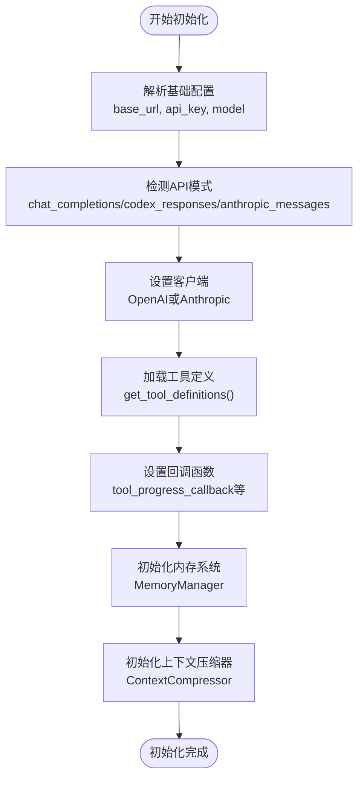

**图表来源**
- [run_agent.py:516-780](file://run_agent.py#L516-L780)
- [run_agent.py:825-949](file://run_agent.py#L825-L949)

#### 配置参数详解

| 参数名称 | 类型 | 默认值 | 描述 |
|---------|------|--------|------|
| base_url | str | None | 模型API的基础URL |
| api_key | str | None | API认证密钥 |
| provider | str | None | 提供商标识符 |
| model | str | "" | 要使用的模型名称 |
| max_iterations | int | 90 | 工具调用的最大迭代次数 |
| tool_delay | float | 1.0 | 工具调用之间的延迟（秒） |
| save_trajectories | bool | False | 是否保存对话轨迹到JSONL文件 |
| verbose_logging | bool | False | 启用详细日志记录用于调试 |
| quiet_mode | bool | False | 抑制进度输出以获得干净的CLI体验 |

**章节来源**
- [run_agent.py:516-620](file://run_agent.py#L516-L620)

### 对话循环管理系统

AIAgent的核心对话循环实现了完整的工具调用自动化：

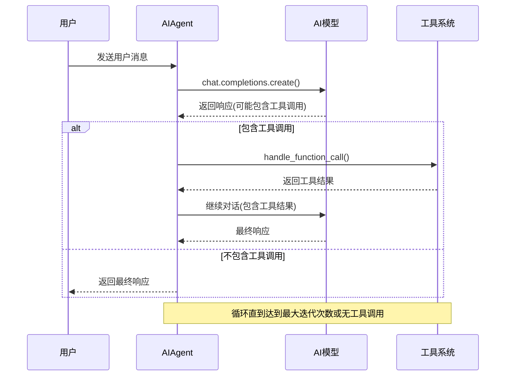

**图表来源**
- [run_agent.py:113-122](file://run_agent.py#L113-L122)

#### 迭代预算系统

AIAgent实现了精细的迭代预算控制系统：

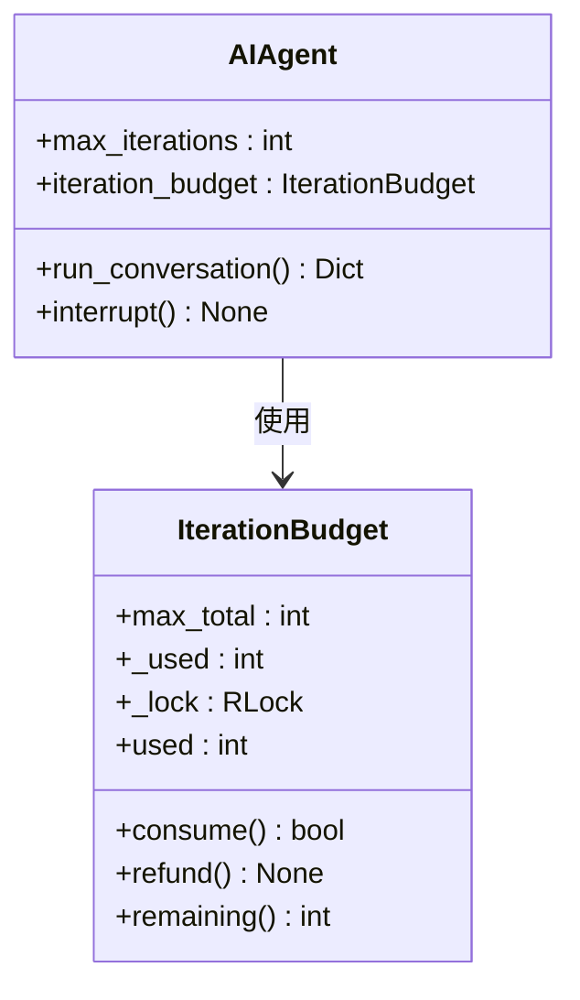

**图表来源**
- [run_agent.py:170-212](file://run_agent.py#L170-L212)

**章节来源**
- [run_agent.py:170-212](file://run_agent.py#L170-L212)
- [run_agent.py:113-122](file://run_agent.py#L113-L122)

### 工具调用流程控制系统

AIAgent的工具系统支持智能的并行执行和序列化执行：

#### 工具执行策略
- **完全并行**：当工具不共享状态且路径独立时
- **部分并行**：当工具有独立路径作用域时
- **序列化执行**：当工具需要互斥访问或交互时

#### 工具分类系统
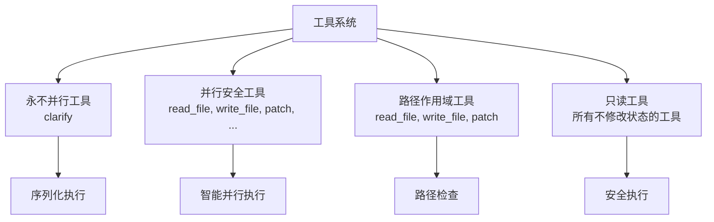

**图表来源**
- [run_agent.py:214-337](file://run_agent.py#L214-L337)

**章节来源**
- [run_agent.py:214-337](file://run_agent.py#L214-L337)
- [run_agent.py:975-997](file://run_agent.py#L975-L997)

### 中断机制实现

AIAgent提供了强大的中断机制，支持优雅地停止当前的工具调用循环：

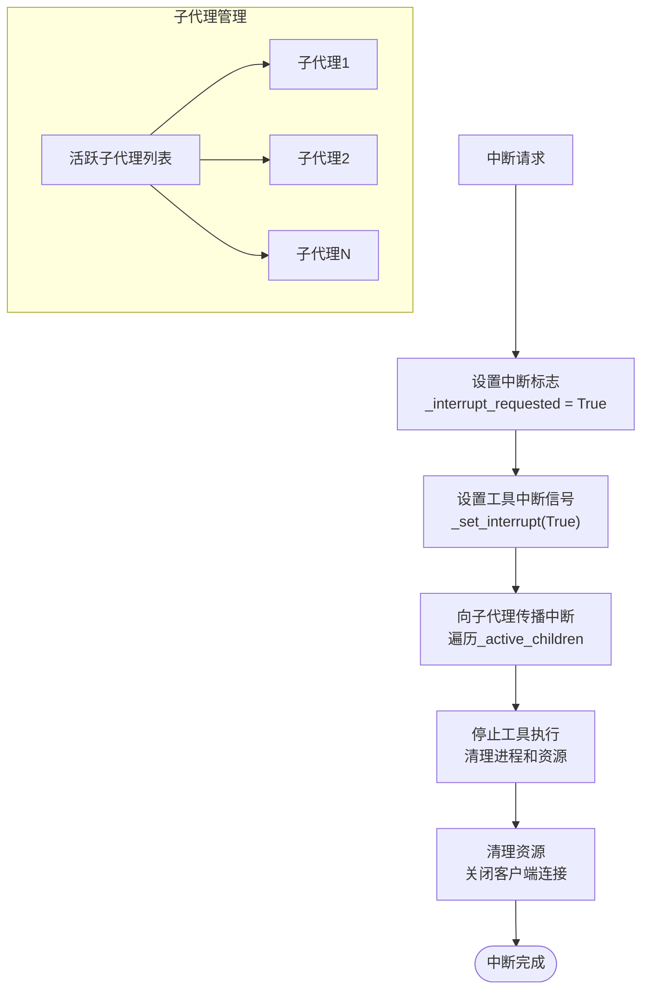

**图表来源**
- [run_agent.py:2833-2873](file://run_agent.py#L2833-L2873)

**章节来源**
- [run_agent.py:2833-2873](file://run_agent.py#L2833-L2873)

### 子代理委托功能

AIAgent支持嵌套的子代理执行，实现复杂的任务分解：

#### 子代理生命周期管理
- **深度跟踪**：通过_delegate_depth属性跟踪嵌套层级
- **资源隔离**：每个子代理拥有独立的资源和配置
- **中断传播**：父代理的中断请求会传播到所有活跃子代理

#### 内存和技能系统集成
子代理可以访问和修改主代理的内存存储，但保持自己的执行上下文：

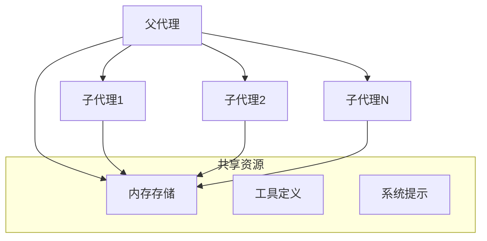

**图表来源**
- [run_agent.py:2105-2204](file://run_agent.py#L2105-L2204)

**章节来源**
- [run_agent.py:2105-2204](file://run_agent.py#L2105-L2204)

### 错误处理和恢复策略

AIAgent实现了多层次的错误处理和恢复机制：

#### 错误分类系统
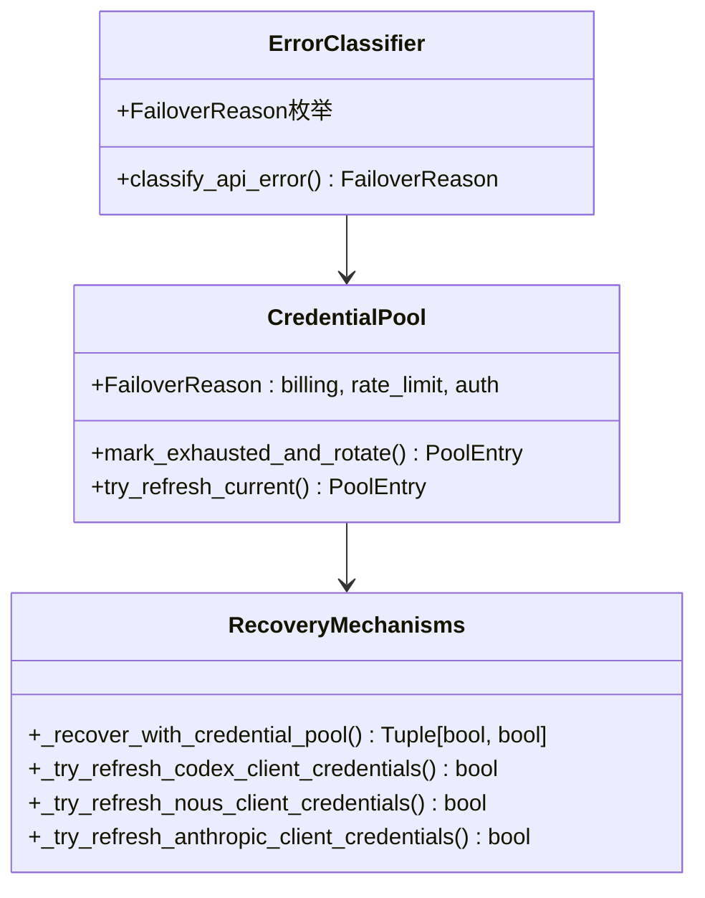

**图表来源**
- [run_agent.py:4610-4692](file://run_agent.py#L4610-L4692)
- [run_agent.py:4463-4564](file://run_agent.py#L4463-L4564)

**章节来源**
- [run_agent.py:4610-4692](file://run_agent.py#L4610-L4692)
- [run_agent.py:4463-4564](file://run_agent.py#L4463-L4564)

### 回调函数系统

AIAgent提供了丰富的回调函数接口，用于监控和控制代理行为：

#### 回调类型分类
- **工具回调**：tool_progress_callback、tool_start_callback、tool_complete_callback
- **思维回调**：thinking_callback、reasoning_callback
- **状态回调**：status_callback、step_callback
- **流式回调**：stream_delta_callback、interim_assistant_callback

#### 回调执行时机
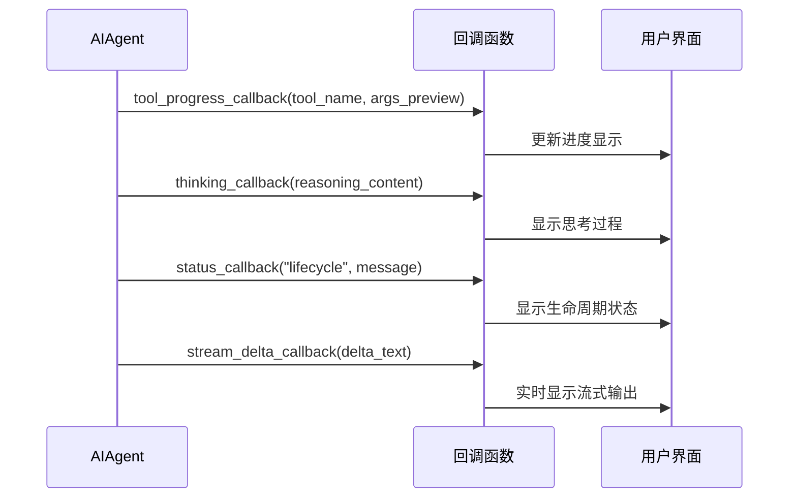

**图表来源**
- [run_agent.py:693-704](file://run_agent.py#L693-L704)

**章节来源**
- [run_agent.py:693-704](file://run_agent.py#L693-L704)

## 依赖分析

AIAgent类的依赖关系体现了清晰的模块化设计：

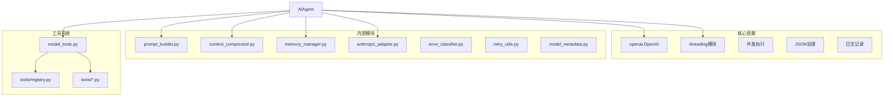

**图表来源**
- [run_agent.py:23-110](file://run_agent.py#L23-L110)
- [run_agent.py:77-110](file://run_agent.py#L77-L110)

**章节来源**
- [run_agent.py:23-110](file://run_agent.py#L23-L110)

## 性能考虑

### 并发执行优化
- **线程池限制**：最大8个并发工作线程，避免资源过度消耗
- **智能并行检测**：根据工具特性自动选择最佳执行策略
- **资源清理**：及时清理僵尸进程和悬挂连接

### 内存管理
- **上下文压缩**：自动压缩长对话历史，控制内存使用
- **增量持久化**：工具结果的增量存储，减少磁盘I/O
- **缓存机制**：系统提示和工具定义的缓存，提高响应速度

### 网络优化
- **连接复用**：共享HTTP客户端，减少连接建立开销
- **超时配置**：合理的超时设置，避免长时间阻塞
- **重试策略**：指数退避重试，提高网络稳定性

## 故障排除指南

### 常见问题诊断

#### API认证问题
- **症状**：401未授权错误
- **解决方案**：检查API密钥配置，验证提供商设置

#### 上下文溢出
- **症状**：431请求头字段过大或413请求实体过大
- **解决方案**：启用上下文压缩，检查模型上下文限制

#### 工具执行失败
- **症状**：工具调用返回错误或超时
- **解决方案**：检查工具依赖，验证环境配置

#### 中断无效
- **症状**：调用interrupt()后仍继续执行
- **解决方案**：确认中断标志正确设置，检查线程ID匹配

**章节来源**
- [run_agent.py:2521-2657](file://run_agent.py#L2521-L2657)

### 调试技巧

#### 启用详细日志
```python
# 在初始化时设置verbose_logging=True
agent = AIAgent(
    base_url="...",
    api_key="...",
    verbose_logging=True
)
```

#### 请求调试
AIAgent会自动保存请求调试信息到日志目录，便于问题诊断。

#### 资源监控
使用`get_activity_summary()`方法获取代理的活动状态，包括最后活动时间、当前工具和API调用计数。

**章节来源**
- [run_agent.py:2908-2924](file://run_agent.py#L2908-L2924)
- [run_agent.py:2675-2755](file://run_agent.py#L2675-L2755)

## 结论

AIAgent核心类展现了现代AI代理系统的最佳实践，具有以下特点：

### 设计优势
- **模块化架构**：清晰的功能分离和依赖管理
- **可扩展性**：支持新的工具、提供商和平台集成
- **可靠性**：完善的错误处理和恢复机制
- **性能优化**：智能的并发执行和资源管理

### 关键特性
- **灵活的配置系统**：支持多种API模式和提供商
- **强大的工具系统**：智能的工具发现和执行
- **优雅的中断机制**：支持实时的用户中断
- **丰富的回调接口**：全面的状态监控和UI集成

### 应用场景
AIAgent适用于各种AI代理应用场景，包括：
- CLI交互式助手
- 多平台消息机器人
- 自动化任务执行
- 开发者工具集成

通过其模块化设计和丰富的功能集，AIAgent为构建复杂AI应用提供了坚实的基础框架。