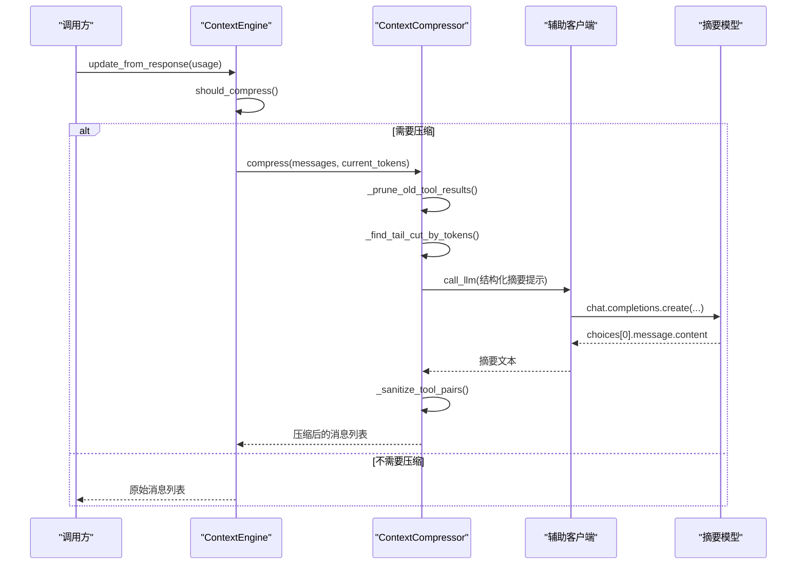
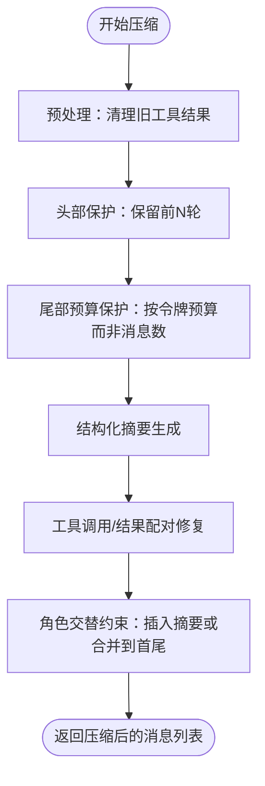
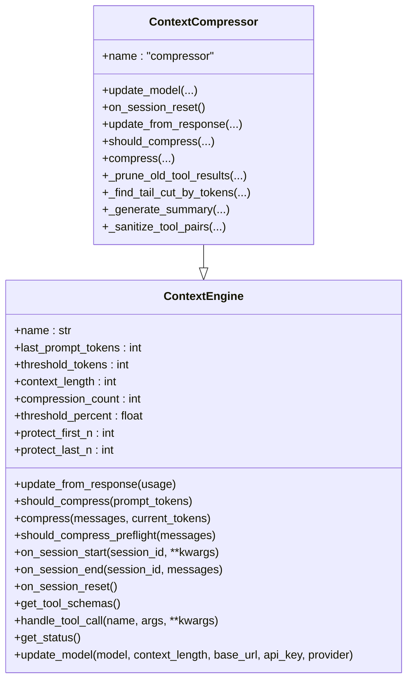
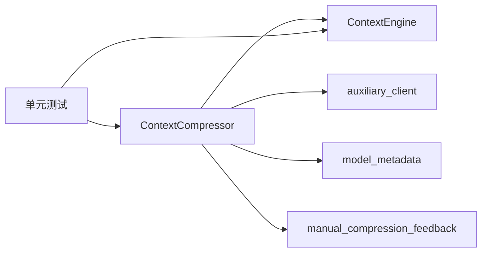

# 上下文压缩系统

<cite>
**本文档引用的文件**
- [agent/context_compressor.py](file://agent/context_compressor.py)
- [agent/context_engine.py](file://agent/context_engine.py)
- [agent/auxiliary_client.py](file://agent/auxiliary_client.py)
- [agent/model_metadata.py](file://agent/model_metadata.py)
- [agent/manual_compression_feedback.py](file://agent/manual_compression_feedback.py)
- [tests/agent/test_context_compressor.py](file://tests/agent/test_context_compressor.py)
- [tests/agent/test_context_engine.py](file://tests/agent/test_context_engine.py)
</cite>

## 目录
1. [简介](#简介)
2. [项目结构](#项目结构)
3. [核心组件](#核心组件)
4. [架构总览](#架构总览)
5. [详细组件分析](#详细组件分析)
6. [依赖关系分析](#依赖关系分析)
7. [性能考量](#性能考量)
8. [故障排查指南](#故障排查指南)
9. [结论](#结论)
10. [附录：配置与使用示例](#附录配置与使用示例)

## 简介
本文件面向上下文压缩系统的技术文档，重点解析 context_compressor 模块的设计架构与实现原理，涵盖历史对话压缩算法、关键信息提取、压缩质量评估等核心功能；同时说明 context_engine 的工作机制与缓存策略，解释压缩阈值设置、压缩比例控制、压缩后内容恢复等关键技术，并提供配置与监控压缩效果的具体方法（含手动压缩与自动压缩的使用场景），以及压缩算法优化与性能调优的最佳实践。

## 项目结构
上下文压缩系统由以下关键模块构成：
- context_engine：抽象基类，定义上下文引擎的统一接口与生命周期管理
- context_compressor：默认实现，基于损失性摘要进行长对话压缩
- auxiliary_client：辅助客户端路由，为压缩摘要生成提供可用的廉价/快速模型
- model_metadata：模型元数据与上下文长度探测工具
- manual_compression_feedback：手动压缩后的用户反馈汇总
- 测试用例：覆盖压缩阈值、摘要生成、工具调用配对完整性、尾部保护预算等

```mermaid
graph TB
CE["ContextEngine 抽象基类"]
CC["ContextCompressor 默认实现"]
AC["辅助客户端路由 auxiliary_client"]
MM["模型元数据 model_metadata"]
MCF["手动压缩反馈 manual_compression_feedback"]
CE --> CC
CC --> AC
CC --> MM
CC --> MCF
```

图表来源
- [agent/context_engine.py:32-185](file://agent/context_engine.py#L32-L185)
- [agent/context_compressor.py:60-170](file://agent/context_compressor.py#L60-L170)
- [agent/auxiliary_client.py:1-120](file://agent/auxiliary_client.py#L1-L120)
- [agent/model_metadata.py:1-120](file://agent/model_metadata.py#L1-L120)
- [agent/manual_compression_feedback.py:1-50](file://agent/manual_compression_feedback.py#L1-L50)

章节来源
- [agent/context_engine.py:1-185](file://agent/context_engine.py#L1-L185)
- [agent/context_compressor.py:1-180](file://agent/context_compressor.py#L1-L180)
- [agent/auxiliary_client.py:1-120](file://agent/auxiliary_client.py#L1-L120)
- [agent/model_metadata.py:1-120](file://agent/model_metadata.py#L1-L120)
- [agent/manual_compression_feedback.py:1-50](file://agent/manual_compression_feedback.py#L1-L50)

## 核心组件
- ContextEngine（抽象基类）
  - 定义引擎名称、阈值与保护参数、压缩触发与执行接口、会话生命周期回调、状态查询与模型切换支持
- ContextCompressor（默认压缩引擎）
  - 基于结构化摘要模板与“手稿式”提示词，采用“头保护 + 尾部预算保护 + 中间轮次摘要”的三段式策略
  - 支持迭代更新摘要、工具调用/结果配对完整性修复、角色交替约束下的摘要注入
- auxiliary_client（辅助客户端）
  - 提供统一的摘要模型解析链路，自动选择可用的廉价/快速摘要后端（OpenRouter、Nous Portal、自定义端点、Codex OAuth、原生Anthropic等）
- model_metadata（模型元数据）
  - 提供上下文长度探测、缓存、错误解析与回退策略，支撑压缩阈值计算与预算分配
- manual_compression_feedback（手动压缩反馈）
  - 为手动压缩命令提供一致的用户反馈，包含消息数变化与粗略令牌估算

章节来源
- [agent/context_engine.py:32-185](file://agent/context_engine.py#L32-L185)
- [agent/context_compressor.py:60-170](file://agent/context_compressor.py#L60-L170)
- [agent/auxiliary_client.py:1-120](file://agent/auxiliary_client.py#L1-L120)
- [agent/model_metadata.py:1-120](file://agent/model_metadata.py#L1-L120)
- [agent/manual_compression_feedback.py:1-50](file://agent/manual_compression_feedback.py#L1-L50)

## 架构总览
上下文压缩系统通过 ContextEngine 抽象层解耦引擎实现与调用方；ContextCompressor 在每次对话回合后根据阈值判断是否需要压缩；压缩流程包括“旧工具结果清理（低成本预处理）→ 头部保护 → 尾部预算保护 → 结构化摘要生成 → 工具调用/结果配对修复 → 角色交替约束下的摘要注入”，并在失败时进入冷却期避免反复重试。

图表来源
- [agent/context_engine.py:65-90](file://agent/context_engine.py#L65-L90)
- [agent/context_compressor.py:666-821](file://agent/context_compressor.py#L666-L821)
- [agent/auxiliary_client.py:782-800](file://agent/auxiliary_client.py#L782-L800)

章节来源
- [agent/context_engine.py:18-26](file://agent/context_engine.py#L18-L26)
- [agent/context_compressor.py:666-821](file://agent/context_compressor.py#L666-L821)
- [agent/auxiliary_client.py:1-120](file://agent/auxiliary_client.py#L1-L120)

## 详细组件分析

### ContextCompressor 设计与算法
- 关键特性
  - 头部保护：保留系统提示与前若干轮对话，确保上下文连续性
  - 尾部预算保护：按“目标摘要比例 × 阈值令牌数”计算尾部预算，而非固定消息数，避免大工具输出阻塞压缩
  - 结构化摘要：采用“目标摘要令牌数”模板，包含目标、约束与偏好、进度、关键决策、已解决/待解决问题、相关文件、剩余工作、关键上下文、工具与模式等
  - 迭代更新：在后续压缩中复用先前摘要，逐步合并新进展，减少信息丢失
  - 工具调用/结果配对修复：移除孤儿结果或补全缺失结果，保证消息序列合法
  - 角色交替约束：在摘要注入时优先避免与前后邻居重复角色，必要时合并到首条尾消息
  - 冷却期：摘要生成失败时进入冷却，防止频繁重试导致资源浪费
- 参数与预算
  - threshold_percent：压缩阈值百分比，默认 50%，并受最小上下文长度限制
  - summary_target_ratio：摘要目标比例，范围 [0.10, 0.80]，默认 0.20
  - tail_token_budget：尾部预算 = threshold_tokens × summary_target_ratio
  - max_summary_tokens：最大摘要令牌数，按模型上下文窗口 5% 计算，上限 12,000
  - protect_first_n / protect_last_n：头部/尾部保护数量（默认 3/20）

图表来源
- [agent/context_compressor.py:666-821](file://agent/context_compressor.py#L666-L821)
- [agent/context_compressor.py:186-242](file://agent/context_compressor.py#L186-L242)
- [agent/context_compressor.py:604-661](file://agent/context_compressor.py#L604-L661)
- [agent/context_compressor.py:318-484](file://agent/context_compressor.py#L318-L484)
- [agent/context_compressor.py:506-565](file://agent/context_compressor.py#L506-L565)
- [agent/context_compressor.py:768-821](file://agent/context_compressor.py#L768-L821)

章节来源
- [agent/context_compressor.py:60-170](file://agent/context_compressor.py#L60-L170)
- [agent/context_compressor.py:186-242](file://agent/context_compressor.py#L186-L242)
- [agent/context_compressor.py:247-266](file://agent/context_compressor.py#L247-L266)
- [agent/context_compressor.py:318-484](file://agent/context_compressor.py#L318-L484)
- [agent/context_compressor.py:506-565](file://agent/context_compressor.py#L506-L565)
- [agent/context_compressor.py:604-661](file://agent/context_compressor.py#L604-L661)
- [agent/context_compressor.py:666-821](file://agent/context_compressor.py#L666-L821)

### ContextEngine 生命周期与插件槽位
- 生命周期
  - 引擎实例化并注册（默认或插件）
  - 会话开始：on_session_start()
  - 每次 API 响应后：update_from_response()
  - 每回合检查：should_compress()
  - 触发压缩：compress()
  - 会话结束：on_session_end()
- 插件槽位
  - 通过插件系统可替换默认引擎（如 LCM），但同一时刻仅一个引擎生效
- 状态与显示
  - 提供 last_prompt_tokens、threshold_tokens、context_length、usage_percent、compression_count 等状态字段

图表来源
- [agent/context_engine.py:32-185](file://agent/context_engine.py#L32-L185)
- [agent/context_compressor.py:60-170](file://agent/context_compressor.py#L60-L170)

章节来源
- [agent/context_engine.py:18-26](file://agent/context_engine.py#L18-L26)
- [agent/context_engine.py:32-185](file://agent/context_engine.py#L32-L185)
- [agent/context_compressor.py:60-170](file://agent/context_compressor.py#L60-L170)

### 辅助客户端与摘要模型解析链
- 解析链（文本任务自动模式）：OpenRouter → Nous Portal → 自定义端点 → Codex OAuth → 原生 Anthropic → 直连 API 密钥提供商 → 无
- 视觉/多模态任务解析链：主提供商（若支持视觉）→ OpenRouter → Nous Portal → Codex OAuth → 原生 Anthropic → 自定义端点（本地视觉模型）
- 支持支付/额度耗尽的自动回退，当某提供方返回 HTTP 402 或相关错误时，自动切换到下一个可用提供方
- 对 Codex Responses API 的适配器，使其兼容 chat.completions 接口风格

章节来源
- [agent/auxiliary_client.py:1-120](file://agent/auxiliary_client.py#L1-L120)
- [agent/auxiliary_client.py:782-800](file://agent/auxiliary_client.py#L782-L800)
- [agent/auxiliary_client.py:261-422](file://agent/auxiliary_client.py#L261-L422)

### 模型元数据与上下文长度探测
- 提供默认上下文长度映射、错误解析（从错误消息提取上下文限制）、可用输出令牌检测（区分输入过长与输出过大两类错误）
- 通过 OpenRouter、自定义 /models 端点、本地服务器探测（Ollama/LM Studio/llama.cpp/vLLM）等方式获取上下文长度
- 缓存机制：内存缓存与持久化缓存（磁盘 YAML 文件），支持 TTL 与键合并

章节来源
- [agent/model_metadata.py:1-120](file://agent/model_metadata.py#L1-L120)
- [agent/model_metadata.py:427-551](file://agent/model_metadata.py#L427-L551)
- [agent/model_metadata.py:554-600](file://agent/model_metadata.py#L554-L600)
- [agent/model_metadata.py:610-679](file://agent/model_metadata.py#L610-L679)

### 手动压缩反馈
- 统一输出格式：包含“是否无变化”、“消息数变化”、“粗略令牌估算变化”、“注意说明（当消息数减少但令牌估算上升时）”
- 便于 CLI 或前端展示压缩效果

章节来源
- [agent/manual_compression_feedback.py:1-50](file://agent/manual_compression_feedback.py#L1-L50)

## 依赖关系分析
- ContextCompressor 依赖
  - ContextEngine：继承抽象接口，复用状态与生命周期
  - auxiliary_client：通过 call_llm 调用摘要模型，解析链自动选择最佳可用后端
  - model_metadata：获取模型上下文长度、估计消息令牌数、探测与缓存
  - manual_compression_feedback：手动压缩后的用户反馈
- 测试验证
  - 单元测试覆盖阈值判断、摘要生成、工具调用配对完整性、尾部预算保护、摘要角色约束与合并策略、摘要目标比例与预算缩放、摘要失败冷却等

图表来源
- [agent/context_compressor.py:60-170](file://agent/context_compressor.py#L60-L170)
- [agent/context_engine.py:32-185](file://agent/context_engine.py#L32-L185)
- [agent/auxiliary_client.py:1-120](file://agent/auxiliary_client.py#L1-L120)
- [agent/model_metadata.py:1-120](file://agent/model_metadata.py#L1-L120)
- [agent/manual_compression_feedback.py:1-50](file://agent/manual_compression_feedback.py#L1-L50)
- [tests/agent/test_context_compressor.py:1-120](file://tests/agent/test_context_compressor.py#L1-L120)
- [tests/agent/test_context_engine.py:1-120](file://tests/agent/test_context_engine.py#L1-L120)

章节来源
- [agent/context_compressor.py:60-170](file://agent/context_compressor.py#L60-L170)
- [agent/context_engine.py:32-185](file://agent/context_engine.py#L32-L185)
- [agent/auxiliary_client.py:1-120](file://agent/auxiliary_client.py#L1-L120)
- [agent/model_metadata.py:1-120](file://agent/model_metadata.py#L1-L120)
- [agent/manual_compression_feedback.py:1-50](file://agent/manual_compression_feedback.py#L1-L50)
- [tests/agent/test_context_compressor.py:1-120](file://tests/agent/test_context_compressor.py#L1-L120)
- [tests/agent/test_context_engine.py:1-120](file://tests/agent/test_context_engine.py#L1-L120)

## 性能考量
- 预处理成本低：旧工具结果清理仅字符串截断占位，不涉及 LLM 调用
- 尾部预算保护：避免大工具输出导致无法压缩，提升压缩触发率与吞吐
- 摘要预算缩放：随模型上下文窗口线性增长，大模型获得更丰富的摘要
- 冷却期：摘要失败时避免频繁重试，降低外部服务压力
- 角色交替约束：减少 API 层面的非法消息序列，降低重试概率
- 最小上下文长度保护：防止在极小上下文模型上过早压缩，维持工作记忆

## 故障排查指南
- 摘要生成失败
  - 现象：摘要生成异常或无可用提供方，进入冷却期（默认 600 秒）
  - 处理：检查辅助客户端解析链配置、网络连通性、配额状态；等待冷却期结束或手动调整摘要模型
- 工具调用/结果配对错误
  - 现象：API 返回“未找到对应工具调用”或“每个工具调用必须有匹配的结果”
  - 处理：系统会自动移除孤儿结果或补全缺失结果；确认消息序列中工具调用与结果 ID 匹配
- 角色连续性问题
  - 现象：出现连续相同角色的消息
  - 处理：系统会尝试切换摘要角色或合并到首尾消息以避免连续；检查摘要注入逻辑
- 尾部保护不足
  - 现象：大工具输出导致尾部被过度保护，压缩无效
  - 处理：调整 summary_target_ratio 或 protect_last_n；确认尾部预算计算正确

章节来源
- [agent/context_compressor.py:476-484](file://agent/context_compressor.py#L476-L484)
- [agent/context_compressor.py:506-565](file://agent/context_compressor.py#L506-L565)
- [agent/context_compressor.py:768-821](file://agent/context_compressor.py#L768-L821)
- [agent/context_compressor.py:604-661](file://agent/context_compressor.py#L604-L661)

## 结论
上下文压缩系统通过 ContextEngine 抽象层实现了可插拔的上下文管理能力，ContextCompressor 则提供了稳健的压缩算法与工程化保障（预算保护、迭代摘要、配对修复、角色约束、冷却期）。结合 auxiliary_client 的解析链与 model_metadata 的探测/缓存机制，系统能够在不同模型与提供方环境下稳定运行，并通过测试用例覆盖关键行为。建议在实际部署中根据模型上下文窗口与业务需求合理设置阈值与摘要比例，并关注工具调用/结果配对与角色交替约束，以获得更好的压缩质量与稳定性。

## 附录：配置与使用示例

### 压缩阈值与比例控制
- 压缩阈值百分比（threshold_percent）
  - 默认 50%，并受最小上下文长度保护（例如 64K）
  - 可通过构造函数传入，或在模型切换时由 ContextEngine.update_model 更新
- 摘要目标比例（summary_target_ratio）
  - 默认 0.20，范围 [0.10, 0.80]
  - 影响尾部预算与最大摘要令牌数
- 尾部保护（protect_last_n）
  - 默认 20，配合尾部预算保护使用，避免大工具输出阻塞压缩

章节来源
- [agent/context_compressor.py:126-149](file://agent/context_compressor.py#L126-L149)
- [agent/context_engine.py:59-61](file://agent/context_engine.py#L59-L61)
- [agent/context_engine.py:169-184](file://agent/context_engine.py#L169-L184)

### 压缩后内容恢复与角色约束
- 摘要注入策略
  - 优先避免与前后邻居角色重复；若双重冲突则合并到首条尾消息
- 系统提示增强
  - 首条系统消息在首次压缩时追加提示，帮助后续助手理解压缩背景
- 工具调用/结果配对修复
  - 移除孤儿结果、补全缺失结果，确保消息序列合法

章节来源
- [agent/context_compressor.py:768-821](file://agent/context_compressor.py#L768-L821)
- [agent/context_compressor.py:506-565](file://agent/context_compressor.py#L506-L565)
- [agent/context_compressor.py:744-752](file://agent/context_compressor.py#L744-L752)

### 手动压缩与自动压缩
- 自动压缩
  - 在每次 API 响应后调用 update_from_response 并检查 should_compress，满足阈值即触发 compress
- 手动压缩
  - 使用 manual_compression_feedback 获取压缩前后对比与估算变化，便于用户感知效果
- 监控压缩效果
  - 通过 ContextEngine.get_status 输出 last_prompt_tokens、threshold_tokens、context_length、usage_percent、compression_count 等指标

章节来源
- [agent/context_engine.py:65-90](file://agent/context_engine.py#L65-L90)
- [agent/context_engine.py:151-165](file://agent/context_engine.py#L151-L165)
- [agent/manual_compression_feedback.py:1-50](file://agent/manual_compression_feedback.py#L1-L50)

### 摘要模型与解析链
- 摘要模型解析链（文本任务自动模式）
  - OpenRouter → Nous Portal → 自定义端点 → Codex OAuth → 原生 Anthropic → 直连 API 密钥提供商 → 无
- 视觉/多模态解析链
  - 主提供商（若支持视觉）→ OpenRouter → Nous Portal → Codex OAuth → 原生 Anthropic → 自定义端点（本地视觉模型）
- 支持支付/额度耗尽自动回退

章节来源
- [agent/auxiliary_client.py:1-120](file://agent/auxiliary_client.py#L1-L120)
- [agent/auxiliary_client.py:782-800](file://agent/auxiliary_client.py#L782-L800)

### 测试用例要点（参考路径）
- 压缩阈值与预算
  - [tests/agent/test_context_compressor.py:23-40](file://tests/agent/test_context_compressor.py#L23-L40)
  - [tests/agent/test_context_compressor.py:574-630](file://tests/agent/test_context_compressor.py#L574-L630)
- 尾部预算保护与工具输出
  - [tests/agent/test_context_compressor.py:631-784](file://tests/agent/test_context_compressor.py#L631-L784)
- 摘要生成与角色约束
  - [tests/agent/test_context_compressor.py:255-531](file://tests/agent/test_context_compressor.py#L255-L531)
- 工具调用/结果配对完整性
  - [tests/agent/test_context_compressor.py:275-321](file://tests/agent/test_context_compressor.py#L275-L321)
- ContextEngine 行为
  - [tests/agent/test_context_engine.py:61-126](file://tests/agent/test_context_engine.py#L61-L126)