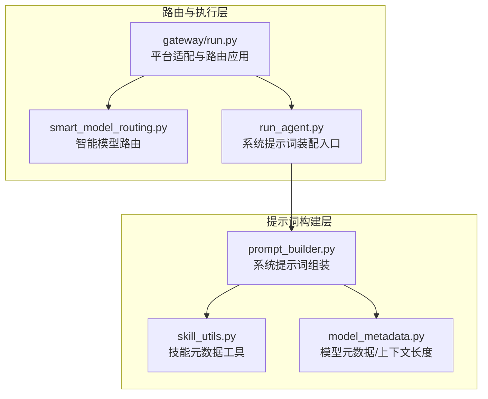
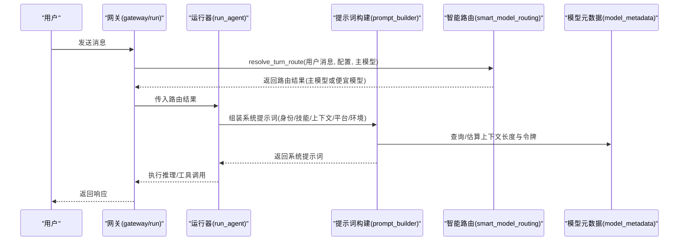
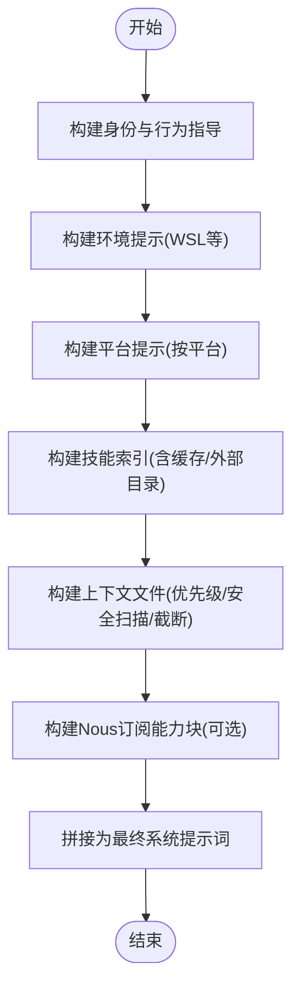
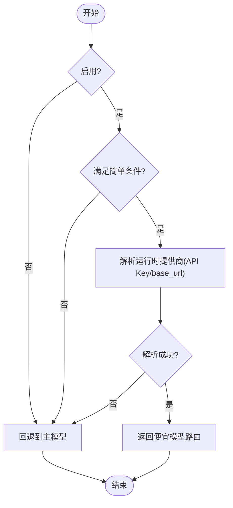
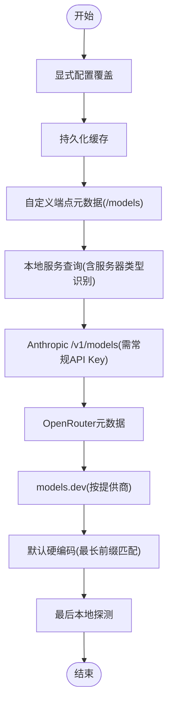
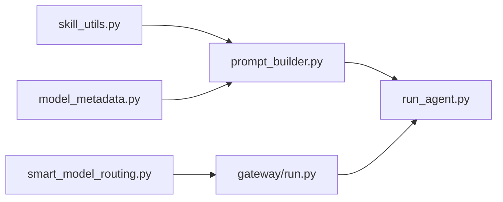

# 提示词构建系统

<cite>
**本文引用的文件**
- [prompt_builder.py](file://agent/prompt_builder.py)
- [smart_model_routing.py](file://agent/smart_model_routing.py)
- [model_metadata.py](file://agent/model_metadata.py)
- [skill_utils.py](file://agent/skill_utils.py)
- [run_agent.py](file://run_agent.py)
- [gateway/run.py](file://gateway/run.py)
- [test_prompt_builder.py](file://tests/agent/test_prompt_builder.py)
- [test_smart_model_routing.py](file://tests/agent/test_smart_model_routing.py)
- [test_model_metadata.py](file://tests/agent/test_model_metadata.py)
</cite>

## 目录
1. [简介](#简介)
2. [项目结构](#项目结构)
3. [核心组件](#核心组件)
4. [架构总览](#架构总览)
5. [详细组件分析](#详细组件分析)
6. [依赖分析](#依赖分析)
7. [性能考虑](#性能考虑)
8. [故障排查指南](#故障排查指南)
9. [结论](#结论)
10. [附录](#附录)

## 简介
本技术文档围绕提示词构建系统展开，重点解析以下模块与能力：
- prompt_builder：系统提示词组装器，负责身份、平台提示、技能索引、上下文文件注入、环境提示等；具备内容安全扫描、截断与缓存机制。
- smart_model_routing：智能模型路由，基于用户输入复杂度与关键词启发式选择“便宜模型”作为备选，支持运行时提供商解析与回退。
- model_metadata：模型元数据与上下文长度管理，提供多源探测、缓存、错误解析与令牌估算，支撑长上下文压缩与预检。
- skill_utils：技能元数据工具，提供平台匹配、条件提取、外部目录扫描等，为提示词中的技能索引提供基础。

文档同时给出可操作的自定义与适配建议，覆盖不同平台与模型的提示词优化策略与效果评估方法。

## 项目结构
提示词构建系统主要由以下文件构成：
- agent/prompt_builder.py：系统提示词组装与上下文注入
- agent/smart_model_routing.py：智能路由与运行时解析
- agent/model_metadata.py：模型元数据与上下文长度探测
- agent/skill_utils.py：技能元数据工具
- run_agent.py：调用提示词构建器生成系统提示词
- gateway/run.py：在网关层应用智能路由决策

**图表来源**
- [prompt_builder.py:1-1026](file://agent/prompt_builder.py#L1-L1026)
- [smart_model_routing.py:1-196](file://agent/smart_model_routing.py#L1-L196)
- [model_metadata.py:1-1086](file://agent/model_metadata.py#L1-L1086)
- [skill_utils.py:1-444](file://agent/skill_utils.py#L1-L444)
- [run_agent.py:2357-3235](file://run_agent.py#L2357-L3235)
- [gateway/run.py:931-963](file://gateway/run.py#L931-L963)

**章节来源**
- [prompt_builder.py:1-1026](file://agent/prompt_builder.py#L1-L1026)
- [smart_model_routing.py:1-196](file://agent/smart_model_routing.py#L1-L196)
- [model_metadata.py:1-1086](file://agent/model_metadata.py#L1-L1086)
- [skill_utils.py:1-444](file://agent/skill_utils.py#L1-L444)
- [run_agent.py:2357-3235](file://run_agent.py#L2357-L3235)
- [gateway/run.py:931-963](file://gateway/run.py#L931-L963)

## 核心组件
- 系统提示词构建器（prompt_builder）
  - 身份与行为指导：默认身份、内存与会话检索、技能使用强制、模型特定执行指导等
  - 平台提示：针对不同消息平台（如WhatsApp、Telegram、Discord、Slack、Signal、Email、CLI、SMS、Weixin、Cron）的格式与媒体提示
  - 环境提示：WSL等特殊执行环境的路径与行为提示
  - 技能索引：从本地与外部技能目录读取、过滤、去重、缓存，并生成紧凑的可用技能清单
  - 上下文文件注入：优先加载项目级上下文文件（.hermes.md/HERMES.md、AGENTS.md、CLAUDE.md），以及全局SOUL.md
  - 安全扫描与截断：对上下文文件进行威胁模式检测与不可见字符过滤，超过阈值进行头尾截断并保留标记
  - Nous订阅能力块：根据订阅状态动态注入可用工具与替代建议
- 智能模型路由（smart_model_routing）
  - 基于启发式规则判断是否走“便宜模型”：字符数、单词数、换行数、代码片段标记、URL、复杂关键词集合等
  - 将简单对话切换到低成本提供商/模型，复杂任务回退到主模型
  - 解析运行时提供商（含API Key、base_url等），失败时回退到主模型
- 模型元数据与上下文长度（model_metadata）
  - 多源探测顺序：显式配置覆盖 → 持久化缓存 → 自定义端点元数据 → 本地服务查询 → Anthropic /v1/models → OpenRouter → models.dev → 默认硬编码 → 最后本地探测
  - 错误解析：从错误信息中提取上下文限制或输出上限
  - 令牌估算：粗略估算用于预检与压缩触发
- 技能元数据工具（skill_utils）
  - 平台匹配、禁用列表、外部目录扫描、条件提取、描述截断、文件遍历等

**章节来源**
- [prompt_builder.py:134-788](file://agent/prompt_builder.py#L134-L788)
- [prompt_builder.py:857-1026](file://agent/prompt_builder.py#L857-L1026)
- [smart_model_routing.py:62-196](file://agent/smart_model_routing.py#L62-L196)
- [model_metadata.py:917-1044](file://agent/model_metadata.py#L917-L1044)
- [skill_utils.py:92-225](file://agent/skill_utils.py#L92-L225)

## 架构总览
提示词构建系统在运行期通过以下流程工作：
- 运行时入口（run_agent）收集各层提示词片段（身份、工具提示、内存快照、技能索引、上下文文件、平台/环境提示等），拼接为最终系统提示词
- 网关层（gateway/run）在每次对话回合决定是否启用智能路由：对简单输入切换到低成本模型，复杂输入保持主模型
- 模型元数据模块贯穿上下文探测、错误解析与令牌估算，保障长上下文处理的稳定性

**图表来源**
- [gateway/run.py:931-963](file://gateway/run.py#L931-L963)
- [smart_model_routing.py:110-196](file://agent/smart_model_routing.py#L110-L196)
- [prompt_builder.py:134-788](file://agent/prompt_builder.py#L134-L788)
- [model_metadata.py:917-1044](file://agent/model_metadata.py#L917-L1044)

## 详细组件分析

### 系统提示词构建器（prompt_builder）
- 身份与行为指导
  - 默认身份、内存与会话检索、技能使用强制、模型特定执行指导（如OpenAI/Gemini等）
- 平台提示
  - 针对不同平台的文本渲染、媒体发送、URL嵌入等提示
- 环境提示
  - WSL路径映射与行为建议
- 技能索引
  - 两层缓存：进程内LRU + 磁盘快照；支持外部只读技能目录叠加；按平台/条件过滤；去重与排序
- 上下文文件注入
  - 优先级：.hermes.md/HERMES.md > AGENTS.md/agents.md > CLAUDE.md/claude.md > .cursorrules + .cursor/rules/*.mdc
  - 全局SOUL.md独立注入（避免重复）
  - 内容安全扫描与截断
- Nous订阅能力块
  - 动态注入当前订阅状态与可用工具，避免重复索要API密钥

**图表来源**
- [prompt_builder.py:134-788](file://agent/prompt_builder.py#L134-L788)
- [prompt_builder.py:857-1026](file://agent/prompt_builder.py#L857-L1026)

**章节来源**
- [prompt_builder.py:134-788](file://agent/prompt_builder.py#L134-L788)
- [prompt_builder.py:857-1026](file://agent/prompt_builder.py#L857-L1026)

### 智能模型路由（smart_model_routing）
- 规则判定
  - 启用开关、便宜模型配置、字符/单词/换行/代码标记/URL/复杂关键词集合等
- 路由解析
  - 成功：返回便宜模型与运行时提供商信息，带标签与签名
  - 失败：回退到主模型（保持一致性）

**图表来源**
- [smart_model_routing.py:62-196](file://agent/smart_model_routing.py#L62-L196)

**章节来源**
- [smart_model_routing.py:62-196](file://agent/smart_model_routing.py#L62-L196)
- [gateway/run.py:931-963](file://gateway/run.py#L931-L963)

### 模型元数据与上下文长度（model_metadata）
- 探测顺序
  - 显式配置覆盖 → 持久化缓存 → 自定义端点元数据 → 本地服务查询 → Anthropic /v1/models → OpenRouter → models.dev → 默认硬编码 → 最后本地探测
- 错误解析
  - 从错误文本中提取上下文限制或输出上限
- 令牌估算
  - 粗略估算用于预检与压缩触发

**图表来源**
- [model_metadata.py:917-1044](file://agent/model_metadata.py#L917-L1044)

**章节来源**
- [model_metadata.py:917-1044](file://agent/model_metadata.py#L917-L1044)

### 技能元数据工具（skill_utils）
- 平台匹配：根据技能frontmatter中的platforms字段与当前系统平台进行匹配
- 条件提取：从metadata.hermes中提取工具/工具集的依赖与回退规则
- 外部目录扫描：读取配置中的外部技能目录，排除本地目录与重复项
- 描述截断：对技能描述进行长度控制，避免过长影响提示词体积

**章节来源**
- [skill_utils.py:92-225](file://agent/skill_utils.py#L92-L225)
- [skill_utils.py:418-444](file://agent/skill_utils.py#L418-L444)

## 依赖分析
- prompt_builder依赖skill_utils进行技能解析与平台匹配，依赖model_metadata进行上下文长度估算
- run_agent在构建系统提示词时调用prompt_builder
- gateway/run在每回合解析智能路由，再将路由结果传递给运行器
- 测试用例覆盖了提示词构建、路由决策与模型元数据的关键路径

**图表来源**
- [prompt_builder.py:18-27](file://agent/prompt_builder.py#L18-L27)
- [run_agent.py:2357-3235](file://run_agent.py#L2357-L3235)
- [gateway/run.py:931-963](file://gateway/run.py#L931-L963)
- [smart_model_routing.py:139-152](file://agent/smart_model_routing.py#L139-L152)

**章节来源**
- [prompt_builder.py:18-27](file://agent/prompt_builder.py#L18-L27)
- [run_agent.py:2357-3235](file://run_agent.py#L2357-L3235)
- [gateway/run.py:931-963](file://gateway/run.py#L931-L963)
- [smart_model_routing.py:139-152](file://agent/smart_model_routing.py#L139-L152)

## 性能考虑
- 提示词构建缓存
  - 技能索引采用进程内LRU与磁盘快照双层缓存，显著降低重复扫描成本
  - 环境提示与平台提示为纯字符串拼接，开销极低
- 上下文文件截断
  - 对超长上下文文件进行头尾截断并保留标记，避免系统提示词过大
- 模型元数据探测
  - 严格按优先级探测，命中缓存与已知端点可快速返回
  - 错误解析与探测层级减少不必要的网络请求
- 令牌估算
  - 粗略估算用于预检，避免昂贵的分词器调用

[本节为通用指导，无需具体文件分析]

## 故障排查指南
- 提示词被阻断
  - 现象：上下文文件被标记为BLOCKED
  - 排查：检查威胁模式与不可见字符，确认内容未包含禁止指令或隐藏HTML
  - 参考测试：[test_prompt_builder.py:58-110](file://tests/agent/test_prompt_builder.py#L58-L110)
- 技能索引为空
  - 现象：技能索引为空字符串
  - 排查：确认技能目录存在且有SKILL.md；检查禁用列表与平台匹配；清理缓存后重试
  - 参考测试：[test_prompt_builder.py:252-256](file://tests/agent/test_prompt_builder.py#L252-L256)
- 智能路由未生效
  - 现象：简单输入仍走主模型
  - 排查：确认路由配置启用、便宜模型配置完整；检查输入是否触发复杂关键词或代码片段
  - 参考测试：[test_smart_model_routing.py:13-39](file://tests/agent/test_smart_model_routing.py#L13-L39)
- 上下文长度探测异常
  - 现象：上下文长度不正确或反复探测
  - 排查：检查持久化缓存文件是否存在；确认端点元数据与本地服务可达；查看错误解析是否提取到合理数值
  - 参考测试：[test_model_metadata.py:164-191](file://tests/agent/test_model_metadata.py#L164-L191)

**章节来源**
- [test_prompt_builder.py:58-110](file://tests/agent/test_prompt_builder.py#L58-L110)
- [test_prompt_builder.py:252-256](file://tests/agent/test_prompt_builder.py#L252-L256)
- [test_smart_model_routing.py:13-39](file://tests/agent/test_smart_model_routing.py#L13-L39)
- [test_model_metadata.py:164-191](file://tests/agent/test_model_metadata.py#L164-L191)

## 结论
提示词构建系统通过模块化的组件设计实现了高可扩展性与安全性：
- prompt_builder以“层叠注入”的方式将身份、技能、上下文、平台与环境提示整合为稳定一致的系统提示词
- smart_model_routing在保证质量的前提下，对简单任务进行低成本路由，提升整体性价比
- model_metadata提供稳健的上下文长度探测与错误解析，支撑长上下文场景下的鲁棒性
- skill_utils确保技能索引的准确性与可维护性

建议在实际部署中结合平台特性与业务需求，定制提示词模板与路由规则，并持续评估效果以优化体验。

[本节为总结，无需具体文件分析]

## 附录

### 自定义提示词模板与平台适配示例（步骤指引）
- 自定义系统提示词片段
  - 在系统提示词组装过程中，可在“工具使用强制”“执行纪律”等段落插入或调整指导语，确保与平台渲染能力匹配
  - 参考路径：[prompt_builder.py:173-254](file://agent/prompt_builder.py#L173-L254)
- 平台适配
  - 在PLATFORM_HINTS中新增平台键值对，定义该平台的消息格式、媒体发送与URL渲染策略
  - 参考路径：[prompt_builder.py:285-367](file://agent/prompt_builder.py#L285-L367)
- 模型路由规则
  - 在路由配置中设置启用、便宜模型、最大字符/单词/换行等阈值，以及复杂关键词集合
  - 参考路径：[smart_model_routing.py:62-107](file://agent/smart_model_routing.py#L62-L107)
- 模型元数据覆盖
  - 在配置中为特定模型设置context_length，或通过持久化缓存强制覆盖探测结果
  - 参考路径：[model_metadata.py:938-940](file://agent/model_metadata.py#L938-L940)

### 提示词优化策略与效果评估
- 优化策略
  - 减少冗余信息：利用截断与缓存，避免重复注入
  - 分层注入：将平台/环境/技能/上下文等分层，便于按需裁剪
  - 关键词引导：在模型特定执行指导中强调必要步骤，减少幻觉与遗漏
- 效果评估
  - 通过任务完成率、平均响应时间、工具调用成功率与上下文长度变化进行对比实验
  - 使用测试用例验证安全扫描与路由回退逻辑的正确性

**章节来源**
- [prompt_builder.py:173-254](file://agent/prompt_builder.py#L173-L254)
- [prompt_builder.py:285-367](file://agent/prompt_builder.py#L285-L367)
- [smart_model_routing.py:62-107](file://agent/smart_model_routing.py#L62-L107)
- [model_metadata.py:938-940](file://agent/model_metadata.py#L938-L940)