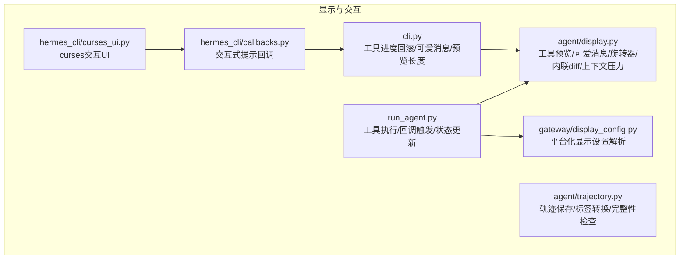
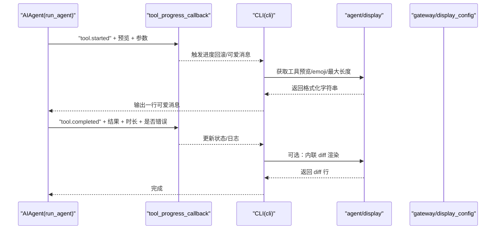
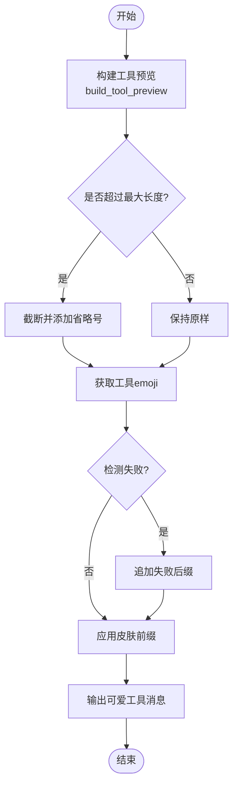
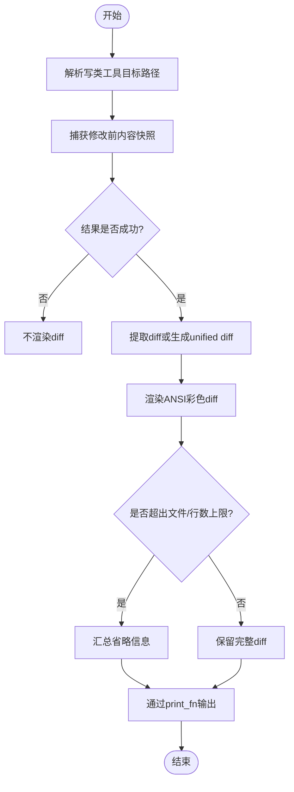
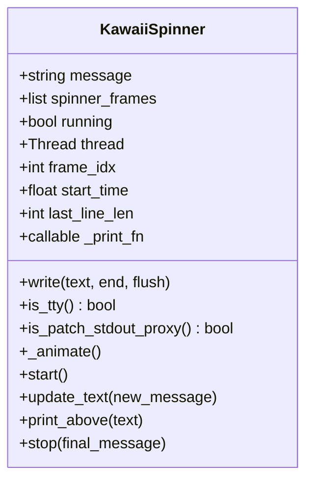
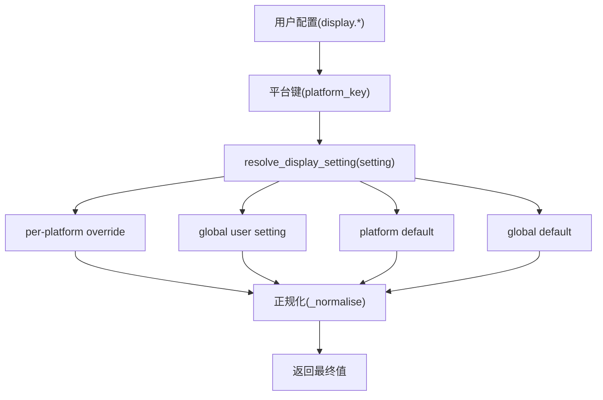
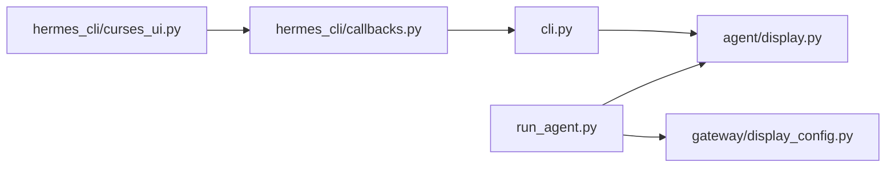

# 显示与交互系统

<cite>
**本文引用的文件列表**
- [agent/display.py](file://agent/display.py)
- [agent/trajectory.py](file://agent/trajectory.py)
- [gateway/display_config.py](file://gateway/display_config.py)
- [run_agent.py](file://run_agent.py)
- [cli.py](file://cli.py)
- [hermes_cli/callbacks.py](file://hermes_cli/callbacks.py)
- [hermes_cli/curses_ui.py](file://hermes_cli/curses_ui.py)
- [tests/gateway/test_display_config.py](file://tests/gateway/test_display_config.py)
- [tests/agent/test_subagent_progress.py](file://tests/agent/test_subagent_progress.py)
- [tests/cli/test_tool_progress_scrollback.py](file://tests/cli/test_tool_progress_scrollback.py)
</cite>

## 目录
1. [简介](#简介)
2. [项目结构](#项目结构)
3. [核心组件](#核心组件)
4. [架构总览](#架构总览)
5. [详细组件分析](#详细组件分析)
6. [依赖关系分析](#依赖关系分析)
7. [性能考量](#性能考量)
8. [故障排查指南](#故障排查指南)
9. [结论](#结论)
10. [附录：配置与使用示例](#附录配置与使用示例)

## 简介
本文件面向“显示与交互系统”的技术文档，聚焦于以下目标：
- 深入解析 display 模块的设计与实现，包括工具预览生成、可爱工具消息、工具失败检测等核心能力
- 解释 trajectory 模块的轨迹保存与转换机制
- 总结进度显示、状态更新与用户体验优化的关键技术点
- 提供可操作的配置与集成示例，覆盖不同平台的显示适配与用户反馈机制
- 给出界面优化与用户体验改进建议

## 项目结构
围绕显示与交互的核心模块分布如下：
- agent/display.py：纯显示层工具，提供工具预览、内联 diff、可爱表情旋转器（KawaiiSpinner）、可爱工具消息、上下文压力提示等
- agent/trajectory.py：轨迹保存与静态辅助函数（转换标签、检查未闭合标签、写入 JSONL）
- gateway/display_config.py：按平台解析显示设置（工具进度、是否显示推理、预览长度、流式输出等），支持全局默认与平台默认
- run_agent.py：在工具调用前后触发回调，驱动 display 模块输出与状态更新
- cli.py：命令行侧的工具进度回滚、可爱工具消息渲染、工具预览长度控制
- hermes_cli/callbacks.py：交互式提示回调（澄清、秘密输入、审批），与 TUI 协同
- hermes_cli/curses_ui.py：基于 curses 的交互 UI（多选/单选/数字回退），用于工具选择与确认
- 测试文件：验证 display_config 的解析逻辑、KawaiiSpinner 的行为、工具进度模式等

图表来源
- [agent/display.py:1-1044](file://agent/display.py#L1-L1044)
- [agent/trajectory.py:1-57](file://agent/trajectory.py#L1-L57)
- [gateway/display_config.py:1-207](file://gateway/display_config.py#L1-L207)
- [run_agent.py:6863-7327](file://run_agent.py#L6863-L7327)
- [cli.py:6651-6679](file://cli.py#L6651-L6679)
- [hermes_cli/callbacks.py:1-243](file://hermes_cli/callbacks.py#L1-L243)
- [hermes_cli/curses_ui.py:1-446](file://hermes_cli/curses_ui.py#L1-L446)

章节来源
- [agent/display.py:1-1044](file://agent/display.py#L1-L1044)
- [agent/trajectory.py:1-57](file://agent/trajectory.py#L1-L57)
- [gateway/display_config.py:1-207](file://gateway/display_config.py#L1-L207)
- [run_agent.py:6863-7327](file://run_agent.py#L6863-L7327)
- [cli.py:6651-6679](file://cli.py#L6651-L6679)
- [hermes_cli/callbacks.py:1-243](file://hermes_cli/callbacks.py#L1-L243)
- [hermes_cli/curses_ui.py:1-446](file://hermes_cli/curses_ui.py#L1-L446)

## 核心组件
- 工具预览与可爱消息
  - 工具预览：根据工具名与参数提取主参，限制长度，统一格式化
  - 可爱工具消息：在静默模式下输出带表情、动词、时长的简洁一行消息，并自动检测失败后追加后缀
- 内联 diff 预览
  - 对写类工具捕获本地快照，计算 unified diff，按文件与行数节流渲染，支持 ANSI 彩色高亮
- KawaiiSpinner 动画
  - 多种动画帧与可爱表情，兼容 prompt_toolkit 的 StdoutProxy，避免重复绘制；支持 print_fn 注入以静音或重定向输出
- 上下文压力提示
  - 在 CLI 中以条形图与百分比提示上下文压缩阈值逼近情况，支持网关端纯文本版本
- 轨迹保存
  - 将对话轨迹以 ShareGPT 格式写入 JSONL 文件，记录模型名、完成状态与时间戳
- 平台化显示设置
  - 支持 per-platform 覆盖、全局默认、内置平台默认与 YAML 正规化，提供有效设置查询与平台默认查询

章节来源
- [agent/display.py:176-281](file://agent/display.py#L176-L281)
- [agent/display.py:802-957](file://agent/display.py#L802-L957)
- [agent/display.py:360-437](file://agent/display.py#L360-L437)
- [agent/display.py:548-571](file://agent/display.py#L548-L571)
- [agent/display.py:577-763](file://agent/display.py#L577-L763)
- [agent/display.py:984-1044](file://agent/display.py#L984-L1044)
- [agent/trajectory.py:16-57](file://agent/trajectory.py#L16-L57)
- [gateway/display_config.py:29-101](file://gateway/display_config.py#L29-L101)
- [gateway/display_config.py:104-183](file://gateway/display_config.py#L104-L183)

## 架构总览
显示与交互系统通过“工具执行 → 回调触发 → 显示层渲染”的链路工作：
- run_agent 在工具开始/结束时触发 tool_progress_callback/tool_complete_callback
- cli 根据 tool_progress_mode 与 display_config 决定是否输出可爱工具消息与预览
- agent/display 提供工具预览、可爱消息、内联 diff、旋转器与上下文压力提示
- gateway/display_config 提供 per-platform 的显示策略解析
- hermes_cli/callbacks/curses_ui 提供交互式提示与 UI

图表来源
- [run_agent.py:6875-6887](file://run_agent.py#L6875-L6887)
- [run_agent.py:7281-7288](file://run_agent.py#L7281-L7288)
- [cli.py:6651-6679](file://cli.py#L6651-L6679)
- [agent/display.py:176-281](file://agent/display.py#L176-L281)
- [agent/display.py:802-957](file://agent/display.py#L802-L957)
- [agent/display.py:548-571](file://agent/display.py#L548-L571)
- [gateway/display_config.py:104-183](file://gateway/display_config.py#L104-L183)

## 详细组件分析

### 组件一：工具预览与可爱工具消息
- 工具预览生成
  - 针对常见工具（如 terminal、web_search、read_file/write_file/patch、browser_*、memory、send_message、技能管理等）提取主参，统一转为单行摘要，并按全局最大长度截断
  - 对部分工具（如 process、todo、memory、send_message、rl_*）提供定制化摘要
- 可爱工具消息
  - 静默模式下输出一行，包含表情、动词、详情与耗时
  - 自动检测失败（终端退出码非零、内存容量满、通用错误关键字），追加相应后缀
  - 支持皮肤前缀替换与工具 emoji 获取
- 关键路径
  - 预览：build_tool_preview → set_tool_preview_max_len/get_tool_preview_max_len
  - 可爱消息：get_cute_tool_message → _detect_tool_failure → get_tool_emoji/get_skin_tool_prefix

图表来源
- [agent/display.py:176-281](file://agent/display.py#L176-L281)
- [agent/display.py:802-957](file://agent/display.py#L802-L957)
- [agent/display.py:769-800](file://agent/display.py#L769-L800)

章节来源
- [agent/display.py:109-118](file://agent/display.py#L109-L118)
- [agent/display.py:176-281](file://agent/display.py#L176-L281)
- [agent/display.py:802-957](file://agent/display.py#L802-L957)
- [agent/display.py:769-800](file://agent/display.py#L769-L800)

### 组件二：内联 diff 预览与编辑差异提取
- 快照捕获
  - 针对写类工具（write_file/patch/skill_manage）解析目标路径，读取修改前内容
- 差异提取
  - 若工具返回结构化 diff 字段则优先使用；否则从快照与当前文件对比生成 unified diff
- 渲染与节流
  - ANSI 彩色渲染（文件头、hunk、增删行），按文件数量与总行数上限进行节流
  - 可选通过 print_fn 输出，避免与 TUI 冲突
- 关键路径
  - 快照：capture_local_edit_snapshot/_resolve_local_edit_paths
  - 差异：extract_edit_diff/_diff_from_snapshot
  - 渲染：_render_inline_unified_diff/_summarize_rendered_diff_sections
  - 输出：render_edit_diff_with_delta/_emit_inline_diff

图表来源
- [agent/display.py:360-370](file://agent/display.py#L360-L370)
- [agent/display.py:417-437](file://agent/display.py#L417-L437)
- [agent/display.py:548-571](file://agent/display.py#L548-L571)
- [agent/display.py:452-546](file://agent/display.py#L452-L546)

章节来源
- [agent/display.py:360-437](file://agent/display.py#L360-L437)
- [agent/display.py:548-571](file://agent/display.py#L548-L571)

### 组件三：KawaiiSpinner 动画与状态更新
- 动画特性
  - 多种帧序列与可爱表情，支持左右装饰翼；在非 TTY 或 StdoutProxy 环境下自动降级
  - 支持 print_fn 注入，便于静音或重定向输出
- 线程与同步
  - 后台线程驱动动画，stop 时清理行并输出最终消息
  - print_above 可在不打断动画的前提下打印上一行
- 关键路径
  - 初始化：KawaiiSpinner.__init__
  - 动画循环：KawaiiSpinner._animate
  - 停止与清理：KawaiiSpinner.stop/print_above

图表来源
- [agent/display.py:577-763](file://agent/display.py#L577-L763)

章节来源
- [agent/display.py:577-763](file://agent/display.py#L577-L763)

### 组件四：上下文压力提示
- CLI 版本
  - 使用 Unicode 方块字符绘制进度条，显示百分比与阈值，区分是否启用自动压缩
- 网关版本
  - 生成纯文本提示，适合 Telegram/Discord 等平台
- 关键路径
  - format_context_pressure/format_context_pressure_gateway

章节来源
- [agent/display.py:984-1044](file://agent/display.py#L984-L1044)

### 组件五：轨迹保存与转换
- 轨迹保存
  - 将 ShareGPT 格式的 conversations 列表写入 JSONL，记录模型名、完成状态与时间戳
- 标签转换与完整性检查
  - 将特定标记转换为 Markdown 标签
  - 检测未闭合的标记
- 关键路径
  - save_trajectory
  - convert_scratchpad_to_think/has_incomplete_scratchpad

章节来源
- [agent/trajectory.py:16-57](file://agent/trajectory.py#L16-L57)

### 组件六：平台化显示设置解析
- 设置项
  - tool_progress（all/new/off/verbose）、show_reasoning、tool_preview_length、streaming
- 解析顺序
  - per-platform override → global user setting → platform default → global default
- 默认分层
  - 高/中/低/最小四档平台能力，分别对应不同的默认策略
- 关键路径
  - resolve_display_setting/get_effective_display/get_platform_defaults

图表来源
- [gateway/display_config.py:104-183](file://gateway/display_config.py#L104-L183)
- [gateway/display_config.py:189-206](file://gateway/display_config.py#L189-L206)

章节来源
- [gateway/display_config.py:29-101](file://gateway/display_config.py#L29-L101)
- [gateway/display_config.py:104-183](file://gateway/display_config.py#L104-L183)
- [gateway/display_config.py:189-206](file://gateway/display_config.py#L189-L206)

### 组件七：工具进度回滚与 CLI 交互
- 进度模式
  - off/new/all/verbose：控制是否输出、是否去重连续相同工具、是否每一步都输出
- 回滚与去重
  - 在 new 模式下跳过连续相同的工具重复输出
- 可爱消息与预览长度
  - 根据全局预览长度限制截断
- 关键路径
  - cli._on_tool_progress → get_cute_tool_message/get_tool_emoji/get_tool_preview_max_len

章节来源
- [cli.py:6651-6679](file://cli.py#L6651-L6679)
- [tests/cli/test_tool_progress_scrollback.py:67-91](file://tests/cli/test_tool_progress_scrollback.py#L67-L91)

### 组件八：交互式提示回调与 UI
- 提示回调
  - clarify_callback：澄清问题，支持超时与自由回答
  - prompt_for_secret：安全存储密钥，支持超时与取消
  - approval_callback：危险命令审批，支持一次性/会话/总是/拒绝
- curses UI
  - 多选/单选/数字回退，支持状态栏回调与键盘导航
- 关键路径
  - callbacks.* → TUI 状态机与队列

章节来源
- [hermes_cli/callbacks.py:18-243](file://hermes_cli/callbacks.py#L18-L243)
- [hermes_cli/curses_ui.py:35-446](file://hermes_cli/curses_ui.py#L35-L446)

## 依赖关系分析
- 模块耦合
  - run_agent 依赖 agent/display 与 gateway/display_config，通过回调与配置驱动显示
  - cli 依赖 agent/display 的可爱消息与预览长度，受 display_config 影响
  - hermes_cli/callbacks 与 hermes_cli/curses_ui 与 CLI/TUI 协作
- 外部依赖
  - prompt_toolkit（StdoutProxy 检测与 TUI 事件循环）
  - hermes_cli.skin_engine（皮肤颜色与工具前缀）
  - tools.registry（工具 emoji 来源）

图表来源
- [run_agent.py:6875-6887](file://run_agent.py#L6875-L6887)
- [run_agent.py:7281-7288](file://run_agent.py#L7281-L7288)
- [cli.py:6651-6679](file://cli.py#L6651-L6679)
- [agent/display.py:1-1044](file://agent/display.py#L1-L1044)
- [gateway/display_config.py:1-207](file://gateway/display_config.py#L1-L207)
- [hermes_cli/callbacks.py:1-243](file://hermes_cli/callbacks.py#L1-L243)
- [hermes_cli/curses_ui.py:1-446](file://hermes_cli/curses_ui.py#L1-L446)

章节来源
- [run_agent.py:6863-7327](file://run_agent.py#L6863-L7327)
- [cli.py:6651-6679](file://cli.py#L6651-L6679)
- [agent/display.py:1-1044](file://agent/display.py#L1-L1044)
- [gateway/display_config.py:1-207](file://gateway/display_config.py#L1-L207)
- [hermes_cli/callbacks.py:1-243](file://hermes_cli/callbacks.py#L1-L243)
- [hermes_cli/curses_ui.py:1-446](file://hermes_cli/curses_ui.py#L1-L446)

## 性能考量
- 工具预览与可爱消息
  - 截断与字符串拼接开销可控；建议通过全局最大长度限制避免过长输出
- 内联 diff
  - unified_diff 计算与 ANSI 渲染成本与文件大小、行数相关；通过文件数与行数上限节流可显著降低 UI 压力
- KawaiiSpinner
  - 后台线程与 ANSI 清屏在 TTY 与 StdoutProxy 下有不同处理，避免重复绘制与闪烁
- 平台解析
  - resolve_display_setting 采用短路径优先策略，复杂度低；建议在启动阶段缓存有效设置

[本节为通用指导，无需具体文件引用]

## 故障排查指南
- 工具失败检测
  - 检查 _detect_tool_failure 的判定条件（终端退出码、内存容量满、通用错误关键字）
  - 若出现误报，可在工具结果中避免使用通用错误关键字或确保返回结构化字段
- 内联 diff 不显示
  - 确认工具为写类工具且结果成功；检查快照捕获路径是否存在；查看渲染节流是否导致省略
- 旋转器动画异常
  - 在 StdoutProxy 环境下会降级为静默输出；若需要静音，通过 print_fn 注入空实现
- 平台显示设置不生效
  - 检查 display.platforms 与 display.* 的优先级；确认 YAML 正规化（如 off/True/False）是否正确
- CLI 进度模式不符合预期
  - 核对 tool_progress 模式与去重逻辑；参考测试用例验证行为

章节来源
- [agent/display.py:769-800](file://agent/display.py#L769-L800)
- [agent/display.py:360-437](file://agent/display.py#L360-L437)
- [agent/display.py:548-571](file://agent/display.py#L548-L571)
- [agent/display.py:577-763](file://agent/display.py#L577-L763)
- [gateway/display_config.py:104-183](file://gateway/display_config.py#L104-L183)
- [tests/gateway/test_display_config.py:36-80](file://tests/gateway/test_display_config.py#L36-L80)
- [tests/cli/test_tool_progress_scrollback.py:67-91](file://tests/cli/test_tool_progress_scrollback.py#L67-L91)

## 结论
该显示与交互系统通过清晰的职责划分与平台化配置，实现了跨平台一致的用户体验：
- 工具预览与可爱消息提升可读性与亲和力
- 内联 diff 与上下文压力提示增强可观测性与安全性
- KawaiiSpinner 与交互式回调提供流畅的反馈与控制
- gateway/display_config 提供灵活的 per-platform 适配
建议在实际部署中结合平台能力调整显示策略，并在 CLI 与网关两端统一配置，以获得最佳的用户感知与交互效率。

[本节为总结，无需具体文件引用]

## 附录：配置与使用示例

### 如何配置显示回调函数与自定义交互体验
- 在运行时注入回调
  - 工具开始回调：tool_start_callback
  - 工具进度回调：tool_progress_callback
  - 工具完成回调：tool_complete_callback
  - 参考路径：[run_agent.py:6875-6887](file://run_agent.py#L6875-L6887)、[run_agent.py:7281-7288](file://run_agent.py#L7281-L7288)
- 在 CLI 中控制工具进度模式
  - tool_progress: off/new/all/verbose
  - 参考路径：[cli.py:6651-6679](file://cli.py#L6651-L6679)
- 通过皮肤与 emoji 自定义外观
  - 工具前缀与 emoji 来源于皮肤与注册表
  - 参考路径：[agent/display.py:133-164](file://agent/display.py#L133-L164)

章节来源
- [run_agent.py:6875-6887](file://run_agent.py#L6875-L6887)
- [run_agent.py:7281-7288](file://run_agent.py#L7281-L7288)
- [cli.py:6651-6679](file://cli.py#L6651-L6679)
- [agent/display.py:133-164](file://agent/display.py#L133-L164)

### 不同平台的显示适配与用户反馈机制
- per-platform 覆盖
  - 在 display.platforms.<platform> 中设置 tool_progress/show_reasoning/tool_preview_length/streaming
  - 参考路径：[gateway/display_config.py:104-183](file://gateway/display_config.py#L104-L183)
- 平台默认分层
  - 高/中/低/最小四档能力，分别对应不同的默认策略
  - 参考路径：[gateway/display_config.py:44-98](file://gateway/display_config.py#L44-L98)
- 用户反馈
  - 可爱工具消息、内联 diff、上下文压力提示、交互式提示回调
  - 参考路径：[agent/display.py:802-957](file://agent/display.py#L802-L957)、[agent/display.py:548-571](file://agent/display.py#L548-L571)、[agent/display.py:984-1044](file://agent/display.py#L984-L1044)、[hermes_cli/callbacks.py:18-243](file://hermes_cli/callbacks.py#L18-L243)

章节来源
- [gateway/display_config.py:44-98](file://gateway/display_config.py#L44-L98)
- [gateway/display_config.py:104-183](file://gateway/display_config.py#L104-L183)
- [agent/display.py:802-957](file://agent/display.py#L802-L957)
- [agent/display.py:548-571](file://agent/display.py#L548-L571)
- [agent/display.py:984-1044](file://agent/display.py#L984-L1044)
- [hermes_cli/callbacks.py:18-243](file://hermes_cli/callbacks.py#L18-L243)

### 界面优化与用户体验改进建议
- 控制输出密度
  - 在高并发工具调用场景下使用 tool_progress=new/all/verbose，避免过度刷屏
- 合理设置预览长度
  - 通过 set_tool_preview_max_len 控制摘要长度，平衡信息量与可读性
- 选择合适平台默认
  - 根据平台编辑能力选择合适的 tool_progress 与 streaming 默认
- 使用内联 diff 与上下文压力提示
  - 在涉及文件变更的工具中启用 diff 预览，在长对话中关注上下文压力提示
- 交互式提示的超时与取消
  - 为澄清、密钥输入、审批设置合理超时，保证用户可中断与恢复

章节来源
- [agent/display.py:109-118](file://agent/display.py#L109-L118)
- [gateway/display_config.py:44-98](file://gateway/display_config.py#L44-L98)
- [agent/display.py:548-571](file://agent/display.py#L548-L571)
- [agent/display.py:984-1044](file://agent/display.py#L984-L1044)
- [hermes_cli/callbacks.py:18-243](file://hermes_cli/callbacks.py#L18-L243)