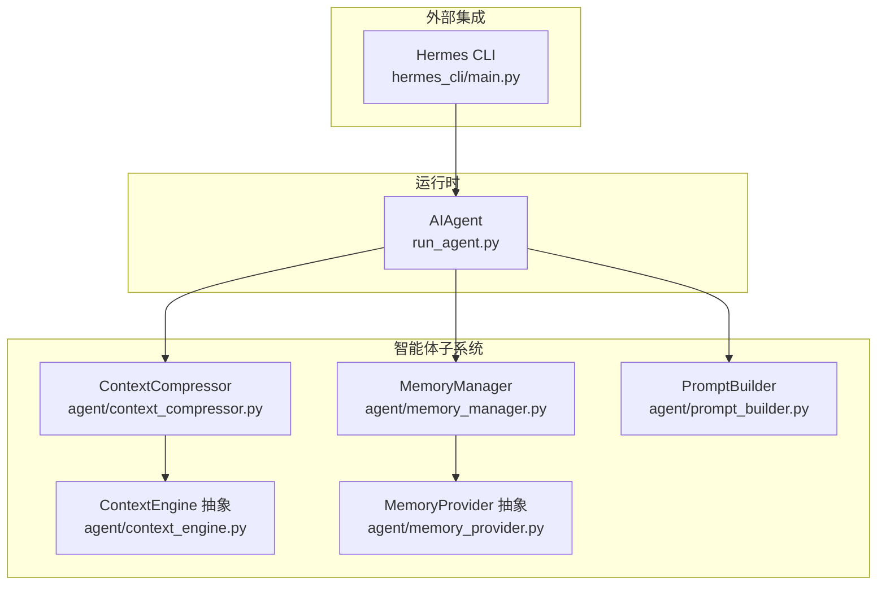
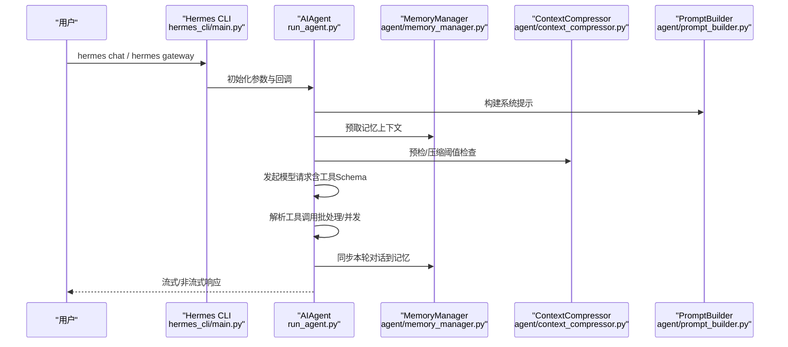
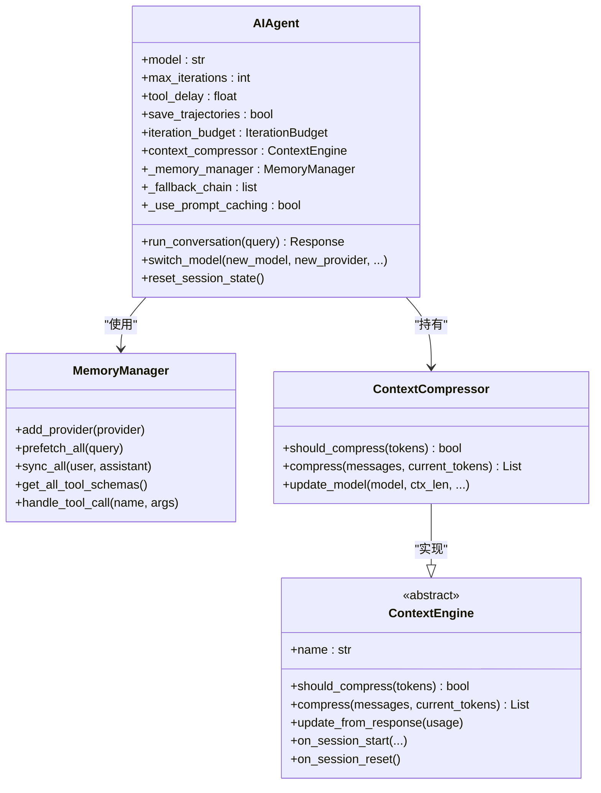
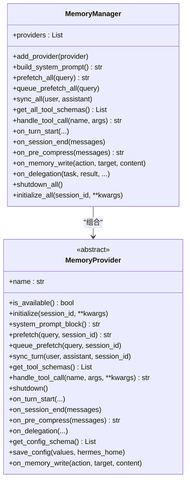
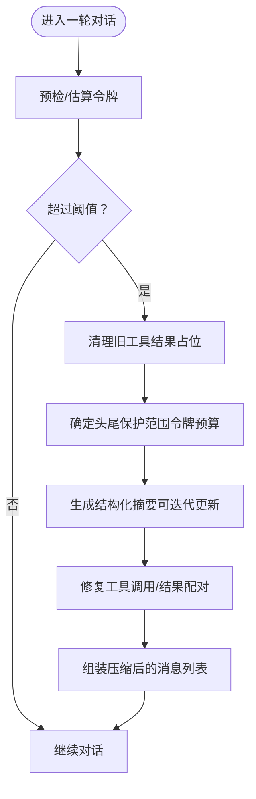
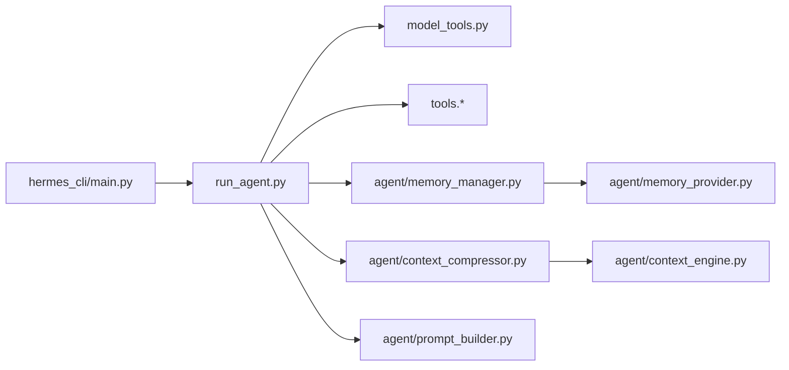

# 核心模块架构

<cite>
**本文引用的文件**
- [run_agent.py](file://run_agent.py)
- [agent/__init__.py](file://agent/__init__.py)
- [agent/memory_manager.py](file://agent/memory_manager.py)
- [agent/context_compressor.py](file://agent/context_compressor.py)
- [agent/context_engine.py](file://agent/context_engine.py)
- [agent/prompt_builder.py](file://agent/prompt_builder.py)
- [agent/memory_provider.py](file://agent/memory_provider.py)
- [hermes_cli/main.py](file://hermes_cli/main.py)
</cite>

## 目录
1. [引言](#引言)
2. [项目结构](#项目结构)
3. [核心组件](#核心组件)
4. [架构总览](#架构总览)
5. [详细组件分析](#详细组件分析)
6. [依赖分析](#依赖分析)
7. [性能考虑](#性能考虑)
8. [故障排查指南](#故障排查指南)
9. [结论](#结论)

## 引言
本技术文档聚焦于 Hermes Agent 的核心模块架构，系统性解析 run_agent.py 中 AIAgent 类的设计与实现原理，涵盖对话循环管理、工具调用机制、错误处理策略、上下文压缩、记忆系统与提示工程等关键能力，并阐明 agent 包下各子模块（memory_manager、context_compressor、prompt_builder 等）之间的协作关系。同时，文档给出 hermes_cli 命令行接口的设计模式与模块化组织，提供核心模块间的依赖关系图与数据流说明，并通过“章节来源”定位到具体代码路径以便进一步查阅。

## 项目结构
Hermes Agent 将原本集中在 run_agent.py 的庞大逻辑拆分为多个可维护的子模块，形成清晰的分层与职责边界：
- 运行时编排与对话循环：run_agent.py 中的 AIAgent 类负责模型客户端初始化、会话状态管理、工具调度、上下文压缩、错误分类与回退、轨迹记录等。
- 模块化子系统：agent/ 下的 memory_manager、context_compressor、prompt_builder、context_engine 等模块各自承担记忆、上下文压缩、系统提示构建、上下文引擎抽象等职责。
- 命令行入口：hermes_cli/main.py 提供统一 CLI 入口，解析参数、加载配置、路由到交互式聊天或网关服务等。

图表来源
- [run_agent.py](file://run_agent.py)
- [agent/memory_manager.py](file://agent/memory_manager.py)
- [agent/context_compressor.py](file://agent/context_compressor.py)
- [agent/context_engine.py](file://agent/context_engine.py)
- [agent/prompt_builder.py](file://agent/prompt_builder.py)
- [agent/memory_provider.py](file://agent/memory_provider.py)
- [hermes_cli/main.py](file://hermes_cli/main.py)

章节来源
- [agent/__init__.py](file://agent/__init__.py)
- [run_agent.py](file://run_agent.py)
- [hermes_cli/main.py](file://hermes_cli/main.py)

## 核心组件
本节对 AIAgent 类及其关键子系统进行深入剖析，重点覆盖以下方面：
- 对话循环与迭代预算：AIAgent 维护迭代预算（含父子代理独立预算），在达到上限时注入压力消息并允许一次最终 API 调用以促使模型收敛。
- 工具调用与并发控制：内置工具批处理安全判定与并发执行策略，避免交互型工具并发与路径冲突工具的竞态。
- 上下文压缩：基于 ContextCompressor 的自动压缩算法，保护头尾消息，对中间轮次生成结构化摘要，保证 API 消息完整性。
- 记忆系统：MemoryManager 统一编排内置与外部记忆提供者，支持预取、同步、工具 Schema 注入与生命周期钩子。
- 提示工程：prompt_builder 负责系统提示拼装、技能索引缓存、平台与环境提示注入、威胁检测与内容净化。
- 错误处理与回退：基于 error_classifier 的错误分类与失败回退链，结合速率限制跟踪与提示缓存开关，提升鲁棒性。

章节来源
- [run_agent.py](file://run_agent.py)
- [agent/context_compressor.py](file://agent/context_compressor.py)
- [agent/memory_manager.py](file://agent/memory_manager.py)
- [agent/prompt_builder.py](file://agent/prompt_builder.py)

## 架构总览
下图展示了从 CLI 到 AIAgent 的端到端流程，以及 AIAgent 内部与各子系统的交互：

图表来源
- [hermes_cli/main.py](file://hermes_cli/main.py)
- [run_agent.py](file://run_agent.py)
- [agent/memory_manager.py](file://agent/memory_manager.py)
- [agent/context_compressor.py](file://agent/context_compressor.py)
- [agent/prompt_builder.py](file://agent/prompt_builder.py)

## 详细组件分析

### AIAgent 类设计与实现
- 角色与职责
  - 负责模型客户端初始化（OpenAI/Anthropic/Copilot 等），根据 provider 自动推断 API 模式（chat_completions / codex_responses / anthropic_messages）。
  - 维护会话状态、令牌计数、速率限制、提示缓存开关、轨迹持久化、检查点管理等。
  - 协调工具加载、过滤与调用，支持细粒度工具流式（如 Claude on OpenRouter）。
  - 管理上下文压缩器（默认 ContextCompressor），在接近阈值时触发压缩并修复工具调用/结果配对。
  - 支持多级回退链（fallback_providers/fallback_model），在限流/过载/连接失败时自动切换。
  - 提供丰富的回调钩子（工具进度、思考、推理、澄清、状态等），用于 CLI/TUI 或网关集成。
- 关键内部结构
  - 迭代预算：IterationBudget 线程安全计数器，父/子代理独立预算，支持退款（execute_code 场景）。
  - 并发工具批处理：_should_parallelize_tool_batch 基于工具集合、参数解析、路径作用域与只读工具集判定是否并发。
  - 安全输出：_SafeWriter 包装标准输出，避免管道中断导致崩溃；surrogate 与 ASCII 清洗保障消息序列化安全。
  - 记忆与技能：注入 MemoryProvider 工具 Schema；构建技能索引提示，带 LRU 与磁盘快照缓存。
  - 上下文引擎：支持插件化上下文引擎（plugins/context_engine/*），默认使用 ContextCompressor。
- 错误处理与恢复
  - 分类错误：classify_api_error 识别超时、配额、429、模型不可用等，决定是否回退。
  - 回退链：_try_activate_fallback 在 turn 内临时切换，_primary_runtime 持久化主运行时以便后续回合恢复。
  - 速率限制：_rate_limit_state 由响应头更新，/usage 命令可见。
  - 提示缓存：针对 Claude/OpenRouter 的 Anthropic 缓存控制，降低输入成本。

图表来源
- [run_agent.py](file://run_agent.py)
- [agent/memory_manager.py](file://agent/memory_manager.py)
- [agent/context_compressor.py](file://agent/context_compressor.py)
- [agent/context_engine.py](file://agent/context_engine.py)

章节来源
- [run_agent.py](file://run_agent.py)

### MemoryManager 与 MemoryProvider
- 设计要点
  - MemoryManager 作为单一集成点，注册内置与最多一个外部记忆提供者，避免工具 Schema 膨胀与后端冲突。
  - 提供系统提示拼装、预取/排队预取、每轮同步、工具 Schema 注入、工具调用路由、生命周期钩子（turn_start/session_end/pre_compress/memory_write/delegation）。
  - MemoryProvider 抽象定义了可用性检查、初始化、系统提示块、预取、队列预取、同步、工具 Schema、工具调用处理、关闭与可选钩子。
- 与 AIAgent 的协作
  - AIAgent 在初始化阶段加载 MemoryManager，注入其工具 Schema 到工具集；在每轮结束后同步对话；在会话开始时初始化外部提供者（如 Honcho）。

图表来源
- [agent/memory_manager.py](file://agent/memory_manager.py)
- [agent/memory_provider.py](file://agent/memory_provider.py)

章节来源
- [agent/memory_manager.py](file://agent/memory_manager.py)
- [agent/memory_provider.py](file://agent/memory_provider.py)

### ContextCompressor 与 ContextEngine
- 设计要点
  - ContextEngine 抽象定义了上下文引擎的统一接口：名称、令牌状态、压缩参数、更新使用量、是否压缩、压缩主流程、可选工具 Schema、会话生命周期钩子、模型切换更新。
  - ContextCompressor 默认实现采用“旧工具结果清理 + 头尾保护 + 结构化摘要”的策略，支持迭代更新摘要、工具调用/结果配对修复、令牌预算尾部保护。
- 与 AIAgent 的协作
  - AIAgent 在初始化时选择内置或插件上下文引擎；在每次 API 调用后更新使用量；在 should_compress 返回真时调用 compress；在 /new 或 /reset 时重置状态。

图表来源
- [agent/context_engine.py](file://agent/context_engine.py)
- [agent/context_compressor.py](file://agent/context_compressor.py)

章节来源
- [agent/context_engine.py](file://agent/context_engine.py)
- [agent/context_compressor.py](file://agent/context_compressor.py)

### PromptBuilder（系统提示构建）
- 设计要点
  - 负责系统提示的拼装：默认身份、记忆指引、会话检索指引、技能指引、工具使用强制指引、模型特定执行指导、平台与环境提示、技能索引缓存（LRU + 磁盘快照）。
  - 提供威胁检测与内容净化（隐藏字符、注入模式），确保上下文文件安全注入。
- 与 AIAgent 的协作
  - AIAgent 在构建系统提示时调用 prompt_builder 的多项函数，拼接记忆、技能、平台/环境提示，并在必要时注入订阅能力块。

章节来源
- [agent/prompt_builder.py](file://agent/prompt_builder.py)
- [run_agent.py](file://run_agent.py)

### hermes_cli 命令行接口设计
- 设计模式
  - 主入口集中：hermes_cli/main.py 统一解析命令、加载配置、设置日志与网络偏好，再路由到具体子命令（chat、gateway、setup 等）。
  - 参数透传：CLI 将用户输入映射为 AIAgent 初始化参数（模型、provider、toolsets、技能、查询、工作树、检查点、会话传递等）。
  - 交互式守护：chat 子命令在首次运行前检查是否有可用 provider，若未配置则引导 setup。
- 模块化组织
  - CLI 仅负责参数解析与路由，实际对话逻辑在 run_agent.py 的 AIAgent 中完成，保持 CLI 与运行时的职责分离。
  - 网关、设置、诊断、内存、技能等子命令分别由对应模块实现，CLI 仅负责入口与生命周期。

章节来源
- [hermes_cli/main.py](file://hermes_cli/main.py)
- [run_agent.py](file://run_agent.py)

## 依赖分析
- 组件耦合与内聚
  - AIAgent 对外依赖：OpenAI/Anthropic 客户端、工具系统、上下文引擎、记忆管理器、提示构建器、错误分类器、速率限制追踪器、轨迹与定价统计。
  - 内部模块高内聚：memory_manager、context_compressor、prompt_builder 各自封装领域逻辑，通过明确接口与回调与 AIAgent 解耦。
- 直接与间接依赖
  - 直接依赖：AIAgent 直接导入 model_tools、tools.*、agent.* 子模块。
  - 间接依赖：MemoryManager 依赖 MemoryProvider 插件；ContextCompressor 依赖 ContextEngine 抽象；PromptBuilder 依赖技能索引与配置。
- 循环依赖规避
  - 通过模块拆分与延迟导入（如 _create_openai_client、resolve_provider_client）避免循环导入；接口层（ContextEngine/MemoryProvider）隔离具体实现。

图表来源
- [run_agent.py](file://run_agent.py)
- [agent/memory_manager.py](file://agent/memory_manager.py)
- [agent/context_compressor.py](file://agent/context_compressor.py)
- [agent/context_engine.py](file://agent/context_engine.py)
- [agent/prompt_builder.py](file://agent/prompt_builder.py)
- [hermes_cli/main.py](file://hermes_cli/main.py)

章节来源
- [run_agent.py](file://run_agent.py)
- [hermes_cli/main.py](file://hermes_cli/main.py)

## 性能考虑
- 工具并发与批处理
  - _should_parallelize_tool_batch 基于工具类型、参数解析、路径作用域与只读工具集判定，避免交互型工具并发与路径冲突，减少锁竞争与资源争用。
- 上下文压缩策略
  - 旧工具结果占位清理（低成本）、令牌预算尾部保护（动态而非固定条数）、结构化摘要模板（迭代更新）、工具调用/结果配对修复，平衡压缩效率与 API 完整性。
- 提示缓存与模型切换
  - Anthropic 提示缓存（OpenRouter/Claude）显著降低输入成本；模型切换时更新上下文引擎阈值与缓存标志，避免重复探测。
- 日志与 I/O 稳定性
  - _SafeWriter 降低 stdout/stderr 不可用导致的崩溃风险；ASCII 清洗与代理头注入提升跨平台兼容性。

## 故障排查指南
- 常见问题与定位
  - 工具调用阻塞或报错：检查工具批处理并发判定与参数解析；确认只读工具集与路径作用域规则；查看工具调用回调与错误日志。
  - 上下文溢出：确认 ContextCompressor 阈值与保护策略；检查压缩后工具调用/结果配对修复是否生效；核对摘要生成失败冷却时间。
  - 认证与回退：核对 provider 与 API Key 设置；查看失败回退链顺序与激活条件；检查速率限制状态与 /usage 输出。
  - CLI 无法启动：确认首次运行检查（_has_any_provider_configured）与 setup 引导；检查 .env 与配置文件优先级。
- 排查步骤建议
  - 启用详细日志（verbose_logging）与安静模式（quiet_mode）对比；使用 /status 与 /usage 查看状态与用量；核对会话轨迹（trajectories）与检查点。
  - 在 AIAgent 初始化阶段打印关键配置（模型、base_url、API Key 片段、提示缓存状态）以快速定位配置问题。

章节来源
- [run_agent.py](file://run_agent.py)
- [hermes_cli/main.py](file://hermes_cli/main.py)

## 结论
Hermes Agent 的核心模块架构以 AIAgent 为中心，围绕记忆、上下文压缩、提示工程与工具系统构建了高内聚、低耦合的子系统。通过插件化的上下文引擎与记忆提供者，系统在保证稳定性的同时具备良好的扩展性。CLI 与运行时的职责分离使交互体验与核心逻辑解耦。建议在生产环境中关注工具批处理并发策略、上下文压缩阈值与模型切换的平滑性，并通过回调与日志体系完善可观测性与可调试性。