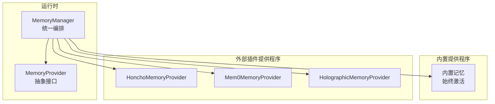
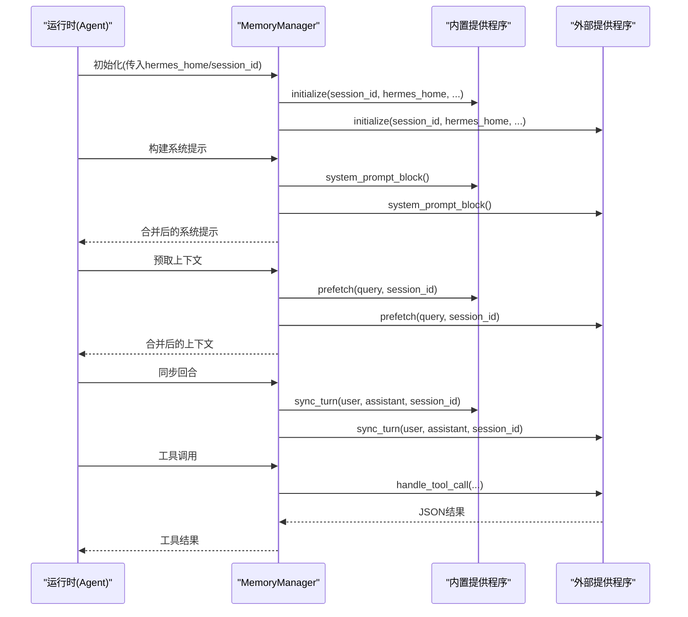
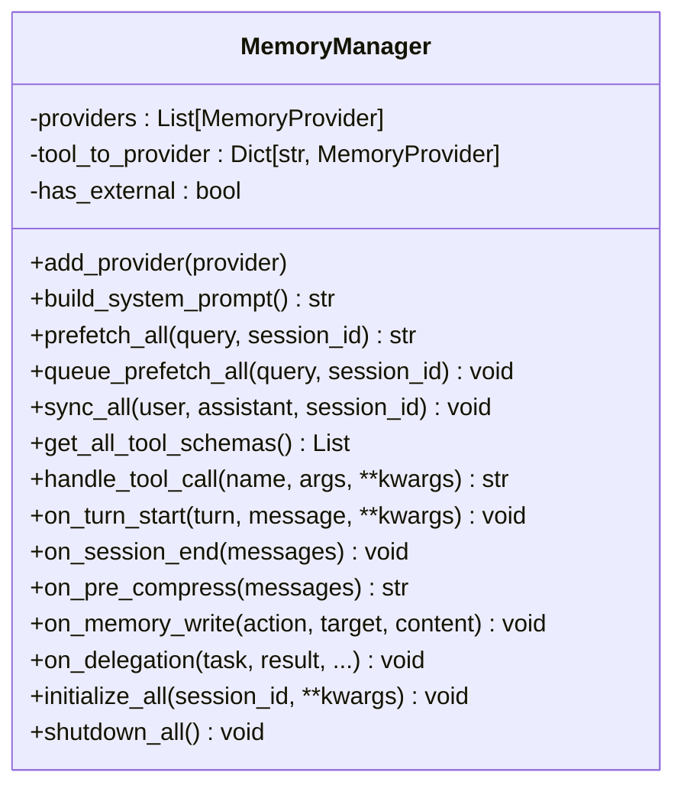
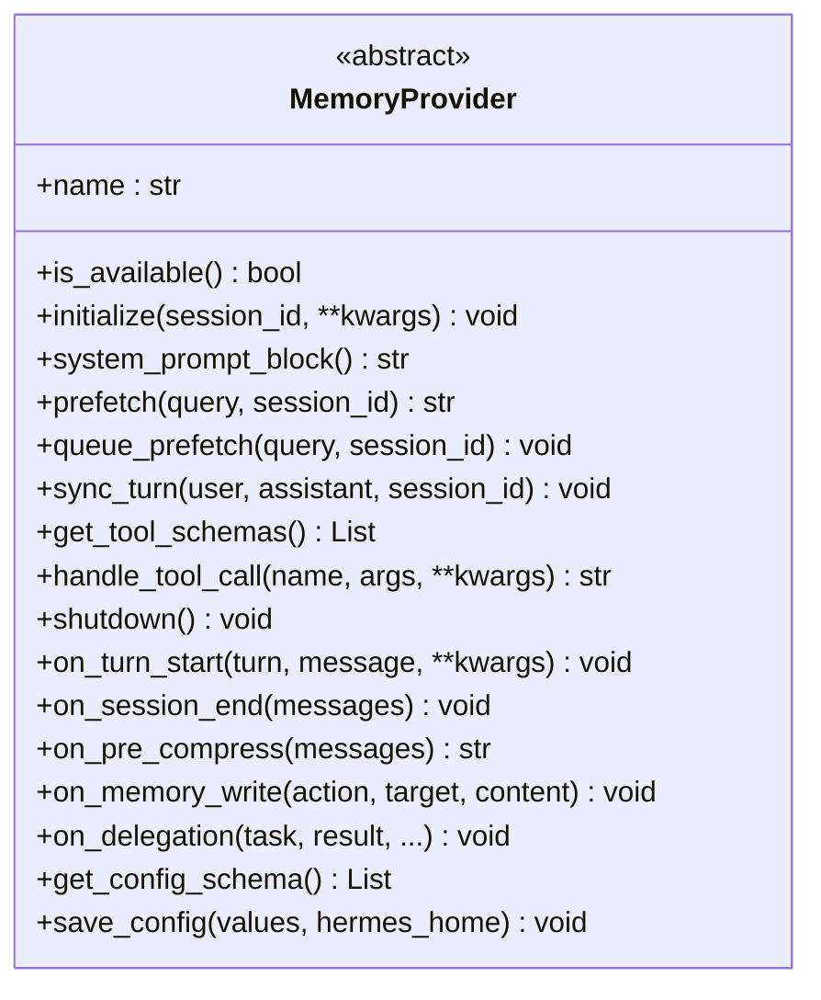
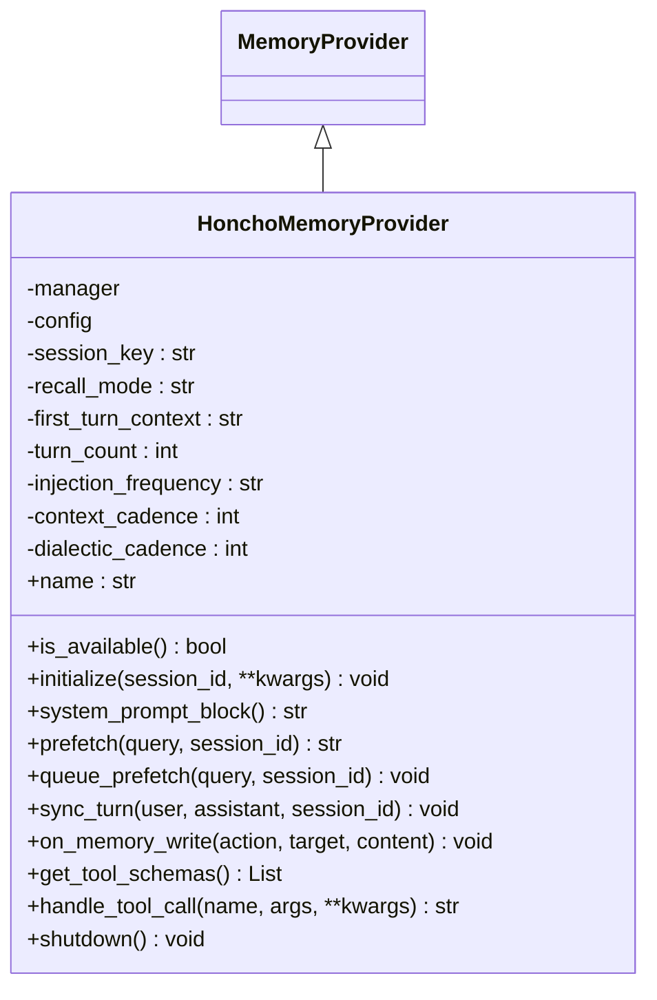
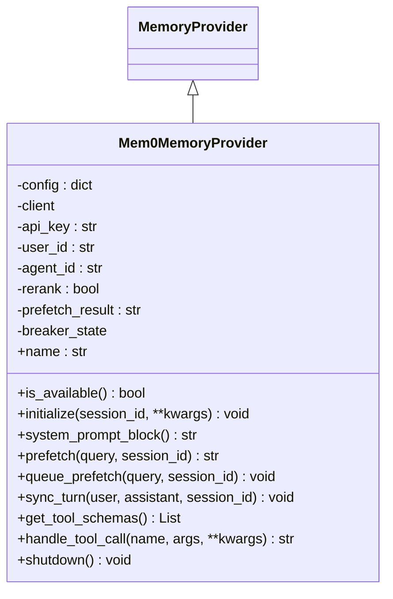
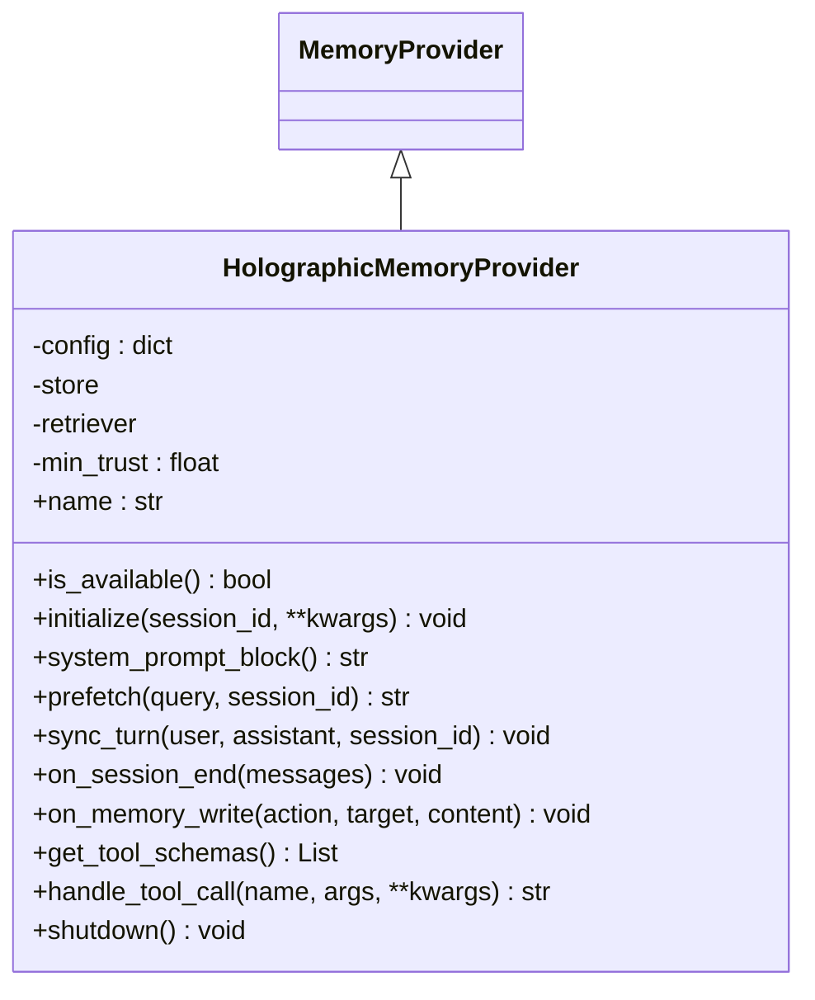
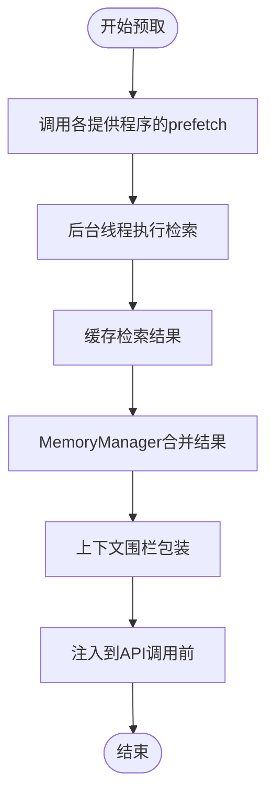
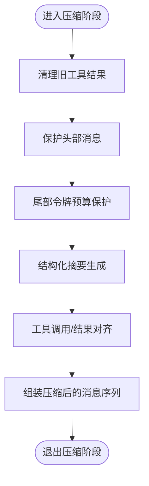
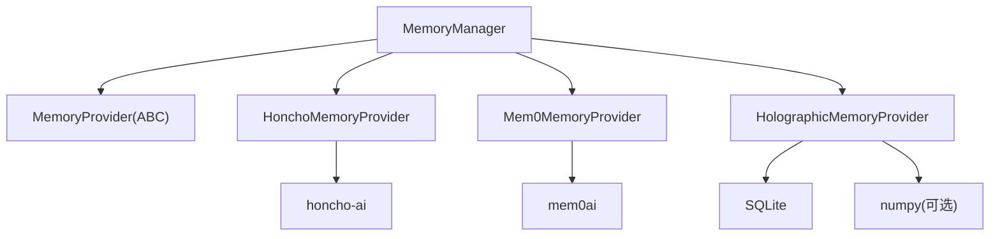

# 记忆管理系统

<cite>
**本文档引用的文件**
- [memory_manager.py](file://agent/memory_manager.py)
- [memory_provider.py](file://agent/memory_provider.py)
- [plugins_memory_init.py](file://plugins/memory/__init__.py)
- [honcho_init.py](file://plugins/memory/honcho/__init__.py)
- [mem0_init.py](file://plugins/memory/mem0/__init__.py)
- [holographic_init.py](file://plugins/memory/holographic/__init__.py)
- [context_compressor.py](file://agent/context_compressor.py)
- [run_agent.py](file://run_agent.py)
- [memory_setup.py](file://hermes_cli/memory_setup.py)
- [plugins_cmd.py](file://hermes_cli/plugins_cmd.py)
</cite>

## 目录
1. [简介](#简介)
2. [项目结构](#项目结构)
3. [核心组件](#核心组件)
4. [架构总览](#架构总览)
5. [详细组件分析](#详细组件分析)
6. [依赖分析](#依赖分析)
7. [性能考虑](#性能考虑)
8. [故障排除指南](#故障排除指南)
9. [结论](#结论)
10. [附录](#附录)

## 简介
本技术文档系统性阐述记忆管理子系统的设计与实现，重点覆盖以下方面：
- memory_manager 模块的编排架构与生命周期管理
- memory_provider 接口设计与各外部提供程序的差异化实现
- 记忆检索算法与上下文压缩策略
- 跨会话记忆保持与持久化机制
- 配置与使用示例（内存型、持久化型、云端服务）
- 性能优化与最佳实践

## 项目结构
记忆管理子系统由三部分组成：
- 内置管理器：统一调度与编排
- 提供程序接口：抽象定义与生命周期钩子
- 外部插件提供程序：Honcho、Mem0、Holographic 等

**图表来源**
- [memory_manager.py:72-136](file://agent/memory_manager.py#L72-L136)
- [memory_provider.py:42-81](file://agent/memory_provider.py#L42-L81)
- [plugins_memory_init.py:32-75](file://plugins/memory/__init__.py#L32-L75)

**章节来源**
- [memory_manager.py:1-363](file://agent/memory_manager.py#L1-L363)
- [memory_provider.py:1-232](file://agent/memory_provider.py#L1-L232)
- [plugins_memory_init.py:1-318](file://plugins/memory/__init__.py#L1-L318)

## 核心组件
- MemoryManager：负责注册/路由提供程序、系统提示拼接、预取/同步、工具分发、生命周期钩子广播与资源清理。
- MemoryProvider：定义提供程序必须实现的生命周期方法与可选钩子，支持配置模式与工具暴露。

关键职责与行为：
- 注册限制：内置提供程序始终存在且不可移除；最多仅允许一个外部提供程序。
- 错误隔离：任一提供程序失败不阻塞其他提供程序。
- 工具路由：基于工具名到提供程序的映射进行分发。
- 生命周期：initialize → system_prompt_block → prefetch → sync_turn → shutdown。

**章节来源**
- [memory_manager.py:72-363](file://agent/memory_manager.py#L72-L363)
- [memory_provider.py:42-232](file://agent/memory_provider.py#L42-L232)

## 架构总览
记忆管理采用“内置优先 + 外部插件”的双层架构。内置提供程序保证基础能力（如 MEMORY.md/USER.md 的持久化），外部提供程序按需扩展（语义检索、用户建模、结构化事实存储等）。

**图表来源**
- [memory_manager.py:146-363](file://agent/memory_manager.py#L146-L363)
- [memory_provider.py:50-141](file://agent/memory_provider.py#L50-L141)

## 详细组件分析

### MemoryManager 组件分析
- 注册与路由
  - add_provider：内置提供程序总是接受；外部提供程序仅允许一个，重复注册会警告并拒绝。
  - 工具路由：根据工具 schema 建立 name→provider 映射，冲突时记录告警。
- 上下文构建
  - build_system_prompt：收集所有提供程序的静态提示块并合并。
  - build_memory_context_block：对预取结果进行围栏包装，防止模型将其误认为用户输入。
- 预取与同步
  - prefetch_all：聚合所有提供程序的预取结果，失败不阻断。
  - queue_prefetch_all：为下一回合排队后台预取。
  - sync_all：在回合结束后异步写入所有提供程序。
- 生命周期钩子
  - on_turn_start/on_session_end/on_pre_compress/on_memory_write/on_delegation：广播到所有提供程序，失败记录日志但不中断。
- 资源管理
  - initialize_all：自动注入 hermes_home 并初始化所有提供程序。
  - shutdown_all：逆序关闭，确保清理顺序正确。

**图表来源**
- [memory_manager.py:72-363](file://agent/memory_manager.py#L72-L363)

**章节来源**
- [memory_manager.py:72-363](file://agent/memory_manager.py#L72-L363)

### MemoryProvider 接口设计
- 必须实现
  - name/is_available/initialize/system_prompt_block/prefetch/queue_prefetch/sync_turn/get_tool_schemas/shutdown
- 可选钩子
  - on_turn_start/on_session_end/on_pre_compress/on_memory_write/on_delegation
- 配置支持
  - get_config_schema/save_config：用于 hermes memory setup 向导生成配置文件或 .env。

**图表来源**
- [memory_provider.py:42-232](file://agent/memory_provider.py#L42-L232)

**章节来源**
- [memory_provider.py:1-232](file://agent/memory_provider.py#L1-L232)

### 外部提供程序实现对比

#### Honcho 提供程序
- 特点
  - AI 原生跨会话用户建模，支持对话式问答、语义搜索、同伴卡片与结论持久化。
  - 支持三种回忆模式：context（自动注入）、tools（仅工具）、hybrid（混合）。
  - 成本感知：通过注入频率、上下文/辩证查询的轮询间隔控制成本。
- 关键实现
  - initialize：支持 cron 守护、会话名称解析、首次上下文烘焙、懒初始化。
  - prefetch/queue_prefetch：后台线程执行辩证查询与上下文预取，并按预算截断。
  - sync_turn：分段消息写入，避免单条消息超限。
  - on_memory_write：将内置用户档案写入镜像为 Honcho 结论。
  - 工具：profile/search/context/conclude。

**图表来源**
- [honcho_init.py:119-723](file://plugins/memory/honcho/__init__.py#L119-L723)
- [memory_provider.py:42-232](file://agent/memory_provider.py#L42-L232)

**章节来源**
- [honcho_init.py:1-723](file://plugins/memory/honcho/__init__.py#L1-L723)

#### Mem0 提供程序
- 特点
  - 服务器端 LLM 提取、重排序语义搜索、自动去重。
  - 支持电路断路器，连续失败后进入冷却，避免雪崩。
- 关键实现
  - initialize：从环境变量与本地 JSON 加载配置，支持网关用户 ID 覆盖。
  - prefetch/queue_prefetch：后台线程执行搜索，结果格式化为列表。
  - sync_turn：非阻塞地提交对话，触发服务器端提取。
  - 工具：profile/search/conclude。

**图表来源**
- [mem0_init.py:119-374](file://plugins/memory/mem0/__init__.py#L119-L374)
- [memory_provider.py:42-232](file://agent/memory_provider.py#L42-L232)

**章节来源**
- [mem0_init.py:1-374](file://plugins/memory/mem0/__init__.py#L1-L374)

#### Holographic 提供程序
- 特点
  - 结构化事实存储，实体解析、信任评分、HRR 向量组合检索。
  - 支持自动抽取（基于正则模式）与手动工具操作。
- 关键实现
  - initialize：加载 SQLite 数据库与检索器，支持配置项（默认信任、HRR 维度、时间衰减等）。
  - prefetch：基于检索器返回带信任分的事实列表。
  - on_session_end：可选自动抽取用户偏好与决策类内容。
  - on_memory_write：将内置写入镜像为事实存储。
  - 工具：fact_store/fact_feedback（增删改查、推理、矛盾检测等）。

**图表来源**
- [holographic_init.py:114-408](file://plugins/memory/holographic/__init__.py#L114-L408)
- [memory_provider.py:42-232](file://agent/memory_provider.py#L42-L232)

**章节来源**
- [holographic_init.py:1-408](file://plugins/memory/holographic/__init__.py#L1-L408)

### 记忆检索与上下文压缩流程

#### 记忆检索算法
- 预取阶段
  - MemoryManager 调用各提供程序的 prefetch，后台线程执行实际检索，返回缓存结果。
  - Honcho：按 cadence 控制辩证查询与上下文预取，支持预算截断。
  - Mem0：后台线程执行搜索，结果标准化为列表。
  - Holographic：基于检索器执行关键词/组合检索，返回带信任分的事实。
- 上下文围栏
  - 将预取结果包裹在围栏标签中，防止模型将其误判为用户输入。

**图表来源**
- [memory_manager.py:167-195](file://agent/memory_manager.py#L167-L195)
- [memory_manager.py:54-69](file://agent/memory_manager.py#L54-L69)

**章节来源**
- [memory_manager.py:49-195](file://agent/memory_manager.py#L49-L195)

#### 上下文压缩策略
- 触发条件
  - 当提示词令牌数达到阈值（模型上下文窗口的固定比例）时触发压缩。
- 压缩算法
  - 预处理：清理旧工具结果（保留少量摘要占位符）。
  - 边界确定：保护头尾消息，尾部采用“令牌预算”而非固定数量。
  - 结构化摘要：使用辅助模型生成结构化摘要（目标约等于压缩内容的 20%），支持迭代更新。
  - 工具对齐：修复被压缩后残留的工具调用/结果配对问题。
- 运行时集成
  - 压缩器在运行时被注入到会话中，当检测到上下文压力时自动执行。

**图表来源**
- [context_compressor.py:666-800](file://agent/context_compressor.py#L666-L800)

**章节来源**
- [context_compressor.py:60-800](file://agent/context_compressor.py#L60-L800)
- [run_agent.py:9848-9866](file://run_agent.py#L9848-L9866)

### 跨会话记忆保持与持久化
- 内置记忆
  - 通过内置提供程序维持 MEMORY.md/USER.md 的持久化，作为“基线”记忆。
- 外部提供程序
  - Honcho：云端会话与结论持久化，支持跨会话用户建模。
  - Mem0：平台 API 存储与检索，支持重排序与去重。
  - Holographic：本地 SQLite 存储结构化事实，支持自动抽取与信任评分。
- 生命周期与镜像
  - MemoryManager 在内置写入时广播 on_memory_write，外部提供程序可选择镜像到自身后端。

**章节来源**
- [memory_manager.py:304-318](file://agent/memory_manager.py#L304-L318)
- [honcho_init.py:604-621](file://plugins/memory/honcho/__init__.py#L604-L621)
- [mem0_init.py:272-295](file://plugins/memory/mem0/__init__.py#L272-L295)
- [holographic_init.py:243-250](file://plugins/memory/holographic/__init__.py#L243-L250)

### 配置与使用示例

#### 选择与安装外部提供程序
- 使用交互式向导选择提供程序并保存配置：
  - hermes memory setup
  - 或直接设置配置项：memory.provider
- CLI 中可查看可用提供程序并切换当前提供程序。

**章节来源**
- [memory_setup.py:186-231](file://hermes_cli/memory_setup.py#L186-L231)
- [plugins_cmd.py:666-710](file://hermes_cli/plugins_cmd.py#L666-L710)

#### Honcho 配置要点
- 支持从全局配置链加载：$HERMES_HOME/honcho.json → ~/.honcho/config.json → 环境变量。
- 回忆模式：context/tools/hybrid；成本控制：注入频率、上下文/辩证查询轮询间隔。
- 工具：honcho_profile、honcho_search、honcho_context、honcho_conclude。

**章节来源**
- [honcho_init.py:10-14](file://plugins/memory/honcho/__init__.py#L10-L14)
- [honcho_init.py:183-187](file://plugins/memory/honcho/__init__.py#L183-L187)
- [honcho_init.py:636-702](file://plugins/memory/honcho/__init__.py#L636-L702)

#### Mem0 配置要点
- 环境变量：MEM0_API_KEY（必填）、MEM0_USER_ID、MEM0_AGENT_ID。
- 可选：$HERMES_HOME/mem0.json 覆盖个别字段。
- 工具：mem0_profile、mem0_search、mem0_conclude。

**章节来源**
- [mem0_init.py:8-14](file://plugins/memory/mem0/__init__.py#L8-L14)
- [mem0_init.py:160-166](file://plugins/memory/mem0/__init__.py#L160-L166)
- [mem0_init.py:297-361](file://plugins/memory/mem0/__init__.py#L297-L361)

#### Holographic 配置要点
- 插件配置：$HERMES_HOME/config.yaml 下的 plugins.hermes-memory-store。
- 关键参数：db_path、auto_extract、default_trust、hrr_dim 等。
- 工具：fact_store（增删改查、推理、矛盾检测等）、fact_feedback。

**章节来源**
- [holographic_init.py:8-16](file://plugins/memory/holographic/__init__.py#L8-L16)
- [holographic_init.py:147-155](file://plugins/memory/holographic/__init__.py#L147-L155)
- [holographic_init.py:226-250](file://plugins/memory/holographic/__init__.py#L226-L250)

## 依赖分析
- 组件耦合
  - MemoryManager 与 MemoryProvider：通过接口解耦，提供程序之间无直接依赖。
  - 外部提供程序各自封装 SDK/客户端，避免对运行时的强依赖。
- 外部依赖
  - Honcho：需要 honcho-ai 包。
  - Mem0：需要 mem0ai 包。
  - Holographic：依赖 SQLite 与可选 numpy（用于 HRR 向量）。
- 插件发现
  - plugins.memory.__init__ 扫描目录，动态导入提供程序模块并注册。

**图表来源**
- [memory_manager.py:72-136](file://agent/memory_manager.py#L72-L136)
- [honcho_init.py:1-30](file://plugins/memory/honcho/__init__.py#L1-L30)
- [mem0_init.py:1-30](file://plugins/memory/mem0/__init__.py#L1-L30)
- [holographic_init.py:1-30](file://plugins/memory/holographic/__init__.py#L1-L30)

**章节来源**
- [plugins_memory_init.py:32-196](file://plugins/memory/__init__.py#L32-L196)

## 性能考虑
- 预取与同步
  - 所有检索与写入均在后台线程执行，避免阻塞主流程。
  - Honcho/Mem0 的 queue_prefetch 与 sync_turn 均采用非阻塞策略。
- 成本控制
  - Honcho：通过注入频率与 cadence 控制 API 调用频次；支持预算截断。
  - Mem0：电路断路器在连续失败时暂停请求，降低下游压力。
- 压缩效率
  - 先行清理旧工具结果，减少摘要生成负担。
  - 令牌预算保护尾部，避免频繁截断造成信息丢失。
- 配置建议
  - 根据模型上下文窗口调整阈值与摘要比例。
  - 对高成本提供程序（如 Honcho dialectic 查询）设置合理的 cadence。
  - 合理设置 Mem0 的 rerank 与 top_k，平衡精度与延迟。

[本节为通用指导，无需特定文件引用]

## 故障排除指南
- 提供程序不可用
  - 检查 is_available 返回值与配置文件/环境变量是否正确。
  - 查看初始化日志中的警告信息。
- 工具调用失败
  - MemoryManager 会捕获异常并返回工具错误消息；检查具体提供程序的日志。
- 压缩失败
  - 压缩器在摘要生成失败时会进入冷却期；等待冷却后重试。
- 资源清理
  - shutdown_all 逆序关闭，确保线程安全退出；若出现悬挂线程，检查具体提供程序的 shutdown 实现。

**章节来源**
- [memory_manager.py:158-163](file://agent/memory_manager.py#L158-L163)
- [memory_manager.py:249-256](file://agent/memory_manager.py#L249-L256)
- [context_compressor.py:468-483](file://agent/context_compressor.py#L468-L483)
- [mem0_init.py:363-369](file://plugins/memory/mem0/__init__.py#L363-L369)

## 结论
记忆管理系统通过 MemoryManager 的统一编排与 MemoryProvider 的清晰接口，实现了“内置基线 + 外部增强”的灵活架构。各外部提供程序在保持独立性的同时，通过一致的生命周期与工具接口无缝融入运行时。结合上下文压缩与成本控制策略，系统在长对话场景下仍能维持稳定的性能与用户体验。

[本节为总结性内容，无需特定文件引用]

## 附录

### 配置与部署清单
- 选择提供程序
  - hermes memory setup
  - 或设置 memory.provider
- Honcho
  - 配置来源：$HERMES_HOME/honcho.json、~/.honcho/config.json、环境变量
  - 工具：honcho_profile、honcho_search、honcho_context、honcho_conclude
- Mem0
  - 环境变量：MEM0_API_KEY、MEM0_USER_ID、MEM0_AGENT_ID
  - 工具：mem0_profile、mem0_search、mem0_conclude
- Holographic
  - 配置：$HERMES_HOME/config.yaml 下 plugins.hermes-memory-store
  - 工具：fact_store、fact_feedback

**章节来源**
- [memory_setup.py:186-231](file://hermes_cli/memory_setup.py#L186-L231)
- [honcho_init.py:10-14](file://plugins/memory/honcho/__init__.py#L10-L14)
- [mem0_init.py:8-14](file://plugins/memory/mem0/__init__.py#L8-L14)
- [holographic_init.py:8-16](file://plugins/memory/holographic/__init__.py#L8-L16)