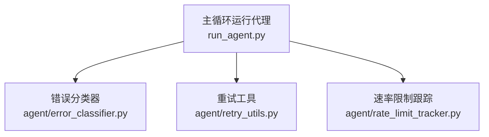
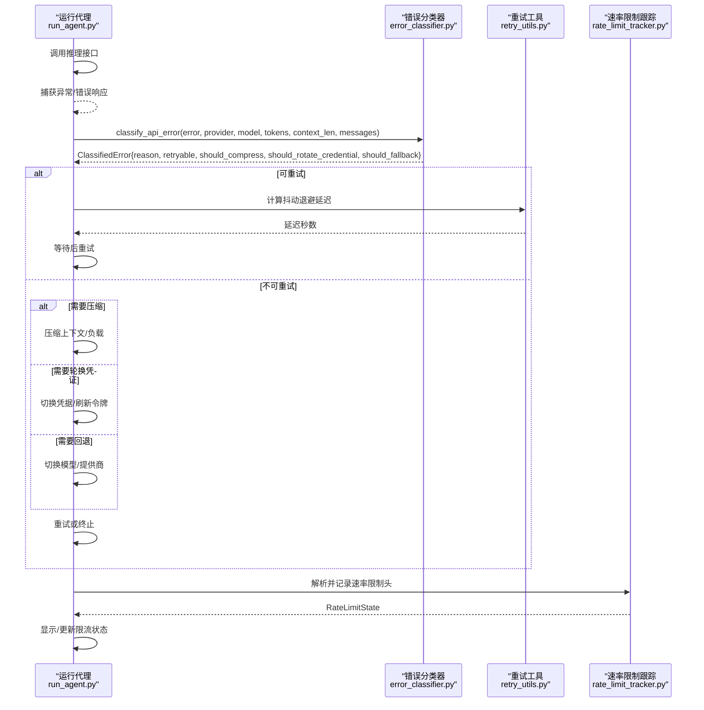
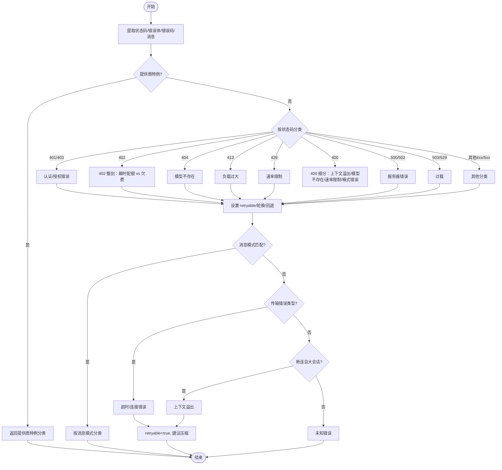
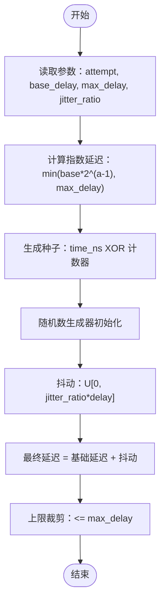
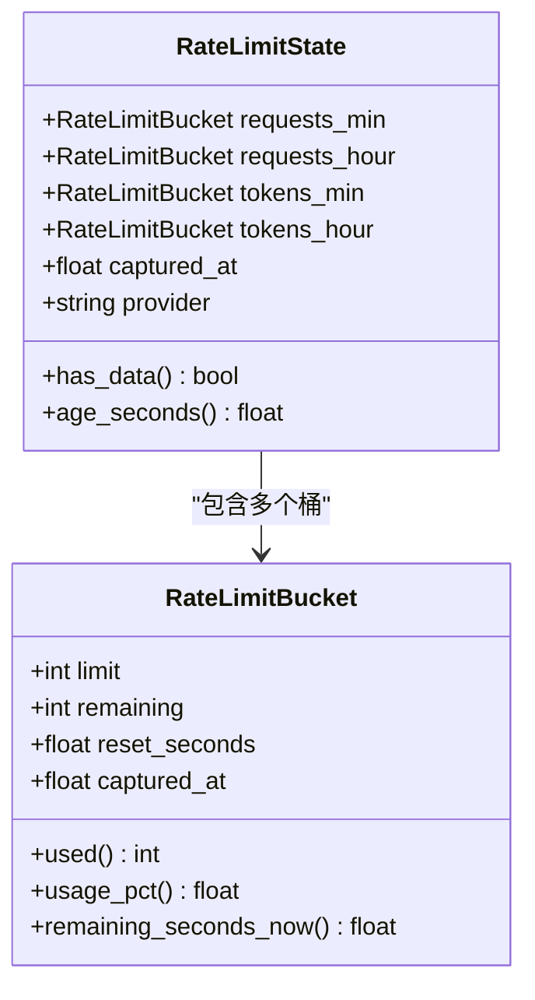
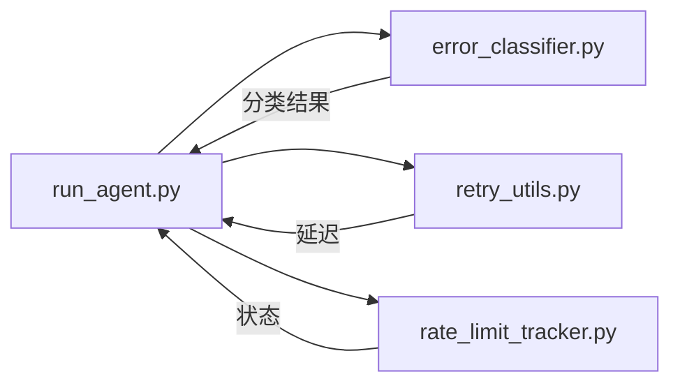

# 错误处理与重试机制

<cite>
**本文引用的文件**
- [agent/error_classifier.py](file://agent/error_classifier.py)
- [agent/retry_utils.py](file://agent/retry_utils.py)
- [agent/rate_limit_tracker.py](file://agent/rate_limit_tracker.py)
- [tests/agent/test_error_classifier.py](file://tests/agent/test_error_classifier.py)
- [tests/test_retry_utils.py](file://tests/test_retry_utils.py)
- [tests/agent/test_rate_limit_tracker.py](file://tests/agent/test_rate_limit_tracker.py)
- [run_agent.py](file://run_agent.py)
</cite>

## 目录
1. [简介](#简介)
2. [项目结构](#项目结构)
3. [核心组件](#核心组件)
4. [架构总览](#架构总览)
5. [详细组件分析](#详细组件分析)
6. [依赖分析](#依赖分析)
7. [性能考虑](#性能考虑)
8. [故障排查指南](#故障排查指南)
9. [结论](#结论)
10. [附录：配置与示例路径](#附录配置与示例路径)

## 简介
本文件系统性阐述本仓库中的“错误处理与重试机制”，重点覆盖以下模块：
- 错误分类器（error_classifier）：对API错误进行结构化分类，输出可执行的恢复动作建议（是否可重试、是否压缩上下文、是否轮换凭证、是否回退到其他提供商或模型）。
- 重试工具（retry_utils）：提供抖动退避（decorrelated jittered backoff），避免并发重试引发“惊群效应”。
- 速率限制跟踪（rate_limit_tracker）：解析并格式化速率限制响应头，用于状态显示与告警。

文档将从架构设计、数据流、处理逻辑、集成点、错误处理策略、性能特征与最佳实践等方面展开，并给出可操作的配置与监控建议。

## 项目结构
围绕错误处理与重试的关键文件组织如下：
- 错误分类：agent/error_classifier.py
- 重试退避：agent/retry_utils.py
- 速率限制：agent/rate_limit_tracker.py
- 测试用例：tests/agent/test_error_classifier.py、tests/test_retry_utils.py、tests/agent/test_rate_limit_tracker.py
- 主循环集成：run_agent.py（导入并使用上述模块）

图表来源
- [agent/error_classifier.py](file://agent/error_classifier.py)
- [agent/retry_utils.py](file://agent/retry_utils.py)
- [agent/rate_limit_tracker.py](file://agent/rate_limit_tracker.py)
- [run_agent.py](file://run_agent.py)

章节来源
- [agent/error_classifier.py](file://agent/error_classifier.py)
- [agent/retry_utils.py](file://agent/retry_utils.py)
- [agent/rate_limit_tracker.py](file://agent/rate_limit_tracker.py)
- [run_agent.py](file://run_agent.py)

## 核心组件
- 错误分类器（error_classifier）
  - 提供 FailoverReason 枚举与 ClassifiedError 结构化结果，定义优先级分类管线（状态码、错误码、消息模式、传输错误、断连大会话 heuristic 等）。
  - 输出 recovery hints：retryable、should_compress、should_rotate_credential、should_fallback。
- 重试工具（retry_utils）
  - jittered_backoff：指数退避 + 抖动，支持 base_delay、max_delay、jitter_ratio 配置；内部使用线程安全计数器与时间戳种子确保并发 decorrelation。
- 速率限制跟踪（rate_limit_tracker）
  - 解析 x-ratelimit-* 响应头，封装 RateLimitState/RateLimitBucket，提供人类可读的格式化输出与紧凑摘要。

章节来源
- [agent/error_classifier.py](file://agent/error_classifier.py)
- [agent/retry_utils.py](file://agent/retry_utils.py)
- [agent/rate_limit_tracker.py](file://agent/rate_limit_tracker.py)

## 架构总览
下图展示了主循环在调用推理接口失败时的典型流程：捕获异常 → 分类错误 → 决策恢复动作 → 执行重试/压缩/轮换/回退 → 更新速率限制状态。

图表来源
- [run_agent.py](file://run_agent.py)
- [agent/error_classifier.py](file://agent/error_classifier.py)
- [agent/retry_utils.py](file://agent/retry_utils.py)
- [agent/rate_limit_tracker.py](file://agent/rate_limit_tracker.py)

## 详细组件分析

### 组件A：错误分类器（error_classifier）
- 设计要点
  - 分类优先级：先处理提供商特例（如 Anthropic 思维块签名、长上下文门限），再依据 HTTP 状态码细化，其次基于错误码，再基于消息模式，最后处理传输错误与断连大会话场景，兜底为 unknown。
  - 结构化输出：ClassifiedError 包含 reason、status_code、provider、model、message、error_context，以及 retryable/should_compress/should_rotate_credential/should_fallback 四个关键 hint。
  - 消息增强：合并 str(error)、body.message、metadata.raw 的内层 JSON message，提升跨代理（如 OpenRouter）的识别准确度。
- 关键分类场景
  - 认证/授权：401/403（区分 OpenRouter key limit exceeded 为 billing），非 retryable，通常触发 credential rotation 与 fallback。
  - 计费/配额：402（需与“使用量限额”消息信号区分瞬时配额与永久欠费），billing 时不可重试。
  - 速率限制：429、rate_limit 错误码、消息模式（如 try again、resets at 等），retryable 并建议轮换凭证与回退。
  - 服务器错误：500/502（server_error）与 503/529（overloaded）retryable。
  - 传输错误：超时/连接错误等归类为 timeout，retryable。
  - 上下文溢出：413、400/400 flat body 中的上下文长度/token 限制、断连且大会话、通用“context length exceeded”等，retryable 并建议压缩。
  - 模型不存在：404/400 中的 model not found，不可重试，建议 fallback。
  - 请求格式错误：400/422 中的格式问题，不可重试。
  - 提供商特例：Anthropic thinking signature、long context tier，分别走压缩或特殊提示。
- 处理逻辑与复杂度
  - 分类函数为线性扫描与模式匹配，整体 O(P)（P 为模式列表长度），受消息拼接影响，但通过“仅在必要时拼接”与“去重合并”控制开销。
  - 断连大会话 heuristic 将断连优先映射为 context_overflow，避免将网络抖动误判为超时。
- 错误处理与边界
  - 支持 cause 链上提取 status_code，防止多层包装导致丢失。
  - 对空 body、非字典 body、循环 cause 等边缘情况有健壮处理。
  - 对 OpenRouter metadata.raw 的内嵌错误 JSON 进行二次解析，提升跨代理一致性。

图表来源
- [agent/error_classifier.py](file://agent/error_classifier.py)

章节来源
- [agent/error_classifier.py](file://agent/error_classifier.py)
- [tests/agent/test_error_classifier.py](file://tests/agent/test_error_classifier.py)

### 组件B：重试工具（retry_utils）
- 设计要点
  - 指数退避：delay = min(base * 2^(attempt-1), max_delay)，保证快速收敛。
  - 抖动退避：在 [0, jitter_ratio*delay] 均匀采样，结合时间戳与单调计数器作为种子，确保并发请求的 decorrelation。
  - 线程安全：全局计数器与锁保护，避免竞态。
- 参数与行为
  - base_delay：首次尝试的基础延迟（秒）。
  - max_delay：最大延迟上限。
  - jitter_ratio：抖动比例（0~1）。
  - 返回值：最终等待秒数，满足 min_delay ≤ 返回值 ≤ max_delay*(1+jitter_ratio)。
- 测试验证
  - 指数增长、上限裁剪、抖动范围、零基延迟、极端尝试次数、负尝试、并发安全性等均有单元测试覆盖。

图表来源
- [agent/retry_utils.py](file://agent/retry_utils.py)
- [tests/test_retry_utils.py](file://tests/test_retry_utils.py)

章节来源
- [agent/retry_utils.py](file://agent/retry_utils.py)
- [tests/test_retry_utils.py](file://tests/test_retry_utils.py)

### 组件C：速率限制跟踪（rate_limit_tracker）
- 设计要点
  - 支持 x-ratelimit-* 头部族（requests/tokens × min/hour），解析为 RateLimitState/RateLimitBucket。
  - 提供两种格式化输出：详细显示（含进度条与告警）与紧凑摘要（适合状态栏）。
  - 使用时间校准剩余重置时间，考虑采集时刻与当前时间差。
- 数据结构
  - RateLimitBucket：limit、remaining、reset_seconds、captured_at、used、usage_pct、remaining_seconds_now。
  - RateLimitState：requests_min、requests_hour、tokens_min、tokens_hour、captured_at、provider。
- 使用场景
  - 在每次成功响应后解析响应头，更新 RateLimitState，并在 /usage 命令或状态栏中展示。
  - 当任一桶使用率 ≥ 80% 时附加警告提示。

图表来源
- [agent/rate_limit_tracker.py](file://agent/rate_limit_tracker.py)

章节来源
- [agent/rate_limit_tracker.py](file://agent/rate_limit_tracker.py)
- [tests/agent/test_rate_limit_tracker.py](file://tests/agent/test_rate_limit_tracker.py)

## 依赖分析
- 组件耦合
  - run_agent.py 依赖 error_classifier 与 retry_utils 进行错误分类与退避决策；依赖 rate_limit_tracker 解析并展示限流状态。
  - 三者之间为松耦合：error_classifier 仅输出结构化分类与 hint；retry_utils 仅提供延迟计算；rate_limit_tracker 仅解析与格式化。
- 外部依赖
  - HTTP 客户端返回的响应头字段（x-ratelimit-*）与 SDK 异常对象（status_code、body、response.json 等）。
- 潜在风险
  - 错误分类器对消息文本的依赖可能受多语言与上游代理包装影响；通过 metadata.raw 与多源消息拼接降低风险。
  - 重试工具的抖动依赖时间精度与随机种子，需确保系统时钟稳定与随机源可用。

图表来源
- [run_agent.py](file://run_agent.py)
- [agent/error_classifier.py](file://agent/error_classifier.py)
- [agent/retry_utils.py](file://agent/retry_utils.py)
- [agent/rate_limit_tracker.py](file://agent/rate_limit_tracker.py)

章节来源
- [run_agent.py](file://run_agent.py)
- [agent/error_classifier.py](file://agent/error_classifier.py)
- [agent/retry_utils.py](file://agent/retry_utils.py)
- [agent/rate_limit_tracker.py](file://agent/rate_limit_tracker.py)

## 性能考虑
- 退避抖动
  - 抖动退避显著降低并发重试的峰值压力，避免惊群效应；建议在高并发场景下调小 jitter_ratio 或提高 base_delay 以进一步分散重试。
- 分类器复杂度
  - 分类为线性模式匹配，常数因子较小；消息增强与 JSON 解析仅在需要时发生，整体开销可控。
- 速率限制解析
  - 解析与格式化均为 O(1) 桶数量（固定 4 桶），格式化字符串拼接成本低。
- 主循环集成
  - 在主循环中按需调用分类器与退避工具，避免在正常路径引入额外分支。

## 故障排查指南
- 常见问题与定位
  - 402 误判为 billing：检查消息中是否存在“usage limit + try again”等瞬时信号，确保分类器能正确识别。
  - OpenRouter 代理错误未被识别：确认 metadata.raw 是否包含真实错误消息，分类器已内置解析逻辑。
  - 重试过于频繁：检查 jitter_ratio 与 base_delay 设置，适当增大抖动或延迟。
  - 限流告警不出现：确认响应头是否包含 x-ratelimit-* 字段，或在代理层是否透传了这些头部。
- 排查步骤
  - 启用详细日志，观察 classify_api_error 的输入（status_code、body、message）与输出（reason、hint）。
  - 使用测试用例中的 mock 场景复现问题，逐步缩小到具体模式匹配。
  - 在高并发场景下验证 jittered_backoff 的并发安全性与抖动效果。
- 最佳实践
  - 对于认证错误，先尝试轮换凭证/刷新令牌，再决定是否重试。
  - 对于上下文溢出，优先压缩上下文，其次回退到更短上下文的模型。
  - 对于瞬时配额/速率限制，采用抖动退避并结合回退策略。
  - 对于服务器错误与过载，适度退避并考虑切换提供商或模型。

章节来源
- [tests/agent/test_error_classifier.py](file://tests/agent/test_error_classifier.py)
- [tests/test_retry_utils.py](file://tests/test_retry_utils.py)
- [tests/agent/test_rate_limit_tracker.py](file://tests/agent/test_rate_limit_tracker.py)

## 结论
本项目的错误处理与重试机制通过“结构化分类 + 抖动退避 + 限流可观测”的组合，实现了对多提供商、多错误类型的稳健应对。错误分类器提供了清晰的恢复动作指引，重试工具有效缓解并发重试压力，速率限制跟踪则为用户提供了直观的状态反馈。配合测试用例与主循环集成，这套机制在稳定性与可维护性方面表现良好。

## 附录：配置与示例路径
- 错误分类器
  - 入口函数：[classify_api_error](file://agent/error_classifier.py)
  - 结果结构：[ClassifiedError](file://agent/error_classifier.py)
  - 分类枚举：[FailoverReason](file://agent/error_classifier.py)
  - 测试参考：[tests/agent/test_error_classifier.py](file://tests/agent/test_error_classifier.py)
- 重试工具
  - 退避函数：[jittered_backoff](file://agent/retry_utils.py)
  - 测试参考：[tests/test_retry_utils.py](file://tests/test_retry_utils.py)
- 速率限制跟踪
  - 解析函数：[parse_rate_limit_headers](file://agent/rate_limit_tracker.py)
  - 格式化函数：[format_rate_limit_display](file://agent/rate_limit_tracker.py)、[format_rate_limit_compact](file://agent/rate_limit_tracker.py)
  - 测试参考：[tests/agent/test_rate_limit_tracker.py](file://tests/agent/test_rate_limit_tracker.py)
- 主循环集成
  - 导入与使用位置：[run_agent.py](file://run_agent.py)
  - 示例路径（搜索关键字）：在 run_agent.py 中搜索“classify_api_error”、“jittered_backoff”、“parse_rate_limit_headers”。