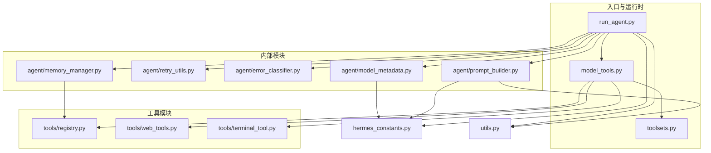
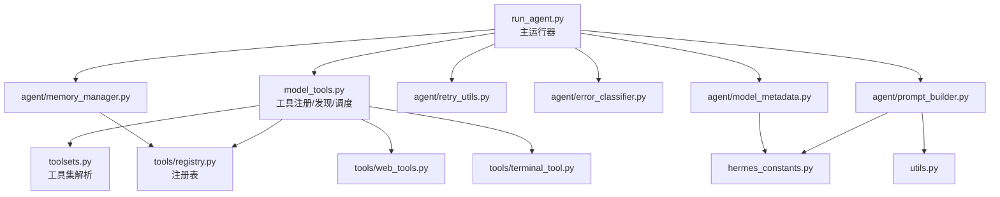
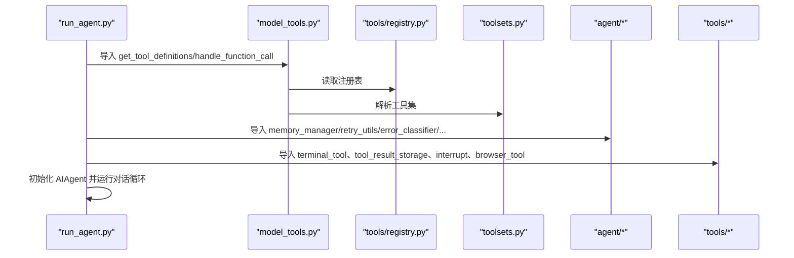
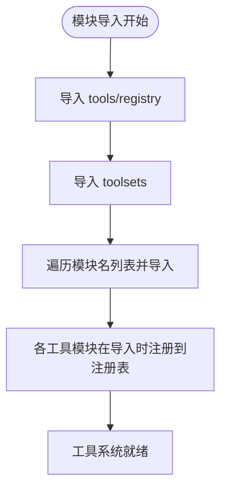
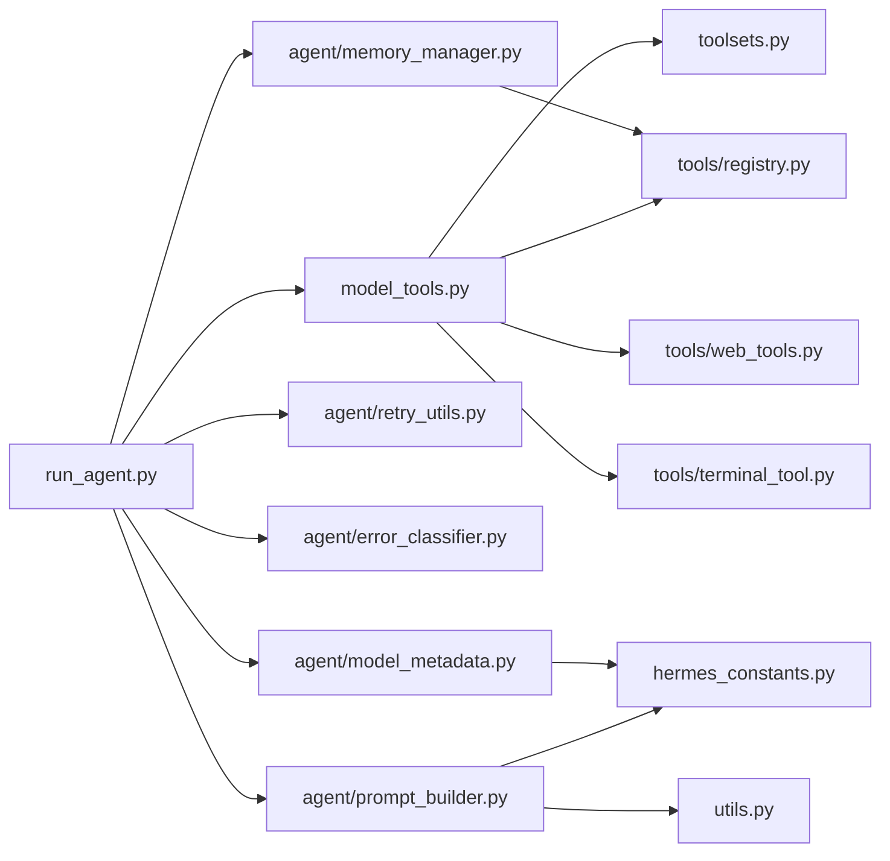

# 模块导入与依赖关系

<cite>
**本文档引用的文件**
- [run_agent.py](file://run_agent.py)
- [model_tools.py](file://model_tools.py)
- [agent/__init__.py](file://agent/__init__.py)
- [tools/__init__.py](file://tools/__init__.py)
- [agent/memory_manager.py](file://agent/memory_manager.py)
- [agent/retry_utils.py](file://agent/retry_utils.py)
- [agent/error_classifier.py](file://agent/error_classifier.py)
- [agent/prompt_builder.py](file://agent/prompt_builder.py)
- [agent/model_metadata.py](file://agent/model_metadata.py)
- [tools/registry.py](file://tools/registry.py)
- [toolsets.py](file://toolsets.py)
- [hermes_constants.py](file://hermes_constants.py)
- [utils.py](file://utils.py)
- [tools/web_tools.py](file://tools/web_tools.py)
- [tools/terminal_tool.py](file://tools/terminal_tool.py)
- [pyproject.toml](file://pyproject.toml)
</cite>

## 目录
1. [引言](#引言)
2. [项目结构](#项目结构)
3. [核心组件](#核心组件)
4. [架构总览](#架构总览)
5. [详细组件分析](#详细组件分析)
6. [依赖分析](#依赖分析)
7. [性能考虑](#性能考虑)
8. [故障排除指南](#故障排除指南)
9. [结论](#结论)

## 引言
本文件聚焦于 Hermes Agent 项目中的模块导入与依赖关系，系统性梳理标准库、第三方库与内部模块的导入层次，明确 run_agent.py 如何依赖 agent 包、tools 包与 model_tools 模块，并总结模块导入顺序的最佳实践与避免循环导入的策略。通过导入关系图与依赖分析表，帮助开发者理解模块间的耦合度与解耦策略。

## 项目结构
项目采用“入口脚本 + 内部包 + 工具子包”的分层组织方式：
- 入口与运行时：run_agent.py（主运行器）、model_tools.py（工具注册与调度）、toolsets.py（工具集定义）
- 内部模块：agent/*（内存、错误分类、提示词构建、模型元数据等）
- 工具模块：tools/*（终端、网页、文件、浏览器等工具）
- 常量与通用工具：hermes_constants.py、utils.py
- 依赖声明：pyproject.toml（核心依赖与可选依赖）

图表来源
- [run_agent.py](file://run_agent.py)
- [model_tools.py](file://model_tools.py)
- [agent/memory_manager.py](file://agent/memory_manager.py)
- [agent/retry_utils.py](file://agent/retry_utils.py)
- [agent/error_classifier.py](file://agent/error_classifier.py)
- [agent/prompt_builder.py](file://agent/prompt_builder.py)
- [agent/model_metadata.py](file://agent/model_metadata.py)
- [tools/registry.py](file://tools/registry.py)
- [toolsets.py](file://toolsets.py)
- [hermes_constants.py](file://hermes_constants.py)
- [utils.py](file://utils.py)
- [tools/web_tools.py](file://tools/web_tools.py)
- [tools/terminal_tool.py](file://tools/terminal_tool.py)

章节来源
- [run_agent.py](file://run_agent.py)
- [model_tools.py](file://model_tools.py)
- [agent/__init__.py](file://agent/__init__.py)
- [tools/__init__.py](file://tools/__init__.py)
- [pyproject.toml](file://pyproject.toml)

## 核心组件
- run_agent.py：主运行器，负责对话循环、工具调用、响应管理；集中导入 agent 子模块与工具系统。
- model_tools.py：工具注册与发现、工具集解析、异步桥接、函数调用分发。
- agent/*：按职责拆分的纯工具模块，降低 run_agent.py 的复杂度。
- tools/*：具体工具实现，通过 tools/registry.py 注册到全局注册表。
- toolsets.py：工具集定义与解析，支持组合与动态扩展。
- hermes_constants.py：无依赖常量与路径解析，保证任何模块安全导入。
- utils.py：共享工具函数（原子写入、环境变量处理等）。

章节来源
- [run_agent.py](file://run_agent.py)
- [model_tools.py](file://model_tools.py)
- [agent/__init__.py](file://agent/__init__.py)
- [tools/__init__.py](file://tools/__init__.py)
- [hermes_constants.py](file://hermes_constants.py)
- [utils.py](file://utils.py)

## 架构总览
run_agent.py 作为控制中心，通过 model_tools.py 统一接入工具生态；agent/* 提供横切能力（重试、错误分类、提示词、模型元数据等）。tools/* 通过注册表集中管理，避免 run_agent.py 直接耦合具体工具实现。

图表来源
- [run_agent.py](file://run_agent.py)
- [model_tools.py](file://model_tools.py)
- [tools/registry.py](file://tools/registry.py)
- [toolsets.py](file://toolsets.py)
- [tools/web_tools.py](file://tools/web_tools.py)
- [tools/terminal_tool.py](file://tools/terminal_tool.py)
- [agent/memory_manager.py](file://agent/memory_manager.py)
- [agent/retry_utils.py](file://agent/retry_utils.py)
- [agent/error_classifier.py](file://agent/error_classifier.py)
- [agent/prompt_builder.py](file://agent/prompt_builder.py)
- [agent/model_metadata.py](file://agent/model_metadata.py)
- [hermes_constants.py](file://hermes_constants.py)
- [utils.py](file://utils.py)

## 详细组件分析

### run_agent.py 导入层次与依赖关系
- 标准库导入：用于日志、时间、类型注解、路径等。
- 第三方库导入：openai、fire、httpx 等，用于模型调用与命令行接口。
- hermes_constants：获取用户目录与默认路径。
- hermes_cli.env_loader：加载环境变量。
- model_tools：工具定义、工具集解析、函数调用分发。
- tools.*：终端、结果持久化、中断、浏览器清理等工具辅助。
- agent.*：内存管理、重试、错误分类、提示词构建、模型元数据、显示、轨迹等。

图表来源
- [run_agent.py](file://run_agent.py)
- [model_tools.py](file://model_tools.py)
- [tools/registry.py](file://tools/registry.py)
- [toolsets.py](file://toolsets.py)
- [agent/memory_manager.py](file://agent/memory_manager.py)
- [agent/retry_utils.py](file://agent/retry_utils.py)
- [agent/error_classifier.py](file://agent/error_classifier.py)
- [agent/prompt_builder.py](file://agent/prompt_builder.py)
- [agent/model_metadata.py](file://agent/model_metadata.py)
- [tools/terminal_tool.py](file://tools/terminal_tool.py)
- [tools/web_tools.py](file://tools/web_tools.py)

章节来源
- [run_agent.py](file://run_agent.py)

### model_tools.py 的导入与发现机制
- 导入 tools/registry 与 toolsets，统一查询工具定义与工具集。
- 在模块级导入 tools/* 子模块触发注册，避免 run_agent.py 直接导入每个工具文件。
- 提供异步桥接（_run_async），确保缓存客户端在多线程/多事件循环场景稳定。

图表来源
- [model_tools.py](file://model_tools.py)
- [tools/registry.py](file://tools/registry.py)
- [toolsets.py](file://toolsets.py)

章节来源
- [model_tools.py](file://model_tools.py)

### agent/* 模块的职责与导入
- memory_manager：内存提供者编排，构建系统提示与上下文块。
- retry_utils：抖动退避算法，降低并发重试风暴。
- error_classifier：API 错误分类与恢复策略。
- prompt_builder：系统提示拼装、平台提示、技能索引、上下文文件注入。
- model_metadata：模型元数据、上下文长度探测、令牌估算。

章节来源
- [agent/memory_manager.py](file://agent/memory_manager.py)
- [agent/retry_utils.py](file://agent/retry_utils.py)
- [agent/error_classifier.py](file://agent/error_classifier.py)
- [agent/prompt_builder.py](file://agent/prompt_builder.py)
- [agent/model_metadata.py](file://agent/model_metadata.py)

### tools/* 与注册表
- tools/registry.py：集中注册工具 schema、处理器、可用性检查与分发。
- tools/web_tools.py、tools/terminal_tool.py：各自导入 agent.auxiliary_client、tools.managed_tool_gateway 等，体现工具对横切能力的依赖。

章节来源
- [tools/registry.py](file://tools/registry.py)
- [tools/web_tools.py](file://tools/web_tools.py)
- [tools/terminal_tool.py](file://tools/terminal_tool.py)

## 依赖分析

### 导入关系图（代码级映射）

图表来源
- [run_agent.py](file://run_agent.py)
- [model_tools.py](file://model_tools.py)
- [tools/registry.py](file://tools/registry.py)
- [toolsets.py](file://toolsets.py)
- [tools/web_tools.py](file://tools/web_tools.py)
- [tools/terminal_tool.py](file://tools/terminal_tool.py)
- [agent/memory_manager.py](file://agent/memory_manager.py)
- [agent/retry_utils.py](file://agent/retry_utils.py)
- [agent/error_classifier.py](file://agent/error_classifier.py)
- [agent/prompt_builder.py](file://agent/prompt_builder.py)
- [agent/model_metadata.py](file://agent/model_metadata.py)
- [hermes_constants.py](file://hermes_constants.py)
- [utils.py](file://utils.py)

### 依赖分析表
- run_agent.py 依赖
  - model_tools：工具定义与分发
  - agent/*：横切能力与提示词构建
  - hermes_constants：环境路径
  - tools/*：工具辅助（终端、结果存储、中断、浏览器）
- model_tools.py 依赖
  - tools/registry：注册表查询与分发
  - toolsets：工具集解析
  - tools/*：触发注册（模块导入）
- agent/* 依赖
  - hermes_constants：常量与路径
  - utils：通用工具
  - tools/registry：部分模块使用（如 memory_manager）
- tools/* 依赖
  - tools/registry：注册表
  - agent.auxiliary_client：网页工具等
  - hermes_cli.config：工具配置加载（如 web_tools）

章节来源
- [run_agent.py](file://run_agent.py)
- [model_tools.py](file://model_tools.py)
- [agent/prompt_builder.py](file://agent/prompt_builder.py)
- [agent/model_metadata.py](file://agent/model_metadata.py)
- [agent/memory_manager.py](file://agent/memory_manager.py)
- [tools/web_tools.py](file://tools/web_tools.py)
- [tools/terminal_tool.py](file://tools/terminal_tool.py)
- [tools/registry.py](file://tools/registry.py)
- [toolsets.py](file://toolsets.py)
- [hermes_constants.py](file://hermes_constants.py)
- [utils.py](file://utils.py)

## 性能考虑
- 事件循环复用：model_tools._run_async 使用持久事件循环，避免“事件循环已关闭”错误，减少缓存客户端重建成本。
- 抖动退避：agent/retry_utils 采用抖动指数退避，降低并发重试导致的瞬时拥塞。
- 工具发现延迟：model_tools 在模块导入阶段完成工具发现，避免运行时动态导入带来的开销。
- 上下文压缩与令牌估算：agent/model_metadata 与 agent/context_compressor 协作，减少长上下文引发的超时与失败。

## 故障排除指南
- 循环导入问题
  - 避免在 tools/registry.py 中导入 model_tools 或具体工具模块，保持其为“无依赖”导入安全模块。
  - 在工具模块中按需延迟导入（如 tools/web_tools.py 中的 hermes_cli.config），减少启动时依赖链长度。
- 工具不可用
  - 检查 tools/registry 的 check_fn 返回值与 toolsets 的可用性检查。
  - 使用 model_tools.check_toolset_requirements 获取工具集可用性诊断。
- 事件循环异常
  - 确保通过 model_tools._run_async 进行异步桥接，避免直接使用 asyncio.run 创建/销毁事件循环。
- 超时与限流
  - 使用 agent/retry_utils 的抖动退避策略，结合 agent/error_classifier 的分类结果选择重试/降级/压缩。

章节来源
- [tools/registry.py](file://tools/registry.py)
- [tools/web_tools.py](file://tools/web_tools.py)
- [model_tools.py](file://model_tools.py)
- [agent/retry_utils.py](file://agent/retry_utils.py)
- [agent/error_classifier.py](file://agent/error_classifier.py)

## 结论
Hermes Agent 通过“入口脚本 + 工具注册表 + 工具集解析 + 横切能力模块”的架构实现了清晰的导入层次与低耦合设计。run_agent.py 仅依赖 model_tools 与 agent/*，避免直接耦合具体工具实现；model_tools 通过注册表与工具集统一管理工具生态；hermes_constants 与 utils 提供跨模块的无副作用依赖。遵循模块导入顺序与延迟导入策略，可有效避免循环导入并提升启动与运行性能。