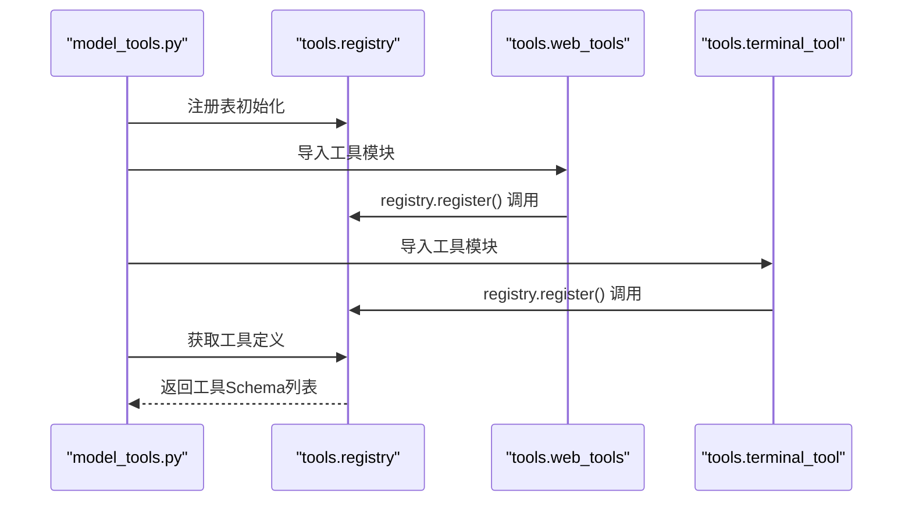
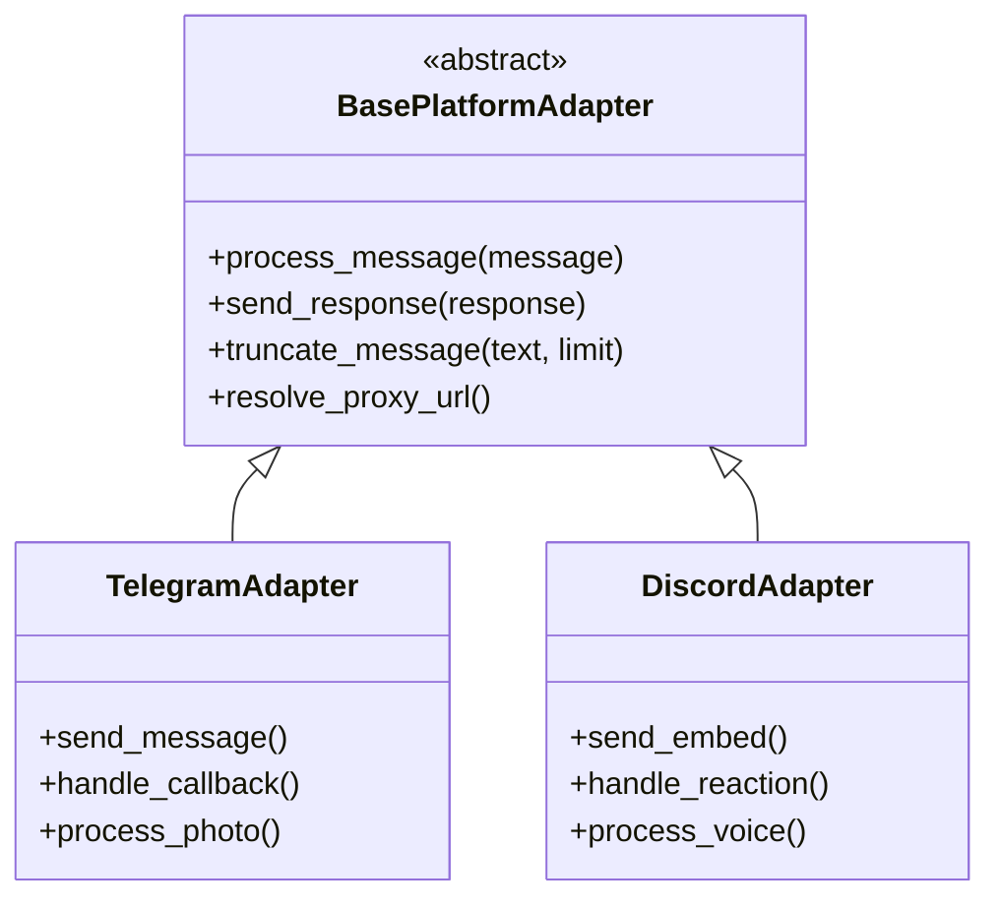
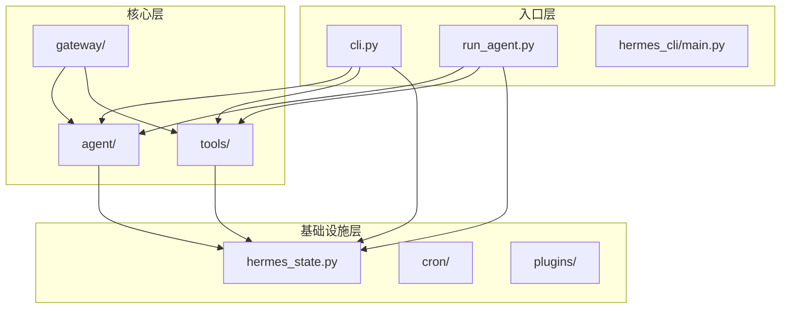

# 目录结构组织原则

<cite>
**本文档引用的文件**
- [README.md](file://README.md)
- [CONTRIBUTING.md](file://CONTRIBUTING.md)
- [pyproject.toml](file://pyproject.toml)
- [agent/__init__.py](file://agent/__init__.py)
- [gateway/__init__.py](file://gateway/__init__.py)
- [run_agent.py](file://run_agent.py)
- [cli.py](file://cli.py)
- [model_tools.py](file://model_tools.py)
- [toolsets.py](file://toolsets.py)
- [hermes_state.py](file://hermes_state.py)
- [gateway/config.py](file://gateway/config.py)
- [gateway/platforms/base.py](file://gateway/platforms/base.py)
- [hermes_cli/main.py](file://hermes_cli/main.py)
- [tools/registry.py](file://tools/registry.py)
</cite>

## 目录结构概述

Hermes Agent 采用清晰的分层设计理念，通过模块化组织策略实现高内聚、低耦合的代码结构。项目采用"功能域驱动"的目录组织方式，每个顶级目录都有明确的职责边界和清晰的边界定义。

## 核心分层架构

### 第一层：入口与运行时层
- **run_agent.py**: AI Agent 运行器，负责核心对话循环、工具调用执行和响应管理
- **cli.py**: 交互式命令行界面，提供终端用户界面和丰富的格式化输出
- **hermes_cli/main.py**: CLI 主入口点，处理命令解析和组件调度

### 第二层：核心功能层
- **agent/**: Agent 内部逻辑提取模块，包含提示词构建、上下文压缩、记忆管理等纯函数和自包含类
- **tools/**: 工具实现系统，采用自注册机制，所有工具文件在导入时自动注册到中央注册表
- **gateway/**: 消息网关系统，统一连接各种消息平台（Telegram、Discord、WhatsApp等）

### 第三层：基础设施层
- **cron/**: 定时任务调度系统
- **hermes_cli/**: CLI 命令实现，包括配置管理、设置向导、认证等
- **plugins/**: 插件系统，支持内存提供程序等扩展功能

## 顶级目录职责边界

### agent/ - Agent 核心逻辑
**职责范围**：封装所有 Agent 内部逻辑，包括提示词构建、上下文压缩、错误分类、记忆管理等
**设计原则**：从 3600 行的 run_agent.py 中提取纯函数和自包含类，使主运行器专注于编排
**关键组件**：
- 提示词构建器：构建系统提示词（身份、技能、上下文文件、记忆）
- 上下文压缩器：在接近上下文限制时进行自动摘要
- 记忆管理器：持久化会话历史和用户信息
- 错误分类器：对 API 错误进行分类和故障转移

### tools/ - 工具系统
**职责范围**：实现各类工具能力，支持终端操作、文件处理、网络搜索、视觉分析等
**设计模式**：自注册机制，每个工具文件在导入时自动调用 `registry.register()`
**核心特性**：
- 中央注册表：统一管理工具定义、处理器和元数据
- 工具集分组：按功能领域组织工具（web、terminal、file、browser 等）
- 异步桥接：为异步工具处理器提供统一的同步/异步调用接口

### gateway/ - 消息网关
**职责范围**：多平台消息集成，统一会话管理和交付路由
**设计特点**：
- 平台适配器：为不同消息平台提供统一接口
- 会话存储：持久化对话状态和重置策略
- 交付路由：将回复内容发送到正确的平台通道
- 配置管理：动态加载和验证各平台配置

### hermes_cli/ - CLI 实现
**职责范围**：命令行界面实现，包括交互式 TUI、命令解析、配置管理等
**功能模块**：
- 主入口点：处理 hermes 命令和参数
- 配置管理：加载和验证用户配置
- 设置向导：交互式安装和配置流程
- 技能管理：技能仓库的 CLI 接口

### cron/ - 定时任务系统
**职责范围**：基于自然语言的定时任务管理，支持跨平台交付
**核心功能**：
- 任务定义：使用自然语言描述定时任务
- 执行调度：基于 cron 表达式的任务执行
- 结果交付：将任务结果发送到指定平台

## 目录命名规范与最佳实践

### 命名约定
- **小写字母**：所有目录名使用小写，避免大小写混用
- **功能导向**：目录名反映功能领域而非技术实现细节
- **一致性**：保持命名风格在整个项目中的统一性

### 文件组织原则
- **单一职责**：每个模块只关注一个核心功能
- **自包含**：模块内部包含所有必要的依赖和配置
- **可测试性**：模块设计便于单元测试和集成测试

### 子目录嵌套层次
项目采用最多三层的嵌套结构：
1. **顶级目录**：功能域划分（agent、tools、gateway 等）
2. **二级目录**：平台或功能细分（gateway/platforms、tools/environments 等）
3. **三级目录**：具体实现或配置（gateway/platforms/telegram.py 等）

## 模块化组织策略

### 自注册工具系统
工具采用"自注册"模式，每个工具文件在导入时自动向中央注册表注册：

**图表来源**
- [model_tools.py:132-170](file://model_tools.py#L132-L170)
- [tools/registry.py:59-94](file://tools/registry.py#L59-L94)

### 工具集分组机制
工具集（toolsets）提供灵活的工具组合方式：
- **基础工具集**：web、terminal、file、vision 等独立功能
- **复合工具集**：browser（包含导航、截图、点击等多个子功能）
- **平台特定工具集**：messaging、homeassistant 等针对特定场景

### 平台适配器模式
消息网关采用适配器模式，为不同平台提供统一接口：

**图表来源**
- [gateway/platforms/base.py:1-200](file://gateway/platforms/base.py#L1-L200)

## 目录结构演进历史

### 早期架构（版本 0.1.0-0.3.0）
- 单一 run_agent.py 文件包含所有功能
- 缺乏模块化和分层设计
- 工具系统采用硬编码注册

### 模块化重构（版本 0.4.0-0.6.0）
- 从 run_agent.py 提取 agent/ 包，分离核心逻辑
- 引入 tools/ 工具系统和自注册机制
- 创建 hermes_cli/ 独立 CLI 实现

### 网关系统完善（版本 0.7.0-0.8.0）
- gateway/ 系统完全重构，支持多平台集成
- 工具集系统标准化，支持动态组合
- 插件系统引入，增强扩展性

## 未来扩展性考虑

### 可扩展的设计模式
- **插件架构**：plugins/ 目录支持第三方扩展
- **工具生态**：skills/ 和 optional-skills/ 支持社区贡献
- **平台扩展**：gateway/platforms/ 易于添加新平台

### 性能优化方向
- **异步化**：逐步将同步工具转换为异步实现
- **缓存机制**：增强工具结果缓存和模型响应缓存
- **并发控制**：优化多线程和异步任务的资源管理

### 安全加固
- **权限控制**：细化工具访问权限和执行沙箱
- **审计日志**：增强操作追踪和安全监控
- **依赖管理**：持续更新依赖包，修复已知漏洞

## 依赖关系分析

**图表来源**
- [run_agent.py:63-110](file://run_agent.py#L63-L110)
- [model_tools.py:29-31](file://model_tools.py#L29-L31)
- [hermes_state.py:32-91](file://hermes_state.py#L32-L91)

## 总结

Hermes Agent 的目录结构体现了成熟的软件工程实践，通过清晰的分层设计和模块化组织实现了高度的可维护性和扩展性。这种设计不仅满足了当前的功能需求，也为未来的功能扩展和技术演进奠定了坚实的基础。