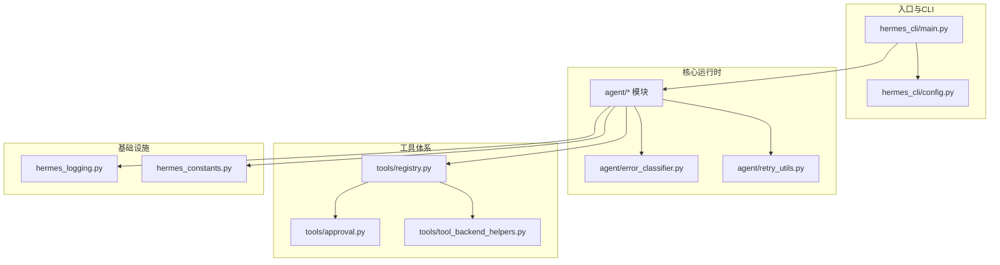
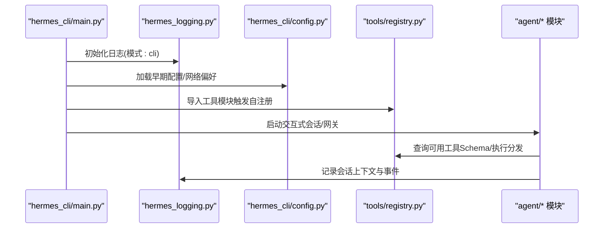
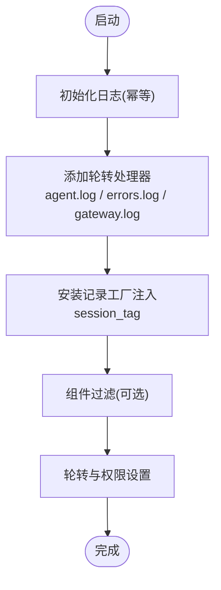
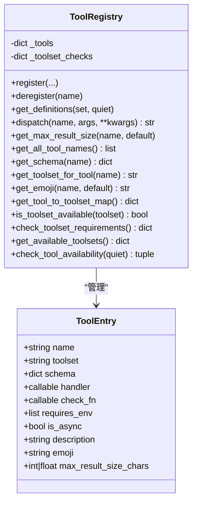
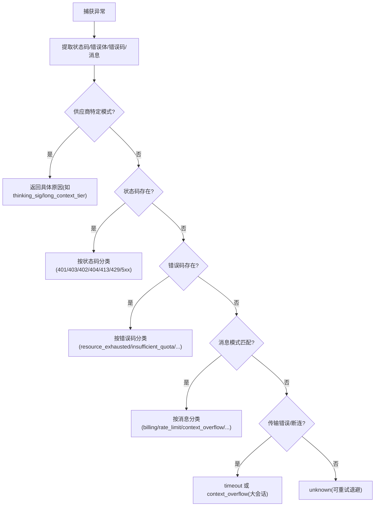
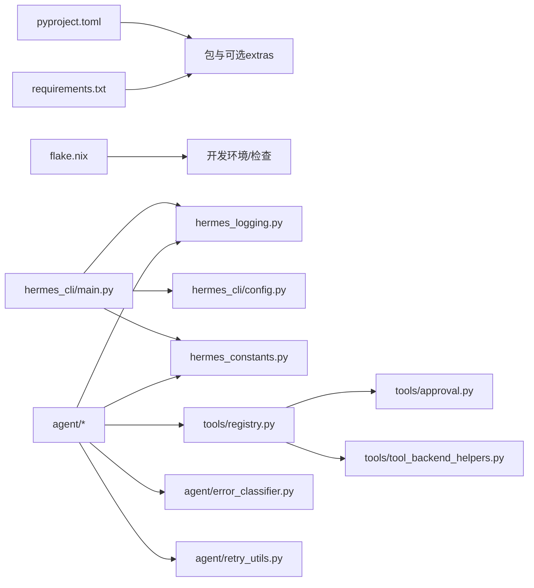

# 编码规范与约定

<cite>
**本文引用的文件**
- [CONTRIBUTING.md](file://CONTRIBUTING.md)
- [README.md](file://README.md)
- [pyproject.toml](file://pyproject.toml)
- [flake.nix](file://flake.nix)
- [requirements.txt](file://requirements.txt)
- [hermes_logging.py](file://hermes_logging.py)
- [hermes_constants.py](file://hermes_constants.py)
- [agent/__init__.py](file://agent/__init__.py)
- [tools/registry.py](file://tools/registry.py)
- [hermes_cli/main.py](file://hermes_cli/main.py)
- [tools/approval.py](file://tools/approval.py)
- [agent/retry_utils.py](file://agent/retry_utils.py)
- [hermes_cli/config.py](file://hermes_cli/config.py)
- [tools/tool_backend_helpers.py](file://tools/tool_backend_helpers.py)
- [agent/error_classifier.py](file://agent/error_classifier.py)
</cite>

## 目录
1. [简介](#简介)
2. [项目结构](#项目结构)
3. [核心组件](#核心组件)
4. [架构总览](#架构总览)
5. [详细组件分析](#详细组件分析)
6. [依赖关系分析](#依赖关系分析)
7. [性能考虑](#性能考虑)
8. [故障排查指南](#故障排查指南)
9. [结论](#结论)
10. [附录](#附录)

## 简介
本指南面向 Hermes Agent 项目的贡献者与维护者，系统性阐述项目的编码规范与约定，涵盖 Python 代码风格、模块导入规范、异常处理与日志记录、安全与跨平台兼容、工具注册与分发、重试与错误分类、以及代码审查与质量保障流程。文档同时给出工具链配置（格式化、静态分析、测试）与最佳实践建议，帮助团队在不同平台与环境下保持一致的工程实践。

## 项目结构
Hermes Agent 采用按功能域划分的模块化组织方式：核心运行时（agent）、命令行入口（hermes_cli）、工具体系（tools）、消息网关（gateway）、定时任务（cron）、适配器（acp_adapter）等。各子系统通过清晰的职责边界协作，配合统一的日志、常量与配置管理，形成可扩展、可维护的架构。

图表来源
- [hermes_cli/main.py](file://hermes_cli/main.py)
- [hermes_cli/config.py](file://hermes_cli/config.py)
- [agent/error_classifier.py](file://agent/error_classifier.py)
- [agent/retry_utils.py](file://agent/retry_utils.py)
- [tools/registry.py](file://tools/registry.py)
- [tools/approval.py](file://tools/approval.py)
- [tools/tool_backend_helpers.py](file://tools/tool_backend_helpers.py)
- [hermes_logging.py](file://hermes_logging.py)
- [hermes_constants.py](file://hermes_constants.py)

章节来源
- [README.md:114-182](file://README.md#L114-L182)

## 核心组件
- 日志系统：集中式日志初始化、会话上下文注入、组件路由、轮转与脱敏格式化。
- 常量与环境：统一的 HOME/路径解析、网络偏好（IPv4 优先）、平台检测（WSL/Docker）。
- 工具注册中心：自注册工具、Schema/Handler 统一管理、可用性检查、异步桥接与错误归一化。
- CLI 配置：默认配置、版本迁移、权限与文件安全、容器模式与托管模式支持。
- 安全与审批：危险命令检测、会话级审批状态、永久白名单、智能审批（辅助 LLM）。
- 错误分类与重试：HTTP 状态/错误码/消息多阶段分类，优先级策略，退避与回退。
- 运行时工具后端：Modal 后端选择、浏览器云服务提供商规范化、音频密钥回退。

章节来源
- [hermes_logging.py:161-266](file://hermes_logging.py#L161-L266)
- [hermes_constants.py:11-56](file://hermes_constants.py#L11-L56)
- [tools/registry.py:48-111](file://tools/registry.py#L48-L111)
- [hermes_cli/config.py:311-706](file://hermes_cli/config.py#L311-L706)
- [tools/approval.py:75-133](file://tools/approval.py#L75-L133)
- [agent/error_classifier.py:23-81](file://agent/error_classifier.py#L23-L81)
- [agent/retry_utils.py:19-57](file://agent/retry_utils.py#L19-L57)
- [tools/tool_backend_helpers.py:48-81](file://tools/tool_backend_helpers.py#L48-L81)

## 架构总览
下图展示了 CLI 启动、日志初始化、配置加载、工具注册与运行时主循环之间的交互关系。

图表来源
- [hermes_cli/main.py:140-165](file://hermes_cli/main.py#L140-L165)
- [hermes_logging.py:161-266](file://hermes_logging.py#L161-L266)
- [hermes_cli/config.py:311-706](file://hermes_cli/config.py#L311-L706)
- [tools/registry.py:116-143](file://tools/registry.py#L116-L143)

## 详细组件分析

### 日志系统（hermes_logging）
- 设计要点
  - 单点初始化、幂等调用、线程本地会话上下文注入。
  - 多文件轮转（agent.log、errors.log、gateway.log），组件过滤与脱敏格式化。
  - 可选控制台调试输出（verbose 模式）。
- 关键行为
  - 会话标记：每个记录注入 [session_id]，便于关联日志。
  - 组件路由：通过前缀过滤将网关事件定向到独立文件。
  - 权限与共享：受管模式下确保组可读写权限，便于服务与用户共享。
- 使用建议
  - 在模块顶部获取 logger 实例，避免重复创建。
  - 对敏感信息使用脱敏格式化器；不要直接打印密钥或令牌。
  - 在并发场景中依赖线程本地存储，避免竞态。

图表来源
- [hermes_logging.py:161-266](file://hermes_logging.py#L161-L266)

章节来源
- [hermes_logging.py:161-266](file://hermes_logging.py#L161-L266)

### 常量与环境（hermes_constants）
- 设计要点
  - 路径解析：HERMES_HOME、技能目录、日志目录、.env 文件等。
  - 平台检测：Termux、WSL、容器（Docker/Podman）。
  - 网络偏好：强制 IPv4 解析以规避 IPv6 延迟问题。
- 使用建议
  - 所有路径访问统一通过该模块，避免硬编码。
  - 在需要区分“受管模式”时，结合 is_managed 判断。

章节来源
- [hermes_constants.py:11-56](file://hermes_constants.py#L11-L56)
- [hermes_constants.py:253-293](file://hermes_constants.py#L253-L293)

### 工具注册中心（tools/registry）
- 设计要点
  - 自注册：工具文件在导入时调用 registry.register 注册。
  - Schema/Handler 统一：ToolEntry 封装名称、工具集、Schema、处理器、检查函数等。
  - 可用性检查：check_fn 与工具集检查，动态过滤不可用工具。
  - 异步桥接：dispatch 自动桥接异步处理器，统一返回 JSON 字符串。
  - 结果大小限制：按工具维度与全局预算控制结果大小。
- 使用建议
  - 工具 handler 必须返回 JSON 字符串；使用 tool_error/tool_result 辅助。
  - schema 中必须包含 name 字段，否则会被覆盖为 entry.name。
  - 工具集检查函数仅在首次注册时生效，后续 deregister 会清理。

图表来源
- [tools/registry.py:24-94](file://tools/registry.py#L24-L94)
- [tools/registry.py:116-143](file://tools/registry.py#L116-L143)
- [tools/registry.py:149-167](file://tools/registry.py#L149-L167)

章节来源
- [tools/registry.py:48-111](file://tools/registry.py#L48-L111)
- [tools/registry.py:116-143](file://tools/registry.py#L116-L143)
- [tools/registry.py:149-167](file://tools/registry.py#L149-L167)
- [tools/registry.py:172-181](file://tools/registry.py#L172-L181)
- [tools/registry.py:182-198](file://tools/registry.py#L182-L198)
- [tools/registry.py:195-204](file://tools/registry.py#L195-L204)
- [tools/registry.py:205-208](file://tools/registry.py#L205-L208)
- [tools/registry.py:209-223](file://tools/registry.py#L209-L223)
- [tools/registry.py:224-228](file://tools/registry.py#L224-L228)
- [tools/registry.py:229-247](file://tools/registry.py#L229-L247)
- [tools/registry.py:248-267](file://tools/registry.py#L248-L267)
- [tools/registry.py:268-287](file://tools/registry.py#L268-L287)
- [tools/registry.py:309-336](file://tools/registry.py#L309-L336)

### CLI 入口与配置（hermes_cli/main.py, hermes_cli/config.py）
- 设计要点
  - CLI 入口负责：TTY 校验、配置加载、日志初始化、IPv4 强制、容器模式、会话解析与命令分发。
  - 配置模块：默认配置字典、版本迁移、托管模式、容器元数据、安全权限设置、SOUL.md 初始化。
- 使用建议
  - 在 CLI 子命令中尽早调用 setup_logging，确保所有子流程日志一致。
  - 使用 DEFAULT_CONFIG 作为参考，新增字段时同步更新迁移逻辑与默认值。
  - 受管模式下避免直接修改权限，遵循包管理器约定。

章节来源
- [hermes_cli/main.py:53-68](file://hermes_cli/main.py#L53-L68)
- [hermes_cli/main.py:83-138](file://hermes_cli/main.py#L83-L138)
- [hermes_cli/main.py:140-165](file://hermes_cli/main.py#L140-L165)
- [hermes_cli/config.py:311-706](file://hermes_cli/config.py#L311-L706)
- [hermes_cli/config.py:265-305](file://hermes_cli/config.py#L265-L305)

### 安全与审批（tools/approval.py）
- 设计要点
  - 危险命令正则库：覆盖删除、权限变更、系统服务、脚本执行、Git 破坏性操作等。
  - 会话级审批：线程安全状态、永久允许列表、YOLO 模式、网关异步审批队列。
  - 智能审批：基于辅助 LLM 的风险评估，自动批准低风险命令。
- 使用建议
  - 新增危险模式时，同时维护描述键与历史正则键别名映射。
  - 永久允许列表保存到配置文件，避免在运行时直接打印敏感内容。
  - 网关与 CLI 的审批流程保持一致语义，确保一致性。

章节来源
- [tools/approval.py:75-133](file://tools/approval.py#L75-L133)
- [tools/approval.py:199-367](file://tools/approval.py#L199-L367)
- [tools/approval.py:531-581](file://tools/approval.py#L531-L581)
- [tools/approval.py:583-657](file://tools/approval.py#L583-L657)
- [tools/approval.py:690-791](file://tools/approval.py#L690-L791)

### 错误分类与重试（agent/error_classifier.py, agent/retry_utils.py）
- 设计要点
  - 错误分类：认证失败、账单/配额、速率限制、服务器过载、超时、上下文溢出、负载过大、模型不存在、请求格式错误、Anthropic 特定签名问题、长上下文分级门限等。
  - 分类管线：优先匹配供应商特定模式，再依据状态码/错误码/消息，最后回退到传输错误与大会话断连。
  - 重试策略：抖动退避（decorrelated jitter），防止“惊群效应”，并发安全计数器与锁。
- 使用建议
  - 在 API 调用失败时，先进行分类，再根据 should_compress/should_fallback/should_rotate_credential 决策。
  - 对于上下文溢出，优先压缩而非直接回退；对账单/配额错误，立即切换凭证或提供方。

图表来源
- [agent/error_classifier.py:222-396](file://agent/error_classifier.py#L222-L396)
- [agent/error_classifier.py:400-504](file://agent/error_classifier.py#L400-L504)
- [agent/error_classifier.py:536-609](file://agent/error_classifier.py#L536-L609)
- [agent/error_classifier.py:613-648](file://agent/error_classifier.py#L613-L648)
- [agent/error_classifier.py:653-740](file://agent/error_classifier.py#L653-L740)

章节来源
- [agent/error_classifier.py:23-81](file://agent/error_classifier.py#L23-L81)
- [agent/error_classifier.py:222-396](file://agent/error_classifier.py#L222-L396)
- [agent/retry_utils.py:19-57](file://agent/retry_utils.py#L19-L57)

### 工具后端与环境助手（tools/tool_backend_helpers.py）
- 设计要点
  - Modal 后端选择：auto/direct/managed 三种模式，按可用性与特性标志选择。
  - 浏览器云服务提供商规范化：统一默认与校验。
  - 音频 API 密钥回退：优先 voice-tools 密钥，其次常规 OpenAI 密钥。
- 使用建议
  - 在工具后端选择时，先解析用户请求模式，再结合可用性与托管能力做最终选择。
  - 对外部凭据进行显式存在性检查，避免空字符串导致的隐式降级。

章节来源
- [tools/tool_backend_helpers.py:48-81](file://tools/tool_backend_helpers.py#L48-L81)
- [tools/tool_backend_helpers.py:84-90](file://tools/tool_backend_helpers.py#L84-L90)

## 依赖关系分析
- 包管理与构建
  - pyproject.toml 定义核心依赖与可选 extras（messaging、cron、voice、acp、mcp、honcho 等）。
  - flake.nix 提供 Nix 开发环境与检查项。
  - requirements.txt 作为便捷安装的参考清单（以 pyproject.toml 为准）。
- 依赖耦合
  - hermes_logging 依赖 hermes_constants 获取路径与配置。
  - tools/registry 与 model_tools 通过导入链实现解耦（registry 无反向依赖）。
  - hermes_cli/main 依赖 hermes_logging、hermes_cli/config、hermes_constants。
  - agent/* 模块依赖 tools/registry 与 hermes_logging。

图表来源
- [pyproject.toml:1-129](file://pyproject.toml#L1-L129)
- [flake.nix:1-36](file://flake.nix#L1-L36)
- [requirements.txt:1-37](file://requirements.txt#L1-L37)
- [hermes_cli/main.py:140-165](file://hermes_cli/main.py#L140-L165)
- [hermes_logging.py:161-266](file://hermes_logging.py#L161-L266)
- [hermes_cli/config.py:311-706](file://hermes_cli/config.py#L311-L706)
- [hermes_constants.py:11-56](file://hermes_constants.py#L11-L56)
- [agent/error_classifier.py:222-396](file://agent/error_classifier.py#L222-L396)
- [agent/retry_utils.py:19-57](file://agent/retry_utils.py#L19-L57)
- [tools/registry.py:116-143](file://tools/registry.py#L116-L143)
- [tools/approval.py:583-657](file://tools/approval.py#L583-L657)
- [tools/tool_backend_helpers.py:48-81](file://tools/tool_backend_helpers.py#L48-L81)

章节来源
- [pyproject.toml:1-129](file://pyproject.toml#L1-L129)
- [flake.nix:1-36](file://flake.nix#L1-L36)
- [requirements.txt:1-37](file://requirements.txt#L1-L37)

## 性能考虑
- 抖动退避：避免固定指数退避引发的“惊群效应”，在高并发重试场景提升稳定性。
- 上下文压缩：接近上下文上限时自动压缩，减少昂贵的长上下文调用。
- 传输优化：IPv4 优先解析减少 DNS AAAA 查询阻塞；容器后端选择（managed/direct/auto）按可用性与性能权衡。
- 日志轮转：合理设置文件大小与备份数，避免磁盘膨胀影响 IO。

章节来源
- [agent/retry_utils.py:19-57](file://agent/retry_utils.py#L19-L57)
- [hermes_constants.py:253-293](file://hermes_constants.py#L253-L293)
- [tools/tool_backend_helpers.py:48-81](file://tools/tool_backend_helpers.py#L48-L81)
- [hermes_logging.py:224-255](file://hermes_logging.py#L224-L255)

## 故障排查指南
- 日志定位
  - 使用会话上下文标记快速关联对话期间的日志。
  - 在 verbose 模式下查看更详细的控制台日志。
- 审批与安全
  - 若出现审批阻塞，检查网关通知回调是否正确注册与清理。
  - 永久允许列表保存失败时，确认配置文件权限与写入权限。
- 错误分类
  - 对于 402/429/413/5xx 等，优先根据分类结果采取压缩、回退或凭证轮换。
  - 大会话断连优先判定为上下文溢出，避免误判为超时。
- 配置与路径
  - 确认 HERMES_HOME 与子目录权限；受管模式下遵循包管理器约定。
  - 检查 .env 与 config.yaml 的加载顺序与覆盖关系。

章节来源
- [hermes_logging.py:72-89](file://hermes_logging.py#L72-L89)
- [tools/approval.py:228-280](file://tools/approval.py#L228-L280)
- [tools/approval.py:373-400](file://tools/approval.py#L373-L400)
- [agent/error_classifier.py:371-396](file://agent/error_classifier.py#L371-L396)
- [hermes_cli/config.py:215-254](file://hermes_cli/config.py#L215-L254)

## 结论
Hermes Agent 的编码规范围绕“统一入口、模块自治、强安全、可观测性与可维护性”展开。通过集中式日志、严格的工具注册与分发、完善的错误分类与重试策略、以及明确的安全与跨平台约束，项目在复杂多平台与多供应商环境下实现了稳定与可扩展。建议在新功能开发中严格遵循本文档的约定，并在代码审查中重点关注安全性、可移植性与一致性。

## 附录

### Python 代码风格与约定
- 命名约定
  - 模块与包：小写下划线（如 hermes_cli、tools.registry）。
  - 类：PascalCase（如 ToolRegistry、ClassifiedError）。
  - 函数与变量：小写下划线（如 set_session_context、get_tools_dir）。
  - 常量：全大写（如 MAX_SIZE_MB、DEFAULT_CONFIG）。
- 缩进与排版
  - 统一使用 4 空格缩进；避免尾随空白。
  - 行宽不强制，但应保持可读性；复杂表达分行书写。
- 注释与文档
  - 仅在解释非显而易见的意图、权衡或 API 特性时添加注释。
  - 模块与公共接口需提供简要 docstring。
- 异常处理
  - 捕获具体异常类型；记录警告/错误日志并保留堆栈信息。
  - 对工具执行异常进行统一 JSON 化返回，避免泄露内部细节。
- 导入规范
  - 标准库优先，第三方次之，项目内模块再次之。
  - 避免循环导入；必要时延迟导入（如 _add_rotating_handler 中的延迟导入）。
- 跨平台兼容
  - 不假设 Unix 环境；对 termios/fcntl、路径分隔符、进程信号等差异进行条件处理。
  - 使用 pathlib 替代字符串拼接路径。

章节来源
- [CONTRIBUTING.md:230-236](file://CONTRIBUTING.md#L230-L236)
- [hermes_logging.py:336-372](file://hermes_logging.py#L336-L372)
- [tools/registry.py:149-167](file://tools/registry.py#L149-L167)

### 工具注册与分发最佳实践
- 工具 schema 必须包含 name 字段；handler 返回 JSON 字符串。
- 使用 tool_error/tool_result 统一错误与结果格式。
- check_fn 应轻量且幂等，避免网络或外部资源抖动。
- 异步工具通过 is_async 标记，由调度层自动桥接。

章节来源
- [tools/registry.py:309-336](file://tools/registry.py#L309-L336)
- [tools/registry.py:149-167](file://tools/registry.py#L149-L167)

### 日志记录标准
- 使用 setup_logging 初始化日志，mode 参数区分 CLI/Gateway/Cron。
- 会话上下文通过 set_session_context/clear_session_context 管理。
- 脱敏格式化器用于避免敏感信息落盘；组件过滤器将网关事件分离到独立文件。

章节来源
- [hermes_logging.py:161-266](file://hermes_logging.py#L161-L266)

### 安全与审批
- 危险命令检测基于正则集合；新增模式需同时维护描述键与历史键别名。
- 永久允许列表保存到配置文件；审批回调需处理异常并降级为拒绝。
- 智能审批通过辅助 LLM 进行风险评估，低风险自动批准并授予会话级豁免。

章节来源
- [tools/approval.py:75-133](file://tools/approval.py#L75-L133)
- [tools/approval.py:373-400](file://tools/approval.py#L373-L400)
- [tools/approval.py:531-581](file://tools/approval.py#L531-L581)

### 代码审查与质量保障
- 分支命名：fix/feat/docs/test/refactor/description。
- 提交信息：遵循 Conventional Commits 规范，包含类型、范围与描述。
- 测试：pytest 默认测试路径 tests/；集成测试通过标记隔离。
- 质量门禁：建议在 CI 中启用静态检查与格式化校验（如 ruff/black/isort）。

章节来源
- [CONTRIBUTING.md:584-637](file://CONTRIBUTING.md#L584-L637)
- [pyproject.toml:123-129](file://pyproject.toml#L123-L129)