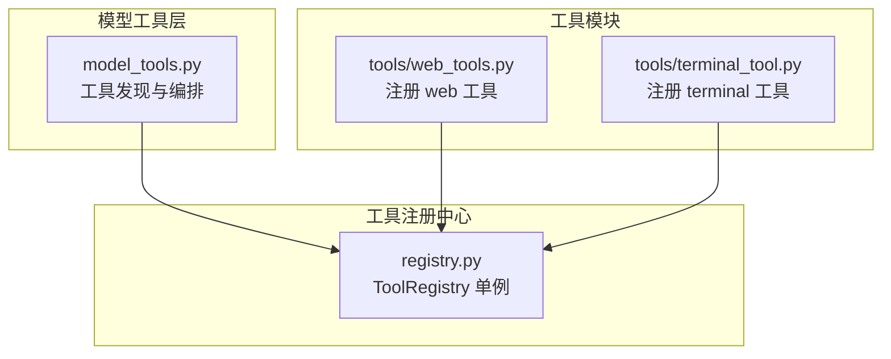
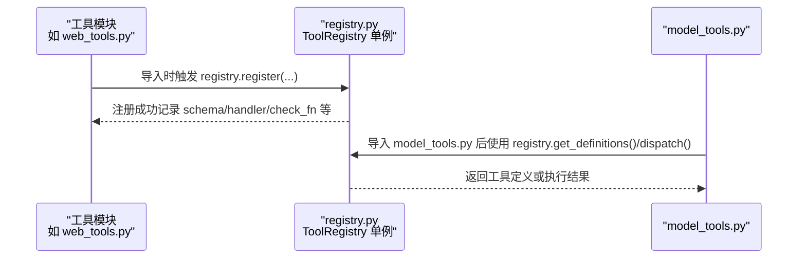
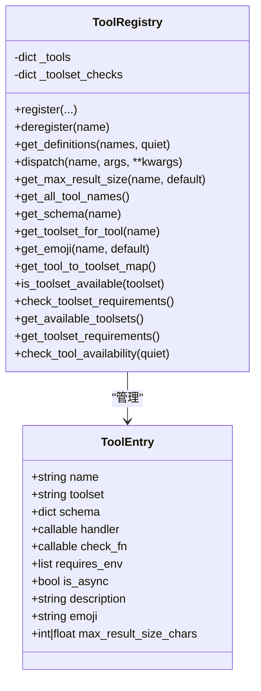
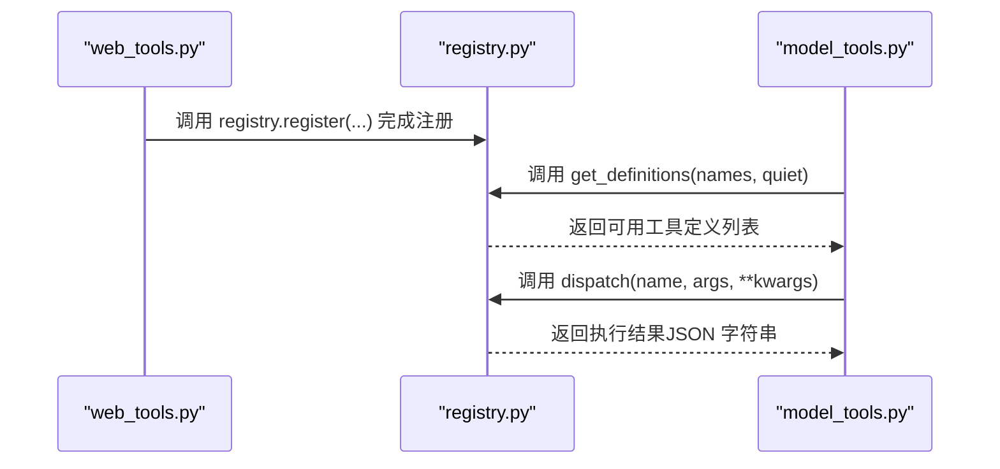
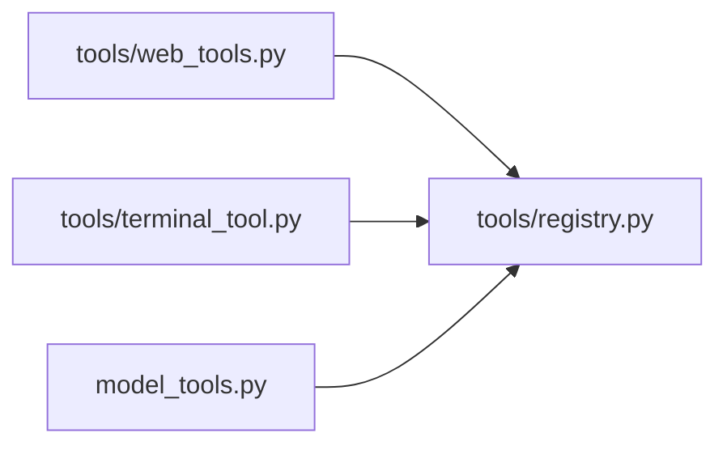

# 单例模式应用

<cite>
**本文档引用的文件**
- [tools/registry.py](file://tools/registry.py)
- [model_tools.py](file://model_tools.py)
- [tools/web_tools.py](file://tools/web_tools.py)
- [tools/terminal_tool.py](file://tools/terminal_tool.py)
</cite>

## 目录
1. [引言](#引言)
2. [项目结构](#项目结构)
3. [核心组件](#核心组件)
4. [架构总览](#架构总览)
5. [详细组件分析](#详细组件分析)
6. [依赖分析](#依赖分析)
7. [性能考虑](#性能考虑)
8. [故障排除指南](#故障排除指南)
9. [结论](#结论)

## 引言
本文件聚焦于 Hermes Agent 中工具注册中心的单例模式实现与应用，重点解析 tools/registry.py 中的 ToolRegistry 单例及其在系统中的作用。该单例通过模块级实例确保全局唯一性，避免重复实例化带来的资源浪费与状态不一致问题；同时统一管理所有工具的元数据、可用性检查与分发逻辑，为上层模型工具层（model_tools.py）与各具体工具模块提供稳定、可复用的中央枢纽。

## 项目结构
围绕工具注册中心的关键文件与职责如下：
- tools/registry.py：定义 ToolRegistry 类与模块级单例 registry，并提供注册、查询、分发等核心能力。
- model_tools.py：导入 registry 并作为工具发现与调用的编排层，构建后向兼容常量与工具集信息。
- tools/web_tools.py、tools/terminal_tool.py 等工具模块：在模块导入时通过 registry.register 完成自身工具的注册。

图表来源
- [tools/registry.py:289-291](file://tools/registry.py#L289-L291)
- [model_tools.py:29](file://model_tools.py#L29)
- [tools/web_tools.py:2082-2104](file://tools/web_tools.py#L2082-L2104)
- [tools/terminal_tool.py:1769-1778](file://tools/terminal_tool.py#L1769-L1778)

章节来源
- [tools/registry.py:1-336](file://tools/registry.py#L1-L336)
- [model_tools.py:1-200](file://model_tools.py#L1-L200)
- [tools/web_tools.py:2045-2104](file://tools/web_tools.py#L2045-L2104)
- [tools/terminal_tool.py:1706-1778](file://tools/terminal_tool.py#L1706-L1778)

## 核心组件
- ToolRegistry 单例（registry）：负责收集工具的 schema、处理器、可用性检查函数、所属工具集等元数据；提供工具查询、分发执行、工具集可用性检查、工具集元信息汇总等功能。
- 模块级单例（registry = ToolRegistry()）：在模块初始化时创建，保证全局唯一；所有工具模块在导入时通过 import 触发注册，形成“自举式”的工具发现与注册流程。
- 模型工具层（model_tools.py）：集中触发工具模块导入以完成注册，随后基于 registry 提供的工具定义与工具集信息对外暴露统一 API。

章节来源
- [tools/registry.py:48-287](file://tools/registry.py#L48-L287)
- [tools/registry.py:289-291](file://tools/registry.py#L289-L291)
- [model_tools.py:128-178](file://model_tools.py#L128-L178)

## 架构总览
下图展示了从工具模块导入到工具被注册、再到模型工具层消费的完整链路，体现了模块级单例在其中的核心地位与作用。

图表来源
- [tools/web_tools.py:2082-2104](file://tools/web_tools.py#L2082-L2104)
- [tools/terminal_tool.py:1769-1778](file://tools/terminal_tool.py#L1769-L1778)
- [model_tools.py:128-178](file://model_tools.py#L128-L178)

## 详细组件分析

### ToolRegistry 类与模块级单例
- 设计要点
  - 使用 __slots__ 优化内存占用，存储工具名称到 ToolEntry 的映射及工具集检查函数映射。
  - 在 __init__ 中初始化内部字典，避免在类级别直接持有可变状态。
  - 通过模块级实例 registry 实现全局唯一性，所有工具模块共享同一实例。
- 关键方法
  - register/deregister：注册/注销工具，支持工具名冲突告警与工具集检查函数去重。
  - get_definitions/dispatch：按需生成工具定义（含可用性过滤）与执行工具处理器（自动桥接异步）。
  - 查询辅助：按工具名获取最大结果长度、原始 schema、工具集、表情符号等。
  - 工具集可用性：对工具集检查函数进行异常安全处理，避免因外部依赖失败导致崩溃。
- 线程安全
  - 单例本身未显式加锁；但其内部状态仅通过受控接口修改，且在模块导入阶段完成注册，运行期读写分离，整体满足常见并发场景需求。若需要更强一致性，可在关键路径增加锁保护。

图表来源
- [tools/registry.py:24-46](file://tools/registry.py#L24-L46)
- [tools/registry.py:48-287](file://tools/registry.py#L48-L287)

章节来源
- [tools/registry.py:24-46](file://tools/registry.py#L24-L46)
- [tools/registry.py:48-94](file://tools/registry.py#L48-L94)
- [tools/registry.py:116-167](file://tools/registry.py#L116-L167)
- [tools/registry.py:172-287](file://tools/registry.py#L172-L287)
- [tools/registry.py:289-291](file://tools/registry.py#L289-L291)

### 工具模块注册流程（以 web_tools 为例）
- 导入阶段触发注册：工具模块在末尾通过 registry.register 将自身工具注册到单例中，附带 schema、处理器、可用性检查函数与环境变量要求等元数据。
- 可用性过滤：模型工具层在生成工具定义时会调用 registry.get_definitions，内部对 check_fn 进行缓存与异常安全处理，确保只返回可用工具。
- 执行分发：当需要执行某个工具时，模型工具层调用 registry.dispatch，内部根据 is_async 自动桥接至同步执行，捕获异常并统一序列化错误。

图表来源
- [tools/web_tools.py:2082-2104](file://tools/web_tools.py#L2082-L2104)
- [tools/registry.py:116-167](file://tools/registry.py#L116-L167)
- [model_tools.py:128-178](file://model_tools.py#L128-L178)

章节来源
- [tools/web_tools.py:2082-2104](file://tools/web_tools.py#L2082-L2104)
- [tools/registry.py:116-167](file://tools/registry.py#L116-L167)
- [model_tools.py:128-178](file://model_tools.py#L128-L178)

### 工具模块注册流程（以 terminal_tool 为例）
- 与 web_tools 类似，终端工具模块在末尾通过 registry.register 完成注册，声明工具 schema、处理器与可用性检查函数。
- 模型工具层通过 registry 提供的工具集信息与工具定义，统一对外暴露工具能力。

章节来源
- [tools/terminal_tool.py:1769-1778](file://tools/terminal_tool.py#L1769-L1778)
- [model_tools.py:128-178](file://model_tools.py#L128-L178)

### 单例模式在工具注册中心的优势
- 避免重复实例化：模块级单例确保全局仅有一个 ToolRegistry 实例，消除重复初始化成本与潜在的资源竞争。
- 统一资源管理：所有工具的元数据、可用性检查与分发逻辑集中在单例内，便于统一维护与扩展。
- 全局状态维护：工具注册、可用性检查与工具集映射等状态由单例统一持有，保证跨模块访问的一致性。
- 循环导入安全：注册中心不依赖模型工具层或其他工具模块，工具模块导入注册中心，模型工具层再导入注册中心，形成稳定的导入链路。

章节来源
- [tools/registry.py:7-15](file://tools/registry.py#L7-L15)
- [model_tools.py:128-178](file://model_tools.py#L128-L178)

### 单例模式在多线程环境下的安全性考虑
- 现状分析：ToolRegistry 内部状态通过受控接口修改，且在模块导入阶段完成注册，运行期主要为读操作，天然具备较好的并发友好性。
- 建议增强：若存在高并发写入（如动态工具卸载/重装），可在关键路径（如 register/deregister）增加细粒度锁，以避免竞态条件。
- 异步桥接：registry.dispatch 对异步处理器的自动桥接，配合 model_tools 的事件循环管理，进一步降低并发场景下的资源泄漏与循环关闭风险。

章节来源
- [tools/registry.py:95-111](file://tools/registry.py#L95-L111)
- [tools/registry.py:149-167](file://tools/registry.py#L149-L167)
- [model_tools.py:39-126](file://model_tools.py#L39-L126)

### 最佳实践与潜在风险
- 最佳实践
  - 将单例初始化放在模块级，避免在函数内重复创建实例。
  - 保持单例内部状态的不可变性或通过受控接口修改，减少竞态。
  - 在高并发场景下，对写路径加锁，读路径尽量无锁或使用原子操作。
  - 明确单例职责边界，避免过度耦合。
- 潜在风险
  - 动态工具卸载/重装可能引发工具集检查函数缺失或状态不一致。
  - 工具处理器抛出异常时需统一序列化，防止上层处理分支混乱。
  - 外部依赖（网络、配置）变化可能导致工具集可用性波动，应做好降级与日志记录。

章节来源
- [tools/registry.py:95-111](file://tools/registry.py#L95-L111)
- [tools/registry.py:132-139](file://tools/registry.py#L132-L139)
- [tools/registry.py:214-222](file://tools/registry.py#L214-L222)

### 在 Hermes Agent 中的实际应用场景
- 工具发现与编排：模型工具层通过导入工具模块完成注册，随后基于 registry 提供的工具定义与工具集信息对外暴露统一 API。
- 工具可用性控制：通过工具集检查函数与环境变量要求，动态判断工具集是否可用，并在 UI 层展示工具集元信息。
- 工具执行与错误处理：统一的分发器负责执行工具处理器，自动桥接异步调用并捕获异常，保证输出格式一致。

章节来源
- [model_tools.py:128-178](file://model_tools.py#L128-L178)
- [tools/registry.py:229-287](file://tools/registry.py#L229-L287)
- [tools/registry.py:149-167](file://tools/registry.py#L149-L167)

## 依赖分析
- 工具模块依赖关系：各工具模块在导入时触发注册，不反向依赖模型工具层，避免循环导入。
- 模型工具层依赖关系：model_tools.py 导入 registry 并触发工具模块导入，形成“先注册、后消费”的顺序。
- 单例依赖关系：registry 作为全局唯一入口，被模型工具层与工具模块共同依赖。

图表来源
- [tools/web_tools.py:2082-2104](file://tools/web_tools.py#L2082-L2104)
- [tools/terminal_tool.py:1769-1778](file://tools/terminal_tool.py#L1769-L1778)
- [model_tools.py:128-178](file://model_tools.py#L128-L178)

章节来源
- [tools/web_tools.py:2082-2104](file://tools/web_tools.py#L2082-L2104)
- [tools/terminal_tool.py:1769-1778](file://tools/terminal_tool.py#L1769-L1778)
- [model_tools.py:128-178](file://model_tools.py#L128-L178)

## 性能考虑
- 内存优化：ToolEntry 使用 __slots__ 减少内存占用；registry 内部字典按需查询，避免冗余结构。
- 计算优化：工具可用性检查结果在一次查询周期内缓存，减少重复调用开销。
- I/O 优化：工具处理器的异常统一序列化，避免上层重复处理与格式不一致造成的额外开销。
- 异步桥接：registry.dispatch 对异步处理器的自动桥接，结合 model_tools 的事件循环管理，降低资源泄漏与循环关闭风险。

章节来源
- [tools/registry.py:27-46](file://tools/registry.py#L27-L46)
- [tools/registry.py:123-139](file://tools/registry.py#L123-L139)
- [tools/registry.py:149-167](file://tools/registry.py#L149-L167)
- [model_tools.py:39-126](file://model_tools.py#L39-L126)

## 故障排除指南
- 工具名冲突：当不同工具集注册同名工具时，会记录警告并以后注册者为准。可通过检查工具注册位置与工具集命名避免冲突。
- 工具不可用：工具可用性检查失败时会被过滤，建议检查环境变量与外部依赖配置。
- 异常处理：工具执行异常会被统一捕获并序列化为 JSON 错误字符串，便于上层统一处理。
- 工具集可用性：工具集检查函数异常会被安全处理并标记为不可用，建议在工具集检查函数中做好健壮性与降级策略。

章节来源
- [tools/registry.py:73-80](file://tools/registry.py#L73-L80)
- [tools/registry.py:128-139](file://tools/registry.py#L128-L139)
- [tools/registry.py:164-167](file://tools/registry.py#L164-L167)
- [tools/registry.py:218-222](file://tools/registry.py#L218-L222)

## 结论
Hermes Agent 通过模块级 ToolRegistry 单例实现了工具注册中心的全局唯一性与统一管理，有效避免了重复实例化与状态不一致问题。该设计在工具发现、可用性控制与执行分发方面提供了清晰的职责边界与稳定的接口契约，适合在多线程与异步环境下运行。为进一步提升可靠性，建议在高并发写路径增加细粒度锁，并持续完善工具集检查函数的健壮性与降级策略。