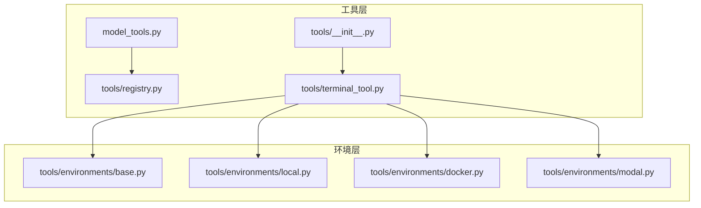
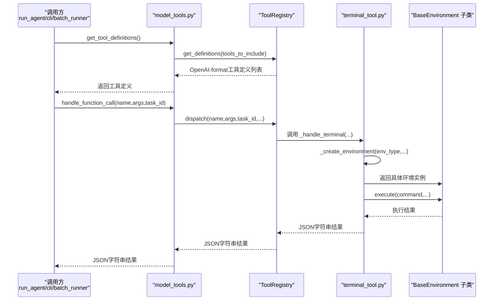
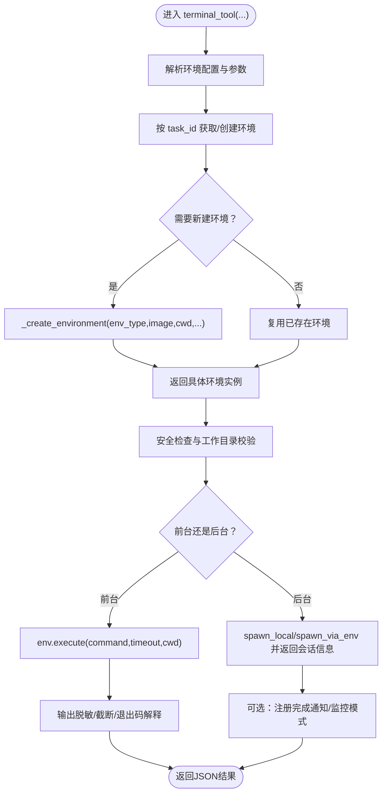
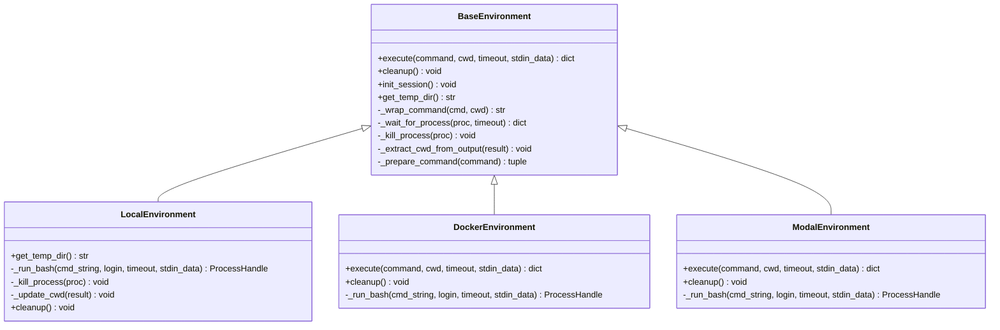
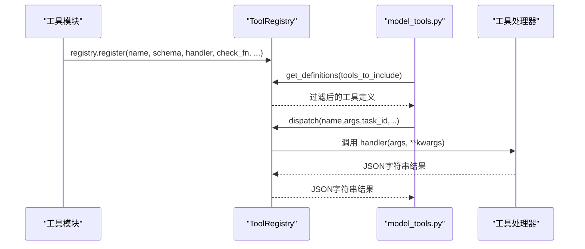
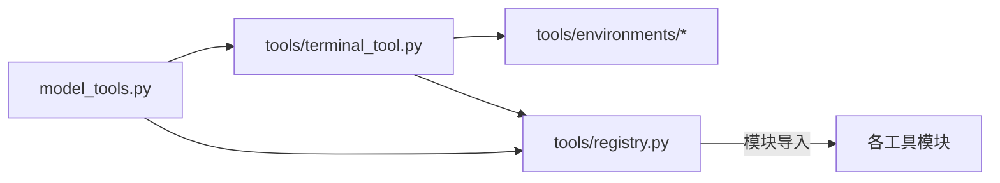

# 工厂模式应用

<cite>
**本文引用的文件**
- [tools/terminal_tool.py](file://tools/terminal_tool.py)
- [model_tools.py](file://model_tools.py)
- [tools/registry.py](file://tools/registry.py)
- [tools/environments/base.py](file://tools/environments/base.py)
- [tools/environments/local.py](file://tools/environments/local.py)
- [tools/environments/docker.py](file://tools/environments/docker.py)
- [tools/environments/modal.py](file://tools/environments/modal.py)
- [tools/__init__.py](file://tools/__init__.py)
</cite>

## 目录
1. [引言](#引言)
2. [项目结构](#项目结构)
3. [核心组件](#核心组件)
4. [架构总览](#架构总览)
5. [详细组件分析](#详细组件分析)
6. [依赖分析](#依赖分析)
7. [性能考量](#性能考量)
8. [故障排查指南](#故障排查指南)
9. [结论](#结论)

## 引言
本文件系统性阐述 Hermes Agent 中工厂模式的应用，重点围绕 tools/terminal_tool.py 的终端工具创建机制与 model_tools.py 的工具注册/分发体系，解释如何通过统一的工厂接口实现工具实例化与动态配置，并总结其设计优势、扩展性与性能影响。同时给出关键流程图与时序图，帮助读者快速把握工厂模式在该系统中的落地方式。

## 项目结构
- 工具注册与分发：model_tools.py 负责导入工具模块、构建工具定义、分发函数调用；工具模块在导入时向 tools/registry.py 注册自身。
- 终端工具工厂：tools/terminal_tool.py 提供统一入口 terminal_tool(...)，内部根据环境变量与任务标识选择具体执行后端（本地、Docker、Modal 等），并复用/缓存环境实例。
- 环境抽象与工厂：tools/environments/base.py 定义统一接口 BaseEnvironment，各后端（local、docker、modal 等）继承实现；_create_environment(...) 即为“环境工厂”，按 env_type 返回对应环境实例。
- 工具注册表：tools/registry.py 维护 ToolRegistry 单例，集中管理工具 schema、处理器、可用性检查等。

图表来源
- [model_tools.py:132-170](file://model_tools.py#L132-L170)
- [tools/terminal_tool.py:690-817](file://tools/terminal_tool.py#L690-L817)
- [tools/environments/base.py:226-580](file://tools/environments/base.py#L226-L580)
- [tools/environments/local.py:216-315](file://tools/environments/local.py#L216-L315)
- [tools/environments/docker.py:101-200](file://tools/environments/docker.py#L101-L200)
- [tools/environments/modal.py:147-200](file://tools/environments/modal.py#L147-L200)

章节来源
- [model_tools.py:132-170](file://model_tools.py#L132-L170)
- [tools/terminal_tool.py:690-817](file://tools/terminal_tool.py#L690-L817)
- [tools/environments/base.py:226-580](file://tools/environments/base.py#L226-L580)

## 核心组件
- 工具注册中心：tools/registry.py 的 ToolRegistry 单例，负责注册工具、查询 schema、分发执行、可用性检查。
- 工具定义与分发：model_tools.py 导入工具模块触发注册，提供 get_tool_definitions 与 handle_function_call，后者委托 registry.dispatch。
- 终端工具工厂：tools/terminal_tool.py 的 _create_environment(...) 根据 env_type 返回具体环境实例；terminal_tool(...) 是对外统一入口。
- 环境抽象工厂：tools/environments/base.py 的 BaseEnvironment 抽象类，子类实现 _run_bash()/cleanup()，形成“环境工厂”的子类族。

章节来源
- [tools/registry.py:48-290](file://tools/registry.py#L48-L290)
- [model_tools.py:234-548](file://model_tools.py#L234-L548)
- [tools/terminal_tool.py:690-817](file://tools/terminal_tool.py#L690-L817)
- [tools/environments/base.py:226-580](file://tools/environments/base.py#L226-L580)

## 架构总览
下图展示了工具注册、发现与分发的整体流程，以及终端工具工厂在其中的位置。

图表来源
- [model_tools.py:234-548](file://model_tools.py#L234-L548)
- [tools/registry.py:149-167](file://tools/registry.py#L149-L167)
- [tools/terminal_tool.py:1133-1556](file://tools/terminal_tool.py#L1133-L1556)

## 详细组件分析

### 终端工具工厂：_create_environment 与 terminal_tool
- 统一入口：terminal_tool(...) 接收命令参数、后台运行、超时、工作目录、PTY 等选项，内部解析环境配置、任务隔离、安全检查与工作目录校验，再决定是否复用或新建环境。
- 环境工厂：_create_environment(...) 根据 env_type 返回具体环境实例，支持 local、docker、singularity、modal、daytona、ssh 六种类型。该函数即为“环境工厂”。
- 环境复用与生命周期：通过全局字典与锁维护活动环境，按任务 ID 复用；后台清理线程周期回收空闲环境；支持手动清理与进程级退出清理。
- 安全与合规：内置危险命令检测、sudo 处理、输出脱敏、退出码语义解释、输出截断等。

图表来源
- [tools/terminal_tool.py:1133-1556](file://tools/terminal_tool.py#L1133-L1556)
- [tools/terminal_tool.py:690-817](file://tools/terminal_tool.py#L690-L817)

章节来源
- [tools/terminal_tool.py:690-817](file://tools/terminal_tool.py#L690-L817)
- [tools/terminal_tool.py:1133-1556](file://tools/terminal_tool.py#L1133-L1556)

### 环境抽象与工厂子类
- 抽象基类：tools/environments/base.py 的 BaseEnvironment 定义统一接口（execute、cleanup、init_session 等），并提供会话快照、CWD 同步、中断处理、超时等待等通用逻辑。
- 子类实现：
  - LocalEnvironment：本地直接执行，使用 bash -c，支持会话快照与临时目录隔离。
  - DockerEnvironment：基于 Docker CLI，封装资源限制、卷挂载、环境变量转发等。
  - ModalEnvironment：基于 Modal SDK 的 Sandbox，支持快照恢复与异步工作线程。
- 工厂方法：_create_environment(...) 即为“环境工厂”，依据 env_type 分派到具体子类构造器。

图表来源
- [tools/environments/base.py:226-580](file://tools/environments/base.py#L226-L580)
- [tools/environments/local.py:216-315](file://tools/environments/local.py#L216-L315)
- [tools/environments/docker.py:101-200](file://tools/environments/docker.py#L101-L200)
- [tools/environments/modal.py:147-200](file://tools/environments/modal.py#L147-L200)

章节来源
- [tools/environments/base.py:226-580](file://tools/environments/base.py#L226-L580)
- [tools/environments/local.py:216-315](file://tools/environments/local.py#L216-L315)
- [tools/environments/docker.py:101-200](file://tools/environments/docker.py#L101-L200)
- [tools/environments/modal.py:147-200](file://tools/environments/modal.py#L147-L200)

### 工具注册与分发：registry 与 model_tools
- 注册：每个工具模块在导入时调用 registry.register(...)，登记 schema、处理器、可用性检查、emoji、最大结果大小等元数据。
- 发现：model_tools.py 导入工具模块触发注册；随后提供 get_tool_definitions 与 handle_function_call。
- 分发：handle_function_call 内部先做参数类型强制转换，再调用 registry.dispatch，后者根据名称查找 ToolEntry 并执行 handler，必要时桥接异步。

图表来源
- [tools/registry.py:59-167](file://tools/registry.py#L59-L167)
- [model_tools.py:234-548](file://model_tools.py#L234-L548)

章节来源
- [tools/registry.py:59-167](file://tools/registry.py#L59-L167)
- [model_tools.py:234-548](file://model_tools.py#L234-L548)

### 模型工具创建中的工厂应用
- 统一接口：model_tools.py 通过 get_tool_definitions 与 handle_function_call 提供统一的工具创建与调用接口，屏蔽底层工具差异。
- 动态配置：工具模块在导入时注册自身，model_tools 在运行期进行可用性检查与过滤，最终生成面向模型的工具定义。
- 类型安全与参数整形：coerce_tool_args 将 LLM 返回的字符串参数按 schema 强制转换为期望类型，减少错误调用风险。

章节来源
- [model_tools.py:234-548](file://model_tools.py#L234-L548)

## 依赖分析
- 组件耦合：
  - tools/terminal_tool.py 依赖 tools/environments/* 与 tools/registry.py，但通过模块导入与延迟加载降低耦合。
  - model_tools.py 仅依赖 tools/registry.py 与工具模块的导入副作用，避免直接依赖具体工具实现。
- 可能的循环依赖：
  - tools/registry.py 不依赖 model_tools 或具体工具模块，避免循环导入。
- 外部依赖：
  - Docker/Modal 等后端依赖外部 SDK/CLI，工厂方法在导入时按需加载，失败时优雅降级或报错。

图表来源
- [model_tools.py:132-170](file://model_tools.py#L132-L170)
- [tools/terminal_tool.py:690-817](file://tools/terminal_tool.py#L690-L817)
- [tools/registry.py:17-290](file://tools/registry.py#L17-L290)

章节来源
- [model_tools.py:132-170](file://model_tools.py#L132-L170)
- [tools/registry.py:17-290](file://tools/registry.py#L17-L290)

## 性能考量
- 环境复用与并发：
  - 通过 per-task 锁与全局锁控制环境创建，避免重复创建资源浪费；后台清理线程周期回收空闲环境，防止资源泄漏。
- I/O 与阻塞：
  - 环境基类统一等待逻辑与中断处理，避免长时间阻塞；Modal/Docker 等后端的 teardown 可能较慢，清理在独立线程执行以避免阻塞主流程。
- 输出与内存：
  - 对超长输出进行截断与 ANSI 去除，减少模型侧负担；敏感信息脱敏，避免泄露。
- 参数整形：
  - 在分发前进行参数类型整形，减少无效调用与异常开销。

[本节为通用性能讨论，不直接分析具体文件]

## 故障排查指南
- 环境不可用：
  - 检查环境变量（如 TERMINAL_ENV、TERMINAL_DOCKER_IMAGE 等）与后端依赖（Docker/Modal 可用性）。
  - 使用 tools/terminal_tool.py 的 check_terminal_requirements 与 tools/__init__.py 的 check_file_requirements 快速验证。
- 超时与中断：
  - 前台命令超时返回特定退出码；中断信号会触发 kill 并返回中断提示。
- 资源清理：
  - 使用 cleanup_all_environments/cleanup_vm 手动清理；注意清理可能涉及外部后端的停止操作，耗时较长属正常。

章节来源
- [tools/terminal_tool.py:1558-1599](file://tools/terminal_tool.py#L1558-L1599)
- [tools/__init__.py:18-25](file://tools/__init__.py#L18-L25)

## 结论
Hermes Agent 通过“工具注册 + 工具分发 + 环境工厂”的组合，实现了工具创建与执行的解耦与扩展。tools/terminal_tool.py 的 _create_environment(...) 作为环境工厂，统一了多种执行后端的实例化过程；model_tools.py 则提供了面向模型的统一工具接口。该设计提升了系统的可维护性、可扩展性与安全性，同时通过环境复用与后台清理优化了性能表现。