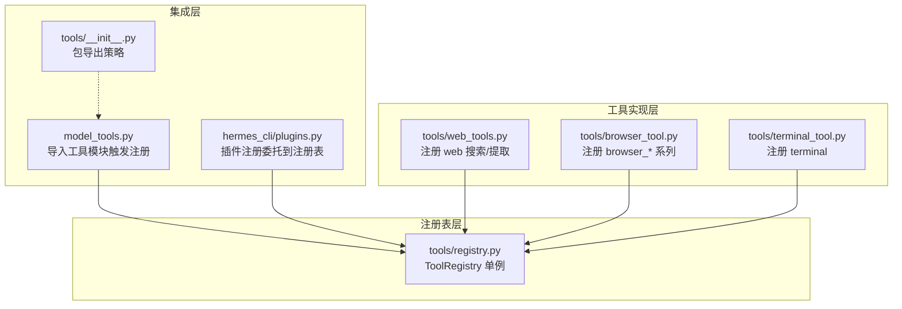
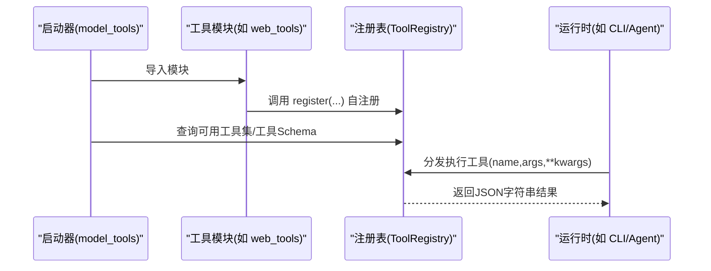
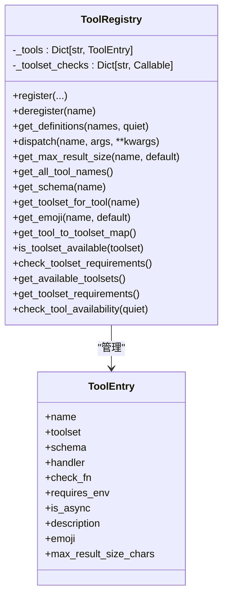
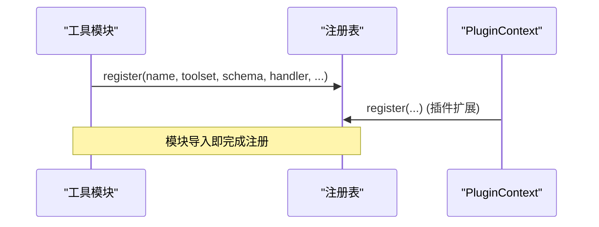
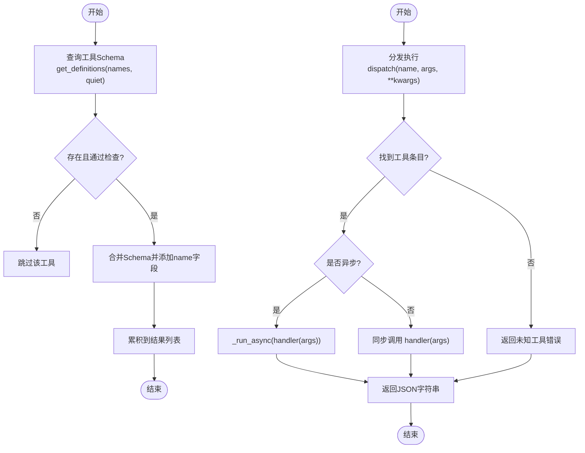
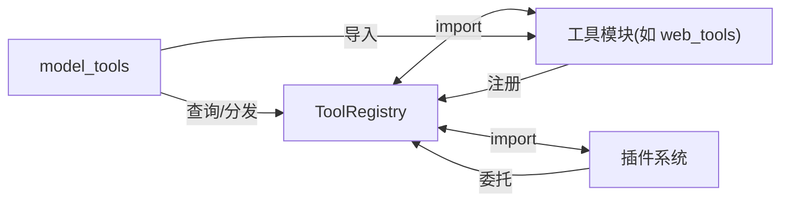

# 注册表模式应用

<cite>
**本文引用的文件**
- [tools/registry.py](file://tools/registry.py)
- [model_tools.py](file://model_tools.py)
- [tools/web_tools.py](file://tools/web_tools.py)
- [tools/browser_tool.py](file://tools/browser_tool.py)
- [tools/terminal_tool.py](file://tools/terminal_tool.py)
- [hermes_cli/plugins.py](file://hermes_cli/plugins.py)
- [tools/__init__.py](file://tools/__init__.py)
</cite>

## 目录
1. [简介](#简介)
2. [项目结构](#项目结构)
3. [核心组件](#核心组件)
4. [架构总览](#架构总览)
5. [详细组件分析](#详细组件分析)
6. [依赖分析](#依赖分析)
7. [性能考量](#性能考量)
8. [故障排查指南](#故障排查指南)
9. [结论](#结论)
10. [附录](#附录)

## 简介
本文件聚焦于 Hermes Agent 中“注册表模式”的应用与实践，围绕 tools/registry.py 的工具注册表实现展开，系统阐述其自注册机制、工具自动发现与集中管理能力，并结合实际工具（如浏览器、终端、网页检索）的注册示例，说明注册表如何支撑工具的注册、查询、调度与动态加载/卸载。同时给出设计原则、性能优化建议与维护策略，帮助读者在不直接阅读代码的情况下也能高效理解与使用该模式。

## 项目结构
本节从“注册表模式”视角梳理与之相关的模块与职责边界：
- 注册表核心：tools/registry.py 提供单例注册表、工具条目元数据、可用性检查、分发执行等能力
- 工具发现与集成：model_tools.py 在启动时导入各工具模块，触发模块级注册调用
- 工具实现与注册：tools/web_tools.py、tools/browser_tool.py、tools/terminal_tool.py 等在模块末尾完成工具注册
- 插件扩展：hermes_cli/plugins.py 将插件定义的工具委托给注册表统一管理
- 包导出策略：tools/__init__.py 保持包导入副作用最小化，避免在配置初始化阶段加载全量工具栈

图表来源
- [tools/registry.py:1-336](file://tools/registry.py#L1-L336)
- [model_tools.py:128-185](file://model_tools.py#L128-L185)
- [tools/web_tools.py:2082-2104](file://tools/web_tools.py#L2082-L2104)
- [tools/browser_tool.py:2306-2388](file://tools/browser_tool.py#L2306-L2388)
- [tools/terminal_tool.py:1769-1778](file://tools/terminal_tool.py#L1769-L1778)
- [hermes_cli/plugins.py:133-161](file://hermes_cli/plugins.py#L133-L161)
- [tools/__init__.py:1-26](file://tools/__init__.py#L1-L26)

章节来源
- [tools/registry.py:1-336](file://tools/registry.py#L1-L336)
- [model_tools.py:128-185](file://model_tools.py#L128-L185)
- [tools/web_tools.py:2082-2104](file://tools/web_tools.py#L2082-L2104)
- [tools/browser_tool.py:2306-2388](file://tools/browser_tool.py#L2306-L2388)
- [tools/terminal_tool.py:1769-1778](file://tools/terminal_tool.py#L1769-L1778)
- [hermes_cli/plugins.py:133-161](file://hermes_cli/plugins.py#L133-L161)
- [tools/__init__.py:1-26](file://tools/__init__.py#L1-L26)

## 核心组件
- 工具条目 ToolEntry：封装单个工具的名称、所属工具集、Schema、处理器、可用性检查函数、环境变量要求、是否异步、描述、表情符号、最大结果长度等元信息
- 注册表 ToolRegistry：单例，负责工具注册、反注册、Schema 获取、工具分发、可用性检查、工具集元数据聚合等
- 工具注册辅助：registry.register(...) 与工具侧的 registry.register(...) 调用；工具错误/结果序列化辅助函数 tool_error/tool_result
- 工具发现与桥接：model_tools._discover_tools() 导入各工具模块以触发注册；_run_async() 统一处理同步/异步工具调用

章节来源
- [tools/registry.py:24-94](file://tools/registry.py#L24-L94)
- [tools/registry.py:48-287](file://tools/registry.py#L48-L287)
- [tools/registry.py:309-336](file://tools/registry.py#L309-L336)
- [model_tools.py:132-185](file://model_tools.py#L132-L185)
- [model_tools.py:81-126](file://model_tools.py#L81-L126)

## 架构总览
注册表模式在 Hermes Agent 中形成如下闭环：
- 工具模块在导入时调用 registry.register(...) 完成自注册
- model_tools 在启动阶段批量导入工具模块，触发所有工具注册
- 上层运行时（如 run_agent、CLI、网关）通过 registry 查询可用工具、生成模型调用所需的 Schema、分发执行工具
- 插件系统通过 PluginContext.register_tool(...) 委托注册表，实现动态扩展

图表来源
- [model_tools.py:132-185](file://model_tools.py#L132-L185)
- [tools/web_tools.py:2082-2104](file://tools/web_tools.py#L2082-L2104)
- [tools/browser_tool.py:2306-2388](file://tools/browser_tool.py#L2306-L2388)
- [tools/terminal_tool.py:1769-1778](file://tools/terminal_tool.py#L1769-L1778)
- [tools/registry.py:59-94](file://tools/registry.py#L59-L94)
- [tools/registry.py:149-167](file://tools/registry.py#L149-L167)

## 详细组件分析

### 注册表类与工具条目
- ToolEntry：以固定槽位存储工具元信息，确保内存占用可控、字段访问稳定
- ToolRegistry：
  - 注册/反注册：支持同名覆盖警告、按工具集清理工具集检查函数
  - Schema 获取：按工具名集合返回 OpenAI 格式函数定义，支持检查函数过滤
  - 调度执行：统一封装异常捕获与异步桥接
  - 可用性与工具集：提供工具集可用性检查、工具集元数据聚合、环境变量要求汇总
  - 辅助查询：工具名列表、Schema 查询、工具集映射、Emoji 查询、最大结果长度查询

图表来源
- [tools/registry.py:24-94](file://tools/registry.py#L24-L94)
- [tools/registry.py:48-287](file://tools/registry.py#L48-L287)

章节来源
- [tools/registry.py:24-94](file://tools/registry.py#L24-L94)
- [tools/registry.py:48-287](file://tools/registry.py#L48-L287)

### 工具注册与自注册机制
- 工具模块在末尾调用 registry.register(...) 完成自注册，传入名称、工具集、Schema、处理器、可选的检查函数、环境变量要求、是否异步、描述、表情符号、最大结果长度等
- model_tools._discover_tools() 批量导入工具模块，触发每个模块的自注册逻辑
- 插件通过 PluginContext.register_tool(...) 委托注册表，实现与内置工具一致的生命周期与查询接口

图表来源
- [tools/web_tools.py:2082-2104](file://tools/web_tools.py#L2082-L2104)
- [tools/browser_tool.py:2306-2388](file://tools/browser_tool.py#L2306-L2388)
- [tools/terminal_tool.py:1769-1778](file://tools/terminal_tool.py#L1769-L1778)
- [hermes_cli/plugins.py:133-161](file://hermes_cli/plugins.py#L133-L161)

章节来源
- [tools/web_tools.py:2082-2104](file://tools/web_tools.py#L2082-L2104)
- [tools/browser_tool.py:2306-2388](file://tools/browser_tool.py#L2306-L2388)
- [tools/terminal_tool.py:1769-1778](file://tools/terminal_tool.py#L1769-L1778)
- [hermes_cli/plugins.py:133-161](file://hermes_cli/plugins.py#L133-L161)

### 工具查询与调度流程
- 查询 Schema：根据工具名集合与检查函数过滤，生成 OpenAI 函数定义数组
- 调度执行：根据 is_async 标记选择同步或异步路径，统一异常捕获并返回 JSON 字符串
- 异步桥接：_run_async() 在不同线程/事件循环上下文中复用持久事件循环，避免“事件循环已关闭”问题

图表来源
- [tools/registry.py:116-143](file://tools/registry.py#L116-L143)
- [tools/registry.py:149-167](file://tools/registry.py#L149-L167)
- [model_tools.py:81-126](file://model_tools.py#L81-L126)

章节来源
- [tools/registry.py:116-143](file://tools/registry.py#L116-L143)
- [tools/registry.py:149-167](file://tools/registry.py#L149-L167)
- [model_tools.py:81-126](file://model_tools.py#L81-L126)

### 工具集可用性与环境变量要求
- is_toolset_available(toolset)：对工具集检查函数进行安全调用，异常时视为不可用
- get_available_toolsets()/get_toolset_requirements()：聚合工具集元数据，包含可用性、工具清单、环境变量要求
- check_tool_availability(quiet)：返回可用与不可用工具集及其关联工具与环境变量

章节来源
- [tools/registry.py:209-287](file://tools/registry.py#L209-L287)

### 工具注册、查询与调用的完整示例（步骤说明）
以下为基于仓库现有实现的“步骤化”示例，不展示具体代码内容：
- 步骤1：工具模块在末尾调用注册表注册工具（名称、工具集、Schema、处理器、可选检查函数、环境变量要求、是否异步、表情符号、最大结果长度）
  - 示例参考：[tools/web_tools.py:2082-2104](file://tools/web_tools.py#L2082-L2104)
  - 示例参考：[tools/browser_tool.py:2306-2388](file://tools/browser_tool.py#L2306-L2388)
  - 示例参考：[tools/terminal_tool.py:1769-1778](file://tools/terminal_tool.py#L1769-L1778)
- 步骤2：启动时由 model_tools 导入工具模块，触发模块级注册
  - 参考：[model_tools.py:132-185](file://model_tools.py#L132-L185)
- 步骤3：运行时通过注册表查询可用工具 Schema 或直接分发执行
  - 查询 Schema：[tools/registry.py:116-143](file://tools/registry.py#L116-L143)
  - 分发执行：[tools/registry.py:149-167](file://tools/registry.py#L149-L167)
- 步骤4：插件可通过 PluginContext.register_tool(...) 动态扩展工具集
  - 参考：[hermes_cli/plugins.py:133-161](file://hermes_cli/plugins.py#L133-L161)

章节来源
- [tools/web_tools.py:2082-2104](file://tools/web_tools.py#L2082-L2104)
- [tools/browser_tool.py:2306-2388](file://tools/browser_tool.py#L2306-L2388)
- [tools/terminal_tool.py:1769-1778](file://tools/terminal_tool.py#L1769-L1778)
- [model_tools.py:132-185](file://model_tools.py#L132-L185)
- [tools/registry.py:116-143](file://tools/registry.py#L116-L143)
- [tools/registry.py:149-167](file://tools/registry.py#L149-L167)
- [hermes_cli/plugins.py:133-161](file://hermes_cli/plugins.py#L133-L161)

### 动态加载与卸载（MCP 与插件）
- 动态卸载：deregister(name) 支持在 MCP 通知后进行“清空再重建”，当工具集内最后一个工具被移除时，清理对应工具集检查函数
- 插件动态扩展：PluginContext.register_tool(...) 委托注册表，实现与内置工具一致的查询与调度体验
- 包导出策略：tools/__init__.py 避免在配置初始化阶段加载全量工具，降低启动时的导入成本

章节来源
- [tools/registry.py:95-111](file://tools/registry.py#L95-L111)
- [hermes_cli/plugins.py:133-161](file://hermes_cli/plugins.py#L133-L161)
- [tools/__init__.py:1-26](file://tools/__init__.py#L1-L26)

## 依赖分析
- 注册表与工具模块的耦合度低：工具模块仅在导入时调用注册表，不直接依赖上层运行时
- 运行时通过 model_tools 统一发现与集成：避免分散的工具清单维护
- 插件系统与内置工具共享同一注册表接口，保证一致性

图表来源
- [tools/registry.py:29-29](file://tools/registry.py#L29-L29)
- [model_tools.py:132-185](file://model_tools.py#L132-L185)
- [hermes_cli/plugins.py:146-158](file://hermes_cli/plugins.py#L146-L158)

章节来源
- [tools/registry.py:29-29](file://tools/registry.py#L29-L29)
- [model_tools.py:132-185](file://model_tools.py#L132-L185)
- [hermes_cli/plugins.py:146-158](file://hermes_cli/plugins.py#L146-L158)

## 性能考量
- 事件循环复用：_run_async() 在 CLI 主线程与工作线程分别维护持久事件循环，避免频繁创建/销毁导致的客户端失效与 GC 异常
- 检查函数缓存：get_definitions 对检查函数结果进行缓存，减少重复调用开销
- 惰性导入：tools/__init__.py 控制包导入副作用，避免在配置初始化阶段加载全量工具
- 结果大小限制：通过工具级 max_result_size_chars 与全局默认值控制输出大小，防止超大响应影响吞吐

章节来源
- [model_tools.py:81-126](file://model_tools.py#L81-L126)
- [tools/registry.py:116-143](file://tools/registry.py#L116-L143)
- [tools/__init__.py:1-26](file://tools/__init__.py#L1-L26)
- [tools/registry.py:172-180](file://tools/registry.py#L172-L180)

## 故障排查指南
- 工具未出现或不可用
  - 检查工具模块是否被导入（确认 model_tools._discover_tools() 是否包含该模块）
  - 检查工具的 check_fn 是否抛出异常或返回 False
  - 使用 is_toolset_available(toolset) 与 check_tool_availability(quiet) 排查工具集可用性
  - 参考：[model_tools.py:132-185](file://model_tools.py#L132-L185)，[tools/registry.py:209-287](file://tools/registry.py#L209-L287)
- 工具调用失败
  - 查看 dispatch 返回的 JSON 错误字符串，定位异常类型与消息
  - 若为异步工具，确认 _run_async() 执行路径正确
  - 参考：[tools/registry.py:149-167](file://tools/registry.py#L149-L167)，[model_tools.py:81-126](file://model_tools.py#L81-L126)
- 插件工具未生效
  - 确认 PluginContext.register_tool(...) 已被调用并记录到插件管理器
  - 参考：[hermes_cli/plugins.py:133-161](file://hermes_cli/plugins.py#L133-L161)

章节来源
- [model_tools.py:132-185](file://model_tools.py#L132-L185)
- [tools/registry.py:149-167](file://tools/registry.py#L149-L167)
- [tools/registry.py:209-287](file://tools/registry.py#L209-L287)
- [hermes_cli/plugins.py:133-161](file://hermes_cli/plugins.py#L133-L161)

## 结论
注册表模式在 Hermes Agent 中实现了工具的“零样板、强约束、可扩展”管理：工具模块通过自注册简化了接入成本，运行时通过统一查询与分发获得一致体验，插件系统则通过委托注册表实现动态扩展。配合事件循环复用、检查函数缓存与惰性导入等优化，整体在可维护性与性能之间取得良好平衡。对于新工具与插件开发者而言，遵循“注册表 + 工具 Schema + 处理器 + 可选检查函数”的约定即可快速融入系统生态。

## 附录
- 设计原则
  - 单一职责：注册表只负责工具元数据与生命周期管理
  - 最小暴露：工具模块仅在导入时注册，不暴露运行时细节
  - 一致性：插件与内置工具共享同一注册表接口
  - 可观测性：日志与错误格式统一，便于排障
- 维护策略
  - 新增工具：在工具模块末尾调用 registry.register(...)，确保 Schema 与处理器完备
  - 工具集变更：通过 check_fn 与 requires_env 明确环境要求，避免静默失败
  - 插件扩展：使用 PluginContext.register_tool(...)，并在插件清单中标注提供工具
  - 版本演进：保持注册表 API 稳定，逐步引入更强的校验与可观测性