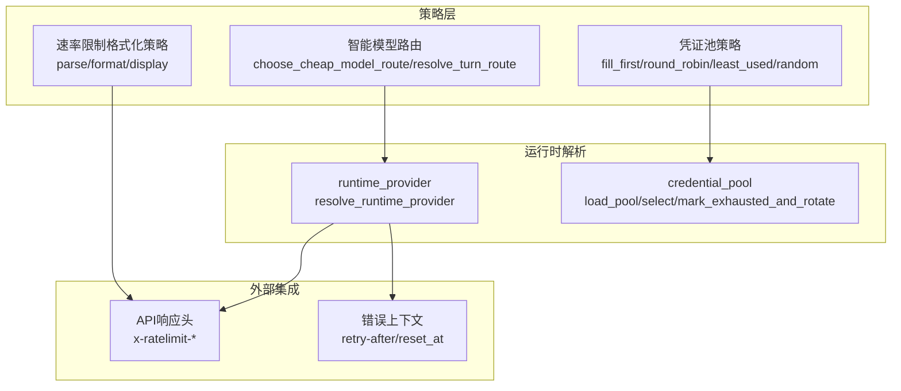
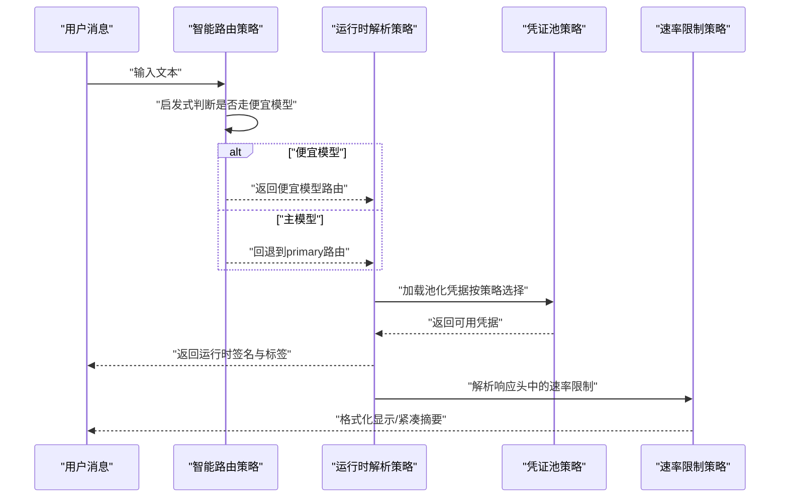
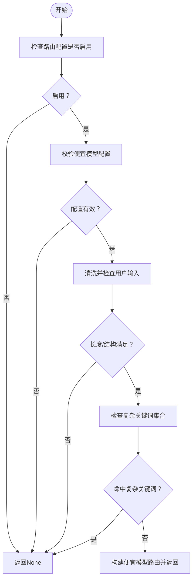
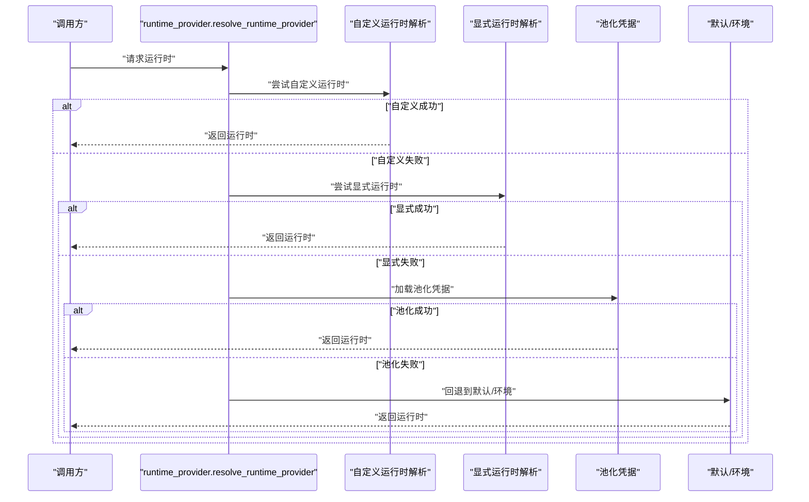
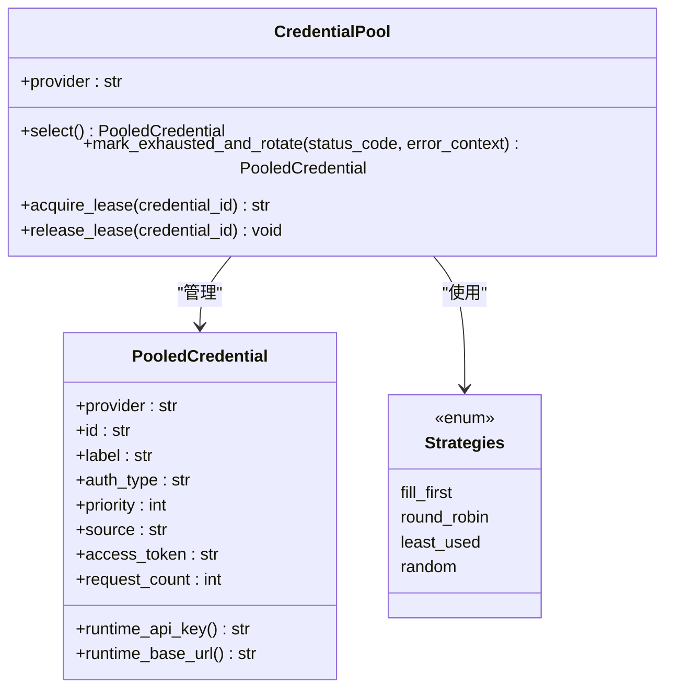
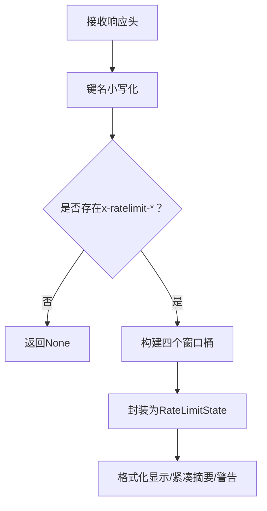
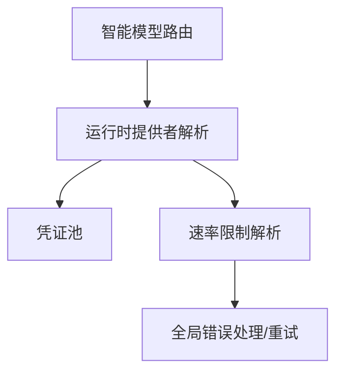

# 策略模式应用

<cite>
**本文档引用的文件**
- [agent/smart_model_routing.py](file://agent/smart_model_routing.py)
- [agent/rate_limit_tracker.py](file://agent/rate_limit_tracker.py)
- [hermes_cli/runtime_provider.py](file://hermes_cli/runtime_provider.py)
- [agent/credential_pool.py](file://agent/credential_pool.py)
- [tests/agent/test_smart_model_routing.py](file://tests/agent/test_smart_model_routing.py)
- [tests/agent/test_rate_limit_tracker.py](file://tests/agent/test_rate_limit_tracker.py)
- [tests/hermes_cli/test_runtime_provider_resolution.py](file://tests/hermes_cli/test_runtime_provider_resolution.py)
- [run_agent.py](file://run_agent.py)
- [gateway/platforms/feishu.py](file://gateway/platforms/feishu.py)
</cite>

## 目录
1. [简介](#简介)
2. [项目结构](#项目结构)
3. [核心组件](#核心组件)
4. [架构总览](#架构总览)
5. [详细组件分析](#详细组件分析)
6. [依赖分析](#依赖分析)
7. [性能考虑](#性能考虑)
8. [故障排除指南](#故障排除指南)
9. [结论](#结论)

## 简介
本文件聚焦于Hermes Agent中策略模式的应用，围绕以下目标展开：
- 深入解析智能模型路由策略（agent/smart_model_routing.py）如何通过“简单请求走便宜模型、复杂请求走主模型”的策略实现动态选择与切换。
- 展示策略模式在速率限制跟踪中的落地：以数据类承载不同窗口（分钟/小时）的令牌与请求数量，形成可扩展的状态模型与格式化输出策略。
- 提供策略接口定义、具体策略实现与选择逻辑的示例路径，并结合凭证池策略（轮询、最少使用、随机等）说明策略模式在多维度资源管理中的扩展性。
- 分析策略模式带来的可维护性与可扩展性优势，并给出性能优化与最佳实践建议。

## 项目结构
Hermes Agent采用分层与模块化的组织方式，策略模式主要体现在以下模块：
- 智能模型路由：根据用户输入特征选择“便宜模型”或回退到“主模型”，并解析运行时配置。
- 运行时提供者解析：统一解析不同提供商的认证与端点信息，支持自定义与池化策略。
- 凭证池：对同一提供商的多个凭据进行轮询、最少使用、随机等策略管理，实现高可用与负载均衡。
- 速率限制跟踪：解析与格式化速率限制头，形成统一的显示策略。

**图表来源**
- [agent/smart_model_routing.py:62-196](file://agent/smart_model_routing.py#L62-L196)
- [hermes_cli/runtime_provider.py:595-839](file://hermes_cli/runtime_provider.py#L595-L839)
- [agent/credential_pool.py:358-881](file://agent/credential_pool.py#L358-L881)
- [agent/rate_limit_tracker.py:92-247](file://agent/rate_limit_tracker.py#L92-L247)

**章节来源**
- [agent/smart_model_routing.py:1-196](file://agent/smart_model_routing.py#L1-L196)
- [hermes_cli/runtime_provider.py:1-839](file://hermes_cli/runtime_provider.py#L1-L839)
- [agent/credential_pool.py:1-1357](file://agent/credential_pool.py#L1-L1357)
- [agent/rate_limit_tracker.py:1-247](file://agent/rate_limit_tracker.py#L1-L247)

## 核心组件
- 智能模型路由策略
  - 接口：`choose_cheap_model_route(user_message, routing_config)` 返回“便宜模型”路由或None；`resolve_turn_route(user_message, routing_config, primary)` 返回最终运行时签名。
  - 选择逻辑：基于长度、换行数、代码块标记、URL、复杂关键词集合等启发式规则判断是否走便宜模型。
  - 回退机制：若无法解析便宜模型或运行时解析失败，则回退到primary配置。
- 运行时提供者解析策略
  - 统一入口：`resolve_runtime_provider(requested, explicit_api_key, explicit_base_url)`，按优先级解析自定义、显式、池化、环境变量与默认配置。
  - 多提供商适配：OpenRouter、Anthropic、Nous、Copilot等，自动推断api_mode与base_url。
- 凭证池策略
  - 策略枚举：fill_first、round_robin、least_used、random。
  - 选择算法：根据可用性、请求计数、轮转优先级与随机性选择下一个凭据。
  - 异常处理：当某凭据耗尽时，记录状态并旋转到下一个可用凭据。
- 速率限制跟踪策略
  - 数据模型：RateLimitBucket（单个窗口）、RateLimitState（完整状态）。
  - 解析策略：从响应头提取限额、剩余、重置时间，构建状态对象。
  - 显示策略：人类可读格式化、紧凑摘要、警告阈值提示。

**章节来源**
- [agent/smart_model_routing.py:62-196](file://agent/smart_model_routing.py#L62-L196)
- [hermes_cli/runtime_provider.py:595-839](file://hermes_cli/runtime_provider.py#L595-L839)
- [agent/credential_pool.py:339-881](file://agent/credential_pool.py#L339-L881)
- [agent/rate_limit_tracker.py:30-247](file://agent/rate_limit_tracker.py#L30-L247)

## 架构总览
下图展示了策略模式在系统中的交互关系：智能路由策略决定模型选择，运行时解析策略负责凭据与端点解析，凭证池策略保障多凭据场景下的高可用，速率限制策略提供可观测性与告警。

**图表来源**
- [agent/smart_model_routing.py:110-196](file://agent/smart_model_routing.py#L110-L196)
- [hermes_cli/runtime_provider.py:595-839](file://hermes_cli/runtime_provider.py#L595-L839)
- [agent/credential_pool.py:823-881](file://agent/credential_pool.py#L823-L881)
- [agent/rate_limit_tracker.py:92-247](file://agent/rate_limit_tracker.py#L92-L247)

## 详细组件分析

### 智能模型路由策略
- 策略接口与实现
  - `choose_cheap_model_route`：基于启发式规则判断是否返回便宜模型路由。
  - `resolve_turn_route`：整合路由结果与运行时解析，生成最终运行时签名与标签。
- 选择逻辑
  - 长度与结构约束：字符数、单词数、换行数、代码块与URL检测。
  - 关键词过滤：复杂任务关键词集合命中则拒绝便宜模型。
  - 回退：运行时解析异常或不可用时，回退到primary配置。
- 测试验证
  - 单元测试覆盖启用开关、简单短语路由、长句与代码/工具关键词拒绝、运行时解析失败回退等场景。

**图表来源**
- [agent/smart_model_routing.py:62-107](file://agent/smart_model_routing.py#L62-L107)

**章节来源**
- [agent/smart_model_routing.py:62-196](file://agent/smart_model_routing.py#L62-L196)
- [tests/agent/test_smart_model_routing.py:1-62](file://tests/agent/test_smart_model_routing.py#L1-L62)

### 运行时提供者解析策略
- 统一解析流程
  - 自定义运行时优先：命名自定义提供商与模型配置。
  - 显式运行时：显式API Key与Base URL覆盖。
  - 池化策略：OpenRouter以外的提供商优先使用池化凭据。
  - 环境与默认：按环境变量与默认配置回退。
- 多提供商适配
  - OpenRouter：优先使用OPENROUTER_API_KEY，支持自定义端点与模型别名。
  - Anthropic：自动识别Messages API，支持本地与远端端点。
  - Nous/Copilot/Qwen等：分别解析对应认证与端点策略。
- 错误处理
  - 解析失败时按策略回退，避免阻塞主流程。

**图表来源**
- [hermes_cli/runtime_provider.py:595-839](file://hermes_cli/runtime_provider.py#L595-L839)

**章节来源**
- [hermes_cli/runtime_provider.py:595-839](file://hermes_cli/runtime_provider.py#L595-L839)
- [tests/hermes_cli/test_runtime_provider_resolution.py:1-693](file://tests/hermes_cli/test_runtime_provider_resolution.py#L1-L693)

### 凭证池策略
- 策略类型
  - fill_first：优先填满当前凭据再切换。
  - round_robin：轮询切换，持久化优先级。
  - least_used：选择请求计数最少的凭据。
  - random：随机选择。
- 选择算法
  - 可用性过滤：排除处于冷却中的凭据。
  - 刷新与同步：对OAuth凭据进行刷新与跨进程同步。
  - 轮转与优先级：轮询时更新优先级并持久化。
- 异常处理
  - 标记耗尽：记录状态码与错误上下文，计算冷却时间。
  - 旋转策略：切换到下一个可用凭据，必要时清空冷却。

**图表来源**
- [agent/credential_pool.py:358-881](file://agent/credential_pool.py#L358-L881)

**章节来源**
- [agent/credential_pool.py:339-881](file://agent/credential_pool.py#L339-L881)

### 速率限制跟踪策略
- 数据模型
  - RateLimitBucket：单个窗口（如每分钟/每小时）的限额、剩余、重置时间与采集时间。
  - RateLimitState：聚合四个窗口与提供商信息，提供年龄与新鲜度判断。
- 解析策略
  - 响应头解析：标准化键名，提取限额、剩余与重置时间。
  - 默认值处理：缺失字段使用安全默认值。
- 显示策略
  - 人类可读格式：进度条、百分比、剩余与重置倒计时。
  - 紧凑摘要：状态栏友好的一行摘要。
  - 警告阈值：超过80%使用率时发出警告。

**图表来源**
- [agent/rate_limit_tracker.py:92-247](file://agent/rate_limit_tracker.py#L92-L247)

**章节来源**
- [agent/rate_limit_tracker.py:30-247](file://agent/rate_limit_tracker.py#L30-L247)
- [tests/agent/test_rate_limit_tracker.py:1-148](file://tests/agent/test_rate_limit_tracker.py#L1-L148)

## 依赖分析
- 智能模型路由依赖运行时提供者解析，用于在便宜模型路由成功后解析运行时参数。
- 凭证池策略与运行时解析策略耦合：池化凭据的选择直接影响运行时解析结果。
- 速率限制策略独立于路由与解析，但与运行时调用链路紧密关联，用于观测与告警。
- 全局错误处理与重试：在运行时调用失败或速率限制触发时，系统会根据响应头与错误上下文设置重试时间戳。

**图表来源**
- [agent/smart_model_routing.py:139-174](file://agent/smart_model_routing.py#L139-L174)
- [hermes_cli/runtime_provider.py:595-839](file://hermes_cli/runtime_provider.py#L595-L839)
- [agent/rate_limit_tracker.py:92-247](file://agent/rate_limit_tracker.py#L92-L247)
- [run_agent.py:2617-2646](file://run_agent.py#L2617-L2646)

**章节来源**
- [agent/smart_model_routing.py:110-196](file://agent/smart_model_routing.py#L110-L196)
- [hermes_cli/runtime_provider.py:595-839](file://hermes_cli/runtime_provider.py#L595-L839)
- [agent/rate_limit_tracker.py:92-247](file://agent/rate_limit_tracker.py#L92-L247)
- [run_agent.py:2617-2646](file://run_agent.py#L2617-L2646)

## 性能考虑
- 智能路由启发式开销低：字符串长度、单词数、正则匹配与集合交集均为轻量操作，适合高频调用。
- 运行时解析按优先级短路：自定义与显式运行时优先，减少不必要的池化查询。
- 凭证池选择策略权衡
  - round_robin：均匀分布负载，但需要持久化优先级更新。
  - least_used：降低热点风险，需维护请求计数。
  - random：简单高效，适合无明显热点场景。
- 速率限制格式化：ASCII进度条与字符串拼接成本低，适合终端与状态栏显示。
- 全局重试与冷却：基于响应头与错误上下文设置重试时间戳，避免盲目重试造成雪崩。

[本节为通用指导，无需特定文件引用]

## 故障排除指南
- 智能路由未生效
  - 检查路由配置启用开关与便宜模型字段完整性。
  - 确认输入文本未命中复杂关键词集合或超出长度/结构限制。
  - 参考单元测试用例定位问题。
- 运行时解析失败
  - 检查显式API Key与Base URL是否正确传入。
  - 查看凭证池是否为空或全部耗尽。
  - 关注环境变量与默认配置的优先级。
- 速率限制告警
  - 使用格式化输出确认各窗口使用率与剩余时间。
  - 根据告警阈值调整请求频率或切换模型。
- 平台限流
  - 某些平台（如飞书）存在独立的速率限制计数器，注意与API速率限制区分。

**章节来源**
- [tests/agent/test_smart_model_routing.py:1-62](file://tests/agent/test_smart_model_routing.py#L1-L62)
- [tests/hermes_cli/test_runtime_provider_resolution.py:1-693](file://tests/hermes_cli/test_runtime_provider_resolution.py#L1-L693)
- [tests/agent/test_rate_limit_tracker.py:1-148](file://tests/agent/test_rate_limit_tracker.py#L1-L148)
- [run_agent.py:2617-2646](file://run_agent.py#L2617-L2646)
- [gateway/platforms/feishu.py:2465-2491](file://gateway/platforms/feishu.py#L2465-L2491)

## 结论
Hermes Agent通过策略模式在多个层面实现了高内聚、低耦合与强扩展性：
- 智能模型路由策略以启发式规则实现“按需切换”，兼顾成本与质量。
- 运行时提供者解析策略统一了多提供商接入，支持自定义与池化，提升可用性。
- 凭证池策略在多凭据场景下提供灵活的调度与容错能力。
- 速率限制策略提供了可观测性与告警，辅助系统稳定运行。
未来扩展可通过新增策略类型（如基于延迟/吞吐的排序策略）与策略组合（多条件评分）进一步增强系统智能化水平。