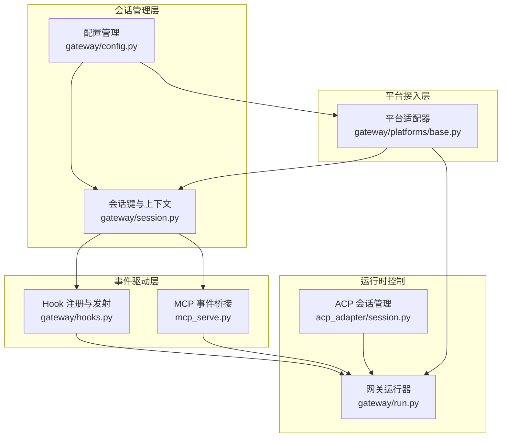
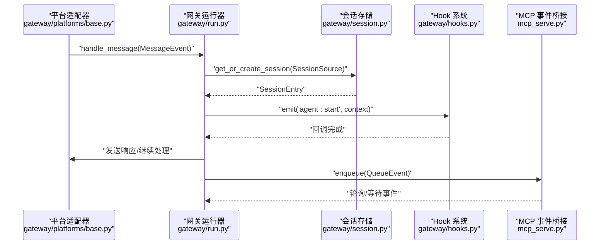
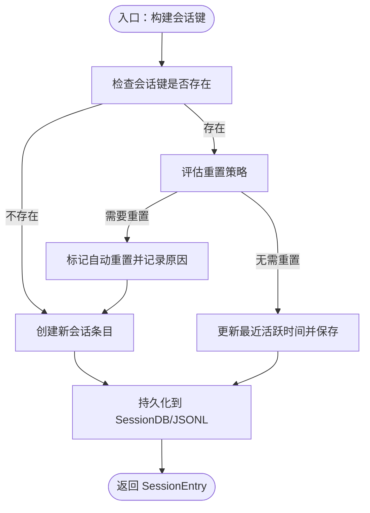
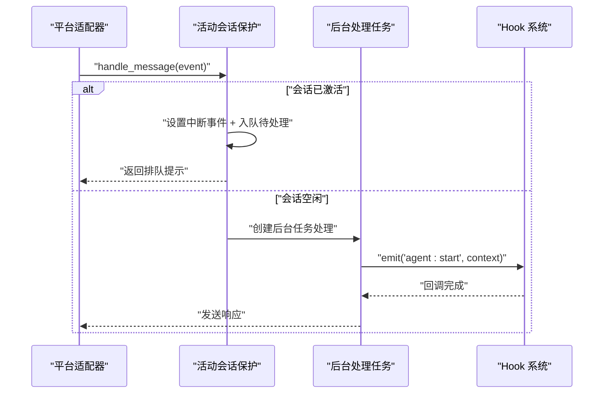
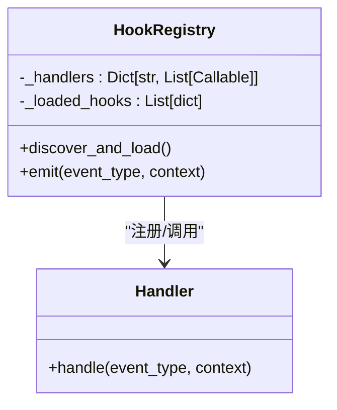
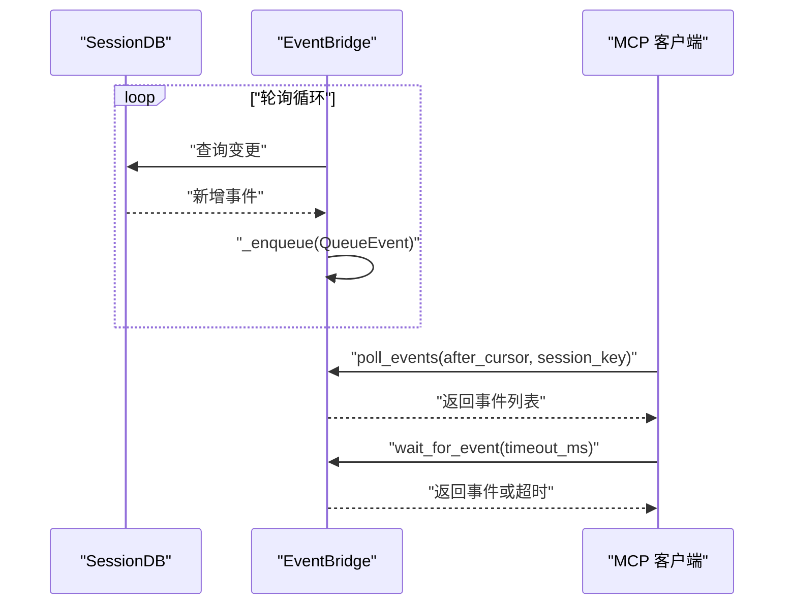
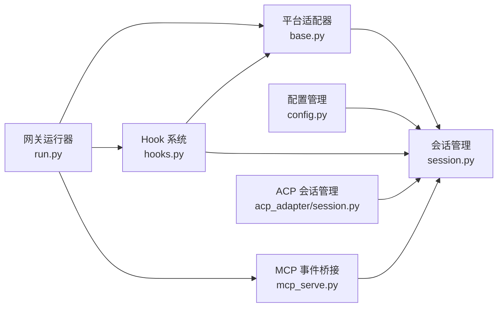

# 观察者模式应用

<cite>
**本文档引用的文件**
- [gateway/session.py](file://gateway/session.py)
- [gateway/platforms/base.py](file://gateway/platforms/base.py)
- [gateway/hooks.py](file://gateway/hooks.py)
- [mcp_serve.py](file://mcp_serve.py)
- [gateway/run.py](file://gateway/run.py)
- [gateway/config.py](file://gateway/config.py)
- [acp_adapter/session.py](file://acp_adapter/session.py)
</cite>

## 目录
1. [引言](#引言)
2. [项目结构](#项目结构)
3. [核心组件](#核心组件)
4. [架构总览](#架构总览)
5. [详细组件分析](#详细组件分析)
6. [依赖关系分析](#依赖关系分析)
7. [性能考虑](#性能考虑)
8. [故障排除指南](#故障排除指南)
9. [结论](#结论)

## 引言
本文件聚焦于 Hermes Agent 中观察者模式在消息网关中的应用，系统性阐述事件驱动架构的实现方式与实践要点。重点覆盖以下方面：
- 会话管理与事件监听机制：gateway/session.py 中的会话键构建、会话存储与过期策略，以及与平台适配器的消息事件传递链路。
- 观察者模式在异步事件传播中的作用：通过 Hook 系统（gateway/hooks.py）实现事件订阅、发布与回调处理；通过 MCP 服务桥接（mcp_serve.py）实现跨进程事件轮询与通知。
- 解耦与模块化设计：平台适配器、会话管理、Hook 注册与执行、MCP 桥接之间的松耦合协作。
- 性能优化与错误处理：线程安全、队列限流、重试与降级、异步写入与后台任务生命周期管理。

## 项目结构
Hermes Agent 的消息网关围绕“平台适配器—会话管理—事件钩子—MCP 桥接”的分层组织展开，形成清晰的职责边界与可扩展的事件驱动架构。

**图表来源**
- [gateway/platforms/base.py](file://gateway/platforms/base.py)
- [gateway/session.py](file://gateway/session.py)
- [gateway/hooks.py](file://gateway/hooks.py)
- [mcp_serve.py](file://mcp_serve.py)
- [gateway/run.py](file://gateway/run.py)
- [gateway/config.py](file://gateway/config.py)
- [acp_adapter/session.py](file://acp_adapter/session.py)

**章节来源**
- [gateway/platforms/base.py](file://gateway/platforms/base.py)
- [gateway/session.py](file://gateway/session.py)
- [gateway/hooks.py](file://gateway/hooks.py)
- [mcp_serve.py](file://mcp_serve.py)
- [gateway/run.py](file://gateway/run.py)
- [gateway/config.py](file://gateway/config.py)
- [acp_adapter/session.py](file://acp_adapter/session.py)

## 核心组件
- 会话键与上下文：负责从消息源构建确定性的会话键，解析会话上下文（来源平台、聊天类型、用户标识等），并提供动态系统提示注入能力。
- 平台适配器：统一接收平台消息，进行命令识别、活动会话保护、消息合并与后台处理，确保并发安全与人类响应节奏。
- Hook 系统：轻量事件钩子注册与发射，支持通配符匹配，异步/同步回调兼容，保证错误不阻塞主流水线。
- MCP 事件桥接：基于 SQLite 数据库轮询的事件桥接，维护内存事件队列与等待器，支持客户端轮询与等待事件。
- 配置管理：集中管理平台连接、会话重置策略、快速命令、流式传输等配置项，为会话与事件处理提供策略依据。
- ACP 会话管理：面向 ACP（Agent Control Protocol）的会话持久化与恢复，与 SessionDB 协作实现跨进程会话状态一致。

**章节来源**
- [gateway/session.py](file://gateway/session.py)
- [gateway/platforms/base.py](file://gateway/platforms/base.py)
- [gateway/hooks.py](file://gateway/hooks.py)
- [mcp_serve.py](file://mcp_serve.py)
- [gateway/config.py](file://gateway/config.py)
- [acp_adapter/session.py](file://acp_adapter/session.py)

## 架构总览
下图展示了从平台消息到达，到会话管理、事件钩子与 MCP 桥接的整体流程，体现观察者模式在异步事件传播中的关键作用。

**图表来源**
- [gateway/platforms/base.py](file://gateway/platforms/base.py)
- [gateway/run.py](file://gateway/run.py)
- [gateway/session.py](file://gateway/session.py)
- [gateway/hooks.py](file://gateway/hooks.py)
- [mcp_serve.py](file://mcp_serve.py)

## 详细组件分析

### 组件一：会话管理与事件监听（gateway/session.py）
- 会话键构建：根据平台、聊天类型、聊天标识、线程标识与用户标识生成确定性键，支持按用户隔离或共享线程会话策略。
- 会话存储：优先使用 SQLite（SessionDB）持久化会话元数据与消息历史，回退至 JSONL 文件；提供加载、保存、过期检测与自动重置逻辑。
- 动态系统提示：根据会话上下文（来源平台、家频道、令牌用量等）生成动态系统提示，支持 PII 脱敏与多平台行为说明。
- 会话更新与挂起：提供轻量更新接口与挂起标记，用于 /stop 等命令后的自动重置。

**图表来源**
- [gateway/session.py](file://gateway/session.py)

**章节来源**
- [gateway/session.py](file://gateway/session.py)

### 组件二：平台适配器的消息事件与观察者模式（gateway/platforms/base.py）
- 消息事件模型：MessageEvent 封装文本内容、媒体附件、回复上下文、内部合成事件标志与时间戳，统一各平台输入。
- 活动会话保护：当会话正在处理消息时，新消息进入待处理队列并通过中断事件触发后续处理，避免并发冲突。
- 后台处理与人类节奏：后台任务处理消息，支持随机延迟模拟人类响应节奏，增强用户体验。
- 命令识别与快速命令：支持斜杠命令识别与快速命令列表，部分命令（如 /stop）绕过活动会话保护直接执行。

**图表来源**
- [gateway/platforms/base.py](file://gateway/platforms/base.py)
- [gateway/hooks.py](file://gateway/hooks.py)

**章节来源**
- [gateway/platforms/base.py](file://gateway/platforms/base.py)
- [gateway/hooks.py](file://gateway/hooks.py)

### 组件三：Hook 事件系统（gateway/hooks.py）
- 事件类型：包括网关启动、会话开始/结束/重置、代理开始/结束、命令执行等；支持通配符匹配（如 command:*）。
- 注册与发现：扫描 ~/.hermes/hooks/ 目录，读取 HOOK.yaml 与 handler.py，动态加载事件处理器。
- 发射机制：emit 支持精确匹配与通配符匹配，异步/同步回调兼容，异常被捕获但不影响主流水线。

**图表来源**
- [gateway/hooks.py](file://gateway/hooks.py)

**章节来源**
- [gateway/hooks.py](file://gateway/hooks.py)

### 组件四：MCP 事件桥接（mcp_serve.py）
- 轮询机制：后台线程定期轮询 SessionDB 变化，维护内存事件队列，支持客户端轮询与等待事件。
- 事件类型：消息事件、审批请求/解决等；支持游标（cursor）分页与会话过滤。
- 线程安全与限流：使用锁保护队列，限制队列长度，支持并发 enqueue；提供等待器唤醒机制。

**图表来源**
- [mcp_serve.py](file://mcp_serve.py)

**章节来源**
- [mcp_serve.py](file://mcp_serve.py)

### 组件五：配置与会话上下文（gateway/config.py）
- 平台配置：启用/禁用平台、令牌/密钥、家频道、回复线程模式等。
- 会话重置策略：按日/空闲/两者皆可，支持通知策略与排除平台。
- 流式传输配置：实时令牌流式传输到平台的编辑/关闭策略、编辑间隔、缓冲阈值与光标样式。

**章节来源**
- [gateway/config.py](file://gateway/config.py)

### 组件六：ACP 会话管理（acp_adapter/session.py）
- 会话状态：每个会话包含会话 ID、AIAgent 实例、工作目录、模型、历史消息与取消事件。
- 生命周期管理：创建、获取、fork、列表、更新工作目录、清理与持久化；与 SessionDB 协作实现跨进程一致性。
- 工作目录绑定：为工具执行绑定任务特定的工作目录，便于 ACP 场景下的文件操作。

**章节来源**
- [acp_adapter/session.py](file://acp_adapter/session.py)

## 依赖关系分析
- 平台适配器依赖会话管理以解析会话键与上下文，并通过 Hook 系统在关键生命周期点触发回调。
- 会话管理依赖配置管理以获取重置策略与会话隔离规则。
- MCP 事件桥接独立于平台适配器，通过轮询 SessionDB 获取事件，与运行器协同向客户端推送事件。
- ACP 会话管理与 SessionDB 紧密耦合，确保跨进程会话状态一致与可恢复。

**图表来源**
- [gateway/platforms/base.py](file://gateway/platforms/base.py)
- [gateway/session.py](file://gateway/session.py)
- [gateway/hooks.py](file://gateway/hooks.py)
- [mcp_serve.py](file://mcp_serve.py)
- [gateway/run.py](file://gateway/run.py)
- [gateway/config.py](file://gateway/config.py)
- [acp_adapter/session.py](file://acp_adapter/session.py)

**章节来源**
- [gateway/platforms/base.py](file://gateway/platforms/base.py)
- [gateway/session.py](file://gateway/session.py)
- [gateway/hooks.py](file://gateway/hooks.py)
- [mcp_serve.py](file://mcp_serve.py)
- [gateway/run.py](file://gateway/run.py)
- [gateway/config.py](file://gateway/config.py)
- [acp_adapter/session.py](file://acp_adapter/session.py)

## 性能考虑
- 线程安全与锁粒度：会话存储与 MCP 桥接均采用细粒度锁保护共享状态，避免长时间持有锁导致阻塞。
- 队列限流与背压：MCP 桥接对事件队列设置上限，防止内存膨胀；平台适配器对待处理消息进行合并（如照片相册）减少重复处理。
- 异步与后台任务：平台适配器使用后台任务处理消息，避免阻塞主线程；Hook 系统支持异步回调，提升响应性。
- I/O 优化：会话存储尽量在锁外进行磁盘 I/O，先计算再加锁，降低锁竞争。
- 重试与降级：MCP 轮询与 Hook 回调中的异常被吞并并记录日志，保证主流水线稳定运行。

[本节为通用性能建议，不直接分析具体文件]

## 故障排除指南
- Hook 加载失败：检查 ~/.hermes/hooks/<hook>/HOOK.yaml 是否存在且包含 name 与 events 字段；确认 handler.py 存在并导出 handle 函数。
- MCP 事件未到达：确认 EventBridge 已启动，SessionDB 可用；检查 sessions.json 与 state.db 的可访问性与权限。
- 活跃会话保护导致命令延迟：确认 /stop 等命令是否绕过活动会话保护；检查 _pending_messages 与中断事件是否正确设置。
- 会话重置异常：核对 GatewayConfig 的重置策略（mode/at_hour/idle_minutes）与平台/类型覆盖；检查 has_active_processes_fn 是否正确返回活动状态。
- ACP 会话恢复失败：确认 SessionDB 可用，模型配置 JSON 可解析；检查 cwd 绑定与工具环境覆盖是否正确注册。

**章节来源**
- [gateway/hooks.py](file://gateway/hooks.py)
- [mcp_serve.py](file://mcp_serve.py)
- [gateway/platforms/base.py](file://gateway/platforms/base.py)
- [gateway/session.py](file://gateway/session.py)
- [acp_adapter/session.py](file://acp_adapter/session.py)

## 结论
Hermes Agent 在消息网关中通过观察者模式实现了高度解耦与模块化的事件驱动架构：
- 平台适配器作为事件生产者，统一消息格式并触发后台处理；
- 会话管理提供稳定的上下文与持久化能力，支撑跨平台会话一致性；
- Hook 系统以轻量事件机制扩展生命周期行为，支持异步与通配符匹配；
- MCP 事件桥接以轮询方式实现跨进程事件传播，保障外部客户端的实时感知；
- 配置与 ACP 管理进一步完善了策略控制与会话恢复能力。

该架构在保证系统稳定性的同时，提供了良好的可扩展性与可观测性，适合在多平台、多场景的消息交互中持续演进。