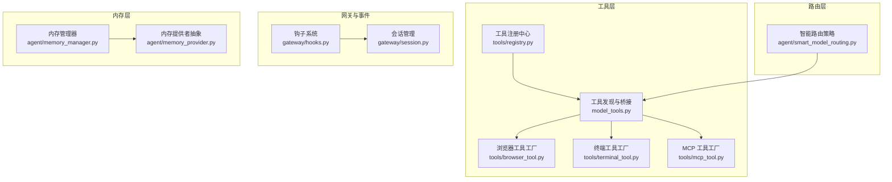
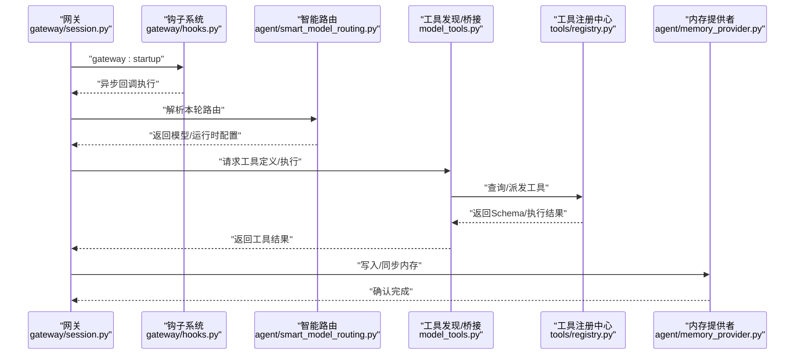
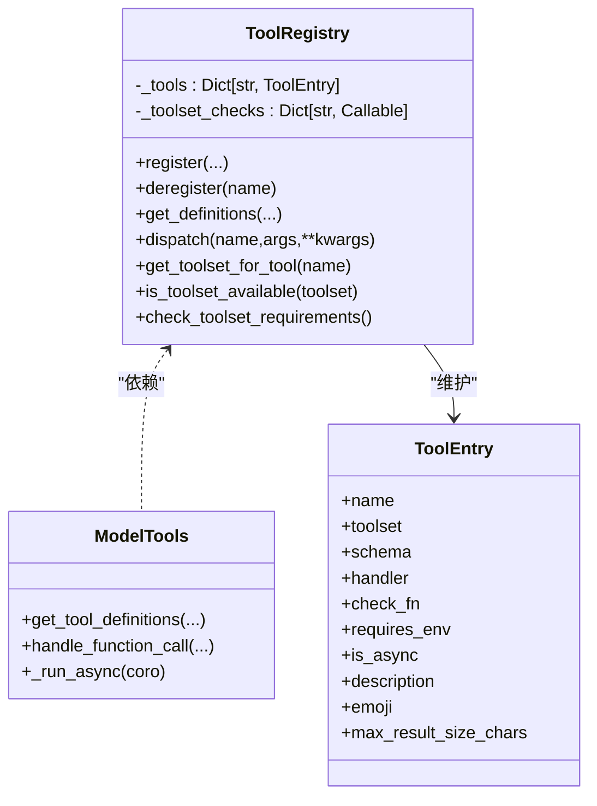
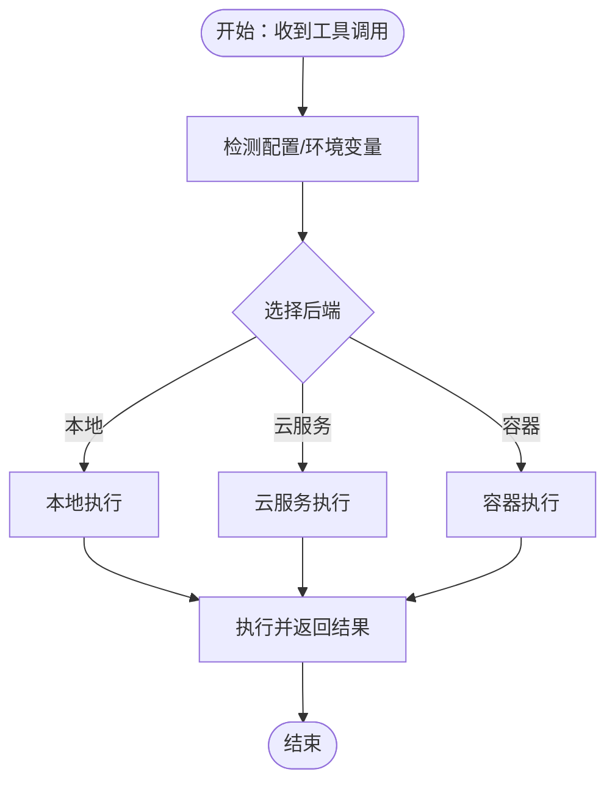
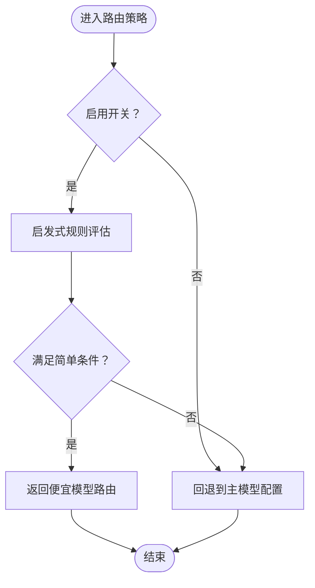
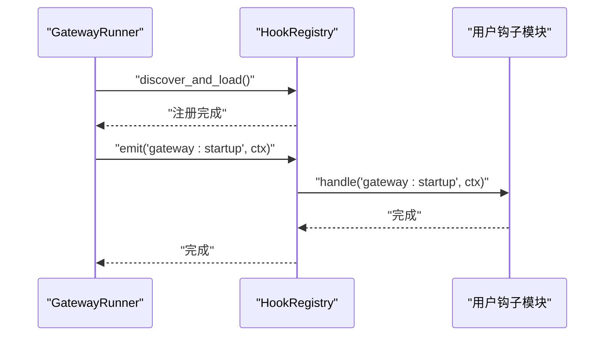
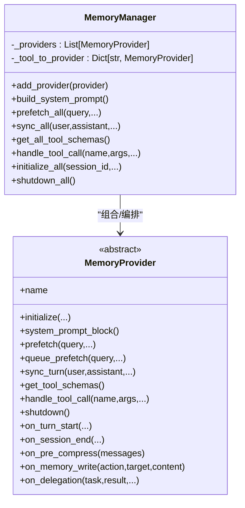
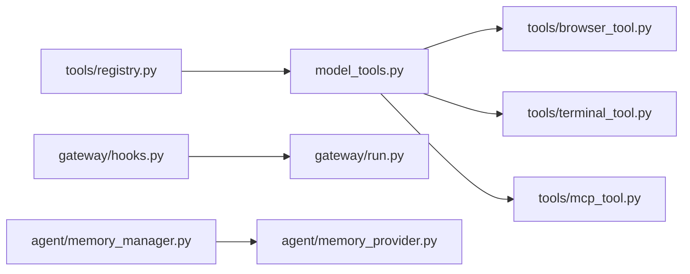

# 设计模式应用

<cite>
**本文引用的文件**
- [tools/registry.py](file://tools/registry.py)
- [model_tools.py](file://model_tools.py)
- [agent/smart_model_routing.py](file://agent/smart_model_routing.py)
- [gateway/hooks.py](file://gateway/hooks.py)
- [gateway/session.py](file://gateway/session.py)
- [agent/memory_manager.py](file://agent/memory_manager.py)
- [agent/memory_provider.py](file://agent/memory_provider.py)
- [tools/browser_tool.py](file://tools/browser_tool.py)
- [tools/terminal_tool.py](file://tools/terminal_tool.py)
- [tools/mcp_tool.py](file://tools/mcp_tool.py)
</cite>

## 目录
1. [引言](#引言)
2. [项目结构](#项目结构)
3. [核心组件](#核心组件)
4. [架构总览](#架构总览)
5. [详细组件分析](#详细组件分析)
6. [依赖分析](#依赖分析)
7. [性能考虑](#性能考虑)
8. [故障排查指南](#故障排查指南)
9. [结论](#结论)

## 引言
本文件聚焦于 Hermes Agent 中的设计模式实践，围绕以下主题展开：自注册工具模式、工厂模式（工具创建）、策略模式（模型路由）、观察者模式（消息网关钩子）、单例模式（内存管理）。我们将结合具体源码路径与图示，解释这些模式的实现原理、优势、适用场景以及性能影响。

## 项目结构
Hermes Agent 的设计模式主要分布在如下模块：
- 工具注册与分发：tools/registry.py、model_tools.py
- 模型路由策略：agent/smart_model_routing.py
- 观察者事件系统：gateway/hooks.py、gateway/run.py（事件触发）
- 内存管理与提供者：agent/memory_manager.py、agent/memory_provider.py
- 工厂式工具创建：tools/browser_tool.py、tools/terminal_tool.py、tools/mcp_tool.py

**图表来源**
- [tools/registry.py:1-336](file://tools/registry.py#L1-L336)
- [model_tools.py:1-200](file://model_tools.py#L1-L200)
- [agent/smart_model_routing.py:1-196](file://agent/smart_model_routing.py#L1-L196)
- [gateway/hooks.py:1-171](file://gateway/hooks.py#L1-L171)
- [gateway/session.py:1-800](file://gateway/session.py#L1-L800)
- [agent/memory_manager.py:1-363](file://agent/memory_manager.py#L1-L363)
- [agent/memory_provider.py:1-232](file://agent/memory_provider.py#L1-L232)

**章节来源**
- [tools/registry.py:1-336](file://tools/registry.py#L1-L336)
- [model_tools.py:1-200](file://model_tools.py#L1-L200)
- [agent/smart_model_routing.py:1-196](file://agent/smart_model_routing.py#L1-L196)
- [gateway/hooks.py:1-171](file://gateway/hooks.py#L1-L171)
- [gateway/session.py:1-800](file://gateway/session.py#L1-L800)
- [agent/memory_manager.py:1-363](file://agent/memory_manager.py#L1-L363)
- [agent/memory_provider.py:1-232](file://agent/memory_provider.py#L1-L232)

## 核心组件
- 工具注册中心（单例）：集中登记工具元数据、可用性检查、调度与查询。
- 工具发现与异步桥接：统一导入工具模块，构建工具定义，处理同步/异步工具调用。
- 智能模型路由策略：根据输入特征选择“便宜模型”或回退到主模型。
- 钩子系统（观察者）：事件驱动扩展点，支持内置与用户钩子。
- 内存管理器（组合+单例式）：编排内置与外部内存提供者，屏蔽多后端差异。
- 工具工厂：按配置/环境动态选择执行后端（浏览器、终端、MCP）。

**章节来源**
- [tools/registry.py:29-291](file://tools/registry.py#L29-L291)
- [model_tools.py:35-126](file://model_tools.py#L35-L126)
- [agent/smart_model_routing.py:62-196](file://agent/smart_model_routing.py#L62-L196)
- [gateway/hooks.py:34-171](file://gateway/hooks.py#L34-L171)
- [agent/memory_manager.py:72-363](file://agent/memory_manager.py#L72-L363)
- [agent/memory_provider.py:42-232](file://agent/memory_provider.py#L42-L232)

## 架构总览
下图展示从“消息到达”到“工具执行/模型路由/内存写入”的关键交互，体现观察者、策略与工厂的协同：

**图表来源**
- [gateway/session.py:683-769](file://gateway/session.py#L683-L769)
- [gateway/hooks.py:138-171](file://gateway/hooks.py#L138-L171)
- [agent/smart_model_routing.py:110-196](file://agent/smart_model_routing.py#L110-L196)
- [model_tools.py:128-185](file://model_tools.py#L128-L185)
- [tools/registry.py:116-167](file://tools/registry.py#L116-L167)
- [agent/memory_manager.py:199-257](file://agent/memory_manager.py#L199-L257)

## 详细组件分析

### 自注册工具模式（自注册 + 单例 + 工具定义生成）
- 实现要点
  - 工具模块在导入时调用注册中心的 register 接口，登记工具名、Schema、处理器、可用性检查等。
  - 注册中心以单例形式维护工具表与工具集检查函数，提供查询、派发、可用性判断等能力。
  - 工具发现阶段统一导入各工具模块，触发其自注册；随后生成工具定义（含名称、描述、参数）供模型调用。
  - 对异步工具，通过统一的异步桥接函数在同步上下文中安全运行协程，避免“事件循环已关闭”问题。
- 优势
  - 去中心化扩展：新增工具仅需实现处理器与Schema并触发注册，无需修改上层调用逻辑。
  - 可观测性：统一的可用性检查与错误格式化，便于诊断。
  - 性能：延迟加载与缓存（如工具集可用性），减少重复计算。
- 应用场景
  - 浏览器工具、终端工具、MCP 工具、技能工具等均采用该模式。
- 关键路径
  - 注册中心与单例：[tools/registry.py:48-291]
  - 工具发现与导入：[model_tools.py:132-185]
  - 异步桥接：[model_tools.py:44-126]
  - 工具派发与错误处理：[tools/registry.py:149-167]

**图表来源**
- [tools/registry.py:24-291](file://tools/registry.py#L24-L291)
- [model_tools.py:35-126](file://model_tools.py#L35-L126)

**章节来源**
- [tools/registry.py:48-291](file://tools/registry.py#L48-L291)
- [model_tools.py:128-185](file://model_tools.py#L128-L185)
- [model_tools.py:44-126](file://model_tools.py#L44-L126)

### 工厂模式（工具创建）
- 实现要点
  - 工具模块内部根据配置/环境变量动态选择后端（如本地浏览器、云浏览器、容器终端、Modal 等）。
  - 通过统一的入口函数封装创建细节，调用方仅需传入任务标识与参数。
- 典型案例
  - 浏览器工具：依据配置自动选择 Browser Use/Browserbase/本地 Chromium，统一行为接口。
  - 终端工具：支持 local/docker/modal 等后端，统一命令执行体验。
  - MCP 工具：按服务器动态拉取工具清单，过滤 include/exclude 列表后注册。
- 关键路径
  - 浏览器工具工厂与后端选择：[tools/browser_tool.py:1-L200]
  - 终端工具工厂与后端选择：[tools/terminal_tool.py:1-L200]
  - MCP 工具动态发现与过滤：[tools/mcp_tool.py:1746-L1775]

**图表来源**
- [tools/browser_tool.py:1-200](file://tools/browser_tool.py#L1-L200)
- [tools/terminal_tool.py:1-200](file://tools/terminal_tool.py#L1-L200)
- [tools/mcp_tool.py:1746-1775](file://tools/mcp_tool.py#L1746-L1775)

**章节来源**
- [tools/browser_tool.py:1-200](file://tools/browser_tool.py#L1-L200)
- [tools/terminal_tool.py:1-200](file://tools/terminal_tool.py#L1-L200)
- [tools/mcp_tool.py:1746-1775](file://tools/mcp_tool.py#L1746-L1775)

### 策略模式（模型路由）
- 实现要点
  - 根据用户输入的文本长度、换行数、是否包含代码片段、是否包含复杂关键词等启发式规则，决定是否走“便宜模型”。
  - 若不满足简单条件，则回退到主模型配置。
  - 路由决策可扩展为“策略集合”，当前实现为一组判定函数。
- 关键路径
  - 简单路由判定：[agent/smart_model_routing.py:62-107]
  - 路由解析与回退：[agent/smart_model_routing.py:110-196]

**图表来源**
- [agent/smart_model_routing.py:62-196](file://agent/smart_model_routing.py#L62-L196)

**章节来源**
- [agent/smart_model_routing.py:62-196](file://agent/smart_model_routing.py#L62-L196)

### 观察者模式（消息网关钩子）
- 实现要点
  - 钩子系统在启动时扫描用户目录下的钩子，动态加载并注册事件处理器。
  - 支持精确匹配与通配符匹配（如 command:*），事件类型包括 gateway:startup、session:*、agent:* 等。
  - 钩子执行失败不会阻断主流程，且内置钩子始终生效。
- 关键路径
  - 钩子注册与加载：[gateway/hooks.py:69-137]
  - 事件发射与回调执行：[gateway/hooks.py:138-171]
  - 启动时触发 gateway:startup：[gateway/run.py:1689-L1697]

**图表来源**
- [gateway/hooks.py:69-171](file://gateway/hooks.py#L69-L171)
- [gateway/run.py:1689-1697](file://gateway/run.py#L1689-L1697)

**章节来源**
- [gateway/hooks.py:69-171](file://gateway/hooks.py#L69-L171)
- [gateway/run.py:1689-1697](file://gateway/run.py#L1689-L1697)

### 单例模式（内存管理）
- 实现要点
  - 注册中心（工具）与内存管理器（组合）均体现单例/全局唯一思想：
    - 工具注册中心：模块级单例，所有工具模块共享同一注册表。
    - 内存管理器：在运行期作为单一编排者，统一初始化、预取、同步、工具分发与关闭。
  - 内存提供者抽象定义了生命周期钩子，内存管理器负责协调多个提供者的并发与容错。
- 关键路径
  - 工具注册中心单例：[tools/registry.py:289-L291]
  - 内存管理器编排与工具分发：[agent/memory_manager.py:72-L363]
  - 提供者抽象与钩子：[agent/memory_provider.py:42-L232]

**图表来源**
- [agent/memory_manager.py:72-363](file://agent/memory_manager.py#L72-L363)
- [agent/memory_provider.py:42-232](file://agent/memory_provider.py#L42-L232)

**章节来源**
- [tools/registry.py:289-291](file://tools/registry.py#L289-L291)
- [agent/memory_manager.py:72-363](file://agent/memory_manager.py#L72-L363)
- [agent/memory_provider.py:42-232](file://agent/memory_provider.py#L42-L232)

## 依赖分析
- 松耦合与高内聚
  - 工具注册中心与工具模块之间通过导入触发自注册，避免在上层集中维护工具清单。
  - 内存管理器通过抽象提供者隔离不同后端，降低变更成本。
- 循环依赖控制
  - 工具注册中心不依赖具体工具模块，工具模块依赖注册中心进行自注册，形成单向依赖链。
  - 工具发现阶段延迟导入，避免运行时循环。
- 外部集成点
  - 钩子系统通过 YAML 清单与 handler.py 动态加载，扩展性强。
  - MCP 工具通过服务器动态拉取工具清单，支持 include/exclude 过滤。

**图表来源**
- [tools/registry.py:1-15](file://tools/registry.py#L1-L15)
- [model_tools.py:128-185](file://model_tools.py#L128-L185)
- [gateway/hooks.py:69-137](file://gateway/hooks.py#L69-L137)
- [gateway/run.py:1689-1697](file://gateway/run.py#L1689-L1697)
- [agent/memory_manager.py:72-131](file://agent/memory_manager.py#L72-L131)
- [agent/memory_provider.py:42-90](file://agent/memory_provider.py#L42-L90)

**章节来源**
- [tools/registry.py:1-15](file://tools/registry.py#L1-L15)
- [model_tools.py:128-185](file://model_tools.py#L128-L185)
- [gateway/hooks.py:69-137](file://gateway/hooks.py#L69-L137)
- [gateway/run.py:1689-1697](file://gateway/run.py#L1689-L1697)
- [agent/memory_manager.py:72-131](file://agent/memory_manager.py#L72-L131)
- [agent/memory_provider.py:42-90](file://agent/memory_provider.py#L42-L90)

## 性能考虑
- 工具注册与发现
  - 使用模块导入触发自注册，避免在运行时维护冗余映射；工具定义生成时可缓存工具集可用性检查结果。
- 异步桥接
  - 通过持久事件循环避免“事件循环已关闭”导致的客户端重建与 GC 异常，提升稳定性与吞吐。
- 路由策略
  - 启发式规则快速判定，避免昂贵的模型调用；当不满足简单条件时立即回退主模型，降低延迟。
- 钩子系统
  - 异步回调与异常隔离，不影响主流程；通配符匹配减少重复注册。
- 内存管理
  - 并行提供者间失败隔离，避免一个提供者故障拖累整体；后台线程/队列化写入降低主线程阻塞。

[本节为通用性能讨论，未直接分析具体文件]

## 故障排查指南
- 工具不可用
  - 检查工具集可用性检查函数是否抛出异常或返回 False；查看注册中心的日志输出。
  - 参考：[tools/registry.py:109-L227]
- 工具执行失败
  - 查看工具返回的统一错误格式；定位具体工具处理器异常堆栈。
  - 参考：[tools/registry.py:149-L167]
- 异步工具报错
  - 确认使用统一的异步桥接函数；检查事件循环状态与线程局部存储。
  - 参考：[model_tools.py:44-L126]
- 钩子未触发或报错
  - 检查 HOOK.yaml 是否存在、事件列表是否正确、handler.py 是否导出 handle 函数。
  - 参考：[gateway/hooks.py:69-L137]
- 内存提供者冲突
  - 仅允许一个非内置提供者；若尝试注册第二个外部提供者会被拒绝并记录警告。
  - 参考：[agent/memory_manager.py:86-L111]

**章节来源**
- [tools/registry.py:109-227](file://tools/registry.py#L109-L227)
- [tools/registry.py:149-167](file://tools/registry.py#L149-L167)
- [model_tools.py:44-126](file://model_tools.py#L44-L126)
- [gateway/hooks.py:69-137](file://gateway/hooks.py#L69-L137)
- [agent/memory_manager.py:86-111](file://agent/memory_manager.py#L86-L111)

## 结论
Hermes Agent 在工具生态、模型路由、事件扩展与内存管理方面系统性地运用了多种设计模式：
- 自注册工具模式与单例注册中心，实现了去中心化的工具扩展与统一调度；
- 工厂模式将工具创建细节封装，提升了可移植性与可测试性；
- 策略模式使模型路由具备可演进的启发式规则；
- 观察者模式通过钩子系统提供了强大的扩展点；
- 单例式内存管理器与抽象提供者，确保了多后端的一致性与容错。

这些设计共同提升了系统的可维护性、可扩展性与运行稳定性。