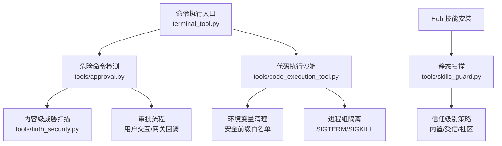
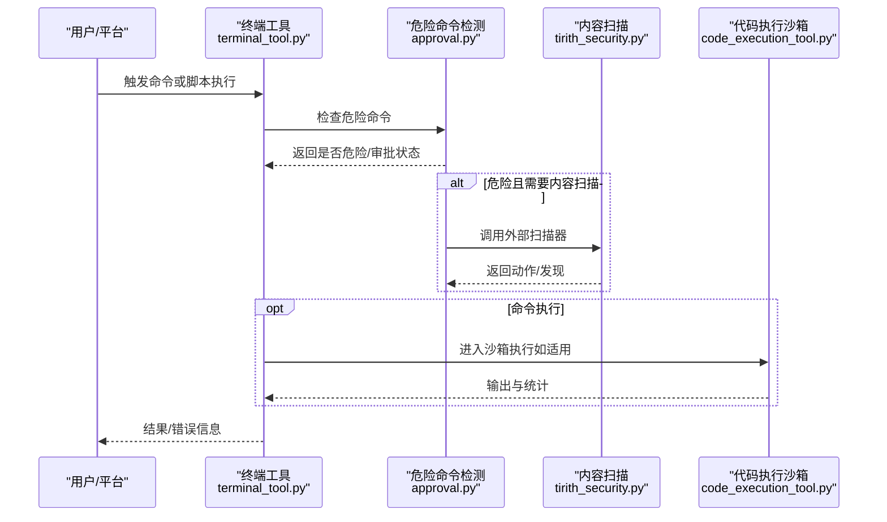
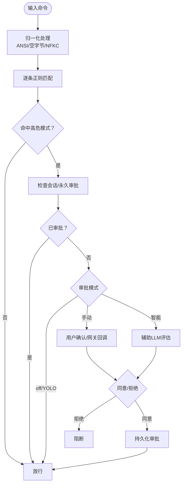
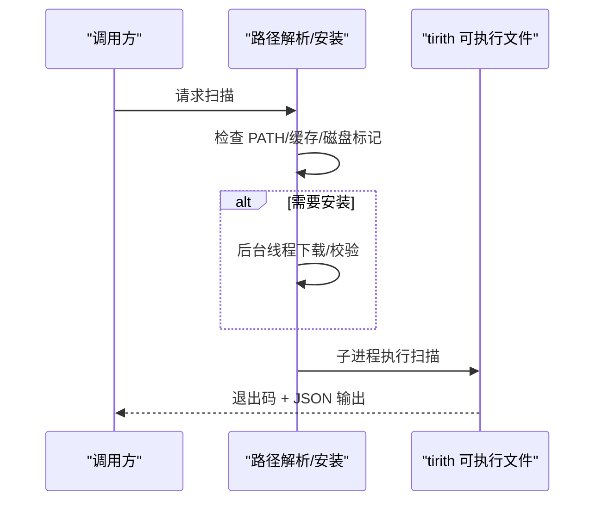
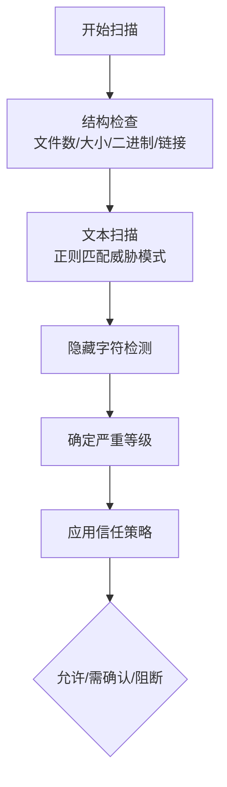
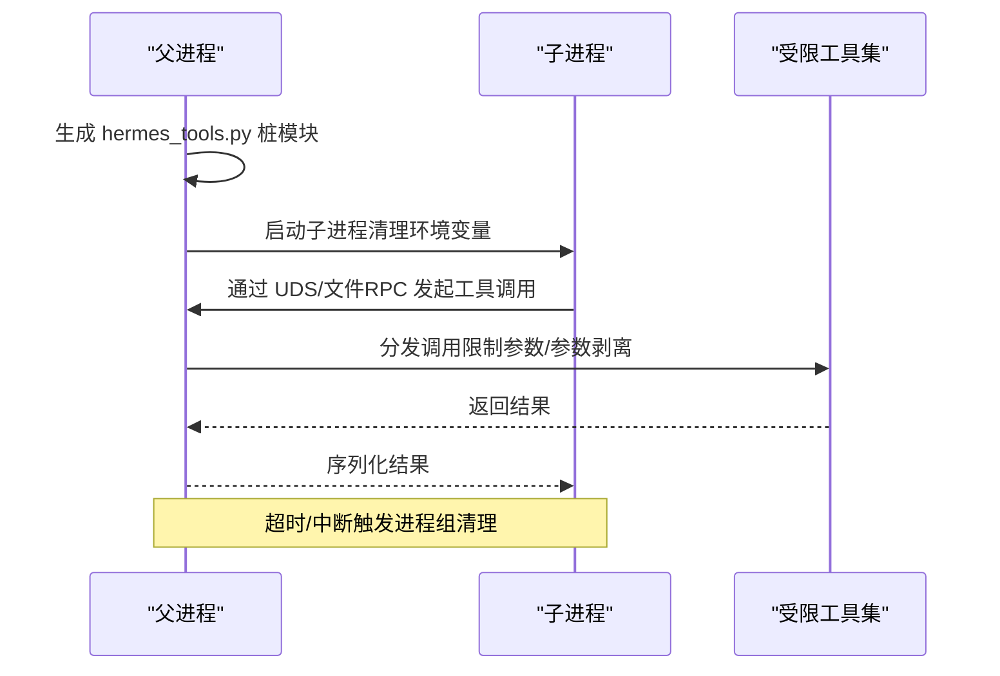
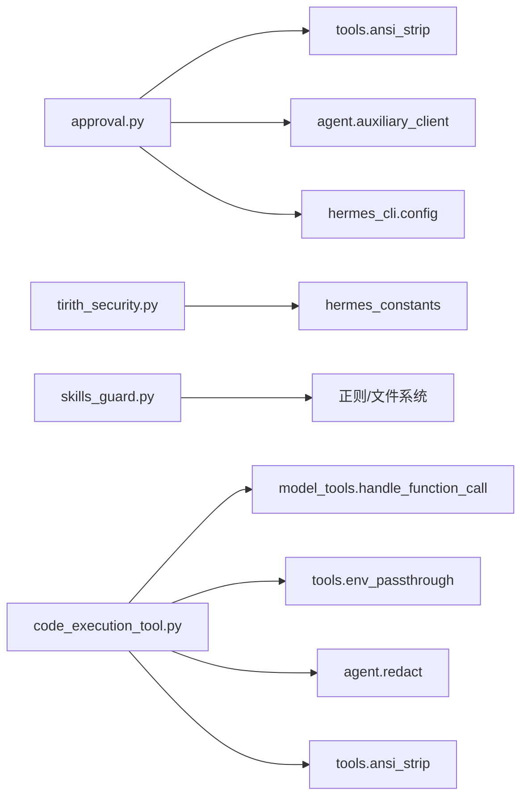

# 代码安全

<cite>
**本文引用的文件**
- [tools/approval.py](file://tools/approval.py)
- [tools/skills_guard.py](file://tools/skills_guard.py)
- [tools/code_execution_tool.py](file://tools/code_execution_tool.py)
- [tools/tirith_security.py](file://tools/tirith_security.py)
- [tools/path_security.py](file://tools/path_security.py)
- [tools/url_safety.py](file://tools/url_safety.py)
- [tests/tools/test_approval.py](file://tests/tools/test_approval.py)
- [tests/tools/test_tool_result_storage.py](file://tests/tools/test_tool_result_storage.py)
- [tests/tools/test_file_tools_live.py](file://tests/tools/test_file_tools_live.py)
- [tests/tools/test_tirith_security.py](file://tests/tools/test_tirith_security.py)
- [website/docs/user-guide/security.md](file://website/docs/user-guide/security.md)
</cite>

## 目录
1. [简介](#简介)
2. [项目结构](#项目结构)
3. [核心组件](#核心组件)
4. [架构总览](#架构总览)
5. [详细组件分析](#详细组件分析)
6. [依赖分析](#依赖分析)
7. [性能考虑](#性能考虑)
8. [故障排查指南](#故障排查指南)
9. [结论](#结论)
10. [附录](#附录)

## 简介
本指南聚焦于 Hermes Agent 的代码安全体系，围绕三大核心能力展开：危险命令检测与审批、Hub 技能安装安全扫描、代码执行沙箱隔离。文档将深入解析 approval.py 中的危险命令检测算法与正则规则、skills_guard.py 对 Hub 技能的静态扫描策略、以及 code_execution_tool.py 的沙箱隔离与环境变量清理机制；同时提供安全编码规范与常见漏洞案例及修复建议。

## 项目结构
Hermes Agent 将安全能力分布在多个模块中：
- 危险命令检测与审批：tools/approval.py
- 内容级威胁扫描（可选）：tools/tirith_security.py
- Hub 技能安全扫描：tools/skills_guard.py
- 代码执行沙箱：tools/code_execution_tool.py
- 路径安全辅助：tools/path_security.py
- URL 安全检查：tools/url_safety.py
- 测试覆盖：tests/tools 下多套测试用例

图表来源
- [tools/approval.py:583-656](file://tools/approval.py#L583-L656)
- [tools/tirith_security.py:600-670](file://tools/tirith_security.py#L600-L670)
- [tools/code_execution_tool.py:988-1220](file://tools/code_execution_tool.py#L988-L1220)
- [tools/skills_guard.py:41-48](file://tools/skills_guard.py#L41-L48)

章节来源
- [tools/approval.py:1-120](file://tools/approval.py#L1-L120)
- [tools/skills_guard.py:1-60](file://tools/skills_guard.py#L1-L60)
- [tools/code_execution_tool.py:1-120](file://tools/code_execution_tool.py#L1-L120)

## 核心组件
- 危险命令检测与审批：基于正则规则匹配高危模式，支持会话级/永久级审批、智能审批（辅助 LLM 风险评估）、网关异步审批队列。
- 内容级威胁扫描：通过外部二进制 tirith 执行子进程扫描，退出码决定允许/阻断/警告，并在异常时遵循 fail_open/fail_closed 策略。
- Hub 技能安全扫描：对技能目录进行结构化检查与正则扫描，识别敏感路径、隐藏字符、破坏性操作、权限提升、供应链风险等。
- 代码执行沙箱：本地 UDS 与远程文件传输两种通道，严格限制可用工具集、清理环境变量、进程组隔离、输出截断与脱敏。

章节来源
- [tools/approval.py:75-133](file://tools/approval.py#L75-L133)
- [tools/tirith_security.py:600-670](file://tools/tirith_security.py#L600-L670)
- [tools/skills_guard.py:595-640](file://tools/skills_guard.py#L595-L640)
- [tools/code_execution_tool.py:988-1220](file://tools/code_execution_tool.py#L988-L1220)

## 架构总览
下图展示从命令到执行的关键安全链路：

图表来源
- [tools/approval.py:583-656](file://tools/approval.py#L583-L656)
- [tools/tirith_security.py:600-670](file://tools/tirith_security.py#L600-L670)
- [tools/code_execution_tool.py:890-924](file://tools/code_execution_tool.py#L890-L924)

## 详细组件分析

### 危险命令检测与审批（approval.py）
- 正则规则设计
  - 文件系统破坏：递归删除、写块设备、覆盖系统配置、格式化文件系统、磁盘复制等。
  - 权限与所有权变更：设置世界可写权限、递归设置权限、chown 到 root。
  - 进程控制：停止/禁用系统服务、杀死所有进程、强制终止进程。
  - 注入与远程执行：-c/-e/-lc/-ic 等标志、管道远程内容到 shell、进程替换、heredoc 执行、chmod +x 后立即执行。
  - Git 破坏性操作：reset --hard、force push、clean、强制删除分支。
  - 自杀式命令：pkill/killall hermes/gateway、通过 pgrep 命令替换自终止。
  - 敏感路径重定向：tee/重定向到 /etc/、~/.ssh/、~/.hermes/.env 等。
- 命令归一化
  - 去除 ANSI 转义序列、空字节，NFKC 归一化以对抗全角字符绕过。
- 审批状态管理
  - 会话级审批、永久允许清单、YOLO 模式豁免、网关异步审批队列（FIFO）。
- 智能审批
  - 使用辅助 LLM 对“潜在危险”命令进行二次风险评估，自动批准低风险、拒绝高风险、不确定时转人工。

图表来源
- [tools/approval.py:163-192](file://tools/approval.py#L163-L192)
- [tools/approval.py:583-656](file://tools/approval.py#L583-L656)
- [tools/approval.py:706-784](file://tools/approval.py#L706-L784)

章节来源
- [tools/approval.py:75-133](file://tools/approval.py#L75-L133)
- [tools/approval.py:163-192](file://tools/approval.py#L163-L192)
- [tools/approval.py:583-656](file://tools/approval.py#L583-L656)
- [tools/approval.py:706-784](file://tools/approval.py#L706-L784)
- [website/docs/user-guide/security.md:82-115](file://website/docs/user-guide/security.md#L82-L115)
- [tests/tools/test_approval.py:29-109](file://tests/tools/test_approval.py#L29-L109)

### 内容级威胁扫描（tirith_security.py）
- 外部二进制调用
  - 通过子进程运行 tirith，退出码 0/1/2 分别表示允许/阻断/警告。
  - JSON 标准输出用于丰富“发现/摘要”，但不覆盖退出码判定。
- 自动安装与校验
  - 支持按平台目标下载发布包，优先使用 cosign 验证签名与发布工作流一致性，其次进行 SHA-256 校验。
  - 失败原因持久化标记，避免频繁重试；特定原因（如缺少 cosign）可在条件满足后自动恢复。
- 容错策略
  - 进程启动失败、超时、未知退出码时遵循 fail_open 或 fail_closed 配置。

图表来源
- [tools/tirith_security.py:600-670](file://tools/tirith_security.py#L600-L670)
- [tools/tirith_security.py:379-475](file://tools/tirith_security.py#L379-L475)
- [tests/tools/test_tirith_security.py:52-68](file://tests/tools/test_tirith_security.py#L52-L68)

章节来源
- [tools/tirith_security.py:600-670](file://tools/tirith_security.py#L600-L670)
- [tests/tools/test_tirith_security.py:31-68](file://tests/tools/test_tirith_security.py#L31-L68)

### Hub 技能安全扫描（skills_guard.py）
- 扫描范围
  - 结构检查：文件数量上限、总大小、单文件大小、二进制/可执行文件、符号链接逃逸、破损链接。
  - 正则扫描：数据外泄（curl/wget/HTTP 库读取密钥变量、读取凭据目录/文件）、提示词注入（忽略指令、角色劫持、系统提示覆盖等）、破坏性操作（rm -rf /、chmod 777、覆盖系统文件、mkfs、dd）、持久化（crontab、shell rc、authorized_keys、systemd、sudoers、git 全局配置）、网络（反向连接、隧道、硬编码 IP/端口）、混淆（base64 解码管道、十六进制字符串、eval/exec、echo 管道执行、编译执行、动态导入、ROT13/Unicode 逃逸、字符串反转、charCodeAt、atob/btoa、字符串拼接）、进程执行（subprocess/os.system/os.popen、child_process、Runtime.exec、反引号子壳）、路径遍历（相对上溯、系统敏感文件、/proc、共享内存）、挖矿（xmrig、stratum、monero、coinhive、cryptonight）、供应链（curl/wget 管道到 shell、未固定版本依赖、运行时拉取资源、git clone/docker pull）、提权（sudo、setuid/setgid、NOPASSWD、SUID/SGID）、配置持久化（Agent/其他代理配置文件）、硬编码密钥（API Key、私钥、PAT、OpenAI/Anthropic/AWS Key）。
- 信任策略
  - builtin/trusted/community/agent-created 四档信任，结合扫描结果与严重等级决定允许/需确认/阻断。
- 报告与摘要
  - 按严重度排序输出，生成简洁摘要。

图表来源
- [tools/skills_guard.py:595-640](file://tools/skills_guard.py#L595-L640)
- [tools/skills_guard.py:642-677](file://tools/skills_guard.py#L642-L677)
- [tools/skills_guard.py:734-848](file://tools/skills_guard.py#L734-L848)

章节来源
- [tools/skills_guard.py:41-48](file://tools/skills_guard.py#L41-L48)
- [tools/skills_guard.py:82-484](file://tools/skills_guard.py#L82-L484)
- [tools/skills_guard.py:595-640](file://tools/skills_guard.py#L595-L640)
- [tools/skills_guard.py:642-677](file://tools/skills_guard.py#L642-L677)

### 代码执行沙箱（code_execution_tool.py）
- 通道与隔离
  - 本地：Unix Domain Socket（UDS），父进程监听，子进程通过 RPC 访问受限工具集。
  - 远程：文件传输 RPC（请求/响应文件），由轮询线程在宿主环境中调度工具调用。
- 工具集限制
  - 仅允许 web_search/web_extract/read_file/write_file/search_files/patch/terminal 等有限工具，其余工具禁止。
- 环境变量清理
  - 仅传递安全前缀（PATH/HOME/USER/LANG/LC_/TERM/TMPDIR/TMP/TEMP/SHELL/LOGNAME/XDG_/PYTHONPATH/VIRTUAL_ENV/CONDA 等）与显式透传变量，屏蔽含“KEY/TOKEN/SECRET/PASSWORD/CREDENTIAL”等关键字的变量，防止凭据泄露。
- 进程隔离
  - 子进程在新会话组运行，超时/中断时通过 SIGTERM/SIGKILL 清理进程树。
- 输出与脱敏
  - 截断 stdout（头尾保留），去除 ANSI 转义，对敏感信息进行脱敏处理。
- 任务隔离
  - 通过 task_id/环境复用/清理线程确保不同任务互不干扰。

图表来源
- [tools/code_execution_tool.py:988-1220](file://tools/code_execution_tool.py#L988-L1220)
- [tools/code_execution_tool.py:1022-1038](file://tools/code_execution_tool.py#L1022-L1038)
- [tools/code_execution_tool.py:1222-1252](file://tools/code_execution_tool.py#L1222-L1252)

章节来源
- [tools/code_execution_tool.py:54-71](file://tools/code_execution_tool.py#L54-L71)
- [tools/code_execution_tool.py:988-1220](file://tools/code_execution_tool.py#L988-L1220)
- [tools/code_execution_tool.py:1222-1252](file://tools/code_execution_tool.py#L1222-L1252)

### 路径与 URL 安全
- 路径安全
  - 使用 Path.resolve + relative_to 确保路径不逃逸；快速检测 “..” 组件。
- URL 安全
  - 屏蔽私有/回环/链路本地/保留/组播/未指定地址与 CGNAT（100.64.0.0/10）；阻止特定内部主机名；DNS 解析失败时默认阻断。

章节来源
- [tools/path_security.py:15-43](file://tools/path_security.py#L15-L43)
- [tools/url_safety.py:39-97](file://tools/url_safety.py#L39-L97)

## 依赖分析
- approval.py 依赖
  - tools.ansi_strip（去 ANSI）、agent.auxiliary_client（智能审批）、hermes_cli.config（审批配置/永久允许列表）。
- tirith_security.py 依赖
  - hermes_constants（$HERMES_HOME）、外部二进制 tirith、cosign（可选）。
- skills_guard.py 依赖
  - 正则、文件系统遍历、时间戳与摘要。
- code_execution_tool.py 依赖
  - model_tools.handle_function_call（工具分发）、tools.terminal_tool（环境复用）、tools.env_passthrough（变量透传）、agent.redact（脱敏）、tools.ansi_strip（输出清洗）。

图表来源
- [tools/approval.py:170-178](file://tools/approval.py#L170-L178)
- [tools/tirith_security.py:37-40](file://tools/tirith_security.py#L37-L40)
- [tools/code_execution_tool.py:319-398](file://tools/code_execution_tool.py#L319-L398)

章节来源
- [tools/approval.py:170-178](file://tools/approval.py#L170-L178)
- [tools/tirith_security.py:37-40](file://tools/tirith_security.py#L37-L40)
- [tools/code_execution_tool.py:319-398](file://tools/code_execution_tool.py#L319-L398)

## 性能考虑
- 危险命令检测
  - 正则匹配线性扫描，DANGEROUS_PATTERNS 数量有限，开销可忽略；归一化步骤（ANSI 去除、NFKC 规范化）成本低。
- 内容扫描（tirith）
  - 子进程启动与 JSON 解析为主要开销；通过 fail_open/fail_closed 控制异常时的性能/安全权衡。
- 沙箱执行
  - 本地 UDS 与远程文件 RPC 的往返延迟取决于网络与磁盘；stdout 截断与脱敏在输出阶段完成，避免上下文窗口膨胀。
- 结构扫描（skills_guard）
  - 文件系统遍历与正则扫描，合理设置文件数/大小上限可降低扫描时间。

## 故障排查指南
- 危险命令误报/漏报
  - 检查命令是否经过全角字符绕过（应被 NFKC 规范化处理）。参考测试用例验证。
  - 若为 heredoc 执行场景，确认已覆盖相应模式。
- 审批流程卡住
  - 网关审批队列未出队：检查 resolve_gateway_approval 是否被调用；确认 notify_cb 是否成功发送。
  - YOLO 模式/永久允许：确认环境变量与配置项生效。
- 内容扫描不可用
  - 检查 tirith 是否存在、可执行位、cosign 可用性；查看 fail_open/fail_closed 行为是否符合预期。
- 沙箱执行失败
  - 确认平台支持（Windows 不支持本地 UDS）；检查环境变量清理是否导致工具不可用；关注超时/中断信号处理。
- 路径/URL 安全问题
  - 路径逃逸：使用 validate_within_dir 检查；避免 “..” 组件。
  - URL SSRF：确认 is_safe_url 返回阻断，检查 DNS 解析与内部主机名黑名单。

章节来源
- [tests/tools/test_approval.py:584-622](file://tests/tools/test_approval.py#L584-L622)
- [tools/approval.py:800-891](file://tools/approval.py#L800-L891)
- [tools/tirith_security.py:600-670](file://tools/tirith_security.py#L600-L670)
- [tools/code_execution_tool.py:1222-1252](file://tools/code_execution_tool.py#L1222-L1252)
- [tools/path_security.py:15-43](file://tools/path_security.py#L15-L43)
- [tools/url_safety.py:51-97](file://tools/url_safety.py#L51-L97)

## 结论
Hermes Agent 的安全体系采用“多层防护 + 可插拔扩展”的设计：以 approval.py 为核心的风险识别与审批，辅以内容级威胁扫描（tirith）与 Hub 技能静态扫描（skills_guard），并通过 code_execution_tool.py 提供强隔离的代码执行沙箱。整体策略兼顾易用性与安全性，通过配置化与智能审批进一步降低误判成本。

## 附录

### 安全编码规范
- shell 命令拼接
  - 使用 shlex.quote 包裹动态参数，避免元字符注入。
  - 示例路径：[tools/code_execution_tool.py:180-185](file://tools/code_execution_tool.py#L180-L185)
- 路径解析与安全
  - 使用 Path.resolve + relative_to 确保不逃逸；先快速检测 “..” 再做完整解析。
  - 示例路径：[tools/path_security.py:15-43](file://tools/path_security.py#L15-L43)
- 环境变量透传
  - 仅透传安全前缀变量；屏蔽含敏感关键词的变量。
  - 示例路径：[tools/code_execution_tool.py:988-1038](file://tools/code_execution_tool.py#L988-L1038)
- 输出与脱敏
  - 截断 stdout（头尾策略），去除 ANSI，对敏感信息进行脱敏。
  - 示例路径：[tools/code_execution_tool.py:843-883](file://tools/code_execution_tool.py#L843-L883)
- URL 安全
  - 使用 is_safe_url 拦截私有/内部地址；DNS 解析失败时默认阻断。
  - 示例路径：[tools/url_safety.py:51-97](file://tools/url_safety.py#L51-L97)

### 实际安全漏洞案例与修复
- 案例：全角字符绕过 rm -rf
  - 现象：使用全角字符的 rm/删除标志被绕过。
  - 修复：命令归一化（NFKC）后匹配，确保全角字符被还原。
  - 参考测试：[tests/tools/test_approval.py:584-622](file://tests/tools/test_approval.py#L584-L622)
- 案例：路径注入 ~; rm -rf /
  - 现象：波浪号与分号组合导致 shell 扩展与命令拼接。
  - 修复：路径解析拒绝无效用户名与注入路径；必要时直接返回原路径而不扩展。
  - 参考测试：[tests/tools/test_file_tools_live.py:383-402](file://tests/tools/test_file_tools_live.py#L383-L402)
- 案例：路径中 shell 元字符未转义
  - 现象：路径包含 $()、; 等元字符未转义导致注入。
  - 修复：统一使用 shlex.quote 包裹路径。
  - 参考测试：[tests/tools/test_tool_result_storage.py:136-153](file://tests/tools/test_tool_result_storage.py#L136-L153)