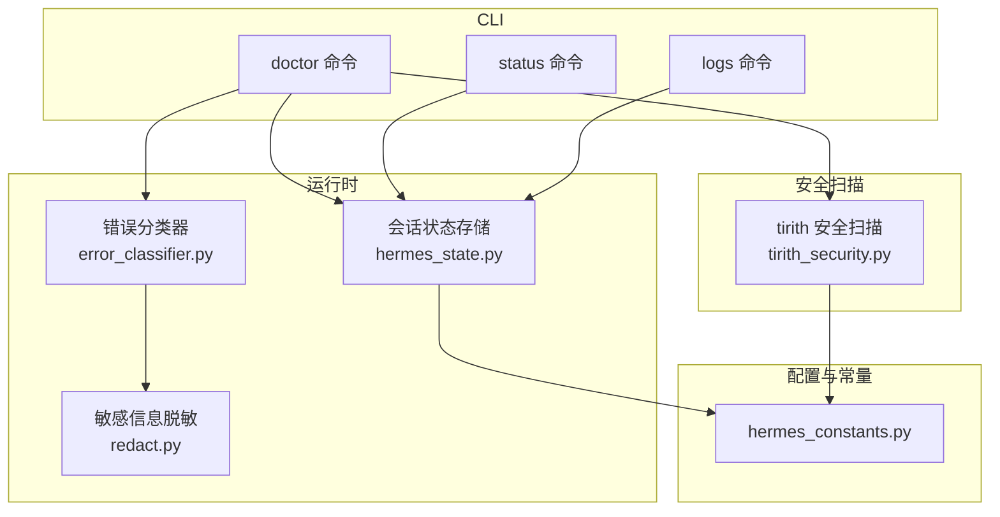
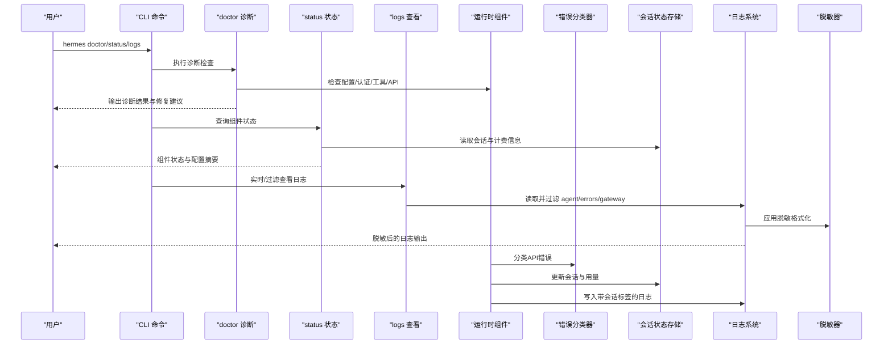
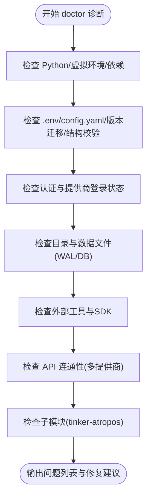
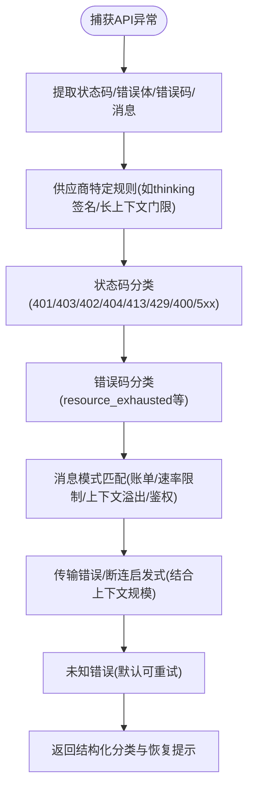
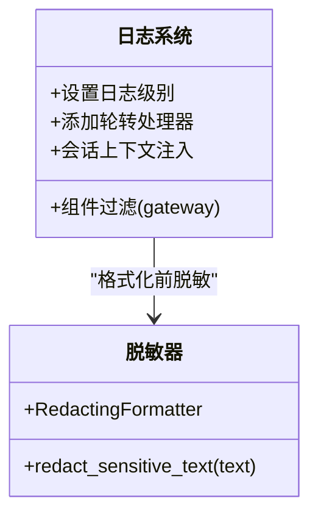
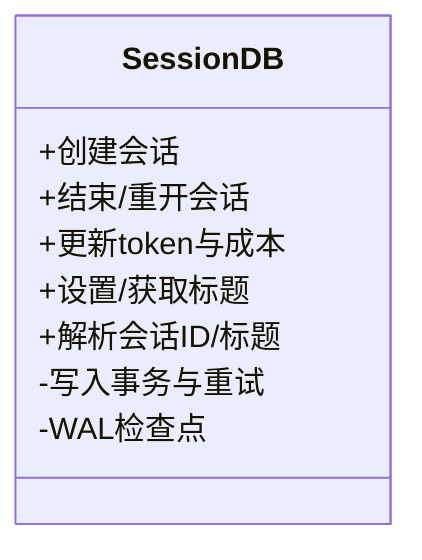
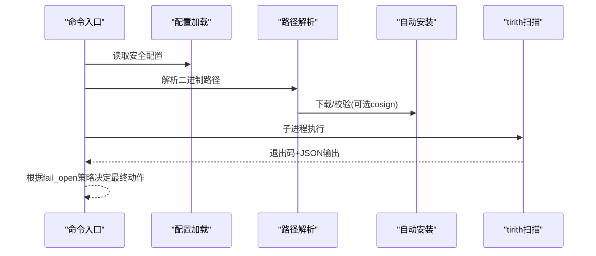
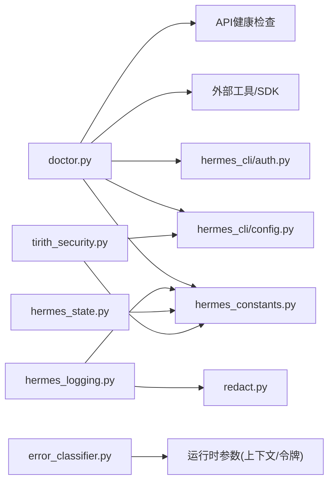

# 安全审计与监控

<cite>
**本文引用的文件**
- [doctor.py](file://hermes_cli/doctor.py)
- [error_classifier.py](file://agent/error_classifier.py)
- [hermes_logging.py](file://hermes_logging.py)
- [hermes_state.py](file://hermes_state.py)
- [hermes_constants.py](file://hermes_constants.py)
- [logs.py](file://hermes_cli/logs.py)
- [status.py](file://hermes_cli/status.py)
- [redact.py](file://agent/redact.py)
- [tirith_security.py](file://tools/tirith_security.py)
- [SKILL.md](file://skills/software-development/requesting-code-review/SKILL.md)
</cite>

## 目录
1. [简介](#简介)
2. [项目结构](#项目结构)
3. [核心组件](#核心组件)
4. [架构总览](#架构总览)
5. [详细组件分析](#详细组件分析)
6. [依赖分析](#依赖分析)
7. [性能考虑](#性能考虑)
8. [故障排查指南](#故障排查指南)
9. [结论](#结论)
10. [附录](#附录)

## 简介
本指南面向Hermes Agent的安全审计与监控体系，围绕内置健康检查与诊断（doctor命令）、错误分类与异常监控、日志分析与安全事件检测、定期安全审计流程与工具、安全事件响应流程以及合规性与安全基线验证方法展开。文档以仓库中现有实现为依据，结合可操作的实践建议，帮助读者建立系统化的安全可观测性与风险处置能力。

## 项目结构
Hermes Agent在CLI、运行时、日志与状态存储、安全扫描等层面提供了丰富的安全观测与治理能力：
- CLI层：doctor（诊断）、status（状态）、logs（日志查看）
- 运行时：错误分类与恢复策略、会话状态持久化、敏感信息脱敏
- 安全扫描：tirith命令预执行扫描（可选）
- 配置与常量：集中化路径与网络偏好设置

**图表来源**
- [doctor.py:162-800](file://hermes_cli/doctor.py#L162-L800)
- [error_classifier.py:222-395](file://agent/error_classifier.py#L222-L395)
- [hermes_state.py:115-350](file://hermes_state.py#L115-L350)
- [redact.py:113-182](file://agent/redact.py#L113-L182)
- [tirith_security.py:68-88](file://tools/tirith_security.py#L68-L88)
- [hermes_constants.py:11-57](file://hermes_constants.py#L11-L57)

**章节来源**
- [doctor.py:162-800](file://hermes_cli/doctor.py#L162-L800)
- [status.py:85-476](file://hermes_cli/status.py#L85-L476)
- [logs.py:138-391](file://hermes_cli/logs.py#L138-L391)
- [hermes_state.py:115-350](file://hermes_state.py#L115-L350)
- [hermes_logging.py:161-266](file://hermes_logging.py#L161-L266)
- [redact.py:113-182](file://agent/redact.py#L113-L182)
- [tirith_security.py:68-88](file://tools/tirith_security.py#L68-L88)
- [hermes_constants.py:11-57](file://hermes_constants.py#L11-L57)

## 核心组件
- doctor命令：对环境、配置、认证、目录结构、外部工具、API连通性、子模块等进行系统性诊断，并支持自动修复建议与问题汇总。
- 错误分类器：对API错误进行结构化分类，指导重试、凭证轮换、降级或压缩上下文等恢复动作。
- 日志系统：统一日志格式、按组件路由、轮转与脱敏，支持会话上下文标记，便于快速定位与关联。
- 会话状态存储：SQLite + WAL + FTS5，支持并发写入与全文检索，提供会话生命周期管理与成本统计字段。
- 敏感信息脱敏：基于正则的密钥、令牌、数据库连接串等脱敏，保障日志与输出安全。
- Tirith安全扫描：可选的命令预执行扫描，支持失败开/关策略与自动安装校验。
- 常量与配置：集中化路径解析、网络偏好（IPv4优先）等，确保部署一致性与可审计性。

**章节来源**
- [doctor.py:162-800](file://hermes_cli/doctor.py#L162-L800)
- [error_classifier.py:222-395](file://agent/error_classifier.py#L222-L395)
- [hermes_logging.py:161-266](file://hermes_logging.py#L161-L266)
- [hermes_state.py:115-350](file://hermes_state.py#L115-L350)
- [redact.py:113-182](file://agent/redact.py#L113-L182)
- [tirith_security.py:68-88](file://tools/tirith_security.py#L68-L88)
- [hermes_constants.py:253-293](file://hermes_constants.py#L253-L293)

## 架构总览
下图展示安全审计与监控的关键交互：CLI命令驱动诊断与状态查询；运行时通过错误分类与状态存储支撑可观测性；日志系统与脱敏组件贯穿全链路；可选的安全扫描在命令执行前进行威胁检测。

**图表来源**
- [doctor.py:162-800](file://hermes_cli/doctor.py#L162-L800)
- [status.py:85-476](file://hermes_cli/status.py#L85-L476)
- [logs.py:138-391](file://hermes_cli/logs.py#L138-L391)
- [error_classifier.py:222-395](file://agent/error_classifier.py#L222-L395)
- [hermes_state.py:430-500](file://hermes_state.py#L430-L500)
- [hermes_logging.py:224-254](file://hermes_logging.py#L224-L254)
- [redact.py:173-182](file://agent/redact.py#L173-L182)

## 详细组件分析

### Doctor 健康检查与诊断
- 环境与包：Python版本、虚拟环境、必要/可选依赖。
- 配置与文件：~/.hermes/.env、config.yaml、版本迁移与结构校验、根级过时键迁移。
- 认证与提供商：Nous Portal、OpenAI Codex登录状态；codex CLI可用性。
- 目录与数据：~/.hermes 子目录、SOUL.md、memories目录、state.db与WAL大小检查。
- 外部工具：git、ripgrep、Docker、SSH、Daytona、Node.js与agent-browser、npm audit。
- API连通性：OpenRouter、Anthropic、多家API-Key提供商模型端点健康检查。
- 子模块：tinker-atropos存在性与安装要求。

**图表来源**
- [doctor.py:162-800](file://hermes_cli/doctor.py#L162-L800)

**章节来源**
- [doctor.py:162-800](file://hermes_cli/doctor.py#L162-L800)

### 错误分类与异常监控
- 分类维度：认证/授权、账单/配额、服务器错误、传输超时、上下文溢出/负载过大、模型不存在、请求格式错误、供应商特定问题、未知。
- 结构化输出：包含原因、状态码、提供商/模型、消息与恢复提示（是否可重试、是否压缩上下文、是否轮换凭证、是否降级）。
- 恢复策略：优先级处理（供应商特定→状态码→错误码→消息→传输→断连+大会话→未知），结合令牌数、上下文长度与消息数量进行启发式判断。

**图表来源**
- [error_classifier.py:222-395](file://agent/error_classifier.py#L222-L395)

**章节来源**
- [error_classifier.py:222-395](file://agent/error_classifier.py#L222-L395)

### 日志系统与脱敏
- 文件与路由：agent.log（主活动）、errors.log（警告及以上）、gateway.log（网关组件，仅在gateway模式启用）。
- 格式与过滤：统一格式含时间戳、级别、会话标签、记录器名与消息；按组件过滤；支持会话上下文注入。
- 脱敏：对API Key、Token、数据库连接串、私钥块、电话号码等进行掩码处理。
- 轮转与权限：RotatingFileHandler，受管模式下确保组可读写权限；支持配置化轮转大小与备份数。

**图表来源**
- [hermes_logging.py:161-266](file://hermes_logging.py#L161-L266)
- [redact.py:113-182](file://agent/redact.py#L113-L182)

**章节来源**
- [hermes_logging.py:161-266](file://hermes_logging.py#L161-L266)
- [redact.py:113-182](file://agent/redact.py#L113-L182)

### 会话状态存储与成本追踪
- 数据库：SQLite + WAL，支持并发读写；FTS5全文检索；schema版本迁移与触发器维护。
- 写入优化：短超时+应用层随机抖动重试，避免SQLite内置忙等待；周期性PASSIVE checkpoint。
- 字段覆盖：输入/输出token、缓存读写token、推理token、账单提供商/URL/模式、估算/实际费用、定价版本、会话标题等。
- 会话生命周期：创建、结束、重开、系统提示更新、标题清洗与唯一性约束、父子会话链。

**图表来源**
- [hermes_state.py:115-350](file://hermes_state.py#L115-L350)

**章节来源**
- [hermes_state.py:115-350](file://hermes_state.py#L115-L350)

### 安全扫描（可选）
- 配置：从config.yaml加载，支持环境变量覆盖；可控制启用、二进制路径、超时、失败开/关策略。
- 自动安装：按平台目标三元组下载发布包，HTTPS+SHA-256校验；若存在cosign，则附加供应链证明校验；失败持久化标记避免频繁重试。
- 扫描：子进程调用tirith，退出码决定允许/阻止/警告；JSON输出用于丰富发现摘要；失败开/关策略决定异常场景下的默认行为。

**图表来源**
- [tirith_security.py:68-88](file://tools/tirith_security.py#L68-L88)
- [tirith_security.py:596-604](file://tools/tirith_security.py#L596-L604)

**章节来源**
- [tirith_security.py:68-88](file://tools/tirith_security.py#L68-L88)
- [tirith_security.py:596-604](file://tools/tirith_security.py#L596-L604)

### 常量与网络偏好
- 路径解析：HERMES_HOME、config.yaml、logs目录、skills目录、.env等统一解析，支持profile布局与自定义路径。
- 网络偏好：在IPv6不可达或不稳定环境下，可强制IPv4优先解析，减少DNS解析阻塞。

**章节来源**
- [hermes_constants.py:11-57](file://hermes_constants.py#L11-L57)
- [hermes_constants.py:253-293](file://hermes_constants.py#L253-L293)

## 依赖分析
- doctor命令依赖：配置解析、认证状态、外部工具探测、API健康检查、子模块存在性检查、日志与状态路径解析。
- 错误分类器依赖：HTTP状态码、错误体、错误码、消息文本、上下文规模与消息数量。
- 日志系统依赖：配置读取、组件过滤、脱敏格式化、文件轮转与权限。
- 会话状态存储依赖：SQLite连接、WAL模式、FTS触发器、schema版本迁移。
- 安全扫描依赖：配置加载、平台目标三元组、下载与校验、子进程调用与失败策略。

**图表来源**
- [doctor.py:162-800](file://hermes_cli/doctor.py#L162-L800)
- [error_classifier.py:222-395](file://agent/error_classifier.py#L222-L395)
- [hermes_logging.py:161-266](file://hermes_logging.py#L161-L266)
- [hermes_state.py:115-350](file://hermes_state.py#L115-L350)
- [tirith_security.py:68-88](file://tools/tirith_security.py#L68-L88)
- [hermes_constants.py:11-57](file://hermes_constants.py#L11-L57)

**章节来源**
- [doctor.py:162-800](file://hermes_cli/doctor.py#L162-L800)
- [error_classifier.py:222-395](file://agent/error_classifier.py#L222-L395)
- [hermes_logging.py:161-266](file://hermes_logging.py#L161-L266)
- [hermes_state.py:115-350](file://hermes_state.py#L115-L350)
- [tirith_security.py:68-88](file://tools/tirith_security.py#L68-L88)
- [hermes_constants.py:11-57](file://hermes_constants.py#L11-L57)

## 性能考虑
- doctor命令：对磁盘与网络检查采用最小化探测，避免阻塞；对可选依赖与工具采用“存在即OK”的快速路径。
- 错误分类器：优先状态码与错误码，次消息模式匹配，最后传输/断连启发式，减少正则匹配开销。
- 日志系统：轮转与脱敏在格式化阶段完成，避免重复处理；组件过滤减少无关日志写入。
- 会话状态存储：WAL+短超时+随机抖动重试降低写入争用；定期checkpoint缓解WAL膨胀。
- 安全扫描：失败开/关策略在异常情况下不阻塞；自动安装后台线程避免启动阻塞。

[本节为通用性能讨论，无需具体文件引用]

## 故障排查指南
- 使用doctor命令生成诊断报告，关注缺失的配置文件、未安装的可选依赖、未配置的API Key、未启用的系统服务（如systemd linger）、Docker/SSH/Daytona配置、Node.js与agent-browser状态、npm依赖漏洞。
- 使用status命令核对认证状态、提供商有效性、终端后端配置、消息平台令牌、网关服务状态与计划任务数量。
- 使用logs命令筛选级别、会话、组件与相对时间范围，结合errors.log快速定位问题；必要时开启verbose模式查看更详细输出。
- 若出现上下文溢出或负载过大导致的错误，参考错误分类器的恢复提示，优先压缩上下文或切换模型；若为传输超时，检查网络与代理设置。
- 对于API连通性问题，先确认API Key有效与网络可达，再逐个提供商检查其模型端点；对402错误需区分账单耗尽与瞬时配额限制。
- 对于日志中出现的敏感信息泄露迹象，确认脱敏器已启用且未被禁用；检查配置项与环境变量。

**章节来源**
- [doctor.py:162-800](file://hermes_cli/doctor.py#L162-L800)
- [status.py:85-476](file://hermes_cli/status.py#L85-L476)
- [logs.py:138-391](file://hermes_cli/logs.py#L138-L391)
- [error_classifier.py:222-395](file://agent/error_classifier.py#L222-L395)
- [hermes_logging.py:161-266](file://hermes_logging.py#L161-L266)
- [redact.py:113-182](file://agent/redact.py#L113-L182)

## 结论
Hermes Agent在CLI诊断、运行时错误分类、日志与脱敏、状态存储与成本追踪、可选安全扫描等方面形成了完整的安全可观测性基础。通过doctor/status/logs的日常巡检、错误分类器的智能恢复策略、严格的日志脱敏与组件化路由，以及可选的命令预执行扫描，能够有效识别与缓解潜在安全威胁。建议将这些能力纳入常规运维流程，并结合代码审查与渗透测试形成闭环。

[本节为总结性内容，无需具体文件引用]

## 附录

### 常用命令与用途
- hermes doctor [--fix]：系统性诊断与修复建议
- hermes status [--all|--deep]：组件状态与深度连通性检查
- hermes logs [-f] [--level|--session|--component|--since]：日志尾随与过滤
- hermes setup：初始化配置与环境

**章节来源**
- [doctor.py:162-800](file://hermes_cli/doctor.py#L162-L800)
- [status.py:85-476](file://hermes_cli/status.py#L85-L476)
- [logs.py:138-391](file://hermes_cli/logs.py#L138-L391)

### 错误分类与恢复建议对照
- 认证/授权失败：轮换凭证或切换提供商；若刷新后仍失败则中止
- 账单耗尽/配额限制：立即轮换凭证并降级；对瞬时配额应回退后重试
- 服务器错误/过载：指数回退后重试或降级
- 传输超时：重建客户端后重试
- 上下文溢出/负载过大：压缩上下文或分片处理
- 模型不存在：切换到可用模型
- 请求格式错误：修正请求或清理无效字段
- 未知错误：默认可重试，记录并上报

**章节来源**
- [error_classifier.py:222-395](file://agent/error_classifier.py#L222-L395)

### 日志分析与安全事件检测要点
- 关注errors.log中的警告与错误级别条目，结合会话标签定位具体会话
- 使用组件过滤（gateway、agent、tools、cli、cron）缩小排查范围
- 利用脱敏器避免日志中泄露敏感信息
- 对异常行为模式（如频繁429、大量上下文溢出、未知错误激增）建立阈值告警

**章节来源**
- [hermes_logging.py:161-266](file://hermes_logging.py#L161-L266)
- [logs.py:138-391](file://hermes_cli/logs.py#L138-L391)
- [redact.py:113-182](file://agent/redact.py#L113-L182)

### 定期安全审计流程与工具
- 代码审查清单（摘自技能文档要点）
  - 硬编码密钥/凭据检查
  - shell注入与危险函数（eval/exec/popen）
  - 不安全反序列化（pickle）
  - SQL注入（字符串格式化）
  - 输入验证、参数化查询、路径校验、异常处理
  - 提交前基线测试与静态检查（pytest/ruff/mypy/eslint/clippy等）
- 渗透测试指南（概念性建议）
  - 明确范围与授权；使用自动化与手工结合
  - 关注API端点、认证/会话、敏感数据暴露、命令注入、文件上传与路径遍历
  - 基于doctor/status/logs输出识别薄弱环节并重点验证

**章节来源**
- [SKILL.md:46-129](file://skills/software-development/requesting-code-review/SKILL.md#L46-L129)

### 安全事件响应流程
- 事件分类：依据错误分类器的reason与恢复提示进行初步归类
- 影响评估：结合会话状态存储的成本字段与日志中的会话标签，评估影响范围与资源消耗
- 修复措施：根据分类结果采取重试、轮换凭证、降级、压缩上下文、修复请求格式等
- 回归验证：通过status与logs确认修复生效；对关键变更执行基线测试

**章节来源**
- [error_classifier.py:222-395](file://agent/error_classifier.py#L222-L395)
- [hermes_state.py:430-500](file://hermes_state.py#L430-L500)
- [status.py:85-476](file://hermes_cli/status.py#L85-L476)
- [logs.py:138-391](file://hermes_cli/logs.py#L138-L391)

### 合规性检查与安全基线验证
- 路径与配置：统一HERMES_HOME布局，确保配置文件与日志目录存在且权限正确
- 网络与解析：在IPv6受限环境中启用IPv4优先，减少DNS解析延迟
- 日志与脱敏：确保所有日志输出均经过脱敏处理，避免敏感信息落盘
- 可选安全扫描：在生产环境启用tirith扫描并配置fail_open策略，平衡安全性与可用性

**章节来源**
- [hermes_constants.py:253-293](file://hermes_constants.py#L253-L293)
- [hermes_logging.py:161-266](file://hermes_logging.py#L161-L266)
- [redact.py:113-182](file://agent/redact.py#L113-L182)
- [tirith_security.py:68-88](file://tools/tirith_security.py#L68-L88)